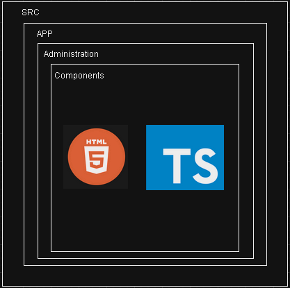

# Cotizador Docs

## Administración

### Ubicación Componentes Administracion

---

<h2>Parametrizar etapas logísticas por Incoterm </h2>

 

<h2>Parametrizar etapas logísticas por Incoterm informacion Formulario</h2>

 

### Metodo GET

- `https://transborderuat.eastus.cloudapp.azure.com/msadministracion/api/v1/parametrizacionIncoterm/byIdPais?idPais={idPais}`
  >***Note***: Parametro de la url idPais (number)

**Response**:

~~~
{
	"pais": null,
	"etapasLogisticas": [
		{
			"etapaEnum": "TRANSPORTE_TERRESTRE_ORIGEN",
			"incotermsPorEtapaLogistica": [
				{
					"id": "e16c6025-915e-4a17-ac6e-d3e193a5628d",
					"parametrizacionIncoterm": {
						"id": "2c16e343-2cd5-48c3-84fc-4a67d8cd77f2",
						"incoterm": "CFR",
						"pais": null,
						"tipoTransporte": "MARITIMO",
						"activo": true,
						"fechaCreacion": "2023-05-19T14:08:02.81",
						"usuarioCreacion": "hbtpruebas@transborderaduat.onmicrosoft.com",
						"etapasLogisticas": null
					},
					"etapaLogistica": "TRANSPORTE_TERRESTRE_ORIGEN",
					"perspectivaComprador": "NO_APLICA",
					"perspectivaVendedor": "POR_DEFECTO"
				},
				{
					"id": "e79df1aa-4085-4a59-aa82-fe3581018f1f",
					"parametrizacionIncoterm": {
						"id": "198cfc9f-c99d-434c-a5b3-90656a7c96d2",
						"incoterm": "DDP",
						"pais": null,
						"tipoTransporte": "MARITIMO",
						"activo": true,
						"fechaCreacion": "2023-05-19T14:08:02.807",
						"usuarioCreacion": "hbtpruebas@transborderaduat.onmicrosoft.com",
						"etapasLogisticas": null
					},
					"etapaLogistica": "TRANSPORTE_TERRESTRE_ORIGEN",
					"perspectivaComprador": "NO_APLICA",
					"perspectivaVendedor": "POR_DEFECTO"
				},
				{
					"id": "e74bb64b-b9ea-4667-899b-ac36d567560b",
					"parametrizacionIncoterm": {
						"id": "552f14d8-2531-4780-b529-a5dde766e593",
						"incoterm": "CIF",
						"pais": null,
						"tipoTransporte": "MARITIMO",
						"activo": true,
						"fechaCreacion": "2023-05-19T14:08:02.81",
						"usuarioCreacion": "hbtpruebas@transborderaduat.onmicrosoft.com",
						"etapasLogisticas": null
					},
					"etapaLogistica": "TRANSPORTE_TERRESTRE_ORIGEN",
					"perspectivaComprador": "NO_APLICA",
					"perspectivaVendedor": "POR_DEFECTO"
				},
				{
					"id": "d82d0154-8ca5-4a42-a1cf-2a3e987eb37f",
					"parametrizacionIncoterm": {
						"id": "320da347-8066-4e7d-83f8-adee6cad7f2b",
						"incoterm": "FCA",
						"pais": null,
						"tipoTransporte": "MARITIMO",
						"activo": true,
						"fechaCreacion": "2023-05-19T14:08:02.81",
						"usuarioCreacion": "hbtpruebas@transborderaduat.onmicrosoft.com",
						"etapasLogisticas": null
					},
					"etapaLogistica": "TRANSPORTE_TERRESTRE_ORIGEN",
					"perspectivaComprador": "ADICIONAL",
					"perspectivaVendedor": "POR_DEFECTO"
				},
				{
					"id": "df484dc2-89f2-46ed-a2dc-7ad4213b5901",
					"parametrizacionIncoterm": {
						"id": "4ce8dfc1-5172-436f-aac7-e64eb288e2c6",
						"incoterm": "EXW",
						"pais": null,
						"tipoTransporte": "MARITIMO",
						"activo": true,
						"fechaCreacion": "2023-05-19T14:08:02.81",
						"usuarioCreacion": "hbtpruebas@transborderaduat.onmicrosoft.com",
						"etapasLogisticas": null
					},
					"etapaLogistica": "TRANSPORTE_TERRESTRE_ORIGEN",
					"perspectivaComprador": "POR_DEFECTO",
					"perspectivaVendedor": "NO_APLICA"
				},
				{
					"id": "50a10ebc-9c0d-4eae-93bc-4461f082d2d7",
					"parametrizacionIncoterm": {
						"id": "c6d7c0cc-3b20-46ef-a006-e839e456ca7c",
						"incoterm": "DAP",
						"pais": null,
						"tipoTransporte": "MARITIMO",
						"activo": true,
						"fechaCreacion": "2023-05-19T14:08:02.81",
						"usuarioCreacion": "hbtpruebas@transborderaduat.onmicrosoft.com",
						"etapasLogisticas": null
					},
					"etapaLogistica": "TRANSPORTE_TERRESTRE_ORIGEN",
					"perspectivaComprador": "NO_APLICA",
					"perspectivaVendedor": "POR_DEFECTO"
				},
				{
					"id": "c4e13c7f-287f-468e-9b9d-40080a0a0ced",
					"parametrizacionIncoterm": {
						"id": "d8081265-526b-4384-ad32-fe28a59e53fb",
						"incoterm": "FOB",
						"pais": null,
						"tipoTransporte": "MARITIMO",
						"activo": true,
						"fechaCreacion": "2023-05-19T14:08:02.81",
						"usuarioCreacion": "hbtpruebas@transborderaduat.onmicrosoft.com",
						"etapasLogisticas": null
					},
					"etapaLogistica": "TRANSPORTE_TERRESTRE_ORIGEN",
					"perspectivaComprador": "NO_APLICA",
					"perspectivaVendedor": "POR_DEFECTO"
				}
			]
		},
		{
			"etapaEnum": "GASTOS_ORIGEN",
			"incotermsPorEtapaLogistica": [
				{
					"id": "5455fe28-82cb-4ed5-b832-0b490965d0a2",
					"parametrizacionIncoterm": {
						"id": "2c16e343-2cd5-48c3-84fc-4a67d8cd77f2",
						"incoterm": "CFR",
						"pais": null,
						"tipoTransporte": "MARITIMO",
						"activo": true,
						"fechaCreacion": "2023-05-19T14:08:02.81",
						"usuarioCreacion": "hbtpruebas@transborderaduat.onmicrosoft.com",
						"etapasLogisticas": null
					},
					"etapaLogistica": "GASTOS_ORIGEN",
					"perspectivaComprador": "NO_APLICA",
					"perspectivaVendedor": "POR_DEFECTO"
				},
				{
					"id": "39a6f196-94e8-4c34-a790-1451b65f606a",
					"parametrizacionIncoterm": {
						"id": "198cfc9f-c99d-434c-a5b3-90656a7c96d2",
						"incoterm": "DDP",
						"pais": null,
						"tipoTransporte": "MARITIMO",
						"activo": true,
						"fechaCreacion": "2023-05-19T14:08:02.807",
						"usuarioCreacion": "hbtpruebas@transborderaduat.onmicrosoft.com",
						"etapasLogisticas": null
					},
					"etapaLogistica": "GASTOS_ORIGEN",
					"perspectivaComprador": "NO_APLICA",
					"perspectivaVendedor": "POR_DEFECTO"
				},
				{
					"id": "119a4ffe-134d-4713-a8b2-7b9fa5027d07",
					"parametrizacionIncoterm": {
						"id": "552f14d8-2531-4780-b529-a5dde766e593",
						"incoterm": "CIF",
						"pais": null,
						"tipoTransporte": "MARITIMO",
						"activo": true,
						"fechaCreacion": "2023-05-19T14:08:02.81",
						"usuarioCreacion": "hbtpruebas@transborderaduat.onmicrosoft.com",
						"etapasLogisticas": null
					},
					"etapaLogistica": "GASTOS_ORIGEN",
					"perspectivaComprador": "NO_APLICA",
					"perspectivaVendedor": "POR_DEFECTO"
				},
				{
					"id": "87fe33fd-b350-4b9f-8148-77d6bba1868b",
					"parametrizacionIncoterm": {
						"id": "320da347-8066-4e7d-83f8-adee6cad7f2b",
						"incoterm": "FCA",
						"pais": null,
						"tipoTransporte": "MARITIMO",
						"activo": true,
						"fechaCreacion": "2023-05-19T14:08:02.81",
						"usuarioCreacion": "hbtpruebas@transborderaduat.onmicrosoft.com",
						"etapasLogisticas": null
					},
					"etapaLogistica": "GASTOS_ORIGEN",
					"perspectivaComprador": "POR_DEFECTO",
					"perspectivaVendedor": "POR_DEFECTO"
				},
				{
					"id": "950fa00d-d029-4ae2-bc07-e19ca56a6f66",
					"parametrizacionIncoterm": {
						"id": "4ce8dfc1-5172-436f-aac7-e64eb288e2c6",
						"incoterm": "EXW",
						"pais": null,
						"tipoTransporte": "MARITIMO",
						"activo": true,
						"fechaCreacion": "2023-05-19T14:08:02.81",
						"usuarioCreacion": "hbtpruebas@transborderaduat.onmicrosoft.com",
						"etapasLogisticas": null
					},
					"etapaLogistica": "GASTOS_ORIGEN",
					"perspectivaComprador": "POR_DEFECTO",
					"perspectivaVendedor": "NO_APLICA"
				},
				{
					"id": "2551993d-c8ad-476f-a095-0b4dc0a4507c",
					"parametrizacionIncoterm": {
						"id": "c6d7c0cc-3b20-46ef-a006-e839e456ca7c",
						"incoterm": "DAP",
						"pais": null,
						"tipoTransporte": "MARITIMO",
						"activo": true,
						"fechaCreacion": "2023-05-19T14:08:02.81",
						"usuarioCreacion": "hbtpruebas@transborderaduat.onmicrosoft.com",
						"etapasLogisticas": null
					},
					"etapaLogistica": "GASTOS_ORIGEN",
					"perspectivaComprador": "NO_APLICA",
					"perspectivaVendedor": "POR_DEFECTO"
				},
				{
					"id": "b48fa088-fc43-47bd-ac90-112cc80d03da",
					"parametrizacionIncoterm": {
						"id": "d8081265-526b-4384-ad32-fe28a59e53fb",
						"incoterm": "FOB",
						"pais": null,
						"tipoTransporte": "MARITIMO",
						"activo": true,
						"fechaCreacion": "2023-05-19T14:08:02.81",
						"usuarioCreacion": "hbtpruebas@transborderaduat.onmicrosoft.com",
						"etapasLogisticas": null
					},
					"etapaLogistica": "GASTOS_ORIGEN",
					"perspectivaComprador": "NO_APLICA",
					"perspectivaVendedor": "POR_DEFECTO"
				}
			]
		},
		{
			"etapaEnum": "RECARGOS_AL_FLETE_CARRIER_ORIGEN",
			"incotermsPorEtapaLogistica": [
				{
					"id": "752beea7-0c4b-4455-a30f-c1afafc83c9c",
					"parametrizacionIncoterm": {
						"id": "2c16e343-2cd5-48c3-84fc-4a67d8cd77f2",
						"incoterm": "CFR",
						"pais": null,
						"tipoTransporte": "MARITIMO",
						"activo": true,
						"fechaCreacion": "2023-05-19T14:08:02.81",
						"usuarioCreacion": "hbtpruebas@transborderaduat.onmicrosoft.com",
						"etapasLogisticas": null
					},
					"etapaLogistica": "RECARGOS_AL_FLETE_CARRIER_ORIGEN",
					"perspectivaComprador": "NO_APLICA",
					"perspectivaVendedor": "POR_DEFECTO"
				},
				{
					"id": "02ffec86-6710-4979-8269-d2f0db982d70",
					"parametrizacionIncoterm": {
						"id": "198cfc9f-c99d-434c-a5b3-90656a7c96d2",
						"incoterm": "DDP",
						"pais": null,
						"tipoTransporte": "MARITIMO",
						"activo": true,
						"fechaCreacion": "2023-05-19T14:08:02.807",
						"usuarioCreacion": "hbtpruebas@transborderaduat.onmicrosoft.com",
						"etapasLogisticas": null
					},
					"etapaLogistica": "RECARGOS_AL_FLETE_CARRIER_ORIGEN",
					"perspectivaComprador": "NO_APLICA",
					"perspectivaVendedor": "POR_DEFECTO"
				},
				{
					"id": "5631953a-c4a0-44df-bc16-19e30b0e67e0",
					"parametrizacionIncoterm": {
						"id": "552f14d8-2531-4780-b529-a5dde766e593",
						"incoterm": "CIF",
						"pais": null,
						"tipoTransporte": "MARITIMO",
						"activo": true,
						"fechaCreacion": "2023-05-19T14:08:02.81",
						"usuarioCreacion": "hbtpruebas@transborderaduat.onmicrosoft.com",
						"etapasLogisticas": null
					},
					"etapaLogistica": "RECARGOS_AL_FLETE_CARRIER_ORIGEN",
					"perspectivaComprador": "NO_APLICA",
					"perspectivaVendedor": "POR_DEFECTO"
				},
				{
					"id": "8040b7b5-5b3a-464e-bec6-148373b61fcf",
					"parametrizacionIncoterm": {
						"id": "320da347-8066-4e7d-83f8-adee6cad7f2b",
						"incoterm": "FCA",
						"pais": null,
						"tipoTransporte": "MARITIMO",
						"activo": true,
						"fechaCreacion": "2023-05-19T14:08:02.81",
						"usuarioCreacion": "hbtpruebas@transborderaduat.onmicrosoft.com",
						"etapasLogisticas": null
					},
					"etapaLogistica": "RECARGOS_AL_FLETE_CARRIER_ORIGEN",
					"perspectivaComprador": "POR_DEFECTO",
					"perspectivaVendedor": "POR_DEFECTO"
				},
				{
					"id": "7438e830-8c40-4839-8138-3e74815113e6",
					"parametrizacionIncoterm": {
						"id": "4ce8dfc1-5172-436f-aac7-e64eb288e2c6",
						"incoterm": "EXW",
						"pais": null,
						"tipoTransporte": "MARITIMO",
						"activo": true,
						"fechaCreacion": "2023-05-19T14:08:02.81",
						"usuarioCreacion": "hbtpruebas@transborderaduat.onmicrosoft.com",
						"etapasLogisticas": null
					},
					"etapaLogistica": "RECARGOS_AL_FLETE_CARRIER_ORIGEN",
					"perspectivaComprador": "POR_DEFECTO",
					"perspectivaVendedor": "NO_APLICA"
				},
				{
					"id": "a6d04b4a-7a0d-4b30-9a23-65d662c1093f",
					"parametrizacionIncoterm": {
						"id": "c6d7c0cc-3b20-46ef-a006-e839e456ca7c",
						"incoterm": "DAP",
						"pais": null,
						"tipoTransporte": "MARITIMO",
						"activo": true,
						"fechaCreacion": "2023-05-19T14:08:02.81",
						"usuarioCreacion": "hbtpruebas@transborderaduat.onmicrosoft.com",
						"etapasLogisticas": null
					},
					"etapaLogistica": "RECARGOS_AL_FLETE_CARRIER_ORIGEN",
					"perspectivaComprador": "NO_APLICA",
					"perspectivaVendedor": "POR_DEFECTO"
				},
				{
					"id": "59cba708-1329-4d02-a267-921e5082c931",
					"parametrizacionIncoterm": {
						"id": "d8081265-526b-4384-ad32-fe28a59e53fb",
						"incoterm": "FOB",
						"pais": null,
						"tipoTransporte": "MARITIMO",
						"activo": true,
						"fechaCreacion": "2023-05-19T14:08:02.81",
						"usuarioCreacion": "hbtpruebas@transborderaduat.onmicrosoft.com",
						"etapasLogisticas": null
					},
					"etapaLogistica": "RECARGOS_AL_FLETE_CARRIER_ORIGEN",
					"perspectivaComprador": "NO_APLICA",
					"perspectivaVendedor": "POR_DEFECTO"
				}
			]
		},
		{
			"etapaEnum": "FLETES_INTERNACIONALES",
			"incotermsPorEtapaLogistica": [
				{
					"id": "fe9b0f27-4de7-45c9-bc3c-ad49897c546a",
					"parametrizacionIncoterm": {
						"id": "2c16e343-2cd5-48c3-84fc-4a67d8cd77f2",
						"incoterm": "CFR",
						"pais": null,
						"tipoTransporte": "MARITIMO",
						"activo": true,
						"fechaCreacion": "2023-05-19T14:08:02.81",
						"usuarioCreacion": "hbtpruebas@transborderaduat.onmicrosoft.com",
						"etapasLogisticas": null
					},
					"etapaLogistica": "FLETES_INTERNACIONALES",
					"perspectivaComprador": "NO_APLICA",
					"perspectivaVendedor": "POR_DEFECTO"
				},
				{
					"id": "0cc580d0-bed0-403d-b094-36bbaaa9ece6",
					"parametrizacionIncoterm": {
						"id": "198cfc9f-c99d-434c-a5b3-90656a7c96d2",
						"incoterm": "DDP",
						"pais": null,
						"tipoTransporte": "MARITIMO",
						"activo": true,
						"fechaCreacion": "2023-05-19T14:08:02.807",
						"usuarioCreacion": "hbtpruebas@transborderaduat.onmicrosoft.com",
						"etapasLogisticas": null
					},
					"etapaLogistica": "FLETES_INTERNACIONALES",
					"perspectivaComprador": "NO_APLICA",
					"perspectivaVendedor": "POR_DEFECTO"
				},
				{
					"id": "3b701b4e-6bf3-4e12-a465-21d9e5b5e53d",
					"parametrizacionIncoterm": {
						"id": "552f14d8-2531-4780-b529-a5dde766e593",
						"incoterm": "CIF",
						"pais": null,
						"tipoTransporte": "MARITIMO",
						"activo": true,
						"fechaCreacion": "2023-05-19T14:08:02.81",
						"usuarioCreacion": "hbtpruebas@transborderaduat.onmicrosoft.com",
						"etapasLogisticas": null
					},
					"etapaLogistica": "FLETES_INTERNACIONALES",
					"perspectivaComprador": "NO_APLICA",
					"perspectivaVendedor": "POR_DEFECTO"
				},
				{
					"id": "d6028d54-d3a9-47c9-939d-1186b643c0c8",
					"parametrizacionIncoterm": {
						"id": "320da347-8066-4e7d-83f8-adee6cad7f2b",
						"incoterm": "FCA",
						"pais": null,
						"tipoTransporte": "MARITIMO",
						"activo": true,
						"fechaCreacion": "2023-05-19T14:08:02.81",
						"usuarioCreacion": "hbtpruebas@transborderaduat.onmicrosoft.com",
						"etapasLogisticas": null
					},
					"etapaLogistica": "FLETES_INTERNACIONALES",
					"perspectivaComprador": "POR_DEFECTO",
					"perspectivaVendedor": "NO_APLICA"
				},
				{
					"id": "286333de-a603-49d3-a656-e9579c9f5d3f",
					"parametrizacionIncoterm": {
						"id": "4ce8dfc1-5172-436f-aac7-e64eb288e2c6",
						"incoterm": "EXW",
						"pais": null,
						"tipoTransporte": "MARITIMO",
						"activo": true,
						"fechaCreacion": "2023-05-19T14:08:02.81",
						"usuarioCreacion": "hbtpruebas@transborderaduat.onmicrosoft.com",
						"etapasLogisticas": null
					},
					"etapaLogistica": "FLETES_INTERNACIONALES",
					"perspectivaComprador": "POR_DEFECTO",
					"perspectivaVendedor": "NO_APLICA"
				},
				{
					"id": "af568a6f-4b8c-43a9-9fac-4fa40befb6a6",
					"parametrizacionIncoterm": {
						"id": "c6d7c0cc-3b20-46ef-a006-e839e456ca7c",
						"incoterm": "DAP",
						"pais": null,
						"tipoTransporte": "MARITIMO",
						"activo": true,
						"fechaCreacion": "2023-05-19T14:08:02.81",
						"usuarioCreacion": "hbtpruebas@transborderaduat.onmicrosoft.com",
						"etapasLogisticas": null
					},
					"etapaLogistica": "FLETES_INTERNACIONALES",
					"perspectivaComprador": "NO_APLICA",
					"perspectivaVendedor": "POR_DEFECTO"
				},
				{
					"id": "a49bc28a-d6e4-4f8b-8a0d-3ce96ee1a9e4",
					"parametrizacionIncoterm": {
						"id": "d8081265-526b-4384-ad32-fe28a59e53fb",
						"incoterm": "FOB",
						"pais": null,
						"tipoTransporte": "MARITIMO",
						"activo": true,
						"fechaCreacion": "2023-05-19T14:08:02.81",
						"usuarioCreacion": "hbtpruebas@transborderaduat.onmicrosoft.com",
						"etapasLogisticas": null
					},
					"etapaLogistica": "FLETES_INTERNACIONALES",
					"perspectivaComprador": "POR_DEFECTO",
					"perspectivaVendedor": "NO_APLICA"
				}
			]
		},
		{
			"etapaEnum": "RECARGOS_AL_FLETE_CARRIER_DESTINO",
			"incotermsPorEtapaLogistica": [
				{
					"id": "c2cb282f-1c01-4b56-aacc-50090099f65a",
					"parametrizacionIncoterm": {
						"id": "2c16e343-2cd5-48c3-84fc-4a67d8cd77f2",
						"incoterm": "CFR",
						"pais": null,
						"tipoTransporte": "MARITIMO",
						"activo": true,
						"fechaCreacion": "2023-05-19T14:08:02.81",
						"usuarioCreacion": "hbtpruebas@transborderaduat.onmicrosoft.com",
						"etapasLogisticas": null
					},
					"etapaLogistica": "RECARGOS_AL_FLETE_CARRIER_DESTINO",
					"perspectivaComprador": "POR_DEFECTO",
					"perspectivaVendedor": "ADICIONAL"
				},
				{
					"id": "487f99f3-c64c-4581-ba98-48c0c575d805",
					"parametrizacionIncoterm": {
						"id": "198cfc9f-c99d-434c-a5b3-90656a7c96d2",
						"incoterm": "DDP",
						"pais": null,
						"tipoTransporte": "MARITIMO",
						"activo": true,
						"fechaCreacion": "2023-05-19T14:08:02.807",
						"usuarioCreacion": "hbtpruebas@transborderaduat.onmicrosoft.com",
						"etapasLogisticas": null
					},
					"etapaLogistica": "RECARGOS_AL_FLETE_CARRIER_DESTINO",
					"perspectivaComprador": "NO_APLICA",
					"perspectivaVendedor": "POR_DEFECTO"
				},
				{
					"id": "f4bcd25d-44b7-47c9-9a0f-f53742e21079",
					"parametrizacionIncoterm": {
						"id": "552f14d8-2531-4780-b529-a5dde766e593",
						"incoterm": "CIF",
						"pais": null,
						"tipoTransporte": "MARITIMO",
						"activo": true,
						"fechaCreacion": "2023-05-19T14:08:02.81",
						"usuarioCreacion": "hbtpruebas@transborderaduat.onmicrosoft.com",
						"etapasLogisticas": null
					},
					"etapaLogistica": "RECARGOS_AL_FLETE_CARRIER_DESTINO",
					"perspectivaComprador": "POR_DEFECTO",
					"perspectivaVendedor": "ADICIONAL"
				},
				{
					"id": "7f94d224-1013-4092-9ec3-43431b5cf7fa",
					"parametrizacionIncoterm": {
						"id": "320da347-8066-4e7d-83f8-adee6cad7f2b",
						"incoterm": "FCA",
						"pais": null,
						"tipoTransporte": "MARITIMO",
						"activo": true,
						"fechaCreacion": "2023-05-19T14:08:02.81",
						"usuarioCreacion": "hbtpruebas@transborderaduat.onmicrosoft.com",
						"etapasLogisticas": null
					},
					"etapaLogistica": "RECARGOS_AL_FLETE_CARRIER_DESTINO",
					"perspectivaComprador": "POR_DEFECTO",
					"perspectivaVendedor": "NO_APLICA"
				},
				{
					"id": "b109c506-7b7d-476b-9a40-bf2e91098800",
					"parametrizacionIncoterm": {
						"id": "4ce8dfc1-5172-436f-aac7-e64eb288e2c6",
						"incoterm": "EXW",
						"pais": null,
						"tipoTransporte": "MARITIMO",
						"activo": true,
						"fechaCreacion": "2023-05-19T14:08:02.81",
						"usuarioCreacion": "hbtpruebas@transborderaduat.onmicrosoft.com",
						"etapasLogisticas": null
					},
					"etapaLogistica": "RECARGOS_AL_FLETE_CARRIER_DESTINO",
					"perspectivaComprador": "POR_DEFECTO",
					"perspectivaVendedor": "NO_APLICA"
				},
				{
					"id": "798ff7cd-5842-465c-a0c5-a8bc0f5ce90c",
					"parametrizacionIncoterm": {
						"id": "c6d7c0cc-3b20-46ef-a006-e839e456ca7c",
						"incoterm": "DAP",
						"pais": null,
						"tipoTransporte": "MARITIMO",
						"activo": true,
						"fechaCreacion": "2023-05-19T14:08:02.81",
						"usuarioCreacion": "hbtpruebas@transborderaduat.onmicrosoft.com",
						"etapasLogisticas": null
					},
					"etapaLogistica": "RECARGOS_AL_FLETE_CARRIER_DESTINO",
					"perspectivaComprador": "NO_APLICA",
					"perspectivaVendedor": "POR_DEFECTO"
				},
				{
					"id": "ea127cda-50ac-4dfd-b52b-3e705d93bdd3",
					"parametrizacionIncoterm": {
						"id": "d8081265-526b-4384-ad32-fe28a59e53fb",
						"incoterm": "FOB",
						"pais": null,
						"tipoTransporte": "MARITIMO",
						"activo": true,
						"fechaCreacion": "2023-05-19T14:08:02.81",
						"usuarioCreacion": "hbtpruebas@transborderaduat.onmicrosoft.com",
						"etapasLogisticas": null
					},
					"etapaLogistica": "RECARGOS_AL_FLETE_CARRIER_DESTINO",
					"perspectivaComprador": "POR_DEFECTO",
					"perspectivaVendedor": "NO_APLICA"
				}
			]
		},
		{
			"etapaEnum": "GASTOS_DESTINO",
			"incotermsPorEtapaLogistica": [
				{
					"id": "a0036591-3787-44ef-9ce6-46911b63cbff",
					"parametrizacionIncoterm": {
						"id": "2c16e343-2cd5-48c3-84fc-4a67d8cd77f2",
						"incoterm": "CFR",
						"pais": null,
						"tipoTransporte": "MARITIMO",
						"activo": true,
						"fechaCreacion": "2023-05-19T14:08:02.81",
						"usuarioCreacion": "hbtpruebas@transborderaduat.onmicrosoft.com",
						"etapasLogisticas": null
					},
					"etapaLogistica": "GASTOS_DESTINO",
					"perspectivaComprador": "ADICIONAL",
					"perspectivaVendedor": "NO_APLICA"
				},
				{
					"id": "f28d0d25-0078-489d-8aef-c4b1670454d1",
					"parametrizacionIncoterm": {
						"id": "198cfc9f-c99d-434c-a5b3-90656a7c96d2",
						"incoterm": "DDP",
						"pais": null,
						"tipoTransporte": "MARITIMO",
						"activo": true,
						"fechaCreacion": "2023-05-19T14:08:02.807",
						"usuarioCreacion": "hbtpruebas@transborderaduat.onmicrosoft.com",
						"etapasLogisticas": null
					},
					"etapaLogistica": "GASTOS_DESTINO",
					"perspectivaComprador": "NO_APLICA",
					"perspectivaVendedor": "POR_DEFECTO"
				},
				{
					"id": "997da6a5-c67b-46e7-a06f-5f9e11683b10",
					"parametrizacionIncoterm": {
						"id": "552f14d8-2531-4780-b529-a5dde766e593",
						"incoterm": "CIF",
						"pais": null,
						"tipoTransporte": "MARITIMO",
						"activo": true,
						"fechaCreacion": "2023-05-19T14:08:02.81",
						"usuarioCreacion": "hbtpruebas@transborderaduat.onmicrosoft.com",
						"etapasLogisticas": null
					},
					"etapaLogistica": "GASTOS_DESTINO",
					"perspectivaComprador": "ADICIONAL",
					"perspectivaVendedor": "NO_APLICA"
				},
				{
					"id": "c1d682fd-c4ac-418e-a600-e639c8e6eaa6",
					"parametrizacionIncoterm": {
						"id": "320da347-8066-4e7d-83f8-adee6cad7f2b",
						"incoterm": "FCA",
						"pais": null,
						"tipoTransporte": "MARITIMO",
						"activo": true,
						"fechaCreacion": "2023-05-19T14:08:02.81",
						"usuarioCreacion": "hbtpruebas@transborderaduat.onmicrosoft.com",
						"etapasLogisticas": null
					},
					"etapaLogistica": "GASTOS_DESTINO",
					"perspectivaComprador": "ADICIONAL",
					"perspectivaVendedor": "NO_APLICA"
				},
				{
					"id": "ef13d415-1703-4773-87c5-11aff005a89e",
					"parametrizacionIncoterm": {
						"id": "4ce8dfc1-5172-436f-aac7-e64eb288e2c6",
						"incoterm": "EXW",
						"pais": null,
						"tipoTransporte": "MARITIMO",
						"activo": true,
						"fechaCreacion": "2023-05-19T14:08:02.81",
						"usuarioCreacion": "hbtpruebas@transborderaduat.onmicrosoft.com",
						"etapasLogisticas": null
					},
					"etapaLogistica": "GASTOS_DESTINO",
					"perspectivaComprador": "ADICIONAL",
					"perspectivaVendedor": "NO_APLICA"
				},
				{
					"id": "da4df67e-3bf1-453e-a8af-f439cb194a59",
					"parametrizacionIncoterm": {
						"id": "c6d7c0cc-3b20-46ef-a006-e839e456ca7c",
						"incoterm": "DAP",
						"pais": null,
						"tipoTransporte": "MARITIMO",
						"activo": true,
						"fechaCreacion": "2023-05-19T14:08:02.81",
						"usuarioCreacion": "hbtpruebas@transborderaduat.onmicrosoft.com",
						"etapasLogisticas": null
					},
					"etapaLogistica": "GASTOS_DESTINO",
					"perspectivaComprador": "ADICIONAL",
					"perspectivaVendedor": "ADICIONAL"
				},
				{
					"id": "a6c415b6-3f51-4874-b001-990aa09c81d0",
					"parametrizacionIncoterm": {
						"id": "d8081265-526b-4384-ad32-fe28a59e53fb",
						"incoterm": "FOB",
						"pais": null,
						"tipoTransporte": "MARITIMO",
						"activo": true,
						"fechaCreacion": "2023-05-19T14:08:02.81",
						"usuarioCreacion": "hbtpruebas@transborderaduat.onmicrosoft.com",
						"etapasLogisticas": null
					},
					"etapaLogistica": "GASTOS_DESTINO",
					"perspectivaComprador": "ADICIONAL",
					"perspectivaVendedor": "NO_APLICA"
				}
			]
		},
		{
			"etapaEnum": "TRANSPORTE_TERRESTRE_DESTINO",
			"incotermsPorEtapaLogistica": [
				{
					"id": "2b047a46-8147-4877-8a1e-5faad6481866",
					"parametrizacionIncoterm": {
						"id": "2c16e343-2cd5-48c3-84fc-4a67d8cd77f2",
						"incoterm": "CFR",
						"pais": null,
						"tipoTransporte": "MARITIMO",
						"activo": true,
						"fechaCreacion": "2023-05-19T14:08:02.81",
						"usuarioCreacion": "hbtpruebas@transborderaduat.onmicrosoft.com",
						"etapasLogisticas": null
					},
					"etapaLogistica": "TRANSPORTE_TERRESTRE_DESTINO",
					"perspectivaComprador": "ADICIONAL",
					"perspectivaVendedor": "NO_APLICA"
				},
				{
					"id": "b9374391-5430-4d60-9cb2-578601a2f1ad",
					"parametrizacionIncoterm": {
						"id": "198cfc9f-c99d-434c-a5b3-90656a7c96d2",
						"incoterm": "DDP",
						"pais": null,
						"tipoTransporte": "MARITIMO",
						"activo": true,
						"fechaCreacion": "2023-05-19T14:08:02.807",
						"usuarioCreacion": "hbtpruebas@transborderaduat.onmicrosoft.com",
						"etapasLogisticas": null
					},
					"etapaLogistica": "TRANSPORTE_TERRESTRE_DESTINO",
					"perspectivaComprador": "NO_APLICA",
					"perspectivaVendedor": "POR_DEFECTO"
				},
				{
					"id": "d03c517f-b221-42e9-8e85-5161f55c66fb",
					"parametrizacionIncoterm": {
						"id": "552f14d8-2531-4780-b529-a5dde766e593",
						"incoterm": "CIF",
						"pais": null,
						"tipoTransporte": "MARITIMO",
						"activo": true,
						"fechaCreacion": "2023-05-19T14:08:02.81",
						"usuarioCreacion": "hbtpruebas@transborderaduat.onmicrosoft.com",
						"etapasLogisticas": null
					},
					"etapaLogistica": "TRANSPORTE_TERRESTRE_DESTINO",
					"perspectivaComprador": "ADICIONAL",
					"perspectivaVendedor": "NO_APLICA"
				},
				{
					"id": "23349db6-6413-4359-b7c4-d5941780854d",
					"parametrizacionIncoterm": {
						"id": "320da347-8066-4e7d-83f8-adee6cad7f2b",
						"incoterm": "FCA",
						"pais": null,
						"tipoTransporte": "MARITIMO",
						"activo": true,
						"fechaCreacion": "2023-05-19T14:08:02.81",
						"usuarioCreacion": "hbtpruebas@transborderaduat.onmicrosoft.com",
						"etapasLogisticas": null
					},
					"etapaLogistica": "TRANSPORTE_TERRESTRE_DESTINO",
					"perspectivaComprador": "ADICIONAL",
					"perspectivaVendedor": "NO_APLICA"
				},
				{
					"id": "73246ee5-ba80-47c5-8492-c85ab8c99027",
					"parametrizacionIncoterm": {
						"id": "4ce8dfc1-5172-436f-aac7-e64eb288e2c6",
						"incoterm": "EXW",
						"pais": null,
						"tipoTransporte": "MARITIMO",
						"activo": true,
						"fechaCreacion": "2023-05-19T14:08:02.81",
						"usuarioCreacion": "hbtpruebas@transborderaduat.onmicrosoft.com",
						"etapasLogisticas": null
					},
					"etapaLogistica": "TRANSPORTE_TERRESTRE_DESTINO",
					"perspectivaComprador": "ADICIONAL",
					"perspectivaVendedor": "NO_APLICA"
				},
				{
					"id": "aff13ecb-9d33-43e6-8cfa-b16aeb3169ae",
					"parametrizacionIncoterm": {
						"id": "c6d7c0cc-3b20-46ef-a006-e839e456ca7c",
						"incoterm": "DAP",
						"pais": null,
						"tipoTransporte": "MARITIMO",
						"activo": true,
						"fechaCreacion": "2023-05-19T14:08:02.81",
						"usuarioCreacion": "hbtpruebas@transborderaduat.onmicrosoft.com",
						"etapasLogisticas": null
					},
					"etapaLogistica": "TRANSPORTE_TERRESTRE_DESTINO",
					"perspectivaComprador": "NO_APLICA",
					"perspectivaVendedor": "POR_DEFECTO"
				},
				{
					"id": "0e905fd2-5278-4a22-b62d-5b8141888455",
					"parametrizacionIncoterm": {
						"id": "d8081265-526b-4384-ad32-fe28a59e53fb",
						"incoterm": "FOB",
						"pais": null,
						"tipoTransporte": "MARITIMO",
						"activo": true,
						"fechaCreacion": "2023-05-19T14:08:02.81",
						"usuarioCreacion": "hbtpruebas@transborderaduat.onmicrosoft.com",
						"etapasLogisticas": null
					},
					"etapaLogistica": "TRANSPORTE_TERRESTRE_DESTINO",
					"perspectivaComprador": "ADICIONAL",
					"perspectivaVendedor": "NO_APLICA"
				}
			]
		},
		{
			"etapaEnum": "DEVOLUCION_CONTENEDOR_DESTINO_FCL",
			"incotermsPorEtapaLogistica": [
				{
					"id": "7544b9db-bc10-47c8-883a-888871c57531",
					"parametrizacionIncoterm": {
						"id": "2c16e343-2cd5-48c3-84fc-4a67d8cd77f2",
						"incoterm": "CFR",
						"pais": null,
						"tipoTransporte": "MARITIMO",
						"activo": true,
						"fechaCreacion": "2023-05-19T14:08:02.81",
						"usuarioCreacion": "hbtpruebas@transborderaduat.onmicrosoft.com",
						"etapasLogisticas": null
					},
					"etapaLogistica": "DEVOLUCION_CONTENEDOR_DESTINO_FCL",
					"perspectivaComprador": "ADICIONAL",
					"perspectivaVendedor": "NO_APLICA"
				},
				{
					"id": "1e5a7b14-1c45-4570-bddb-c86fcc6ce1bb",
					"parametrizacionIncoterm": {
						"id": "198cfc9f-c99d-434c-a5b3-90656a7c96d2",
						"incoterm": "DDP",
						"pais": null,
						"tipoTransporte": "MARITIMO",
						"activo": true,
						"fechaCreacion": "2023-05-19T14:08:02.807",
						"usuarioCreacion": "hbtpruebas@transborderaduat.onmicrosoft.com",
						"etapasLogisticas": null
					},
					"etapaLogistica": "DEVOLUCION_CONTENEDOR_DESTINO_FCL",
					"perspectivaComprador": "NO_APLICA",
					"perspectivaVendedor": "POR_DEFECTO"
				},
				{
					"id": "c8e27da4-a71f-455b-b38e-b8a7b027e45f",
					"parametrizacionIncoterm": {
						"id": "552f14d8-2531-4780-b529-a5dde766e593",
						"incoterm": "CIF",
						"pais": null,
						"tipoTransporte": "MARITIMO",
						"activo": true,
						"fechaCreacion": "2023-05-19T14:08:02.81",
						"usuarioCreacion": "hbtpruebas@transborderaduat.onmicrosoft.com",
						"etapasLogisticas": null
					},
					"etapaLogistica": "DEVOLUCION_CONTENEDOR_DESTINO_FCL",
					"perspectivaComprador": "ADICIONAL",
					"perspectivaVendedor": "NO_APLICA"
				},
				{
					"id": "1da9be27-89a7-4250-9eaa-1af2f74dc706",
					"parametrizacionIncoterm": {
						"id": "320da347-8066-4e7d-83f8-adee6cad7f2b",
						"incoterm": "FCA",
						"pais": null,
						"tipoTransporte": "MARITIMO",
						"activo": true,
						"fechaCreacion": "2023-05-19T14:08:02.81",
						"usuarioCreacion": "hbtpruebas@transborderaduat.onmicrosoft.com",
						"etapasLogisticas": null
					},
					"etapaLogistica": "DEVOLUCION_CONTENEDOR_DESTINO_FCL",
					"perspectivaComprador": "ADICIONAL",
					"perspectivaVendedor": "NO_APLICA"
				},
				{
					"id": "3f73334b-1b0e-4167-ab51-f6b2bbc84fa2",
					"parametrizacionIncoterm": {
						"id": "4ce8dfc1-5172-436f-aac7-e64eb288e2c6",
						"incoterm": "EXW",
						"pais": null,
						"tipoTransporte": "MARITIMO",
						"activo": true,
						"fechaCreacion": "2023-05-19T14:08:02.81",
						"usuarioCreacion": "hbtpruebas@transborderaduat.onmicrosoft.com",
						"etapasLogisticas": null
					},
					"etapaLogistica": "DEVOLUCION_CONTENEDOR_DESTINO_FCL",
					"perspectivaComprador": "ADICIONAL",
					"perspectivaVendedor": "NO_APLICA"
				},
				{
					"id": "a9a988fa-6e48-46e1-acfc-51de1cfbafa5",
					"parametrizacionIncoterm": {
						"id": "c6d7c0cc-3b20-46ef-a006-e839e456ca7c",
						"incoterm": "DAP",
						"pais": null,
						"tipoTransporte": "MARITIMO",
						"activo": true,
						"fechaCreacion": "2023-05-19T14:08:02.81",
						"usuarioCreacion": "hbtpruebas@transborderaduat.onmicrosoft.com",
						"etapasLogisticas": null
					},
					"etapaLogistica": "DEVOLUCION_CONTENEDOR_DESTINO_FCL",
					"perspectivaComprador": "NO_APLICA",
					"perspectivaVendedor": "ADICIONAL"
				},
				{
					"id": "2060063c-65cc-4d1c-8fcf-f63d5e346c63",
					"parametrizacionIncoterm": {
						"id": "d8081265-526b-4384-ad32-fe28a59e53fb",
						"incoterm": "FOB",
						"pais": null,
						"tipoTransporte": "MARITIMO",
						"activo": true,
						"fechaCreacion": "2023-05-19T14:08:02.81",
						"usuarioCreacion": "hbtpruebas@transborderaduat.onmicrosoft.com",
						"etapasLogisticas": null
					},
					"etapaLogistica": "DEVOLUCION_CONTENEDOR_DESTINO_FCL",
					"perspectivaComprador": "ADICIONAL",
					"perspectivaVendedor": "NO_APLICA"
				}
			]
		}
	]
}
~~~

<h2>Guardar etapas logísticas por Incoterm</h2>

 

### Metodo POST

- `https://transborderuat.eastus.cloudapp.azure.com/msadministracion/api/v1/parametrizacionIncoterm/create/`

**Requests**:

~~~
{
	"0": {
		"etapaEnum": "TRANSPORTE_TERRESTRE_ORIGEN",
		"incotermsPorEtapaLogistica": [
			{
				"etapaLogistica": "TRANSPORTE_TERRESTRE_ORIGEN",
				"id": "e16c6025-915e-4a17-ac6e-d3e193a5628d",
				"parametrizacionIncoterm": {
					"activo": true,
					"etapasLogisticas": null,
					"fechaCreacion": "2023-05-19T14:08:02.81",
					"id": "2c16e343-2cd5-48c3-84fc-4a67d8cd77f2",
					"incoterm": "CFR",
					"pais": {
						"codigo": "CO",
						"id": 285,
						"nombre": "COLOMBIA",
						"requiereCodigoZip": false
					},
					"tipoTransporte": "MARITIMO",
					"usuarioCreacion": "hbtpruebas@transborderaduat.onmicrosoft.com"
				},
				"perspectivaComprador": "NO_APLICA",
				"perspectivaVendedor": "POR_DEFECTO"
			},
			{
				"etapaLogistica": "TRANSPORTE_TERRESTRE_ORIGEN",
				"id": "e79df1aa-4085-4a59-aa82-fe3581018f1f",
				"parametrizacionIncoterm": {
					"activo": true,
					"etapasLogisticas": null,
					"fechaCreacion": "2023-05-19T14:08:02.807",
					"id": "198cfc9f-c99d-434c-a5b3-90656a7c96d2",
					"incoterm": "DDP",
					"pais": {
						"codigo": "CO",
						"id": 285,
						"nombre": "COLOMBIA",
						"requiereCodigoZip": false
					},
					"tipoTransporte": "MARITIMO",
					"usuarioCreacion": "hbtpruebas@transborderaduat.onmicrosoft.com"
				},
				"perspectivaComprador": "NO_APLICA",
				"perspectivaVendedor": "POR_DEFECTO"
			},
			{
				"etapaLogistica": "TRANSPORTE_TERRESTRE_ORIGEN",
				"id": "e74bb64b-b9ea-4667-899b-ac36d567560b",
				"parametrizacionIncoterm": {
					"activo": true,
					"etapasLogisticas": null,
					"fechaCreacion": "2023-05-19T14:08:02.81",
					"id": "552f14d8-2531-4780-b529-a5dde766e593",
					"incoterm": "CIF",
					"pais": {
						"codigo": "CO",
						"id": 285,
						"nombre": "COLOMBIA",
						"requiereCodigoZip": false
					},
					"tipoTransporte": "MARITIMO",
					"usuarioCreacion": "hbtpruebas@transborderaduat.onmicrosoft.com"
				},
				"perspectivaComprador": "NO_APLICA",
				"perspectivaVendedor": "POR_DEFECTO"
			},
			{
				"etapaLogistica": "TRANSPORTE_TERRESTRE_ORIGEN",
				"id": "d82d0154-8ca5-4a42-a1cf-2a3e987eb37f",
				"parametrizacionIncoterm": {
					"activo": true,
					"etapasLogisticas": null,
					"fechaCreacion": "2023-05-19T14:08:02.81",
					"id": "320da347-8066-4e7d-83f8-adee6cad7f2b",
					"incoterm": "FCA",
					"pais": {
						"codigo": "CO",
						"id": 285,
						"nombre": "COLOMBIA",
						"requiereCodigoZip": false
					},
					"tipoTransporte": "MARITIMO",
					"usuarioCreacion": "hbtpruebas@transborderaduat.onmicrosoft.com"
				},
				"perspectivaComprador": "ADICIONAL",
				"perspectivaVendedor": "POR_DEFECTO"
			},
			{
				"etapaLogistica": "TRANSPORTE_TERRESTRE_ORIGEN",
				"id": "df484dc2-89f2-46ed-a2dc-7ad4213b5901",
				"parametrizacionIncoterm": {
					"activo": true,
					"etapasLogisticas": null,
					"fechaCreacion": "2023-05-19T14:08:02.81",
					"id": "4ce8dfc1-5172-436f-aac7-e64eb288e2c6",
					"incoterm": "EXW",
					"pais": {
						"codigo": "CO",
						"id": 285,
						"nombre": "COLOMBIA",
						"requiereCodigoZip": false
					},
					"tipoTransporte": "MARITIMO",
					"usuarioCreacion": "hbtpruebas@transborderaduat.onmicrosoft.com"
				},
				"perspectivaComprador": "ADICIONAL",
				"perspectivaVendedor": "NO_APLICA"
			},
			{
				"etapaLogistica": "TRANSPORTE_TERRESTRE_ORIGEN",
				"id": "50a10ebc-9c0d-4eae-93bc-4461f082d2d7",
				"parametrizacionIncoterm": {
					"activo": true,
					"etapasLogisticas": null,
					"fechaCreacion": "2023-05-19T14:08:02.81",
					"id": "c6d7c0cc-3b20-46ef-a006-e839e456ca7c",
					"incoterm": "DAP",
					"pais": {
						"codigo": "CO",
						"id": 285,
						"nombre": "COLOMBIA",
						"requiereCodigoZip": false
					},
					"tipoTransporte": "MARITIMO",
					"usuarioCreacion": "hbtpruebas@transborderaduat.onmicrosoft.com"
				},
				"perspectivaComprador": "NO_APLICA",
				"perspectivaVendedor": "POR_DEFECTO"
			},
			{
				"etapaLogistica": "TRANSPORTE_TERRESTRE_ORIGEN",
				"id": "c4e13c7f-287f-468e-9b9d-40080a0a0ced",
				"parametrizacionIncoterm": {
					"activo": true,
					"etapasLogisticas": null,
					"fechaCreacion": "2023-05-19T14:08:02.81",
					"id": "d8081265-526b-4384-ad32-fe28a59e53fb",
					"incoterm": "FOB",
					"pais": {
						"codigo": "CO",
						"id": 285,
						"nombre": "COLOMBIA",
						"requiereCodigoZip": false
					},
					"tipoTransporte": "MARITIMO",
					"usuarioCreacion": "hbtpruebas@transborderaduat.onmicrosoft.com"
				},
				"perspectivaComprador": "NO_APLICA",
				"perspectivaVendedor": "POR_DEFECTO"
			}
		]
	}
}
~~~

**Response**:

~~~
{
	"pais": {
		"id": 285,
		"nombre": "COLOMBIA",
		"codigo": "CO",
		"requiereCodigoZip": false,
		"montoMaximoMercanciaGeneral": null,
		"montoMaximoMercanciaVulnerable": null,
		"aplicaProtocolo": null,
		"mercanciasVulnerables": null
	},
	"etapasLogisticas": [
		{
			"etapaEnum": "TRANSPORTE_TERRESTRE_ORIGEN",
			"incotermsPorEtapaLogistica": [
				{
					"id": "a617a7f3-9017-4f3d-b467-2903b54928ca",
					"parametrizacionIncoterm": {
						"id": "2756d809-8211-44dc-b42e-5a193b4217f1",
						"incoterm": "DDP",
						"pais": {
							"id": 285,
							"nombre": "COLOMBIA",
							"codigo": "CO",
							"requiereCodigoZip": false,
							"montoMaximoMercanciaGeneral": null,
							"montoMaximoMercanciaVulnerable": null,
							"aplicaProtocolo": null,
							"mercanciasVulnerables": null
						},
						"tipoTransporte": "MARITIMO",
						"activo": true,
						"fechaCreacion": "2023-11-28T07:37:56.315389",
						"usuarioCreacion": "jgrisales@transborderaduat.onmicrosoft.com",
						"etapasLogisticas": null
					},
					"etapaLogistica": "TRANSPORTE_TERRESTRE_ORIGEN",
					"perspectivaComprador": "NO_APLICA",
					"perspectivaVendedor": "POR_DEFECTO"
				},
				{
					"id": "204ea503-eb0e-44d3-b6e2-41c22c8bd8a6",
					"parametrizacionIncoterm": {
						"id": "da69bbd3-7007-4441-9e77-0d8f4dcf1f09",
						"incoterm": "DAP",
						"pais": {
							"id": 285,
							"nombre": "COLOMBIA",
							"codigo": "CO",
							"requiereCodigoZip": false,
							"montoMaximoMercanciaGeneral": null,
							"montoMaximoMercanciaVulnerable": null,
							"aplicaProtocolo": null,
							"mercanciasVulnerables": null
						},
						"tipoTransporte": "MARITIMO",
						"activo": true,
						"fechaCreacion": "2023-11-28T07:37:56.329336",
						"usuarioCreacion": "jgrisales@transborderaduat.onmicrosoft.com",
						"etapasLogisticas": null
					},
					"etapaLogistica": "TRANSPORTE_TERRESTRE_ORIGEN",
					"perspectivaComprador": "NO_APLICA",
					"perspectivaVendedor": "POR_DEFECTO"
				},
				{
					"id": "d5925626-89c0-4bc3-bbe5-5d4a0c66cdfa",
					"parametrizacionIncoterm": {
						"id": "35ef8972-cd9c-46de-81e2-85e40f89743e",
						"incoterm": "CIF",
						"pais": {
							"id": 285,
							"nombre": "COLOMBIA",
							"codigo": "CO",
							"requiereCodigoZip": false,
							"montoMaximoMercanciaGeneral": null,
							"montoMaximoMercanciaVulnerable": null,
							"aplicaProtocolo": null,
							"mercanciasVulnerables": null
						},
						"tipoTransporte": "MARITIMO",
						"activo": true,
						"fechaCreacion": "2023-11-28T07:37:56.330283",
						"usuarioCreacion": "jgrisales@transborderaduat.onmicrosoft.com",
						"etapasLogisticas": null
					},
					"etapaLogistica": "TRANSPORTE_TERRESTRE_ORIGEN",
					"perspectivaComprador": "NO_APLICA",
					"perspectivaVendedor": "POR_DEFECTO"
				},
				{
					"id": "b2c45e76-c4ed-424f-aa69-dd9ce2bf8bf3",
					"parametrizacionIncoterm": {
						"id": "593d485c-fff9-423c-a26f-16f87a2c521f",
						"incoterm": "CFR",
						"pais": {
							"id": 285,
							"nombre": "COLOMBIA",
							"codigo": "CO",
							"requiereCodigoZip": false,
							"montoMaximoMercanciaGeneral": null,
							"montoMaximoMercanciaVulnerable": null,
							"aplicaProtocolo": null,
							"mercanciasVulnerables": null
						},
						"tipoTransporte": "MARITIMO",
						"activo": true,
						"fechaCreacion": "2023-11-28T07:37:56.330816",
						"usuarioCreacion": "jgrisales@transborderaduat.onmicrosoft.com",
						"etapasLogisticas": null
					},
					"etapaLogistica": "TRANSPORTE_TERRESTRE_ORIGEN",
					"perspectivaComprador": "NO_APLICA",
					"perspectivaVendedor": "POR_DEFECTO"
				},
				{
					"id": "ae8cc426-15b7-4a32-9a26-2e86e63b04b8",
					"parametrizacionIncoterm": {
						"id": "ac48a542-4a59-46bf-93ca-d49ff18aa72a",
						"incoterm": "FOB",
						"pais": {
							"id": 285,
							"nombre": "COLOMBIA",
							"codigo": "CO",
							"requiereCodigoZip": false,
							"montoMaximoMercanciaGeneral": null,
							"montoMaximoMercanciaVulnerable": null,
							"aplicaProtocolo": null,
							"mercanciasVulnerables": null
						},
						"tipoTransporte": "MARITIMO",
						"activo": true,
						"fechaCreacion": "2023-11-28T07:37:56.332357",
						"usuarioCreacion": "jgrisales@transborderaduat.onmicrosoft.com",
						"etapasLogisticas": null
					},
					"etapaLogistica": "TRANSPORTE_TERRESTRE_ORIGEN",
					"perspectivaComprador": "NO_APLICA",
					"perspectivaVendedor": "POR_DEFECTO"
				},
				{
					"id": "5aba16d2-4b61-4d2c-aa2e-8c344447dc2c",
					"parametrizacionIncoterm": {
						"id": "64c09e12-2c6a-4840-a18f-fb9407806942",
						"incoterm": "FCA",
						"pais": {
							"id": 285,
							"nombre": "COLOMBIA",
							"codigo": "CO",
							"requiereCodigoZip": false,
							"montoMaximoMercanciaGeneral": null,
							"montoMaximoMercanciaVulnerable": null,
							"aplicaProtocolo": null,
							"mercanciasVulnerables": null
						},
						"tipoTransporte": "MARITIMO",
						"activo": true,
						"fechaCreacion": "2023-11-28T07:37:56.332827",
						"usuarioCreacion": "jgrisales@transborderaduat.onmicrosoft.com",
						"etapasLogisticas": null
					},
					"etapaLogistica": "TRANSPORTE_TERRESTRE_ORIGEN",
					"perspectivaComprador": "ADICIONAL",
					"perspectivaVendedor": "POR_DEFECTO"
				},
				{
					"id": "c65d09ac-5267-42d0-bff3-bb06e761c796",
					"parametrizacionIncoterm": {
						"id": "4c84a40e-aa30-4372-bbb4-0d9af2d3bf53",
						"incoterm": "EXW",
						"pais": {
							"id": 285,
							"nombre": "COLOMBIA",
							"codigo": "CO",
							"requiereCodigoZip": false,
							"montoMaximoMercanciaGeneral": null,
							"montoMaximoMercanciaVulnerable": null,
							"aplicaProtocolo": null,
							"mercanciasVulnerables": null
						},
						"tipoTransporte": "MARITIMO",
						"activo": true,
						"fechaCreacion": "2023-11-28T07:37:56.333282",
						"usuarioCreacion": "jgrisales@transborderaduat.onmicrosoft.com",
						"etapasLogisticas": null
					},
					"etapaLogistica": "TRANSPORTE_TERRESTRE_ORIGEN",
					"perspectivaComprador": "ADICIONAL",
					"perspectivaVendedor": "NO_APLICA"
				}
			]
		},
		{
			"etapaEnum": "GASTOS_ORIGEN",
			"incotermsPorEtapaLogistica": [
				{
					"id": "9db91315-8777-4b5f-9d1f-70c43a2d5973",
					"parametrizacionIncoterm": {
						"id": "2756d809-8211-44dc-b42e-5a193b4217f1",
						"incoterm": "DDP",
						"pais": {
							"id": 285,
							"nombre": "COLOMBIA",
							"codigo": "CO",
							"requiereCodigoZip": false,
							"montoMaximoMercanciaGeneral": null,
							"montoMaximoMercanciaVulnerable": null,
							"aplicaProtocolo": null,
							"mercanciasVulnerables": null
						},
						"tipoTransporte": "MARITIMO",
						"activo": true,
						"fechaCreacion": "2023-11-28T07:37:56.315389",
						"usuarioCreacion": "jgrisales@transborderaduat.onmicrosoft.com",
						"etapasLogisticas": null
					},
					"etapaLogistica": "GASTOS_ORIGEN",
					"perspectivaComprador": "NO_APLICA",
					"perspectivaVendedor": "POR_DEFECTO"
				},
				{
					"id": "780b23ba-1741-4b37-a42a-dab513933c71",
					"parametrizacionIncoterm": {
						"id": "da69bbd3-7007-4441-9e77-0d8f4dcf1f09",
						"incoterm": "DAP",
						"pais": {
							"id": 285,
							"nombre": "COLOMBIA",
							"codigo": "CO",
							"requiereCodigoZip": false,
							"montoMaximoMercanciaGeneral": null,
							"montoMaximoMercanciaVulnerable": null,
							"aplicaProtocolo": null,
							"mercanciasVulnerables": null
						},
						"tipoTransporte": "MARITIMO",
						"activo": true,
						"fechaCreacion": "2023-11-28T07:37:56.329336",
						"usuarioCreacion": "jgrisales@transborderaduat.onmicrosoft.com",
						"etapasLogisticas": null
					},
					"etapaLogistica": "GASTOS_ORIGEN",
					"perspectivaComprador": "NO_APLICA",
					"perspectivaVendedor": "POR_DEFECTO"
				},
				{
					"id": "3ea3ebab-4578-4701-89d4-c0a3fb8841ff",
					"parametrizacionIncoterm": {
						"id": "35ef8972-cd9c-46de-81e2-85e40f89743e",
						"incoterm": "CIF",
						"pais": {
							"id": 285,
							"nombre": "COLOMBIA",
							"codigo": "CO",
							"requiereCodigoZip": false,
							"montoMaximoMercanciaGeneral": null,
							"montoMaximoMercanciaVulnerable": null,
							"aplicaProtocolo": null,
							"mercanciasVulnerables": null
						},
						"tipoTransporte": "MARITIMO",
						"activo": true,
						"fechaCreacion": "2023-11-28T07:37:56.330283",
						"usuarioCreacion": "jgrisales@transborderaduat.onmicrosoft.com",
						"etapasLogisticas": null
					},
					"etapaLogistica": "GASTOS_ORIGEN",
					"perspectivaComprador": "NO_APLICA",
					"perspectivaVendedor": "POR_DEFECTO"
				},
				{
					"id": "773b06f6-03a8-4488-890a-9a7eb3f9593f",
					"parametrizacionIncoterm": {
						"id": "593d485c-fff9-423c-a26f-16f87a2c521f",
						"incoterm": "CFR",
						"pais": {
							"id": 285,
							"nombre": "COLOMBIA",
							"codigo": "CO",
							"requiereCodigoZip": false,
							"montoMaximoMercanciaGeneral": null,
							"montoMaximoMercanciaVulnerable": null,
							"aplicaProtocolo": null,
							"mercanciasVulnerables": null
						},
						"tipoTransporte": "MARITIMO",
						"activo": true,
						"fechaCreacion": "2023-11-28T07:37:56.330816",
						"usuarioCreacion": "jgrisales@transborderaduat.onmicrosoft.com",
						"etapasLogisticas": null
					},
					"etapaLogistica": "GASTOS_ORIGEN",
					"perspectivaComprador": "NO_APLICA",
					"perspectivaVendedor": "POR_DEFECTO"
				},
				{
					"id": "5a414774-a8fc-4754-8a3a-f91288fe807c",
					"parametrizacionIncoterm": {
						"id": "ac48a542-4a59-46bf-93ca-d49ff18aa72a",
						"incoterm": "FOB",
						"pais": {
							"id": 285,
							"nombre": "COLOMBIA",
							"codigo": "CO",
							"requiereCodigoZip": false,
							"montoMaximoMercanciaGeneral": null,
							"montoMaximoMercanciaVulnerable": null,
							"aplicaProtocolo": null,
							"mercanciasVulnerables": null
						},
						"tipoTransporte": "MARITIMO",
						"activo": true,
						"fechaCreacion": "2023-11-28T07:37:56.332357",
						"usuarioCreacion": "jgrisales@transborderaduat.onmicrosoft.com",
						"etapasLogisticas": null
					},
					"etapaLogistica": "GASTOS_ORIGEN",
					"perspectivaComprador": "NO_APLICA",
					"perspectivaVendedor": "POR_DEFECTO"
				},
				{
					"id": "3e736fc0-0f65-4b21-8d45-9e5ddbd8fd2f",
					"parametrizacionIncoterm": {
						"id": "64c09e12-2c6a-4840-a18f-fb9407806942",
						"incoterm": "FCA",
						"pais": {
							"id": 285,
							"nombre": "COLOMBIA",
							"codigo": "CO",
							"requiereCodigoZip": false,
							"montoMaximoMercanciaGeneral": null,
							"montoMaximoMercanciaVulnerable": null,
							"aplicaProtocolo": null,
							"mercanciasVulnerables": null
						},
						"tipoTransporte": "MARITIMO",
						"activo": true,
						"fechaCreacion": "2023-11-28T07:37:56.332827",
						"usuarioCreacion": "jgrisales@transborderaduat.onmicrosoft.com",
						"etapasLogisticas": null
					},
					"etapaLogistica": "GASTOS_ORIGEN",
					"perspectivaComprador": "POR_DEFECTO",
					"perspectivaVendedor": "POR_DEFECTO"
				},
				{
					"id": "d4378afb-8acf-4d48-bb29-986750f65a2f",
					"parametrizacionIncoterm": {
						"id": "4c84a40e-aa30-4372-bbb4-0d9af2d3bf53",
						"incoterm": "EXW",
						"pais": {
							"id": 285,
							"nombre": "COLOMBIA",
							"codigo": "CO",
							"requiereCodigoZip": false,
							"montoMaximoMercanciaGeneral": null,
							"montoMaximoMercanciaVulnerable": null,
							"aplicaProtocolo": null,
							"mercanciasVulnerables": null
						},
						"tipoTransporte": "MARITIMO",
						"activo": true,
						"fechaCreacion": "2023-11-28T07:37:56.333282",
						"usuarioCreacion": "jgrisales@transborderaduat.onmicrosoft.com",
						"etapasLogisticas": null
					},
					"etapaLogistica": "GASTOS_ORIGEN",
					"perspectivaComprador": "POR_DEFECTO",
					"perspectivaVendedor": "NO_APLICA"
				}
			]
		},
		{
			"etapaEnum": "RECARGOS_AL_FLETE_CARRIER_ORIGEN",
			"incotermsPorEtapaLogistica": [
				{
					"id": "05c0684d-05f3-4748-8fe9-8449239f7d16",
					"parametrizacionIncoterm": {
						"id": "2756d809-8211-44dc-b42e-5a193b4217f1",
						"incoterm": "DDP",
						"pais": {
							"id": 285,
							"nombre": "COLOMBIA",
							"codigo": "CO",
							"requiereCodigoZip": false,
							"montoMaximoMercanciaGeneral": null,
							"montoMaximoMercanciaVulnerable": null,
							"aplicaProtocolo": null,
							"mercanciasVulnerables": null
						},
						"tipoTransporte": "MARITIMO",
						"activo": true,
						"fechaCreacion": "2023-11-28T07:37:56.315389",
						"usuarioCreacion": "jgrisales@transborderaduat.onmicrosoft.com",
						"etapasLogisticas": null
					},
					"etapaLogistica": "RECARGOS_AL_FLETE_CARRIER_ORIGEN",
					"perspectivaComprador": "NO_APLICA",
					"perspectivaVendedor": "POR_DEFECTO"
				},
				{
					"id": "7d052f45-7225-4254-a8e5-249841f57609",
					"parametrizacionIncoterm": {
						"id": "da69bbd3-7007-4441-9e77-0d8f4dcf1f09",
						"incoterm": "DAP",
						"pais": {
							"id": 285,
							"nombre": "COLOMBIA",
							"codigo": "CO",
							"requiereCodigoZip": false,
							"montoMaximoMercanciaGeneral": null,
							"montoMaximoMercanciaVulnerable": null,
							"aplicaProtocolo": null,
							"mercanciasVulnerables": null
						},
						"tipoTransporte": "MARITIMO",
						"activo": true,
						"fechaCreacion": "2023-11-28T07:37:56.329336",
						"usuarioCreacion": "jgrisales@transborderaduat.onmicrosoft.com",
						"etapasLogisticas": null
					},
					"etapaLogistica": "RECARGOS_AL_FLETE_CARRIER_ORIGEN",
					"perspectivaComprador": "NO_APLICA",
					"perspectivaVendedor": "POR_DEFECTO"
				},
				{
					"id": "7cc9420e-73bc-48f3-88f6-0fc631df2811",
					"parametrizacionIncoterm": {
						"id": "35ef8972-cd9c-46de-81e2-85e40f89743e",
						"incoterm": "CIF",
						"pais": {
							"id": 285,
							"nombre": "COLOMBIA",
							"codigo": "CO",
							"requiereCodigoZip": false,
							"montoMaximoMercanciaGeneral": null,
							"montoMaximoMercanciaVulnerable": null,
							"aplicaProtocolo": null,
							"mercanciasVulnerables": null
						},
						"tipoTransporte": "MARITIMO",
						"activo": true,
						"fechaCreacion": "2023-11-28T07:37:56.330283",
						"usuarioCreacion": "jgrisales@transborderaduat.onmicrosoft.com",
						"etapasLogisticas": null
					},
					"etapaLogistica": "RECARGOS_AL_FLETE_CARRIER_ORIGEN",
					"perspectivaComprador": "NO_APLICA",
					"perspectivaVendedor": "POR_DEFECTO"
				},
				{
					"id": "8fafc18d-8055-4917-b80e-c65d5d58ba82",
					"parametrizacionIncoterm": {
						"id": "593d485c-fff9-423c-a26f-16f87a2c521f",
						"incoterm": "CFR",
						"pais": {
							"id": 285,
							"nombre": "COLOMBIA",
							"codigo": "CO",
							"requiereCodigoZip": false,
							"montoMaximoMercanciaGeneral": null,
							"montoMaximoMercanciaVulnerable": null,
							"aplicaProtocolo": null,
							"mercanciasVulnerables": null
						},
						"tipoTransporte": "MARITIMO",
						"activo": true,
						"fechaCreacion": "2023-11-28T07:37:56.330816",
						"usuarioCreacion": "jgrisales@transborderaduat.onmicrosoft.com",
						"etapasLogisticas": null
					},
					"etapaLogistica": "RECARGOS_AL_FLETE_CARRIER_ORIGEN",
					"perspectivaComprador": "NO_APLICA",
					"perspectivaVendedor": "POR_DEFECTO"
				},
				{
					"id": "a9f82d95-83a3-44e3-95c8-84439c4dcbee",
					"parametrizacionIncoterm": {
						"id": "ac48a542-4a59-46bf-93ca-d49ff18aa72a",
						"incoterm": "FOB",
						"pais": {
							"id": 285,
							"nombre": "COLOMBIA",
							"codigo": "CO",
							"requiereCodigoZip": false,
							"montoMaximoMercanciaGeneral": null,
							"montoMaximoMercanciaVulnerable": null,
							"aplicaProtocolo": null,
							"mercanciasVulnerables": null
						},
						"tipoTransporte": "MARITIMO",
						"activo": true,
						"fechaCreacion": "2023-11-28T07:37:56.332357",
						"usuarioCreacion": "jgrisales@transborderaduat.onmicrosoft.com",
						"etapasLogisticas": null
					},
					"etapaLogistica": "RECARGOS_AL_FLETE_CARRIER_ORIGEN",
					"perspectivaComprador": "NO_APLICA",
					"perspectivaVendedor": "POR_DEFECTO"
				},
				{
					"id": "911355ab-3fb4-49be-9723-717698b88ff2",
					"parametrizacionIncoterm": {
						"id": "64c09e12-2c6a-4840-a18f-fb9407806942",
						"incoterm": "FCA",
						"pais": {
							"id": 285,
							"nombre": "COLOMBIA",
							"codigo": "CO",
							"requiereCodigoZip": false,
							"montoMaximoMercanciaGeneral": null,
							"montoMaximoMercanciaVulnerable": null,
							"aplicaProtocolo": null,
							"mercanciasVulnerables": null
						},
						"tipoTransporte": "MARITIMO",
						"activo": true,
						"fechaCreacion": "2023-11-28T07:37:56.332827",
						"usuarioCreacion": "jgrisales@transborderaduat.onmicrosoft.com",
						"etapasLogisticas": null
					},
					"etapaLogistica": "RECARGOS_AL_FLETE_CARRIER_ORIGEN",
					"perspectivaComprador": "POR_DEFECTO",
					"perspectivaVendedor": "POR_DEFECTO"
				},
				{
					"id": "8e52717b-6d97-43e3-8e4a-f345f8dee615",
					"parametrizacionIncoterm": {
						"id": "4c84a40e-aa30-4372-bbb4-0d9af2d3bf53",
						"incoterm": "EXW",
						"pais": {
							"id": 285,
							"nombre": "COLOMBIA",
							"codigo": "CO",
							"requiereCodigoZip": false,
							"montoMaximoMercanciaGeneral": null,
							"montoMaximoMercanciaVulnerable": null,
							"aplicaProtocolo": null,
							"mercanciasVulnerables": null
						},
						"tipoTransporte": "MARITIMO",
						"activo": true,
						"fechaCreacion": "2023-11-28T07:37:56.333282",
						"usuarioCreacion": "jgrisales@transborderaduat.onmicrosoft.com",
						"etapasLogisticas": null
					},
					"etapaLogistica": "RECARGOS_AL_FLETE_CARRIER_ORIGEN",
					"perspectivaComprador": "POR_DEFECTO",
					"perspectivaVendedor": "NO_APLICA"
				}
			]
		},
		{
			"etapaEnum": "FLETES_INTERNACIONALES",
			"incotermsPorEtapaLogistica": [
				{
					"id": "10a003b9-9576-42f8-bdd6-baa765171181",
					"parametrizacionIncoterm": {
						"id": "2756d809-8211-44dc-b42e-5a193b4217f1",
						"incoterm": "DDP",
						"pais": {
							"id": 285,
							"nombre": "COLOMBIA",
							"codigo": "CO",
							"requiereCodigoZip": false,
							"montoMaximoMercanciaGeneral": null,
							"montoMaximoMercanciaVulnerable": null,
							"aplicaProtocolo": null,
							"mercanciasVulnerables": null
						},
						"tipoTransporte": "MARITIMO",
						"activo": true,
						"fechaCreacion": "2023-11-28T07:37:56.315389",
						"usuarioCreacion": "jgrisales@transborderaduat.onmicrosoft.com",
						"etapasLogisticas": null
					},
					"etapaLogistica": "FLETES_INTERNACIONALES",
					"perspectivaComprador": "NO_APLICA",
					"perspectivaVendedor": "POR_DEFECTO"
				},
				{
					"id": "0ee9f8cb-a9f5-4a59-a487-7de29c7d8f72",
					"parametrizacionIncoterm": {
						"id": "da69bbd3-7007-4441-9e77-0d8f4dcf1f09",
						"incoterm": "DAP",
						"pais": {
							"id": 285,
							"nombre": "COLOMBIA",
							"codigo": "CO",
							"requiereCodigoZip": false,
							"montoMaximoMercanciaGeneral": null,
							"montoMaximoMercanciaVulnerable": null,
							"aplicaProtocolo": null,
							"mercanciasVulnerables": null
						},
						"tipoTransporte": "MARITIMO",
						"activo": true,
						"fechaCreacion": "2023-11-28T07:37:56.329336",
						"usuarioCreacion": "jgrisales@transborderaduat.onmicrosoft.com",
						"etapasLogisticas": null
					},
					"etapaLogistica": "FLETES_INTERNACIONALES",
					"perspectivaComprador": "NO_APLICA",
					"perspectivaVendedor": "POR_DEFECTO"
				},
				{
					"id": "e959a36f-5c2d-4cb3-9f06-1045c2d27179",
					"parametrizacionIncoterm": {
						"id": "35ef8972-cd9c-46de-81e2-85e40f89743e",
						"incoterm": "CIF",
						"pais": {
							"id": 285,
							"nombre": "COLOMBIA",
							"codigo": "CO",
							"requiereCodigoZip": false,
							"montoMaximoMercanciaGeneral": null,
							"montoMaximoMercanciaVulnerable": null,
							"aplicaProtocolo": null,
							"mercanciasVulnerables": null
						},
						"tipoTransporte": "MARITIMO",
						"activo": true,
						"fechaCreacion": "2023-11-28T07:37:56.330283",
						"usuarioCreacion": "jgrisales@transborderaduat.onmicrosoft.com",
						"etapasLogisticas": null
					},
					"etapaLogistica": "FLETES_INTERNACIONALES",
					"perspectivaComprador": "NO_APLICA",
					"perspectivaVendedor": "POR_DEFECTO"
				},
				{
					"id": "d6a40524-f086-4ebc-8ba8-6dc492e26db7",
					"parametrizacionIncoterm": {
						"id": "593d485c-fff9-423c-a26f-16f87a2c521f",
						"incoterm": "CFR",
						"pais": {
							"id": 285,
							"nombre": "COLOMBIA",
							"codigo": "CO",
							"requiereCodigoZip": false,
							"montoMaximoMercanciaGeneral": null,
							"montoMaximoMercanciaVulnerable": null,
							"aplicaProtocolo": null,
							"mercanciasVulnerables": null
						},
						"tipoTransporte": "MARITIMO",
						"activo": true,
						"fechaCreacion": "2023-11-28T07:37:56.330816",
						"usuarioCreacion": "jgrisales@transborderaduat.onmicrosoft.com",
						"etapasLogisticas": null
					},
					"etapaLogistica": "FLETES_INTERNACIONALES",
					"perspectivaComprador": "NO_APLICA",
					"perspectivaVendedor": "POR_DEFECTO"
				},
				{
					"id": "8762b36f-89c7-46c8-b0ce-7d72b559e0d4",
					"parametrizacionIncoterm": {
						"id": "ac48a542-4a59-46bf-93ca-d49ff18aa72a",
						"incoterm": "FOB",
						"pais": {
							"id": 285,
							"nombre": "COLOMBIA",
							"codigo": "CO",
							"requiereCodigoZip": false,
							"montoMaximoMercanciaGeneral": null,
							"montoMaximoMercanciaVulnerable": null,
							"aplicaProtocolo": null,
							"mercanciasVulnerables": null
						},
						"tipoTransporte": "MARITIMO",
						"activo": true,
						"fechaCreacion": "2023-11-28T07:37:56.332357",
						"usuarioCreacion": "jgrisales@transborderaduat.onmicrosoft.com",
						"etapasLogisticas": null
					},
					"etapaLogistica": "FLETES_INTERNACIONALES",
					"perspectivaComprador": "POR_DEFECTO",
					"perspectivaVendedor": "NO_APLICA"
				},
				{
					"id": "43df3130-3bb5-43d7-a021-8daf872969af",
					"parametrizacionIncoterm": {
						"id": "64c09e12-2c6a-4840-a18f-fb9407806942",
						"incoterm": "FCA",
						"pais": {
							"id": 285,
							"nombre": "COLOMBIA",
							"codigo": "CO",
							"requiereCodigoZip": false,
							"montoMaximoMercanciaGeneral": null,
							"montoMaximoMercanciaVulnerable": null,
							"aplicaProtocolo": null,
							"mercanciasVulnerables": null
						},
						"tipoTransporte": "MARITIMO",
						"activo": true,
						"fechaCreacion": "2023-11-28T07:37:56.332827",
						"usuarioCreacion": "jgrisales@transborderaduat.onmicrosoft.com",
						"etapasLogisticas": null
					},
					"etapaLogistica": "FLETES_INTERNACIONALES",
					"perspectivaComprador": "POR_DEFECTO",
					"perspectivaVendedor": "NO_APLICA"
				},
				{
					"id": "bcfdd771-d457-45d9-8c42-f5cacd9ddc61",
					"parametrizacionIncoterm": {
						"id": "4c84a40e-aa30-4372-bbb4-0d9af2d3bf53",
						"incoterm": "EXW",
						"pais": {
							"id": 285,
							"nombre": "COLOMBIA",
							"codigo": "CO",
							"requiereCodigoZip": false,
							"montoMaximoMercanciaGeneral": null,
							"montoMaximoMercanciaVulnerable": null,
							"aplicaProtocolo": null,
							"mercanciasVulnerables": null
						},
						"tipoTransporte": "MARITIMO",
						"activo": true,
						"fechaCreacion": "2023-11-28T07:37:56.333282",
						"usuarioCreacion": "jgrisales@transborderaduat.onmicrosoft.com",
						"etapasLogisticas": null
					},
					"etapaLogistica": "FLETES_INTERNACIONALES",
					"perspectivaComprador": "POR_DEFECTO",
					"perspectivaVendedor": "NO_APLICA"
				}
			]
		},
		{
			"etapaEnum": "RECARGOS_AL_FLETE_CARRIER_DESTINO",
			"incotermsPorEtapaLogistica": [
				{
					"id": "d27493f1-4a79-44ed-8ebd-56bb79bfdad4",
					"parametrizacionIncoterm": {
						"id": "2756d809-8211-44dc-b42e-5a193b4217f1",
						"incoterm": "DDP",
						"pais": {
							"id": 285,
							"nombre": "COLOMBIA",
							"codigo": "CO",
							"requiereCodigoZip": false,
							"montoMaximoMercanciaGeneral": null,
							"montoMaximoMercanciaVulnerable": null,
							"aplicaProtocolo": null,
							"mercanciasVulnerables": null
						},
						"tipoTransporte": "MARITIMO",
						"activo": true,
						"fechaCreacion": "2023-11-28T07:37:56.315389",
						"usuarioCreacion": "jgrisales@transborderaduat.onmicrosoft.com",
						"etapasLogisticas": null
					},
					"etapaLogistica": "RECARGOS_AL_FLETE_CARRIER_DESTINO",
					"perspectivaComprador": "NO_APLICA",
					"perspectivaVendedor": "POR_DEFECTO"
				},
				{
					"id": "81e41ee4-37a7-4a7f-bb88-86941cf13cde",
					"parametrizacionIncoterm": {
						"id": "da69bbd3-7007-4441-9e77-0d8f4dcf1f09",
						"incoterm": "DAP",
						"pais": {
							"id": 285,
							"nombre": "COLOMBIA",
							"codigo": "CO",
							"requiereCodigoZip": false,
							"montoMaximoMercanciaGeneral": null,
							"montoMaximoMercanciaVulnerable": null,
							"aplicaProtocolo": null,
							"mercanciasVulnerables": null
						},
						"tipoTransporte": "MARITIMO",
						"activo": true,
						"fechaCreacion": "2023-11-28T07:37:56.329336",
						"usuarioCreacion": "jgrisales@transborderaduat.onmicrosoft.com",
						"etapasLogisticas": null
					},
					"etapaLogistica": "RECARGOS_AL_FLETE_CARRIER_DESTINO",
					"perspectivaComprador": "NO_APLICA",
					"perspectivaVendedor": "POR_DEFECTO"
				},
				{
					"id": "6121021e-35de-47af-894b-58afb8734b16",
					"parametrizacionIncoterm": {
						"id": "35ef8972-cd9c-46de-81e2-85e40f89743e",
						"incoterm": "CIF",
						"pais": {
							"id": 285,
							"nombre": "COLOMBIA",
							"codigo": "CO",
							"requiereCodigoZip": false,
							"montoMaximoMercanciaGeneral": null,
							"montoMaximoMercanciaVulnerable": null,
							"aplicaProtocolo": null,
							"mercanciasVulnerables": null
						},
						"tipoTransporte": "MARITIMO",
						"activo": true,
						"fechaCreacion": "2023-11-28T07:37:56.330283",
						"usuarioCreacion": "jgrisales@transborderaduat.onmicrosoft.com",
						"etapasLogisticas": null
					},
					"etapaLogistica": "RECARGOS_AL_FLETE_CARRIER_DESTINO",
					"perspectivaComprador": "POR_DEFECTO",
					"perspectivaVendedor": "ADICIONAL"
				},
				{
					"id": "fada0310-a736-4504-9c64-4081432c5929",
					"parametrizacionIncoterm": {
						"id": "593d485c-fff9-423c-a26f-16f87a2c521f",
						"incoterm": "CFR",
						"pais": {
							"id": 285,
							"nombre": "COLOMBIA",
							"codigo": "CO",
							"requiereCodigoZip": false,
							"montoMaximoMercanciaGeneral": null,
							"montoMaximoMercanciaVulnerable": null,
							"aplicaProtocolo": null,
							"mercanciasVulnerables": null
						},
						"tipoTransporte": "MARITIMO",
						"activo": true,
						"fechaCreacion": "2023-11-28T07:37:56.330816",
						"usuarioCreacion": "jgrisales@transborderaduat.onmicrosoft.com",
						"etapasLogisticas": null
					},
					"etapaLogistica": "RECARGOS_AL_FLETE_CARRIER_DESTINO",
					"perspectivaComprador": "POR_DEFECTO",
					"perspectivaVendedor": "ADICIONAL"
				},
				{
					"id": "328836f8-8607-43a1-b2dd-3ed51f316949",
					"parametrizacionIncoterm": {
						"id": "ac48a542-4a59-46bf-93ca-d49ff18aa72a",
						"incoterm": "FOB",
						"pais": {
							"id": 285,
							"nombre": "COLOMBIA",
							"codigo": "CO",
							"requiereCodigoZip": false,
							"montoMaximoMercanciaGeneral": null,
							"montoMaximoMercanciaVulnerable": null,
							"aplicaProtocolo": null,
							"mercanciasVulnerables": null
						},
						"tipoTransporte": "MARITIMO",
						"activo": true,
						"fechaCreacion": "2023-11-28T07:37:56.332357",
						"usuarioCreacion": "jgrisales@transborderaduat.onmicrosoft.com",
						"etapasLogisticas": null
					},
					"etapaLogistica": "RECARGOS_AL_FLETE_CARRIER_DESTINO",
					"perspectivaComprador": "POR_DEFECTO",
					"perspectivaVendedor": "NO_APLICA"
				},
				{
					"id": "c12d1407-a8ac-41b0-8d82-56fb35724abd",
					"parametrizacionIncoterm": {
						"id": "64c09e12-2c6a-4840-a18f-fb9407806942",
						"incoterm": "FCA",
						"pais": {
							"id": 285,
							"nombre": "COLOMBIA",
							"codigo": "CO",
							"requiereCodigoZip": false,
							"montoMaximoMercanciaGeneral": null,
							"montoMaximoMercanciaVulnerable": null,
							"aplicaProtocolo": null,
							"mercanciasVulnerables": null
						},
						"tipoTransporte": "MARITIMO",
						"activo": true,
						"fechaCreacion": "2023-11-28T07:37:56.332827",
						"usuarioCreacion": "jgrisales@transborderaduat.onmicrosoft.com",
						"etapasLogisticas": null
					},
					"etapaLogistica": "RECARGOS_AL_FLETE_CARRIER_DESTINO",
					"perspectivaComprador": "POR_DEFECTO",
					"perspectivaVendedor": "NO_APLICA"
				},
				{
					"id": "92fe7613-28a6-4143-b9cb-00851486d5f4",
					"parametrizacionIncoterm": {
						"id": "4c84a40e-aa30-4372-bbb4-0d9af2d3bf53",
						"incoterm": "EXW",
						"pais": {
							"id": 285,
							"nombre": "COLOMBIA",
							"codigo": "CO",
							"requiereCodigoZip": false,
							"montoMaximoMercanciaGeneral": null,
							"montoMaximoMercanciaVulnerable": null,
							"aplicaProtocolo": null,
							"mercanciasVulnerables": null
						},
						"tipoTransporte": "MARITIMO",
						"activo": true,
						"fechaCreacion": "2023-11-28T07:37:56.333282",
						"usuarioCreacion": "jgrisales@transborderaduat.onmicrosoft.com",
						"etapasLogisticas": null
					},
					"etapaLogistica": "RECARGOS_AL_FLETE_CARRIER_DESTINO",
					"perspectivaComprador": "POR_DEFECTO",
					"perspectivaVendedor": "NO_APLICA"
				}
			]
		},
		{
			"etapaEnum": "GASTOS_DESTINO",
			"incotermsPorEtapaLogistica": [
				{
					"id": "f925566a-b273-4368-ae91-dfb2a963635a",
					"parametrizacionIncoterm": {
						"id": "2756d809-8211-44dc-b42e-5a193b4217f1",
						"incoterm": "DDP",
						"pais": {
							"id": 285,
							"nombre": "COLOMBIA",
							"codigo": "CO",
							"requiereCodigoZip": false,
							"montoMaximoMercanciaGeneral": null,
							"montoMaximoMercanciaVulnerable": null,
							"aplicaProtocolo": null,
							"mercanciasVulnerables": null
						},
						"tipoTransporte": "MARITIMO",
						"activo": true,
						"fechaCreacion": "2023-11-28T07:37:56.315389",
						"usuarioCreacion": "jgrisales@transborderaduat.onmicrosoft.com",
						"etapasLogisticas": null
					},
					"etapaLogistica": "GASTOS_DESTINO",
					"perspectivaComprador": "NO_APLICA",
					"perspectivaVendedor": "POR_DEFECTO"
				},
				{
					"id": "74c6176e-0bd9-4925-8694-f9691579598e",
					"parametrizacionIncoterm": {
						"id": "da69bbd3-7007-4441-9e77-0d8f4dcf1f09",
						"incoterm": "DAP",
						"pais": {
							"id": 285,
							"nombre": "COLOMBIA",
							"codigo": "CO",
							"requiereCodigoZip": false,
							"montoMaximoMercanciaGeneral": null,
							"montoMaximoMercanciaVulnerable": null,
							"aplicaProtocolo": null,
							"mercanciasVulnerables": null
						},
						"tipoTransporte": "MARITIMO",
						"activo": true,
						"fechaCreacion": "2023-11-28T07:37:56.329336",
						"usuarioCreacion": "jgrisales@transborderaduat.onmicrosoft.com",
						"etapasLogisticas": null
					},
					"etapaLogistica": "GASTOS_DESTINO",
					"perspectivaComprador": "ADICIONAL",
					"perspectivaVendedor": "ADICIONAL"
				},
				{
					"id": "594721da-3262-495c-95fa-662bce1e569a",
					"parametrizacionIncoterm": {
						"id": "35ef8972-cd9c-46de-81e2-85e40f89743e",
						"incoterm": "CIF",
						"pais": {
							"id": 285,
							"nombre": "COLOMBIA",
							"codigo": "CO",
							"requiereCodigoZip": false,
							"montoMaximoMercanciaGeneral": null,
							"montoMaximoMercanciaVulnerable": null,
							"aplicaProtocolo": null,
							"mercanciasVulnerables": null
						},
						"tipoTransporte": "MARITIMO",
						"activo": true,
						"fechaCreacion": "2023-11-28T07:37:56.330283",
						"usuarioCreacion": "jgrisales@transborderaduat.onmicrosoft.com",
						"etapasLogisticas": null
					},
					"etapaLogistica": "GASTOS_DESTINO",
					"perspectivaComprador": "ADICIONAL",
					"perspectivaVendedor": "NO_APLICA"
				},
				{
					"id": "6f9887c4-098d-4d81-8148-a47d2711aa2a",
					"parametrizacionIncoterm": {
						"id": "593d485c-fff9-423c-a26f-16f87a2c521f",
						"incoterm": "CFR",
						"pais": {
							"id": 285,
							"nombre": "COLOMBIA",
							"codigo": "CO",
							"requiereCodigoZip": false,
							"montoMaximoMercanciaGeneral": null,
							"montoMaximoMercanciaVulnerable": null,
							"aplicaProtocolo": null,
							"mercanciasVulnerables": null
						},
						"tipoTransporte": "MARITIMO",
						"activo": true,
						"fechaCreacion": "2023-11-28T07:37:56.330816",
						"usuarioCreacion": "jgrisales@transborderaduat.onmicrosoft.com",
						"etapasLogisticas": null
					},
					"etapaLogistica": "GASTOS_DESTINO",
					"perspectivaComprador": "ADICIONAL",
					"perspectivaVendedor": "NO_APLICA"
				},
				{
					"id": "35383695-f23a-475a-95f5-b2a40f0b2276",
					"parametrizacionIncoterm": {
						"id": "ac48a542-4a59-46bf-93ca-d49ff18aa72a",
						"incoterm": "FOB",
						"pais": {
							"id": 285,
							"nombre": "COLOMBIA",
							"codigo": "CO",
							"requiereCodigoZip": false,
							"montoMaximoMercanciaGeneral": null,
							"montoMaximoMercanciaVulnerable": null,
							"aplicaProtocolo": null,
							"mercanciasVulnerables": null
						},
						"tipoTransporte": "MARITIMO",
						"activo": true,
						"fechaCreacion": "2023-11-28T07:37:56.332357",
						"usuarioCreacion": "jgrisales@transborderaduat.onmicrosoft.com",
						"etapasLogisticas": null
					},
					"etapaLogistica": "GASTOS_DESTINO",
					"perspectivaComprador": "ADICIONAL",
					"perspectivaVendedor": "NO_APLICA"
				},
				{
					"id": "12fdc129-0db0-4090-a147-cf27b2e8fcf7",
					"parametrizacionIncoterm": {
						"id": "64c09e12-2c6a-4840-a18f-fb9407806942",
						"incoterm": "FCA",
						"pais": {
							"id": 285,
							"nombre": "COLOMBIA",
							"codigo": "CO",
							"requiereCodigoZip": false,
							"montoMaximoMercanciaGeneral": null,
							"montoMaximoMercanciaVulnerable": null,
							"aplicaProtocolo": null,
							"mercanciasVulnerables": null
						},
						"tipoTransporte": "MARITIMO",
						"activo": true,
						"fechaCreacion": "2023-11-28T07:37:56.332827",
						"usuarioCreacion": "jgrisales@transborderaduat.onmicrosoft.com",
						"etapasLogisticas": null
					},
					"etapaLogistica": "GASTOS_DESTINO",
					"perspectivaComprador": "ADICIONAL",
					"perspectivaVendedor": "NO_APLICA"
				},
				{
					"id": "23da61d9-a3cc-4131-898b-910e7f1bb0e3",
					"parametrizacionIncoterm": {
						"id": "4c84a40e-aa30-4372-bbb4-0d9af2d3bf53",
						"incoterm": "EXW",
						"pais": {
							"id": 285,
							"nombre": "COLOMBIA",
							"codigo": "CO",
							"requiereCodigoZip": false,
							"montoMaximoMercanciaGeneral": null,
							"montoMaximoMercanciaVulnerable": null,
							"aplicaProtocolo": null,
							"mercanciasVulnerables": null
						},
						"tipoTransporte": "MARITIMO",
						"activo": true,
						"fechaCreacion": "2023-11-28T07:37:56.333282",
						"usuarioCreacion": "jgrisales@transborderaduat.onmicrosoft.com",
						"etapasLogisticas": null
					},
					"etapaLogistica": "GASTOS_DESTINO",
					"perspectivaComprador": "ADICIONAL",
					"perspectivaVendedor": "NO_APLICA"
				}
			]
		},
		{
			"etapaEnum": "TRANSPORTE_TERRESTRE_DESTINO",
			"incotermsPorEtapaLogistica": [
				{
					"id": "a6954a02-669d-4378-ad2e-1f2dd239ae27",
					"parametrizacionIncoterm": {
						"id": "2756d809-8211-44dc-b42e-5a193b4217f1",
						"incoterm": "DDP",
						"pais": {
							"id": 285,
							"nombre": "COLOMBIA",
							"codigo": "CO",
							"requiereCodigoZip": false,
							"montoMaximoMercanciaGeneral": null,
							"montoMaximoMercanciaVulnerable": null,
							"aplicaProtocolo": null,
							"mercanciasVulnerables": null
						},
						"tipoTransporte": "MARITIMO",
						"activo": true,
						"fechaCreacion": "2023-11-28T07:37:56.315389",
						"usuarioCreacion": "jgrisales@transborderaduat.onmicrosoft.com",
						"etapasLogisticas": null
					},
					"etapaLogistica": "TRANSPORTE_TERRESTRE_DESTINO",
					"perspectivaComprador": "NO_APLICA",
					"perspectivaVendedor": "POR_DEFECTO"
				},
				{
					"id": "0415f5f2-9c3e-41a6-9c9d-adcadf484f95",
					"parametrizacionIncoterm": {
						"id": "da69bbd3-7007-4441-9e77-0d8f4dcf1f09",
						"incoterm": "DAP",
						"pais": {
							"id": 285,
							"nombre": "COLOMBIA",
							"codigo": "CO",
							"requiereCodigoZip": false,
							"montoMaximoMercanciaGeneral": null,
							"montoMaximoMercanciaVulnerable": null,
							"aplicaProtocolo": null,
							"mercanciasVulnerables": null
						},
						"tipoTransporte": "MARITIMO",
						"activo": true,
						"fechaCreacion": "2023-11-28T07:37:56.329336",
						"usuarioCreacion": "jgrisales@transborderaduat.onmicrosoft.com",
						"etapasLogisticas": null
					},
					"etapaLogistica": "TRANSPORTE_TERRESTRE_DESTINO",
					"perspectivaComprador": "NO_APLICA",
					"perspectivaVendedor": "POR_DEFECTO"
				},
				{
					"id": "3d51486b-be03-4212-b2fb-e9c9d35bde8d",
					"parametrizacionIncoterm": {
						"id": "35ef8972-cd9c-46de-81e2-85e40f89743e",
						"incoterm": "CIF",
						"pais": {
							"id": 285,
							"nombre": "COLOMBIA",
							"codigo": "CO",
							"requiereCodigoZip": false,
							"montoMaximoMercanciaGeneral": null,
							"montoMaximoMercanciaVulnerable": null,
							"aplicaProtocolo": null,
							"mercanciasVulnerables": null
						},
						"tipoTransporte": "MARITIMO",
						"activo": true,
						"fechaCreacion": "2023-11-28T07:37:56.330283",
						"usuarioCreacion": "jgrisales@transborderaduat.onmicrosoft.com",
						"etapasLogisticas": null
					},
					"etapaLogistica": "TRANSPORTE_TERRESTRE_DESTINO",
					"perspectivaComprador": "ADICIONAL",
					"perspectivaVendedor": "NO_APLICA"
				},
				{
					"id": "7e4e4dd1-5af5-4c77-8d02-9cc153983303",
					"parametrizacionIncoterm": {
						"id": "593d485c-fff9-423c-a26f-16f87a2c521f",
						"incoterm": "CFR",
						"pais": {
							"id": 285,
							"nombre": "COLOMBIA",
							"codigo": "CO",
							"requiereCodigoZip": false,
							"montoMaximoMercanciaGeneral": null,
							"montoMaximoMercanciaVulnerable": null,
							"aplicaProtocolo": null,
							"mercanciasVulnerables": null
						},
						"tipoTransporte": "MARITIMO",
						"activo": true,
						"fechaCreacion": "2023-11-28T07:37:56.330816",
						"usuarioCreacion": "jgrisales@transborderaduat.onmicrosoft.com",
						"etapasLogisticas": null
					},
					"etapaLogistica": "TRANSPORTE_TERRESTRE_DESTINO",
					"perspectivaComprador": "ADICIONAL",
					"perspectivaVendedor": "NO_APLICA"
				},
				{
					"id": "b0844cdd-55a3-44b9-bce3-a3dec441d2a0",
					"parametrizacionIncoterm": {
						"id": "ac48a542-4a59-46bf-93ca-d49ff18aa72a",
						"incoterm": "FOB",
						"pais": {
							"id": 285,
							"nombre": "COLOMBIA",
							"codigo": "CO",
							"requiereCodigoZip": false,
							"montoMaximoMercanciaGeneral": null,
							"montoMaximoMercanciaVulnerable": null,
							"aplicaProtocolo": null,
							"mercanciasVulnerables": null
						},
						"tipoTransporte": "MARITIMO",
						"activo": true,
						"fechaCreacion": "2023-11-28T07:37:56.332357",
						"usuarioCreacion": "jgrisales@transborderaduat.onmicrosoft.com",
						"etapasLogisticas": null
					},
					"etapaLogistica": "TRANSPORTE_TERRESTRE_DESTINO",
					"perspectivaComprador": "ADICIONAL",
					"perspectivaVendedor": "NO_APLICA"
				},
				{
					"id": "6e87f00b-ea50-4ef8-956d-a5758a66fb97",
					"parametrizacionIncoterm": {
						"id": "64c09e12-2c6a-4840-a18f-fb9407806942",
						"incoterm": "FCA",
						"pais": {
							"id": 285,
							"nombre": "COLOMBIA",
							"codigo": "CO",
							"requiereCodigoZip": false,
							"montoMaximoMercanciaGeneral": null,
							"montoMaximoMercanciaVulnerable": null,
							"aplicaProtocolo": null,
							"mercanciasVulnerables": null
						},
						"tipoTransporte": "MARITIMO",
						"activo": true,
						"fechaCreacion": "2023-11-28T07:37:56.332827",
						"usuarioCreacion": "jgrisales@transborderaduat.onmicrosoft.com",
						"etapasLogisticas": null
					},
					"etapaLogistica": "TRANSPORTE_TERRESTRE_DESTINO",
					"perspectivaComprador": "ADICIONAL",
					"perspectivaVendedor": "NO_APLICA"
				},
				{
					"id": "7d62d0d1-9666-4a1d-b09b-aac8a4fca5f0",
					"parametrizacionIncoterm": {
						"id": "4c84a40e-aa30-4372-bbb4-0d9af2d3bf53",
						"incoterm": "EXW",
						"pais": {
							"id": 285,
							"nombre": "COLOMBIA",
							"codigo": "CO",
							"requiereCodigoZip": false,
							"montoMaximoMercanciaGeneral": null,
							"montoMaximoMercanciaVulnerable": null,
							"aplicaProtocolo": null,
							"mercanciasVulnerables": null
						},
						"tipoTransporte": "MARITIMO",
						"activo": true,
						"fechaCreacion": "2023-11-28T07:37:56.333282",
						"usuarioCreacion": "jgrisales@transborderaduat.onmicrosoft.com",
						"etapasLogisticas": null
					},
					"etapaLogistica": "TRANSPORTE_TERRESTRE_DESTINO",
					"perspectivaComprador": "ADICIONAL",
					"perspectivaVendedor": "NO_APLICA"
				}
			]
		},
		{
			"etapaEnum": "DEVOLUCION_CONTENEDOR_DESTINO_FCL",
			"incotermsPorEtapaLogistica": [
				{
					"id": "b2122518-4d7f-4851-8ad5-8993c2addc48",
					"parametrizacionIncoterm": {
						"id": "2756d809-8211-44dc-b42e-5a193b4217f1",
						"incoterm": "DDP",
						"pais": {
							"id": 285,
							"nombre": "COLOMBIA",
							"codigo": "CO",
							"requiereCodigoZip": false,
							"montoMaximoMercanciaGeneral": null,
							"montoMaximoMercanciaVulnerable": null,
							"aplicaProtocolo": null,
							"mercanciasVulnerables": null
						},
						"tipoTransporte": "MARITIMO",
						"activo": true,
						"fechaCreacion": "2023-11-28T07:37:56.315389",
						"usuarioCreacion": "jgrisales@transborderaduat.onmicrosoft.com",
						"etapasLogisticas": null
					},
					"etapaLogistica": "DEVOLUCION_CONTENEDOR_DESTINO_FCL",
					"perspectivaComprador": "NO_APLICA",
					"perspectivaVendedor": "POR_DEFECTO"
				},
				{
					"id": "58b4fbe0-0cbf-4c37-85e2-cb6c6e9b0902",
					"parametrizacionIncoterm": {
						"id": "da69bbd3-7007-4441-9e77-0d8f4dcf1f09",
						"incoterm": "DAP",
						"pais": {
							"id": 285,
							"nombre": "COLOMBIA",
							"codigo": "CO",
							"requiereCodigoZip": false,
							"montoMaximoMercanciaGeneral": null,
							"montoMaximoMercanciaVulnerable": null,
							"aplicaProtocolo": null,
							"mercanciasVulnerables": null
						},
						"tipoTransporte": "MARITIMO",
						"activo": true,
						"fechaCreacion": "2023-11-28T07:37:56.329336",
						"usuarioCreacion": "jgrisales@transborderaduat.onmicrosoft.com",
						"etapasLogisticas": null
					},
					"etapaLogistica": "DEVOLUCION_CONTENEDOR_DESTINO_FCL",
					"perspectivaComprador": "NO_APLICA",
					"perspectivaVendedor": "ADICIONAL"
				},
				{
					"id": "d055604d-c34c-45e2-ac26-a0231677bdb1",
					"parametrizacionIncoterm": {
						"id": "35ef8972-cd9c-46de-81e2-85e40f89743e",
						"incoterm": "CIF",
						"pais": {
							"id": 285,
							"nombre": "COLOMBIA",
							"codigo": "CO",
							"requiereCodigoZip": false,
							"montoMaximoMercanciaGeneral": null,
							"montoMaximoMercanciaVulnerable": null,
							"aplicaProtocolo": null,
							"mercanciasVulnerables": null
						},
						"tipoTransporte": "MARITIMO",
						"activo": true,
						"fechaCreacion": "2023-11-28T07:37:56.330283",
						"usuarioCreacion": "jgrisales@transborderaduat.onmicrosoft.com",
						"etapasLogisticas": null
					},
					"etapaLogistica": "DEVOLUCION_CONTENEDOR_DESTINO_FCL",
					"perspectivaComprador": "ADICIONAL",
					"perspectivaVendedor": "NO_APLICA"
				},
				{
					"id": "67864129-c7f2-48fa-9e05-2f15e6123fe9",
					"parametrizacionIncoterm": {
						"id": "593d485c-fff9-423c-a26f-16f87a2c521f",
						"incoterm": "CFR",
						"pais": {
							"id": 285,
							"nombre": "COLOMBIA",
							"codigo": "CO",
							"requiereCodigoZip": false,
							"montoMaximoMercanciaGeneral": null,
							"montoMaximoMercanciaVulnerable": null,
							"aplicaProtocolo": null,
							"mercanciasVulnerables": null
						},
						"tipoTransporte": "MARITIMO",
						"activo": true,
						"fechaCreacion": "2023-11-28T07:37:56.330816",
						"usuarioCreacion": "jgrisales@transborderaduat.onmicrosoft.com",
						"etapasLogisticas": null
					},
					"etapaLogistica": "DEVOLUCION_CONTENEDOR_DESTINO_FCL",
					"perspectivaComprador": "ADICIONAL",
					"perspectivaVendedor": "NO_APLICA"
				},
				{
					"id": "e26ad5d9-422c-43e1-928b-db60f467a9d9",
					"parametrizacionIncoterm": {
						"id": "ac48a542-4a59-46bf-93ca-d49ff18aa72a",
						"incoterm": "FOB",
						"pais": {
							"id": 285,
							"nombre": "COLOMBIA",
							"codigo": "CO",
							"requiereCodigoZip": false,
							"montoMaximoMercanciaGeneral": null,
							"montoMaximoMercanciaVulnerable": null,
							"aplicaProtocolo": null,
							"mercanciasVulnerables": null
						},
						"tipoTransporte": "MARITIMO",
						"activo": true,
						"fechaCreacion": "2023-11-28T07:37:56.332357",
						"usuarioCreacion": "jgrisales@transborderaduat.onmicrosoft.com",
						"etapasLogisticas": null
					},
					"etapaLogistica": "DEVOLUCION_CONTENEDOR_DESTINO_FCL",
					"perspectivaComprador": "ADICIONAL",
					"perspectivaVendedor": "NO_APLICA"
				},
				{
					"id": "730d2f17-5317-4b35-9840-0f0c7c9fd1e2",
					"parametrizacionIncoterm": {
						"id": "64c09e12-2c6a-4840-a18f-fb9407806942",
						"incoterm": "FCA",
						"pais": {
							"id": 285,
							"nombre": "COLOMBIA",
							"codigo": "CO",
							"requiereCodigoZip": false,
							"montoMaximoMercanciaGeneral": null,
							"montoMaximoMercanciaVulnerable": null,
							"aplicaProtocolo": null,
							"mercanciasVulnerables": null
						},
						"tipoTransporte": "MARITIMO",
						"activo": true,
						"fechaCreacion": "2023-11-28T07:37:56.332827",
						"usuarioCreacion": "jgrisales@transborderaduat.onmicrosoft.com",
						"etapasLogisticas": null
					},
					"etapaLogistica": "DEVOLUCION_CONTENEDOR_DESTINO_FCL",
					"perspectivaComprador": "ADICIONAL",
					"perspectivaVendedor": "NO_APLICA"
				},
				{
					"id": "613b3820-ba99-49f4-8e33-037f97b3c48b",
					"parametrizacionIncoterm": {
						"id": "4c84a40e-aa30-4372-bbb4-0d9af2d3bf53",
						"incoterm": "EXW",
						"pais": {
							"id": 285,
							"nombre": "COLOMBIA",
							"codigo": "CO",
							"requiereCodigoZip": false,
							"montoMaximoMercanciaGeneral": null,
							"montoMaximoMercanciaVulnerable": null,
							"aplicaProtocolo": null,
							"mercanciasVulnerables": null
						},
						"tipoTransporte": "MARITIMO",
						"activo": true,
						"fechaCreacion": "2023-11-28T07:37:56.333282",
						"usuarioCreacion": "jgrisales@transborderaduat.onmicrosoft.com",
						"etapasLogisticas": null
					},
					"etapaLogistica": "DEVOLUCION_CONTENEDOR_DESTINO_FCL",
					"perspectivaComprador": "ADICIONAL",
					"perspectivaVendedor": "NO_APLICA"
				}
			]
		}
	]
}
~~~

---

<h2>Configurar parámetros</h2>

 

<h2>Parámetros para gestionar tarifas marítimo Actualizar parametros basicos</h2>

 

### Metodo POST

- `https://transborderuat.eastus.cloudapp.azure.com/msadministracion/api/v1/parameter/actualizaParametrosBasicos`

**Request**:
~~~
[
	{
		"category": "US_TARIFAS",
		"dataType": "INTEGER",
		"fechaModificacion": "2023-11-24T18:32:43.737+00:00",
		"id": 40,
		"name": "DETENER_REPORTE_DE_INTERVENCIONES_PRICING_VENCIDAS",
		"usuarioModificacion": "usuariohbt@transborderaduat.onmicrosoft.com",
		"value": "9"
	},
	{
		"category": "US_TARIFAS",
		"dataType": "INTEGER",
		"fechaModificacion": "2023-11-24T18:32:43.743+00:00",
		"id": 39,
		"name": "REPORTE_DE_INTERVENCIONES_PRICING_PROXIMAS_A_VENCER",
		"usuarioModificacion": "usuariohbt@transborderaduat.onmicrosoft.com",
		"value": "8"
	},
	{
		"category": "US_TARIFAS",
		"dataType": "DOUBLE",
		"fechaModificacion": "2023-11-24T18:32:43.750+00:00",
		"id": 52,
		"name": "INTERVENCION_TASA_CAMBIO_GENERAL",
		"usuarioModificacion": "usuariohbt@transborderaduat.onmicrosoft.com",
		"value": "0.1"
	},
	{
		"category": "US_TARIFAS",
		"dataType": "BOOLEAN",
		"fechaModificacion": "2023-11-24T18:32:43.757+00:00",
		"id": 54,
		"name": "CONFIRMAR_INTERVENCION_TARIFAS_PRICING",
		"usuarioModificacion": "usuariohbt@transborderaduat.onmicrosoft.com",
		"value": "1"
	},
	{
		"category": "US_COTIZACIONES",
		"dataType": "INTEGER",
		"fechaModificacion": "2023-11-24T18:32:43.760+00:00",
		"id": 41,
		"name": "REPORTE_DE_TARIFAS_DE_FLETE_INTERNACIONAL_PROXIMAS_A_VENCER_EN_COTIZACIONES_ANTES_DE_LA_ACEPTACION",
		"usuarioModificacion": "usuariohbt@transborderaduat.onmicrosoft.com",
		"value": "4"
	},
	{
		"category": "US_COTIZACIONES",
		"dataType": "INTEGER",
		"fechaModificacion": "2023-11-24T18:32:43.767+00:00",
		"id": 43,
		"name": "REPORTE_DE_TARIFAS_DE_FLETE_INTERNACIONAL_PROXIMAS_A_VENCER_EN_COTIZACIONES_DESPUES_DE_LA_ACEPTACION",
		"usuarioModificacion": "usuariohbt@transborderaduat.onmicrosoft.com",
		"value": "8"
	},
	{
		"category": "US_COTIZACIONES",
		"dataType": "INTEGER",
		"fechaModificacion": "2023-11-24T18:32:43.773+00:00",
		"id": 45,
		"name": "REPORTE_DE_TARIFAS_DE_FLETE_TERRESTRE_PROXIMAS_A_VENCER_EN_COTIZACIONES_DESPUES_DE_LA_ACEPTACION",
		"usuarioModificacion": "usuariohbt@transborderaduat.onmicrosoft.com",
		"value": "8"
	},
	{
		"category": "US_COTIZACIONES",
		"dataType": "INTEGER",
		"fechaModificacion": "2023-11-24T18:32:43.777+00:00",
		"id": 46,
		"name": "REPORTE_DE_TARIFAS_PENDIENTES_POR_CONFIRMAR",
		"usuarioModificacion": "usuariohbt@transborderaduat.onmicrosoft.com",
		"value": "8"
	},
	{
		"category": "US_COTIZACIONES",
		"dataType": "INTEGER",
		"fechaModificacion": "2023-11-24T18:32:43.783+00:00",
		"id": 42,
		"name": "REPORTE_DE_VIGENCIAS_DE_LA_COTIZACION_PROXIMAS_A_VENCER_EN_COTIZACIONES_ANTES_DE_LA_ACEPTACION",
		"usuarioModificacion": "usuariohbt@transborderaduat.onmicrosoft.com",
		"value": "4"
	},
	{
		"category": "US_COTIZACIONES",
		"dataType": "STRING",
		"fechaModificacion": "2023-11-24T18:32:43.790+00:00",
		"id": 53,
		"name": "TARIFA_RECARGOS_AL_CARRIER_CUANDO_NO_APLICA_FLETE_INTERNACIONAL",
		"usuarioModificacion": "usuariohbt@transborderaduat.onmicrosoft.com",
		"value": "PLENA"
	},
	{
		"category": "US_USUARIO",
		"dataType": "INTEGER",
		"fechaModificacion": "2023-11-24T18:32:43.797+00:00",
		"id": 47,
		"name": "NUMERO_DE_INTENTOS_DE_AUTENTICACIÓN_NO_EXITOSA",
		"usuarioModificacion": "usuariohbt@transborderaduat.onmicrosoft.com",
		"value": "3"
	},
	{
		"category": "US_USUARIO",
		"dataType": "INTEGER",
		"fechaModificacion": "2023-11-24T18:32:43.803+00:00",
		"id": 49,
		"name": "TIEMPO_MAXIMO_PARA_EXPIRAR_SESION_DEL_USUARIO",
		"usuarioModificacion": "usuariohbt@transborderaduat.onmicrosoft.com",
		"value": "20"
	},
	{
		"category": "US_USUARIO",
		"dataType": "INTEGER",
		"fechaModificacion": "2023-11-24T18:32:43.807+00:00",
		"id": 48,
		"name": "TIEMPO_MAXIMO_PARA_VENCIMIENTO_DE_CONTRASENA",
		"usuarioModificacion": "usuariohbt@transborderaduat.onmicrosoft.com",
		"value": "6"
	}
]
~~~

**Response**:
~~~
[
	{
		"id": 40,
		"name": "DETENER_REPORTE_DE_INTERVENCIONES_PRICING_VENCIDAS",
		"value": "9",
		"dataType": "INTEGER",
		"category": "US_TARIFAS",
		"usuarioModificacion": "jgrisales@transborderaduat.onmicrosoft.com",
		"fechaModificacion": "2023-11-28T12:46:43.382+00:00"
	},
	{
		"id": 39,
		"name": "REPORTE_DE_INTERVENCIONES_PRICING_PROXIMAS_A_VENCER",
		"value": "8",
		"dataType": "INTEGER",
		"category": "US_TARIFAS",
		"usuarioModificacion": "jgrisales@transborderaduat.onmicrosoft.com",
		"fechaModificacion": "2023-11-28T12:46:43.388+00:00"
	},
	{
		"id": 52,
		"name": "INTERVENCION_TASA_CAMBIO_GENERAL",
		"value": "0.1",
		"dataType": "DOUBLE",
		"category": "US_TARIFAS",
		"usuarioModificacion": "jgrisales@transborderaduat.onmicrosoft.com",
		"fechaModificacion": "2023-11-28T12:46:43.394+00:00"
	},
	{
		"id": 54,
		"name": "CONFIRMAR_INTERVENCION_TARIFAS_PRICING",
		"value": "1",
		"dataType": "BOOLEAN",
		"category": "US_TARIFAS",
		"usuarioModificacion": "jgrisales@transborderaduat.onmicrosoft.com",
		"fechaModificacion": "2023-11-28T12:46:43.401+00:00"
	},
	{
		"id": 41,
		"name": "REPORTE_DE_TARIFAS_DE_FLETE_INTERNACIONAL_PROXIMAS_A_VENCER_EN_COTIZACIONES_ANTES_DE_LA_ACEPTACION",
		"value": "4",
		"dataType": "INTEGER",
		"category": "US_COTIZACIONES",
		"usuarioModificacion": "jgrisales@transborderaduat.onmicrosoft.com",
		"fechaModificacion": "2023-11-28T12:46:43.407+00:00"
	},
	{
		"id": 43,
		"name": "REPORTE_DE_TARIFAS_DE_FLETE_INTERNACIONAL_PROXIMAS_A_VENCER_EN_COTIZACIONES_DESPUES_DE_LA_ACEPTACION",
		"value": "8",
		"dataType": "INTEGER",
		"category": "US_COTIZACIONES",
		"usuarioModificacion": "jgrisales@transborderaduat.onmicrosoft.com",
		"fechaModificacion": "2023-11-28T12:46:43.412+00:00"
	},
	{
		"id": 45,
		"name": "REPORTE_DE_TARIFAS_DE_FLETE_TERRESTRE_PROXIMAS_A_VENCER_EN_COTIZACIONES_DESPUES_DE_LA_ACEPTACION",
		"value": "8",
		"dataType": "INTEGER",
		"category": "US_COTIZACIONES",
		"usuarioModificacion": "jgrisales@transborderaduat.onmicrosoft.com",
		"fechaModificacion": "2023-11-28T12:46:43.418+00:00"
	},
	{
		"id": 46,
		"name": "REPORTE_DE_TARIFAS_PENDIENTES_POR_CONFIRMAR",
		"value": "8",
		"dataType": "INTEGER",
		"category": "US_COTIZACIONES",
		"usuarioModificacion": "jgrisales@transborderaduat.onmicrosoft.com",
		"fechaModificacion": "2023-11-28T12:46:43.424+00:00"
	},
	{
		"id": 42,
		"name": "REPORTE_DE_VIGENCIAS_DE_LA_COTIZACION_PROXIMAS_A_VENCER_EN_COTIZACIONES_ANTES_DE_LA_ACEPTACION",
		"value": "4",
		"dataType": "INTEGER",
		"category": "US_COTIZACIONES",
		"usuarioModificacion": "jgrisales@transborderaduat.onmicrosoft.com",
		"fechaModificacion": "2023-11-28T12:46:43.430+00:00"
	},
	{
		"id": 53,
		"name": "TARIFA_RECARGOS_AL_CARRIER_CUANDO_NO_APLICA_FLETE_INTERNACIONAL",
		"value": "PLENA",
		"dataType": "STRING",
		"category": "US_COTIZACIONES",
		"usuarioModificacion": "jgrisales@transborderaduat.onmicrosoft.com",
		"fechaModificacion": "2023-11-28T12:46:43.436+00:00"
	},
	{
		"id": 47,
		"name": "NUMERO_DE_INTENTOS_DE_AUTENTICACIÓN_NO_EXITOSA",
		"value": "3",
		"dataType": "INTEGER",
		"category": "US_USUARIO",
		"usuarioModificacion": "jgrisales@transborderaduat.onmicrosoft.com",
		"fechaModificacion": "2023-11-28T12:46:43.442+00:00"
	},
	{
		"id": 49,
		"name": "TIEMPO_MAXIMO_PARA_EXPIRAR_SESION_DEL_USUARIO",
		"value": "20",
		"dataType": "INTEGER",
		"category": "US_USUARIO",
		"usuarioModificacion": "jgrisales@transborderaduat.onmicrosoft.com",
		"fechaModificacion": "2023-11-28T12:46:43.448+00:00"
	},
	{
		"id": 48,
		"name": "TIEMPO_MAXIMO_PARA_VENCIMIENTO_DE_CONTRASENA",
		"value": "6",
		"dataType": "INTEGER",
		"category": "US_USUARIO",
		"usuarioModificacion": "jgrisales@transborderaduat.onmicrosoft.com",
		"fechaModificacion": "2023-11-28T12:46:43.454+00:00"
	}
]
~~~

---

<h2>Parámetros para gestionar tarifas marítimo tarifas cotizacion Usuario</h2>

 

### Metodo GET

- `https://transborderuat.eastus.cloudapp.azure.com/msadministracion/api/v1/parameter/getAllParameterTarifasCotizacionUsuario`

**Response**:
~~~
[
	{
		"intervencionTasaCambioGeneral": {
			"id": 52,
			"name": "INTERVENCION_TASA_CAMBIO_GENERAL",
			"value": "0.1",
			"dataType": "DOUBLE",
			"category": "US_TARIFAS",
			"usuarioModificacion": "jgrisales@transborderaduat.onmicrosoft.com",
			"fechaModificacion": "2023-11-28T12:46:43.393+00:00"
		},
		"parametrosCotizaciones": [
			{
				"id": 41,
				"name": "REPORTE_DE_TARIFAS_DE_FLETE_INTERNACIONAL_PROXIMAS_A_VENCER_EN_COTIZACIONES_ANTES_DE_LA_ACEPTACION",
				"value": "4",
				"dataType": "INTEGER",
				"category": "US_COTIZACIONES",
				"usuarioModificacion": "jgrisales@transborderaduat.onmicrosoft.com",
				"fechaModificacion": "2023-11-28T12:46:43.407+00:00"
			},
			{
				"id": 43,
				"name": "REPORTE_DE_TARIFAS_DE_FLETE_INTERNACIONAL_PROXIMAS_A_VENCER_EN_COTIZACIONES_DESPUES_DE_LA_ACEPTACION",
				"value": "8",
				"dataType": "INTEGER",
				"category": "US_COTIZACIONES",
				"usuarioModificacion": "jgrisales@transborderaduat.onmicrosoft.com",
				"fechaModificacion": "2023-11-28T12:46:43.413+00:00"
			},
			{
				"id": 45,
				"name": "REPORTE_DE_TARIFAS_DE_FLETE_TERRESTRE_PROXIMAS_A_VENCER_EN_COTIZACIONES_DESPUES_DE_LA_ACEPTACION",
				"value": "8",
				"dataType": "INTEGER",
				"category": "US_COTIZACIONES",
				"usuarioModificacion": "jgrisales@transborderaduat.onmicrosoft.com",
				"fechaModificacion": "2023-11-28T12:46:43.417+00:00"
			},
			{
				"id": 46,
				"name": "REPORTE_DE_TARIFAS_PENDIENTES_POR_CONFIRMAR",
				"value": "8",
				"dataType": "INTEGER",
				"category": "US_COTIZACIONES",
				"usuarioModificacion": "jgrisales@transborderaduat.onmicrosoft.com",
				"fechaModificacion": "2023-11-28T12:46:43.423+00:00"
			},
			{
				"id": 42,
				"name": "REPORTE_DE_VIGENCIAS_DE_LA_COTIZACION_PROXIMAS_A_VENCER_EN_COTIZACIONES_ANTES_DE_LA_ACEPTACION",
				"value": "4",
				"dataType": "INTEGER",
				"category": "US_COTIZACIONES",
				"usuarioModificacion": "jgrisales@transborderaduat.onmicrosoft.com",
				"fechaModificacion": "2023-11-28T12:46:43.430+00:00"
			},
			{
				"id": 53,
				"name": "TARIFA_RECARGOS_AL_CARRIER_CUANDO_NO_APLICA_FLETE_INTERNACIONAL",
				"value": "PLENA",
				"dataType": "STRING",
				"category": "US_COTIZACIONES",
				"usuarioModificacion": "jgrisales@transborderaduat.onmicrosoft.com",
				"fechaModificacion": "2023-11-28T12:46:43.437+00:00"
			}
		],
		"parametrosUsuarios": [
			{
				"id": 47,
				"name": "NUMERO_DE_INTENTOS_DE_AUTENTICACIÓN_NO_EXITOSA",
				"value": "3",
				"dataType": "INTEGER",
				"category": "US_USUARIO",
				"usuarioModificacion": "jgrisales@transborderaduat.onmicrosoft.com",
				"fechaModificacion": "2023-11-28T12:46:43.443+00:00"
			},
			{
				"id": 49,
				"name": "TIEMPO_MAXIMO_PARA_EXPIRAR_SESION_DEL_USUARIO",
				"value": "20",
				"dataType": "INTEGER",
				"category": "US_USUARIO",
				"usuarioModificacion": "jgrisales@transborderaduat.onmicrosoft.com",
				"fechaModificacion": "2023-11-28T12:46:43.447+00:00"
			},
			{
				"id": 48,
				"name": "TIEMPO_MAXIMO_PARA_VENCIMIENTO_DE_CONTRASENA",
				"value": "6",
				"dataType": "INTEGER",
				"category": "US_USUARIO",
				"usuarioModificacion": "jgrisales@transborderaduat.onmicrosoft.com",
				"fechaModificacion": "2023-11-28T12:46:43.453+00:00"
			}
		],
		"confirmarIntervencionTarifasPricing": {
			"id": 54,
			"name": "CONFIRMAR_INTERVENCION_TARIFAS_PRICING",
			"value": "1",
			"dataType": "BOOLEAN",
			"category": "US_TARIFAS",
			"usuarioModificacion": "jgrisales@transborderaduat.onmicrosoft.com",
			"fechaModificacion": "2023-11-28T12:46:43.400+00:00"
		},
		"detenerReporteDeIntervencionesPrincingVencidas": {
			"id": 40,
			"name": "DETENER_REPORTE_DE_INTERVENCIONES_PRICING_VENCIDAS",
			"value": "9",
			"dataType": "INTEGER",
			"category": "US_TARIFAS",
			"usuarioModificacion": "jgrisales@transborderaduat.onmicrosoft.com",
			"fechaModificacion": "2023-11-28T12:46:43.383+00:00"
		},
		"reporteDeIntervencionesPricingProximasAVencer": {
			"id": 39,
			"name": "REPORTE_DE_INTERVENCIONES_PRICING_PROXIMAS_A_VENCER",
			"value": "8",
			"dataType": "INTEGER",
			"category": "US_TARIFAS",
			"usuarioModificacion": "jgrisales@transborderaduat.onmicrosoft.com",
			"fechaModificacion": "2023-11-28T12:46:43.387+00:00"
		}
	}
]
~~~

---

<h2>Parámetros para gestionar cotizaciones marítimo Actualizacion parametros basicos</h2>

 

### Metodo POST

- `https://transborderuat.eastus.cloudapp.azure.com/msadministracion/api/v1/parameter/actualizaParametrosBasicos`

**Request**:

~~~
[
	{
		"category": "US_TARIFAS",
		"dataType": "INTEGER",
		"fechaModificacion": "2023-11-28T12:46:43.383+00:00",
		"id": 40,
		"name": "DETENER_REPORTE_DE_INTERVENCIONES_PRICING_VENCIDAS",
		"usuarioModificacion": "jgrisales@transborderaduat.onmicrosoft.com",
		"value": "9"
	},
	{
		"category": "US_TARIFAS",
		"dataType": "INTEGER",
		"fechaModificacion": "2023-11-28T12:46:43.387+00:00",
		"id": 39,
		"name": "REPORTE_DE_INTERVENCIONES_PRICING_PROXIMAS_A_VENCER",
		"usuarioModificacion": "jgrisales@transborderaduat.onmicrosoft.com",
		"value": "8"
	},
	{
		"category": "US_TARIFAS",
		"dataType": "DOUBLE",
		"fechaModificacion": "2023-11-28T12:46:43.393+00:00",
		"id": 52,
		"name": "INTERVENCION_TASA_CAMBIO_GENERAL",
		"usuarioModificacion": "jgrisales@transborderaduat.onmicrosoft.com",
		"value": "0.1"
	},
	{
		"category": "US_TARIFAS",
		"dataType": "BOOLEAN",
		"fechaModificacion": "2023-11-28T12:46:43.400+00:00",
		"id": 54,
		"name": "CONFIRMAR_INTERVENCION_TARIFAS_PRICING",
		"usuarioModificacion": "jgrisales@transborderaduat.onmicrosoft.com",
		"value": "1"
	},
	{
		"category": "US_COTIZACIONES",
		"dataType": "INTEGER",
		"fechaModificacion": "2023-11-28T12:46:43.407+00:00",
		"id": 41,
		"name": "REPORTE_DE_TARIFAS_DE_FLETE_INTERNACIONAL_PROXIMAS_A_VENCER_EN_COTIZACIONES_ANTES_DE_LA_ACEPTACION",
		"usuarioModificacion": "jgrisales@transborderaduat.onmicrosoft.com",
		"value": "5"
	},
	{
		"category": "US_COTIZACIONES",
		"dataType": "INTEGER",
		"fechaModificacion": "2023-11-28T12:46:43.413+00:00",
		"id": 43,
		"name": "REPORTE_DE_TARIFAS_DE_FLETE_INTERNACIONAL_PROXIMAS_A_VENCER_EN_COTIZACIONES_DESPUES_DE_LA_ACEPTACION",
		"usuarioModificacion": "jgrisales@transborderaduat.onmicrosoft.com",
		"value": "8"
	},
	{
		"category": "US_COTIZACIONES",
		"dataType": "INTEGER",
		"fechaModificacion": "2023-11-28T12:46:43.417+00:00",
		"id": 45,
		"name": "REPORTE_DE_TARIFAS_DE_FLETE_TERRESTRE_PROXIMAS_A_VENCER_EN_COTIZACIONES_DESPUES_DE_LA_ACEPTACION",
		"usuarioModificacion": "jgrisales@transborderaduat.onmicrosoft.com",
		"value": "8"
	},
	{
		"category": "US_COTIZACIONES",
		"dataType": "INTEGER",
		"fechaModificacion": "2023-11-28T12:46:43.423+00:00",
		"id": 46,
		"name": "REPORTE_DE_TARIFAS_PENDIENTES_POR_CONFIRMAR",
		"usuarioModificacion": "jgrisales@transborderaduat.onmicrosoft.com",
		"value": "8"
	},
	{
		"category": "US_COTIZACIONES",
		"dataType": "INTEGER",
		"fechaModificacion": "2023-11-28T12:46:43.430+00:00",
		"id": 42,
		"name": "REPORTE_DE_VIGENCIAS_DE_LA_COTIZACION_PROXIMAS_A_VENCER_EN_COTIZACIONES_ANTES_DE_LA_ACEPTACION",
		"usuarioModificacion": "jgrisales@transborderaduat.onmicrosoft.com",
		"value": "4"
	},
	{
		"category": "US_COTIZACIONES",
		"dataType": "STRING",
		"fechaModificacion": "2023-11-28T12:46:43.437+00:00",
		"id": 53,
		"name": "TARIFA_RECARGOS_AL_CARRIER_CUANDO_NO_APLICA_FLETE_INTERNACIONAL",
		"usuarioModificacion": "jgrisales@transborderaduat.onmicrosoft.com",
		"value": "PLENA"
	},
	{
		"category": "US_USUARIO",
		"dataType": "INTEGER",
		"fechaModificacion": "2023-11-28T12:46:43.443+00:00",
		"id": 47,
		"name": "NUMERO_DE_INTENTOS_DE_AUTENTICACIÓN_NO_EXITOSA",
		"usuarioModificacion": "jgrisales@transborderaduat.onmicrosoft.com",
		"value": "3"
	},
	{
		"category": "US_USUARIO",
		"dataType": "INTEGER",
		"fechaModificacion": "2023-11-28T12:46:43.447+00:00",
		"id": 49,
		"name": "TIEMPO_MAXIMO_PARA_EXPIRAR_SESION_DEL_USUARIO",
		"usuarioModificacion": "jgrisales@transborderaduat.onmicrosoft.com",
		"value": "20"
	},
	{
		"category": "US_USUARIO",
		"dataType": "INTEGER",
		"fechaModificacion": "2023-11-28T12:46:43.453+00:00",
		"id": 48,
		"name": "TIEMPO_MAXIMO_PARA_VENCIMIENTO_DE_CONTRASENA",
		"usuarioModificacion": "jgrisales@transborderaduat.onmicrosoft.com",
		"value": "6"
	}
]
~~~

**Response**:

~~~
[
	{
		"id": 40,
		"name": "DETENER_REPORTE_DE_INTERVENCIONES_PRICING_VENCIDAS",
		"value": "9",
		"dataType": "INTEGER",
		"category": "US_TARIFAS",
		"usuarioModificacion": "jgrisales@transborderaduat.onmicrosoft.com",
		"fechaModificacion": "2023-11-28T12:52:52.575+00:00"
	},
	{
		"id": 39,
		"name": "REPORTE_DE_INTERVENCIONES_PRICING_PROXIMAS_A_VENCER",
		"value": "8",
		"dataType": "INTEGER",
		"category": "US_TARIFAS",
		"usuarioModificacion": "jgrisales@transborderaduat.onmicrosoft.com",
		"fechaModificacion": "2023-11-28T12:52:52.580+00:00"
	},
	{
		"id": 52,
		"name": "INTERVENCION_TASA_CAMBIO_GENERAL",
		"value": "0.1",
		"dataType": "DOUBLE",
		"category": "US_TARIFAS",
		"usuarioModificacion": "jgrisales@transborderaduat.onmicrosoft.com",
		"fechaModificacion": "2023-11-28T12:52:52.586+00:00"
	},
	{
		"id": 54,
		"name": "CONFIRMAR_INTERVENCION_TARIFAS_PRICING",
		"value": "1",
		"dataType": "BOOLEAN",
		"category": "US_TARIFAS",
		"usuarioModificacion": "jgrisales@transborderaduat.onmicrosoft.com",
		"fechaModificacion": "2023-11-28T12:52:52.592+00:00"
	},
	{
		"id": 41,
		"name": "REPORTE_DE_TARIFAS_DE_FLETE_INTERNACIONAL_PROXIMAS_A_VENCER_EN_COTIZACIONES_ANTES_DE_LA_ACEPTACION",
		"value": "5",
		"dataType": "INTEGER",
		"category": "US_COTIZACIONES",
		"usuarioModificacion": "jgrisales@transborderaduat.onmicrosoft.com",
		"fechaModificacion": "2023-11-28T12:52:52.598+00:00"
	},
	{
		"id": 43,
		"name": "REPORTE_DE_TARIFAS_DE_FLETE_INTERNACIONAL_PROXIMAS_A_VENCER_EN_COTIZACIONES_DESPUES_DE_LA_ACEPTACION",
		"value": "8",
		"dataType": "INTEGER",
		"category": "US_COTIZACIONES",
		"usuarioModificacion": "jgrisales@transborderaduat.onmicrosoft.com",
		"fechaModificacion": "2023-11-28T12:52:52.606+00:00"
	},
	{
		"id": 45,
		"name": "REPORTE_DE_TARIFAS_DE_FLETE_TERRESTRE_PROXIMAS_A_VENCER_EN_COTIZACIONES_DESPUES_DE_LA_ACEPTACION",
		"value": "8",
		"dataType": "INTEGER",
		"category": "US_COTIZACIONES",
		"usuarioModificacion": "jgrisales@transborderaduat.onmicrosoft.com",
		"fechaModificacion": "2023-11-28T12:52:52.612+00:00"
	},
	{
		"id": 46,
		"name": "REPORTE_DE_TARIFAS_PENDIENTES_POR_CONFIRMAR",
		"value": "8",
		"dataType": "INTEGER",
		"category": "US_COTIZACIONES",
		"usuarioModificacion": "jgrisales@transborderaduat.onmicrosoft.com",
		"fechaModificacion": "2023-11-28T12:52:52.618+00:00"
	},
	{
		"id": 42,
		"name": "REPORTE_DE_VIGENCIAS_DE_LA_COTIZACION_PROXIMAS_A_VENCER_EN_COTIZACIONES_ANTES_DE_LA_ACEPTACION",
		"value": "4",
		"dataType": "INTEGER",
		"category": "US_COTIZACIONES",
		"usuarioModificacion": "jgrisales@transborderaduat.onmicrosoft.com",
		"fechaModificacion": "2023-11-28T12:52:52.624+00:00"
	},
	{
		"id": 53,
		"name": "TARIFA_RECARGOS_AL_CARRIER_CUANDO_NO_APLICA_FLETE_INTERNACIONAL",
		"value": "PLENA",
		"dataType": "STRING",
		"category": "US_COTIZACIONES",
		"usuarioModificacion": "jgrisales@transborderaduat.onmicrosoft.com",
		"fechaModificacion": "2023-11-28T12:52:52.630+00:00"
	},
	{
		"id": 47,
		"name": "NUMERO_DE_INTENTOS_DE_AUTENTICACIÓN_NO_EXITOSA",
		"value": "3",
		"dataType": "INTEGER",
		"category": "US_USUARIO",
		"usuarioModificacion": "jgrisales@transborderaduat.onmicrosoft.com",
		"fechaModificacion": "2023-11-28T12:52:52.636+00:00"
	},
	{
		"id": 49,
		"name": "TIEMPO_MAXIMO_PARA_EXPIRAR_SESION_DEL_USUARIO",
		"value": "20",
		"dataType": "INTEGER",
		"category": "US_USUARIO",
		"usuarioModificacion": "jgrisales@transborderaduat.onmicrosoft.com",
		"fechaModificacion": "2023-11-28T12:52:52.643+00:00"
	},
	{
		"id": 48,
		"name": "TIEMPO_MAXIMO_PARA_VENCIMIENTO_DE_CONTRASENA",
		"value": "6",
		"dataType": "INTEGER",
		"category": "US_USUARIO",
		"usuarioModificacion": "jgrisales@transborderaduat.onmicrosoft.com",
		"fechaModificacion": "2023-11-28T12:52:52.649+00:00"
	}
]
~~~

---

<h2>Parámetros para gestionar cotizaciones marítimo Tarifas cotizacion</h2>

 

### Metodo GET

- `https://transborderuat.eastus.cloudapp.azure.com/msadministracion/api/v1/parameter/getAllParameterTarifasCotizacionUsuario`

**Response**:
~~~
[
	{
		"intervencionTasaCambioGeneral": {
			"id": 52,
			"name": "INTERVENCION_TASA_CAMBIO_GENERAL",
			"value": "0.1",
			"dataType": "DOUBLE",
			"category": "US_TARIFAS",
			"usuarioModificacion": "jgrisales@transborderaduat.onmicrosoft.com",
			"fechaModificacion": "2023-11-28T12:52:52.587+00:00"
		},
		"parametrosCotizaciones": [
			{
				"id": 41,
				"name": "REPORTE_DE_TARIFAS_DE_FLETE_INTERNACIONAL_PROXIMAS_A_VENCER_EN_COTIZACIONES_ANTES_DE_LA_ACEPTACION",
				"value": "5",
				"dataType": "INTEGER",
				"category": "US_COTIZACIONES",
				"usuarioModificacion": "jgrisales@transborderaduat.onmicrosoft.com",
				"fechaModificacion": "2023-11-28T12:52:52.597+00:00"
			},
			{
				"id": 43,
				"name": "REPORTE_DE_TARIFAS_DE_FLETE_INTERNACIONAL_PROXIMAS_A_VENCER_EN_COTIZACIONES_DESPUES_DE_LA_ACEPTACION",
				"value": "8",
				"dataType": "INTEGER",
				"category": "US_COTIZACIONES",
				"usuarioModificacion": "jgrisales@transborderaduat.onmicrosoft.com",
				"fechaModificacion": "2023-11-28T12:52:52.607+00:00"
			},
			{
				"id": 45,
				"name": "REPORTE_DE_TARIFAS_DE_FLETE_TERRESTRE_PROXIMAS_A_VENCER_EN_COTIZACIONES_DESPUES_DE_LA_ACEPTACION",
				"value": "8",
				"dataType": "INTEGER",
				"category": "US_COTIZACIONES",
				"usuarioModificacion": "jgrisales@transborderaduat.onmicrosoft.com",
				"fechaModificacion": "2023-11-28T12:52:52.613+00:00"
			},
			{
				"id": 46,
				"name": "REPORTE_DE_TARIFAS_PENDIENTES_POR_CONFIRMAR",
				"value": "8",
				"dataType": "INTEGER",
				"category": "US_COTIZACIONES",
				"usuarioModificacion": "jgrisales@transborderaduat.onmicrosoft.com",
				"fechaModificacion": "2023-11-28T12:52:52.617+00:00"
			},
			{
				"id": 42,
				"name": "REPORTE_DE_VIGENCIAS_DE_LA_COTIZACION_PROXIMAS_A_VENCER_EN_COTIZACIONES_ANTES_DE_LA_ACEPTACION",
				"value": "4",
				"dataType": "INTEGER",
				"category": "US_COTIZACIONES",
				"usuarioModificacion": "jgrisales@transborderaduat.onmicrosoft.com",
				"fechaModificacion": "2023-11-28T12:52:52.623+00:00"
			},
			{
				"id": 53,
				"name": "TARIFA_RECARGOS_AL_CARRIER_CUANDO_NO_APLICA_FLETE_INTERNACIONAL",
				"value": "PLENA",
				"dataType": "STRING",
				"category": "US_COTIZACIONES",
				"usuarioModificacion": "jgrisales@transborderaduat.onmicrosoft.com",
				"fechaModificacion": "2023-11-28T12:52:52.630+00:00"
			}
		],
		"parametrosUsuarios": [
			{
				"id": 47,
				"name": "NUMERO_DE_INTENTOS_DE_AUTENTICACIÓN_NO_EXITOSA",
				"value": "3",
				"dataType": "INTEGER",
				"category": "US_USUARIO",
				"usuarioModificacion": "jgrisales@transborderaduat.onmicrosoft.com",
				"fechaModificacion": "2023-11-28T12:52:52.637+00:00"
			},
			{
				"id": 49,
				"name": "TIEMPO_MAXIMO_PARA_EXPIRAR_SESION_DEL_USUARIO",
				"value": "20",
				"dataType": "INTEGER",
				"category": "US_USUARIO",
				"usuarioModificacion": "jgrisales@transborderaduat.onmicrosoft.com",
				"fechaModificacion": "2023-11-28T12:52:52.643+00:00"
			},
			{
				"id": 48,
				"name": "TIEMPO_MAXIMO_PARA_VENCIMIENTO_DE_CONTRASENA",
				"value": "6",
				"dataType": "INTEGER",
				"category": "US_USUARIO",
				"usuarioModificacion": "jgrisales@transborderaduat.onmicrosoft.com",
				"fechaModificacion": "2023-11-28T12:52:52.650+00:00"
			}
		],
		"confirmarIntervencionTarifasPricing": {
			"id": 54,
			"name": "CONFIRMAR_INTERVENCION_TARIFAS_PRICING",
			"value": "1",
			"dataType": "BOOLEAN",
			"category": "US_TARIFAS",
			"usuarioModificacion": "jgrisales@transborderaduat.onmicrosoft.com",
			"fechaModificacion": "2023-11-28T12:52:52.593+00:00"
		},
		"detenerReporteDeIntervencionesPrincingVencidas": {
			"id": 40,
			"name": "DETENER_REPORTE_DE_INTERVENCIONES_PRICING_VENCIDAS",
			"value": "9",
			"dataType": "INTEGER",
			"category": "US_TARIFAS",
			"usuarioModificacion": "jgrisales@transborderaduat.onmicrosoft.com",
			"fechaModificacion": "2023-11-28T12:52:52.577+00:00"
		},
		"reporteDeIntervencionesPricingProximasAVencer": {
			"id": 39,
			"name": "REPORTE_DE_INTERVENCIONES_PRICING_PROXIMAS_A_VENCER",
			"value": "8",
			"dataType": "INTEGER",
			"category": "US_TARIFAS",
			"usuarioModificacion": "jgrisales@transborderaduat.onmicrosoft.com",
			"fechaModificacion": "2023-11-28T12:52:52.580+00:00"
		}
	}
]
~~~

---

<h2>Parámetros para gestionar usuarios Actualizacion parametros basicos</h2>

 

### Metoso POST

- `https://transborderuat.eastus.cloudapp.azure.com/msadministracion/api/v1/parameter/actualizaParametrosBasicos`

**Request**:

~~~
[
	{
		"category": "US_TARIFAS",
		"dataType": "INTEGER",
		"fechaModificacion": "2023-11-28T12:52:52.577+00:00",
		"id": 40,
		"name": "DETENER_REPORTE_DE_INTERVENCIONES_PRICING_VENCIDAS",
		"usuarioModificacion": "jgrisales@transborderaduat.onmicrosoft.com",
		"value": "9"
	},
	{
		"category": "US_TARIFAS",
		"dataType": "INTEGER",
		"fechaModificacion": "2023-11-28T12:52:52.580+00:00",
		"id": 39,
		"name": "REPORTE_DE_INTERVENCIONES_PRICING_PROXIMAS_A_VENCER",
		"usuarioModificacion": "jgrisales@transborderaduat.onmicrosoft.com",
		"value": "8"
	},
	{
		"category": "US_TARIFAS",
		"dataType": "DOUBLE",
		"fechaModificacion": "2023-11-28T12:52:52.587+00:00",
		"id": 52,
		"name": "INTERVENCION_TASA_CAMBIO_GENERAL",
		"usuarioModificacion": "jgrisales@transborderaduat.onmicrosoft.com",
		"value": "0.1"
	},
	{
		"category": "US_TARIFAS",
		"dataType": "BOOLEAN",
		"fechaModificacion": "2023-11-28T12:52:52.593+00:00",
		"id": 54,
		"name": "CONFIRMAR_INTERVENCION_TARIFAS_PRICING",
		"usuarioModificacion": "jgrisales@transborderaduat.onmicrosoft.com",
		"value": "1"
	},
	{
		"category": "US_COTIZACIONES",
		"dataType": "INTEGER",
		"fechaModificacion": "2023-11-28T12:52:52.597+00:00",
		"id": 41,
		"name": "REPORTE_DE_TARIFAS_DE_FLETE_INTERNACIONAL_PROXIMAS_A_VENCER_EN_COTIZACIONES_ANTES_DE_LA_ACEPTACION",
		"usuarioModificacion": "jgrisales@transborderaduat.onmicrosoft.com",
		"value": "5"
	},
	{
		"category": "US_COTIZACIONES",
		"dataType": "INTEGER",
		"fechaModificacion": "2023-11-28T12:52:52.607+00:00",
		"id": 43,
		"name": "REPORTE_DE_TARIFAS_DE_FLETE_INTERNACIONAL_PROXIMAS_A_VENCER_EN_COTIZACIONES_DESPUES_DE_LA_ACEPTACION",
		"usuarioModificacion": "jgrisales@transborderaduat.onmicrosoft.com",
		"value": "8"
	},
	{
		"category": "US_COTIZACIONES",
		"dataType": "INTEGER",
		"fechaModificacion": "2023-11-28T12:52:52.613+00:00",
		"id": 45,
		"name": "REPORTE_DE_TARIFAS_DE_FLETE_TERRESTRE_PROXIMAS_A_VENCER_EN_COTIZACIONES_DESPUES_DE_LA_ACEPTACION",
		"usuarioModificacion": "jgrisales@transborderaduat.onmicrosoft.com",
		"value": "8"
	},
	{
		"category": "US_COTIZACIONES",
		"dataType": "INTEGER",
		"fechaModificacion": "2023-11-28T12:52:52.617+00:00",
		"id": 46,
		"name": "REPORTE_DE_TARIFAS_PENDIENTES_POR_CONFIRMAR",
		"usuarioModificacion": "jgrisales@transborderaduat.onmicrosoft.com",
		"value": "8"
	},
	{
		"category": "US_COTIZACIONES",
		"dataType": "INTEGER",
		"fechaModificacion": "2023-11-28T12:52:52.623+00:00",
		"id": 42,
		"name": "REPORTE_DE_VIGENCIAS_DE_LA_COTIZACION_PROXIMAS_A_VENCER_EN_COTIZACIONES_ANTES_DE_LA_ACEPTACION",
		"usuarioModificacion": "jgrisales@transborderaduat.onmicrosoft.com",
		"value": "4"
	},
	{
		"category": "US_COTIZACIONES",
		"dataType": "STRING",
		"fechaModificacion": "2023-11-28T12:52:52.630+00:00",
		"id": 53,
		"name": "TARIFA_RECARGOS_AL_CARRIER_CUANDO_NO_APLICA_FLETE_INTERNACIONAL",
		"usuarioModificacion": "jgrisales@transborderaduat.onmicrosoft.com",
		"value": "PLENA"
	},
	{
		"category": "US_USUARIO",
		"dataType": "INTEGER",
		"fechaModificacion": "2023-11-28T12:52:52.637+00:00",
		"id": 47,
		"name": "NUMERO_DE_INTENTOS_DE_AUTENTICACIÓN_NO_EXITOSA",
		"usuarioModificacion": "jgrisales@transborderaduat.onmicrosoft.com",
		"value": "4"
	},
	{
		"category": "US_USUARIO",
		"dataType": "INTEGER",
		"fechaModificacion": "2023-11-28T12:52:52.643+00:00",
		"id": 49,
		"name": "TIEMPO_MAXIMO_PARA_EXPIRAR_SESION_DEL_USUARIO",
		"usuarioModificacion": "jgrisales@transborderaduat.onmicrosoft.com",
		"value": "20"
	},
	{
		"category": "US_USUARIO",
		"dataType": "INTEGER",
		"fechaModificacion": "2023-11-28T12:52:52.650+00:00",
		"id": 48,
		"name": "TIEMPO_MAXIMO_PARA_VENCIMIENTO_DE_CONTRASENA",
		"usuarioModificacion": "jgrisales@transborderaduat.onmicrosoft.com",
		"value": "6"
	}
]
~~~

**Response**:

~~~
[
	{
		"id": 40,
		"name": "DETENER_REPORTE_DE_INTERVENCIONES_PRICING_VENCIDAS",
		"value": "9",
		"dataType": "INTEGER",
		"category": "US_TARIFAS",
		"usuarioModificacion": "jgrisales@transborderaduat.onmicrosoft.com",
		"fechaModificacion": "2023-11-28T12:55:27.761+00:00"
	},
	{
		"id": 39,
		"name": "REPORTE_DE_INTERVENCIONES_PRICING_PROXIMAS_A_VENCER",
		"value": "8",
		"dataType": "INTEGER",
		"category": "US_TARIFAS",
		"usuarioModificacion": "jgrisales@transborderaduat.onmicrosoft.com",
		"fechaModificacion": "2023-11-28T12:55:27.769+00:00"
	},
	{
		"id": 52,
		"name": "INTERVENCION_TASA_CAMBIO_GENERAL",
		"value": "0.1",
		"dataType": "DOUBLE",
		"category": "US_TARIFAS",
		"usuarioModificacion": "jgrisales@transborderaduat.onmicrosoft.com",
		"fechaModificacion": "2023-11-28T12:55:27.775+00:00"
	},
	{
		"id": 54,
		"name": "CONFIRMAR_INTERVENCION_TARIFAS_PRICING",
		"value": "1",
		"dataType": "BOOLEAN",
		"category": "US_TARIFAS",
		"usuarioModificacion": "jgrisales@transborderaduat.onmicrosoft.com",
		"fechaModificacion": "2023-11-28T12:55:27.782+00:00"
	},
	{
		"id": 41,
		"name": "REPORTE_DE_TARIFAS_DE_FLETE_INTERNACIONAL_PROXIMAS_A_VENCER_EN_COTIZACIONES_ANTES_DE_LA_ACEPTACION",
		"value": "5",
		"dataType": "INTEGER",
		"category": "US_COTIZACIONES",
		"usuarioModificacion": "jgrisales@transborderaduat.onmicrosoft.com",
		"fechaModificacion": "2023-11-28T12:55:27.789+00:00"
	},
	{
		"id": 43,
		"name": "REPORTE_DE_TARIFAS_DE_FLETE_INTERNACIONAL_PROXIMAS_A_VENCER_EN_COTIZACIONES_DESPUES_DE_LA_ACEPTACION",
		"value": "8",
		"dataType": "INTEGER",
		"category": "US_COTIZACIONES",
		"usuarioModificacion": "jgrisales@transborderaduat.onmicrosoft.com",
		"fechaModificacion": "2023-11-28T12:55:27.795+00:00"
	},
	{
		"id": 45,
		"name": "REPORTE_DE_TARIFAS_DE_FLETE_TERRESTRE_PROXIMAS_A_VENCER_EN_COTIZACIONES_DESPUES_DE_LA_ACEPTACION",
		"value": "8",
		"dataType": "INTEGER",
		"category": "US_COTIZACIONES",
		"usuarioModificacion": "jgrisales@transborderaduat.onmicrosoft.com",
		"fechaModificacion": "2023-11-28T12:55:27.802+00:00"
	},
	{
		"id": 46,
		"name": "REPORTE_DE_TARIFAS_PENDIENTES_POR_CONFIRMAR",
		"value": "8",
		"dataType": "INTEGER",
		"category": "US_COTIZACIONES",
		"usuarioModificacion": "jgrisales@transborderaduat.onmicrosoft.com",
		"fechaModificacion": "2023-11-28T12:55:27.808+00:00"
	},
	{
		"id": 42,
		"name": "REPORTE_DE_VIGENCIAS_DE_LA_COTIZACION_PROXIMAS_A_VENCER_EN_COTIZACIONES_ANTES_DE_LA_ACEPTACION",
		"value": "4",
		"dataType": "INTEGER",
		"category": "US_COTIZACIONES",
		"usuarioModificacion": "jgrisales@transborderaduat.onmicrosoft.com",
		"fechaModificacion": "2023-11-28T12:55:27.814+00:00"
	},
	{
		"id": 53,
		"name": "TARIFA_RECARGOS_AL_CARRIER_CUANDO_NO_APLICA_FLETE_INTERNACIONAL",
		"value": "PLENA",
		"dataType": "STRING",
		"category": "US_COTIZACIONES",
		"usuarioModificacion": "jgrisales@transborderaduat.onmicrosoft.com",
		"fechaModificacion": "2023-11-28T12:55:27.820+00:00"
	},
	{
		"id": 47,
		"name": "NUMERO_DE_INTENTOS_DE_AUTENTICACIÓN_NO_EXITOSA",
		"value": "4",
		"dataType": "INTEGER",
		"category": "US_USUARIO",
		"usuarioModificacion": "jgrisales@transborderaduat.onmicrosoft.com",
		"fechaModificacion": "2023-11-28T12:55:27.827+00:00"
	},
	{
		"id": 49,
		"name": "TIEMPO_MAXIMO_PARA_EXPIRAR_SESION_DEL_USUARIO",
		"value": "20",
		"dataType": "INTEGER",
		"category": "US_USUARIO",
		"usuarioModificacion": "jgrisales@transborderaduat.onmicrosoft.com",
		"fechaModificacion": "2023-11-28T12:55:27.834+00:00"
	},
	{
		"id": 48,
		"name": "TIEMPO_MAXIMO_PARA_VENCIMIENTO_DE_CONTRASENA",
		"value": "6",
		"dataType": "INTEGER",
		"category": "US_USUARIO",
		"usuarioModificacion": "jgrisales@transborderaduat.onmicrosoft.com",
		"fechaModificacion": "2023-11-28T12:55:27.840+00:00"
	}
]
~~~

---

<h2>Parámetros para gestionar usuarios tarifas cotizacion</h2>

 

### Metodo GET

- `https://transborderuat.eastus.cloudapp.azure.com/msadministracion/api/v1/parameter/getAllParameterTarifasCotizacionUsuario`

**Response**:

~~~
[
	{
		"intervencionTasaCambioGeneral": {
			"id": 52,
			"name": "INTERVENCION_TASA_CAMBIO_GENERAL",
			"value": "0.1",
			"dataType": "DOUBLE",
			"category": "US_TARIFAS",
			"usuarioModificacion": "jgrisales@transborderaduat.onmicrosoft.com",
			"fechaModificacion": "2023-11-28T12:55:27.777+00:00"
		},
		"parametrosCotizaciones": [
			{
				"id": 41,
				"name": "REPORTE_DE_TARIFAS_DE_FLETE_INTERNACIONAL_PROXIMAS_A_VENCER_EN_COTIZACIONES_ANTES_DE_LA_ACEPTACION",
				"value": "5",
				"dataType": "INTEGER",
				"category": "US_COTIZACIONES",
				"usuarioModificacion": "jgrisales@transborderaduat.onmicrosoft.com",
				"fechaModificacion": "2023-11-28T12:55:27.790+00:00"
			},
			{
				"id": 43,
				"name": "REPORTE_DE_TARIFAS_DE_FLETE_INTERNACIONAL_PROXIMAS_A_VENCER_EN_COTIZACIONES_DESPUES_DE_LA_ACEPTACION",
				"value": "8",
				"dataType": "INTEGER",
				"category": "US_COTIZACIONES",
				"usuarioModificacion": "jgrisales@transborderaduat.onmicrosoft.com",
				"fechaModificacion": "2023-11-28T12:55:27.797+00:00"
			},
			{
				"id": 45,
				"name": "REPORTE_DE_TARIFAS_DE_FLETE_TERRESTRE_PROXIMAS_A_VENCER_EN_COTIZACIONES_DESPUES_DE_LA_ACEPTACION",
				"value": "8",
				"dataType": "INTEGER",
				"category": "US_COTIZACIONES",
				"usuarioModificacion": "jgrisales@transborderaduat.onmicrosoft.com",
				"fechaModificacion": "2023-11-28T12:55:27.803+00:00"
			},
			{
				"id": 46,
				"name": "REPORTE_DE_TARIFAS_PENDIENTES_POR_CONFIRMAR",
				"value": "8",
				"dataType": "INTEGER",
				"category": "US_COTIZACIONES",
				"usuarioModificacion": "jgrisales@transborderaduat.onmicrosoft.com",
				"fechaModificacion": "2023-11-28T12:55:27.807+00:00"
			},
			{
				"id": 42,
				"name": "REPORTE_DE_VIGENCIAS_DE_LA_COTIZACION_PROXIMAS_A_VENCER_EN_COTIZACIONES_ANTES_DE_LA_ACEPTACION",
				"value": "4",
				"dataType": "INTEGER",
				"category": "US_COTIZACIONES",
				"usuarioModificacion": "jgrisales@transborderaduat.onmicrosoft.com",
				"fechaModificacion": "2023-11-28T12:55:27.813+00:00"
			},
			{
				"id": 53,
				"name": "TARIFA_RECARGOS_AL_CARRIER_CUANDO_NO_APLICA_FLETE_INTERNACIONAL",
				"value": "PLENA",
				"dataType": "STRING",
				"category": "US_COTIZACIONES",
				"usuarioModificacion": "jgrisales@transborderaduat.onmicrosoft.com",
				"fechaModificacion": "2023-11-28T12:55:27.820+00:00"
			}
		],
		"parametrosUsuarios": [
			{
				"id": 47,
				"name": "NUMERO_DE_INTENTOS_DE_AUTENTICACIÓN_NO_EXITOSA",
				"value": "4",
				"dataType": "INTEGER",
				"category": "US_USUARIO",
				"usuarioModificacion": "jgrisales@transborderaduat.onmicrosoft.com",
				"fechaModificacion": "2023-11-28T12:55:27.827+00:00"
			},
			{
				"id": 49,
				"name": "TIEMPO_MAXIMO_PARA_EXPIRAR_SESION_DEL_USUARIO",
				"value": "20",
				"dataType": "INTEGER",
				"category": "US_USUARIO",
				"usuarioModificacion": "jgrisales@transborderaduat.onmicrosoft.com",
				"fechaModificacion": "2023-11-28T12:55:27.833+00:00"
			},
			{
				"id": 48,
				"name": "TIEMPO_MAXIMO_PARA_VENCIMIENTO_DE_CONTRASENA",
				"value": "6",
				"dataType": "INTEGER",
				"category": "US_USUARIO",
				"usuarioModificacion": "jgrisales@transborderaduat.onmicrosoft.com",
				"fechaModificacion": "2023-11-28T12:55:27.840+00:00"
			}
		],
		"confirmarIntervencionTarifasPricing": {
			"id": 54,
			"name": "CONFIRMAR_INTERVENCION_TARIFAS_PRICING",
			"value": "1",
			"dataType": "BOOLEAN",
			"category": "US_TARIFAS",
			"usuarioModificacion": "jgrisales@transborderaduat.onmicrosoft.com",
			"fechaModificacion": "2023-11-28T12:55:27.783+00:00"
		},
		"detenerReporteDeIntervencionesPrincingVencidas": {
			"id": 40,
			"name": "DETENER_REPORTE_DE_INTERVENCIONES_PRICING_VENCIDAS",
			"value": "9",
			"dataType": "INTEGER",
			"category": "US_TARIFAS",
			"usuarioModificacion": "jgrisales@transborderaduat.onmicrosoft.com",
			"fechaModificacion": "2023-11-28T12:55:27.760+00:00"
		},
		"reporteDeIntervencionesPricingProximasAVencer": {
			"id": 39,
			"name": "REPORTE_DE_INTERVENCIONES_PRICING_PROXIMAS_A_VENCER",
			"value": "8",
			"dataType": "INTEGER",
			"category": "US_TARIFAS",
			"usuarioModificacion": "jgrisales@transborderaduat.onmicrosoft.com",
			"fechaModificacion": "2023-11-28T12:55:27.770+00:00"
		}
	}
]
~~~

---

<h2>Parametrizar usuarios Producto</h2>

 

<h2>Consulta por Responsable del área de producto </h2>

 

### Metodo Get

- `https://transborderuat.eastus.cloudapp.azure.com/msusuarios/api/v1/responsableProducto/?idUsuarioAD={idUsuarioAD}`
  >***Note***: Parametro de la url idUsuarioAD (Email) (String)

**Response**:
~~~
[
	{
		"id": 31,
		"idUsuarioDa": "srestrepo@transborderaduat.onmicrosoft.com",
		"perspectiva": "COMPRADOR",
		"paisOrigen": null,
		"usuarioCreacion": "srestrepo@transborderaduat.onmicrosoft.com",
		"fechaCreacion": "2023-05-16T08:33:55.357",
		"usuarioModificacion": null,
		"fechaModificacion": null
	}
]
~~~

---

<h2>Parametrizar grupos comerciales</h2>

 

<h2>Usuarios activos</h2>

 

### Metodo GET

- `https://transborderuat.eastus.cloudapp.azure.com/msusuarios/api/v1/grupocomercial/getdUsuariosComercialesActivos/{emailUsuario}`
  > ***Note***: Parametro de la url emailUsuario (String)

**Response**:
~~~
[
	{
		"nombreComercial": "Usuario Producto 13",
		"cargo": "Comercial",
		"nombreComercialLider": "No aplica",
		"idUsuarioDa": "usuario.producto13@transborderaduat.onmicrosoft.com",
		"idUsuarioLider": null
	},
	{
		"nombreComercial": "Sandra Buitrago",
		"cargo": "Producto",
		"nombreComercialLider": "No aplica",
		"idUsuarioDa": "sbuitrago@transborderaduat.onmicrosoft.com",
		"idUsuarioLider": null
	},
	{
		"nombreComercial": "santiago Restrepo",
		"cargo": "Consultor",
		"nombreComercialLider": "No aplica",
		"idUsuarioDa": "srestrepo@transborderaduat.onmicrosoft.com",
		"idUsuarioLider": null
	},
	{
		"nombreComercial": "Steven Rodriguez",
		"cargo": "Comercial",
		"nombreComercialLider": "No aplica",
		"idUsuarioDa": "srodriguez@transborderaduat.onmicrosoft.com",
		"idUsuarioLider": null
	},
	{
		"nombreComercial": "Grupo 2.3 Pruebas integrales",
		"cargo": "Comercial",
		"nombreComercialLider": "No aplica",
		"idUsuarioDa": "grupo2.3pruebasint@transborderaduat.onmicrosoft.com",
		"idUsuarioLider": "usuarioproducto@transborderaduat.onmicrosoft.com"
	},
	{
		"nombreComercial": "ESTELA PATRICIA SIERRA PORRAS",
		"cargo": "GERENTE DE AGENCIA",
		"nombreComercialLider": "No aplica",
		"idUsuarioDa": "esierra@transborderaduat.onmicrosoft.com",
		"idUsuarioLider": null
	},
	{
		"nombreComercial": "Grupo 2.4 Pruebas integrales",
		"cargo": "Comercial",
		"nombreComercialLider": "No aplica",
		"idUsuarioDa": "grupo2.4pruebasint@transborderaduat.onmicrosoft.com",
		"idUsuarioLider": "usuarioproducto@transborderaduat.onmicrosoft.com"
	},
	{
		"nombreComercial": "John Casallas",
		"cargo": "Consultor",
		"nombreComercialLider": "No aplica",
		"idUsuarioDa": "john.casallas@transborderaduat.onmicrosoft.com",
		"idUsuarioLider": null
	},
	{
		"nombreComercial": "Luz Daniela Sarmiento Tapias",
		"cargo": "Comercial",
		"nombreComercialLider": "No aplica",
		"idUsuarioDa": "lsarmiento@transborderaduat.onmicrosoft.com",
		"idUsuarioLider": null
	},
	{
		"nombreComercial": "HBT Pruebas",
		"cargo": "Comercial",
		"nombreComercialLider": "Comercial HBT",
		"idUsuarioDa": "hbtpruebas@transborderaduat.onmicrosoft.com",
		"idUsuarioLider": "ComercialHBT@transborderaduat.onmicrosoft.com"
	},
	{
		"nombreComercial": "ZHARICK XIMENA ALDANA ACOSTA",
		"cargo": "COMERCIAL",
		"nombreComercialLider": "No aplica",
		"idUsuarioDa": "Zxaldana@transborderaduat.onmicrosoft.com",
		"idUsuarioLider": null
	},
	{
		"nombreComercial": "juan comercial",
		"cargo": "cargo",
		"nombreComercialLider": "No aplica",
		"idUsuarioDa": "usuariocomercial@transborderaduat.onmicrosoft.com",
		"idUsuarioLider": null
	},
	{
		"nombreComercial": "Alexandra Patiño",
		"cargo": "Comercial",
		"nombreComercialLider": "No aplica",
		"idUsuarioDa": "cpatino@transborderaduat.onmicrosoft.com",
		"idUsuarioLider": null
	},
	{
		"nombreComercial": "Ixtli Barbosa",
		"cargo": "Consultor",
		"nombreComercialLider": "No aplica",
		"idUsuarioDa": "ixtli.barbosa@transborderaduat.onmicrosoft.com",
		"idUsuarioLider": null
	},
	{
		"nombreComercial": "MIGUEL ANGEL ALVAREZ CADENA",
		"cargo": "COMERCIAL",
		"nombreComercialLider": "No aplica",
		"idUsuarioDa": "Malvarez@transborderaduat.onmicrosoft.com",
		"idUsuarioLider": null
	},
	{
		"nombreComercial": "Joice Blanco",
		"cargo": "Cargo",
		"nombreComercialLider": "No aplica",
		"idUsuarioDa": "jblanco@transborderaduat.onmicrosoft.com",
		"idUsuarioLider": null
	},
	{
		"nombreComercial": "Jeniffer Ortiz",
		"cargo": "Producto",
		"nombreComercialLider": "No aplica",
		"idUsuarioDa": "usuario.producto12@transborderaduat.onmicrosoft.com",
		"idUsuarioLider": null
	},
	{
		"nombreComercial": "Reynolds Mauricio Granja Rodriguez",
		"cargo": "Comercial",
		"nombreComercialLider": "No aplica",
		"idUsuarioDa": "mgranja@transborderaduat.onmicrosoft.com",
		"idUsuarioLider": null
	},
	{
		"nombreComercial": "EVELYN PAULINA LOPEZ CORTES",
		"cargo": "ANALISTA KEY ACCOUNT",
		"nombreComercialLider": "No aplica",
		"idUsuarioDa": "elopez@transborderaduat.onmicrosoft.com",
		"idUsuarioLider": null
	},
	{
		"nombreComercial": "Carolina Perez",
		"cargo": "Cargo",
		"nombreComercialLider": "No aplica",
		"idUsuarioDa": "cperez1@transborderaduat.onmicrosoft.com",
		"idUsuarioLider": null
	},
	{
		"nombreComercial": "KEYLA PARRA GOMEZ",
		"cargo": "ANALISTA INSIDE SALE",
		"nombreComercialLider": "No aplica",
		"idUsuarioDa": "kparra@transborderaduat.onmicrosoft.com",
		"idUsuarioLider": null
	},
	{
		"nombreComercial": "Comercial Tarifas Dos",
		"cargo": "Product",
		"nombreComercialLider": "No aplica",
		"idUsuarioDa": "comercialtarifas2@transborderaduat.onmicrosoft.com",
		"idUsuarioLider": null
	},
	{
		"nombreComercial": "Katherine Rojas",
		"cargo": "Comercial",
		"nombreComercialLider": "No aplica",
		"idUsuarioDa": "kpardo@transborderaduat.onmicrosoft.com",
		"idUsuarioLider": null
	},
	{
		"nombreComercial": "Ana Oke",
		"cargo": "Cargo",
		"nombreComercialLider": "No aplica",
		"idUsuarioDa": "aoke@transborderaduat.onmicrosoft.com",
		"idUsuarioLider": null
	},
	{
		"nombreComercial": "Carlos Oke",
		"cargo": "Cargo",
		"nombreComercialLider": "No aplica",
		"idUsuarioDa": "coke@transborderaduat.onmicrosoft.com",
		"idUsuarioLider": null
	},
	{
		"nombreComercial": "Brayan Posada",
		"cargo": "IT",
		"nombreComercialLider": "Carlos Albadan",
		"idUsuarioDa": "bposada@transborderaduat.onmicrosoft.com",
		"idUsuarioLider": "calbadan@transborderaduat.onmicrosoft.com"
	},
	{
		"nombreComercial": "Grupo 3.3 Pruebas integrales",
		"cargo": "Comercial",
		"nombreComercialLider": "No aplica",
		"idUsuarioDa": "grupo3.3pruebasint@transborderaduat.onmicrosoft.com",
		"idUsuarioLider": null
	},
	{
		"nombreComercial": "MARY LUZ PINEDA GOMEZ",
		"cargo": "GERENTE DE AGENCIA",
		"nombreComercialLider": "No aplica",
		"idUsuarioDa": "mpineda@transborderaduat.onmicrosoft.com",
		"idUsuarioLider": null
	},
	{
		"nombreComercial": "Angelica Zamora",
		"cargo": "Producto",
		"nombreComercialLider": "No aplica",
		"idUsuarioDa": "usuario.producto6@transborderaduat.onmicrosoft.com",
		"idUsuarioLider": null
	},
	{
		"nombreComercial": "ADRIANA LIZETH GALLEGO ORTIZ",
		"cargo": "COMERCIAL",
		"nombreComercialLider": "No aplica",
		"idUsuarioDa": "agallego@transborderaduat.onmicrosoft.com",
		"idUsuarioLider": null
	},
	{
		"nombreComercial": "Grupo 3.4 Pruebas integrales",
		"cargo": "Comercial",
		"nombreComercialLider": "No aplica",
		"idUsuarioDa": "grupo3.4pruebasint@transborderaduat.onmicrosoft.com",
		"idUsuarioLider": "usuarioproducto@transborderaduat.onmicrosoft.com"
	},
	{
		"nombreComercial": "Yulieth Engativá",
		"cargo": "Inside Sales",
		"nombreComercialLider": "No aplica",
		"idUsuarioDa": "yengativa@transborderaduat.onmicrosoft.com",
		"idUsuarioLider": null
	},
	{
		"nombreComercial": "Zayde Valbuena",
		"cargo": "Cargo",
		"nombreComercialLider": "No aplica",
		"idUsuarioDa": "zvalbuena@transborderaduat.onmicrosoft.com",
		"idUsuarioLider": null
	},
	{
		"nombreComercial": "Usuario Prueba 1 1",
		"cargo": "Comercial",
		"nombreComercialLider": "No aplica",
		"idUsuarioDa": "usuario1producto@transborderaduat.onmicrosoft.com",
		"idUsuarioLider": null
	},
	{
		"nombreComercial": "Prueba producto 11 pruebas integrales",
		"cargo": "Producto",
		"nombreComercialLider": "No aplica",
		"idUsuarioDa": "usuario.producto11@transborderaduat.onmicrosoft.com",
		"idUsuarioLider": null
	},
	{
		"nombreComercial": "Evelyn Thatiana Bernal Castelblanco",
		"cargo": "Comercial",
		"nombreComercialLider": "No aplica",
		"idUsuarioDa": "tbernal@transborderaduat.onmicrosoft.com",
		"idUsuarioLider": null
	},
	{
		"nombreComercial": "MILEIBYS DANIELA MARRIAGA TURIZO",
		"cargo": "ANALISTA INSIDE SALE",
		"nombreComercialLider": "No aplica",
		"idUsuarioDa": "mmarriaga@transborderaduat.onmicrosoft.com",
		"idUsuarioLider": null
	},
	{
		"nombreComercial": "Monica Liliana Gomez Ocampo",
		"cargo": "Comercial",
		"nombreComercialLider": "No aplica",
		"idUsuarioDa": "mgomez@transborderaduat.onmicrosoft.com",
		"idUsuarioLider": null
	},
	{
		"nombreComercial": "Rolando S",
		"cargo": "Admin sistema",
		"nombreComercialLider": "No aplica",
		"idUsuarioDa": "RSicuariza@transborderaduat.onmicrosoft.com",
		"idUsuarioLider": null
	},
	{
		"nombreComercial": "Diego Suescún",
		"cargo": "IT Manager",
		"nombreComercialLider": "No aplica",
		"idUsuarioDa": "dsuescun@transborderaduat.onmicrosoft.com",
		"idUsuarioLider": null
	},
	{
		"nombreComercial": "JENNY PAOLA BRICENO SANCHEZ",
		"cargo": "COMERCIAL",
		"nombreComercialLider": "No aplica",
		"idUsuarioDa": "pbriceno@transborderaduat.onmicrosoft.com",
		"idUsuarioLider": null
	},
	{
		"nombreComercial": "Claudia Bautista",
		"cargo": "Cargo",
		"nombreComercialLider": "No aplica",
		"idUsuarioDa": "cbautista@transborderaduat.onmicrosoft.com",
		"idUsuarioLider": null
	},
	{
		"nombreComercial": "ESTEFANIA VALENCIA BUITRAGO",
		"cargo": "ANALISTA KEY ACCOUNT",
		"nombreComercialLider": "No aplica",
		"idUsuarioDa": "evalencia@transborderaduat.onmicrosoft.com",
		"idUsuarioLider": null
	},
	{
		"nombreComercial": "SHARYK ANDREA JOJOA GALLO",
		"cargo": "COMERCIAL",
		"nombreComercialLider": "No aplica",
		"idUsuarioDa": "sjojoa@transborderaduat.onmicrosoft.com",
		"idUsuarioLider": null
	},
	{
		"nombreComercial": "Alejandro Ortiz",
		"cargo": "Producto",
		"nombreComercialLider": "No aplica",
		"idUsuarioDa": "aortiz@transborderaduat.onmicrosoft.com",
		"idUsuarioLider": null
	},
	{
		"nombreComercial": "Pricing 1 prueba",
		"cargo": "pricing",
		"nombreComercialLider": "No aplica",
		"idUsuarioDa": "pricingmateo@transborderaduat.onmicrosoft.com",
		"idUsuarioLider": null
	},
	{
		"nombreComercial": "Paula Eugenia Osorio Bustamante",
		"cargo": "Comercial",
		"nombreComercialLider": "No aplica",
		"idUsuarioDa": "posorio@transborderaduat.onmicrosoft.com",
		"idUsuarioLider": null
	},
	{
		"nombreComercial": "Jescica Tatiana Guzman Rodriguez",
		"cargo": "Comercial",
		"nombreComercialLider": "No aplica",
		"idUsuarioDa": "jguzman@transborderaduat.onmicrosoft.com",
		"idUsuarioLider": null
	},
	{
		"nombreComercial": "Usuario Producto 4",
		"cargo": "Producto",
		"nombreComercialLider": "No aplica",
		"idUsuarioDa": "usuario.producto4@transborderaduat.onmicrosoft.com",
		"idUsuarioLider": null
	},
	{
		"nombreComercial": "GENNY JOHANNA PEREZ ORTIZ",
		"cargo": "COMERCIAL",
		"nombreComercialLider": "No aplica",
		"idUsuarioDa": "gperez@transborderaduat.onmicrosoft.com",
		"idUsuarioLider": null
	},
	{
		"nombreComercial": "DILIA ALEXANDRA TURIZO WILCHES",
		"cargo": "ANALISTA INSIDE SALE",
		"nombreComercialLider": "No aplica",
		"idUsuarioDa": "dturuzo@transborderaduat.onmicrosoft.com",
		"idUsuarioLider": null
	},
	{
		"nombreComercial": "INGRITH YURLEY GUTIERREZ",
		"cargo": "ANALISTA INSIDE SALE",
		"nombreComercialLider": "No aplica",
		"idUsuarioDa": "igutierrez@transborderaduat.onmicrosoft.com",
		"idUsuarioLider": null
	},
	{
		"nombreComercial": "Sofia Díaz Pena",
		"cargo": "Comercial",
		"nombreComercialLider": "No aplica",
		"idUsuarioDa": "sdiaz@transborderaduat.onmicrosoft.com",
		"idUsuarioLider": null
	},
	{
		"nombreComercial": "Jhon Alexander Perez Castro",
		"cargo": "Analista Soporte Tec",
		"nombreComercialLider": "No aplica",
		"idUsuarioDa": "jperez@transborderaduat.onmicrosoft.com",
		"idUsuarioLider": null
	},
	{
		"nombreComercial": "Juan Pablo Manrique Del Castillo",
		"cargo": "Comercial",
		"nombreComercialLider": "No aplica",
		"idUsuarioDa": "jmanrique@transborderaduat.onmicrosoft.com",
		"idUsuarioLider": null
	},
	{
		"nombreComercial": "Luis Gabriel Ibarra Cossio",
		"cargo": "Comercial",
		"nombreComercialLider": "No aplica",
		"idUsuarioDa": "gibarra@transborderaduat.onmicrosoft.com",
		"idUsuarioLider": null
	},
	{
		"nombreComercial": "Usuario Producto 14",
		"cargo": "Producto",
		"nombreComercialLider": "No aplica",
		"idUsuarioDa": "usuario.producto14@transborderaduat.onmicrosoft.com",
		"idUsuarioLider": null
	},
	{
		"nombreComercial": "ROXANA MERCEDES MARTINEZ CADENA",
		"cargo": "COMERCIAL",
		"nombreComercialLider": "No aplica",
		"idUsuarioDa": "rmartinez@transborderaduat.onmicrosoft.com",
		"idUsuarioLider": null
	},
	{
		"nombreComercial": "Usuario Producto 3",
		"cargo": "Producto",
		"nombreComercialLider": "No aplica",
		"idUsuarioDa": "usuario.producto3@transborderaduat.onmicrosoft.com",
		"idUsuarioLider": null
	},
	{
		"nombreComercial": "Martha Rocio Ropero Rubio",
		"cargo": "Comercial",
		"nombreComercialLider": "No aplica",
		"idUsuarioDa": "mropero@transborderaduat.onmicrosoft.com",
		"idUsuarioLider": null
	},
	{
		"nombreComercial": "DANIELA TORO LOPEZ",
		"cargo": "COMERCIAL",
		"nombreComercialLider": "No aplica",
		"idUsuarioDa": "DToro@transborderaduat.onmicrosoft.com",
		"idUsuarioLider": null
	},
	{
		"nombreComercial": "J Casallas",
		"cargo": "Consultant",
		"nombreComercialLider": "No aplica",
		"idUsuarioDa": "jcasallas@transborderaduat.onmicrosoft.com",
		"idUsuarioLider": null
	},
	{
		"nombreComercial": "Andres Felipe Monsalve Ramirez",
		"cargo": "Comercial",
		"nombreComercialLider": "No aplica",
		"idUsuarioDa": "amonsalve@transborderaduat.onmicrosoft.com",
		"idUsuarioLider": null
	},
	{
		"nombreComercial": "Dora Marcela Loaiza Bedoya",
		"cargo": "Comercial",
		"nombreComercialLider": "No aplica",
		"idUsuarioDa": "MLoaiza@transborderaduat.onmicrosoft.com",
		"idUsuarioLider": null
	},
	{
		"nombreComercial": "OSCAR JAVIER PENALOZA BUITRAGO",
		"cargo": "DIRECTOR COMERCIO EX",
		"nombreComercialLider": "No aplica",
		"idUsuarioDa": "openaloza@transborderaduat.onmicrosoft.com",
		"idUsuarioLider": null
	},
	{
		"nombreComercial": "Stefania Rubiano",
		"cargo": "Producto",
		"nombreComercialLider": "No aplica",
		"idUsuarioDa": "usuario.producto10@transborderaduat.onmicrosoft.com",
		"idUsuarioLider": null
	},
	{
		"nombreComercial": "Anyell Correa",
		"cargo": "Comercial",
		"nombreComercialLider": "No aplica",
		"idUsuarioDa": "acorrea@transborderaduat.onmicrosoft.com",
		"idUsuarioLider": null
	},
	{
		"nombreComercial": "Robinson Gongora",
		"cargo": "Producto",
		"nombreComercialLider": "No aplica",
		"idUsuarioDa": "rgongora@transborderaduat.onmicrosoft.com",
		"idUsuarioLider": null
	},
	{
		"nombreComercial": "CLAUDIA FERNANDA SANCHEZ SERNA",
		"cargo": "GERENTE DE AGENCIA",
		"nombreComercialLider": "No aplica",
		"idUsuarioDa": "csanchez@transborderaduat.onmicrosoft.com",
		"idUsuarioLider": null
	},
	{
		"nombreComercial": "Danna Espitia",
		"cargo": "Producto",
		"nombreComercialLider": "No aplica",
		"idUsuarioDa": "usuario.producto7@transborderaduat.onmicrosoft.com",
		"idUsuarioLider": null
	},
	{
		"nombreComercial": "Adriana Higuera",
		"cargo": "Comercial",
		"nombreComercialLider": "No aplica",
		"idUsuarioDa": "ahiguera@transborderaduat.onmicrosoft.com",
		"idUsuarioLider": null
	},
	{
		"nombreComercial": "Grupo 3.2 Pruebas integrales",
		"cargo": "Comercial",
		"nombreComercialLider": "No aplica",
		"idUsuarioDa": "grupo3.2pruebasint@transborderaduat.onmicrosoft.com",
		"idUsuarioLider": null
	},
	{
		"nombreComercial": "Arnoldo Viafara",
		"cargo": "Tester",
		"nombreComercialLider": "No aplica",
		"idUsuarioDa": "aviafara@transborderaduat.onmicrosoft.com",
		"idUsuarioLider": null
	},
	{
		"nombreComercial": "Usuario Producto 8",
		"cargo": "Producto",
		"nombreComercialLider": "No aplica",
		"idUsuarioDa": "usuario.producto8@transborderaduat.onmicrosoft.com",
		"idUsuarioLider": null
	},
	{
		"nombreComercial": "Daniela Alzate",
		"cargo": "Inside Sales",
		"nombreComercialLider": "No aplica",
		"idUsuarioDa": "dalzate@transborderaduat.onmicrosoft.com",
		"idUsuarioLider": null
	},
	{
		"nombreComercial": "Usuario HBT",
		"cargo": "gestor",
		"nombreComercialLider": "No aplica",
		"idUsuarioDa": "usuariohbt@transborderaduat.onmicrosoft.com",
		"idUsuarioLider": null
	},
	{
		"nombreComercial": "Paula Daniela Torres Guerrero",
		"cargo": "Comercial",
		"nombreComercialLider": "No aplica",
		"idUsuarioDa": "PTorres@transborderaduat.onmicrosoft.com",
		"idUsuarioLider": null
	},
	{
		"nombreComercial": "Usuario prueba prueba",
		"cargo": "Comercial",
		"nombreComercialLider": "No aplica",
		"idUsuarioDa": "usuariopruebacomercial@transborderaduat.onmicrosoft.com",
		"idUsuarioLider": null
	},
	{
		"nombreComercial": "Usuario Producto 1",
		"cargo": "Producto",
		"nombreComercialLider": "No aplica",
		"idUsuarioDa": "usuario.producto1@transborderaduat.onmicrosoft.com",
		"idUsuarioLider": null
	},
	{
		"nombreComercial": "Angie Natalia Cepeda Urrea",
		"cargo": "Comercial",
		"nombreComercialLider": "No aplica",
		"idUsuarioDa": "acepeda@transborderaduat.onmicrosoft.com",
		"idUsuarioLider": null
	},
	{
		"nombreComercial": "Carolina Pérez",
		"cargo": "Cargo",
		"nombreComercialLider": "No aplica",
		"idUsuarioDa": "cperez@transborderaduat.onmicrosoft.com",
		"idUsuarioLider": null
	},
	{
		"nombreComercial": "Vivian Lizeth Ramirez Sosa",
		"cargo": "Comercial",
		"nombreComercialLider": "No aplica",
		"idUsuarioDa": "vramirez@transborderaduat.onmicrosoft.com",
		"idUsuarioLider": null
	},
	{
		"nombreComercial": "STEPHANIA MONDRAGON LEON",
		"cargo": "ANALISTA SERVICIO AL",
		"nombreComercialLider": "No aplica",
		"idUsuarioDa": "SMondragon@transborderaduat.onmicrosoft.com",
		"idUsuarioLider": null
	},
	{
		"nombreComercial": "Usuario Producto 9",
		"cargo": "Producto",
		"nombreComercialLider": "No aplica",
		"idUsuarioDa": "usuario.producto9@transborderaduat.onmicrosoft.com",
		"idUsuarioLider": null
	},
	{
		"nombreComercial": "ANDREA KATHERINE ALVAREZ AGUDELO",
		"cargo": "COMERCIAL",
		"nombreComercialLider": "No aplica",
		"idUsuarioDa": "Aalvarez@transborderaduat.onmicrosoft.com",
		"idUsuarioLider": null
	},
	{
		"nombreComercial": "Grupo 1.3 Pruebas integrales",
		"cargo": "Comercial",
		"nombreComercialLider": "No aplica",
		"idUsuarioDa": "grupo1.3pruebasint@transborderaduat.onmicrosoft.com",
		"idUsuarioLider": null
	},
	{
		"nombreComercial": "Cesar Arias",
		"cargo": "producto1",
		"nombreComercialLider": "No aplica",
		"idUsuarioDa": "carias@transborderaduat.onmicrosoft.com",
		"idUsuarioLider": null
	},
	{
		"nombreComercial": "ANGELICA SANCHEZ VILLADA",
		"cargo": "ANALISTA INSIDE SALE",
		"nombreComercialLider": "No aplica",
		"idUsuarioDa": "asistentecali@transborderaduat.onmicrosoft.com",
		"idUsuarioLider": null
	},
	{
		"nombreComercial": "LUZ NELLY PEREA TABARQUINO",
		"cargo": "COMERCIAL",
		"nombreComercialLider": "No aplica",
		"idUsuarioDa": "lperea@transborderaduat.onmicrosoft.com",
		"idUsuarioLider": null
	},
	{
		"nombreComercial": "Kelly Yurany Benavides Moreno",
		"cargo": "Comercial",
		"nombreComercialLider": "No aplica",
		"idUsuarioDa": "kbenavides@transborderaduat.onmicrosoft.com",
		"idUsuarioLider": null
	},
	{
		"nombreComercial": "Heidy Ginette Reyes Pabon",
		"cargo": "Comercial",
		"nombreComercialLider": "No aplica",
		"idUsuarioDa": "hreyes@transborderaduat.onmicrosoft.com",
		"idUsuarioLider": null
	},
	{
		"nombreComercial": "QA PRUEBAS",
		"cargo": "INGENIERO",
		"nombreComercialLider": "No aplica",
		"idUsuarioDa": "pruebasqa@transborderaduat.onmicrosoft.com",
		"idUsuarioLider": null
	},
	{
		"nombreComercial": "ISABELLA QUINONES ZULUAGA",
		"cargo": "ANALISTA INSIDE SALE",
		"nombreComercialLider": "No aplica",
		"idUsuarioDa": "iquinones@transborderaduat.onmicrosoft.com",
		"idUsuarioLider": null
	},
	{
		"nombreComercial": "Usuario Producto2",
		"cargo": "Producto",
		"nombreComercialLider": "No aplica",
		"idUsuarioDa": "usuario.producto2@transborderaduat.onmicrosoft.com",
		"idUsuarioLider": null
	},
	{
		"nombreComercial": "OSCAR EDUARDO AHUMADA RODRIGUEZ",
		"cargo": "COMERCIAL",
		"nombreComercialLider": "No aplica",
		"idUsuarioDa": "oahumada@transborderaduat.onmicrosoft.com",
		"idUsuarioLider": null
	},
	{
		"nombreComercial": "DORIS CAROLINA GOMEZ PIEDRAHITA",
		"cargo": "ANALISTA KEY ACCOUNT",
		"nombreComercialLider": "No aplica",
		"idUsuarioDa": "dgomez@transborderaduat.onmicrosoft.com",
		"idUsuarioLider": null
	},
	{
		"nombreComercial": "Elizabeth Ardila",
		"cargo": "Comercial",
		"nombreComercialLider": "No aplica",
		"idUsuarioDa": "eardila@transborderaduat.onmicrosoft.com",
		"idUsuarioLider": null
	},
	{
		"nombreComercial": "Angel Estrada",
		"cargo": "IT",
		"nombreComercialLider": "Carlos Albadan",
		"idUsuarioDa": "aestrada@transborderaduat.onmicrosoft.com",
		"idUsuarioLider": "calbadan@transborderaduat.onmicrosoft.com"
	},
	{
		"nombreComercial": "RAFAEL DAVID SILVA GUERRERO",
		"cargo": "COMERCIAL",
		"nombreComercialLider": "No aplica",
		"idUsuarioDa": "dsilva@transborderaduat.onmicrosoft.com",
		"idUsuarioLider": null
	},
	{
		"nombreComercial": "Grupo Gestion del cambio",
		"cargo": "Gestión del cambio",
		"nombreComercialLider": "No aplica",
		"idUsuarioDa": "gestioncambio@transborderaduat.onmicrosoft.com",
		"idUsuarioLider": null
	},
	{
		"nombreComercial": "Carlos Duperly",
		"cargo": "Cargo",
		"nombreComercialLider": "No aplica",
		"idUsuarioDa": "cduperly@transborderaduat.onmicrosoft.com",
		"idUsuarioLider": null
	},
	{
		"nombreComercial": "Equipo Aéreo Pruebas",
		"cargo": "Aéreo",
		"nombreComercialLider": "No aplica",
		"idUsuarioDa": "equipoaereo@transborderaduat.onmicrosoft.com",
		"idUsuarioLider": null
	},
	{
		"nombreComercial": "Grupo 1.4 Pruebas integrales",
		"cargo": "Comercial",
		"nombreComercialLider": "No aplica",
		"idUsuarioDa": "grupo1.4pruebasint@transborderaduat.onmicrosoft.com",
		"idUsuarioLider": null
	},
	{
		"nombreComercial": "GERARDO EMILIO CARDENAS WILCHES",
		"cargo": "COMERCIAL",
		"nombreComercialLider": "No aplica",
		"idUsuarioDa": "Gcardenas@transborderaduat.onmicrosoft.com",
		"idUsuarioLider": null
	},
	{
		"nombreComercial": "Oscar Moises Zambrano Osorio",
		"cargo": "Comercial",
		"nombreComercialLider": "No aplica",
		"idUsuarioDa": "ozambrano@transborderaduat.onmicrosoft.com",
		"idUsuarioLider": null
	},
	{
		"nombreComercial": "Usuario Producto 5",
		"cargo": "Producto",
		"nombreComercialLider": "No aplica",
		"idUsuarioDa": "usuario.producto5@transborderaduat.onmicrosoft.com",
		"idUsuarioLider": null
	},
	{
		"nombreComercial": "Andres Alfonso Castaneda Arevalo",
		"cargo": "Comercial",
		"nombreComercialLider": "No aplica",
		"idUsuarioDa": "acastaneda@transborderaduat.onmicrosoft.com",
		"idUsuarioLider": null
	},
	{
		"nombreComercial": "Valentina Rodriguez Morales",
		"cargo": "Comercial",
		"nombreComercialLider": "No aplica",
		"idUsuarioDa": "vrodriguez@transborderaduat.onmicrosoft.com",
		"idUsuarioLider": null
	},
	{
		"nombreComercial": "Grupo 1.2 Pruebas integrales",
		"cargo": "Comercial",
		"nombreComercialLider": "No aplica",
		"idUsuarioDa": "grupo1.2pruebasint@transborderaduat.onmicrosoft.com",
		"idUsuarioLider": null
	},
	{
		"nombreComercial": "Pricing 2 prueba",
		"cargo": "Pricing",
		"nombreComercialLider": "No aplica",
		"idUsuarioDa": "pricingcatalina@transborderaduat.onmicrosoft.com",
		"idUsuarioLider": null
	},
	{
		"nombreComercial": "Faber Grisales",
		"cargo": "IT",
		"nombreComercialLider": "Carlos Albadan",
		"idUsuarioDa": "jgrisales@transborderaduat.onmicrosoft.com",
		"idUsuarioLider": "calbadan@transborderaduat.onmicrosoft.com"
	},
	{
		"nombreComercial": "Jonny Alberto Torres Ortega",
		"cargo": "Comercial",
		"nombreComercialLider": "No aplica",
		"idUsuarioDa": "jtorres@transborderaduat.onmicrosoft.com",
		"idUsuarioLider": null
	},
	{
		"nombreComercial": "Prueba CE Cedula Extranjeria",
		"cargo": "Prueba CE",
		"nombreComercialLider": "No aplica",
		"idUsuarioDa": "pruebace@transborderaduat.onmicrosoft.com",
		"idUsuarioLider": null
	},
	{
		"nombreComercial": "Grupo 2.2 Pruebas integrales",
		"cargo": "Comercial",
		"nombreComercialLider": "No aplica",
		"idUsuarioDa": "grupo2.2pruebasint@transborderaduat.onmicrosoft.com",
		"idUsuarioLider": "usuarioproducto@transborderaduat.onmicrosoft.com"
	},
	{
		"nombreComercial": "DIANA CRISTINA MIRANDA ECHEVERRI",
		"cargo": "ANALISTA KEY ACCOUNT",
		"nombreComercialLider": "No aplica",
		"idUsuarioDa": "dmiranda@transborderaduat.onmicrosoft.com",
		"idUsuarioLider": null
	},
	{
		"nombreComercial": "CARMEN ELIANA LOPEZ CANO",
		"cargo": "COMERCIAL",
		"nombreComercialLider": "No aplica",
		"idUsuarioDa": "elopezc@transborderaduat.onmicrosoft.com",
		"idUsuarioLider": null
	},
	{
		"nombreComercial": "PAULA ALEJANDRA BOLANOS NARANJO",
		"cargo": "COMERCIAL",
		"nombreComercialLider": "No aplica",
		"idUsuarioDa": "pbolanos@transborderaduat.onmicrosoft.com",
		"idUsuarioLider": null
	}
]
~~~

---

<h2>Reasignar Cotizaciones<h2>

 

<h2>Administrar el sistema<h2>

 

### Metodo GET

- `https://transborderuat.eastus.cloudapp.azure.com/mscotizaciones/api/v1/cotizacion/consultaUsuarioAsignado/{emailUsuario}`
  > ***Note***: Parametro de la url emailUsuario (String)

**Response**:

~~~
[
	{
		"numeroCotizacion": "1-041023-000364"
	},
	{
		"numeroCotizacion": "1-041023-000363"
	},
	{
		"numeroCotizacion": "1-041023-000362"
	},
	{
		"numeroCotizacion": "1-210923-000361"
	},
	{
		"numeroCotizacion": "1-210923-000360"
	},
	{
		"numeroCotizacion": "1-100823-000350"
	},
	{
		"numeroCotizacion": "1-100823-000345"
	},
	{
		"numeroCotizacion": "1-100823-000344"
	},
	{
		"numeroCotizacion": "1-020823-000337"
	},
	{
		"numeroCotizacion": "1-020823-000336"
	},
	{
		"numeroCotizacion": "1-010823-000333"
	},
	{
		"numeroCotizacion": "1-010823-000332"
	},
	{
		"numeroCotizacion": "1-010823-000331"
	},
	{
		"numeroCotizacion": "1-010823-000330"
	},
	{
		"numeroCotizacion": "1-010823-000329"
	},
	{
		"numeroCotizacion": "1-010823-000328"
	},
	{
		"numeroCotizacion": "1-210623-000317"
	},
	{
		"numeroCotizacion": "1-140623-000314"
	},
	{
		"numeroCotizacion": "1-140623-000313"
	},
	{
		"numeroCotizacion": "1-140623-000312"
	},
	{
		"numeroCotizacion": "1-130623-000311"
	},
	{
		"numeroCotizacion": "1-130623-000310"
	},
	{
		"numeroCotizacion": "1-080623-000305"
	},
	{
		"numeroCotizacion": "1-080623-000304"
	},
	{
		"numeroCotizacion": "1-080623-000303"
	},
	{
		"numeroCotizacion": "1-080623-000302"
	},
	{
		"numeroCotizacion": "1-070623-000301"
	},
	{
		"numeroCotizacion": "1-070623-000299"
	},
	{
		"numeroCotizacion": "1-070623-000298"
	},
	{
		"numeroCotizacion": "1-050623-000297"
	},
	{
		"numeroCotizacion": "1-020623-000295"
	},
	{
		"numeroCotizacion": "1-020623-000294"
	},
	{
		"numeroCotizacion": "1-010623-000293"
	},
	{
		"numeroCotizacion": "1-290523-000291"
	},
	{
		"numeroCotizacion": "1-250523-000287"
	},
	{
		"numeroCotizacion": "1-250523-000285"
	},
	{
		"numeroCotizacion": "1-240523-000284"
	},
	{
		"numeroCotizacion": "1-240523-000283"
	},
	{
		"numeroCotizacion": "1-230523-000282"
	},
	{
		"numeroCotizacion": "1-230523-000281"
	},
	{
		"numeroCotizacion": "1-230523-000280"
	},
	{
		"numeroCotizacion": "1-230523-000275"
	},
	{
		"numeroCotizacion": "1-230523-000274"
	},
	{
		"numeroCotizacion": "1-040523-000034-2"
	},
	{
		"numeroCotizacion": "1-190523-000149"
	},
	{
		"numeroCotizacion": "1-190523-000148"
	},
	{
		"numeroCotizacion": "1-190523-000147"
	},
	{
		"numeroCotizacion": "1-190523-000146"
	},
	{
		"numeroCotizacion": "1-190523-000144"
	},
	{
		"numeroCotizacion": "1-170523-000139"
	},
	{
		"numeroCotizacion": "1-170523-000137"
	},
	{
		"numeroCotizacion": "1-160523-000119"
	},
	{
		"numeroCotizacion": "1-040523-000034-1"
	},
	{
		"numeroCotizacion": "1-160523-000118"
	},
	{
		"numeroCotizacion": "1-160523-000117"
	},
	{
		"numeroCotizacion": "1-160523-000116"
	},
	{
		"numeroCotizacion": "1-160523-000115-1"
	},
	{
		"numeroCotizacion": "1-160523-000115"
	},
	{
		"numeroCotizacion": "1-160523-000114"
	},
	{
		"numeroCotizacion": "1-160523-000113"
	},
	{
		"numeroCotizacion": "1-100523-000085"
	},
	{
		"numeroCotizacion": "1-100523-000069"
	},
	{
		"numeroCotizacion": "1-100523-000067"
	},
	{
		"numeroCotizacion": "1-090523-000062"
	},
	{
		"numeroCotizacion": "1-090523-000061"
	},
	{
		"numeroCotizacion": "1-080523-000052"
	},
	{
		"numeroCotizacion": "1-080523-000051"
	},
	{
		"numeroCotizacion": "1-040523-000034"
	},
	{
		"numeroCotizacion": "1-040523-000033"
	},
	{
		"numeroCotizacion": "1-040523-000031"
	},
	{
		"numeroCotizacion": "1-030523-000016"
	},
	{
		"numeroCotizacion": "1-030523-000013"
	}
]
~~~

---

<h2>Parametrizar Usuarios Pricing <h2>

 

<h2>Consulta por gerente de venta pricing <h2>

 

### Metodo 

- `https://transborderuat.eastus.cloudapp.azure.com/msusuarios/api/v1/gerenteVenta/?usuario={emailUsuario}`
  > ***Note***: Parametro de la url emailUsuario (String)

**Response**:

~~~
[
	{
		"id": 1,
		"idUsuarioDa": "srestrepo@transborderaduat.onmicrosoft.com",
		"idPaisOrigen": {
			"id": 0,
			"nombre": "General",
			"codigo": null,
			"requiereCodigoZip": null,
			"montoMaximoMercanciaGeneral": null,
			"montoMaximoMercanciaVulnerable": null,
			"aplicaProtocolo": null,
			"mercanciasVulnerables": null
		},
		"activo": true,
		"usuarioCreacion": "srestrepo@transborderaduat.onmicrosoft.com",
		"fechaCreacion": "2023-05-02T15:52:24.707",
		"usuarioModificacion": null,
		"fechaModificacion": null
	}
]
~~~

