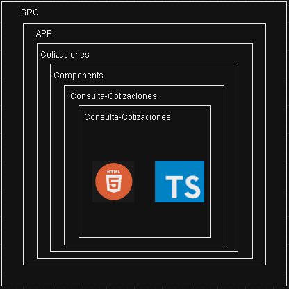
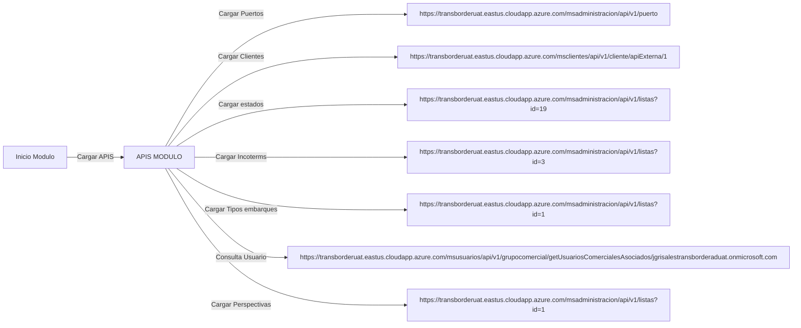
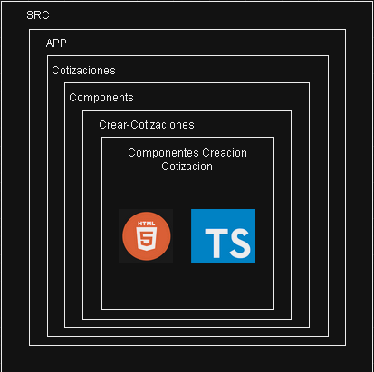

# Cotizador Docs

## Cotizaciones

### Ubicación Componente Consulta Cotización

### Consultar cotizaciones

---

<h2>Al cargar la pantalla de consulta coticiones creadas se cargan las siguientes APIS:</h2>

 

<h2>Lista de puertos hasta el id 1307</h2>

 

### Metodo GET
- `https://transborderuat.eastus.cloudapp.azure.com/msadministracion/api/v1/puerto`

**Response**:
~~~
[
    {
        "id": 302,
        "nombre": "DURRËS",
        "pais": {
            "id": 240,
            "nombre": "ALBANIA",
            "codigo": "AL",
            "requiereCodigoZip": false
        },
        "ciudad": {
            "id": 58841,
            "nombre": "DURRËS",
            "pais": {
                "id": 240,
                "nombre": "ALBANIA",
                "codigo": "AL",
                "requiereCodigoZip": false
            },
            "codigo": "DRZ"
        }
    },
    {
        "id": 303,
        "nombre": "ALGER (ALGIERS)",
        "pais": {
            "id": 241,
            "nombre": "ALGERIA",
            "codigo": "DZ",
            "requiereCodigoZip": false
        },
        "ciudad": {
            "id": 58874,
            "nombre": "ALGER (ALGIERS)",
            "pais": {
                "id": 241,
                "nombre": "ALGERIA",
                "codigo": "DZ",
                "requiereCodigoZip": false
            },
            "codigo": "ALG"
        }
    }
]
~~~

---

<h2>Se obtiene un objeto json con datos de los clientes: </h2>

 

### Metodo GET 
- `https://transborderuat.eastus.cloudapp.azure.com/msclientes/api/v1/cliente/apiExterna/{id} `  
    > ***Note***: El parametro del url es un id (numero).

**Response**:

~~~
[
    {
        "id": null,
        "idLotus": "84816D82896D8B2605257EE4006DB0E5",
        "numeroIdentificacion": "",
        "digitoVerificacion": "",
        "razonSocial": "",
        "direccion": "",
        "telefono": "",
        "tipoIdentificacion": "NIT",
        "vinculado": "Si",
        "tierLotus": "",
        "tier": null
    },
    {
        "id": null,
        "idLotus": "26DF25A8401C547F0525842400785193",
        "numeroIdentificacion": "900743775",
        "digitoVerificacion": "2",
        "razonSocial": "\tPUBLILEDS COLOMBIA S.A.S.",
        "direccion": " TRANSVERSAL 3 B 23 200 TORRE 2\r\nPUERTO COLOMBIA\r\nATLANTICO",
        "telefono": "3212107906",
        "tipoIdentificacion": "NIT",
        "vinculado": "Si",
        "tierLotus": "3",
        "tier": null
    },
    {
        "id": null,
        "idLotus": "180A2C6BFCB5E166052589C2006E1360",
        "numeroIdentificacion": "901191324",
        "digitoVerificacion": "8",
        "razonSocial": "\r\nNEMOOTECH SAS\r\n",
        "direccion": "Carrera  48 # 10 - 45 Medellin",
        "telefono": "3244233311 ",
        "tipoIdentificacion": "NIT",
        "vinculado": "Si",
        "tierLotus": "3",
        "tier": null
    }
]
~~~

---

 <h2>Se obtiene un objeto json con datos de los estados</h2>

 

### Metodo GET 

- `https://transborderuat.eastus.cloudapp.azure.com/msadministracion/api/v1/listas?id={id}` 
  > ***Note***: El parametro del url es un id (numero).
  
  **Response**:

  ~~~
    [
        {
            "idLista": 19,
            "identificador": "EN_CREACION",
            "valor": "En creación",
            "atributos": null
        },
        {
            "idLista": 19,
            "identificador": "EN_ESPERA_SPOT",
            "valor": "En espera spot",
            "atributos": null
        },
        {
            "idLista": 19,
            "identificador": "CREADA",
            "valor": "Creada",
            "atributos": null
        },
        {
            "idLista": 19,
            "identificador": "PENDIENTE_ACEPTACION",
            "valor": "Pendiente de Aceptación",
            "atributos": null
        },
        {
            "idLista": 19,
            "identificador": "ACEPTADA",
            "valor": "Aceptada",
            "atributos": null
        },
        {
            "idLista": 19,
            "identificador": "PREP_INST_EMBARQ_ENV",
            "valor": "Preparación de instrucción de embarque enviada",
            "atributos": null
        },
        {
            "idLista": 19,
            "identificador": "VENCIDA",
            "valor": "Vencida",
            "atributos": null
        },
        {
            "idLista": 19,
            "identificador": "ANULADA",
            "valor": "Anulada",
            "atributos": null
        }
    ]
  ~~~

---

<h2>Se obtiene un objeto json con los IncoTerms: </h2>

 

### Metodo GET 

- `https://transborderuat.eastus.cloudapp.azure.com/msadministracion/api/v1/listas?id={id}`
  > ***Note***: El parametro del url es un id (numero).

**Response**:

~~~
[
      {
          "idLista": 3,
          "identificador": "EXW",
          "valor": "Exworks",
          "atributos": null
      },
      {
          "idLista": 3,
          "identificador": "FCA",
          "valor": "Free Carrier",
          "atributos": null
      },
      {
          "idLista": 3,
          "identificador": "FAS",
          "valor": "Free Alongside Ship",
          "atributos": null
      },
      {
          "idLista": 3,
          "identificador": "FOB",
          "valor": "Free On Board",
          "atributos": null
      },
      {
          "idLista": 3,
          "identificador": "CFR",
          "valor": "Cost & Freight",
          "atributos": null
      },
      {
          "idLista": 3,
          "identificador": "CIF",
          "valor": "Cost, Insurance & Freight",
          "atributos": null
      },
      {
          "idLista": 3,
          "identificador": "CPT",
          "valor": "Cost Paid To",
          "atributos": null
      },
      {
          "idLista": 3,
          "identificador": "CIP",
          "valor": "Carrier & Insurance Paid to",
          "atributos": null
      },
      {
          "idLista": 3,
          "identificador": "DPU",
          "valor": "Delivered at Place Unloaded",
          "atributos": null
      },
      {
          "idLista": 3,
          "identificador": "DAP",
          "valor": "Delivered At Place",
          "atributos": null
      },
      {
          "idLista": 3,
          "identificador": "DDP",
          "valor": "Delivered Duty Paid",
          "atributos": null
      }
  ]
~~~

 
---

<h2>Se obtiene un objeto json con los Tipos de embarque: </h2>

 

### Metodo GET 

- `https://transborderuat.eastus.cloudapp.azure.com/msadministracion/api/v1/listas?id={id}` 
  > ***Note***: El parametro del url es un id (numero).

**Response**:

~~~
  [
      {
          "idLista": 1,
          "identificador": "FCL",
          "valor": "Full Container Load",
          "atributos": null
      },
      {
          "idLista": 1,
          "identificador": "LCL",
          "valor": "Less Container Load",
          "atributos": null
      }
  ]
~~~

---

### Se hace una peticion a esta URL tambien
### Metodo GET 

- `https://transborderuat.eastus.cloudapp.azure.com/msusuarios/api/v1/grupocomercial/getUsuariosComercialesAsociados/jgrisales@transborderaduat.onmicrosoft.com`

---

<h2>Se obtiene un objeto json con las Perspectivas: </h2>

 

### Metodo GET 

- `https://transborderuat.eastus.cloudapp.azure.com/msadministracion/api/v1/listas?id={id}`
    > ***Note***: El parametro del url es un id (numero).
  
**Response**:

~~~
[
    {
        "idLista": 4,
        "identificador": "COMPRADOR",
        "valor": "Comprador",
        "atributos": null
    },
    {
        "idLista": 4,
        "identificador": "VENDEDOR",
        "valor": "Vendedor",
        "atributos": null
    }
]
~~~

---

# Consultas en el Filtro
---

---

## Metodo POST

## Las peticiones que se hacen en los filtros, siempre apuntan a este end point `https://transborderuat.eastus.cloudapp.azure.com/cpcotizaciones/api/v1/cotizacionCP/findCotizacion`

<h2>Consultar por Numero Cotizacion</h2>

 

**Request**:

~~~
{
	"numeroCotizacion": "1-050523-000039",
	"pagina": 1
}
~~~

**Response**:

~~~
[
	{
		"idCotizacion": 43,
		"numeroCotizacion": "1-050523-000039",
		"nombreEmpresa": "JADASH S A S",
		"fechaCreacion": "2023-05-05T16:29:00.000+00:00",
		"estado": "PREP_INST_EMBARQ_ENV",
		"spotPorConfirmar": "No",
		"tipoOperacion": null,
		"puertoOrigen": "HAMBURG",
		"puertoDestino": "BARRANQUILLA",
		"incoterm": "EXW",
		"tipoEmbarque": "FCL",
		"numeroInstruccionEmbarque": "1 - 152084",
		"count": 1,
		"numDocCliente": "900875640",
		"idCotizacionEnCreacion": null,
		"origenVersion": null,
		"origenClonacion": null,
		"respuestaProductoEnEsperaSpot": false,
		"versionada": false,
		"reporteGastosPorConfirmarVencidos": false,
		"creadaConEsperaSpot": false,
		"formaGeneracion": "DESGLOSADA",
		"idiomaPdf": "ESPAÑOL",
		"respuestaProductoSpotPorConfirmar": false,
		"ciudadOrigen": "HAMBURG, GERMANY",
		"ciudadDestino": "BARRANQUILLA, COLOMBIA",
		"perspectiva": "COMPRADOR",
		"tarifasActualizadas": true,
		"vencidaInstruccionada": false
	}
]
~~~

---

<h2>Consultar por Cliente</h2>

 

**Request**:
~~~
{
    "digitoVerificacionCliente": "4",
    "numeroIdentificacionCliente": "830080641",
    "pagina": 1,
    "tipoIdentificacionCliente": "NIT"
}
~~~

**Response**:
~~~
[
    {
        "idCotizacion": 44,
        "numeroCotizacion": "1-050523-000040",
        "nombreEmpresa": "PARTEQUIPOS S.A.S",
        "fechaCreacion": "2023-05-05T16:42:00.000+00:00",
        "estado": "PREP_INST_EMBARQ_ENV",
        "spotPorConfirmar": "No",
        "tipoOperacion": null,
        "puertoOrigen": "HAMBURG",
        "puertoDestino": "BARRANQUILLA",
        "incoterm": "FOB",
        "tipoEmbarque": "LCL",
        "numeroInstruccionEmbarque": "1 - 152085",
        "count": 2,
        "numDocCliente": "830080641",
        "idCotizacionEnCreacion": null,
        "origenVersion": null,
        "origenClonacion": 42,
        "respuestaProductoEnEsperaSpot": false,
        "versionada": false,
        "reporteGastosPorConfirmarVencidos": false,
        "creadaConEsperaSpot": false,
        "formaGeneracion": "SEMIDESGLOSADA",
        "idiomaPdf": "ESPAÑOL",
        "respuestaProductoSpotPorConfirmar": false,
        "ciudadOrigen": "HAMBURG, GERMANY",
        "ciudadDestino": "BARRANQUILLA, COLOMBIA",
        "perspectiva": "COMPRADOR",
        "tarifasActualizadas": null,
        "vencidaInstruccionada": false
    },
    {
        "idCotizacion": 42,
        "numeroCotizacion": "1-050523-000038",
        "nombreEmpresa": "PARTEQUIPOS S.A.S",
        "fechaCreacion": "2023-05-05T16:21:00.000+00:00",
        "estado": "PREP_INST_EMBARQ_ENV",
        "spotPorConfirmar": "No",
        "tipoOperacion": null,
        "puertoOrigen": "HAMBURG",
        "puertoDestino": "BARRANQUILLA",
        "incoterm": "EXW",
        "tipoEmbarque": "LCL",
        "numeroInstruccionEmbarque": "1 - 152083",
        "count": 2,
        "numDocCliente": "830080641",
        "idCotizacionEnCreacion": null,
        "origenVersion": null,
        "origenClonacion": null,
        "respuestaProductoEnEsperaSpot": false,
        "versionada": false,
        "reporteGastosPorConfirmarVencidos": false,
        "creadaConEsperaSpot": false,
        "formaGeneracion": "DESGLOSADA",
        "idiomaPdf": "ESPAÑOL",
        "respuestaProductoSpotPorConfirmar": false,
        "ciudadOrigen": "HAMBURG, GERMANY",
        "ciudadDestino": "BARRANQUILLA, COLOMBIA",
        "perspectiva": "COMPRADOR",
        "tarifasActualizadas": null,
        "vencidaInstruccionada": false
    }
]
~~~

---

<h2>Consultar por Fecha</h2>

 

**Request**:

~~~
{
	"fechaFin": "2023-11-24T05:00:00.000Z",
	"fechaInicio": "2022-11-24T05:00:00.000Z",
	"pagina": 1
}
~~~

**Response**

~~~
{
	"1": {
		"idCotizacion": 43,
		"numeroCotizacion": "1-050523-000039",
		"nombreEmpresa": "JADASH S A S",
		"fechaCreacion": "2023-05-05T16:29:00.000+00:00",
		"estado": "PREP_INST_EMBARQ_ENV",
		"spotPorConfirmar": "No",
		"tipoOperacion": null,
		"puertoOrigen": "HAMBURG",
		"puertoDestino": "BARRANQUILLA",
		"incoterm": "EXW",
		"tipoEmbarque": "FCL",
		"numeroInstruccionEmbarque": "1 - 152084",
		"count": 4,
		"numDocCliente": "900875640",
		"idCotizacionEnCreacion": null,
		"origenVersion": null,
		"origenClonacion": null,
		"respuestaProductoEnEsperaSpot": false,
		"versionada": false,
		"reporteGastosPorConfirmarVencidos": false,
		"creadaConEsperaSpot": false,
		"formaGeneracion": "DESGLOSADA",
		"idiomaPdf": "ESPAÑOL",
		"respuestaProductoSpotPorConfirmar": false,
		"ciudadOrigen": "HAMBURG, GERMANY",
		"ciudadDestino": "BARRANQUILLA, COLOMBIA",
		"perspectiva": "COMPRADOR",
		"tarifasActualizadas": true,
		"vencidaInstruccionada": false
	}
}
~~~

---

<h2>Consultar por Estado</h2>

 

**Request**:

~~~
{
	"estado": "PREP_INST_EMBARQ_ENV",
	"pagina": 1
}
~~~

**Response**:

~~~
[
	{
		"idCotizacion": 44,
		"numeroCotizacion": "1-050523-000040",
		"nombreEmpresa": "PARTEQUIPOS S.A.S",
		"fechaCreacion": "2023-05-05T16:42:00.000+00:00",
		"estado": "PREP_INST_EMBARQ_ENV",
		"spotPorConfirmar": "No",
		"tipoOperacion": null,
		"puertoOrigen": "HAMBURG",
		"puertoDestino": "BARRANQUILLA",
		"incoterm": "FOB",
		"tipoEmbarque": "LCL",
		"numeroInstruccionEmbarque": "1 - 152085",
		"count": 3,
		"numDocCliente": "830080641",
		"idCotizacionEnCreacion": null,
		"origenVersion": null,
		"origenClonacion": 42,
		"respuestaProductoEnEsperaSpot": false,
		"versionada": false,
		"reporteGastosPorConfirmarVencidos": false,
		"creadaConEsperaSpot": false,
		"formaGeneracion": "SEMIDESGLOSADA",
		"idiomaPdf": "ESPAÑOL",
		"respuestaProductoSpotPorConfirmar": false,
		"ciudadOrigen": "HAMBURG, GERMANY",
		"ciudadDestino": "BARRANQUILLA, COLOMBIA",
		"perspectiva": "COMPRADOR",
		"tarifasActualizadas": null,
		"vencidaInstruccionada": false
	},
	{
		"idCotizacion": 43,
		"numeroCotizacion": "1-050523-000039",
		"nombreEmpresa": "JADASH S A S",
		"fechaCreacion": "2023-05-05T16:29:00.000+00:00",
		"estado": "PREP_INST_EMBARQ_ENV",
		"spotPorConfirmar": "No",
		"tipoOperacion": null,
		"puertoOrigen": "HAMBURG",
		"puertoDestino": "BARRANQUILLA",
		"incoterm": "EXW",
		"tipoEmbarque": "FCL",
		"numeroInstruccionEmbarque": "1 - 152084",
		"count": 3,
		"numDocCliente": "900875640",
		"idCotizacionEnCreacion": null,
		"origenVersion": null,
		"origenClonacion": null,
		"respuestaProductoEnEsperaSpot": false,
		"versionada": false,
		"reporteGastosPorConfirmarVencidos": false,
		"creadaConEsperaSpot": false,
		"formaGeneracion": "DESGLOSADA",
		"idiomaPdf": "ESPAÑOL",
		"respuestaProductoSpotPorConfirmar": false,
		"ciudadOrigen": "HAMBURG, GERMANY",
		"ciudadDestino": "BARRANQUILLA, COLOMBIA",
		"perspectiva": "COMPRADOR",
		"tarifasActualizadas": true,
		"vencidaInstruccionada": false
	},
	{
		"idCotizacion": 42,
		"numeroCotizacion": "1-050523-000038",
		"nombreEmpresa": "PARTEQUIPOS S.A.S",
		"fechaCreacion": "2023-05-05T16:21:00.000+00:00",
		"estado": "PREP_INST_EMBARQ_ENV",
		"spotPorConfirmar": "No",
		"tipoOperacion": null,
		"puertoOrigen": "HAMBURG",
		"puertoDestino": "BARRANQUILLA",
		"incoterm": "EXW",
		"tipoEmbarque": "LCL",
		"numeroInstruccionEmbarque": "1 - 152083",
		"count": 3,
		"numDocCliente": "830080641",
		"idCotizacionEnCreacion": null,
		"origenVersion": null,
		"origenClonacion": null,
		"respuestaProductoEnEsperaSpot": false,
		"versionada": false,
		"reporteGastosPorConfirmarVencidos": false,
		"creadaConEsperaSpot": false,
		"formaGeneracion": "DESGLOSADA",
		"idiomaPdf": "ESPAÑOL",
		"respuestaProductoSpotPorConfirmar": false,
		"ciudadOrigen": "HAMBURG, GERMANY",
		"ciudadDestino": "BARRANQUILLA, COLOMBIA",
		"perspectiva": "COMPRADOR",
		"tarifasActualizadas": null,
		"vencidaInstruccionada": false
	}
]
~~~

---

<h2>Consultar por Ciudad, Pais Origen</h2>

 

**Response**:

~~~
[
	{
        "idCiudadOrigen": 101946,
        "pagina": 1
    }
]
~~~

**Response**:

~~~
    [
        {
            "idCotizacion": 44,
            "numeroCotizacion": "1-050523-000040",
            "nombreEmpresa": "PARTEQUIPOS S.A.S",
            "fechaCreacion": "2023-05-05T16:42:00.000+00:00",
            "estado": "PREP_INST_EMBARQ_ENV",
            "spotPorConfirmar": "No",
            "tipoOperacion": null,
            "puertoOrigen": "HAMBURG",
            "puertoDestino": "BARRANQUILLA",
            "incoterm": "FOB",
            "tipoEmbarque": "LCL",
            "numeroInstruccionEmbarque": "1 - 152085",
            "count": 3,
            "numDocCliente": "830080641",
            "idCotizacionEnCreacion": null,
            "origenVersion": null,
            "origenClonacion": 42,
            "respuestaProductoEnEsperaSpot": false,
            "versionada": false,
            "reporteGastosPorConfirmarVencidos": false,
            "creadaConEsperaSpot": false,
            "formaGeneracion": "SEMIDESGLOSADA",
            "idiomaPdf": "ESPAÑOL",
            "respuestaProductoSpotPorConfirmar": false,
            "ciudadOrigen": "HAMBURG, GERMANY",
            "ciudadDestino": "BARRANQUILLA, COLOMBIA",
            "perspectiva": "COMPRADOR",
            "tarifasActualizadas": null,
            "vencidaInstruccionada": false
        },
        {
            "idCotizacion": 43,
            "numeroCotizacion": "1-050523-000039",
            "nombreEmpresa": "JADASH S A S",
            "fechaCreacion": "2023-05-05T16:29:00.000+00:00",
            "estado": "PREP_INST_EMBARQ_ENV",
            "spotPorConfirmar": "No",
            "tipoOperacion": null,
            "puertoOrigen": "HAMBURG",
            "puertoDestino": "BARRANQUILLA",
            "incoterm": "EXW",
            "tipoEmbarque": "FCL",
            "numeroInstruccionEmbarque": "1 - 152084",
            "count": 3,
            "numDocCliente": "900875640",
            "idCotizacionEnCreacion": null,
            "origenVersion": null,
            "origenClonacion": null,
            "respuestaProductoEnEsperaSpot": false,
            "versionada": false,
            "reporteGastosPorConfirmarVencidos": false,
            "creadaConEsperaSpot": false,
            "formaGeneracion": "DESGLOSADA",
            "idiomaPdf": "ESPAÑOL",
            "respuestaProductoSpotPorConfirmar": false,
            "ciudadOrigen": "HAMBURG, GERMANY",
            "ciudadDestino": "BARRANQUILLA, COLOMBIA",
            "perspectiva": "COMPRADOR",
            "tarifasActualizadas": true,
            "vencidaInstruccionada": false
        },
        {
            "idCotizacion": 42,
            "numeroCotizacion": "1-050523-000038",
            "nombreEmpresa": "PARTEQUIPOS S.A.S",
            "fechaCreacion": "2023-05-05T16:21:00.000+00:00",
            "estado": "PREP_INST_EMBARQ_ENV",
            "spotPorConfirmar": "No",
            "tipoOperacion": null,
            "puertoOrigen": "HAMBURG",
            "puertoDestino": "BARRANQUILLA",
            "incoterm": "EXW",
            "tipoEmbarque": "LCL",
            "numeroInstruccionEmbarque": "1 - 152083",
            "count": 3,
            "numDocCliente": "830080641",
            "idCotizacionEnCreacion": null,
            "origenVersion": null,
            "origenClonacion": null,
            "respuestaProductoEnEsperaSpot": false,
            "versionada": false,
            "reporteGastosPorConfirmarVencidos": false,
            "creadaConEsperaSpot": false,
            "formaGeneracion": "DESGLOSADA",
            "idiomaPdf": "ESPAÑOL",
            "respuestaProductoSpotPorConfirmar": false,
            "ciudadOrigen": "HAMBURG, GERMANY",
            "ciudadDestino": "BARRANQUILLA, COLOMBIA",
            "perspectiva": "COMPRADOR",
            "tarifasActualizadas": null,
            "vencidaInstruccionada": false
        }
    ]
~~~

---

<h2>Consultar por Puerto</h2>

 

**Request**:

~~~
{
	"idPuertoOrigen": 619,
	"pagina": 1
}
~~~

**Response**:

~~~
[
	{
		"idCotizacion": 44,
		"numeroCotizacion": "1-050523-000040",
		"nombreEmpresa": "PARTEQUIPOS S.A.S",
		"fechaCreacion": "2023-05-05T16:42:00.000+00:00",
		"estado": "PREP_INST_EMBARQ_ENV",
		"spotPorConfirmar": "No",
		"tipoOperacion": null,
		"puertoOrigen": "HAMBURG",
		"puertoDestino": "BARRANQUILLA",
		"incoterm": "FOB",
		"tipoEmbarque": "LCL",
		"numeroInstruccionEmbarque": "1 - 152085",
		"count": 3,
		"numDocCliente": "830080641",
		"idCotizacionEnCreacion": null,
		"origenVersion": null,
		"origenClonacion": 42,
		"respuestaProductoEnEsperaSpot": false,
		"versionada": false,
		"reporteGastosPorConfirmarVencidos": false,
		"creadaConEsperaSpot": false,
		"formaGeneracion": "SEMIDESGLOSADA",
		"idiomaPdf": "ESPAÑOL",
		"respuestaProductoSpotPorConfirmar": false,
		"ciudadOrigen": "HAMBURG, GERMANY",
		"ciudadDestino": "BARRANQUILLA, COLOMBIA",
		"perspectiva": "COMPRADOR",
		"tarifasActualizadas": null,
		"vencidaInstruccionada": false
	},
	{
		"idCotizacion": 43,
		"numeroCotizacion": "1-050523-000039",
		"nombreEmpresa": "JADASH S A S",
		"fechaCreacion": "2023-05-05T16:29:00.000+00:00",
		"estado": "PREP_INST_EMBARQ_ENV",
		"spotPorConfirmar": "No",
		"tipoOperacion": null,
		"puertoOrigen": "HAMBURG",
		"puertoDestino": "BARRANQUILLA",
		"incoterm": "EXW",
		"tipoEmbarque": "FCL",
		"numeroInstruccionEmbarque": "1 - 152084",
		"count": 3,
		"numDocCliente": "900875640",
		"idCotizacionEnCreacion": null,
		"origenVersion": null,
		"origenClonacion": null,
		"respuestaProductoEnEsperaSpot": false,
		"versionada": false,
		"reporteGastosPorConfirmarVencidos": false,
		"creadaConEsperaSpot": false,
		"formaGeneracion": "DESGLOSADA",
		"idiomaPdf": "ESPAÑOL",
		"respuestaProductoSpotPorConfirmar": false,
		"ciudadOrigen": "HAMBURG, GERMANY",
		"ciudadDestino": "BARRANQUILLA, COLOMBIA",
		"perspectiva": "COMPRADOR",
		"tarifasActualizadas": true,
		"vencidaInstruccionada": false
	},
	{
		"idCotizacion": 42,
		"numeroCotizacion": "1-050523-000038",
		"nombreEmpresa": "PARTEQUIPOS S.A.S",
		"fechaCreacion": "2023-05-05T16:21:00.000+00:00",
		"estado": "PREP_INST_EMBARQ_ENV",
		"spotPorConfirmar": "No",
		"tipoOperacion": null,
		"puertoOrigen": "HAMBURG",
		"puertoDestino": "BARRANQUILLA",
		"incoterm": "EXW",
		"tipoEmbarque": "LCL",
		"numeroInstruccionEmbarque": "1 - 152083",
		"count": 3,
		"numDocCliente": "830080641",
		"idCotizacionEnCreacion": null,
		"origenVersion": null,
		"origenClonacion": null,
		"respuestaProductoEnEsperaSpot": false,
		"versionada": false,
		"reporteGastosPorConfirmarVencidos": false,
		"creadaConEsperaSpot": false,
		"formaGeneracion": "DESGLOSADA",
		"idiomaPdf": "ESPAÑOL",
		"respuestaProductoSpotPorConfirmar": false,
		"ciudadOrigen": "HAMBURG, GERMANY",
		"ciudadDestino": "BARRANQUILLA, COLOMBIA",
		"perspectiva": "COMPRADOR",
		"tarifasActualizadas": null,
		"vencidaInstruccionada": false
	}
]
~~~

---

<h2>Consultar por SPOT</h2>

 

***Rquest***:

~~~
{
	"pagina": 1,
	"spotPorConfirmar": false
}
~~~

**Response**:

~~~
[
	{
		"idCotizacion": 44,
		"numeroCotizacion": "1-050523-000040",
		"nombreEmpresa": "PARTEQUIPOS S.A.S",
		"fechaCreacion": "2023-05-05T16:42:00.000+00:00",
		"estado": "PREP_INST_EMBARQ_ENV",
		"spotPorConfirmar": "No",
		"tipoOperacion": null,
		"puertoOrigen": "HAMBURG",
		"puertoDestino": "BARRANQUILLA",
		"incoterm": "FOB",
		"tipoEmbarque": "LCL",
		"numeroInstruccionEmbarque": "1 - 152085",
		"count": 4,
		"numDocCliente": "830080641",
		"idCotizacionEnCreacion": null,
		"origenVersion": null,
		"origenClonacion": 42,
		"respuestaProductoEnEsperaSpot": false,
		"versionada": false,
		"reporteGastosPorConfirmarVencidos": false,
		"creadaConEsperaSpot": false,
		"formaGeneracion": "SEMIDESGLOSADA",
		"idiomaPdf": "ESPAÑOL",
		"respuestaProductoSpotPorConfirmar": false,
		"ciudadOrigen": "HAMBURG, GERMANY",
		"ciudadDestino": "BARRANQUILLA, COLOMBIA",
		"perspectiva": "COMPRADOR",
		"tarifasActualizadas": null,
		"vencidaInstruccionada": false
	},
	{
		"idCotizacion": 43,
		"numeroCotizacion": "1-050523-000039",
		"nombreEmpresa": "JADASH S A S",
		"fechaCreacion": "2023-05-05T16:29:00.000+00:00",
		"estado": "PREP_INST_EMBARQ_ENV",
		"spotPorConfirmar": "No",
		"tipoOperacion": null,
		"puertoOrigen": "HAMBURG",
		"puertoDestino": "BARRANQUILLA",
		"incoterm": "EXW",
		"tipoEmbarque": "FCL",
		"numeroInstruccionEmbarque": "1 - 152084",
		"count": 4,
		"numDocCliente": "900875640",
		"idCotizacionEnCreacion": null,
		"origenVersion": null,
		"origenClonacion": null,
		"respuestaProductoEnEsperaSpot": false,
		"versionada": false,
		"reporteGastosPorConfirmarVencidos": false,
		"creadaConEsperaSpot": false,
		"formaGeneracion": "DESGLOSADA",
		"idiomaPdf": "ESPAÑOL",
		"respuestaProductoSpotPorConfirmar": false,
		"ciudadOrigen": "HAMBURG, GERMANY",
		"ciudadDestino": "BARRANQUILLA, COLOMBIA",
		"perspectiva": "COMPRADOR",
		"tarifasActualizadas": true,
		"vencidaInstruccionada": false
	},
	{
		"idCotizacion": 42,
		"numeroCotizacion": "1-050523-000038",
		"nombreEmpresa": "PARTEQUIPOS S.A.S",
		"fechaCreacion": "2023-05-05T16:21:00.000+00:00",
		"estado": "PREP_INST_EMBARQ_ENV",
		"spotPorConfirmar": "No",
		"tipoOperacion": null,
		"puertoOrigen": "HAMBURG",
		"puertoDestino": "BARRANQUILLA",
		"incoterm": "EXW",
		"tipoEmbarque": "LCL",
		"numeroInstruccionEmbarque": "1 - 152083",
		"count": 4,
		"numDocCliente": "830080641",
		"idCotizacionEnCreacion": null,
		"origenVersion": null,
		"origenClonacion": null,
		"respuestaProductoEnEsperaSpot": false,
		"versionada": false,
		"reporteGastosPorConfirmarVencidos": false,
		"creadaConEsperaSpot": false,
		"formaGeneracion": "DESGLOSADA",
		"idiomaPdf": "ESPAÑOL",
		"respuestaProductoSpotPorConfirmar": false,
		"ciudadOrigen": "HAMBURG, GERMANY",
		"ciudadDestino": "BARRANQUILLA, COLOMBIA",
		"perspectiva": "COMPRADOR",
		"tarifasActualizadas": null,
		"vencidaInstruccionada": false
	},
	{
		"idCotizacion": null,
		"numeroCotizacion": null,
		"nombreEmpresa": null,
		"fechaCreacion": null,
		"estado": "EN_CREACION",
		"spotPorConfirmar": "No",
		"tipoOperacion": null,
		"puertoOrigen": "GENOVA",
		"puertoDestino": "CARTAGENA",
		"incoterm": "EXW",
		"tipoEmbarque": "FCL",
		"numeroInstruccionEmbarque": "No aplica",
		"count": 4,
		"numDocCliente": "900276962",
		"idCotizacionEnCreacion": 2,
		"origenVersion": null,
		"origenClonacion": null,
		"respuestaProductoEnEsperaSpot": false,
		"versionada": false,
		"reporteGastosPorConfirmarVencidos": false,
		"creadaConEsperaSpot": false,
		"formaGeneracion": null,
		"idiomaPdf": null,
		"respuestaProductoSpotPorConfirmar": false,
		"ciudadOrigen": "GENOVA, ITALY",
		"ciudadDestino": "CARTAGENA, COLOMBIA",
		"perspectiva": "COMPRADOR",
		"tarifasActualizadas": null,
		"vencidaInstruccionada": false
	}
]
~~~

---

<h2>Consultar por Perspectiva</h2>

 

**Request**:

~~~
{
	"pagina": 1,
	"perspectiva": "COMPRADOR"
}
~~~

**Response**:

~~~
[
	{
		"idCotizacion": 44,
		"numeroCotizacion": "1-050523-000040",
		"nombreEmpresa": "PARTEQUIPOS S.A.S",
		"fechaCreacion": "2023-05-05T16:42:00.000+00:00",
		"estado": "PREP_INST_EMBARQ_ENV",
		"spotPorConfirmar": "No",
		"tipoOperacion": null,
		"puertoOrigen": "HAMBURG",
		"puertoDestino": "BARRANQUILLA",
		"incoterm": "FOB",
		"tipoEmbarque": "LCL",
		"numeroInstruccionEmbarque": "1 - 152085",
		"count": 5,
		"numDocCliente": "830080641",
		"idCotizacionEnCreacion": null,
		"origenVersion": null,
		"origenClonacion": 42,
		"respuestaProductoEnEsperaSpot": false,
		"versionada": false,
		"reporteGastosPorConfirmarVencidos": false,
		"creadaConEsperaSpot": false,
		"formaGeneracion": "SEMIDESGLOSADA",
		"idiomaPdf": "ESPAÑOL",
		"respuestaProductoSpotPorConfirmar": false,
		"ciudadOrigen": "HAMBURG, GERMANY",
		"ciudadDestino": "BARRANQUILLA, COLOMBIA",
		"perspectiva": "COMPRADOR",
		"tarifasActualizadas": null,
		"vencidaInstruccionada": false
	},
	{
		"idCotizacion": 43,
		"numeroCotizacion": "1-050523-000039",
		"nombreEmpresa": "JADASH S A S",
		"fechaCreacion": "2023-05-05T16:29:00.000+00:00",
		"estado": "PREP_INST_EMBARQ_ENV",
		"spotPorConfirmar": "No",
		"tipoOperacion": null,
		"puertoOrigen": "HAMBURG",
		"puertoDestino": "BARRANQUILLA",
		"incoterm": "EXW",
		"tipoEmbarque": "FCL",
		"numeroInstruccionEmbarque": "1 - 152084",
		"count": 5,
		"numDocCliente": "900875640",
		"idCotizacionEnCreacion": null,
		"origenVersion": null,
		"origenClonacion": null,
		"respuestaProductoEnEsperaSpot": false,
		"versionada": false,
		"reporteGastosPorConfirmarVencidos": false,
		"creadaConEsperaSpot": false,
		"formaGeneracion": "DESGLOSADA",
		"idiomaPdf": "ESPAÑOL",
		"respuestaProductoSpotPorConfirmar": false,
		"ciudadOrigen": "HAMBURG, GERMANY",
		"ciudadDestino": "BARRANQUILLA, COLOMBIA",
		"perspectiva": "COMPRADOR",
		"tarifasActualizadas": true,
		"vencidaInstruccionada": false
	},
	{
		"idCotizacion": 42,
		"numeroCotizacion": "1-050523-000038",
		"nombreEmpresa": "PARTEQUIPOS S.A.S",
		"fechaCreacion": "2023-05-05T16:21:00.000+00:00",
		"estado": "PREP_INST_EMBARQ_ENV",
		"spotPorConfirmar": "No",
		"tipoOperacion": null,
		"puertoOrigen": "HAMBURG",
		"puertoDestino": "BARRANQUILLA",
		"incoterm": "EXW",
		"tipoEmbarque": "LCL",
		"numeroInstruccionEmbarque": "1 - 152083",
		"count": 5,
		"numDocCliente": "830080641",
		"idCotizacionEnCreacion": null,
		"origenVersion": null,
		"origenClonacion": null,
		"respuestaProductoEnEsperaSpot": false,
		"versionada": false,
		"reporteGastosPorConfirmarVencidos": false,
		"creadaConEsperaSpot": false,
		"formaGeneracion": "DESGLOSADA",
		"idiomaPdf": "ESPAÑOL",
		"respuestaProductoSpotPorConfirmar": false,
		"ciudadOrigen": "HAMBURG, GERMANY",
		"ciudadDestino": "BARRANQUILLA, COLOMBIA",
		"perspectiva": "COMPRADOR",
		"tarifasActualizadas": null,
		"vencidaInstruccionada": false
	},
	{
		"idCotizacion": 41,
		"numeroCotizacion": "1-050523-000037",
		"nombreEmpresa": "TU CASSA SAS",
		"fechaCreacion": "2023-05-05T16:16:00.000+00:00",
		"estado": "EN_ESPERA_SPOT",
		"spotPorConfirmar": "Sí",
		"tipoOperacion": null,
		"puertoOrigen": "MUNDRA",
		"puertoDestino": "BUENAVENTURA",
		"incoterm": "EXW",
		"tipoEmbarque": "FCL",
		"numeroInstruccionEmbarque": null,
		"count": 5,
		"numDocCliente": "900428423",
		"idCotizacionEnCreacion": null,
		"origenVersion": null,
		"origenClonacion": null,
		"respuestaProductoEnEsperaSpot": true,
		"versionada": false,
		"reporteGastosPorConfirmarVencidos": false,
		"creadaConEsperaSpot": true,
		"formaGeneracion": null,
		"idiomaPdf": null,
		"respuestaProductoSpotPorConfirmar": false,
		"ciudadOrigen": "MUNDRA, INDIA",
		"ciudadDestino": "BUENAVENTURA, COLOMBIA",
		"perspectiva": "COMPRADOR",
		"tarifasActualizadas": null,
		"vencidaInstruccionada": false
	},
	{
		"idCotizacion": null,
		"numeroCotizacion": null,
		"nombreEmpresa": null,
		"fechaCreacion": null,
		"estado": "EN_CREACION",
		"spotPorConfirmar": "No",
		"tipoOperacion": null,
		"puertoOrigen": "GENOVA",
		"puertoDestino": "CARTAGENA",
		"incoterm": "EXW",
		"tipoEmbarque": "FCL",
		"numeroInstruccionEmbarque": "No aplica",
		"count": 5,
		"numDocCliente": "900276962",
		"idCotizacionEnCreacion": 2,
		"origenVersion": null,
		"origenClonacion": null,
		"respuestaProductoEnEsperaSpot": false,
		"versionada": false,
		"reporteGastosPorConfirmarVencidos": false,
		"creadaConEsperaSpot": false,
		"formaGeneracion": null,
		"idiomaPdf": null,
		"respuestaProductoSpotPorConfirmar": false,
		"ciudadOrigen": "GENOVA, ITALY",
		"ciudadDestino": "CARTAGENA, COLOMBIA",
		"perspectiva": "COMPRADOR",
		"tarifasActualizadas": null,
		"vencidaInstruccionada": false
	}
]
~~~

---

<h2>Consultar por Incoterm</h2>

  

**Request**:

~~~
{
	"incoterm": "FOB",
	"pagina": 1
}
~~~

**Response**:

~~~
[
	{
		"idCotizacion": 44,
		"numeroCotizacion": "1-050523-000040",
		"nombreEmpresa": "PARTEQUIPOS S.A.S",
		"fechaCreacion": "2023-05-05T16:42:00.000+00:00",
		"estado": "PREP_INST_EMBARQ_ENV",
		"spotPorConfirmar": "No",
		"tipoOperacion": null,
		"puertoOrigen": "HAMBURG",
		"puertoDestino": "BARRANQUILLA",
		"incoterm": "FOB",
		"tipoEmbarque": "LCL",
		"numeroInstruccionEmbarque": "1 - 152085",
		"count": 1,
		"numDocCliente": "830080641",
		"idCotizacionEnCreacion": null,
		"origenVersion": null,
		"origenClonacion": 42,
		"respuestaProductoEnEsperaSpot": false,
		"versionada": false,
		"reporteGastosPorConfirmarVencidos": false,
		"creadaConEsperaSpot": false,
		"formaGeneracion": "SEMIDESGLOSADA",
		"idiomaPdf": "ESPAÑOL",
		"respuestaProductoSpotPorConfirmar": false,
		"ciudadOrigen": "HAMBURG, GERMANY",
		"ciudadDestino": "BARRANQUILLA, COLOMBIA",
		"perspectiva": "COMPRADOR",
		"tarifasActualizadas": null,
		"vencidaInstruccionada": false
	}
]
~~~

---

<h2>Consultar por Tipo Embarque</h2>

 

**Request**:

~~~
{
	"pagina": 1,
	"tipoEmbarque": "FCL"
}
~~~

**Response**:

~~~
[
	{
		"idCotizacion": 43,
		"numeroCotizacion": "1-050523-000039",
		"nombreEmpresa": "JADASH S A S",
		"fechaCreacion": "2023-05-05T16:29:00.000+00:00",
		"estado": "PREP_INST_EMBARQ_ENV",
		"spotPorConfirmar": "No",
		"tipoOperacion": null,
		"puertoOrigen": "HAMBURG",
		"puertoDestino": "BARRANQUILLA",
		"incoterm": "EXW",
		"tipoEmbarque": "FCL",
		"numeroInstruccionEmbarque": "1 - 152084",
		"count": 3,
		"numDocCliente": "900875640",
		"idCotizacionEnCreacion": null,
		"origenVersion": null,
		"origenClonacion": null,
		"respuestaProductoEnEsperaSpot": false,
		"versionada": false,
		"reporteGastosPorConfirmarVencidos": false,
		"creadaConEsperaSpot": false,
		"formaGeneracion": "DESGLOSADA",
		"idiomaPdf": "ESPAÑOL",
		"respuestaProductoSpotPorConfirmar": false,
		"ciudadOrigen": "HAMBURG, GERMANY",
		"ciudadDestino": "BARRANQUILLA, COLOMBIA",
		"perspectiva": "COMPRADOR",
		"tarifasActualizadas": true,
		"vencidaInstruccionada": false
	},
	{
		"idCotizacion": 41,
		"numeroCotizacion": "1-050523-000037",
		"nombreEmpresa": "TU CASSA SAS",
		"fechaCreacion": "2023-05-05T16:16:00.000+00:00",
		"estado": "EN_ESPERA_SPOT",
		"spotPorConfirmar": "Sí",
		"tipoOperacion": null,
		"puertoOrigen": "MUNDRA",
		"puertoDestino": "BUENAVENTURA",
		"incoterm": "EXW",
		"tipoEmbarque": "FCL",
		"numeroInstruccionEmbarque": null,
		"count": 3,
		"numDocCliente": "900428423",
		"idCotizacionEnCreacion": null,
		"origenVersion": null,
		"origenClonacion": null,
		"respuestaProductoEnEsperaSpot": true,
		"versionada": false,
		"reporteGastosPorConfirmarVencidos": false,
		"creadaConEsperaSpot": true,
		"formaGeneracion": null,
		"idiomaPdf": null,
		"respuestaProductoSpotPorConfirmar": false,
		"ciudadOrigen": "MUNDRA, INDIA",
		"ciudadDestino": "BUENAVENTURA, COLOMBIA",
		"perspectiva": "COMPRADOR",
		"tarifasActualizadas": null,
		"vencidaInstruccionada": false
	},
	{
		"idCotizacion": null,
		"numeroCotizacion": null,
		"nombreEmpresa": null,
		"fechaCreacion": null,
		"estado": "EN_CREACION",
		"spotPorConfirmar": "No",
		"tipoOperacion": null,
		"puertoOrigen": "GENOVA",
		"puertoDestino": "CARTAGENA",
		"incoterm": "EXW",
		"tipoEmbarque": "FCL",
		"numeroInstruccionEmbarque": "No aplica",
		"count": 3,
		"numDocCliente": "900276962",
		"idCotizacionEnCreacion": 2,
		"origenVersion": null,
		"origenClonacion": null,
		"respuestaProductoEnEsperaSpot": false,
		"versionada": false,
		"reporteGastosPorConfirmarVencidos": false,
		"creadaConEsperaSpot": false,
		"formaGeneracion": null,
		"idiomaPdf": null,
		"respuestaProductoSpotPorConfirmar": false,
		"ciudadOrigen": "GENOVA, ITALY",
		"ciudadDestino": "CARTAGENA, COLOMBIA",
		"perspectiva": "COMPRADOR",
		"tarifasActualizadas": null,
		"vencidaInstruccionada": false
	}
]
~~~

---

<h2>Consultar por No.Instruccion embarque</h2>

 

**Request**:

~~~
{
	"numeroInstruccionEmbarque": "1-152084",
	"pagina": 1
}
~~~

**Response**:

~~~
[
	{
		"idCotizacion": 43,
		"numeroCotizacion": "1-050523-000039",
		"nombreEmpresa": "JADASH S A S",
		"fechaCreacion": "2023-05-05T16:29:00.000+00:00",
		"estado": "PREP_INST_EMBARQ_ENV",
		"spotPorConfirmar": "No",
		"tipoOperacion": null,
		"puertoOrigen": "HAMBURG",
		"puertoDestino": "BARRANQUILLA",
		"incoterm": "EXW",
		"tipoEmbarque": "FCL",
		"numeroInstruccionEmbarque": "1 - 152084",
		"count": 1,
		"numDocCliente": "900875640",
		"idCotizacionEnCreacion": null,
		"origenVersion": null,
		"origenClonacion": null,
		"respuestaProductoEnEsperaSpot": false,
		"versionada": false,
		"reporteGastosPorConfirmarVencidos": false,
		"creadaConEsperaSpot": false,
		"formaGeneracion": "DESGLOSADA",
		"idiomaPdf": "ESPAÑOL",
		"respuestaProductoSpotPorConfirmar": false,
		"ciudadOrigen": "HAMBURG, GERMANY",
		"ciudadDestino": "BARRANQUILLA, COLOMBIA",
		"perspectiva": "COMPRADOR",
		"tarifasActualizadas": true,
		"vencidaInstruccionada": false
	}
]
~~~

---

### Consultar Puertos

 - `https://transborderuat.eastus.cloudapp.azure.com/msadministracion/api/v1/ciudad/findCiudadPaisPorNombre?cadena=+HAMBURG%2C+GERMANY (GET)`

**Response**:

~~~
[
	{
		"id": 101947,
		"requiereCodigoZip": false,
		"tienePuerto": false,
		"nc": "HAMBURG-MITTE",
		"np": "GERMANY",
		"cc": "HTJ",
		"cp": "DE"
	}
]
~~~

---

# Crear Cotizacion

<h2>Crear cotización</h2>

 

### Ubicación Componente Creacion Cotización

<h2>Ciudad Origen</h2>

 

### Metodo GET

- `https://transborderuat.eastus.cloudapp.azure.com/msadministracion/api/v1/puerto/byIdCiudad?idCiudad={idCiudad}}`
  > ***Note***: parametro idCiudad origen (numero)

**Response**

~~~
[
	{
		"id": 619,
		"nombre": "HAMBURG",
		"ciudad": {
			"id": 101946,
			"nombre": "HAMBURG",
			"pais": {
				"id": 320,
				"nombre": "GERMANY",
				"codigo": "DE",
				"requiereCodigoZip": false,
				"montoMaximoMercanciaGeneral": null,
				"montoMaximoMercanciaVulnerable": null,
				"aplicaProtocolo": false,
				"mercanciasVulnerables": "{\"nombre\":\"Mercancías vulnerables\",\r\n\t\"productos\":[{\r\n\t\t\"nombre\":\"Aceros\",\r\n\t\t\"productos\":[]\r\n\t},{\r\n\t\t\"nombre\":\"Zinc\",\r\n\t\t\"productos\":[]\r\n\t},{\r\n\t\t\"nombre\":\"Cobre en laminas o rollos de alambre\",\r\n\t\t\"productos\":[]\r\n\t},{\r\n\t\t\"nombre\":\"Alimentos enlatados\",\r\n\t\t\"productos\":[]\r\n\t},{\r\n\t\t\"nombre\":\"Leche en polvo\",\r\n\t\t\"productos\":[]\r\n\t},{\r\n\t\t\"nombre\":\"Arroz\",\r\n\t\t\"productos\":[]\r\n\t},{\r\n\t\t\"nombre\":\"Azúcar de cualquier tipo excluida el azúcar crudo\",\r\n\t\t\"productos\":[]\r\n\t},{\r\n\t\t\"nombre\":\"Calzado\",\r\n\t\t\"productos\":[]\r\n\t},{\r\n\t\t\"nombre\":\"Cueros\",\r\n\t\t\"productos\":[]\r\n\t},{\r\n\t\t\"nombre\":\"Productos de cuero terminados\",\r\n\t\t\"productos\":[]\r\n\t},{\r\n\t\t\"nombre\":\"Café de exportación\",\r\n\t\t\"productos\":[]\r\n\t},{\r\n\t\t\"nombre\":\"Café pergamino\",\r\n\t\t\"productos\":[]\r\n\t},{\r\n\t\t\"nombre\":\"Cigarrillos\",\r\n\t\t\"productos\":[]\r\n\t},{\r\n\t\t\"nombre\":\"Tabaco\",\r\n\t\t\"productos\":[]\r\n\t},{\r\n\t\t\"nombre\":\"Harina de pescado\",\r\n\t\t\"productos\":[]\r\n\t},{\r\n\t\t\"nombre\":\"Juegos de video\",\r\n\t\t\"productos\":[]\r\n\t},{\r\n\t\t\"nombre\":\"Software de videos\",\r\n\t\t\"productos\":[]\r\n\t},{\r\n\t\t\"nombre\":\"Juguetes para niños(as)\",\r\n\t\t\"productos\":[]\r\n\t},{\r\n\t\t\"nombre\":\"Perfumes\",\r\n\t\t\"productos\":[]\r\n\t},{\r\n\t\t\"nombre\":\"Colonias y productos similares (incluyendo productos de aseo personal)\",\r\n\t\t\"productos\":[]\r\n\t},{\r\n\t\t\"nombre\":\"Licores\",\r\n\t\t\"productos\":[]\r\n\t},{\r\n\t\t\"nombre\":\"Cervezas\",\r\n\t\t\"productos\":[]\r\n\t},{\r\n\t\t\"nombre\":\"Vinos\",\r\n\t\t\"productos\":[]\r\n\t},{\r\n\t\t\"nombre\":\"Libros e impresos\",\r\n\t\t\"productos\":[]\r\n\t},{\r\n\t\t\"nombre\":\"Textos escolares\",\r\n\t\t\"productos\":[]\r\n\t},{\r\n\t\t\"nombre\":\"Revistas\",\r\n\t\t\"productos\":[]\r\n\t},{\r\n\t\t\"nombre\":\"Llantas\",\r\n\t\t\"productos\":[]\r\n\t},{\r\n\t\t\"nombre\":\"Rines\",\r\n\t\t\"productos\":[]\r\n\t},{\r\n\t\t\"nombre\":\"Neumáticos\",\r\n\t\t\"productos\":[]\r\n\t},{\r\n\t\t\"nombre\":\"Máquinas para casinos\",\r\n\t\t\"productos\":[]\r\n\t},{\r\n\t\t\"nombre\":\"Juegos de azar\",\r\n\t\t\"productos\":[]\r\n\t},{\r\n\t\t\"nombre\":\"Teléfonos celulares o equivalentes\",\r\n\t\t\"productos\":[]\r\n\t},{\r\n\t\t\"nombre\":\"Papel y/o productos elaborados con pulpa de papel:\",\r\n\t\t\"productos\":[{\r\n\t\t\t\t\"nombre\":\"Papel higiénico\",\r\n\t\t\t\t\"productos\":[]\r\n\t\t\t},{\r\n\t\t\t\t\"nombre\":\"Servilletas\",\r\n\t\t\t\t\"productos\":[]\r\n\t\t\t},{\r\n\t\t\t\t\"nombre\":\"Toallas para cocina\",\r\n\t\t\t\t\"productos\":[]\r\n\t\t\t},{\r\n\t\t\t\t\"nombre\":\"Toallas sanitarias\",\r\n\t\t\t\t\"productos\":[]\r\n\t\t\t},{\r\n\t\t\t\t\"nombre\":\"Pañales desechables\",\r\n\t\t\t\t\"productos\":[]\r\n\t\t\t}]\r\n\t},{\r\n\t\t\"nombre\":\"Pinturas\",\r\n\t\t\"productos\":[]\r\n\t},{\r\n\t\t\"nombre\":\"Materias primas\",\r\n\t\t\"productos\":[]\r\n\t},{\r\n\t\t\"nombre\":\"Disolventes\",\r\n\t\t\"productos\":[]\r\n\t},{\r\n\t\t\"nombre\":\"Polipropileno\",\r\n\t\t\"productos\":[]\r\n\t},{\r\n\t\t\"nombre\":\"Polietileno\",\r\n\t\t\"productos\":[]\r\n\t},{\r\n\t\t\"nombre\":\"Látex en bruto o a granel\",\r\n\t\t\"productos\":[]\r\n\t},{\r\n\t\t\"nombre\":\"Productos biomédicos\",\r\n\t\t\"productos\":[]\r\n\t},{\r\n\t\t\"nombre\":\"Productos farmacéuticos\",\r\n\t\t\"productos\":[]\r\n\t},{\r\n\t\t\"nombre\":\"Productos veterinarios diferentes a la comida para animales\",\r\n\t\t\"productos\":[]\r\n\t},{\r\n\t\t\"nombre\":\"Productos químicos:\",\r\n\t\t\"productos\":[{\r\n\t\t\t\t\"nombre\":\"Agroquímicos\",\r\n\t\t\t\t\"productos\":[]\r\n\t\t\t},{\r\n\t\t\t\t\"nombre\":\"Fungicidas \",\r\n\t\t\t\t\"productos\":[]\r\n\t\t\t},{\r\n\t\t\t\t\"nombre\":\"Insecticidas\",\r\n\t\t\t\t\"productos\":[]\r\n\t\t\t},{\r\n\t\t\t\t\"nombre\":\"Abonos\",\r\n\t\t\t\t\"productos\":[]\r\n\t\t\t},{\r\n\t\t\t\t\"nombre\":\"Fertilizantes\",\r\n\t\t\t\t\"productos\":[]\r\n\t\t\t}]\r\n\t},{\r\n\t\t\"nombre\":\"Repuestos automotores\",\r\n\t\t\"productos\":[]\r\n\t},{\r\n\t\t\"nombre\":\"Material CKD, cuando vienen armados (no incluye partes para repuestos desarmados)\",\r\n\t\t\"productos\":[]\r\n\t},{\r\n\t\t\"nombre\":\"Textiles\",\r\n\t\t\"productos\":[]\r\n\t},{\r\n\t\t\"nombre\":\"Telas\",\r\n\t\t\"productos\":[]\r\n\t},{\r\n\t\t\"nombre\":\"Confecciones\",\r\n\t\t\"productos\":[]\r\n\t},{\r\n\t\t\"nombre\":\"Accesorios\",\r\n\t\t\"productos\":[]\r\n\t},{\r\n\t\t\"nombre\":\"Vehículos automotores transportados en camiones especiales o niñeras\",\r\n\t\t\"productos\":[]\r\n\t},{\r\n\t\t\"nombre\":\"Vehículos automotores movilizados por sus propios medios:\",\r\n\t\t\"productos\":[{\r\n\t\t\t\t\"nombre\":\"Aviones y/o helicópteros completos o en partes\",\r\n\t\t\t\t\"productos\":[]\r\n\t\t\t},{\r\n\t\t\t\t\"nombre\":\"Los vehículos en camiones especiales y/o niñeras serán considerados RIESGO MEDIANO hasta USD 250.000 por vehículo\",\r\n\t\t\t\t\"productos\":[]\r\n\t\t\t},{\r\n\t\t\t\t\"nombre\":\"Valores asegurados mayores serán considerados ALTO RIESGO\",\r\n\t\t\t\t\"productos\":[]\r\n\t\t\t},{\r\n\t\t\t\t\"nombre\":\"Abonos\",\r\n\t\t\t\t\"productos\":[]\r\n\t\t\t},{\r\n\t\t\t\t\"nombre\":\"Fertilizantes\",\r\n\t\t\t\t\"productos\":[]\r\n\t\t\t}]\r\n\t}\r\n\r\n\t]\r\n}"
			},
			"codigo": "HAM"
		},
		"codigo": "HAM"
	}
]
~~~

---

<h2>Ciudad Destino</h2>

 

### Metodo GET

- `https://transborderuat.eastus.cloudapp.azure.com/msadministracion/api/v1/puerto/byIdCiudad?idCiudad={idCiudad}`
  > ***Note***: parametro idCiudad destino (numero)

**Response**:

~~~
[
	{
		"id": 535,
		"nombre": "CARTAGENA",
		"ciudad": {
			"id": 77852,
			"nombre": "CARTAGENA",
			"pais": {
				"id": 285,
				"nombre": "COLOMBIA",
				"codigo": "CO",
				"requiereCodigoZip": false,
				"montoMaximoMercanciaGeneral": null,
				"montoMaximoMercanciaVulnerable": null,
				"aplicaProtocolo": false,
				"mercanciasVulnerables": "{\"nombre\":\"Mercancías vulnerables\",\r\n\t\"productos\":[{\r\n\t\t\"nombre\":\"Aceros\",\r\n\t\t\"productos\":[]\r\n\t},{\r\n\t\t\"nombre\":\"Zinc\",\r\n\t\t\"productos\":[]\r\n\t},{\r\n\t\t\"nombre\":\"Cobre en laminas o rollos de alambre\",\r\n\t\t\"productos\":[]\r\n\t},{\r\n\t\t\"nombre\":\"Alimentos enlatados\",\r\n\t\t\"productos\":[]\r\n\t},{\r\n\t\t\"nombre\":\"Leche en polvo\",\r\n\t\t\"productos\":[]\r\n\t},{\r\n\t\t\"nombre\":\"Arroz\",\r\n\t\t\"productos\":[]\r\n\t},{\r\n\t\t\"nombre\":\"Azúcar de cualquier tipo excluida el azúcar crudo\",\r\n\t\t\"productos\":[]\r\n\t},{\r\n\t\t\"nombre\":\"Calzado\",\r\n\t\t\"productos\":[]\r\n\t},{\r\n\t\t\"nombre\":\"Cueros\",\r\n\t\t\"productos\":[]\r\n\t},{\r\n\t\t\"nombre\":\"Productos de cuero terminados\",\r\n\t\t\"productos\":[]\r\n\t},{\r\n\t\t\"nombre\":\"Café de exportación\",\r\n\t\t\"productos\":[]\r\n\t},{\r\n\t\t\"nombre\":\"Café pergamino\",\r\n\t\t\"productos\":[]\r\n\t},{\r\n\t\t\"nombre\":\"Cigarrillos\",\r\n\t\t\"productos\":[]\r\n\t},{\r\n\t\t\"nombre\":\"Tabaco\",\r\n\t\t\"productos\":[]\r\n\t},{\r\n\t\t\"nombre\":\"Harina de pescado\",\r\n\t\t\"productos\":[]\r\n\t},{\r\n\t\t\"nombre\":\"Juegos de video\",\r\n\t\t\"productos\":[]\r\n\t},{\r\n\t\t\"nombre\":\"Software de videos\",\r\n\t\t\"productos\":[]\r\n\t},{\r\n\t\t\"nombre\":\"Juguetes para niños(as)\",\r\n\t\t\"productos\":[]\r\n\t},{\r\n\t\t\"nombre\":\"Perfumes\",\r\n\t\t\"productos\":[]\r\n\t},{\r\n\t\t\"nombre\":\"Colonias y productos similares (incluyendo productos de aseo personal)\",\r\n\t\t\"productos\":[]\r\n\t},{\r\n\t\t\"nombre\":\"Licores\",\r\n\t\t\"productos\":[]\r\n\t},{\r\n\t\t\"nombre\":\"Cervezas\",\r\n\t\t\"productos\":[]\r\n\t},{\r\n\t\t\"nombre\":\"Vinos\",\r\n\t\t\"productos\":[]\r\n\t},{\r\n\t\t\"nombre\":\"Libros e impresos\",\r\n\t\t\"productos\":[]\r\n\t},{\r\n\t\t\"nombre\":\"Textos escolares\",\r\n\t\t\"productos\":[]\r\n\t},{\r\n\t\t\"nombre\":\"Revistas\",\r\n\t\t\"productos\":[]\r\n\t},{\r\n\t\t\"nombre\":\"Llantas\",\r\n\t\t\"productos\":[]\r\n\t},{\r\n\t\t\"nombre\":\"Rines\",\r\n\t\t\"productos\":[]\r\n\t},{\r\n\t\t\"nombre\":\"Neumáticos\",\r\n\t\t\"productos\":[]\r\n\t},{\r\n\t\t\"nombre\":\"Máquinas para casinos\",\r\n\t\t\"productos\":[]\r\n\t},{\r\n\t\t\"nombre\":\"Juegos de azar\",\r\n\t\t\"productos\":[]\r\n\t},{\r\n\t\t\"nombre\":\"Teléfonos celulares o equivalentes\",\r\n\t\t\"productos\":[]\r\n\t},{\r\n\t\t\"nombre\":\"Papel y/o productos elaborados con pulpa de papel:\",\r\n\t\t\"productos\":[{\r\n\t\t\t\t\"nombre\":\"Papel higiénico\",\r\n\t\t\t\t\"productos\":[]\r\n\t\t\t},{\r\n\t\t\t\t\"nombre\":\"Servilletas\",\r\n\t\t\t\t\"productos\":[]\r\n\t\t\t},{\r\n\t\t\t\t\"nombre\":\"Toallas para cocina\",\r\n\t\t\t\t\"productos\":[]\r\n\t\t\t},{\r\n\t\t\t\t\"nombre\":\"Toallas sanitarias\",\r\n\t\t\t\t\"productos\":[]\r\n\t\t\t},{\r\n\t\t\t\t\"nombre\":\"Pañales desechables\",\r\n\t\t\t\t\"productos\":[]\r\n\t\t\t}]\r\n\t},{\r\n\t\t\"nombre\":\"Pinturas\",\r\n\t\t\"productos\":[]\r\n\t},{\r\n\t\t\"nombre\":\"Materias primas\",\r\n\t\t\"productos\":[]\r\n\t},{\r\n\t\t\"nombre\":\"Disolventes\",\r\n\t\t\"productos\":[]\r\n\t},{\r\n\t\t\"nombre\":\"Polipropileno\",\r\n\t\t\"productos\":[]\r\n\t},{\r\n\t\t\"nombre\":\"Polietileno\",\r\n\t\t\"productos\":[]\r\n\t},{\r\n\t\t\"nombre\":\"Látex en bruto o a granel\",\r\n\t\t\"productos\":[]\r\n\t},{\r\n\t\t\"nombre\":\"Productos biomédicos\",\r\n\t\t\"productos\":[]\r\n\t},{\r\n\t\t\"nombre\":\"Productos farmacéuticos\",\r\n\t\t\"productos\":[]\r\n\t},{\r\n\t\t\"nombre\":\"Productos veterinarios diferentes a la comida para animales\",\r\n\t\t\"productos\":[]\r\n\t},{\r\n\t\t\"nombre\":\"Productos químicos:\",\r\n\t\t\"productos\":[{\r\n\t\t\t\t\"nombre\":\"Agroquímicos\",\r\n\t\t\t\t\"productos\":[]\r\n\t\t\t},{\r\n\t\t\t\t\"nombre\":\"Fungicidas \",\r\n\t\t\t\t\"productos\":[]\r\n\t\t\t},{\r\n\t\t\t\t\"nombre\":\"Insecticidas\",\r\n\t\t\t\t\"productos\":[]\r\n\t\t\t},{\r\n\t\t\t\t\"nombre\":\"Abonos\",\r\n\t\t\t\t\"productos\":[]\r\n\t\t\t},{\r\n\t\t\t\t\"nombre\":\"Fertilizantes\",\r\n\t\t\t\t\"productos\":[]\r\n\t\t\t}]\r\n\t},{\r\n\t\t\"nombre\":\"Repuestos automotores\",\r\n\t\t\"productos\":[]\r\n\t},{\r\n\t\t\"nombre\":\"Material CKD, cuando vienen armados (no incluye partes para repuestos desarmados)\",\r\n\t\t\"productos\":[]\r\n\t},{\r\n\t\t\"nombre\":\"Textiles\",\r\n\t\t\"productos\":[]\r\n\t},{\r\n\t\t\"nombre\":\"Telas\",\r\n\t\t\"productos\":[]\r\n\t},{\r\n\t\t\"nombre\":\"Confecciones\",\r\n\t\t\"productos\":[]\r\n\t},{\r\n\t\t\"nombre\":\"Accesorios\",\r\n\t\t\"productos\":[]\r\n\t},{\r\n\t\t\"nombre\":\"Vehículos automotores transportados en camiones especiales o niñeras\",\r\n\t\t\"productos\":[]\r\n\t},{\r\n\t\t\"nombre\":\"Vehículos automotores movilizados por sus propios medios:\",\r\n\t\t\"productos\":[{\r\n\t\t\t\t\"nombre\":\"Aviones y/o helicópteros completos o en partes\",\r\n\t\t\t\t\"productos\":[]\r\n\t\t\t},{\r\n\t\t\t\t\"nombre\":\"Los vehículos en camiones especiales y/o niñeras serán considerados RIESGO MEDIANO hasta USD 250.000 por vehículo\",\r\n\t\t\t\t\"productos\":[]\r\n\t\t\t},{\r\n\t\t\t\t\"nombre\":\"Valores asegurados mayores serán considerados ALTO RIESGO\",\r\n\t\t\t\t\"productos\":[]\r\n\t\t\t},{\r\n\t\t\t\t\"nombre\":\"Abonos\",\r\n\t\t\t\t\"productos\":[]\r\n\t\t\t},{\r\n\t\t\t\t\"nombre\":\"Fertilizantes\",\r\n\t\t\t\t\"productos\":[]\r\n\t\t\t}]\r\n\t}\r\n\r\n\t]\r\n}"
			},
			"codigo": "CTG"
		},
		"codigo": "CTG"
	}
]
~~~

---

<h2>Consultar tarifas</h2>

 

### Metodo POST

- `https://transborderuat.eastus.cloudapp.azure.com/mstarifas/api/v1/tarifaFletesInternacionaFcl/validarFclTarifaFak`
  > ***Note***: Consultar tarifas

**Request**:

~~~
{
	"adicionalDevContenedorDest": null,
	"adicionalFleteInternacional": null,
	"adicionalGastosDest": null,
	"adicionalGastosOri": null,
	"adicionalOtrosDest": null,
	"adicionalOtrosOri": null,
	"adicionalRecargosCarrierDest": null,
	"adicionalRecargosCarrierOri": null,
	"adicionalSeguroInternacional": null,
	"adicionalTransTerrestreDest": null,
	"adicionalTransTerrestreOri": null,
	"cargoUsuarioCreacion": null,
	"causalAnulacion": null,
	"causalRechazo": null,
	"causalVencimiento": null,
	"causalVersionamiento": null,
	"celularUsuarioCreacion": null,
	"ciudadDestino": {
		"codigo": "",
		"id": 77852,
		"nombre": "",
		"pais": {
			"aplicaProtocolo": null,
			"codigo": null,
			"id": null,
			"mercanciasVulnerables": null,
			"montoMaximoMercanciaGeneral": null,
			"montoMaximoMercanciaVulnerable": null,
			"nombre": null,
			"requiereCodigoZip": null
		}
	},
	"ciudadEntrega": null,
	"ciudadEntregaT": null,
	"ciudadOrigen": {
		"codigo": "",
		"id": 101946,
		"nombre": "",
		"pais": {
			"aplicaProtocolo": null,
			"codigo": null,
			"id": null,
			"mercanciasVulnerables": null,
			"montoMaximoMercanciaGeneral": null,
			"montoMaximoMercanciaVulnerable": null,
			"nombre": null,
			"requiereCodigoZip": null
		}
	},
	"ciudadRecogida": null,
	"ciudadRecogidaT": null,
	"cliente": null,
	"codigoPostalEntrega": null,
	"codigoPostalRecogida": null,
	"commodity": null,
	"convertirTrmDesglosadaCot": null,
	"correoUsuarioCreacion": null,
	"descripcionMercancia": null,
	"devolucionContenedor": null,
	"direccionEntrega": null,
	"direccionRecogida": null,
	"enviarCorreoAceptacion": null,
	"envioCorreoAceptacion": null,
	"envioCorreoSportPorConfirmar": null,
	"envioCorreoSpotEspera": null,
	"estado": null,
	"fechaAceptacion": null,
	"fechaCancelacionSpotEspera": null,
	"fechaCierreSpotConfirmar": null,
	"fechaCierreSpotEspera": null,
	"fechaConsultaTarifas": null,
	"fechaCreacion": null,
	"fechaEstimadaEmbarque": "2023-11-30T05:00:00",
	"fechaGeneracionPDF": null,
	"fechaModificacion": null,
	"fechaReporteVencimiento": null,
	"fechaSolicitudSpotConfirmar": null,
	"fechaSolicitudSpotEspera": null,
	"formaGeneracion": null,
	"formatoReserva": null,
	"id": null,
	"idCotizacionMismoSpotEspera": null,
	"idiomaPdf": null,
	"idsPuertosDestino": [
		535
	],
	"idsPuertosOrigen": [
		619
	],
	"imo": null,
	"incoterm": null,
	"instruccionEmbarque": null,
	"jsonPantalla": null,
	"linBlobStorageMsds": null,
	"linkStorageSPOTConfirmar": null,
	"linkStorageSPOTEspera": null,
	"logCargaArchivoPrimerSpot": null,
	"mercanciaConDeclaracionAnticipada": null,
	"mercanciaVulnerable": null,
	"moneda": null,
	"naviera": null,
	"nombreUsuarioCreacion": null,
	"notasAdicionales": null,
	"numeroCotizacion": null,
	"numeroPedido": null,
	"numeroPreparacionEmbarque": null,
	"observacionesSpot": null,
	"observacionesSpotConfirmar": null,
	"ordenCompraImportador": null,
	"ordenCompraProveedor": null,
	"origenClonacion": null,
	"origenVersion": null,
	"parametrizacionIncoterm": null,
	"partidaArancelaria": null,
	"pathDocumento": null,
	"perspectiva": "COMPRADOR",
	"primerVersion": null,
	"puertosCotizacion": null,
	"rampa": null,
	"responsableProductoSpotConfirmar": null,
	"responsableProductoSpotEspera": null,
	"respuestaProductoEnEsperaSpot": null,
	"tarifaSeguro": null,
	"tipoEmbarque": null,
	"tipoTarifa": null,
	"tipoTransporte": null,
	"un": null,
	"usuarioAsignado": null,
	"usuarioCreacion": null,
	"usuarioModificacion": null,
	"valorMercancia": null,
	"versionada": null,
	"vigenciaCotizacion": null,
	"vigenciaCotizacionExtendida": null,
	"vigenciaHasta": null
}
~~~

**Response**:

~~~
false
~~~

---

<h2>Cotizacion en Creación</h2>

 

### Metodo POST
- `https://transborderuat.eastus.cloudapp.azure.com/mscotizaciones/api/v1/CotizacionEnCreacion/save`

**Response**:

~~~
{
	"adicionalOtrosDest": [],
	"adicionalOtrosOri": [],
	"ciudad": "",
	"contactos": [],
	"cotizacion": {
		"ciudadDestino": {
			"aplicaDevolucion": false,
			"codigo": "",
			"dropOff": false,
			"id": 77852,
			"nombre": "",
			"pais": {}
		},
		"ciudadOrigen": {
			"aplicaDevolucion": false,
			"codigo": "",
			"dropOff": false,
			"id": 101946,
			"nombre": "",
			"pais": {}
		},
		"fechaEstimadaEmbarque": "2023-12-22T05:00:00.000Z",
		"idsPuertosDestino": [
			535
		],
		"idsPuertosOrigen": [
			619
		],
		"perspectiva": "COMPRADOR"
	},
	"cotizacionFcl": {},
	"cotizacionLcl": {},
	"dimensionesPiezaLCL": [],
	"pais": "",
	"spotNavieraGastos": false,
	"sucursal": {},
	"urlPantalla": "seleccionPuerto"
}
~~~

---

<h2>Puerto Origen</h2>

 

### Metodo GET

- `https://transborderuat.eastus.cloudapp.azure.com/msadministracion/api/v1/puerto/{idPuerto}`
  > ***Note***: parametro idPuerto Origen (numero)

**Response**:

~~~
{
	"id": 619,
	"nombre": "HAMBURG",
	"ciudad": {
		"id": 101946,
		"nombre": "HAMBURG",
		"pais": {
			"id": 320,
			"nombre": "GERMANY",
			"codigo": "DE",
			"requiereCodigoZip": false,
			"montoMaximoMercanciaGeneral": null,
			"montoMaximoMercanciaVulnerable": null,
			"aplicaProtocolo": false,
			"mercanciasVulnerables": "{\"nombre\":\"Mercancías vulnerables\",\r\n\t\"productos\":[{\r\n\t\t\"nombre\":\"Aceros\",\r\n\t\t\"productos\":[]\r\n\t},{\r\n\t\t\"nombre\":\"Zinc\",\r\n\t\t\"productos\":[]\r\n\t},{\r\n\t\t\"nombre\":\"Cobre en laminas o rollos de alambre\",\r\n\t\t\"productos\":[]\r\n\t},{\r\n\t\t\"nombre\":\"Alimentos enlatados\",\r\n\t\t\"productos\":[]\r\n\t},{\r\n\t\t\"nombre\":\"Leche en polvo\",\r\n\t\t\"productos\":[]\r\n\t},{\r\n\t\t\"nombre\":\"Arroz\",\r\n\t\t\"productos\":[]\r\n\t},{\r\n\t\t\"nombre\":\"Azúcar de cualquier tipo excluida el azúcar crudo\",\r\n\t\t\"productos\":[]\r\n\t},{\r\n\t\t\"nombre\":\"Calzado\",\r\n\t\t\"productos\":[]\r\n\t},{\r\n\t\t\"nombre\":\"Cueros\",\r\n\t\t\"productos\":[]\r\n\t},{\r\n\t\t\"nombre\":\"Productos de cuero terminados\",\r\n\t\t\"productos\":[]\r\n\t},{\r\n\t\t\"nombre\":\"Café de exportación\",\r\n\t\t\"productos\":[]\r\n\t},{\r\n\t\t\"nombre\":\"Café pergamino\",\r\n\t\t\"productos\":[]\r\n\t},{\r\n\t\t\"nombre\":\"Cigarrillos\",\r\n\t\t\"productos\":[]\r\n\t},{\r\n\t\t\"nombre\":\"Tabaco\",\r\n\t\t\"productos\":[]\r\n\t},{\r\n\t\t\"nombre\":\"Harina de pescado\",\r\n\t\t\"productos\":[]\r\n\t},{\r\n\t\t\"nombre\":\"Juegos de video\",\r\n\t\t\"productos\":[]\r\n\t},{\r\n\t\t\"nombre\":\"Software de videos\",\r\n\t\t\"productos\":[]\r\n\t},{\r\n\t\t\"nombre\":\"Juguetes para niños(as)\",\r\n\t\t\"productos\":[]\r\n\t},{\r\n\t\t\"nombre\":\"Perfumes\",\r\n\t\t\"productos\":[]\r\n\t},{\r\n\t\t\"nombre\":\"Colonias y productos similares (incluyendo productos de aseo personal)\",\r\n\t\t\"productos\":[]\r\n\t},{\r\n\t\t\"nombre\":\"Licores\",\r\n\t\t\"productos\":[]\r\n\t},{\r\n\t\t\"nombre\":\"Cervezas\",\r\n\t\t\"productos\":[]\r\n\t},{\r\n\t\t\"nombre\":\"Vinos\",\r\n\t\t\"productos\":[]\r\n\t},{\r\n\t\t\"nombre\":\"Libros e impresos\",\r\n\t\t\"productos\":[]\r\n\t},{\r\n\t\t\"nombre\":\"Textos escolares\",\r\n\t\t\"productos\":[]\r\n\t},{\r\n\t\t\"nombre\":\"Revistas\",\r\n\t\t\"productos\":[]\r\n\t},{\r\n\t\t\"nombre\":\"Llantas\",\r\n\t\t\"productos\":[]\r\n\t},{\r\n\t\t\"nombre\":\"Rines\",\r\n\t\t\"productos\":[]\r\n\t},{\r\n\t\t\"nombre\":\"Neumáticos\",\r\n\t\t\"productos\":[]\r\n\t},{\r\n\t\t\"nombre\":\"Máquinas para casinos\",\r\n\t\t\"productos\":[]\r\n\t},{\r\n\t\t\"nombre\":\"Juegos de azar\",\r\n\t\t\"productos\":[]\r\n\t},{\r\n\t\t\"nombre\":\"Teléfonos celulares o equivalentes\",\r\n\t\t\"productos\":[]\r\n\t},{\r\n\t\t\"nombre\":\"Papel y/o productos elaborados con pulpa de papel:\",\r\n\t\t\"productos\":[{\r\n\t\t\t\t\"nombre\":\"Papel higiénico\",\r\n\t\t\t\t\"productos\":[]\r\n\t\t\t},{\r\n\t\t\t\t\"nombre\":\"Servilletas\",\r\n\t\t\t\t\"productos\":[]\r\n\t\t\t},{\r\n\t\t\t\t\"nombre\":\"Toallas para cocina\",\r\n\t\t\t\t\"productos\":[]\r\n\t\t\t},{\r\n\t\t\t\t\"nombre\":\"Toallas sanitarias\",\r\n\t\t\t\t\"productos\":[]\r\n\t\t\t},{\r\n\t\t\t\t\"nombre\":\"Pañales desechables\",\r\n\t\t\t\t\"productos\":[]\r\n\t\t\t}]\r\n\t},{\r\n\t\t\"nombre\":\"Pinturas\",\r\n\t\t\"productos\":[]\r\n\t},{\r\n\t\t\"nombre\":\"Materias primas\",\r\n\t\t\"productos\":[]\r\n\t},{\r\n\t\t\"nombre\":\"Disolventes\",\r\n\t\t\"productos\":[]\r\n\t},{\r\n\t\t\"nombre\":\"Polipropileno\",\r\n\t\t\"productos\":[]\r\n\t},{\r\n\t\t\"nombre\":\"Polietileno\",\r\n\t\t\"productos\":[]\r\n\t},{\r\n\t\t\"nombre\":\"Látex en bruto o a granel\",\r\n\t\t\"productos\":[]\r\n\t},{\r\n\t\t\"nombre\":\"Productos biomédicos\",\r\n\t\t\"productos\":[]\r\n\t},{\r\n\t\t\"nombre\":\"Productos farmacéuticos\",\r\n\t\t\"productos\":[]\r\n\t},{\r\n\t\t\"nombre\":\"Productos veterinarios diferentes a la comida para animales\",\r\n\t\t\"productos\":[]\r\n\t},{\r\n\t\t\"nombre\":\"Productos químicos:\",\r\n\t\t\"productos\":[{\r\n\t\t\t\t\"nombre\":\"Agroquímicos\",\r\n\t\t\t\t\"productos\":[]\r\n\t\t\t},{\r\n\t\t\t\t\"nombre\":\"Fungicidas \",\r\n\t\t\t\t\"productos\":[]\r\n\t\t\t},{\r\n\t\t\t\t\"nombre\":\"Insecticidas\",\r\n\t\t\t\t\"productos\":[]\r\n\t\t\t},{\r\n\t\t\t\t\"nombre\":\"Abonos\",\r\n\t\t\t\t\"productos\":[]\r\n\t\t\t},{\r\n\t\t\t\t\"nombre\":\"Fertilizantes\",\r\n\t\t\t\t\"productos\":[]\r\n\t\t\t}]\r\n\t},{\r\n\t\t\"nombre\":\"Repuestos automotores\",\r\n\t\t\"productos\":[]\r\n\t},{\r\n\t\t\"nombre\":\"Material CKD, cuando vienen armados (no incluye partes para repuestos desarmados)\",\r\n\t\t\"productos\":[]\r\n\t},{\r\n\t\t\"nombre\":\"Textiles\",\r\n\t\t\"productos\":[]\r\n\t},{\r\n\t\t\"nombre\":\"Telas\",\r\n\t\t\"productos\":[]\r\n\t},{\r\n\t\t\"nombre\":\"Confecciones\",\r\n\t\t\"productos\":[]\r\n\t},{\r\n\t\t\"nombre\":\"Accesorios\",\r\n\t\t\"productos\":[]\r\n\t},{\r\n\t\t\"nombre\":\"Vehículos automotores transportados en camiones especiales o niñeras\",\r\n\t\t\"productos\":[]\r\n\t},{\r\n\t\t\"nombre\":\"Vehículos automotores movilizados por sus propios medios:\",\r\n\t\t\"productos\":[{\r\n\t\t\t\t\"nombre\":\"Aviones y/o helicópteros completos o en partes\",\r\n\t\t\t\t\"productos\":[]\r\n\t\t\t},{\r\n\t\t\t\t\"nombre\":\"Los vehículos en camiones especiales y/o niñeras serán considerados RIESGO MEDIANO hasta USD 250.000 por vehículo\",\r\n\t\t\t\t\"productos\":[]\r\n\t\t\t},{\r\n\t\t\t\t\"nombre\":\"Valores asegurados mayores serán considerados ALTO RIESGO\",\r\n\t\t\t\t\"productos\":[]\r\n\t\t\t},{\r\n\t\t\t\t\"nombre\":\"Abonos\",\r\n\t\t\t\t\"productos\":[]\r\n\t\t\t},{\r\n\t\t\t\t\"nombre\":\"Fertilizantes\",\r\n\t\t\t\t\"productos\":[]\r\n\t\t\t}]\r\n\t}\r\n\r\n\t]\r\n}"
		},
		"codigo": "HAM"
	},
	"codigo": "HAM"
}
~~~

---

<h2>Puerto Destino</h2>

 

### Metodo GET

- `https://transborderuat.eastus.cloudapp.azure.com/msadministracion/api/v1/puerto/{idPuerto}`
  > ***Note***: parametro idPuerto Destino (numero)

**Response**:

~~~
{
	"id": 535,
	"nombre": "CARTAGENA",
	"ciudad": {
		"id": 77852,
		"nombre": "CARTAGENA",
		"pais": {
			"id": 285,
			"nombre": "COLOMBIA",
			"codigo": "CO",
			"requiereCodigoZip": false,
			"montoMaximoMercanciaGeneral": null,
			"montoMaximoMercanciaVulnerable": null,
			"aplicaProtocolo": false,
			"mercanciasVulnerables": "{\"nombre\":\"Mercancías vulnerables\",\r\n\t\"productos\":[{\r\n\t\t\"nombre\":\"Aceros\",\r\n\t\t\"productos\":[]\r\n\t},{\r\n\t\t\"nombre\":\"Zinc\",\r\n\t\t\"productos\":[]\r\n\t},{\r\n\t\t\"nombre\":\"Cobre en laminas o rollos de alambre\",\r\n\t\t\"productos\":[]\r\n\t},{\r\n\t\t\"nombre\":\"Alimentos enlatados\",\r\n\t\t\"productos\":[]\r\n\t},{\r\n\t\t\"nombre\":\"Leche en polvo\",\r\n\t\t\"productos\":[]\r\n\t},{\r\n\t\t\"nombre\":\"Arroz\",\r\n\t\t\"productos\":[]\r\n\t},{\r\n\t\t\"nombre\":\"Azúcar de cualquier tipo excluida el azúcar crudo\",\r\n\t\t\"productos\":[]\r\n\t},{\r\n\t\t\"nombre\":\"Calzado\",\r\n\t\t\"productos\":[]\r\n\t},{\r\n\t\t\"nombre\":\"Cueros\",\r\n\t\t\"productos\":[]\r\n\t},{\r\n\t\t\"nombre\":\"Productos de cuero terminados\",\r\n\t\t\"productos\":[]\r\n\t},{\r\n\t\t\"nombre\":\"Café de exportación\",\r\n\t\t\"productos\":[]\r\n\t},{\r\n\t\t\"nombre\":\"Café pergamino\",\r\n\t\t\"productos\":[]\r\n\t},{\r\n\t\t\"nombre\":\"Cigarrillos\",\r\n\t\t\"productos\":[]\r\n\t},{\r\n\t\t\"nombre\":\"Tabaco\",\r\n\t\t\"productos\":[]\r\n\t},{\r\n\t\t\"nombre\":\"Harina de pescado\",\r\n\t\t\"productos\":[]\r\n\t},{\r\n\t\t\"nombre\":\"Juegos de video\",\r\n\t\t\"productos\":[]\r\n\t},{\r\n\t\t\"nombre\":\"Software de videos\",\r\n\t\t\"productos\":[]\r\n\t},{\r\n\t\t\"nombre\":\"Juguetes para niños(as)\",\r\n\t\t\"productos\":[]\r\n\t},{\r\n\t\t\"nombre\":\"Perfumes\",\r\n\t\t\"productos\":[]\r\n\t},{\r\n\t\t\"nombre\":\"Colonias y productos similares (incluyendo productos de aseo personal)\",\r\n\t\t\"productos\":[]\r\n\t},{\r\n\t\t\"nombre\":\"Licores\",\r\n\t\t\"productos\":[]\r\n\t},{\r\n\t\t\"nombre\":\"Cervezas\",\r\n\t\t\"productos\":[]\r\n\t},{\r\n\t\t\"nombre\":\"Vinos\",\r\n\t\t\"productos\":[]\r\n\t},{\r\n\t\t\"nombre\":\"Libros e impresos\",\r\n\t\t\"productos\":[]\r\n\t},{\r\n\t\t\"nombre\":\"Textos escolares\",\r\n\t\t\"productos\":[]\r\n\t},{\r\n\t\t\"nombre\":\"Revistas\",\r\n\t\t\"productos\":[]\r\n\t},{\r\n\t\t\"nombre\":\"Llantas\",\r\n\t\t\"productos\":[]\r\n\t},{\r\n\t\t\"nombre\":\"Rines\",\r\n\t\t\"productos\":[]\r\n\t},{\r\n\t\t\"nombre\":\"Neumáticos\",\r\n\t\t\"productos\":[]\r\n\t},{\r\n\t\t\"nombre\":\"Máquinas para casinos\",\r\n\t\t\"productos\":[]\r\n\t},{\r\n\t\t\"nombre\":\"Juegos de azar\",\r\n\t\t\"productos\":[]\r\n\t},{\r\n\t\t\"nombre\":\"Teléfonos celulares o equivalentes\",\r\n\t\t\"productos\":[]\r\n\t},{\r\n\t\t\"nombre\":\"Papel y/o productos elaborados con pulpa de papel:\",\r\n\t\t\"productos\":[{\r\n\t\t\t\t\"nombre\":\"Papel higiénico\",\r\n\t\t\t\t\"productos\":[]\r\n\t\t\t},{\r\n\t\t\t\t\"nombre\":\"Servilletas\",\r\n\t\t\t\t\"productos\":[]\r\n\t\t\t},{\r\n\t\t\t\t\"nombre\":\"Toallas para cocina\",\r\n\t\t\t\t\"productos\":[]\r\n\t\t\t},{\r\n\t\t\t\t\"nombre\":\"Toallas sanitarias\",\r\n\t\t\t\t\"productos\":[]\r\n\t\t\t},{\r\n\t\t\t\t\"nombre\":\"Pañales desechables\",\r\n\t\t\t\t\"productos\":[]\r\n\t\t\t}]\r\n\t},{\r\n\t\t\"nombre\":\"Pinturas\",\r\n\t\t\"productos\":[]\r\n\t},{\r\n\t\t\"nombre\":\"Materias primas\",\r\n\t\t\"productos\":[]\r\n\t},{\r\n\t\t\"nombre\":\"Disolventes\",\r\n\t\t\"productos\":[]\r\n\t},{\r\n\t\t\"nombre\":\"Polipropileno\",\r\n\t\t\"productos\":[]\r\n\t},{\r\n\t\t\"nombre\":\"Polietileno\",\r\n\t\t\"productos\":[]\r\n\t},{\r\n\t\t\"nombre\":\"Látex en bruto o a granel\",\r\n\t\t\"productos\":[]\r\n\t},{\r\n\t\t\"nombre\":\"Productos biomédicos\",\r\n\t\t\"productos\":[]\r\n\t},{\r\n\t\t\"nombre\":\"Productos farmacéuticos\",\r\n\t\t\"productos\":[]\r\n\t},{\r\n\t\t\"nombre\":\"Productos veterinarios diferentes a la comida para animales\",\r\n\t\t\"productos\":[]\r\n\t},{\r\n\t\t\"nombre\":\"Productos químicos:\",\r\n\t\t\"productos\":[{\r\n\t\t\t\t\"nombre\":\"Agroquímicos\",\r\n\t\t\t\t\"productos\":[]\r\n\t\t\t},{\r\n\t\t\t\t\"nombre\":\"Fungicidas \",\r\n\t\t\t\t\"productos\":[]\r\n\t\t\t},{\r\n\t\t\t\t\"nombre\":\"Insecticidas\",\r\n\t\t\t\t\"productos\":[]\r\n\t\t\t},{\r\n\t\t\t\t\"nombre\":\"Abonos\",\r\n\t\t\t\t\"productos\":[]\r\n\t\t\t},{\r\n\t\t\t\t\"nombre\":\"Fertilizantes\",\r\n\t\t\t\t\"productos\":[]\r\n\t\t\t}]\r\n\t},{\r\n\t\t\"nombre\":\"Repuestos automotores\",\r\n\t\t\"productos\":[]\r\n\t},{\r\n\t\t\"nombre\":\"Material CKD, cuando vienen armados (no incluye partes para repuestos desarmados)\",\r\n\t\t\"productos\":[]\r\n\t},{\r\n\t\t\"nombre\":\"Textiles\",\r\n\t\t\"productos\":[]\r\n\t},{\r\n\t\t\"nombre\":\"Telas\",\r\n\t\t\"productos\":[]\r\n\t},{\r\n\t\t\"nombre\":\"Confecciones\",\r\n\t\t\"productos\":[]\r\n\t},{\r\n\t\t\"nombre\":\"Accesorios\",\r\n\t\t\"productos\":[]\r\n\t},{\r\n\t\t\"nombre\":\"Vehículos automotores transportados en camiones especiales o niñeras\",\r\n\t\t\"productos\":[]\r\n\t},{\r\n\t\t\"nombre\":\"Vehículos automotores movilizados por sus propios medios:\",\r\n\t\t\"productos\":[{\r\n\t\t\t\t\"nombre\":\"Aviones y/o helicópteros completos o en partes\",\r\n\t\t\t\t\"productos\":[]\r\n\t\t\t},{\r\n\t\t\t\t\"nombre\":\"Los vehículos en camiones especiales y/o niñeras serán considerados RIESGO MEDIANO hasta USD 250.000 por vehículo\",\r\n\t\t\t\t\"productos\":[]\r\n\t\t\t},{\r\n\t\t\t\t\"nombre\":\"Valores asegurados mayores serán considerados ALTO RIESGO\",\r\n\t\t\t\t\"productos\":[]\r\n\t\t\t},{\r\n\t\t\t\t\"nombre\":\"Abonos\",\r\n\t\t\t\t\"productos\":[]\r\n\t\t\t},{\r\n\t\t\t\t\"nombre\":\"Fertilizantes\",\r\n\t\t\t\t\"productos\":[]\r\n\t\t\t}]\r\n\t}\r\n\r\n\t]\r\n}"
		},
		"codigo": "CTG"
	},
	"codigo": "CTG"
}
~~~

---

<h2>Selecciona la sucursal y los contactos del cliente</h2>

 

### Metodo GET

- `https://transborderuat.eastus.cloudapp.azure.com/mscotizaciones/api/v1/CotizacionEnCreacion/save`
 > ***Note***: Agrega valores cada ves que se avanza en el flujo.

**Request**:

~~~
{
	"adicionalOtrosDest": [],
	"adicionalOtrosOri": [],
	"agenteDestinoIntervencion": null,
	"agenteOrigenIntervencion": null,
	"anuladaImoNoPermitida": null,
	"ciudad": "",
	"cliente": {
		"digitoVerificacion": "1",
		"direccion": "CL 81 A 8 32 AP 555",
		"id": null,
		"idLotus": "FD60A96E297CA16F052576CC00549727",
		"numeroIdentificacion": "7777777782",
		"razonSocial": "KEIJO LULU",
		"telefono": "717",
		"tier": null,
		"tierLotus": "2",
		"tipoIdentificacion": "NIT",
		"vinculado": "Si"
	},
	"contactos": [],
	"conTarifasImo": null,
	"cotizacion": {
		"adicionalDevContenedorDest": null,
		"adicionalFleteInternacional": null,
		"adicionalGastosDest": null,
		"adicionalGastosOri": null,
		"adicionalOtrosDest": null,
		"adicionalOtrosOri": null,
		"adicionalRecargosCarrierDest": null,
		"adicionalRecargosCarrierOri": null,
		"adicionalSeguroInternacional": null,
		"adicionalTransTerrestreDest": null,
		"adicionalTransTerrestreOri": null,
		"cargoUsuarioCreacion": null,
		"causalAnulacion": null,
		"causalRechazo": null,
		"causalVencimiento": null,
		"causalVersionamiento": null,
		"celularUsuarioCreacion": null,
		"ciudadDestino": {
			"codigo": "",
			"id": 77852,
			"nombre": "",
			"pais": {
				"aplicaProtocolo": null,
				"codigo": null,
				"id": null,
				"mercanciasVulnerables": null,
				"montoMaximoMercanciaGeneral": null,
				"montoMaximoMercanciaVulnerable": null,
				"nombre": null,
				"requiereCodigoZip": null
			}
		},
		"ciudadEntrega": null,
		"ciudadEntregaT": null,
		"ciudadOrigen": {
			"codigo": "",
			"id": 101946,
			"nombre": "",
			"pais": {
				"aplicaProtocolo": null,
				"codigo": null,
				"id": null,
				"mercanciasVulnerables": null,
				"montoMaximoMercanciaGeneral": null,
				"montoMaximoMercanciaVulnerable": null,
				"nombre": null,
				"requiereCodigoZip": null
			}
		},
		"ciudadRecogida": null,
		"ciudadRecogidaT": null,
		"cliente": null,
		"codigoPostalEntrega": null,
		"codigoPostalRecogida": null,
		"commodity": null,
		"convertirTrmDesglosadaCot": null,
		"correoUsuarioCreacion": null,
		"descripcionMercancia": null,
		"devolucionContenedor": null,
		"direccionEntrega": null,
		"direccionRecogida": null,
		"enviarCorreoAceptacion": null,
		"envioCorreoAceptacion": null,
		"envioCorreoSportPorConfirmar": null,
		"envioCorreoSpotEspera": null,
		"estado": null,
		"fechaAceptacion": null,
		"fechaCancelacionSpotEspera": null,
		"fechaCierreSpotConfirmar": null,
		"fechaCierreSpotEspera": null,
		"fechaConsultaTarifas": null,
		"fechaCreacion": null,
		"fechaEstimadaEmbarque": "2023-11-30T05:00:00",
		"fechaGeneracionPDF": null,
		"fechaModificacion": null,
		"fechaReporteVencimiento": null,
		"fechaSolicitudSpotConfirmar": null,
		"fechaSolicitudSpotEspera": null,
		"formaGeneracion": null,
		"formatoReserva": null,
		"id": null,
		"idCotizacionMismoSpotEspera": null,
		"idiomaPdf": null,
		"idsPuertosDestino": [
			535
		],
		"idsPuertosOrigen": [
			619
		],
		"imo": null,
		"incoterm": null,
		"instruccionEmbarque": null,
		"jsonPantalla": null,
		"linBlobStorageMsds": null,
		"linkStorageSPOTConfirmar": null,
		"linkStorageSPOTEspera": null,
		"logCargaArchivoPrimerSpot": null,
		"mercanciaConDeclaracionAnticipada": null,
		"mercanciaVulnerable": null,
		"moneda": null,
		"naviera": null,
		"nombreUsuarioCreacion": null,
		"notasAdicionales": null,
		"numeroCotizacion": null,
		"numeroPedido": null,
		"numeroPreparacionEmbarque": null,
		"observacionesSpot": null,
		"observacionesSpotConfirmar": null,
		"ordenCompraImportador": null,
		"ordenCompraProveedor": null,
		"origenClonacion": null,
		"origenVersion": null,
		"parametrizacionIncoterm": null,
		"partidaArancelaria": null,
		"pathDocumento": null,
		"perspectiva": "COMPRADOR",
		"primerVersion": null,
		"puertosCotizacion": null,
		"rampa": null,
		"responsableProductoSpotConfirmar": null,
		"responsableProductoSpotEspera": null,
		"respuestaProductoEnEsperaSpot": null,
		"tarifaSeguro": null,
		"tipoEmbarque": "FCL",
		"tipoTarifa": null,
		"tipoTransporte": null,
		"un": null,
		"usuarioAsignado": null,
		"usuarioCreacion": null,
		"usuarioModificacion": null,
		"valorMercancia": null,
		"versionada": null,
		"vigenciaCotizacion": null,
		"vigenciaCotizacionExtendida": null,
		"vigenciaHasta": null
	},
	"cotizacionDesglozada": null,
	"cotizacionFcl": {
		"aptoAlimentos20tsd": null,
		"aptoAlimentos40hc": null,
		"aptoAlimentos40nor": null,
		"aptoAlimentos40reefer": null,
		"aptoAlimentos40tsd": null,
		"cantidad20Tsd": null,
		"cantidad20TsdFormatoReserva": null,
		"cantidad20TsdInstruccionEmbarque": null,
		"cantidad40Hc": null,
		"cantidad40HcFormatoReserva": null,
		"cantidad40HcInstruccionEmbarque": null,
		"cantidad40Nor": null,
		"cantidad40NorFormatoReserva": null,
		"cantidad40NorInstruccionEmbarque": null,
		"cantidad40Reefer": null,
		"cantidad40ReeferInstruccionEmbarque": null,
		"cantidad40ReeferNorFormatoReserva": null,
		"cantidad40Tsd": null,
		"cantidad40TsdFormatoReserva": null,
		"cantidad40TsdInstruccionEmbarque": null,
		"ciudadDevolucion": null,
		"ciudadDevolucionT": null,
		"ciudadDropOff": null,
		"cotizacion": null,
		"devolucionContenedor": null,
		"dropOff": null,
		"id": null,
		"idLogCargaUltimoArchivo": null,
		"idsNavieraFcl": null,
		"idsTarifaNavieraFcl": null,
		"overweight20tsd": null,
		"overweight40hc": null,
		"overweight40nor": null,
		"overweight40reefer": null,
		"overweight40tsd": null,
		"peso20tsd": null,
		"peso40hc": null,
		"peso40nor": null,
		"peso40reefer": null,
		"peso40tsd": null,
		"selecccionado20tsdFormatoReserva": null,
		"selecccionado20tsdInstruccionEmbarque": null,
		"selecccionado40hcFormatoReserva": null,
		"selecccionado40hcInstruccionEmbarque": null,
		"selecccionado40norFormatoReserva": null,
		"selecccionado40norInstruccionEmbarque": null,
		"selecccionado40ReeferFormatoReserva": null,
		"selecccionado40ReeferInstruccionEmbarque": null,
		"selecccionado40tsdFormatoReserva": null,
		"selecccionado40tsdInstruccionEmbarque": null,
		"soloServiciosAdicionales": null,
		"tarifarioCargueArchivo": null,
		"tipoMedidaPeso20tsd": null,
		"tipoMedidaPeso40hc": null,
		"tipoMedidaPeso40nor": null,
		"tipoMedidaPeso40reefer": null,
		"tipoMedidaPeso40tsd": null,
		"tipoProducto20tsd": null,
		"tipoProducto40hc": null,
		"tipoProducto40nor": null,
		"tipoProducto40reefer": null,
		"tipoProducto40tsd": null,
		"tipoServicioActEnVersionamiento": null,
		"tipoTransporteTerrestre": null
	},
	"cotizacionLcl": {
		"cotizacion": {
			"adicionalDevContenedorDest": null,
			"adicionalFleteInternacional": null,
			"adicionalGastosDest": null,
			"adicionalGastosOri": null,
			"adicionalOtrosDest": null,
			"adicionalOtrosOri": null,
			"adicionalRecargosCarrierDest": null,
			"adicionalRecargosCarrierOri": null,
			"adicionalSeguroInternacional": null,
			"adicionalTransTerrestreDest": null,
			"adicionalTransTerrestreOri": null,
			"cargoUsuarioCreacion": null,
			"causalAnulacion": null,
			"causalRechazo": null,
			"causalVencimiento": null,
			"causalVersionamiento": null,
			"celularUsuarioCreacion": null,
			"ciudadDestino": {
				"codigo": "",
				"id": 77852,
				"nombre": "",
				"pais": {
					"aplicaProtocolo": null,
					"codigo": null,
					"id": null,
					"mercanciasVulnerables": null,
					"montoMaximoMercanciaGeneral": null,
					"montoMaximoMercanciaVulnerable": null,
					"nombre": null,
					"requiereCodigoZip": null
				}
			},
			"ciudadEntrega": null,
			"ciudadEntregaT": null,
			"ciudadOrigen": {
				"codigo": "",
				"id": 101946,
				"nombre": "",
				"pais": {
					"aplicaProtocolo": null,
					"codigo": null,
					"id": null,
					"mercanciasVulnerables": null,
					"montoMaximoMercanciaGeneral": null,
					"montoMaximoMercanciaVulnerable": null,
					"nombre": null,
					"requiereCodigoZip": null
				}
			},
			"ciudadRecogida": null,
			"ciudadRecogidaT": null,
			"cliente": null,
			"codigoPostalEntrega": null,
			"codigoPostalRecogida": null,
			"commodity": null,
			"convertirTrmDesglosadaCot": null,
			"correoUsuarioCreacion": null,
			"descripcionMercancia": null,
			"devolucionContenedor": null,
			"direccionEntrega": null,
			"direccionRecogida": null,
			"enviarCorreoAceptacion": null,
			"envioCorreoAceptacion": null,
			"envioCorreoSportPorConfirmar": null,
			"envioCorreoSpotEspera": null,
			"estado": null,
			"fechaAceptacion": null,
			"fechaCancelacionSpotEspera": null,
			"fechaCierreSpotConfirmar": null,
			"fechaCierreSpotEspera": null,
			"fechaConsultaTarifas": null,
			"fechaCreacion": null,
			"fechaEstimadaEmbarque": "2023-11-30T05:00:00",
			"fechaGeneracionPDF": null,
			"fechaModificacion": null,
			"fechaReporteVencimiento": null,
			"fechaSolicitudSpotConfirmar": null,
			"fechaSolicitudSpotEspera": null,
			"formaGeneracion": null,
			"formatoReserva": null,
			"id": null,
			"idCotizacionMismoSpotEspera": null,
			"idiomaPdf": null,
			"idsPuertosDestino": [
				535
			],
			"idsPuertosOrigen": [
				619
			],
			"imo": null,
			"incoterm": null,
			"instruccionEmbarque": null,
			"jsonPantalla": null,
			"linBlobStorageMsds": null,
			"linkStorageSPOTConfirmar": null,
			"linkStorageSPOTEspera": null,
			"logCargaArchivoPrimerSpot": null,
			"mercanciaConDeclaracionAnticipada": null,
			"mercanciaVulnerable": null,
			"moneda": null,
			"naviera": null,
			"nombreUsuarioCreacion": null,
			"notasAdicionales": null,
			"numeroCotizacion": null,
			"numeroPedido": null,
			"numeroPreparacionEmbarque": null,
			"observacionesSpot": null,
			"observacionesSpotConfirmar": null,
			"ordenCompraImportador": null,
			"ordenCompraProveedor": null,
			"origenClonacion": null,
			"origenVersion": null,
			"parametrizacionIncoterm": null,
			"partidaArancelaria": null,
			"pathDocumento": null,
			"perspectiva": "COMPRADOR",
			"primerVersion": null,
			"puertosCotizacion": null,
			"rampa": null,
			"responsableProductoSpotConfirmar": null,
			"responsableProductoSpotEspera": null,
			"respuestaProductoEnEsperaSpot": null,
			"tarifaSeguro": null,
			"tipoEmbarque": null,
			"tipoTarifa": null,
			"tipoTransporte": null,
			"un": null,
			"usuarioAsignado": null,
			"usuarioCreacion": null,
			"usuarioModificacion": null,
			"valorMercancia": null,
			"versionada": null,
			"vigenciaCotizacion": null,
			"vigenciaCotizacionExtendida": null,
			"vigenciaHasta": null
		},
		"id": null,
		"idLogCargaUltimoArchivo": null,
		"idsNavieraLcl": null,
		"idsTarifaNavieraLcl": null,
		"metrosCubicos": null,
		"metrosCubicosFormatoReserva": null,
		"metrosCubicosInstruccionEmbarque": null,
		"overweight": null,
		"peso": null,
		"pesoFormatoReserva": null,
		"pesoInstruccionEmbarque": null,
		"soloServiciosAdicionales": null,
		"tarifarioCargueArchivo": null,
		"tipoMedidaDimension": null,
		"tipoMedidaDimensionFormatoReserva": null,
		"tipoMedidaDimensionInstruccionEmbarque": null,
		"tipoMedidaPeso": null,
		"tipoMedidaPesoFormatoReserva": null,
		"tipoMedidaPesoInstruccionEmbarque": null,
		"tipoProducto": null
	},
	"crearCotizacionConSpot": null,
	"datosNaviera": null,
	"dimensionesPiezaLCL": [],
	"extensionVigencia": null,
	"formatoReseva": null,
	"idCotizacionEnCreacion": 435,
	"instruccionEmbarque": null,
	"listDatoAdicionalSPOTDTO": null,
	"mismoSpotEsperaMadre": null,
	"navieras": null,
	"observacionesSpotEnEspera": null,
	"pais": "",
	"resultadoSpot": null,
	"spotEnEspera": null,
	"spotNavieraGastos": false,
	"spotPorConfirmar": null,
	"sucursal": {
		"cliente": null,
		"codigo": null,
		"contactos": null,
		"direccion": null,
		"id": null,
		"nombre": null
	},
	"tarifaSeguro": null,
	"totalFleteInternacional": null,
	"totalFleteTerrestre": null,
	"urlPantalla": "busquedaCliente"
}
~~~

**Response**:

~~~
{
	"sucursal": {
		"id": null,
		"codigo": null,
		"nombre": null,
		"direccion": null,
		"contactos": null,
		"cliente": null
	},
	"cotizacion": {
		"id": null,
		"tipoTransporte": null,
		"tipoEmbarque": "FCL",
		"perspectiva": "COMPRADOR",
		"numeroCotizacion": null,
		"pathDocumento": null,
		"estado": null,
		"usuarioCreacion": null,
		"fechaCreacion": null,
		"vigenciaCotizacion": null,
		"moneda": null,
		"fechaConsultaTarifas": null,
		"celularUsuarioCreacion": null,
		"cargoUsuarioCreacion": null,
		"nombreUsuarioCreacion": null,
		"usuarioModificacion": null,
		"correoUsuarioCreacion": null,
		"fechaModificacion": null,
		"fechaGeneracionPDF": null,
		"formaGeneracion": null,
		"causalAnulacion": null,
		"naviera": null,
		"envioCorreoAceptacion": null,
		"numeroPreparacionEmbarque": null,
		"numeroPedido": null,
		"mercanciaConDeclaracionAnticipada": null,
		"ordenCompraImportador": null,
		"ordenCompraProveedor": null,
		"rampa": null,
		"imo": null,
		"idiomaPdf": null,
		"causalRechazo": null,
		"usuarioAsignado": null,
		"vigenciaCotizacionExtendida": null,
		"causalVencimiento": null,
		"fechaReporteVencimiento": null,
		"fechaAceptacion": null,
		"jsonPantalla": null,
		"origenClonacion": null,
		"origenVersion": null,
		"versionada": null,
		"cliente": null,
		"causalVersionamiento": null,
		"respuestaProductoEnEsperaSpot": null,
		"fechaEstimadaEmbarque": "2023-11-30T05:00:00",
		"descripcionMercancia": null,
		"partidaArancelaria": null,
		"valorMercancia": null,
		"mercanciaVulnerable": null,
		"incoterm": null,
		"ciudadRecogida": null,
		"direccionRecogida": null,
		"ciudadEntrega": null,
		"direccionEntrega": null,
		"codigoPostalRecogida": null,
		"codigoPostalEntrega": null,
		"tarifaSeguro": null,
		"adicionalTransTerrestreOri": null,
		"adicionalGastosOri": null,
		"adicionalRecargosCarrierOri": null,
		"adicionalFleteInternacional": null,
		"adicionalRecargosCarrierDest": null,
		"adicionalGastosDest": null,
		"adicionalTransTerrestreDest": null,
		"adicionalDevContenedorDest": null,
		"adicionalSeguroInternacional": null,
		"adicionalOtrosOri": null,
		"adicionalOtrosDest": null,
		"parametrizacionIncoterm": null,
		"tipoTarifa": null,
		"commodity": null,
		"ciudadOrigen": {
			"id": 101946,
			"nombre": "",
			"pais": {
				"id": null,
				"nombre": null,
				"codigo": null,
				"requiereCodigoZip": null,
				"montoMaximoMercanciaGeneral": null,
				"montoMaximoMercanciaVulnerable": null,
				"aplicaProtocolo": null,
				"mercanciasVulnerables": null
			},
			"codigo": ""
		},
		"ciudadDestino": {
			"id": 77852,
			"nombre": "",
			"pais": {
				"id": null,
				"nombre": null,
				"codigo": null,
				"requiereCodigoZip": null,
				"montoMaximoMercanciaGeneral": null,
				"montoMaximoMercanciaVulnerable": null,
				"aplicaProtocolo": null,
				"mercanciasVulnerables": null
			},
			"codigo": ""
		},
		"notasAdicionales": null,
		"linBlobStorageMsds": null,
		"un": null,
		"observacionesSpot": null,
		"observacionesSpotConfirmar": null,
		"formatoReserva": null,
		"instruccionEmbarque": null,
		"envioCorreoSpotEspera": null,
		"envioCorreoSportPorConfirmar": null,
		"primerVersion": null,
		"logCargaArchivoPrimerSpot": null,
		"responsableProductoSpotEspera": null,
		"responsableProductoSpotConfirmar": null,
		"fechaSolicitudSpotEspera": null,
		"fechaSolicitudSpotConfirmar": null,
		"linkStorageSPOTEspera": null,
		"linkStorageSPOTConfirmar": null,
		"fechaCierreSpotEspera": null,
		"fechaCierreSpotConfirmar": null,
		"fechaCancelacionSpotEspera": null,
		"idCotizacionMismoSpotEspera": null,
		"idsPuertosOrigen": [
			619
		],
		"idsPuertosDestino": [
			535
		],
		"ciudadRecogidaT": null,
		"ciudadEntregaT": null,
		"convertirTrmDesglosadaCot": null,
		"enviarCorreoAceptacion": null,
		"devolucionContenedor": null,
		"puertosCotizacion": null,
		"vigenciaHasta": null
	},
	"cotizacionFcl": {
		"id": null,
		"cantidad20Tsd": null,
		"cantidad40Tsd": null,
		"cantidad40Hc": null,
		"cantidad40Nor": null,
		"cantidad40Reefer": null,
		"tipoProducto20tsd": null,
		"tipoProducto40tsd": null,
		"tipoProducto40hc": null,
		"tipoProducto40nor": null,
		"tipoProducto40reefer": null,
		"overweight20tsd": null,
		"overweight40tsd": null,
		"overweight40hc": null,
		"overweight40nor": null,
		"overweight40reefer": null,
		"aptoAlimentos20tsd": null,
		"aptoAlimentos40tsd": null,
		"aptoAlimentos40hc": null,
		"aptoAlimentos40nor": null,
		"aptoAlimentos40reefer": null,
		"cotizacion": null,
		"dropOff": null,
		"ciudadDropOff": null,
		"peso20tsd": null,
		"peso40tsd": null,
		"peso40hc": null,
		"peso40nor": null,
		"peso40reefer": null,
		"tipoMedidaPeso20tsd": null,
		"tipoMedidaPeso40tsd": null,
		"tipoMedidaPeso40hc": null,
		"tipoMedidaPeso40nor": null,
		"tipoMedidaPeso40reefer": null,
		"devolucionContenedor": null,
		"ciudadDevolucion": null,
		"tipoTransporteTerrestre": null,
		"tipoServicioActEnVersionamiento": null,
		"selecccionado20tsdFormatoReserva": null,
		"selecccionado40tsdFormatoReserva": null,
		"selecccionado40hcFormatoReserva": null,
		"selecccionado40norFormatoReserva": null,
		"selecccionado40ReeferFormatoReserva": null,
		"cantidad20TsdFormatoReserva": null,
		"cantidad40TsdFormatoReserva": null,
		"cantidad40HcFormatoReserva": null,
		"cantidad40NorFormatoReserva": null,
		"cantidad40ReeferNorFormatoReserva": null,
		"selecccionado20tsdInstruccionEmbarque": null,
		"selecccionado40tsdInstruccionEmbarque": null,
		"selecccionado40hcInstruccionEmbarque": null,
		"selecccionado40norInstruccionEmbarque": null,
		"selecccionado40ReeferInstruccionEmbarque": null,
		"cantidad20TsdInstruccionEmbarque": null,
		"cantidad40TsdInstruccionEmbarque": null,
		"cantidad40HcInstruccionEmbarque": null,
		"cantidad40NorInstruccionEmbarque": null,
		"cantidad40ReeferInstruccionEmbarque": null,
		"idsNavieraFcl": null,
		"idsTarifaNavieraFcl": null,
		"ciudadDevolucionT": null,
		"soloServiciosAdicionales": null,
		"tarifarioCargueArchivo": null,
		"idLogCargaUltimoArchivo": null
	},
	"cotizacionLcl": {
		"id": null,
		"metrosCubicos": null,
		"peso": null,
		"tipoProducto": null,
		"cotizacion": {
			"id": null,
			"tipoTransporte": null,
			"tipoEmbarque": null,
			"perspectiva": "COMPRADOR",
			"numeroCotizacion": null,
			"pathDocumento": null,
			"estado": null,
			"usuarioCreacion": null,
			"fechaCreacion": null,
			"vigenciaCotizacion": null,
			"moneda": null,
			"fechaConsultaTarifas": null,
			"celularUsuarioCreacion": null,
			"cargoUsuarioCreacion": null,
			"nombreUsuarioCreacion": null,
			"usuarioModificacion": null,
			"correoUsuarioCreacion": null,
			"fechaModificacion": null,
			"fechaGeneracionPDF": null,
			"formaGeneracion": null,
			"causalAnulacion": null,
			"naviera": null,
			"envioCorreoAceptacion": null,
			"numeroPreparacionEmbarque": null,
			"numeroPedido": null,
			"mercanciaConDeclaracionAnticipada": null,
			"ordenCompraImportador": null,
			"ordenCompraProveedor": null,
			"rampa": null,
			"imo": null,
			"idiomaPdf": null,
			"causalRechazo": null,
			"usuarioAsignado": null,
			"vigenciaCotizacionExtendida": null,
			"causalVencimiento": null,
			"fechaReporteVencimiento": null,
			"fechaAceptacion": null,
			"jsonPantalla": null,
			"origenClonacion": null,
			"origenVersion": null,
			"versionada": null,
			"cliente": null,
			"causalVersionamiento": null,
			"respuestaProductoEnEsperaSpot": null,
			"fechaEstimadaEmbarque": "2023-11-30T05:00:00",
			"descripcionMercancia": null,
			"partidaArancelaria": null,
			"valorMercancia": null,
			"mercanciaVulnerable": null,
			"incoterm": null,
			"ciudadRecogida": null,
			"direccionRecogida": null,
			"ciudadEntrega": null,
			"direccionEntrega": null,
			"codigoPostalRecogida": null,
			"codigoPostalEntrega": null,
			"tarifaSeguro": null,
			"adicionalTransTerrestreOri": null,
			"adicionalGastosOri": null,
			"adicionalRecargosCarrierOri": null,
			"adicionalFleteInternacional": null,
			"adicionalRecargosCarrierDest": null,
			"adicionalGastosDest": null,
			"adicionalTransTerrestreDest": null,
			"adicionalDevContenedorDest": null,
			"adicionalSeguroInternacional": null,
			"adicionalOtrosOri": null,
			"adicionalOtrosDest": null,
			"parametrizacionIncoterm": null,
			"tipoTarifa": null,
			"commodity": null,
			"ciudadOrigen": {
				"id": 101946,
				"nombre": "",
				"pais": {
					"id": null,
					"nombre": null,
					"codigo": null,
					"requiereCodigoZip": null,
					"montoMaximoMercanciaGeneral": null,
					"montoMaximoMercanciaVulnerable": null,
					"aplicaProtocolo": null,
					"mercanciasVulnerables": null
				},
				"codigo": ""
			},
			"ciudadDestino": {
				"id": 77852,
				"nombre": "",
				"pais": {
					"id": null,
					"nombre": null,
					"codigo": null,
					"requiereCodigoZip": null,
					"montoMaximoMercanciaGeneral": null,
					"montoMaximoMercanciaVulnerable": null,
					"aplicaProtocolo": null,
					"mercanciasVulnerables": null
				},
				"codigo": ""
			},
			"notasAdicionales": null,
			"linBlobStorageMsds": null,
			"un": null,
			"observacionesSpot": null,
			"observacionesSpotConfirmar": null,
			"formatoReserva": null,
			"instruccionEmbarque": null,
			"envioCorreoSpotEspera": null,
			"envioCorreoSportPorConfirmar": null,
			"primerVersion": null,
			"logCargaArchivoPrimerSpot": null,
			"responsableProductoSpotEspera": null,
			"responsableProductoSpotConfirmar": null,
			"fechaSolicitudSpotEspera": null,
			"fechaSolicitudSpotConfirmar": null,
			"linkStorageSPOTEspera": null,
			"linkStorageSPOTConfirmar": null,
			"fechaCierreSpotEspera": null,
			"fechaCierreSpotConfirmar": null,
			"fechaCancelacionSpotEspera": null,
			"idCotizacionMismoSpotEspera": null,
			"idsPuertosOrigen": [
				619
			],
			"idsPuertosDestino": [
				535
			],
			"ciudadRecogidaT": null,
			"ciudadEntregaT": null,
			"convertirTrmDesglosadaCot": null,
			"enviarCorreoAceptacion": null,
			"devolucionContenedor": null,
			"puertosCotizacion": null,
			"vigenciaHasta": null
		},
		"tipoMedidaPeso": null,
		"overweight": null,
		"tipoMedidaDimension": null,
		"metrosCubicosFormatoReserva": null,
		"pesoFormatoReserva": null,
		"tipoMedidaPesoFormatoReserva": null,
		"tipoMedidaDimensionFormatoReserva": null,
		"metrosCubicosInstruccionEmbarque": null,
		"pesoInstruccionEmbarque": null,
		"tipoMedidaPesoInstruccionEmbarque": null,
		"tipoMedidaDimensionInstruccionEmbarque": null,
		"idsNavieraLcl": null,
		"idsTarifaNavieraLcl": null,
		"soloServiciosAdicionales": null,
		"tarifarioCargueArchivo": null,
		"idLogCargaUltimoArchivo": null
	},
	"dimensionesPiezaLCL": [],
	"adicionalOtrosOri": [],
	"adicionalOtrosDest": [],
	"pais": "",
	"ciudad": "",
	"spotNavieraGastos": false,
	"idCotizacionEnCreacion": 435,
	"urlPantalla": "busquedaCliente",
	"cliente": {
		"id": null,
		"idLotus": "FD60A96E297CA16F052576CC00549727",
		"numeroIdentificacion": "7777777782",
		"digitoVerificacion": "1",
		"razonSocial": "KEIJO LULU",
		"direccion": "CL 81 A 8 32 AP 555",
		"telefono": "717",
		"tipoIdentificacion": "NIT",
		"vinculado": "Si",
		"tierLotus": "2",
		"tier": null
	},
	"contactos": [],
	"cotizacionDesglozada": null,
	"listDatoAdicionalSPOTDTO": null,
	"spotEnEspera": null,
	"spotPorConfirmar": null,
	"conTarifasImo": null,
	"anuladaImoNoPermitida": null,
	"navieras": null,
	"formatoReseva": null,
	"datosNaviera": null,
	"instruccionEmbarque": null,
	"totalFleteInternacional": null,
	"totalFleteTerrestre": null,
	"tarifaSeguro": null,
	"agenteOrigenIntervencion": null,
	"agenteDestinoIntervencion": null,
	"crearCotizacionConSpot": null,
	"observacionesSpotEnEspera": null,
	"extensionVigencia": null,
	"mismoSpotEsperaMadre": null,
	"resultadoSpot": null
}
~~~

---

<h2>API_EXTERNA_ACTIVA</h2>

 

### Metodo GET

- `https://transborderuat.eastus.cloudapp.azure.com/msadministracion/api/v1/parameter/API_EXTERNA_ACTIVA`
 > ***Note***: Agrega valores cada ves que se avanza en el flujo.

**Request**:

~~~
{
	"id": 34,
	"name": "API_EXTERNA_ACTIVA",
	"value": "1",
	"dataType": "INTEGER",
	"category": "GENERAL",
	"usuarioModificacion": null,
	"fechaModificacion": null
}
~~~

---

<h2>API_EXTERNA_ACTIVA</h2>

 

### Metodo GET

- `https://transborderuat.eastus.cloudapp.azure.com/msclientes/api/v1/sucursal/getSucursalesByClienteId/{idCliente}/1`
 > ***Note***: El parametro del url es un idCliente (numero).

**Response**:

~~~
[
	{
		"id": null,
		"codigo": "02",
		"nombre": "MEDELLIN",
		"direccion": "CL 81 A 8 32 AP 555",
		"contactos": [
			{
				"id": null,
				"tipoContacto": "IMPORTACION",
				"telefono": "3275330",
				"nombre": "catherine Torres",
				"correoElectronico": "lrodriguez@transborder.com.co",
				"sucursal": null
			},
			{
				"id": null,
				"tipoContacto": "EXPORTACION",
				"telefono": "",
				"nombre": "ERIKA SUAREZ EXPO",
				"correoElectronico": "lrodriguez@transborder.com.co",
				"sucursal": null
			},
			{
				"id": null,
				"tipoContacto": "IMPORTACION",
				"telefono": "3275330",
				"nombre": "No Registra",
				"correoElectronico": "dtapasco@transborder.com.co",
				"sucursal": null
			},
			{
				"id": null,
				"tipoContacto": "IMPORTACION",
				"telefono": "3275330",
				"nombre": "No Registra",
				"correoElectronico": "aabella@transborder.com.co",
				"sucursal": null
			},
			{
				"id": null,
				"tipoContacto": "EXPORTACION",
				"telefono": "",
				"nombre": "OMAR CHACON EXPO",
				"correoElectronico": "No Registra",
				"sucursal": null
			}
		],
		"cliente": null
	}
]
~~~

---

<h2>Listas terminos de negociacion</h2>

 

### Metodo GET

- `https://transborderuat.eastus.cloudapp.azure.com/msadministracion/api/v1/listas?id={id}`
 > ***Note***: El parametro del url es un id (numero).

**Response**:

~~~
[
	{
		"idLista": 3,
		"identificador": "EXW",
		"valor": "Exworks",
		"atributos": null
	},
	{
		"idLista": 3,
		"identificador": "FCA",
		"valor": "Free Carrier",
		"atributos": null
	},
	{
		"idLista": 3,
		"identificador": "FAS",
		"valor": "Free Alongside Ship",
		"atributos": null
	},
	{
		"idLista": 3,
		"identificador": "FOB",
		"valor": "Free On Board",
		"atributos": null
	},
	{
		"idLista": 3,
		"identificador": "CFR",
		"valor": "Cost & Freight",
		"atributos": null
	},
	{
		"idLista": 3,
		"identificador": "CIF",
		"valor": "Cost, Insurance & Freight",
		"atributos": null
	},
	{
		"idLista": 3,
		"identificador": "CPT",
		"valor": "Cost Paid To",
		"atributos": null
	},
	{
		"idLista": 3,
		"identificador": "CIP",
		"valor": "Carrier & Insurance Paid to",
		"atributos": null
	},
	{
		"idLista": 3,
		"identificador": "DPU",
		"valor": "Delivered at Place Unloaded",
		"atributos": null
	},
	{
		"idLista": 3,
		"identificador": "DAP",
		"valor": "Delivered At Place",
		"atributos": null
	},
	{
		"idLista": 3,
		"identificador": "DDP",
		"valor": "Delivered Duty Paid",
		"atributos": null
	}
]
~~~

---

<h2>Etapas logisticas</h2>

 

### Metodo POST

- `https://transborderuat.eastus.cloudapp.azure.com/msadministracion/api/v1/parametrizacionIncoterm/getParametrizacionEtapaLogistica`

**Request**:

~~~
{
	"adicionalDevContenedorDest": null,
	"adicionalFleteInternacional": null,
	"adicionalGastosDest": null,
	"adicionalGastosOri": null,
	"adicionalOtrosDest": null,
	"adicionalOtrosOri": null,
	"adicionalRecargosCarrierDest": null,
	"adicionalRecargosCarrierOri": null,
	"adicionalSeguroInternacional": null,
	"adicionalTransTerrestreDest": null,
	"adicionalTransTerrestreOri": null,
	"cargoUsuarioCreacion": null,
	"causalAnulacion": null,
	"causalRechazo": null,
	"causalVencimiento": null,
	"causalVersionamiento": null,
	"celularUsuarioCreacion": null,
	"ciudadDestino": {
		"codigo": "",
		"id": 77852,
		"nombre": "",
		"pais": {
			"aplicaProtocolo": null,
			"codigo": null,
			"id": null,
			"mercanciasVulnerables": null,
			"montoMaximoMercanciaGeneral": null,
			"montoMaximoMercanciaVulnerable": null,
			"nombre": null,
			"requiereCodigoZip": null
		}
	},
	"ciudadEntrega": null,
	"ciudadEntregaT": null,
	"ciudadOrigen": {
		"codigo": "",
		"id": 101946,
		"nombre": "",
		"pais": {
			"aplicaProtocolo": null,
			"codigo": null,
			"id": null,
			"mercanciasVulnerables": null,
			"montoMaximoMercanciaGeneral": null,
			"montoMaximoMercanciaVulnerable": null,
			"nombre": null,
			"requiereCodigoZip": null
		}
	},
	"ciudadRecogida": null,
	"ciudadRecogidaT": null,
	"cliente": null,
	"codigoPostalEntrega": null,
	"codigoPostalRecogida": null,
	"commodity": null,
	"convertirTrmDesglosadaCot": null,
	"correoUsuarioCreacion": null,
	"descripcionMercancia": null,
	"devolucionContenedor": null,
	"direccionEntrega": null,
	"direccionRecogida": null,
	"enviarCorreoAceptacion": null,
	"envioCorreoAceptacion": null,
	"envioCorreoSportPorConfirmar": null,
	"envioCorreoSpotEspera": null,
	"estado": null,
	"fechaAceptacion": null,
	"fechaCancelacionSpotEspera": null,
	"fechaCierreSpotConfirmar": null,
	"fechaCierreSpotEspera": null,
	"fechaConsultaTarifas": null,
	"fechaCreacion": null,
	"fechaEstimadaEmbarque": "2023-11-30T05:00:00",
	"fechaGeneracionPDF": null,
	"fechaModificacion": null,
	"fechaReporteVencimiento": null,
	"fechaSolicitudSpotConfirmar": null,
	"fechaSolicitudSpotEspera": null,
	"formaGeneracion": null,
	"formatoReserva": null,
	"id": null,
	"idCotizacionMismoSpotEspera": null,
	"idiomaPdf": null,
	"idsPuertosDestino": [
		535
	],
	"idsPuertosOrigen": [
		619
	],
	"imo": null,
	"incoterm": "EXW",
	"instruccionEmbarque": null,
	"jsonPantalla": null,
	"linBlobStorageMsds": null,
	"linkStorageSPOTConfirmar": null,
	"linkStorageSPOTEspera": null,
	"logCargaArchivoPrimerSpot": null,
	"mercanciaConDeclaracionAnticipada": null,
	"mercanciaVulnerable": null,
	"moneda": null,
	"naviera": null,
	"nombreUsuarioCreacion": null,
	"notasAdicionales": null,
	"numeroCotizacion": null,
	"numeroPedido": null,
	"numeroPreparacionEmbarque": null,
	"observacionesSpot": null,
	"observacionesSpotConfirmar": null,
	"ordenCompraImportador": null,
	"ordenCompraProveedor": null,
	"origenClonacion": null,
	"origenVersion": null,
	"parametrizacionIncoterm": null,
	"partidaArancelaria": null,
	"pathDocumento": null,
	"perspectiva": "COMPRADOR",
	"primerVersion": null,
	"puertosCotizacion": null,
	"rampa": null,
	"responsableProductoSpotConfirmar": null,
	"responsableProductoSpotEspera": null,
	"respuestaProductoEnEsperaSpot": null,
	"tarifaSeguro": null,
	"tipoEmbarque": "FCL",
	"tipoTarifa": null,
	"tipoTransporte": null,
	"un": null,
	"usuarioAsignado": null,
	"usuarioCreacion": null,
	"usuarioModificacion": null,
	"valorMercancia": null,
	"versionada": null,
	"vigenciaCotizacion": null,
	"vigenciaCotizacionExtendida": null,
	"vigenciaHasta": null
}
~~~

**Response**:

~~~
{
	"pais": null,
	"etapasLogisticas": [
		{
			"etapaEnum": "TRANSPORTE_TERRESTRE_ORIGEN",
			"incotermsPorEtapaLogistica": [
				{
					"id": "df484dc2-89f2-46ed-a2dc-7ad4213b5901",
					"parametrizacionIncoterm": {
						"id": "4ce8dfc1-5172-436f-aac7-e64eb288e2c6",
						"incoterm": "EXW",
						"pais": null,
						"tipoTransporte": "MARITIMO",
						"activo": true,
						"fechaCreacion": "2023-05-19T14:08:02.81",
						"usuarioCreacion": "hbtpruebas@transborderaduat.onmicrosoft.com",
						"etapasLogisticas": null
					},
					"etapaLogistica": "TRANSPORTE_TERRESTRE_ORIGEN",
					"perspectivaComprador": "POR_DEFECTO",
					"perspectivaVendedor": "NO_APLICA"
				}
			]
		},
		{
			"etapaEnum": "GASTOS_ORIGEN",
			"incotermsPorEtapaLogistica": [
				{
					"id": "950fa00d-d029-4ae2-bc07-e19ca56a6f66",
					"parametrizacionIncoterm": {
						"id": "4ce8dfc1-5172-436f-aac7-e64eb288e2c6",
						"incoterm": "EXW",
						"pais": null,
						"tipoTransporte": "MARITIMO",
						"activo": true,
						"fechaCreacion": "2023-05-19T14:08:02.81",
						"usuarioCreacion": "hbtpruebas@transborderaduat.onmicrosoft.com",
						"etapasLogisticas": null
					},
					"etapaLogistica": "GASTOS_ORIGEN",
					"perspectivaComprador": "POR_DEFECTO",
					"perspectivaVendedor": "NO_APLICA"
				}
			]
		},
		{
			"etapaEnum": "RECARGOS_AL_FLETE_CARRIER_ORIGEN",
			"incotermsPorEtapaLogistica": [
				{
					"id": "7438e830-8c40-4839-8138-3e74815113e6",
					"parametrizacionIncoterm": {
						"id": "4ce8dfc1-5172-436f-aac7-e64eb288e2c6",
						"incoterm": "EXW",
						"pais": null,
						"tipoTransporte": "MARITIMO",
						"activo": true,
						"fechaCreacion": "2023-05-19T14:08:02.81",
						"usuarioCreacion": "hbtpruebas@transborderaduat.onmicrosoft.com",
						"etapasLogisticas": null
					},
					"etapaLogistica": "RECARGOS_AL_FLETE_CARRIER_ORIGEN",
					"perspectivaComprador": "POR_DEFECTO",
					"perspectivaVendedor": "NO_APLICA"
				}
			]
		},
		{
			"etapaEnum": "FLETES_INTERNACIONALES",
			"incotermsPorEtapaLogistica": [
				{
					"id": "286333de-a603-49d3-a656-e9579c9f5d3f",
					"parametrizacionIncoterm": {
						"id": "4ce8dfc1-5172-436f-aac7-e64eb288e2c6",
						"incoterm": "EXW",
						"pais": null,
						"tipoTransporte": "MARITIMO",
						"activo": true,
						"fechaCreacion": "2023-05-19T14:08:02.81",
						"usuarioCreacion": "hbtpruebas@transborderaduat.onmicrosoft.com",
						"etapasLogisticas": null
					},
					"etapaLogistica": "FLETES_INTERNACIONALES",
					"perspectivaComprador": "POR_DEFECTO",
					"perspectivaVendedor": "NO_APLICA"
				}
			]
		},
		{
			"etapaEnum": "RECARGOS_AL_FLETE_CARRIER_DESTINO",
			"incotermsPorEtapaLogistica": [
				{
					"id": "b109c506-7b7d-476b-9a40-bf2e91098800",
					"parametrizacionIncoterm": {
						"id": "4ce8dfc1-5172-436f-aac7-e64eb288e2c6",
						"incoterm": "EXW",
						"pais": null,
						"tipoTransporte": "MARITIMO",
						"activo": true,
						"fechaCreacion": "2023-05-19T14:08:02.81",
						"usuarioCreacion": "hbtpruebas@transborderaduat.onmicrosoft.com",
						"etapasLogisticas": null
					},
					"etapaLogistica": "RECARGOS_AL_FLETE_CARRIER_DESTINO",
					"perspectivaComprador": "POR_DEFECTO",
					"perspectivaVendedor": "NO_APLICA"
				}
			]
		},
		{
			"etapaEnum": "GASTOS_DESTINO",
			"incotermsPorEtapaLogistica": [
				{
					"id": "ef13d415-1703-4773-87c5-11aff005a89e",
					"parametrizacionIncoterm": {
						"id": "4ce8dfc1-5172-436f-aac7-e64eb288e2c6",
						"incoterm": "EXW",
						"pais": null,
						"tipoTransporte": "MARITIMO",
						"activo": true,
						"fechaCreacion": "2023-05-19T14:08:02.81",
						"usuarioCreacion": "hbtpruebas@transborderaduat.onmicrosoft.com",
						"etapasLogisticas": null
					},
					"etapaLogistica": "GASTOS_DESTINO",
					"perspectivaComprador": "ADICIONAL",
					"perspectivaVendedor": "NO_APLICA"
				}
			]
		},
		{
			"etapaEnum": "TRANSPORTE_TERRESTRE_DESTINO",
			"incotermsPorEtapaLogistica": [
				{
					"id": "73246ee5-ba80-47c5-8492-c85ab8c99027",
					"parametrizacionIncoterm": {
						"id": "4ce8dfc1-5172-436f-aac7-e64eb288e2c6",
						"incoterm": "EXW",
						"pais": null,
						"tipoTransporte": "MARITIMO",
						"activo": true,
						"fechaCreacion": "2023-05-19T14:08:02.81",
						"usuarioCreacion": "hbtpruebas@transborderaduat.onmicrosoft.com",
						"etapasLogisticas": null
					},
					"etapaLogistica": "TRANSPORTE_TERRESTRE_DESTINO",
					"perspectivaComprador": "ADICIONAL",
					"perspectivaVendedor": "NO_APLICA"
				}
			]
		},
		{
			"etapaEnum": "DEVOLUCION_CONTENEDOR_DESTINO_FCL",
			"incotermsPorEtapaLogistica": [
				{
					"id": "3f73334b-1b0e-4167-ab51-f6b2bbc84fa2",
					"parametrizacionIncoterm": {
						"id": "4ce8dfc1-5172-436f-aac7-e64eb288e2c6",
						"incoterm": "EXW",
						"pais": null,
						"tipoTransporte": "MARITIMO",
						"activo": true,
						"fechaCreacion": "2023-05-19T14:08:02.81",
						"usuarioCreacion": "hbtpruebas@transborderaduat.onmicrosoft.com",
						"etapasLogisticas": null
					},
					"etapaLogistica": "DEVOLUCION_CONTENEDOR_DESTINO_FCL",
					"perspectivaComprador": "ADICIONAL",
					"perspectivaVendedor": "NO_APLICA"
				}
			]
		}
	]
}
~~~

---

<h2>Etapas logisticas</h2>

 

### Metodo GET

- `https://transborderuat.eastus.cloudapp.azure.com/msadministracion/api/v1/parametrizacionIncoterm/getParametrizacionEtapaLogistica`

**Response**:

~~~
[
	{
		"idLista": 7,
		"identificador": "CARGA_GENERAL",
		"valor": "Carga general",
		"atributos": null
	},
	{
		"idLista": 7,
		"identificador": "CARGA_PELIGROSA",
		"valor": "Carga peligrosa",
		"atributos": null
	},
	{
		"idLista": 7,
		"identificador": "CARGA_PERECEDERA",
		"valor": "Carga perecedera",
		"atributos": null
	},
	{
		"idLista": 7,
		"identificador": "CARGA_REFRIGERADA",
		"valor": "Carga refrigerada",
		"atributos": null
	}
]
~~~

---

<h2>Etapas logisticas</h2>

 

### Metodo GET

- `https://transborderuat.eastus.cloudapp.azure.com/mstarifas/api/v1/tarifa/getTarifaEspecificaEstado?estado={estado}`
  > ***Note***: El parametro del url es un estado (string).

**Response**:

~~~
[
	{
		"id": 1,
		"nombre": "TILES",
		"estado": "ACTIVO"
	},
	{
		"id": 2,
		"nombre": "BASKET",
		"estado": "ACTIVO"
	},
	{
		"id": 7,
		"nombre": "Bikes",
		"estado": "ACTIVO"
	},
	{
		"id": 8,
		"nombre": "Azúcar",
		"estado": "ACTIVO"
	},
	{
		"id": 9,
		"nombre": "Café",
		"estado": "ACTIVO"
	},
	{
		"id": 10,
		"nombre": "Madera",
		"estado": "ACTIVO"
	},
	{
		"id": 11,
		"nombre": "Chatarra",
		"estado": "ACTIVO"
	},
	{
		"id": 12,
		"nombre": "Cuero, Wet Blue",
		"estado": "ACTIVO"
	},
	{
		"id": 13,
		"nombre": "Cartón",
		"estado": "ACTIVO"
	},
	{
		"id": 14,
		"nombre": "Papel",
		"estado": "ACTIVO"
	},
	{
		"id": 15,
		"nombre": "Caña de azúcar",
		"estado": "ACTIVO"
	},
	{
		"id": 16,
		"nombre": "Cereales",
		"estado": "ACTIVO"
	},
	{
		"id": 17,
		"nombre": "Granos en general",
		"estado": "ACTIVO"
	},
	{
		"id": 20,
		"nombre": "Energéticos",
		"estado": "ACTIVO"
	},
	{
		"id": 21,
		"nombre": "Metales preciosos",
		"estado": "ACTIVO"
	},
	{
		"id": 22,
		"nombre": "Básicos",
		"estado": "ACTIVO"
	},
	{
		"id": 23,
		"nombre": "Autoparts",
		"estado": "ACTIVO"
	},
	{
		"id": 24,
		"nombre": "Quick Rate Spot",
		"estado": "ACTIVO"
	},
	{
		"id": 25,
		"nombre": "Licitación 1",
		"estado": "ACTIVO"
	},
	{
		"id": 26,
		"nombre": "Licitación 2",
		"estado": "ACTIVO"
	},
	{
		"id": 27,
		"nombre": "Licitación 3",
		"estado": "ACTIVO"
	},
	{
		"id": 28,
		"nombre": "Licitación 19",
		"estado": "ACTIVO"
	}
]
~~~

---

<h2>Carga Monedas</h2>

 

### Metodo GET

- `	https://transborderuat.eastus.cloudapp.azure.com/msadministracion/api/v1/moneda`

**Response**:

~~~
[
	{
		"moneda": "CLP",
		"descripcion": "Peso Chileno"
	},
	{
		"moneda": "CNY",
		"descripcion": "Yuan"
	},
	{
		"moneda": "COP",
		"descripcion": "Peso Colombiano"
	},
	{
		"moneda": "EUR",
		"descripcion": "Euro"
	},
	{
		"moneda": "GBP",
		"descripcion": "Libra Esterlina"
	},
	{
		"moneda": "HKD",
		"descripcion": "Dólar Hongkonés"
	},
	{
		"moneda": "MXN",
		"descripcion": "Peso Mexicano"
	},
	{
		"moneda": "PAB",
		"descripcion": "Balboa"
	},
	{
		"moneda": "PEN",
		"descripcion": "Sol"
	},
	{
		"moneda": "USD",
		"descripcion": "Dólar Americano"
	}
]
~~~

---

<h2>Cotizacion Final</h2>

 

### Metodo POST

- `https://transborderuat.eastus.cloudapp.azure.com/mscotizaciones/api/v1/CotizacionEnCreacion/save`

**

**Response**:

~~~
{
	"adicionalOtrosDest": [],
	"adicionalOtrosOri": [],
	"agenteDestinoIntervencion": null,
	"agenteOrigenIntervencion": null,
	"anuladaImoNoPermitida": null,
	"ciudad": "",
	"cliente": {
		"digitoVerificacion": "1",
		"direccion": "CL 81 A 8 32 AP 555",
		"id": null,
		"idLotus": "FD60A96E297CA16F052576CC00549727",
		"numeroIdentificacion": "7777777782",
		"razonSocial": "KEIJO LULU",
		"telefono": "717",
		"tier": null,
		"tierLotus": "2",
		"tipoIdentificacion": "NIT",
		"vinculado": "Si"
	},
	"contactos": [
		{
			"correoElectronico": "aabella@transborder.com.co",
			"id": null,
			"nombre": "No Registra",
			"sucursal": null,
			"telefono": "3275330",
			"tipoContacto": "IMPORTACION"
		}
	],
	"conTarifasImo": null,
	"cotizacion": {
		"cargoUsuarioCreacion": null,
		"causalAnulacion": null,
		"causalRechazo": null,
		"causalVencimiento": null,
		"causalVersionamiento": null,
		"celularUsuarioCreacion": null,
		"ciudadDestino": {
			"codigo": "CTG",
			"id": 77852,
			"nombre": "CARTAGENA",
			"pais": {
				"aplicaProtocolo": false,
				"codigo": "CO",
				"id": 285,
				"mercanciasVulnerables": "{\"nombre\":\"Mercancías vulnerables\",\r\n\t\"productos\":[{\r\n\t\t\"nombre\":\"Aceros\",\r\n\t\t\"productos\":[]\r\n\t},{\r\n\t\t\"nombre\":\"Zinc\",\r\n\t\t\"productos\":[]\r\n\t},{\r\n\t\t\"nombre\":\"Cobre en laminas o rollos de alambre\",\r\n\t\t\"productos\":[]\r\n\t},{\r\n\t\t\"nombre\":\"Alimentos enlatados\",\r\n\t\t\"productos\":[]\r\n\t},{\r\n\t\t\"nombre\":\"Leche en polvo\",\r\n\t\t\"productos\":[]\r\n\t},{\r\n\t\t\"nombre\":\"Arroz\",\r\n\t\t\"productos\":[]\r\n\t},{\r\n\t\t\"nombre\":\"Azúcar de cualquier tipo excluida el azúcar crudo\",\r\n\t\t\"productos\":[]\r\n\t},{\r\n\t\t\"nombre\":\"Calzado\",\r\n\t\t\"productos\":[]\r\n\t},{\r\n\t\t\"nombre\":\"Cueros\",\r\n\t\t\"productos\":[]\r\n\t},{\r\n\t\t\"nombre\":\"Productos de cuero terminados\",\r\n\t\t\"productos\":[]\r\n\t},{\r\n\t\t\"nombre\":\"Café de exportación\",\r\n\t\t\"productos\":[]\r\n\t},{\r\n\t\t\"nombre\":\"Café pergamino\",\r\n\t\t\"productos\":[]\r\n\t},{\r\n\t\t\"nombre\":\"Cigarrillos\",\r\n\t\t\"productos\":[]\r\n\t},{\r\n\t\t\"nombre\":\"Tabaco\",\r\n\t\t\"productos\":[]\r\n\t},{\r\n\t\t\"nombre\":\"Harina de pescado\",\r\n\t\t\"productos\":[]\r\n\t},{\r\n\t\t\"nombre\":\"Juegos de video\",\r\n\t\t\"productos\":[]\r\n\t},{\r\n\t\t\"nombre\":\"Software de videos\",\r\n\t\t\"productos\":[]\r\n\t},{\r\n\t\t\"nombre\":\"Juguetes para niños(as)\",\r\n\t\t\"productos\":[]\r\n\t},{\r\n\t\t\"nombre\":\"Perfumes\",\r\n\t\t\"productos\":[]\r\n\t},{\r\n\t\t\"nombre\":\"Colonias y productos similares (incluyendo productos de aseo personal)\",\r\n\t\t\"productos\":[]\r\n\t},{\r\n\t\t\"nombre\":\"Licores\",\r\n\t\t\"productos\":[]\r\n\t},{\r\n\t\t\"nombre\":\"Cervezas\",\r\n\t\t\"productos\":[]\r\n\t},{\r\n\t\t\"nombre\":\"Vinos\",\r\n\t\t\"productos\":[]\r\n\t},{\r\n\t\t\"nombre\":\"Libros e impresos\",\r\n\t\t\"productos\":[]\r\n\t},{\r\n\t\t\"nombre\":\"Textos escolares\",\r\n\t\t\"productos\":[]\r\n\t},{\r\n\t\t\"nombre\":\"Revistas\",\r\n\t\t\"productos\":[]\r\n\t},{\r\n\t\t\"nombre\":\"Llantas\",\r\n\t\t\"productos\":[]\r\n\t},{\r\n\t\t\"nombre\":\"Rines\",\r\n\t\t\"productos\":[]\r\n\t},{\r\n\t\t\"nombre\":\"Neumáticos\",\r\n\t\t\"productos\":[]\r\n\t},{\r\n\t\t\"nombre\":\"Máquinas para casinos\",\r\n\t\t\"productos\":[]\r\n\t},{\r\n\t\t\"nombre\":\"Juegos de azar\",\r\n\t\t\"productos\":[]\r\n\t},{\r\n\t\t\"nombre\":\"Teléfonos celulares o equivalentes\",\r\n\t\t\"productos\":[]\r\n\t},{\r\n\t\t\"nombre\":\"Papel y/o productos elaborados con pulpa de papel:\",\r\n\t\t\"productos\":[{\r\n\t\t\t\t\"nombre\":\"Papel higiénico\",\r\n\t\t\t\t\"productos\":[]\r\n\t\t\t},{\r\n\t\t\t\t\"nombre\":\"Servilletas\",\r\n\t\t\t\t\"productos\":[]\r\n\t\t\t},{\r\n\t\t\t\t\"nombre\":\"Toallas para cocina\",\r\n\t\t\t\t\"productos\":[]\r\n\t\t\t},{\r\n\t\t\t\t\"nombre\":\"Toallas sanitarias\",\r\n\t\t\t\t\"productos\":[]\r\n\t\t\t},{\r\n\t\t\t\t\"nombre\":\"Pañales desechables\",\r\n\t\t\t\t\"productos\":[]\r\n\t\t\t}]\r\n\t},{\r\n\t\t\"nombre\":\"Pinturas\",\r\n\t\t\"productos\":[]\r\n\t},{\r\n\t\t\"nombre\":\"Materias primas\",\r\n\t\t\"productos\":[]\r\n\t},{\r\n\t\t\"nombre\":\"Disolventes\",\r\n\t\t\"productos\":[]\r\n\t},{\r\n\t\t\"nombre\":\"Polipropileno\",\r\n\t\t\"productos\":[]\r\n\t},{\r\n\t\t\"nombre\":\"Polietileno\",\r\n\t\t\"productos\":[]\r\n\t},{\r\n\t\t\"nombre\":\"Látex en bruto o a granel\",\r\n\t\t\"productos\":[]\r\n\t},{\r\n\t\t\"nombre\":\"Productos biomédicos\",\r\n\t\t\"productos\":[]\r\n\t},{\r\n\t\t\"nombre\":\"Productos farmacéuticos\",\r\n\t\t\"productos\":[]\r\n\t},{\r\n\t\t\"nombre\":\"Productos veterinarios diferentes a la comida para animales\",\r\n\t\t\"productos\":[]\r\n\t},{\r\n\t\t\"nombre\":\"Productos químicos:\",\r\n\t\t\"productos\":[{\r\n\t\t\t\t\"nombre\":\"Agroquímicos\",\r\n\t\t\t\t\"productos\":[]\r\n\t\t\t},{\r\n\t\t\t\t\"nombre\":\"Fungicidas \",\r\n\t\t\t\t\"productos\":[]\r\n\t\t\t},{\r\n\t\t\t\t\"nombre\":\"Insecticidas\",\r\n\t\t\t\t\"productos\":[]\r\n\t\t\t},{\r\n\t\t\t\t\"nombre\":\"Abonos\",\r\n\t\t\t\t\"productos\":[]\r\n\t\t\t},{\r\n\t\t\t\t\"nombre\":\"Fertilizantes\",\r\n\t\t\t\t\"productos\":[]\r\n\t\t\t}]\r\n\t},{\r\n\t\t\"nombre\":\"Repuestos automotores\",\r\n\t\t\"productos\":[]\r\n\t},{\r\n\t\t\"nombre\":\"Material CKD, cuando vienen armados (no incluye partes para repuestos desarmados)\",\r\n\t\t\"productos\":[]\r\n\t},{\r\n\t\t\"nombre\":\"Textiles\",\r\n\t\t\"productos\":[]\r\n\t},{\r\n\t\t\"nombre\":\"Telas\",\r\n\t\t\"productos\":[]\r\n\t},{\r\n\t\t\"nombre\":\"Confecciones\",\r\n\t\t\"productos\":[]\r\n\t},{\r\n\t\t\"nombre\":\"Accesorios\",\r\n\t\t\"productos\":[]\r\n\t},{\r\n\t\t\"nombre\":\"Vehículos automotores transportados en camiones especiales o niñeras\",\r\n\t\t\"productos\":[]\r\n\t},{\r\n\t\t\"nombre\":\"Vehículos automotores movilizados por sus propios medios:\",\r\n\t\t\"productos\":[{\r\n\t\t\t\t\"nombre\":\"Aviones y/o helicópteros completos o en partes\",\r\n\t\t\t\t\"productos\":[]\r\n\t\t\t},{\r\n\t\t\t\t\"nombre\":\"Los vehículos en camiones especiales y/o niñeras serán considerados RIESGO MEDIANO hasta USD 250.000 por vehículo\",\r\n\t\t\t\t\"productos\":[]\r\n\t\t\t},{\r\n\t\t\t\t\"nombre\":\"Valores asegurados mayores serán considerados ALTO RIESGO\",\r\n\t\t\t\t\"productos\":[]\r\n\t\t\t},{\r\n\t\t\t\t\"nombre\":\"Abonos\",\r\n\t\t\t\t\"productos\":[]\r\n\t\t\t},{\r\n\t\t\t\t\"nombre\":\"Fertilizantes\",\r\n\t\t\t\t\"productos\":[]\r\n\t\t\t}]\r\n\t}\r\n\r\n\t]\r\n}",
				"montoMaximoMercanciaGeneral": null,
				"montoMaximoMercanciaVulnerable": null,
				"nombre": "COLOMBIA",
				"requiereCodigoZip": false
			}
		},
		"ciudadEntrega": null,
		"ciudadEntregaT": null,
		"ciudadOrigen": {
			"codigo": "HAM",
			"id": 101946,
			"nombre": "HAMBURG",
			"pais": {
				"aplicaProtocolo": false,
				"codigo": "DE",
				"id": 320,
				"mercanciasVulnerables": "{\"nombre\":\"Mercancías vulnerables\",\r\n\t\"productos\":[{\r\n\t\t\"nombre\":\"Aceros\",\r\n\t\t\"productos\":[]\r\n\t},{\r\n\t\t\"nombre\":\"Zinc\",\r\n\t\t\"productos\":[]\r\n\t},{\r\n\t\t\"nombre\":\"Cobre en laminas o rollos de alambre\",\r\n\t\t\"productos\":[]\r\n\t},{\r\n\t\t\"nombre\":\"Alimentos enlatados\",\r\n\t\t\"productos\":[]\r\n\t},{\r\n\t\t\"nombre\":\"Leche en polvo\",\r\n\t\t\"productos\":[]\r\n\t},{\r\n\t\t\"nombre\":\"Arroz\",\r\n\t\t\"productos\":[]\r\n\t},{\r\n\t\t\"nombre\":\"Azúcar de cualquier tipo excluida el azúcar crudo\",\r\n\t\t\"productos\":[]\r\n\t},{\r\n\t\t\"nombre\":\"Calzado\",\r\n\t\t\"productos\":[]\r\n\t},{\r\n\t\t\"nombre\":\"Cueros\",\r\n\t\t\"productos\":[]\r\n\t},{\r\n\t\t\"nombre\":\"Productos de cuero terminados\",\r\n\t\t\"productos\":[]\r\n\t},{\r\n\t\t\"nombre\":\"Café de exportación\",\r\n\t\t\"productos\":[]\r\n\t},{\r\n\t\t\"nombre\":\"Café pergamino\",\r\n\t\t\"productos\":[]\r\n\t},{\r\n\t\t\"nombre\":\"Cigarrillos\",\r\n\t\t\"productos\":[]\r\n\t},{\r\n\t\t\"nombre\":\"Tabaco\",\r\n\t\t\"productos\":[]\r\n\t},{\r\n\t\t\"nombre\":\"Harina de pescado\",\r\n\t\t\"productos\":[]\r\n\t},{\r\n\t\t\"nombre\":\"Juegos de video\",\r\n\t\t\"productos\":[]\r\n\t},{\r\n\t\t\"nombre\":\"Software de videos\",\r\n\t\t\"productos\":[]\r\n\t},{\r\n\t\t\"nombre\":\"Juguetes para niños(as)\",\r\n\t\t\"productos\":[]\r\n\t},{\r\n\t\t\"nombre\":\"Perfumes\",\r\n\t\t\"productos\":[]\r\n\t},{\r\n\t\t\"nombre\":\"Colonias y productos similares (incluyendo productos de aseo personal)\",\r\n\t\t\"productos\":[]\r\n\t},{\r\n\t\t\"nombre\":\"Licores\",\r\n\t\t\"productos\":[]\r\n\t},{\r\n\t\t\"nombre\":\"Cervezas\",\r\n\t\t\"productos\":[]\r\n\t},{\r\n\t\t\"nombre\":\"Vinos\",\r\n\t\t\"productos\":[]\r\n\t},{\r\n\t\t\"nombre\":\"Libros e impresos\",\r\n\t\t\"productos\":[]\r\n\t},{\r\n\t\t\"nombre\":\"Textos escolares\",\r\n\t\t\"productos\":[]\r\n\t},{\r\n\t\t\"nombre\":\"Revistas\",\r\n\t\t\"productos\":[]\r\n\t},{\r\n\t\t\"nombre\":\"Llantas\",\r\n\t\t\"productos\":[]\r\n\t},{\r\n\t\t\"nombre\":\"Rines\",\r\n\t\t\"productos\":[]\r\n\t},{\r\n\t\t\"nombre\":\"Neumáticos\",\r\n\t\t\"productos\":[]\r\n\t},{\r\n\t\t\"nombre\":\"Máquinas para casinos\",\r\n\t\t\"productos\":[]\r\n\t},{\r\n\t\t\"nombre\":\"Juegos de azar\",\r\n\t\t\"productos\":[]\r\n\t},{\r\n\t\t\"nombre\":\"Teléfonos celulares o equivalentes\",\r\n\t\t\"productos\":[]\r\n\t},{\r\n\t\t\"nombre\":\"Papel y/o productos elaborados con pulpa de papel:\",\r\n\t\t\"productos\":[{\r\n\t\t\t\t\"nombre\":\"Papel higiénico\",\r\n\t\t\t\t\"productos\":[]\r\n\t\t\t},{\r\n\t\t\t\t\"nombre\":\"Servilletas\",\r\n\t\t\t\t\"productos\":[]\r\n\t\t\t},{\r\n\t\t\t\t\"nombre\":\"Toallas para cocina\",\r\n\t\t\t\t\"productos\":[]\r\n\t\t\t},{\r\n\t\t\t\t\"nombre\":\"Toallas sanitarias\",\r\n\t\t\t\t\"productos\":[]\r\n\t\t\t},{\r\n\t\t\t\t\"nombre\":\"Pañales desechables\",\r\n\t\t\t\t\"productos\":[]\r\n\t\t\t}]\r\n\t},{\r\n\t\t\"nombre\":\"Pinturas\",\r\n\t\t\"productos\":[]\r\n\t},{\r\n\t\t\"nombre\":\"Materias primas\",\r\n\t\t\"productos\":[]\r\n\t},{\r\n\t\t\"nombre\":\"Disolventes\",\r\n\t\t\"productos\":[]\r\n\t},{\r\n\t\t\"nombre\":\"Polipropileno\",\r\n\t\t\"productos\":[]\r\n\t},{\r\n\t\t\"nombre\":\"Polietileno\",\r\n\t\t\"productos\":[]\r\n\t},{\r\n\t\t\"nombre\":\"Látex en bruto o a granel\",\r\n\t\t\"productos\":[]\r\n\t},{\r\n\t\t\"nombre\":\"Productos biomédicos\",\r\n\t\t\"productos\":[]\r\n\t},{\r\n\t\t\"nombre\":\"Productos farmacéuticos\",\r\n\t\t\"productos\":[]\r\n\t},{\r\n\t\t\"nombre\":\"Productos veterinarios diferentes a la comida para animales\",\r\n\t\t\"productos\":[]\r\n\t},{\r\n\t\t\"nombre\":\"Productos químicos:\",\r\n\t\t\"productos\":[{\r\n\t\t\t\t\"nombre\":\"Agroquímicos\",\r\n\t\t\t\t\"productos\":[]\r\n\t\t\t},{\r\n\t\t\t\t\"nombre\":\"Fungicidas \",\r\n\t\t\t\t\"productos\":[]\r\n\t\t\t},{\r\n\t\t\t\t\"nombre\":\"Insecticidas\",\r\n\t\t\t\t\"productos\":[]\r\n\t\t\t},{\r\n\t\t\t\t\"nombre\":\"Abonos\",\r\n\t\t\t\t\"productos\":[]\r\n\t\t\t},{\r\n\t\t\t\t\"nombre\":\"Fertilizantes\",\r\n\t\t\t\t\"productos\":[]\r\n\t\t\t}]\r\n\t},{\r\n\t\t\"nombre\":\"Repuestos automotores\",\r\n\t\t\"productos\":[]\r\n\t},{\r\n\t\t\"nombre\":\"Material CKD, cuando vienen armados (no incluye partes para repuestos desarmados)\",\r\n\t\t\"productos\":[]\r\n\t},{\r\n\t\t\"nombre\":\"Textiles\",\r\n\t\t\"productos\":[]\r\n\t},{\r\n\t\t\"nombre\":\"Telas\",\r\n\t\t\"productos\":[]\r\n\t},{\r\n\t\t\"nombre\":\"Confecciones\",\r\n\t\t\"productos\":[]\r\n\t},{\r\n\t\t\"nombre\":\"Accesorios\",\r\n\t\t\"productos\":[]\r\n\t},{\r\n\t\t\"nombre\":\"Vehículos automotores transportados en camiones especiales o niñeras\",\r\n\t\t\"productos\":[]\r\n\t},{\r\n\t\t\"nombre\":\"Vehículos automotores movilizados por sus propios medios:\",\r\n\t\t\"productos\":[{\r\n\t\t\t\t\"nombre\":\"Aviones y/o helicópteros completos o en partes\",\r\n\t\t\t\t\"productos\":[]\r\n\t\t\t},{\r\n\t\t\t\t\"nombre\":\"Los vehículos en camiones especiales y/o niñeras serán considerados RIESGO MEDIANO hasta USD 250.000 por vehículo\",\r\n\t\t\t\t\"productos\":[]\r\n\t\t\t},{\r\n\t\t\t\t\"nombre\":\"Valores asegurados mayores serán considerados ALTO RIESGO\",\r\n\t\t\t\t\"productos\":[]\r\n\t\t\t},{\r\n\t\t\t\t\"nombre\":\"Abonos\",\r\n\t\t\t\t\"productos\":[]\r\n\t\t\t},{\r\n\t\t\t\t\"nombre\":\"Fertilizantes\",\r\n\t\t\t\t\"productos\":[]\r\n\t\t\t}]\r\n\t}\r\n\r\n\t]\r\n}",
				"montoMaximoMercanciaGeneral": null,
				"montoMaximoMercanciaVulnerable": null,
				"nombre": "GERMANY",
				"requiereCodigoZip": false
			}
		},
		"ciudadRecogida": {
			"codigo": null,
			"id": 77852,
			"nombre": "CARTAGENA",
			"pais": {
				"aplicaProtocolo": null,
				"codigo": null,
				"id": null,
				"mercanciasVulnerables": null,
				"montoMaximoMercanciaGeneral": null,
				"montoMaximoMercanciaVulnerable": null,
				"nombre": "COLOMBIA",
				"requiereCodigoZip": null
			}
		},
		"ciudadRecogidaT": {
			"cc": "CTG",
			"cp": "CO",
			"id": 77852,
			"nc": "CARTAGENA",
			"np": "COLOMBIA",
			"requiereCodigoZip": false,
			"tienePuerto": true
		},
		"cliente": null,
		"codigoPostalEntrega": null,
		"codigoPostalRecogida": "1111111111",
		"commodity": null,
		"convertirTrmDesglosadaCot": null,
		"correoUsuarioCreacion": null,
		"descripcionMercancia": "N/A",
		"devolucionContenedor": null,
		"direccionEntrega": null,
		"direccionRecogida": "cra 11 # 22 - 33",
		"enviarCorreoAceptacion": null,
		"envioCorreoAceptacion": null,
		"envioCorreoSportPorConfirmar": null,
		"envioCorreoSpotEspera": null,
		"estado": null,
		"fechaAceptacion": null,
		"fechaCancelacionSpotEspera": null,
		"fechaCierreSpotConfirmar": null,
		"fechaCierreSpotEspera": null,
		"fechaConsultaTarifas": null,
		"fechaCreacion": null,
		"fechaEstimadaEmbarque": "2023-11-30T05:00:00",
		"fechaGeneracionPDF": null,
		"fechaModificacion": null,
		"fechaReporteVencimiento": null,
		"fechaSolicitudSpotConfirmar": null,
		"fechaSolicitudSpotEspera": null,
		"formaGeneracion": null,
		"formatoReserva": null,
		"id": null,
		"idCotizacionMismoSpotEspera": null,
		"idiomaPdf": null,
		"idsPuertosDestino": [
			535
		],
		"idsPuertosOrigen": [
			619
		],
		"imo": null,
		"incoterm": "EXW",
		"instruccionEmbarque": null,
		"jsonPantalla": null,
		"linBlobStorageMsds": null,
		"linkStorageSPOTConfirmar": null,
		"linkStorageSPOTEspera": null,
		"logCargaArchivoPrimerSpot": null,
		"mercanciaConDeclaracionAnticipada": null,
		"mercanciaVulnerable": false,
		"moneda": null,
		"naviera": null,
		"nombreUsuarioCreacion": null,
		"notasAdicionales": null,
		"numeroCotizacion": null,
		"numeroPedido": null,
		"numeroPreparacionEmbarque": null,
		"observacionesSpot": null,
		"observacionesSpotConfirmar": null,
		"ordenCompraImportador": null,
		"ordenCompraProveedor": null,
		"origenClonacion": null,
		"origenVersion": null,
		"parametrizacionIncoterm": null,
		"partidaArancelaria": null,
		"pathDocumento": null,
		"perspectiva": "COMPRADOR",
		"primerVersion": null,
		"puertosCotizacion": null,
		"rampa": null,
		"responsableProductoSpotConfirmar": null,
		"responsableProductoSpotEspera": null,
		"respuestaProductoEnEsperaSpot": null,
		"tarifaSeguro": null,
		"tipoEmbarque": "FCL",
		"tipoTarifa": "FAK",
		"tipoTransporte": null,
		"un": null,
		"usuarioAsignado": null,
		"usuarioCreacion": null,
		"usuarioModificacion": null,
		"valorMercancia": 99999999,
		"versionada": null,
		"vigenciaCotizacion": null,
		"vigenciaCotizacionExtendida": null,
		"vigenciaHasta": null
	},
	"cotizacionDesglozada": null,
	"cotizacionFcl": {
		"aptoAlimentos20tsd": null,
		"aptoAlimentos40hc": null,
		"aptoAlimentos40nor": null,
		"aptoAlimentos40reefer": false,
		"aptoAlimentos40tsd": null,
		"cantidad20Tsd": 0,
		"cantidad20TsdFormatoReserva": null,
		"cantidad20TsdInstruccionEmbarque": null,
		"cantidad40Hc": 0,
		"cantidad40HcFormatoReserva": null,
		"cantidad40HcInstruccionEmbarque": null,
		"cantidad40Nor": 0,
		"cantidad40NorFormatoReserva": null,
		"cantidad40NorInstruccionEmbarque": null,
		"cantidad40Reefer": 1,
		"cantidad40ReeferInstruccionEmbarque": null,
		"cantidad40ReeferNorFormatoReserva": null,
		"cantidad40Tsd": 0,
		"cantidad40TsdFormatoReserva": null,
		"cantidad40TsdInstruccionEmbarque": null,
		"ciudadDevolucion": null,
		"ciudadDropOff": null,
		"cotizacion": null,
		"devolucionContenedor": null,
		"dropOff": false,
		"id": null,
		"idLogCargaUltimoArchivo": null,
		"idsNavieraFcl": null,
		"idsTarifaNavieraFcl": null,
		"overweight20tsd": null,
		"overweight40hc": null,
		"overweight40nor": null,
		"overweight40reefer": false,
		"overweight40tsd": null,
		"peso20tsd": null,
		"peso40hc": null,
		"peso40nor": null,
		"peso40reefer": 9999,
		"peso40tsd": null,
		"selecccionado20tsdFormatoReserva": null,
		"selecccionado20tsdInstruccionEmbarque": null,
		"selecccionado40hcFormatoReserva": null,
		"selecccionado40hcInstruccionEmbarque": null,
		"selecccionado40norFormatoReserva": null,
		"selecccionado40norInstruccionEmbarque": null,
		"selecccionado40ReeferFormatoReserva": null,
		"selecccionado40ReeferInstruccionEmbarque": null,
		"selecccionado40tsdFormatoReserva": null,
		"selecccionado40tsdInstruccionEmbarque": null,
		"soloServiciosAdicionales": null,
		"tarifarioCargueArchivo": null,
		"tipoMedidaPeso20tsd": null,
		"tipoMedidaPeso40hc": null,
		"tipoMedidaPeso40nor": null,
		"tipoMedidaPeso40reefer": "KILOS",
		"tipoMedidaPeso40tsd": null,
		"tipoProducto20tsd": null,
		"tipoProducto40hc": null,
		"tipoProducto40nor": null,
		"tipoProducto40reefer": "CARGA_REFRIGERADA",
		"tipoProducto40tsd": null,
		"tipoServicioActEnVersionamiento": null,
		"tipoTransporteTerrestre": null
	},
	"cotizacionLcl": {
		"cotizacion": null,
		"id": null,
		"idLogCargaUltimoArchivo": null,
		"idsNavieraLcl": null,
		"idsTarifaNavieraLcl": null,
		"metrosCubicos": null,
		"metrosCubicosFormatoReserva": null,
		"metrosCubicosInstruccionEmbarque": null,
		"overweight": null,
		"peso": null,
		"pesoFormatoReserva": null,
		"pesoInstruccionEmbarque": null,
		"soloServiciosAdicionales": null,
		"tarifarioCargueArchivo": null,
		"tipoMedidaDimension": null,
		"tipoMedidaDimensionFormatoReserva": null,
		"tipoMedidaDimensionInstruccionEmbarque": null,
		"tipoMedidaPeso": null,
		"tipoMedidaPesoFormatoReserva": null,
		"tipoMedidaPesoInstruccionEmbarque": null,
		"tipoProducto": null
	},
	"crearCotizacionConSpot": null,
	"datosNaviera": null,
	"dimensionesPiezaLCL": [],
	"extensionVigencia": null,
	"formatoReseva": null,
	"idCotizacionEnCreacion": 435,
	"instruccionEmbarque": null,
	"listDatoAdicionalSPOTDTO": [
		{
			"causalSpot": "CARGA_REEFER",
			"controlAtmosfera": false,
			"cotizacion": {
				"cargoUsuarioCreacion": null,
				"causalAnulacion": null,
				"causalRechazo": null,
				"causalVencimiento": null,
				"causalVersionamiento": null,
				"celularUsuarioCreacion": null,
				"ciudadDestino": {
					"codigo": "CTG",
					"id": 77852,
					"nombre": "CARTAGENA",
					"pais": {
						"aplicaProtocolo": false,
						"codigo": "CO",
						"id": 285,
						"mercanciasVulnerables": "{\"nombre\":\"Mercancías vulnerables\",\r\n\t\"productos\":[{\r\n\t\t\"nombre\":\"Aceros\",\r\n\t\t\"productos\":[]\r\n\t},{\r\n\t\t\"nombre\":\"Zinc\",\r\n\t\t\"productos\":[]\r\n\t},{\r\n\t\t\"nombre\":\"Cobre en laminas o rollos de alambre\",\r\n\t\t\"productos\":[]\r\n\t},{\r\n\t\t\"nombre\":\"Alimentos enlatados\",\r\n\t\t\"productos\":[]\r\n\t},{\r\n\t\t\"nombre\":\"Leche en polvo\",\r\n\t\t\"productos\":[]\r\n\t},{\r\n\t\t\"nombre\":\"Arroz\",\r\n\t\t\"productos\":[]\r\n\t},{\r\n\t\t\"nombre\":\"Azúcar de cualquier tipo excluida el azúcar crudo\",\r\n\t\t\"productos\":[]\r\n\t},{\r\n\t\t\"nombre\":\"Calzado\",\r\n\t\t\"productos\":[]\r\n\t},{\r\n\t\t\"nombre\":\"Cueros\",\r\n\t\t\"productos\":[]\r\n\t},{\r\n\t\t\"nombre\":\"Productos de cuero terminados\",\r\n\t\t\"productos\":[]\r\n\t},{\r\n\t\t\"nombre\":\"Café de exportación\",\r\n\t\t\"productos\":[]\r\n\t},{\r\n\t\t\"nombre\":\"Café pergamino\",\r\n\t\t\"productos\":[]\r\n\t},{\r\n\t\t\"nombre\":\"Cigarrillos\",\r\n\t\t\"productos\":[]\r\n\t},{\r\n\t\t\"nombre\":\"Tabaco\",\r\n\t\t\"productos\":[]\r\n\t},{\r\n\t\t\"nombre\":\"Harina de pescado\",\r\n\t\t\"productos\":[]\r\n\t},{\r\n\t\t\"nombre\":\"Juegos de video\",\r\n\t\t\"productos\":[]\r\n\t},{\r\n\t\t\"nombre\":\"Software de videos\",\r\n\t\t\"productos\":[]\r\n\t},{\r\n\t\t\"nombre\":\"Juguetes para niños(as)\",\r\n\t\t\"productos\":[]\r\n\t},{\r\n\t\t\"nombre\":\"Perfumes\",\r\n\t\t\"productos\":[]\r\n\t},{\r\n\t\t\"nombre\":\"Colonias y productos similares (incluyendo productos de aseo personal)\",\r\n\t\t\"productos\":[]\r\n\t},{\r\n\t\t\"nombre\":\"Licores\",\r\n\t\t\"productos\":[]\r\n\t},{\r\n\t\t\"nombre\":\"Cervezas\",\r\n\t\t\"productos\":[]\r\n\t},{\r\n\t\t\"nombre\":\"Vinos\",\r\n\t\t\"productos\":[]\r\n\t},{\r\n\t\t\"nombre\":\"Libros e impresos\",\r\n\t\t\"productos\":[]\r\n\t},{\r\n\t\t\"nombre\":\"Textos escolares\",\r\n\t\t\"productos\":[]\r\n\t},{\r\n\t\t\"nombre\":\"Revistas\",\r\n\t\t\"productos\":[]\r\n\t},{\r\n\t\t\"nombre\":\"Llantas\",\r\n\t\t\"productos\":[]\r\n\t},{\r\n\t\t\"nombre\":\"Rines\",\r\n\t\t\"productos\":[]\r\n\t},{\r\n\t\t\"nombre\":\"Neumáticos\",\r\n\t\t\"productos\":[]\r\n\t},{\r\n\t\t\"nombre\":\"Máquinas para casinos\",\r\n\t\t\"productos\":[]\r\n\t},{\r\n\t\t\"nombre\":\"Juegos de azar\",\r\n\t\t\"productos\":[]\r\n\t},{\r\n\t\t\"nombre\":\"Teléfonos celulares o equivalentes\",\r\n\t\t\"productos\":[]\r\n\t},{\r\n\t\t\"nombre\":\"Papel y/o productos elaborados con pulpa de papel:\",\r\n\t\t\"productos\":[{\r\n\t\t\t\t\"nombre\":\"Papel higiénico\",\r\n\t\t\t\t\"productos\":[]\r\n\t\t\t},{\r\n\t\t\t\t\"nombre\":\"Servilletas\",\r\n\t\t\t\t\"productos\":[]\r\n\t\t\t},{\r\n\t\t\t\t\"nombre\":\"Toallas para cocina\",\r\n\t\t\t\t\"productos\":[]\r\n\t\t\t},{\r\n\t\t\t\t\"nombre\":\"Toallas sanitarias\",\r\n\t\t\t\t\"productos\":[]\r\n\t\t\t},{\r\n\t\t\t\t\"nombre\":\"Pañales desechables\",\r\n\t\t\t\t\"productos\":[]\r\n\t\t\t}]\r\n\t},{\r\n\t\t\"nombre\":\"Pinturas\",\r\n\t\t\"productos\":[]\r\n\t},{\r\n\t\t\"nombre\":\"Materias primas\",\r\n\t\t\"productos\":[]\r\n\t},{\r\n\t\t\"nombre\":\"Disolventes\",\r\n\t\t\"productos\":[]\r\n\t},{\r\n\t\t\"nombre\":\"Polipropileno\",\r\n\t\t\"productos\":[]\r\n\t},{\r\n\t\t\"nombre\":\"Polietileno\",\r\n\t\t\"productos\":[]\r\n\t},{\r\n\t\t\"nombre\":\"Látex en bruto o a granel\",\r\n\t\t\"productos\":[]\r\n\t},{\r\n\t\t\"nombre\":\"Productos biomédicos\",\r\n\t\t\"productos\":[]\r\n\t},{\r\n\t\t\"nombre\":\"Productos farmacéuticos\",\r\n\t\t\"productos\":[]\r\n\t},{\r\n\t\t\"nombre\":\"Productos veterinarios diferentes a la comida para animales\",\r\n\t\t\"productos\":[]\r\n\t},{\r\n\t\t\"nombre\":\"Productos químicos:\",\r\n\t\t\"productos\":[{\r\n\t\t\t\t\"nombre\":\"Agroquímicos\",\r\n\t\t\t\t\"productos\":[]\r\n\t\t\t},{\r\n\t\t\t\t\"nombre\":\"Fungicidas \",\r\n\t\t\t\t\"productos\":[]\r\n\t\t\t},{\r\n\t\t\t\t\"nombre\":\"Insecticidas\",\r\n\t\t\t\t\"productos\":[]\r\n\t\t\t},{\r\n\t\t\t\t\"nombre\":\"Abonos\",\r\n\t\t\t\t\"productos\":[]\r\n\t\t\t},{\r\n\t\t\t\t\"nombre\":\"Fertilizantes\",\r\n\t\t\t\t\"productos\":[]\r\n\t\t\t}]\r\n\t},{\r\n\t\t\"nombre\":\"Repuestos automotores\",\r\n\t\t\"productos\":[]\r\n\t},{\r\n\t\t\"nombre\":\"Material CKD, cuando vienen armados (no incluye partes para repuestos desarmados)\",\r\n\t\t\"productos\":[]\r\n\t},{\r\n\t\t\"nombre\":\"Textiles\",\r\n\t\t\"productos\":[]\r\n\t},{\r\n\t\t\"nombre\":\"Telas\",\r\n\t\t\"productos\":[]\r\n\t},{\r\n\t\t\"nombre\":\"Confecciones\",\r\n\t\t\"productos\":[]\r\n\t},{\r\n\t\t\"nombre\":\"Accesorios\",\r\n\t\t\"productos\":[]\r\n\t},{\r\n\t\t\"nombre\":\"Vehículos automotores transportados en camiones especiales o niñeras\",\r\n\t\t\"productos\":[]\r\n\t},{\r\n\t\t\"nombre\":\"Vehículos automotores movilizados por sus propios medios:\",\r\n\t\t\"productos\":[{\r\n\t\t\t\t\"nombre\":\"Aviones y/o helicópteros completos o en partes\",\r\n\t\t\t\t\"productos\":[]\r\n\t\t\t},{\r\n\t\t\t\t\"nombre\":\"Los vehículos en camiones especiales y/o niñeras serán considerados RIESGO MEDIANO hasta USD 250.000 por vehículo\",\r\n\t\t\t\t\"productos\":[]\r\n\t\t\t},{\r\n\t\t\t\t\"nombre\":\"Valores asegurados mayores serán considerados ALTO RIESGO\",\r\n\t\t\t\t\"productos\":[]\r\n\t\t\t},{\r\n\t\t\t\t\"nombre\":\"Abonos\",\r\n\t\t\t\t\"productos\":[]\r\n\t\t\t},{\r\n\t\t\t\t\"nombre\":\"Fertilizantes\",\r\n\t\t\t\t\"productos\":[]\r\n\t\t\t}]\r\n\t}\r\n\r\n\t]\r\n}",
						"montoMaximoMercanciaGeneral": null,
						"montoMaximoMercanciaVulnerable": null,
						"nombre": "COLOMBIA",
						"requiereCodigoZip": false
					}
				},
				"ciudadEntrega": null,
				"ciudadEntregaT": null,
				"ciudadOrigen": {
					"codigo": "HAM",
					"id": 101946,
					"nombre": "HAMBURG",
					"pais": {
						"aplicaProtocolo": false,
						"codigo": "DE",
						"id": 320,
						"mercanciasVulnerables": "{\"nombre\":\"Mercancías vulnerables\",\r\n\t\"productos\":[{\r\n\t\t\"nombre\":\"Aceros\",\r\n\t\t\"productos\":[]\r\n\t},{\r\n\t\t\"nombre\":\"Zinc\",\r\n\t\t\"productos\":[]\r\n\t},{\r\n\t\t\"nombre\":\"Cobre en laminas o rollos de alambre\",\r\n\t\t\"productos\":[]\r\n\t},{\r\n\t\t\"nombre\":\"Alimentos enlatados\",\r\n\t\t\"productos\":[]\r\n\t},{\r\n\t\t\"nombre\":\"Leche en polvo\",\r\n\t\t\"productos\":[]\r\n\t},{\r\n\t\t\"nombre\":\"Arroz\",\r\n\t\t\"productos\":[]\r\n\t},{\r\n\t\t\"nombre\":\"Azúcar de cualquier tipo excluida el azúcar crudo\",\r\n\t\t\"productos\":[]\r\n\t},{\r\n\t\t\"nombre\":\"Calzado\",\r\n\t\t\"productos\":[]\r\n\t},{\r\n\t\t\"nombre\":\"Cueros\",\r\n\t\t\"productos\":[]\r\n\t},{\r\n\t\t\"nombre\":\"Productos de cuero terminados\",\r\n\t\t\"productos\":[]\r\n\t},{\r\n\t\t\"nombre\":\"Café de exportación\",\r\n\t\t\"productos\":[]\r\n\t},{\r\n\t\t\"nombre\":\"Café pergamino\",\r\n\t\t\"productos\":[]\r\n\t},{\r\n\t\t\"nombre\":\"Cigarrillos\",\r\n\t\t\"productos\":[]\r\n\t},{\r\n\t\t\"nombre\":\"Tabaco\",\r\n\t\t\"productos\":[]\r\n\t},{\r\n\t\t\"nombre\":\"Harina de pescado\",\r\n\t\t\"productos\":[]\r\n\t},{\r\n\t\t\"nombre\":\"Juegos de video\",\r\n\t\t\"productos\":[]\r\n\t},{\r\n\t\t\"nombre\":\"Software de videos\",\r\n\t\t\"productos\":[]\r\n\t},{\r\n\t\t\"nombre\":\"Juguetes para niños(as)\",\r\n\t\t\"productos\":[]\r\n\t},{\r\n\t\t\"nombre\":\"Perfumes\",\r\n\t\t\"productos\":[]\r\n\t},{\r\n\t\t\"nombre\":\"Colonias y productos similares (incluyendo productos de aseo personal)\",\r\n\t\t\"productos\":[]\r\n\t},{\r\n\t\t\"nombre\":\"Licores\",\r\n\t\t\"productos\":[]\r\n\t},{\r\n\t\t\"nombre\":\"Cervezas\",\r\n\t\t\"productos\":[]\r\n\t},{\r\n\t\t\"nombre\":\"Vinos\",\r\n\t\t\"productos\":[]\r\n\t},{\r\n\t\t\"nombre\":\"Libros e impresos\",\r\n\t\t\"productos\":[]\r\n\t},{\r\n\t\t\"nombre\":\"Textos escolares\",\r\n\t\t\"productos\":[]\r\n\t},{\r\n\t\t\"nombre\":\"Revistas\",\r\n\t\t\"productos\":[]\r\n\t},{\r\n\t\t\"nombre\":\"Llantas\",\r\n\t\t\"productos\":[]\r\n\t},{\r\n\t\t\"nombre\":\"Rines\",\r\n\t\t\"productos\":[]\r\n\t},{\r\n\t\t\"nombre\":\"Neumáticos\",\r\n\t\t\"productos\":[]\r\n\t},{\r\n\t\t\"nombre\":\"Máquinas para casinos\",\r\n\t\t\"productos\":[]\r\n\t},{\r\n\t\t\"nombre\":\"Juegos de azar\",\r\n\t\t\"productos\":[]\r\n\t},{\r\n\t\t\"nombre\":\"Teléfonos celulares o equivalentes\",\r\n\t\t\"productos\":[]\r\n\t},{\r\n\t\t\"nombre\":\"Papel y/o productos elaborados con pulpa de papel:\",\r\n\t\t\"productos\":[{\r\n\t\t\t\t\"nombre\":\"Papel higiénico\",\r\n\t\t\t\t\"productos\":[]\r\n\t\t\t},{\r\n\t\t\t\t\"nombre\":\"Servilletas\",\r\n\t\t\t\t\"productos\":[]\r\n\t\t\t},{\r\n\t\t\t\t\"nombre\":\"Toallas para cocina\",\r\n\t\t\t\t\"productos\":[]\r\n\t\t\t},{\r\n\t\t\t\t\"nombre\":\"Toallas sanitarias\",\r\n\t\t\t\t\"productos\":[]\r\n\t\t\t},{\r\n\t\t\t\t\"nombre\":\"Pañales desechables\",\r\n\t\t\t\t\"productos\":[]\r\n\t\t\t}]\r\n\t},{\r\n\t\t\"nombre\":\"Pinturas\",\r\n\t\t\"productos\":[]\r\n\t},{\r\n\t\t\"nombre\":\"Materias primas\",\r\n\t\t\"productos\":[]\r\n\t},{\r\n\t\t\"nombre\":\"Disolventes\",\r\n\t\t\"productos\":[]\r\n\t},{\r\n\t\t\"nombre\":\"Polipropileno\",\r\n\t\t\"productos\":[]\r\n\t},{\r\n\t\t\"nombre\":\"Polietileno\",\r\n\t\t\"productos\":[]\r\n\t},{\r\n\t\t\"nombre\":\"Látex en bruto o a granel\",\r\n\t\t\"productos\":[]\r\n\t},{\r\n\t\t\"nombre\":\"Productos biomédicos\",\r\n\t\t\"productos\":[]\r\n\t},{\r\n\t\t\"nombre\":\"Productos farmacéuticos\",\r\n\t\t\"productos\":[]\r\n\t},{\r\n\t\t\"nombre\":\"Productos veterinarios diferentes a la comida para animales\",\r\n\t\t\"productos\":[]\r\n\t},{\r\n\t\t\"nombre\":\"Productos químicos:\",\r\n\t\t\"productos\":[{\r\n\t\t\t\t\"nombre\":\"Agroquímicos\",\r\n\t\t\t\t\"productos\":[]\r\n\t\t\t},{\r\n\t\t\t\t\"nombre\":\"Fungicidas \",\r\n\t\t\t\t\"productos\":[]\r\n\t\t\t},{\r\n\t\t\t\t\"nombre\":\"Insecticidas\",\r\n\t\t\t\t\"productos\":[]\r\n\t\t\t},{\r\n\t\t\t\t\"nombre\":\"Abonos\",\r\n\t\t\t\t\"productos\":[]\r\n\t\t\t},{\r\n\t\t\t\t\"nombre\":\"Fertilizantes\",\r\n\t\t\t\t\"productos\":[]\r\n\t\t\t}]\r\n\t},{\r\n\t\t\"nombre\":\"Repuestos automotores\",\r\n\t\t\"productos\":[]\r\n\t},{\r\n\t\t\"nombre\":\"Material CKD, cuando vienen armados (no incluye partes para repuestos desarmados)\",\r\n\t\t\"productos\":[]\r\n\t},{\r\n\t\t\"nombre\":\"Textiles\",\r\n\t\t\"productos\":[]\r\n\t},{\r\n\t\t\"nombre\":\"Telas\",\r\n\t\t\"productos\":[]\r\n\t},{\r\n\t\t\"nombre\":\"Confecciones\",\r\n\t\t\"productos\":[]\r\n\t},{\r\n\t\t\"nombre\":\"Accesorios\",\r\n\t\t\"productos\":[]\r\n\t},{\r\n\t\t\"nombre\":\"Vehículos automotores transportados en camiones especiales o niñeras\",\r\n\t\t\"productos\":[]\r\n\t},{\r\n\t\t\"nombre\":\"Vehículos automotores movilizados por sus propios medios:\",\r\n\t\t\"productos\":[{\r\n\t\t\t\t\"nombre\":\"Aviones y/o helicópteros completos o en partes\",\r\n\t\t\t\t\"productos\":[]\r\n\t\t\t},{\r\n\t\t\t\t\"nombre\":\"Los vehículos en camiones especiales y/o niñeras serán considerados RIESGO MEDIANO hasta USD 250.000 por vehículo\",\r\n\t\t\t\t\"productos\":[]\r\n\t\t\t},{\r\n\t\t\t\t\"nombre\":\"Valores asegurados mayores serán considerados ALTO RIESGO\",\r\n\t\t\t\t\"productos\":[]\r\n\t\t\t},{\r\n\t\t\t\t\"nombre\":\"Abonos\",\r\n\t\t\t\t\"productos\":[]\r\n\t\t\t},{\r\n\t\t\t\t\"nombre\":\"Fertilizantes\",\r\n\t\t\t\t\"productos\":[]\r\n\t\t\t}]\r\n\t}\r\n\r\n\t]\r\n}",
						"montoMaximoMercanciaGeneral": null,
						"montoMaximoMercanciaVulnerable": null,
						"nombre": "GERMANY",
						"requiereCodigoZip": false
					}
				},
				"ciudadRecogida": {
					"codigo": null,
					"id": 77852,
					"nombre": "CARTAGENA",
					"pais": {
						"aplicaProtocolo": null,
						"codigo": null,
						"id": null,
						"mercanciasVulnerables": null,
						"montoMaximoMercanciaGeneral": null,
						"montoMaximoMercanciaVulnerable": null,
						"nombre": "COLOMBIA",
						"requiereCodigoZip": null
					}
				},
				"ciudadRecogidaT": {
					"cc": "CTG",
					"cp": "CO",
					"id": 77852,
					"nc": "CARTAGENA",
					"np": "COLOMBIA",
					"requiereCodigoZip": false,
					"tienePuerto": true
				},
				"cliente": null,
				"codigoPostalEntrega": null,
				"codigoPostalRecogida": "1111111111",
				"commodity": null,
				"convertirTrmDesglosadaCot": null,
				"correoUsuarioCreacion": null,
				"descripcionMercancia": "N/A",
				"devolucionContenedor": null,
				"direccionEntrega": null,
				"direccionRecogida": "cra 11 # 22 - 33",
				"enviarCorreoAceptacion": null,
				"envioCorreoAceptacion": null,
				"envioCorreoSportPorConfirmar": null,
				"envioCorreoSpotEspera": null,
				"estado": null,
				"fechaAceptacion": null,
				"fechaCancelacionSpotEspera": null,
				"fechaCierreSpotConfirmar": null,
				"fechaCierreSpotEspera": null,
				"fechaConsultaTarifas": null,
				"fechaCreacion": null,
				"fechaEstimadaEmbarque": "2023-11-30T05:00:00",
				"fechaGeneracionPDF": null,
				"fechaModificacion": null,
				"fechaReporteVencimiento": null,
				"fechaSolicitudSpotConfirmar": null,
				"fechaSolicitudSpotEspera": null,
				"formaGeneracion": null,
				"formatoReserva": null,
				"id": null,
				"idCotizacionMismoSpotEspera": null,
				"idiomaPdf": null,
				"idsPuertosDestino": [
					535
				],
				"idsPuertosOrigen": [
					619
				],
				"imo": null,
				"incoterm": "EXW",
				"instruccionEmbarque": null,
				"jsonPantalla": null,
				"linBlobStorageMsds": null,
				"linkStorageSPOTConfirmar": null,
				"linkStorageSPOTEspera": null,
				"logCargaArchivoPrimerSpot": null,
				"mercanciaConDeclaracionAnticipada": null,
				"mercanciaVulnerable": false,
				"moneda": null,
				"naviera": null,
				"nombreUsuarioCreacion": null,
				"notasAdicionales": null,
				"numeroCotizacion": null,
				"numeroPedido": null,
				"numeroPreparacionEmbarque": null,
				"observacionesSpot": null,
				"observacionesSpotConfirmar": null,
				"ordenCompraImportador": null,
				"ordenCompraProveedor": null,
				"origenClonacion": null,
				"origenVersion": null,
				"parametrizacionIncoterm": null,
				"partidaArancelaria": null,
				"pathDocumento": null,
				"perspectiva": "COMPRADOR",
				"primerVersion": null,
				"puertosCotizacion": null,
				"rampa": null,
				"responsableProductoSpotConfirmar": null,
				"responsableProductoSpotEspera": null,
				"respuestaProductoEnEsperaSpot": null,
				"tarifaSeguro": null,
				"tipoEmbarque": "FCL",
				"tipoTarifa": "FAK",
				"tipoTransporte": null,
				"un": null,
				"usuarioAsignado": null,
				"usuarioCreacion": null,
				"usuarioModificacion": null,
				"valorMercancia": 99999999,
				"versionada": null,
				"vigenciaCotizacion": null,
				"vigenciaCotizacionExtendida": null,
				"vigenciaHasta": null
			},
			"gradosTemperatura": "999",
			"shipperSpot": [
				{
					"nombre": "transportista"
				}
			],
			"tipoGrado": "C",
			"vidaUtilProductoAnios": "0",
			"vidaUtilProductoDias": "31",
			"vidaUtilProductoMeses": "6"
		}
	],
	"mismoSpotEsperaMadre": null,
	"navieras": null,
	"observacionesSpotEnEspera": null,
	"pais": "",
	"resultadoSpot": null,
	"spotEnEspera": null,
	"spotNavieraGastos": false,
	"spotPorConfirmar": null,
	"sucursal": {
		"cliente": {
			"digitoVerificacion": "1",
			"direccion": "CL 81 A 8 32 AP 555",
			"id": null,
			"idLotus": "FD60A96E297CA16F052576CC00549727",
			"numeroIdentificacion": "7777777782",
			"razonSocial": "KEIJO LULU",
			"telefono": "717",
			"tier": null,
			"tierLotus": "2",
			"tipoIdentificacion": "NIT",
			"vinculado": "Si"
		},
		"codigo": "02",
		"contactos": [
			{
				"correoElectronico": "aabella@transborder.com.co",
				"id": null,
				"nombre": "No Registra",
				"sucursal": null,
				"telefono": "3275330",
				"tipoContacto": "IMPORTACION"
			}
		],
		"direccion": "CL 81 A 8 32 AP 555",
		"id": null,
		"nombre": "MEDELLIN"
	},
	"tarifaSeguro": null,
	"totalFleteInternacional": null,
	"totalFleteTerrestre": null,
	"urlPantalla": "solicitarReqSpotReefer"
}
~~~

**Response**:

~~~
{
	"sucursal": {
		"id": null,
		"codigo": "02",
		"nombre": "MEDELLIN",
		"direccion": "CL 81 A 8 32 AP 555",
		"contactos": [
			{
				"id": null,
				"tipoContacto": "IMPORTACION",
				"telefono": "3275330",
				"nombre": "No Registra",
				"correoElectronico": "aabella@transborder.com.co",
				"sucursal": null
			}
		],
		"cliente": {
			"id": null,
			"idLotus": "FD60A96E297CA16F052576CC00549727",
			"numeroIdentificacion": "7777777782",
			"digitoVerificacion": "1",
			"razonSocial": "KEIJO LULU",
			"direccion": "CL 81 A 8 32 AP 555",
			"telefono": "717",
			"tipoIdentificacion": "NIT",
			"vinculado": "Si",
			"tierLotus": "2",
			"tier": null
		}
	},
	"cotizacion": {
		"id": null,
		"tipoTransporte": null,
		"tipoEmbarque": "FCL",
		"perspectiva": "COMPRADOR",
		"numeroCotizacion": null,
		"pathDocumento": null,
		"estado": null,
		"usuarioCreacion": null,
		"fechaCreacion": null,
		"vigenciaCotizacion": null,
		"moneda": null,
		"fechaConsultaTarifas": null,
		"celularUsuarioCreacion": null,
		"cargoUsuarioCreacion": null,
		"nombreUsuarioCreacion": null,
		"usuarioModificacion": null,
		"correoUsuarioCreacion": null,
		"fechaModificacion": null,
		"fechaGeneracionPDF": null,
		"formaGeneracion": null,
		"causalAnulacion": null,
		"naviera": null,
		"envioCorreoAceptacion": null,
		"numeroPreparacionEmbarque": null,
		"numeroPedido": null,
		"mercanciaConDeclaracionAnticipada": null,
		"ordenCompraImportador": null,
		"ordenCompraProveedor": null,
		"rampa": null,
		"imo": null,
		"idiomaPdf": null,
		"causalRechazo": null,
		"usuarioAsignado": null,
		"vigenciaCotizacionExtendida": null,
		"causalVencimiento": null,
		"fechaReporteVencimiento": null,
		"fechaAceptacion": null,
		"jsonPantalla": null,
		"origenClonacion": null,
		"origenVersion": null,
		"versionada": null,
		"cliente": null,
		"causalVersionamiento": null,
		"respuestaProductoEnEsperaSpot": null,
		"fechaEstimadaEmbarque": "2023-11-30T05:00:00",
		"descripcionMercancia": "N/A",
		"partidaArancelaria": null,
		"valorMercancia": 99999999,
		"mercanciaVulnerable": false,
		"incoterm": "EXW",
		"ciudadRecogida": {
			"id": 77852,
			"nombre": "CARTAGENA",
			"pais": {
				"id": null,
				"nombre": "COLOMBIA",
				"codigo": null,
				"requiereCodigoZip": null,
				"montoMaximoMercanciaGeneral": null,
				"montoMaximoMercanciaVulnerable": null,
				"aplicaProtocolo": null,
				"mercanciasVulnerables": null
			},
			"codigo": null
		},
		"direccionRecogida": "cra 11 # 22 - 33",
		"ciudadEntrega": null,
		"direccionEntrega": null,
		"codigoPostalRecogida": "1111111111",
		"codigoPostalEntrega": null,
		"tarifaSeguro": null,
		"adicionalTransTerrestreOri": null,
		"adicionalGastosOri": null,
		"adicionalRecargosCarrierOri": null,
		"adicionalFleteInternacional": null,
		"adicionalRecargosCarrierDest": null,
		"adicionalGastosDest": null,
		"adicionalTransTerrestreDest": null,
		"adicionalDevContenedorDest": null,
		"adicionalSeguroInternacional": null,
		"adicionalOtrosOri": null,
		"adicionalOtrosDest": null,
		"parametrizacionIncoterm": null,
		"tipoTarifa": "FAK",
		"commodity": null,
		"ciudadOrigen": {
			"id": 101946,
			"nombre": "HAMBURG",
			"pais": {
				"id": 320,
				"nombre": "GERMANY",
				"codigo": "DE",
				"requiereCodigoZip": false,
				"montoMaximoMercanciaGeneral": null,
				"montoMaximoMercanciaVulnerable": null,
				"aplicaProtocolo": false,
				"mercanciasVulnerables": "{\"nombre\":\"Mercancías vulnerables\",\r\n\t\"productos\":[{\r\n\t\t\"nombre\":\"Aceros\",\r\n\t\t\"productos\":[]\r\n\t},{\r\n\t\t\"nombre\":\"Zinc\",\r\n\t\t\"productos\":[]\r\n\t},{\r\n\t\t\"nombre\":\"Cobre en laminas o rollos de alambre\",\r\n\t\t\"productos\":[]\r\n\t},{\r\n\t\t\"nombre\":\"Alimentos enlatados\",\r\n\t\t\"productos\":[]\r\n\t},{\r\n\t\t\"nombre\":\"Leche en polvo\",\r\n\t\t\"productos\":[]\r\n\t},{\r\n\t\t\"nombre\":\"Arroz\",\r\n\t\t\"productos\":[]\r\n\t},{\r\n\t\t\"nombre\":\"Azúcar de cualquier tipo excluida el azúcar crudo\",\r\n\t\t\"productos\":[]\r\n\t},{\r\n\t\t\"nombre\":\"Calzado\",\r\n\t\t\"productos\":[]\r\n\t},{\r\n\t\t\"nombre\":\"Cueros\",\r\n\t\t\"productos\":[]\r\n\t},{\r\n\t\t\"nombre\":\"Productos de cuero terminados\",\r\n\t\t\"productos\":[]\r\n\t},{\r\n\t\t\"nombre\":\"Café de exportación\",\r\n\t\t\"productos\":[]\r\n\t},{\r\n\t\t\"nombre\":\"Café pergamino\",\r\n\t\t\"productos\":[]\r\n\t},{\r\n\t\t\"nombre\":\"Cigarrillos\",\r\n\t\t\"productos\":[]\r\n\t},{\r\n\t\t\"nombre\":\"Tabaco\",\r\n\t\t\"productos\":[]\r\n\t},{\r\n\t\t\"nombre\":\"Harina de pescado\",\r\n\t\t\"productos\":[]\r\n\t},{\r\n\t\t\"nombre\":\"Juegos de video\",\r\n\t\t\"productos\":[]\r\n\t},{\r\n\t\t\"nombre\":\"Software de videos\",\r\n\t\t\"productos\":[]\r\n\t},{\r\n\t\t\"nombre\":\"Juguetes para niños(as)\",\r\n\t\t\"productos\":[]\r\n\t},{\r\n\t\t\"nombre\":\"Perfumes\",\r\n\t\t\"productos\":[]\r\n\t},{\r\n\t\t\"nombre\":\"Colonias y productos similares (incluyendo productos de aseo personal)\",\r\n\t\t\"productos\":[]\r\n\t},{\r\n\t\t\"nombre\":\"Licores\",\r\n\t\t\"productos\":[]\r\n\t},{\r\n\t\t\"nombre\":\"Cervezas\",\r\n\t\t\"productos\":[]\r\n\t},{\r\n\t\t\"nombre\":\"Vinos\",\r\n\t\t\"productos\":[]\r\n\t},{\r\n\t\t\"nombre\":\"Libros e impresos\",\r\n\t\t\"productos\":[]\r\n\t},{\r\n\t\t\"nombre\":\"Textos escolares\",\r\n\t\t\"productos\":[]\r\n\t},{\r\n\t\t\"nombre\":\"Revistas\",\r\n\t\t\"productos\":[]\r\n\t},{\r\n\t\t\"nombre\":\"Llantas\",\r\n\t\t\"productos\":[]\r\n\t},{\r\n\t\t\"nombre\":\"Rines\",\r\n\t\t\"productos\":[]\r\n\t},{\r\n\t\t\"nombre\":\"Neumáticos\",\r\n\t\t\"productos\":[]\r\n\t},{\r\n\t\t\"nombre\":\"Máquinas para casinos\",\r\n\t\t\"productos\":[]\r\n\t},{\r\n\t\t\"nombre\":\"Juegos de azar\",\r\n\t\t\"productos\":[]\r\n\t},{\r\n\t\t\"nombre\":\"Teléfonos celulares o equivalentes\",\r\n\t\t\"productos\":[]\r\n\t},{\r\n\t\t\"nombre\":\"Papel y/o productos elaborados con pulpa de papel:\",\r\n\t\t\"productos\":[{\r\n\t\t\t\t\"nombre\":\"Papel higiénico\",\r\n\t\t\t\t\"productos\":[]\r\n\t\t\t},{\r\n\t\t\t\t\"nombre\":\"Servilletas\",\r\n\t\t\t\t\"productos\":[]\r\n\t\t\t},{\r\n\t\t\t\t\"nombre\":\"Toallas para cocina\",\r\n\t\t\t\t\"productos\":[]\r\n\t\t\t},{\r\n\t\t\t\t\"nombre\":\"Toallas sanitarias\",\r\n\t\t\t\t\"productos\":[]\r\n\t\t\t},{\r\n\t\t\t\t\"nombre\":\"Pañales desechables\",\r\n\t\t\t\t\"productos\":[]\r\n\t\t\t}]\r\n\t},{\r\n\t\t\"nombre\":\"Pinturas\",\r\n\t\t\"productos\":[]\r\n\t},{\r\n\t\t\"nombre\":\"Materias primas\",\r\n\t\t\"productos\":[]\r\n\t},{\r\n\t\t\"nombre\":\"Disolventes\",\r\n\t\t\"productos\":[]\r\n\t},{\r\n\t\t\"nombre\":\"Polipropileno\",\r\n\t\t\"productos\":[]\r\n\t},{\r\n\t\t\"nombre\":\"Polietileno\",\r\n\t\t\"productos\":[]\r\n\t},{\r\n\t\t\"nombre\":\"Látex en bruto o a granel\",\r\n\t\t\"productos\":[]\r\n\t},{\r\n\t\t\"nombre\":\"Productos biomédicos\",\r\n\t\t\"productos\":[]\r\n\t},{\r\n\t\t\"nombre\":\"Productos farmacéuticos\",\r\n\t\t\"productos\":[]\r\n\t},{\r\n\t\t\"nombre\":\"Productos veterinarios diferentes a la comida para animales\",\r\n\t\t\"productos\":[]\r\n\t},{\r\n\t\t\"nombre\":\"Productos químicos:\",\r\n\t\t\"productos\":[{\r\n\t\t\t\t\"nombre\":\"Agroquímicos\",\r\n\t\t\t\t\"productos\":[]\r\n\t\t\t},{\r\n\t\t\t\t\"nombre\":\"Fungicidas \",\r\n\t\t\t\t\"productos\":[]\r\n\t\t\t},{\r\n\t\t\t\t\"nombre\":\"Insecticidas\",\r\n\t\t\t\t\"productos\":[]\r\n\t\t\t},{\r\n\t\t\t\t\"nombre\":\"Abonos\",\r\n\t\t\t\t\"productos\":[]\r\n\t\t\t},{\r\n\t\t\t\t\"nombre\":\"Fertilizantes\",\r\n\t\t\t\t\"productos\":[]\r\n\t\t\t}]\r\n\t},{\r\n\t\t\"nombre\":\"Repuestos automotores\",\r\n\t\t\"productos\":[]\r\n\t},{\r\n\t\t\"nombre\":\"Material CKD, cuando vienen armados (no incluye partes para repuestos desarmados)\",\r\n\t\t\"productos\":[]\r\n\t},{\r\n\t\t\"nombre\":\"Textiles\",\r\n\t\t\"productos\":[]\r\n\t},{\r\n\t\t\"nombre\":\"Telas\",\r\n\t\t\"productos\":[]\r\n\t},{\r\n\t\t\"nombre\":\"Confecciones\",\r\n\t\t\"productos\":[]\r\n\t},{\r\n\t\t\"nombre\":\"Accesorios\",\r\n\t\t\"productos\":[]\r\n\t},{\r\n\t\t\"nombre\":\"Vehículos automotores transportados en camiones especiales o niñeras\",\r\n\t\t\"productos\":[]\r\n\t},{\r\n\t\t\"nombre\":\"Vehículos automotores movilizados por sus propios medios:\",\r\n\t\t\"productos\":[{\r\n\t\t\t\t\"nombre\":\"Aviones y/o helicópteros completos o en partes\",\r\n\t\t\t\t\"productos\":[]\r\n\t\t\t},{\r\n\t\t\t\t\"nombre\":\"Los vehículos en camiones especiales y/o niñeras serán considerados RIESGO MEDIANO hasta USD 250.000 por vehículo\",\r\n\t\t\t\t\"productos\":[]\r\n\t\t\t},{\r\n\t\t\t\t\"nombre\":\"Valores asegurados mayores serán considerados ALTO RIESGO\",\r\n\t\t\t\t\"productos\":[]\r\n\t\t\t},{\r\n\t\t\t\t\"nombre\":\"Abonos\",\r\n\t\t\t\t\"productos\":[]\r\n\t\t\t},{\r\n\t\t\t\t\"nombre\":\"Fertilizantes\",\r\n\t\t\t\t\"productos\":[]\r\n\t\t\t}]\r\n\t}\r\n\r\n\t]\r\n}"
			},
			"codigo": "HAM"
		},
		"ciudadDestino": {
			"id": 77852,
			"nombre": "CARTAGENA",
			"pais": {
				"id": 285,
				"nombre": "COLOMBIA",
				"codigo": "CO",
				"requiereCodigoZip": false,
				"montoMaximoMercanciaGeneral": null,
				"montoMaximoMercanciaVulnerable": null,
				"aplicaProtocolo": false,
				"mercanciasVulnerables": "{\"nombre\":\"Mercancías vulnerables\",\r\n\t\"productos\":[{\r\n\t\t\"nombre\":\"Aceros\",\r\n\t\t\"productos\":[]\r\n\t},{\r\n\t\t\"nombre\":\"Zinc\",\r\n\t\t\"productos\":[]\r\n\t},{\r\n\t\t\"nombre\":\"Cobre en laminas o rollos de alambre\",\r\n\t\t\"productos\":[]\r\n\t},{\r\n\t\t\"nombre\":\"Alimentos enlatados\",\r\n\t\t\"productos\":[]\r\n\t},{\r\n\t\t\"nombre\":\"Leche en polvo\",\r\n\t\t\"productos\":[]\r\n\t},{\r\n\t\t\"nombre\":\"Arroz\",\r\n\t\t\"productos\":[]\r\n\t},{\r\n\t\t\"nombre\":\"Azúcar de cualquier tipo excluida el azúcar crudo\",\r\n\t\t\"productos\":[]\r\n\t},{\r\n\t\t\"nombre\":\"Calzado\",\r\n\t\t\"productos\":[]\r\n\t},{\r\n\t\t\"nombre\":\"Cueros\",\r\n\t\t\"productos\":[]\r\n\t},{\r\n\t\t\"nombre\":\"Productos de cuero terminados\",\r\n\t\t\"productos\":[]\r\n\t},{\r\n\t\t\"nombre\":\"Café de exportación\",\r\n\t\t\"productos\":[]\r\n\t},{\r\n\t\t\"nombre\":\"Café pergamino\",\r\n\t\t\"productos\":[]\r\n\t},{\r\n\t\t\"nombre\":\"Cigarrillos\",\r\n\t\t\"productos\":[]\r\n\t},{\r\n\t\t\"nombre\":\"Tabaco\",\r\n\t\t\"productos\":[]\r\n\t},{\r\n\t\t\"nombre\":\"Harina de pescado\",\r\n\t\t\"productos\":[]\r\n\t},{\r\n\t\t\"nombre\":\"Juegos de video\",\r\n\t\t\"productos\":[]\r\n\t},{\r\n\t\t\"nombre\":\"Software de videos\",\r\n\t\t\"productos\":[]\r\n\t},{\r\n\t\t\"nombre\":\"Juguetes para niños(as)\",\r\n\t\t\"productos\":[]\r\n\t},{\r\n\t\t\"nombre\":\"Perfumes\",\r\n\t\t\"productos\":[]\r\n\t},{\r\n\t\t\"nombre\":\"Colonias y productos similares (incluyendo productos de aseo personal)\",\r\n\t\t\"productos\":[]\r\n\t},{\r\n\t\t\"nombre\":\"Licores\",\r\n\t\t\"productos\":[]\r\n\t},{\r\n\t\t\"nombre\":\"Cervezas\",\r\n\t\t\"productos\":[]\r\n\t},{\r\n\t\t\"nombre\":\"Vinos\",\r\n\t\t\"productos\":[]\r\n\t},{\r\n\t\t\"nombre\":\"Libros e impresos\",\r\n\t\t\"productos\":[]\r\n\t},{\r\n\t\t\"nombre\":\"Textos escolares\",\r\n\t\t\"productos\":[]\r\n\t},{\r\n\t\t\"nombre\":\"Revistas\",\r\n\t\t\"productos\":[]\r\n\t},{\r\n\t\t\"nombre\":\"Llantas\",\r\n\t\t\"productos\":[]\r\n\t},{\r\n\t\t\"nombre\":\"Rines\",\r\n\t\t\"productos\":[]\r\n\t},{\r\n\t\t\"nombre\":\"Neumáticos\",\r\n\t\t\"productos\":[]\r\n\t},{\r\n\t\t\"nombre\":\"Máquinas para casinos\",\r\n\t\t\"productos\":[]\r\n\t},{\r\n\t\t\"nombre\":\"Juegos de azar\",\r\n\t\t\"productos\":[]\r\n\t},{\r\n\t\t\"nombre\":\"Teléfonos celulares o equivalentes\",\r\n\t\t\"productos\":[]\r\n\t},{\r\n\t\t\"nombre\":\"Papel y/o productos elaborados con pulpa de papel:\",\r\n\t\t\"productos\":[{\r\n\t\t\t\t\"nombre\":\"Papel higiénico\",\r\n\t\t\t\t\"productos\":[]\r\n\t\t\t},{\r\n\t\t\t\t\"nombre\":\"Servilletas\",\r\n\t\t\t\t\"productos\":[]\r\n\t\t\t},{\r\n\t\t\t\t\"nombre\":\"Toallas para cocina\",\r\n\t\t\t\t\"productos\":[]\r\n\t\t\t},{\r\n\t\t\t\t\"nombre\":\"Toallas sanitarias\",\r\n\t\t\t\t\"productos\":[]\r\n\t\t\t},{\r\n\t\t\t\t\"nombre\":\"Pañales desechables\",\r\n\t\t\t\t\"productos\":[]\r\n\t\t\t}]\r\n\t},{\r\n\t\t\"nombre\":\"Pinturas\",\r\n\t\t\"productos\":[]\r\n\t},{\r\n\t\t\"nombre\":\"Materias primas\",\r\n\t\t\"productos\":[]\r\n\t},{\r\n\t\t\"nombre\":\"Disolventes\",\r\n\t\t\"productos\":[]\r\n\t},{\r\n\t\t\"nombre\":\"Polipropileno\",\r\n\t\t\"productos\":[]\r\n\t},{\r\n\t\t\"nombre\":\"Polietileno\",\r\n\t\t\"productos\":[]\r\n\t},{\r\n\t\t\"nombre\":\"Látex en bruto o a granel\",\r\n\t\t\"productos\":[]\r\n\t},{\r\n\t\t\"nombre\":\"Productos biomédicos\",\r\n\t\t\"productos\":[]\r\n\t},{\r\n\t\t\"nombre\":\"Productos farmacéuticos\",\r\n\t\t\"productos\":[]\r\n\t},{\r\n\t\t\"nombre\":\"Productos veterinarios diferentes a la comida para animales\",\r\n\t\t\"productos\":[]\r\n\t},{\r\n\t\t\"nombre\":\"Productos químicos:\",\r\n\t\t\"productos\":[{\r\n\t\t\t\t\"nombre\":\"Agroquímicos\",\r\n\t\t\t\t\"productos\":[]\r\n\t\t\t},{\r\n\t\t\t\t\"nombre\":\"Fungicidas \",\r\n\t\t\t\t\"productos\":[]\r\n\t\t\t},{\r\n\t\t\t\t\"nombre\":\"Insecticidas\",\r\n\t\t\t\t\"productos\":[]\r\n\t\t\t},{\r\n\t\t\t\t\"nombre\":\"Abonos\",\r\n\t\t\t\t\"productos\":[]\r\n\t\t\t},{\r\n\t\t\t\t\"nombre\":\"Fertilizantes\",\r\n\t\t\t\t\"productos\":[]\r\n\t\t\t}]\r\n\t},{\r\n\t\t\"nombre\":\"Repuestos automotores\",\r\n\t\t\"productos\":[]\r\n\t},{\r\n\t\t\"nombre\":\"Material CKD, cuando vienen armados (no incluye partes para repuestos desarmados)\",\r\n\t\t\"productos\":[]\r\n\t},{\r\n\t\t\"nombre\":\"Textiles\",\r\n\t\t\"productos\":[]\r\n\t},{\r\n\t\t\"nombre\":\"Telas\",\r\n\t\t\"productos\":[]\r\n\t},{\r\n\t\t\"nombre\":\"Confecciones\",\r\n\t\t\"productos\":[]\r\n\t},{\r\n\t\t\"nombre\":\"Accesorios\",\r\n\t\t\"productos\":[]\r\n\t},{\r\n\t\t\"nombre\":\"Vehículos automotores transportados en camiones especiales o niñeras\",\r\n\t\t\"productos\":[]\r\n\t},{\r\n\t\t\"nombre\":\"Vehículos automotores movilizados por sus propios medios:\",\r\n\t\t\"productos\":[{\r\n\t\t\t\t\"nombre\":\"Aviones y/o helicópteros completos o en partes\",\r\n\t\t\t\t\"productos\":[]\r\n\t\t\t},{\r\n\t\t\t\t\"nombre\":\"Los vehículos en camiones especiales y/o niñeras serán considerados RIESGO MEDIANO hasta USD 250.000 por vehículo\",\r\n\t\t\t\t\"productos\":[]\r\n\t\t\t},{\r\n\t\t\t\t\"nombre\":\"Valores asegurados mayores serán considerados ALTO RIESGO\",\r\n\t\t\t\t\"productos\":[]\r\n\t\t\t},{\r\n\t\t\t\t\"nombre\":\"Abonos\",\r\n\t\t\t\t\"productos\":[]\r\n\t\t\t},{\r\n\t\t\t\t\"nombre\":\"Fertilizantes\",\r\n\t\t\t\t\"productos\":[]\r\n\t\t\t}]\r\n\t}\r\n\r\n\t]\r\n}"
			},
			"codigo": "CTG"
		},
		"notasAdicionales": null,
		"linBlobStorageMsds": null,
		"un": null,
		"observacionesSpot": null,
		"observacionesSpotConfirmar": null,
		"formatoReserva": null,
		"instruccionEmbarque": null,
		"envioCorreoSpotEspera": null,
		"envioCorreoSportPorConfirmar": null,
		"primerVersion": null,
		"logCargaArchivoPrimerSpot": null,
		"responsableProductoSpotEspera": null,
		"responsableProductoSpotConfirmar": null,
		"fechaSolicitudSpotEspera": null,
		"fechaSolicitudSpotConfirmar": null,
		"linkStorageSPOTEspera": null,
		"linkStorageSPOTConfirmar": null,
		"fechaCierreSpotEspera": null,
		"fechaCierreSpotConfirmar": null,
		"fechaCancelacionSpotEspera": null,
		"idCotizacionMismoSpotEspera": null,
		"idsPuertosOrigen": [
			619
		],
		"idsPuertosDestino": [
			535
		],
		"ciudadRecogidaT": {
			"id": 77852,
			"requiereCodigoZip": false,
			"tienePuerto": true,
			"nc": "CARTAGENA",
			"np": "COLOMBIA",
			"cc": "CTG",
			"cp": "CO"
		},
		"ciudadEntregaT": null,
		"convertirTrmDesglosadaCot": null,
		"enviarCorreoAceptacion": null,
		"devolucionContenedor": null,
		"puertosCotizacion": null,
		"vigenciaHasta": null
	},
	"cotizacionFcl": {
		"id": null,
		"cantidad20Tsd": 0,
		"cantidad40Tsd": 0,
		"cantidad40Hc": 0,
		"cantidad40Nor": 0,
		"cantidad40Reefer": 1,
		"tipoProducto20tsd": null,
		"tipoProducto40tsd": null,
		"tipoProducto40hc": null,
		"tipoProducto40nor": null,
		"tipoProducto40reefer": "CARGA_REFRIGERADA",
		"overweight20tsd": null,
		"overweight40tsd": null,
		"overweight40hc": null,
		"overweight40nor": null,
		"overweight40reefer": false,
		"aptoAlimentos20tsd": null,
		"aptoAlimentos40tsd": null,
		"aptoAlimentos40hc": null,
		"aptoAlimentos40nor": null,
		"aptoAlimentos40reefer": false,
		"cotizacion": null,
		"dropOff": false,
		"ciudadDropOff": null,
		"peso20tsd": null,
		"peso40tsd": null,
		"peso40hc": null,
		"peso40nor": null,
		"peso40reefer": 9999,
		"tipoMedidaPeso20tsd": null,
		"tipoMedidaPeso40tsd": null,
		"tipoMedidaPeso40hc": null,
		"tipoMedidaPeso40nor": null,
		"tipoMedidaPeso40reefer": "KILOS",
		"devolucionContenedor": null,
		"ciudadDevolucion": null,
		"tipoTransporteTerrestre": null,
		"tipoServicioActEnVersionamiento": null,
		"selecccionado20tsdFormatoReserva": null,
		"selecccionado40tsdFormatoReserva": null,
		"selecccionado40hcFormatoReserva": null,
		"selecccionado40norFormatoReserva": null,
		"selecccionado40ReeferFormatoReserva": null,
		"cantidad20TsdFormatoReserva": null,
		"cantidad40TsdFormatoReserva": null,
		"cantidad40HcFormatoReserva": null,
		"cantidad40NorFormatoReserva": null,
		"cantidad40ReeferNorFormatoReserva": null,
		"selecccionado20tsdInstruccionEmbarque": null,
		"selecccionado40tsdInstruccionEmbarque": null,
		"selecccionado40hcInstruccionEmbarque": null,
		"selecccionado40norInstruccionEmbarque": null,
		"selecccionado40ReeferInstruccionEmbarque": null,
		"cantidad20TsdInstruccionEmbarque": null,
		"cantidad40TsdInstruccionEmbarque": null,
		"cantidad40HcInstruccionEmbarque": null,
		"cantidad40NorInstruccionEmbarque": null,
		"cantidad40ReeferInstruccionEmbarque": null,
		"idsNavieraFcl": null,
		"idsTarifaNavieraFcl": null,
		"ciudadDevolucionT": null,
		"soloServiciosAdicionales": null,
		"tarifarioCargueArchivo": null,
		"idLogCargaUltimoArchivo": null
	},
	"cotizacionLcl": {
		"id": null,
		"metrosCubicos": null,
		"peso": null,
		"tipoProducto": null,
		"cotizacion": null,
		"tipoMedidaPeso": null,
		"overweight": null,
		"tipoMedidaDimension": null,
		"metrosCubicosFormatoReserva": null,
		"pesoFormatoReserva": null,
		"tipoMedidaPesoFormatoReserva": null,
		"tipoMedidaDimensionFormatoReserva": null,
		"metrosCubicosInstruccionEmbarque": null,
		"pesoInstruccionEmbarque": null,
		"tipoMedidaPesoInstruccionEmbarque": null,
		"tipoMedidaDimensionInstruccionEmbarque": null,
		"idsNavieraLcl": null,
		"idsTarifaNavieraLcl": null,
		"soloServiciosAdicionales": null,
		"tarifarioCargueArchivo": null,
		"idLogCargaUltimoArchivo": null
	},
	"dimensionesPiezaLCL": [],
	"adicionalOtrosOri": [],
	"adicionalOtrosDest": [],
	"pais": "",
	"ciudad": "",
	"spotNavieraGastos": false,
	"idCotizacionEnCreacion": 435,
	"urlPantalla": "solicitarReqSpotReefer",
	"cliente": {
		"id": null,
		"idLotus": "FD60A96E297CA16F052576CC00549727",
		"numeroIdentificacion": "7777777782",
		"digitoVerificacion": "1",
		"razonSocial": "KEIJO LULU",
		"direccion": "CL 81 A 8 32 AP 555",
		"telefono": "717",
		"tipoIdentificacion": "NIT",
		"vinculado": "Si",
		"tierLotus": "2",
		"tier": null
	},
	"contactos": [
		{
			"id": null,
			"tipoContacto": "IMPORTACION",
			"telefono": "3275330",
			"nombre": "No Registra",
			"correoElectronico": "aabella@transborder.com.co",
			"sucursal": null
		}
	],
	"cotizacionDesglozada": null,
	"listDatoAdicionalSPOTDTO": [
		{
			"id": null,
			"cotizacion": {
				"id": null,
				"tipoTransporte": null,
				"tipoEmbarque": "FCL",
				"perspectiva": "COMPRADOR",
				"numeroCotizacion": null,
				"pathDocumento": null,
				"estado": null,
				"usuarioCreacion": null,
				"fechaCreacion": null,
				"vigenciaCotizacion": null,
				"moneda": null,
				"fechaConsultaTarifas": null,
				"celularUsuarioCreacion": null,
				"cargoUsuarioCreacion": null,
				"nombreUsuarioCreacion": null,
				"usuarioModificacion": null,
				"correoUsuarioCreacion": null,
				"fechaModificacion": null,
				"fechaGeneracionPDF": null,
				"formaGeneracion": null,
				"causalAnulacion": null,
				"naviera": null,
				"envioCorreoAceptacion": null,
				"numeroPreparacionEmbarque": null,
				"numeroPedido": null,
				"mercanciaConDeclaracionAnticipada": null,
				"ordenCompraImportador": null,
				"ordenCompraProveedor": null,
				"rampa": null,
				"imo": null,
				"idiomaPdf": null,
				"causalRechazo": null,
				"usuarioAsignado": null,
				"vigenciaCotizacionExtendida": null,
				"causalVencimiento": null,
				"fechaReporteVencimiento": null,
				"fechaAceptacion": null,
				"jsonPantalla": null,
				"origenClonacion": null,
				"origenVersion": null,
				"versionada": null,
				"cliente": null,
				"causalVersionamiento": null,
				"respuestaProductoEnEsperaSpot": null,
				"fechaEstimadaEmbarque": "2023-11-30T05:00:00",
				"descripcionMercancia": "N/A",
				"partidaArancelaria": null,
				"valorMercancia": 99999999,
				"mercanciaVulnerable": false,
				"incoterm": "EXW",
				"ciudadRecogida": {
					"id": 77852,
					"nombre": "CARTAGENA",
					"pais": {
						"id": null,
						"nombre": "COLOMBIA",
						"codigo": null,
						"requiereCodigoZip": null,
						"montoMaximoMercanciaGeneral": null,
						"montoMaximoMercanciaVulnerable": null,
						"aplicaProtocolo": null,
						"mercanciasVulnerables": null
					},
					"codigo": null
				},
				"direccionRecogida": "cra 11 # 22 - 33",
				"ciudadEntrega": null,
				"direccionEntrega": null,
				"codigoPostalRecogida": "1111111111",
				"codigoPostalEntrega": null,
				"tarifaSeguro": null,
				"adicionalTransTerrestreOri": null,
				"adicionalGastosOri": null,
				"adicionalRecargosCarrierOri": null,
				"adicionalFleteInternacional": null,
				"adicionalRecargosCarrierDest": null,
				"adicionalGastosDest": null,
				"adicionalTransTerrestreDest": null,
				"adicionalDevContenedorDest": null,
				"adicionalSeguroInternacional": null,
				"adicionalOtrosOri": null,
				"adicionalOtrosDest": null,
				"parametrizacionIncoterm": null,
				"tipoTarifa": "FAK",
				"commodity": null,
				"ciudadOrigen": {
					"id": 101946,
					"nombre": "HAMBURG",
					"pais": {
						"id": 320,
						"nombre": "GERMANY",
						"codigo": "DE",
						"requiereCodigoZip": false,
						"montoMaximoMercanciaGeneral": null,
						"montoMaximoMercanciaVulnerable": null,
						"aplicaProtocolo": false,
						"mercanciasVulnerables": "{\"nombre\":\"Mercancías vulnerables\",\r\n\t\"productos\":[{\r\n\t\t\"nombre\":\"Aceros\",\r\n\t\t\"productos\":[]\r\n\t},{\r\n\t\t\"nombre\":\"Zinc\",\r\n\t\t\"productos\":[]\r\n\t},{\r\n\t\t\"nombre\":\"Cobre en laminas o rollos de alambre\",\r\n\t\t\"productos\":[]\r\n\t},{\r\n\t\t\"nombre\":\"Alimentos enlatados\",\r\n\t\t\"productos\":[]\r\n\t},{\r\n\t\t\"nombre\":\"Leche en polvo\",\r\n\t\t\"productos\":[]\r\n\t},{\r\n\t\t\"nombre\":\"Arroz\",\r\n\t\t\"productos\":[]\r\n\t},{\r\n\t\t\"nombre\":\"Azúcar de cualquier tipo excluida el azúcar crudo\",\r\n\t\t\"productos\":[]\r\n\t},{\r\n\t\t\"nombre\":\"Calzado\",\r\n\t\t\"productos\":[]\r\n\t},{\r\n\t\t\"nombre\":\"Cueros\",\r\n\t\t\"productos\":[]\r\n\t},{\r\n\t\t\"nombre\":\"Productos de cuero terminados\",\r\n\t\t\"productos\":[]\r\n\t},{\r\n\t\t\"nombre\":\"Café de exportación\",\r\n\t\t\"productos\":[]\r\n\t},{\r\n\t\t\"nombre\":\"Café pergamino\",\r\n\t\t\"productos\":[]\r\n\t},{\r\n\t\t\"nombre\":\"Cigarrillos\",\r\n\t\t\"productos\":[]\r\n\t},{\r\n\t\t\"nombre\":\"Tabaco\",\r\n\t\t\"productos\":[]\r\n\t},{\r\n\t\t\"nombre\":\"Harina de pescado\",\r\n\t\t\"productos\":[]\r\n\t},{\r\n\t\t\"nombre\":\"Juegos de video\",\r\n\t\t\"productos\":[]\r\n\t},{\r\n\t\t\"nombre\":\"Software de videos\",\r\n\t\t\"productos\":[]\r\n\t},{\r\n\t\t\"nombre\":\"Juguetes para niños(as)\",\r\n\t\t\"productos\":[]\r\n\t},{\r\n\t\t\"nombre\":\"Perfumes\",\r\n\t\t\"productos\":[]\r\n\t},{\r\n\t\t\"nombre\":\"Colonias y productos similares (incluyendo productos de aseo personal)\",\r\n\t\t\"productos\":[]\r\n\t},{\r\n\t\t\"nombre\":\"Licores\",\r\n\t\t\"productos\":[]\r\n\t},{\r\n\t\t\"nombre\":\"Cervezas\",\r\n\t\t\"productos\":[]\r\n\t},{\r\n\t\t\"nombre\":\"Vinos\",\r\n\t\t\"productos\":[]\r\n\t},{\r\n\t\t\"nombre\":\"Libros e impresos\",\r\n\t\t\"productos\":[]\r\n\t},{\r\n\t\t\"nombre\":\"Textos escolares\",\r\n\t\t\"productos\":[]\r\n\t},{\r\n\t\t\"nombre\":\"Revistas\",\r\n\t\t\"productos\":[]\r\n\t},{\r\n\t\t\"nombre\":\"Llantas\",\r\n\t\t\"productos\":[]\r\n\t},{\r\n\t\t\"nombre\":\"Rines\",\r\n\t\t\"productos\":[]\r\n\t},{\r\n\t\t\"nombre\":\"Neumáticos\",\r\n\t\t\"productos\":[]\r\n\t},{\r\n\t\t\"nombre\":\"Máquinas para casinos\",\r\n\t\t\"productos\":[]\r\n\t},{\r\n\t\t\"nombre\":\"Juegos de azar\",\r\n\t\t\"productos\":[]\r\n\t},{\r\n\t\t\"nombre\":\"Teléfonos celulares o equivalentes\",\r\n\t\t\"productos\":[]\r\n\t},{\r\n\t\t\"nombre\":\"Papel y/o productos elaborados con pulpa de papel:\",\r\n\t\t\"productos\":[{\r\n\t\t\t\t\"nombre\":\"Papel higiénico\",\r\n\t\t\t\t\"productos\":[]\r\n\t\t\t},{\r\n\t\t\t\t\"nombre\":\"Servilletas\",\r\n\t\t\t\t\"productos\":[]\r\n\t\t\t},{\r\n\t\t\t\t\"nombre\":\"Toallas para cocina\",\r\n\t\t\t\t\"productos\":[]\r\n\t\t\t},{\r\n\t\t\t\t\"nombre\":\"Toallas sanitarias\",\r\n\t\t\t\t\"productos\":[]\r\n\t\t\t},{\r\n\t\t\t\t\"nombre\":\"Pañales desechables\",\r\n\t\t\t\t\"productos\":[]\r\n\t\t\t}]\r\n\t},{\r\n\t\t\"nombre\":\"Pinturas\",\r\n\t\t\"productos\":[]\r\n\t},{\r\n\t\t\"nombre\":\"Materias primas\",\r\n\t\t\"productos\":[]\r\n\t},{\r\n\t\t\"nombre\":\"Disolventes\",\r\n\t\t\"productos\":[]\r\n\t},{\r\n\t\t\"nombre\":\"Polipropileno\",\r\n\t\t\"productos\":[]\r\n\t},{\r\n\t\t\"nombre\":\"Polietileno\",\r\n\t\t\"productos\":[]\r\n\t},{\r\n\t\t\"nombre\":\"Látex en bruto o a granel\",\r\n\t\t\"productos\":[]\r\n\t},{\r\n\t\t\"nombre\":\"Productos biomédicos\",\r\n\t\t\"productos\":[]\r\n\t},{\r\n\t\t\"nombre\":\"Productos farmacéuticos\",\r\n\t\t\"productos\":[]\r\n\t},{\r\n\t\t\"nombre\":\"Productos veterinarios diferentes a la comida para animales\",\r\n\t\t\"productos\":[]\r\n\t},{\r\n\t\t\"nombre\":\"Productos químicos:\",\r\n\t\t\"productos\":[{\r\n\t\t\t\t\"nombre\":\"Agroquímicos\",\r\n\t\t\t\t\"productos\":[]\r\n\t\t\t},{\r\n\t\t\t\t\"nombre\":\"Fungicidas \",\r\n\t\t\t\t\"productos\":[]\r\n\t\t\t},{\r\n\t\t\t\t\"nombre\":\"Insecticidas\",\r\n\t\t\t\t\"productos\":[]\r\n\t\t\t},{\r\n\t\t\t\t\"nombre\":\"Abonos\",\r\n\t\t\t\t\"productos\":[]\r\n\t\t\t},{\r\n\t\t\t\t\"nombre\":\"Fertilizantes\",\r\n\t\t\t\t\"productos\":[]\r\n\t\t\t}]\r\n\t},{\r\n\t\t\"nombre\":\"Repuestos automotores\",\r\n\t\t\"productos\":[]\r\n\t},{\r\n\t\t\"nombre\":\"Material CKD, cuando vienen armados (no incluye partes para repuestos desarmados)\",\r\n\t\t\"productos\":[]\r\n\t},{\r\n\t\t\"nombre\":\"Textiles\",\r\n\t\t\"productos\":[]\r\n\t},{\r\n\t\t\"nombre\":\"Telas\",\r\n\t\t\"productos\":[]\r\n\t},{\r\n\t\t\"nombre\":\"Confecciones\",\r\n\t\t\"productos\":[]\r\n\t},{\r\n\t\t\"nombre\":\"Accesorios\",\r\n\t\t\"productos\":[]\r\n\t},{\r\n\t\t\"nombre\":\"Vehículos automotores transportados en camiones especiales o niñeras\",\r\n\t\t\"productos\":[]\r\n\t},{\r\n\t\t\"nombre\":\"Vehículos automotores movilizados por sus propios medios:\",\r\n\t\t\"productos\":[{\r\n\t\t\t\t\"nombre\":\"Aviones y/o helicópteros completos o en partes\",\r\n\t\t\t\t\"productos\":[]\r\n\t\t\t},{\r\n\t\t\t\t\"nombre\":\"Los vehículos en camiones especiales y/o niñeras serán considerados RIESGO MEDIANO hasta USD 250.000 por vehículo\",\r\n\t\t\t\t\"productos\":[]\r\n\t\t\t},{\r\n\t\t\t\t\"nombre\":\"Valores asegurados mayores serán considerados ALTO RIESGO\",\r\n\t\t\t\t\"productos\":[]\r\n\t\t\t},{\r\n\t\t\t\t\"nombre\":\"Abonos\",\r\n\t\t\t\t\"productos\":[]\r\n\t\t\t},{\r\n\t\t\t\t\"nombre\":\"Fertilizantes\",\r\n\t\t\t\t\"productos\":[]\r\n\t\t\t}]\r\n\t}\r\n\r\n\t]\r\n}"
					},
					"codigo": "HAM"
				},
				"ciudadDestino": {
					"id": 77852,
					"nombre": "CARTAGENA",
					"pais": {
						"id": 285,
						"nombre": "COLOMBIA",
						"codigo": "CO",
						"requiereCodigoZip": false,
						"montoMaximoMercanciaGeneral": null,
						"montoMaximoMercanciaVulnerable": null,
						"aplicaProtocolo": false,
						"mercanciasVulnerables": "{\"nombre\":\"Mercancías vulnerables\",\r\n\t\"productos\":[{\r\n\t\t\"nombre\":\"Aceros\",\r\n\t\t\"productos\":[]\r\n\t},{\r\n\t\t\"nombre\":\"Zinc\",\r\n\t\t\"productos\":[]\r\n\t},{\r\n\t\t\"nombre\":\"Cobre en laminas o rollos de alambre\",\r\n\t\t\"productos\":[]\r\n\t},{\r\n\t\t\"nombre\":\"Alimentos enlatados\",\r\n\t\t\"productos\":[]\r\n\t},{\r\n\t\t\"nombre\":\"Leche en polvo\",\r\n\t\t\"productos\":[]\r\n\t},{\r\n\t\t\"nombre\":\"Arroz\",\r\n\t\t\"productos\":[]\r\n\t},{\r\n\t\t\"nombre\":\"Azúcar de cualquier tipo excluida el azúcar crudo\",\r\n\t\t\"productos\":[]\r\n\t},{\r\n\t\t\"nombre\":\"Calzado\",\r\n\t\t\"productos\":[]\r\n\t},{\r\n\t\t\"nombre\":\"Cueros\",\r\n\t\t\"productos\":[]\r\n\t},{\r\n\t\t\"nombre\":\"Productos de cuero terminados\",\r\n\t\t\"productos\":[]\r\n\t},{\r\n\t\t\"nombre\":\"Café de exportación\",\r\n\t\t\"productos\":[]\r\n\t},{\r\n\t\t\"nombre\":\"Café pergamino\",\r\n\t\t\"productos\":[]\r\n\t},{\r\n\t\t\"nombre\":\"Cigarrillos\",\r\n\t\t\"productos\":[]\r\n\t},{\r\n\t\t\"nombre\":\"Tabaco\",\r\n\t\t\"productos\":[]\r\n\t},{\r\n\t\t\"nombre\":\"Harina de pescado\",\r\n\t\t\"productos\":[]\r\n\t},{\r\n\t\t\"nombre\":\"Juegos de video\",\r\n\t\t\"productos\":[]\r\n\t},{\r\n\t\t\"nombre\":\"Software de videos\",\r\n\t\t\"productos\":[]\r\n\t},{\r\n\t\t\"nombre\":\"Juguetes para niños(as)\",\r\n\t\t\"productos\":[]\r\n\t},{\r\n\t\t\"nombre\":\"Perfumes\",\r\n\t\t\"productos\":[]\r\n\t},{\r\n\t\t\"nombre\":\"Colonias y productos similares (incluyendo productos de aseo personal)\",\r\n\t\t\"productos\":[]\r\n\t},{\r\n\t\t\"nombre\":\"Licores\",\r\n\t\t\"productos\":[]\r\n\t},{\r\n\t\t\"nombre\":\"Cervezas\",\r\n\t\t\"productos\":[]\r\n\t},{\r\n\t\t\"nombre\":\"Vinos\",\r\n\t\t\"productos\":[]\r\n\t},{\r\n\t\t\"nombre\":\"Libros e impresos\",\r\n\t\t\"productos\":[]\r\n\t},{\r\n\t\t\"nombre\":\"Textos escolares\",\r\n\t\t\"productos\":[]\r\n\t},{\r\n\t\t\"nombre\":\"Revistas\",\r\n\t\t\"productos\":[]\r\n\t},{\r\n\t\t\"nombre\":\"Llantas\",\r\n\t\t\"productos\":[]\r\n\t},{\r\n\t\t\"nombre\":\"Rines\",\r\n\t\t\"productos\":[]\r\n\t},{\r\n\t\t\"nombre\":\"Neumáticos\",\r\n\t\t\"productos\":[]\r\n\t},{\r\n\t\t\"nombre\":\"Máquinas para casinos\",\r\n\t\t\"productos\":[]\r\n\t},{\r\n\t\t\"nombre\":\"Juegos de azar\",\r\n\t\t\"productos\":[]\r\n\t},{\r\n\t\t\"nombre\":\"Teléfonos celulares o equivalentes\",\r\n\t\t\"productos\":[]\r\n\t},{\r\n\t\t\"nombre\":\"Papel y/o productos elaborados con pulpa de papel:\",\r\n\t\t\"productos\":[{\r\n\t\t\t\t\"nombre\":\"Papel higiénico\",\r\n\t\t\t\t\"productos\":[]\r\n\t\t\t},{\r\n\t\t\t\t\"nombre\":\"Servilletas\",\r\n\t\t\t\t\"productos\":[]\r\n\t\t\t},{\r\n\t\t\t\t\"nombre\":\"Toallas para cocina\",\r\n\t\t\t\t\"productos\":[]\r\n\t\t\t},{\r\n\t\t\t\t\"nombre\":\"Toallas sanitarias\",\r\n\t\t\t\t\"productos\":[]\r\n\t\t\t},{\r\n\t\t\t\t\"nombre\":\"Pañales desechables\",\r\n\t\t\t\t\"productos\":[]\r\n\t\t\t}]\r\n\t},{\r\n\t\t\"nombre\":\"Pinturas\",\r\n\t\t\"productos\":[]\r\n\t},{\r\n\t\t\"nombre\":\"Materias primas\",\r\n\t\t\"productos\":[]\r\n\t},{\r\n\t\t\"nombre\":\"Disolventes\",\r\n\t\t\"productos\":[]\r\n\t},{\r\n\t\t\"nombre\":\"Polipropileno\",\r\n\t\t\"productos\":[]\r\n\t},{\r\n\t\t\"nombre\":\"Polietileno\",\r\n\t\t\"productos\":[]\r\n\t},{\r\n\t\t\"nombre\":\"Látex en bruto o a granel\",\r\n\t\t\"productos\":[]\r\n\t},{\r\n\t\t\"nombre\":\"Productos biomédicos\",\r\n\t\t\"productos\":[]\r\n\t},{\r\n\t\t\"nombre\":\"Productos farmacéuticos\",\r\n\t\t\"productos\":[]\r\n\t},{\r\n\t\t\"nombre\":\"Productos veterinarios diferentes a la comida para animales\",\r\n\t\t\"productos\":[]\r\n\t},{\r\n\t\t\"nombre\":\"Productos químicos:\",\r\n\t\t\"productos\":[{\r\n\t\t\t\t\"nombre\":\"Agroquímicos\",\r\n\t\t\t\t\"productos\":[]\r\n\t\t\t},{\r\n\t\t\t\t\"nombre\":\"Fungicidas \",\r\n\t\t\t\t\"productos\":[]\r\n\t\t\t},{\r\n\t\t\t\t\"nombre\":\"Insecticidas\",\r\n\t\t\t\t\"productos\":[]\r\n\t\t\t},{\r\n\t\t\t\t\"nombre\":\"Abonos\",\r\n\t\t\t\t\"productos\":[]\r\n\t\t\t},{\r\n\t\t\t\t\"nombre\":\"Fertilizantes\",\r\n\t\t\t\t\"productos\":[]\r\n\t\t\t}]\r\n\t},{\r\n\t\t\"nombre\":\"Repuestos automotores\",\r\n\t\t\"productos\":[]\r\n\t},{\r\n\t\t\"nombre\":\"Material CKD, cuando vienen armados (no incluye partes para repuestos desarmados)\",\r\n\t\t\"productos\":[]\r\n\t},{\r\n\t\t\"nombre\":\"Textiles\",\r\n\t\t\"productos\":[]\r\n\t},{\r\n\t\t\"nombre\":\"Telas\",\r\n\t\t\"productos\":[]\r\n\t},{\r\n\t\t\"nombre\":\"Confecciones\",\r\n\t\t\"productos\":[]\r\n\t},{\r\n\t\t\"nombre\":\"Accesorios\",\r\n\t\t\"productos\":[]\r\n\t},{\r\n\t\t\"nombre\":\"Vehículos automotores transportados en camiones especiales o niñeras\",\r\n\t\t\"productos\":[]\r\n\t},{\r\n\t\t\"nombre\":\"Vehículos automotores movilizados por sus propios medios:\",\r\n\t\t\"productos\":[{\r\n\t\t\t\t\"nombre\":\"Aviones y/o helicópteros completos o en partes\",\r\n\t\t\t\t\"productos\":[]\r\n\t\t\t},{\r\n\t\t\t\t\"nombre\":\"Los vehículos en camiones especiales y/o niñeras serán considerados RIESGO MEDIANO hasta USD 250.000 por vehículo\",\r\n\t\t\t\t\"productos\":[]\r\n\t\t\t},{\r\n\t\t\t\t\"nombre\":\"Valores asegurados mayores serán considerados ALTO RIESGO\",\r\n\t\t\t\t\"productos\":[]\r\n\t\t\t},{\r\n\t\t\t\t\"nombre\":\"Abonos\",\r\n\t\t\t\t\"productos\":[]\r\n\t\t\t},{\r\n\t\t\t\t\"nombre\":\"Fertilizantes\",\r\n\t\t\t\t\"productos\":[]\r\n\t\t\t}]\r\n\t}\r\n\r\n\t]\r\n}"
					},
					"codigo": "CTG"
				},
				"notasAdicionales": null,
				"linBlobStorageMsds": null,
				"un": null,
				"observacionesSpot": null,
				"observacionesSpotConfirmar": null,
				"formatoReserva": null,
				"instruccionEmbarque": null,
				"envioCorreoSpotEspera": null,
				"envioCorreoSportPorConfirmar": null,
				"primerVersion": null,
				"logCargaArchivoPrimerSpot": null,
				"responsableProductoSpotEspera": null,
				"responsableProductoSpotConfirmar": null,
				"fechaSolicitudSpotEspera": null,
				"fechaSolicitudSpotConfirmar": null,
				"linkStorageSPOTEspera": null,
				"linkStorageSPOTConfirmar": null,
				"fechaCierreSpotEspera": null,
				"fechaCierreSpotConfirmar": null,
				"fechaCancelacionSpotEspera": null,
				"idCotizacionMismoSpotEspera": null,
				"idsPuertosOrigen": [
					619
				],
				"idsPuertosDestino": [
					535
				],
				"ciudadRecogidaT": {
					"id": 77852,
					"requiereCodigoZip": false,
					"tienePuerto": true,
					"nc": "CARTAGENA",
					"np": "COLOMBIA",
					"cc": "CTG",
					"cp": "CO"
				},
				"ciudadEntregaT": null,
				"convertirTrmDesglosadaCot": null,
				"enviarCorreoAceptacion": null,
				"devolucionContenedor": null,
				"puertosCotizacion": null,
				"vigenciaHasta": null
			},
			"causalSpot": "CARGA_REEFER",
			"gradosTemperatura": 999,
			"controlAtmosfera": false,
			"vidaUtilProductoAnios": "0",
			"vidaUtilProductoMeses": "6",
			"vidaUtilProductoDias": "31",
			"imo": null,
			"tipoGrado": "C",
			"spotPorConfirmar": null,
			"correoSpotEnviado": null,
			"shipperSpot": [
				{
					"id": null,
					"datoAdicional": null,
					"nombre": "transportista"
				}
			]
		}
	],
	"spotEnEspera": null,
	"spotPorConfirmar": null,
	"conTarifasImo": null,
	"anuladaImoNoPermitida": null,
	"navieras": null,
	"formatoReseva": null,
	"datosNaviera": null,
	"instruccionEmbarque": null,
	"totalFleteInternacional": null,
	"totalFleteTerrestre": null,
	"tarifaSeguro": null,
	"agenteOrigenIntervencion": null,
	"agenteDestinoIntervencion": null,
	"crearCotizacionConSpot": null,
	"observacionesSpotEnEspera": null,
	"extensionVigencia": null,
	"mismoSpotEsperaMadre": null,
	"resultadoSpot": null
}
~~~

---

<h2>Cotizacion Ultimos pasos</h2>

 

### Metodo POST

- `https://transborderuat.eastus.cloudapp.azure.com/cpcotizaciones/api/v1/cotizacionCP/`

**Request**:
 
 ~~~
 {
	"sucursal": {
		"id": null,
		"codigo": "02",
		"nombre": "MEDELLIN",
		"direccion": null,
		"contactos": [
			{
				"id": null,
				"tipoContacto": "IMPORTACION",
				"telefono": "3275330",
				"nombre": "No Registra",
				"correoElectronico": "dtapasco@transborder.com.co",
				"sucursal": null
			},
			{
				"id": null,
				"tipoContacto": "IMPORTACION",
				"telefono": "3275330",
				"nombre": "No Registra",
				"correoElectronico": "aabella@transborder.com.co",
				"sucursal": null
			}
		],
		"cliente": {
			"id": null,
			"idLotus": "FD60A96E297CA16F052576CC00549727",
			"numeroIdentificacion": "7777777782",
			"digitoVerificacion": "1",
			"razonSocial": "KEIJO LULU",
			"direccion": "CL 81 A 8 32 AP 555",
			"telefono": "717",
			"tipoIdentificacion": "NIT",
			"vinculado": "Si",
			"tierLotus": "2",
			"tier": null
		}
	},
	"cotizacion": {
		"id": null,
		"tipoTransporte": null,
		"tipoEmbarque": "FCL",
		"perspectiva": "COMPRADOR",
		"numeroCotizacion": null,
		"pathDocumento": null,
		"estado": null,
		"usuarioCreacion": "jgrisales@transborderaduat.onmicrosoft.com",
		"fechaCreacion": null,
		"vigenciaCotizacion": null,
		"moneda": null,
		"fechaConsultaTarifas": null,
		"celularUsuarioCreacion": null,
		"cargoUsuarioCreacion": null,
		"nombreUsuarioCreacion": null,
		"usuarioModificacion": null,
		"correoUsuarioCreacion": null,
		"fechaModificacion": null,
		"fechaGeneracionPDF": null,
		"formaGeneracion": null,
		"causalAnulacion": null,
		"naviera": null,
		"envioCorreoAceptacion": null,
		"numeroPreparacionEmbarque": null,
		"numeroPedido": null,
		"mercanciaConDeclaracionAnticipada": null,
		"ordenCompraImportador": null,
		"ordenCompraProveedor": null,
		"rampa": null,
		"imo": null,
		"idiomaPdf": null,
		"causalRechazo": null,
		"usuarioAsignado": null,
		"vigenciaCotizacionExtendida": null,
		"causalVencimiento": null,
		"fechaReporteVencimiento": null,
		"fechaAceptacion": null,
		"jsonPantalla": null,
		"origenClonacion": null,
		"origenVersion": null,
		"versionada": null,
		"cliente": {
			"id": null,
			"idLotus": "FD60A96E297CA16F052576CC00549727",
			"numeroIdentificacion": "7777777782",
			"digitoVerificacion": "1",
			"razonSocial": "KEIJO LULU",
			"direccion": "CL 81 A 8 32 AP 555",
			"telefono": "717",
			"tipoIdentificacion": "NIT",
			"vinculado": "Si",
			"tierLotus": "2",
			"tier": 2
		},
		"causalVersionamiento": null,
		"respuestaProductoEnEsperaSpot": null,
		"fechaEstimadaEmbarque": "2023-11-30T05:00:00",
		"descripcionMercancia": "n/a",
		"partidaArancelaria": null,
		"valorMercancia": 99999999,
		"mercanciaVulnerable": false,
		"incoterm": "EXW",
		"ciudadRecogida": {
			"id": 77852,
			"nombre": null,
			"pais": null,
			"codigo": null
		},
		"direccionRecogida": "cra 11 # 22 - 33",
		"ciudadEntrega": null,
		"direccionEntrega": null,
		"codigoPostalRecogida": "999999999",
		"codigoPostalEntrega": null,
		"tarifaSeguro": null,
		"adicionalTransTerrestreOri": null,
		"adicionalGastosOri": null,
		"adicionalRecargosCarrierOri": null,
		"adicionalFleteInternacional": null,
		"adicionalRecargosCarrierDest": null,
		"adicionalGastosDest": null,
		"adicionalTransTerrestreDest": null,
		"adicionalDevContenedorDest": null,
		"adicionalSeguroInternacional": null,
		"adicionalOtrosOri": null,
		"adicionalOtrosDest": null,
		"parametrizacionIncoterm": {
			"id": "4ce8dfc1-5172-436f-aac7-e64eb288e2c6",
			"incoterm": "EXW",
			"pais": null,
			"tipoTransporte": "MARITIMO",
			"activo": true,
			"fechaCreacion": "2023-05-19T14:08:02.81",
			"usuarioCreacion": "hbtpruebas@transborderaduat.onmicrosoft.com",
			"etapasLogisticas": [
				{
					"id": "ef13d415-1703-4773-87c5-11aff005a89e",
					"parametrizacionIncoterm": null,
					"etapaLogistica": "GASTOS_DESTINO",
					"perspectivaComprador": "ADICIONAL",
					"perspectivaVendedor": "NO_APLICA"
				},
				{
					"id": "7438e830-8c40-4839-8138-3e74815113e6",
					"parametrizacionIncoterm": null,
					"etapaLogistica": "RECARGOS_AL_FLETE_CARRIER_ORIGEN",
					"perspectivaComprador": "POR_DEFECTO",
					"perspectivaVendedor": "NO_APLICA"
				},
				{
					"id": "df484dc2-89f2-46ed-a2dc-7ad4213b5901",
					"parametrizacionIncoterm": null,
					"etapaLogistica": "TRANSPORTE_TERRESTRE_ORIGEN",
					"perspectivaComprador": "POR_DEFECTO",
					"perspectivaVendedor": "NO_APLICA"
				},
				{
					"id": "b109c506-7b7d-476b-9a40-bf2e91098800",
					"parametrizacionIncoterm": null,
					"etapaLogistica": "RECARGOS_AL_FLETE_CARRIER_DESTINO",
					"perspectivaComprador": "POR_DEFECTO",
					"perspectivaVendedor": "NO_APLICA"
				},
				{
					"id": "73246ee5-ba80-47c5-8492-c85ab8c99027",
					"parametrizacionIncoterm": null,
					"etapaLogistica": "TRANSPORTE_TERRESTRE_DESTINO",
					"perspectivaComprador": "ADICIONAL",
					"perspectivaVendedor": "NO_APLICA"
				},
				{
					"id": "950fa00d-d029-4ae2-bc07-e19ca56a6f66",
					"parametrizacionIncoterm": null,
					"etapaLogistica": "GASTOS_ORIGEN",
					"perspectivaComprador": "POR_DEFECTO",
					"perspectivaVendedor": "NO_APLICA"
				},
				{
					"id": "286333de-a603-49d3-a656-e9579c9f5d3f",
					"parametrizacionIncoterm": null,
					"etapaLogistica": "FLETES_INTERNACIONALES",
					"perspectivaComprador": "POR_DEFECTO",
					"perspectivaVendedor": "NO_APLICA"
				},
				{
					"id": "3f73334b-1b0e-4167-ab51-f6b2bbc84fa2",
					"parametrizacionIncoterm": null,
					"etapaLogistica": "DEVOLUCION_CONTENEDOR_DESTINO_FCL",
					"perspectivaComprador": "ADICIONAL",
					"perspectivaVendedor": "NO_APLICA"
				}
			]
		},
		"tipoTarifa": "FAK",
		"commodity": null,
		"ciudadOrigen": {
			"id": 101946,
			"nombre": "HAMBURG",
			"pais": {
				"id": 320,
				"nombre": "GERMANY",
				"codigo": "DE",
				"requiereCodigoZip": false,
				"montoMaximoMercanciaGeneral": null,
				"montoMaximoMercanciaVulnerable": null,
				"aplicaProtocolo": false,
				"mercanciasVulnerables": "{\"nombre\":\"Mercancías vulnerables\",\r\n\t\"productos\":[{\r\n\t\t\"nombre\":\"Aceros\",\r\n\t\t\"productos\":[]\r\n\t},{\r\n\t\t\"nombre\":\"Zinc\",\r\n\t\t\"productos\":[]\r\n\t},{\r\n\t\t\"nombre\":\"Cobre en laminas o rollos de alambre\",\r\n\t\t\"productos\":[]\r\n\t},{\r\n\t\t\"nombre\":\"Alimentos enlatados\",\r\n\t\t\"productos\":[]\r\n\t},{\r\n\t\t\"nombre\":\"Leche en polvo\",\r\n\t\t\"productos\":[]\r\n\t},{\r\n\t\t\"nombre\":\"Arroz\",\r\n\t\t\"productos\":[]\r\n\t},{\r\n\t\t\"nombre\":\"Azúcar de cualquier tipo excluida el azúcar crudo\",\r\n\t\t\"productos\":[]\r\n\t},{\r\n\t\t\"nombre\":\"Calzado\",\r\n\t\t\"productos\":[]\r\n\t},{\r\n\t\t\"nombre\":\"Cueros\",\r\n\t\t\"productos\":[]\r\n\t},{\r\n\t\t\"nombre\":\"Productos de cuero terminados\",\r\n\t\t\"productos\":[]\r\n\t},{\r\n\t\t\"nombre\":\"Café de exportación\",\r\n\t\t\"productos\":[]\r\n\t},{\r\n\t\t\"nombre\":\"Café pergamino\",\r\n\t\t\"productos\":[]\r\n\t},{\r\n\t\t\"nombre\":\"Cigarrillos\",\r\n\t\t\"productos\":[]\r\n\t},{\r\n\t\t\"nombre\":\"Tabaco\",\r\n\t\t\"productos\":[]\r\n\t},{\r\n\t\t\"nombre\":\"Harina de pescado\",\r\n\t\t\"productos\":[]\r\n\t},{\r\n\t\t\"nombre\":\"Juegos de video\",\r\n\t\t\"productos\":[]\r\n\t},{\r\n\t\t\"nombre\":\"Software de videos\",\r\n\t\t\"productos\":[]\r\n\t},{\r\n\t\t\"nombre\":\"Juguetes para niños(as)\",\r\n\t\t\"productos\":[]\r\n\t},{\r\n\t\t\"nombre\":\"Perfumes\",\r\n\t\t\"productos\":[]\r\n\t},{\r\n\t\t\"nombre\":\"Colonias y productos similares (incluyendo productos de aseo personal)\",\r\n\t\t\"productos\":[]\r\n\t},{\r\n\t\t\"nombre\":\"Licores\",\r\n\t\t\"productos\":[]\r\n\t},{\r\n\t\t\"nombre\":\"Cervezas\",\r\n\t\t\"productos\":[]\r\n\t},{\r\n\t\t\"nombre\":\"Vinos\",\r\n\t\t\"productos\":[]\r\n\t},{\r\n\t\t\"nombre\":\"Libros e impresos\",\r\n\t\t\"productos\":[]\r\n\t},{\r\n\t\t\"nombre\":\"Textos escolares\",\r\n\t\t\"productos\":[]\r\n\t},{\r\n\t\t\"nombre\":\"Revistas\",\r\n\t\t\"productos\":[]\r\n\t},{\r\n\t\t\"nombre\":\"Llantas\",\r\n\t\t\"productos\":[]\r\n\t},{\r\n\t\t\"nombre\":\"Rines\",\r\n\t\t\"productos\":[]\r\n\t},{\r\n\t\t\"nombre\":\"Neumáticos\",\r\n\t\t\"productos\":[]\r\n\t},{\r\n\t\t\"nombre\":\"Máquinas para casinos\",\r\n\t\t\"productos\":[]\r\n\t},{\r\n\t\t\"nombre\":\"Juegos de azar\",\r\n\t\t\"productos\":[]\r\n\t},{\r\n\t\t\"nombre\":\"Teléfonos celulares o equivalentes\",\r\n\t\t\"productos\":[]\r\n\t},{\r\n\t\t\"nombre\":\"Papel y/o productos elaborados con pulpa de papel:\",\r\n\t\t\"productos\":[{\r\n\t\t\t\t\"nombre\":\"Papel higiénico\",\r\n\t\t\t\t\"productos\":[]\r\n\t\t\t},{\r\n\t\t\t\t\"nombre\":\"Servilletas\",\r\n\t\t\t\t\"productos\":[]\r\n\t\t\t},{\r\n\t\t\t\t\"nombre\":\"Toallas para cocina\",\r\n\t\t\t\t\"productos\":[]\r\n\t\t\t},{\r\n\t\t\t\t\"nombre\":\"Toallas sanitarias\",\r\n\t\t\t\t\"productos\":[]\r\n\t\t\t},{\r\n\t\t\t\t\"nombre\":\"Pañales desechables\",\r\n\t\t\t\t\"productos\":[]\r\n\t\t\t}]\r\n\t},{\r\n\t\t\"nombre\":\"Pinturas\",\r\n\t\t\"productos\":[]\r\n\t},{\r\n\t\t\"nombre\":\"Materias primas\",\r\n\t\t\"productos\":[]\r\n\t},{\r\n\t\t\"nombre\":\"Disolventes\",\r\n\t\t\"productos\":[]\r\n\t},{\r\n\t\t\"nombre\":\"Polipropileno\",\r\n\t\t\"productos\":[]\r\n\t},{\r\n\t\t\"nombre\":\"Polietileno\",\r\n\t\t\"productos\":[]\r\n\t},{\r\n\t\t\"nombre\":\"Látex en bruto o a granel\",\r\n\t\t\"productos\":[]\r\n\t},{\r\n\t\t\"nombre\":\"Productos biomédicos\",\r\n\t\t\"productos\":[]\r\n\t},{\r\n\t\t\"nombre\":\"Productos farmacéuticos\",\r\n\t\t\"productos\":[]\r\n\t},{\r\n\t\t\"nombre\":\"Productos veterinarios diferentes a la comida para animales\",\r\n\t\t\"productos\":[]\r\n\t},{\r\n\t\t\"nombre\":\"Productos químicos:\",\r\n\t\t\"productos\":[{\r\n\t\t\t\t\"nombre\":\"Agroquímicos\",\r\n\t\t\t\t\"productos\":[]\r\n\t\t\t},{\r\n\t\t\t\t\"nombre\":\"Fungicidas \",\r\n\t\t\t\t\"productos\":[]\r\n\t\t\t},{\r\n\t\t\t\t\"nombre\":\"Insecticidas\",\r\n\t\t\t\t\"productos\":[]\r\n\t\t\t},{\r\n\t\t\t\t\"nombre\":\"Abonos\",\r\n\t\t\t\t\"productos\":[]\r\n\t\t\t},{\r\n\t\t\t\t\"nombre\":\"Fertilizantes\",\r\n\t\t\t\t\"productos\":[]\r\n\t\t\t}]\r\n\t},{\r\n\t\t\"nombre\":\"Repuestos automotores\",\r\n\t\t\"productos\":[]\r\n\t},{\r\n\t\t\"nombre\":\"Material CKD, cuando vienen armados (no incluye partes para repuestos desarmados)\",\r\n\t\t\"productos\":[]\r\n\t},{\r\n\t\t\"nombre\":\"Textiles\",\r\n\t\t\"productos\":[]\r\n\t},{\r\n\t\t\"nombre\":\"Telas\",\r\n\t\t\"productos\":[]\r\n\t},{\r\n\t\t\"nombre\":\"Confecciones\",\r\n\t\t\"productos\":[]\r\n\t},{\r\n\t\t\"nombre\":\"Accesorios\",\r\n\t\t\"productos\":[]\r\n\t},{\r\n\t\t\"nombre\":\"Vehículos automotores transportados en camiones especiales o niñeras\",\r\n\t\t\"productos\":[]\r\n\t},{\r\n\t\t\"nombre\":\"Vehículos automotores movilizados por sus propios medios:\",\r\n\t\t\"productos\":[{\r\n\t\t\t\t\"nombre\":\"Aviones y/o helicópteros completos o en partes\",\r\n\t\t\t\t\"productos\":[]\r\n\t\t\t},{\r\n\t\t\t\t\"nombre\":\"Los vehículos en camiones especiales y/o niñeras serán considerados RIESGO MEDIANO hasta USD 250.000 por vehículo\",\r\n\t\t\t\t\"productos\":[]\r\n\t\t\t},{\r\n\t\t\t\t\"nombre\":\"Valores asegurados mayores serán considerados ALTO RIESGO\",\r\n\t\t\t\t\"productos\":[]\r\n\t\t\t},{\r\n\t\t\t\t\"nombre\":\"Abonos\",\r\n\t\t\t\t\"productos\":[]\r\n\t\t\t},{\r\n\t\t\t\t\"nombre\":\"Fertilizantes\",\r\n\t\t\t\t\"productos\":[]\r\n\t\t\t}]\r\n\t}\r\n\r\n\t]\r\n}"
			},
			"codigo": "HAM"
		},
		"ciudadDestino": {
			"id": 77852,
			"nombre": "CARTAGENA",
			"pais": {
				"id": 285,
				"nombre": "COLOMBIA",
				"codigo": "CO",
				"requiereCodigoZip": false,
				"montoMaximoMercanciaGeneral": null,
				"montoMaximoMercanciaVulnerable": null,
				"aplicaProtocolo": false,
				"mercanciasVulnerables": "{\"nombre\":\"Mercancías vulnerables\",\r\n\t\"productos\":[{\r\n\t\t\"nombre\":\"Aceros\",\r\n\t\t\"productos\":[]\r\n\t},{\r\n\t\t\"nombre\":\"Zinc\",\r\n\t\t\"productos\":[]\r\n\t},{\r\n\t\t\"nombre\":\"Cobre en laminas o rollos de alambre\",\r\n\t\t\"productos\":[]\r\n\t},{\r\n\t\t\"nombre\":\"Alimentos enlatados\",\r\n\t\t\"productos\":[]\r\n\t},{\r\n\t\t\"nombre\":\"Leche en polvo\",\r\n\t\t\"productos\":[]\r\n\t},{\r\n\t\t\"nombre\":\"Arroz\",\r\n\t\t\"productos\":[]\r\n\t},{\r\n\t\t\"nombre\":\"Azúcar de cualquier tipo excluida el azúcar crudo\",\r\n\t\t\"productos\":[]\r\n\t},{\r\n\t\t\"nombre\":\"Calzado\",\r\n\t\t\"productos\":[]\r\n\t},{\r\n\t\t\"nombre\":\"Cueros\",\r\n\t\t\"productos\":[]\r\n\t},{\r\n\t\t\"nombre\":\"Productos de cuero terminados\",\r\n\t\t\"productos\":[]\r\n\t},{\r\n\t\t\"nombre\":\"Café de exportación\",\r\n\t\t\"productos\":[]\r\n\t},{\r\n\t\t\"nombre\":\"Café pergamino\",\r\n\t\t\"productos\":[]\r\n\t},{\r\n\t\t\"nombre\":\"Cigarrillos\",\r\n\t\t\"productos\":[]\r\n\t},{\r\n\t\t\"nombre\":\"Tabaco\",\r\n\t\t\"productos\":[]\r\n\t},{\r\n\t\t\"nombre\":\"Harina de pescado\",\r\n\t\t\"productos\":[]\r\n\t},{\r\n\t\t\"nombre\":\"Juegos de video\",\r\n\t\t\"productos\":[]\r\n\t},{\r\n\t\t\"nombre\":\"Software de videos\",\r\n\t\t\"productos\":[]\r\n\t},{\r\n\t\t\"nombre\":\"Juguetes para niños(as)\",\r\n\t\t\"productos\":[]\r\n\t},{\r\n\t\t\"nombre\":\"Perfumes\",\r\n\t\t\"productos\":[]\r\n\t},{\r\n\t\t\"nombre\":\"Colonias y productos similares (incluyendo productos de aseo personal)\",\r\n\t\t\"productos\":[]\r\n\t},{\r\n\t\t\"nombre\":\"Licores\",\r\n\t\t\"productos\":[]\r\n\t},{\r\n\t\t\"nombre\":\"Cervezas\",\r\n\t\t\"productos\":[]\r\n\t},{\r\n\t\t\"nombre\":\"Vinos\",\r\n\t\t\"productos\":[]\r\n\t},{\r\n\t\t\"nombre\":\"Libros e impresos\",\r\n\t\t\"productos\":[]\r\n\t},{\r\n\t\t\"nombre\":\"Textos escolares\",\r\n\t\t\"productos\":[]\r\n\t},{\r\n\t\t\"nombre\":\"Revistas\",\r\n\t\t\"productos\":[]\r\n\t},{\r\n\t\t\"nombre\":\"Llantas\",\r\n\t\t\"productos\":[]\r\n\t},{\r\n\t\t\"nombre\":\"Rines\",\r\n\t\t\"productos\":[]\r\n\t},{\r\n\t\t\"nombre\":\"Neumáticos\",\r\n\t\t\"productos\":[]\r\n\t},{\r\n\t\t\"nombre\":\"Máquinas para casinos\",\r\n\t\t\"productos\":[]\r\n\t},{\r\n\t\t\"nombre\":\"Juegos de azar\",\r\n\t\t\"productos\":[]\r\n\t},{\r\n\t\t\"nombre\":\"Teléfonos celulares o equivalentes\",\r\n\t\t\"productos\":[]\r\n\t},{\r\n\t\t\"nombre\":\"Papel y/o productos elaborados con pulpa de papel:\",\r\n\t\t\"productos\":[{\r\n\t\t\t\t\"nombre\":\"Papel higiénico\",\r\n\t\t\t\t\"productos\":[]\r\n\t\t\t},{\r\n\t\t\t\t\"nombre\":\"Servilletas\",\r\n\t\t\t\t\"productos\":[]\r\n\t\t\t},{\r\n\t\t\t\t\"nombre\":\"Toallas para cocina\",\r\n\t\t\t\t\"productos\":[]\r\n\t\t\t},{\r\n\t\t\t\t\"nombre\":\"Toallas sanitarias\",\r\n\t\t\t\t\"productos\":[]\r\n\t\t\t},{\r\n\t\t\t\t\"nombre\":\"Pañales desechables\",\r\n\t\t\t\t\"productos\":[]\r\n\t\t\t}]\r\n\t},{\r\n\t\t\"nombre\":\"Pinturas\",\r\n\t\t\"productos\":[]\r\n\t},{\r\n\t\t\"nombre\":\"Materias primas\",\r\n\t\t\"productos\":[]\r\n\t},{\r\n\t\t\"nombre\":\"Disolventes\",\r\n\t\t\"productos\":[]\r\n\t},{\r\n\t\t\"nombre\":\"Polipropileno\",\r\n\t\t\"productos\":[]\r\n\t},{\r\n\t\t\"nombre\":\"Polietileno\",\r\n\t\t\"productos\":[]\r\n\t},{\r\n\t\t\"nombre\":\"Látex en bruto o a granel\",\r\n\t\t\"productos\":[]\r\n\t},{\r\n\t\t\"nombre\":\"Productos biomédicos\",\r\n\t\t\"productos\":[]\r\n\t},{\r\n\t\t\"nombre\":\"Productos farmacéuticos\",\r\n\t\t\"productos\":[]\r\n\t},{\r\n\t\t\"nombre\":\"Productos veterinarios diferentes a la comida para animales\",\r\n\t\t\"productos\":[]\r\n\t},{\r\n\t\t\"nombre\":\"Productos químicos:\",\r\n\t\t\"productos\":[{\r\n\t\t\t\t\"nombre\":\"Agroquímicos\",\r\n\t\t\t\t\"productos\":[]\r\n\t\t\t},{\r\n\t\t\t\t\"nombre\":\"Fungicidas \",\r\n\t\t\t\t\"productos\":[]\r\n\t\t\t},{\r\n\t\t\t\t\"nombre\":\"Insecticidas\",\r\n\t\t\t\t\"productos\":[]\r\n\t\t\t},{\r\n\t\t\t\t\"nombre\":\"Abonos\",\r\n\t\t\t\t\"productos\":[]\r\n\t\t\t},{\r\n\t\t\t\t\"nombre\":\"Fertilizantes\",\r\n\t\t\t\t\"productos\":[]\r\n\t\t\t}]\r\n\t},{\r\n\t\t\"nombre\":\"Repuestos automotores\",\r\n\t\t\"productos\":[]\r\n\t},{\r\n\t\t\"nombre\":\"Material CKD, cuando vienen armados (no incluye partes para repuestos desarmados)\",\r\n\t\t\"productos\":[]\r\n\t},{\r\n\t\t\"nombre\":\"Textiles\",\r\n\t\t\"productos\":[]\r\n\t},{\r\n\t\t\"nombre\":\"Telas\",\r\n\t\t\"productos\":[]\r\n\t},{\r\n\t\t\"nombre\":\"Confecciones\",\r\n\t\t\"productos\":[]\r\n\t},{\r\n\t\t\"nombre\":\"Accesorios\",\r\n\t\t\"productos\":[]\r\n\t},{\r\n\t\t\"nombre\":\"Vehículos automotores transportados en camiones especiales o niñeras\",\r\n\t\t\"productos\":[]\r\n\t},{\r\n\t\t\"nombre\":\"Vehículos automotores movilizados por sus propios medios:\",\r\n\t\t\"productos\":[{\r\n\t\t\t\t\"nombre\":\"Aviones y/o helicópteros completos o en partes\",\r\n\t\t\t\t\"productos\":[]\r\n\t\t\t},{\r\n\t\t\t\t\"nombre\":\"Los vehículos en camiones especiales y/o niñeras serán considerados RIESGO MEDIANO hasta USD 250.000 por vehículo\",\r\n\t\t\t\t\"productos\":[]\r\n\t\t\t},{\r\n\t\t\t\t\"nombre\":\"Valores asegurados mayores serán considerados ALTO RIESGO\",\r\n\t\t\t\t\"productos\":[]\r\n\t\t\t},{\r\n\t\t\t\t\"nombre\":\"Abonos\",\r\n\t\t\t\t\"productos\":[]\r\n\t\t\t},{\r\n\t\t\t\t\"nombre\":\"Fertilizantes\",\r\n\t\t\t\t\"productos\":[]\r\n\t\t\t}]\r\n\t}\r\n\r\n\t]\r\n}"
			},
			"codigo": "CTG"
		},
		"notasAdicionales": null,
		"linBlobStorageMsds": null,
		"un": null,
		"observacionesSpot": null,
		"observacionesSpotConfirmar": null,
		"formatoReserva": null,
		"instruccionEmbarque": null,
		"envioCorreoSpotEspera": null,
		"envioCorreoSportPorConfirmar": null,
		"primerVersion": null,
		"logCargaArchivoPrimerSpot": null,
		"responsableProductoSpotEspera": null,
		"responsableProductoSpotConfirmar": null,
		"fechaSolicitudSpotEspera": null,
		"fechaSolicitudSpotConfirmar": null,
		"linkStorageSPOTEspera": null,
		"linkStorageSPOTConfirmar": null,
		"fechaCierreSpotEspera": null,
		"fechaCierreSpotConfirmar": null,
		"fechaCancelacionSpotEspera": null,
		"idCotizacionMismoSpotEspera": null,
		"idsPuertosOrigen": [
			619
		],
		"idsPuertosDestino": [
			535
		],
		"ciudadRecogidaT": {
			"id": 77852,
			"requiereCodigoZip": false,
			"tienePuerto": true,
			"cc": "CTG",
			"cp": "CO",
			"nc": "CARTAGENA",
			"np": "COLOMBIA"
		},
		"ciudadEntregaT": null,
		"convertirTrmDesglosadaCot": null,
		"enviarCorreoAceptacion": null,
		"devolucionContenedor": null,
		"puertosCotizacion": null,
		"vigenciaHasta": null
	},
	"cotizacionFcl": {
		"id": null,
		"cantidad20Tsd": 0,
		"cantidad40Tsd": 0,
		"cantidad40Hc": 0,
		"cantidad40Nor": 0,
		"cantidad40Reefer": 1,
		"tipoProducto20tsd": null,
		"tipoProducto40tsd": null,
		"tipoProducto40hc": null,
		"tipoProducto40nor": null,
		"tipoProducto40reefer": "CARGA_REFRIGERADA",
		"overweight20tsd": null,
		"overweight40tsd": null,
		"overweight40hc": null,
		"overweight40nor": null,
		"overweight40reefer": false,
		"aptoAlimentos20tsd": null,
		"aptoAlimentos40tsd": null,
		"aptoAlimentos40hc": null,
		"aptoAlimentos40nor": null,
		"aptoAlimentos40reefer": false,
		"cotizacion": {
			"id": null,
			"tipoTransporte": null,
			"tipoEmbarque": "FCL",
			"perspectiva": "COMPRADOR",
			"numeroCotizacion": null,
			"pathDocumento": null,
			"estado": null,
			"usuarioCreacion": "jgrisales@transborderaduat.onmicrosoft.com",
			"fechaCreacion": null,
			"vigenciaCotizacion": null,
			"moneda": null,
			"fechaConsultaTarifas": null,
			"celularUsuarioCreacion": null,
			"cargoUsuarioCreacion": null,
			"nombreUsuarioCreacion": null,
			"usuarioModificacion": null,
			"correoUsuarioCreacion": null,
			"fechaModificacion": null,
			"fechaGeneracionPDF": null,
			"formaGeneracion": null,
			"causalAnulacion": null,
			"naviera": null,
			"envioCorreoAceptacion": null,
			"numeroPreparacionEmbarque": null,
			"numeroPedido": null,
			"mercanciaConDeclaracionAnticipada": null,
			"ordenCompraImportador": null,
			"ordenCompraProveedor": null,
			"rampa": null,
			"imo": null,
			"idiomaPdf": null,
			"causalRechazo": null,
			"usuarioAsignado": null,
			"vigenciaCotizacionExtendida": null,
			"causalVencimiento": null,
			"fechaReporteVencimiento": null,
			"fechaAceptacion": null,
			"jsonPantalla": null,
			"origenClonacion": null,
			"origenVersion": null,
			"versionada": null,
			"cliente": {
				"id": null,
				"idLotus": "FD60A96E297CA16F052576CC00549727",
				"numeroIdentificacion": "7777777782",
				"digitoVerificacion": "1",
				"razonSocial": "KEIJO LULU",
				"direccion": "CL 81 A 8 32 AP 555",
				"telefono": "717",
				"tipoIdentificacion": "NIT",
				"vinculado": "Si",
				"tierLotus": "2",
				"tier": 2
			},
			"causalVersionamiento": null,
			"respuestaProductoEnEsperaSpot": null,
			"fechaEstimadaEmbarque": "2023-11-30T05:00:00",
			"descripcionMercancia": "n/a",
			"partidaArancelaria": null,
			"valorMercancia": 99999999,
			"mercanciaVulnerable": false,
			"incoterm": "EXW",
			"ciudadRecogida": {
				"id": 77852,
				"nombre": null,
				"pais": null,
				"codigo": null
			},
			"direccionRecogida": "cra 11 # 22 - 33",
			"ciudadEntrega": null,
			"direccionEntrega": null,
			"codigoPostalRecogida": "999999999",
			"codigoPostalEntrega": null,
			"tarifaSeguro": null,
			"adicionalTransTerrestreOri": null,
			"adicionalGastosOri": null,
			"adicionalRecargosCarrierOri": null,
			"adicionalFleteInternacional": null,
			"adicionalRecargosCarrierDest": null,
			"adicionalGastosDest": null,
			"adicionalTransTerrestreDest": null,
			"adicionalDevContenedorDest": null,
			"adicionalSeguroInternacional": null,
			"adicionalOtrosOri": null,
			"adicionalOtrosDest": null,
			"parametrizacionIncoterm": {
				"id": "4ce8dfc1-5172-436f-aac7-e64eb288e2c6",
				"incoterm": "EXW",
				"pais": null,
				"tipoTransporte": "MARITIMO",
				"activo": true,
				"fechaCreacion": "2023-05-19T14:08:02.81",
				"usuarioCreacion": "hbtpruebas@transborderaduat.onmicrosoft.com",
				"etapasLogisticas": [
					{
						"id": "ef13d415-1703-4773-87c5-11aff005a89e",
						"parametrizacionIncoterm": null,
						"etapaLogistica": "GASTOS_DESTINO",
						"perspectivaComprador": "ADICIONAL",
						"perspectivaVendedor": "NO_APLICA"
					},
					{
						"id": "7438e830-8c40-4839-8138-3e74815113e6",
						"parametrizacionIncoterm": null,
						"etapaLogistica": "RECARGOS_AL_FLETE_CARRIER_ORIGEN",
						"perspectivaComprador": "POR_DEFECTO",
						"perspectivaVendedor": "NO_APLICA"
					},
					{
						"id": "df484dc2-89f2-46ed-a2dc-7ad4213b5901",
						"parametrizacionIncoterm": null,
						"etapaLogistica": "TRANSPORTE_TERRESTRE_ORIGEN",
						"perspectivaComprador": "POR_DEFECTO",
						"perspectivaVendedor": "NO_APLICA"
					},
					{
						"id": "b109c506-7b7d-476b-9a40-bf2e91098800",
						"parametrizacionIncoterm": null,
						"etapaLogistica": "RECARGOS_AL_FLETE_CARRIER_DESTINO",
						"perspectivaComprador": "POR_DEFECTO",
						"perspectivaVendedor": "NO_APLICA"
					},
					{
						"id": "73246ee5-ba80-47c5-8492-c85ab8c99027",
						"parametrizacionIncoterm": null,
						"etapaLogistica": "TRANSPORTE_TERRESTRE_DESTINO",
						"perspectivaComprador": "ADICIONAL",
						"perspectivaVendedor": "NO_APLICA"
					},
					{
						"id": "950fa00d-d029-4ae2-bc07-e19ca56a6f66",
						"parametrizacionIncoterm": null,
						"etapaLogistica": "GASTOS_ORIGEN",
						"perspectivaComprador": "POR_DEFECTO",
						"perspectivaVendedor": "NO_APLICA"
					},
					{
						"id": "286333de-a603-49d3-a656-e9579c9f5d3f",
						"parametrizacionIncoterm": null,
						"etapaLogistica": "FLETES_INTERNACIONALES",
						"perspectivaComprador": "POR_DEFECTO",
						"perspectivaVendedor": "NO_APLICA"
					},
					{
						"id": "3f73334b-1b0e-4167-ab51-f6b2bbc84fa2",
						"parametrizacionIncoterm": null,
						"etapaLogistica": "DEVOLUCION_CONTENEDOR_DESTINO_FCL",
						"perspectivaComprador": "ADICIONAL",
						"perspectivaVendedor": "NO_APLICA"
					}
				]
			},
			"tipoTarifa": "FAK",
			"commodity": null,
			"ciudadOrigen": {
				"id": 101946,
				"nombre": "HAMBURG",
				"pais": {
					"id": 320,
					"nombre": "GERMANY",
					"codigo": "DE",
					"requiereCodigoZip": false,
					"montoMaximoMercanciaGeneral": null,
					"montoMaximoMercanciaVulnerable": null,
					"aplicaProtocolo": false,
					"mercanciasVulnerables": "{\"nombre\":\"Mercancías vulnerables\",\r\n\t\"productos\":[{\r\n\t\t\"nombre\":\"Aceros\",\r\n\t\t\"productos\":[]\r\n\t},{\r\n\t\t\"nombre\":\"Zinc\",\r\n\t\t\"productos\":[]\r\n\t},{\r\n\t\t\"nombre\":\"Cobre en laminas o rollos de alambre\",\r\n\t\t\"productos\":[]\r\n\t},{\r\n\t\t\"nombre\":\"Alimentos enlatados\",\r\n\t\t\"productos\":[]\r\n\t},{\r\n\t\t\"nombre\":\"Leche en polvo\",\r\n\t\t\"productos\":[]\r\n\t},{\r\n\t\t\"nombre\":\"Arroz\",\r\n\t\t\"productos\":[]\r\n\t},{\r\n\t\t\"nombre\":\"Azúcar de cualquier tipo excluida el azúcar crudo\",\r\n\t\t\"productos\":[]\r\n\t},{\r\n\t\t\"nombre\":\"Calzado\",\r\n\t\t\"productos\":[]\r\n\t},{\r\n\t\t\"nombre\":\"Cueros\",\r\n\t\t\"productos\":[]\r\n\t},{\r\n\t\t\"nombre\":\"Productos de cuero terminados\",\r\n\t\t\"productos\":[]\r\n\t},{\r\n\t\t\"nombre\":\"Café de exportación\",\r\n\t\t\"productos\":[]\r\n\t},{\r\n\t\t\"nombre\":\"Café pergamino\",\r\n\t\t\"productos\":[]\r\n\t},{\r\n\t\t\"nombre\":\"Cigarrillos\",\r\n\t\t\"productos\":[]\r\n\t},{\r\n\t\t\"nombre\":\"Tabaco\",\r\n\t\t\"productos\":[]\r\n\t},{\r\n\t\t\"nombre\":\"Harina de pescado\",\r\n\t\t\"productos\":[]\r\n\t},{\r\n\t\t\"nombre\":\"Juegos de video\",\r\n\t\t\"productos\":[]\r\n\t},{\r\n\t\t\"nombre\":\"Software de videos\",\r\n\t\t\"productos\":[]\r\n\t},{\r\n\t\t\"nombre\":\"Juguetes para niños(as)\",\r\n\t\t\"productos\":[]\r\n\t},{\r\n\t\t\"nombre\":\"Perfumes\",\r\n\t\t\"productos\":[]\r\n\t},{\r\n\t\t\"nombre\":\"Colonias y productos similares (incluyendo productos de aseo personal)\",\r\n\t\t\"productos\":[]\r\n\t},{\r\n\t\t\"nombre\":\"Licores\",\r\n\t\t\"productos\":[]\r\n\t},{\r\n\t\t\"nombre\":\"Cervezas\",\r\n\t\t\"productos\":[]\r\n\t},{\r\n\t\t\"nombre\":\"Vinos\",\r\n\t\t\"productos\":[]\r\n\t},{\r\n\t\t\"nombre\":\"Libros e impresos\",\r\n\t\t\"productos\":[]\r\n\t},{\r\n\t\t\"nombre\":\"Textos escolares\",\r\n\t\t\"productos\":[]\r\n\t},{\r\n\t\t\"nombre\":\"Revistas\",\r\n\t\t\"productos\":[]\r\n\t},{\r\n\t\t\"nombre\":\"Llantas\",\r\n\t\t\"productos\":[]\r\n\t},{\r\n\t\t\"nombre\":\"Rines\",\r\n\t\t\"productos\":[]\r\n\t},{\r\n\t\t\"nombre\":\"Neumáticos\",\r\n\t\t\"productos\":[]\r\n\t},{\r\n\t\t\"nombre\":\"Máquinas para casinos\",\r\n\t\t\"productos\":[]\r\n\t},{\r\n\t\t\"nombre\":\"Juegos de azar\",\r\n\t\t\"productos\":[]\r\n\t},{\r\n\t\t\"nombre\":\"Teléfonos celulares o equivalentes\",\r\n\t\t\"productos\":[]\r\n\t},{\r\n\t\t\"nombre\":\"Papel y/o productos elaborados con pulpa de papel:\",\r\n\t\t\"productos\":[{\r\n\t\t\t\t\"nombre\":\"Papel higiénico\",\r\n\t\t\t\t\"productos\":[]\r\n\t\t\t},{\r\n\t\t\t\t\"nombre\":\"Servilletas\",\r\n\t\t\t\t\"productos\":[]\r\n\t\t\t},{\r\n\t\t\t\t\"nombre\":\"Toallas para cocina\",\r\n\t\t\t\t\"productos\":[]\r\n\t\t\t},{\r\n\t\t\t\t\"nombre\":\"Toallas sanitarias\",\r\n\t\t\t\t\"productos\":[]\r\n\t\t\t},{\r\n\t\t\t\t\"nombre\":\"Pañales desechables\",\r\n\t\t\t\t\"productos\":[]\r\n\t\t\t}]\r\n\t},{\r\n\t\t\"nombre\":\"Pinturas\",\r\n\t\t\"productos\":[]\r\n\t},{\r\n\t\t\"nombre\":\"Materias primas\",\r\n\t\t\"productos\":[]\r\n\t},{\r\n\t\t\"nombre\":\"Disolventes\",\r\n\t\t\"productos\":[]\r\n\t},{\r\n\t\t\"nombre\":\"Polipropileno\",\r\n\t\t\"productos\":[]\r\n\t},{\r\n\t\t\"nombre\":\"Polietileno\",\r\n\t\t\"productos\":[]\r\n\t},{\r\n\t\t\"nombre\":\"Látex en bruto o a granel\",\r\n\t\t\"productos\":[]\r\n\t},{\r\n\t\t\"nombre\":\"Productos biomédicos\",\r\n\t\t\"productos\":[]\r\n\t},{\r\n\t\t\"nombre\":\"Productos farmacéuticos\",\r\n\t\t\"productos\":[]\r\n\t},{\r\n\t\t\"nombre\":\"Productos veterinarios diferentes a la comida para animales\",\r\n\t\t\"productos\":[]\r\n\t},{\r\n\t\t\"nombre\":\"Productos químicos:\",\r\n\t\t\"productos\":[{\r\n\t\t\t\t\"nombre\":\"Agroquímicos\",\r\n\t\t\t\t\"productos\":[]\r\n\t\t\t},{\r\n\t\t\t\t\"nombre\":\"Fungicidas \",\r\n\t\t\t\t\"productos\":[]\r\n\t\t\t},{\r\n\t\t\t\t\"nombre\":\"Insecticidas\",\r\n\t\t\t\t\"productos\":[]\r\n\t\t\t},{\r\n\t\t\t\t\"nombre\":\"Abonos\",\r\n\t\t\t\t\"productos\":[]\r\n\t\t\t},{\r\n\t\t\t\t\"nombre\":\"Fertilizantes\",\r\n\t\t\t\t\"productos\":[]\r\n\t\t\t}]\r\n\t},{\r\n\t\t\"nombre\":\"Repuestos automotores\",\r\n\t\t\"productos\":[]\r\n\t},{\r\n\t\t\"nombre\":\"Material CKD, cuando vienen armados (no incluye partes para repuestos desarmados)\",\r\n\t\t\"productos\":[]\r\n\t},{\r\n\t\t\"nombre\":\"Textiles\",\r\n\t\t\"productos\":[]\r\n\t},{\r\n\t\t\"nombre\":\"Telas\",\r\n\t\t\"productos\":[]\r\n\t},{\r\n\t\t\"nombre\":\"Confecciones\",\r\n\t\t\"productos\":[]\r\n\t},{\r\n\t\t\"nombre\":\"Accesorios\",\r\n\t\t\"productos\":[]\r\n\t},{\r\n\t\t\"nombre\":\"Vehículos automotores transportados en camiones especiales o niñeras\",\r\n\t\t\"productos\":[]\r\n\t},{\r\n\t\t\"nombre\":\"Vehículos automotores movilizados por sus propios medios:\",\r\n\t\t\"productos\":[{\r\n\t\t\t\t\"nombre\":\"Aviones y/o helicópteros completos o en partes\",\r\n\t\t\t\t\"productos\":[]\r\n\t\t\t},{\r\n\t\t\t\t\"nombre\":\"Los vehículos en camiones especiales y/o niñeras serán considerados RIESGO MEDIANO hasta USD 250.000 por vehículo\",\r\n\t\t\t\t\"productos\":[]\r\n\t\t\t},{\r\n\t\t\t\t\"nombre\":\"Valores asegurados mayores serán considerados ALTO RIESGO\",\r\n\t\t\t\t\"productos\":[]\r\n\t\t\t},{\r\n\t\t\t\t\"nombre\":\"Abonos\",\r\n\t\t\t\t\"productos\":[]\r\n\t\t\t},{\r\n\t\t\t\t\"nombre\":\"Fertilizantes\",\r\n\t\t\t\t\"productos\":[]\r\n\t\t\t}]\r\n\t}\r\n\r\n\t]\r\n}"
				},
				"codigo": "HAM"
			},
			"ciudadDestino": {
				"id": 77852,
				"nombre": "CARTAGENA",
				"pais": {
					"id": 285,
					"nombre": "COLOMBIA",
					"codigo": "CO",
					"requiereCodigoZip": false,
					"montoMaximoMercanciaGeneral": null,
					"montoMaximoMercanciaVulnerable": null,
					"aplicaProtocolo": false,
					"mercanciasVulnerables": "{\"nombre\":\"Mercancías vulnerables\",\r\n\t\"productos\":[{\r\n\t\t\"nombre\":\"Aceros\",\r\n\t\t\"productos\":[]\r\n\t},{\r\n\t\t\"nombre\":\"Zinc\",\r\n\t\t\"productos\":[]\r\n\t},{\r\n\t\t\"nombre\":\"Cobre en laminas o rollos de alambre\",\r\n\t\t\"productos\":[]\r\n\t},{\r\n\t\t\"nombre\":\"Alimentos enlatados\",\r\n\t\t\"productos\":[]\r\n\t},{\r\n\t\t\"nombre\":\"Leche en polvo\",\r\n\t\t\"productos\":[]\r\n\t},{\r\n\t\t\"nombre\":\"Arroz\",\r\n\t\t\"productos\":[]\r\n\t},{\r\n\t\t\"nombre\":\"Azúcar de cualquier tipo excluida el azúcar crudo\",\r\n\t\t\"productos\":[]\r\n\t},{\r\n\t\t\"nombre\":\"Calzado\",\r\n\t\t\"productos\":[]\r\n\t},{\r\n\t\t\"nombre\":\"Cueros\",\r\n\t\t\"productos\":[]\r\n\t},{\r\n\t\t\"nombre\":\"Productos de cuero terminados\",\r\n\t\t\"productos\":[]\r\n\t},{\r\n\t\t\"nombre\":\"Café de exportación\",\r\n\t\t\"productos\":[]\r\n\t},{\r\n\t\t\"nombre\":\"Café pergamino\",\r\n\t\t\"productos\":[]\r\n\t},{\r\n\t\t\"nombre\":\"Cigarrillos\",\r\n\t\t\"productos\":[]\r\n\t},{\r\n\t\t\"nombre\":\"Tabaco\",\r\n\t\t\"productos\":[]\r\n\t},{\r\n\t\t\"nombre\":\"Harina de pescado\",\r\n\t\t\"productos\":[]\r\n\t},{\r\n\t\t\"nombre\":\"Juegos de video\",\r\n\t\t\"productos\":[]\r\n\t},{\r\n\t\t\"nombre\":\"Software de videos\",\r\n\t\t\"productos\":[]\r\n\t},{\r\n\t\t\"nombre\":\"Juguetes para niños(as)\",\r\n\t\t\"productos\":[]\r\n\t},{\r\n\t\t\"nombre\":\"Perfumes\",\r\n\t\t\"productos\":[]\r\n\t},{\r\n\t\t\"nombre\":\"Colonias y productos similares (incluyendo productos de aseo personal)\",\r\n\t\t\"productos\":[]\r\n\t},{\r\n\t\t\"nombre\":\"Licores\",\r\n\t\t\"productos\":[]\r\n\t},{\r\n\t\t\"nombre\":\"Cervezas\",\r\n\t\t\"productos\":[]\r\n\t},{\r\n\t\t\"nombre\":\"Vinos\",\r\n\t\t\"productos\":[]\r\n\t},{\r\n\t\t\"nombre\":\"Libros e impresos\",\r\n\t\t\"productos\":[]\r\n\t},{\r\n\t\t\"nombre\":\"Textos escolares\",\r\n\t\t\"productos\":[]\r\n\t},{\r\n\t\t\"nombre\":\"Revistas\",\r\n\t\t\"productos\":[]\r\n\t},{\r\n\t\t\"nombre\":\"Llantas\",\r\n\t\t\"productos\":[]\r\n\t},{\r\n\t\t\"nombre\":\"Rines\",\r\n\t\t\"productos\":[]\r\n\t},{\r\n\t\t\"nombre\":\"Neumáticos\",\r\n\t\t\"productos\":[]\r\n\t},{\r\n\t\t\"nombre\":\"Máquinas para casinos\",\r\n\t\t\"productos\":[]\r\n\t},{\r\n\t\t\"nombre\":\"Juegos de azar\",\r\n\t\t\"productos\":[]\r\n\t},{\r\n\t\t\"nombre\":\"Teléfonos celulares o equivalentes\",\r\n\t\t\"productos\":[]\r\n\t},{\r\n\t\t\"nombre\":\"Papel y/o productos elaborados con pulpa de papel:\",\r\n\t\t\"productos\":[{\r\n\t\t\t\t\"nombre\":\"Papel higiénico\",\r\n\t\t\t\t\"productos\":[]\r\n\t\t\t},{\r\n\t\t\t\t\"nombre\":\"Servilletas\",\r\n\t\t\t\t\"productos\":[]\r\n\t\t\t},{\r\n\t\t\t\t\"nombre\":\"Toallas para cocina\",\r\n\t\t\t\t\"productos\":[]\r\n\t\t\t},{\r\n\t\t\t\t\"nombre\":\"Toallas sanitarias\",\r\n\t\t\t\t\"productos\":[]\r\n\t\t\t},{\r\n\t\t\t\t\"nombre\":\"Pañales desechables\",\r\n\t\t\t\t\"productos\":[]\r\n\t\t\t}]\r\n\t},{\r\n\t\t\"nombre\":\"Pinturas\",\r\n\t\t\"productos\":[]\r\n\t},{\r\n\t\t\"nombre\":\"Materias primas\",\r\n\t\t\"productos\":[]\r\n\t},{\r\n\t\t\"nombre\":\"Disolventes\",\r\n\t\t\"productos\":[]\r\n\t},{\r\n\t\t\"nombre\":\"Polipropileno\",\r\n\t\t\"productos\":[]\r\n\t},{\r\n\t\t\"nombre\":\"Polietileno\",\r\n\t\t\"productos\":[]\r\n\t},{\r\n\t\t\"nombre\":\"Látex en bruto o a granel\",\r\n\t\t\"productos\":[]\r\n\t},{\r\n\t\t\"nombre\":\"Productos biomédicos\",\r\n\t\t\"productos\":[]\r\n\t},{\r\n\t\t\"nombre\":\"Productos farmacéuticos\",\r\n\t\t\"productos\":[]\r\n\t},{\r\n\t\t\"nombre\":\"Productos veterinarios diferentes a la comida para animales\",\r\n\t\t\"productos\":[]\r\n\t},{\r\n\t\t\"nombre\":\"Productos químicos:\",\r\n\t\t\"productos\":[{\r\n\t\t\t\t\"nombre\":\"Agroquímicos\",\r\n\t\t\t\t\"productos\":[]\r\n\t\t\t},{\r\n\t\t\t\t\"nombre\":\"Fungicidas \",\r\n\t\t\t\t\"productos\":[]\r\n\t\t\t},{\r\n\t\t\t\t\"nombre\":\"Insecticidas\",\r\n\t\t\t\t\"productos\":[]\r\n\t\t\t},{\r\n\t\t\t\t\"nombre\":\"Abonos\",\r\n\t\t\t\t\"productos\":[]\r\n\t\t\t},{\r\n\t\t\t\t\"nombre\":\"Fertilizantes\",\r\n\t\t\t\t\"productos\":[]\r\n\t\t\t}]\r\n\t},{\r\n\t\t\"nombre\":\"Repuestos automotores\",\r\n\t\t\"productos\":[]\r\n\t},{\r\n\t\t\"nombre\":\"Material CKD, cuando vienen armados (no incluye partes para repuestos desarmados)\",\r\n\t\t\"productos\":[]\r\n\t},{\r\n\t\t\"nombre\":\"Textiles\",\r\n\t\t\"productos\":[]\r\n\t},{\r\n\t\t\"nombre\":\"Telas\",\r\n\t\t\"productos\":[]\r\n\t},{\r\n\t\t\"nombre\":\"Confecciones\",\r\n\t\t\"productos\":[]\r\n\t},{\r\n\t\t\"nombre\":\"Accesorios\",\r\n\t\t\"productos\":[]\r\n\t},{\r\n\t\t\"nombre\":\"Vehículos automotores transportados en camiones especiales o niñeras\",\r\n\t\t\"productos\":[]\r\n\t},{\r\n\t\t\"nombre\":\"Vehículos automotores movilizados por sus propios medios:\",\r\n\t\t\"productos\":[{\r\n\t\t\t\t\"nombre\":\"Aviones y/o helicópteros completos o en partes\",\r\n\t\t\t\t\"productos\":[]\r\n\t\t\t},{\r\n\t\t\t\t\"nombre\":\"Los vehículos en camiones especiales y/o niñeras serán considerados RIESGO MEDIANO hasta USD 250.000 por vehículo\",\r\n\t\t\t\t\"productos\":[]\r\n\t\t\t},{\r\n\t\t\t\t\"nombre\":\"Valores asegurados mayores serán considerados ALTO RIESGO\",\r\n\t\t\t\t\"productos\":[]\r\n\t\t\t},{\r\n\t\t\t\t\"nombre\":\"Abonos\",\r\n\t\t\t\t\"productos\":[]\r\n\t\t\t},{\r\n\t\t\t\t\"nombre\":\"Fertilizantes\",\r\n\t\t\t\t\"productos\":[]\r\n\t\t\t}]\r\n\t}\r\n\r\n\t]\r\n}"
				},
				"codigo": "CTG"
			},
			"notasAdicionales": null,
			"linBlobStorageMsds": null,
			"un": null,
			"observacionesSpot": null,
			"observacionesSpotConfirmar": null,
			"formatoReserva": null,
			"instruccionEmbarque": null,
			"envioCorreoSpotEspera": null,
			"envioCorreoSportPorConfirmar": null,
			"primerVersion": null,
			"logCargaArchivoPrimerSpot": null,
			"responsableProductoSpotEspera": null,
			"responsableProductoSpotConfirmar": null,
			"fechaSolicitudSpotEspera": null,
			"fechaSolicitudSpotConfirmar": null,
			"linkStorageSPOTEspera": null,
			"linkStorageSPOTConfirmar": null,
			"fechaCierreSpotEspera": null,
			"fechaCierreSpotConfirmar": null,
			"fechaCancelacionSpotEspera": null,
			"idCotizacionMismoSpotEspera": null,
			"idsPuertosOrigen": [
				619
			],
			"idsPuertosDestino": [
				535
			],
			"ciudadRecogidaT": {
				"id": 77852,
				"requiereCodigoZip": false,
				"tienePuerto": true,
				"cc": "CTG",
				"cp": "CO",
				"nc": "CARTAGENA",
				"np": "COLOMBIA"
			},
			"ciudadEntregaT": null,
			"convertirTrmDesglosadaCot": null,
			"enviarCorreoAceptacion": null,
			"devolucionContenedor": null,
			"puertosCotizacion": null,
			"vigenciaHasta": null
		},
		"dropOff": false,
		"ciudadDropOff": null,
		"peso20tsd": null,
		"peso40tsd": null,
		"peso40hc": null,
		"peso40nor": null,
		"peso40reefer": 9999,
		"tipoMedidaPeso20tsd": null,
		"tipoMedidaPeso40tsd": null,
		"tipoMedidaPeso40hc": null,
		"tipoMedidaPeso40nor": null,
		"tipoMedidaPeso40reefer": "KILOS",
		"devolucionContenedor": null,
		"ciudadDevolucion": null,
		"tipoTransporteTerrestre": null,
		"tipoServicioActEnVersionamiento": null,
		"selecccionado20tsdFormatoReserva": null,
		"selecccionado40tsdFormatoReserva": null,
		"selecccionado40hcFormatoReserva": null,
		"selecccionado40norFormatoReserva": null,
		"selecccionado40ReeferFormatoReserva": null,
		"cantidad20TsdFormatoReserva": null,
		"cantidad40TsdFormatoReserva": null,
		"cantidad40HcFormatoReserva": null,
		"cantidad40NorFormatoReserva": null,
		"cantidad40ReeferNorFormatoReserva": null,
		"selecccionado20tsdInstruccionEmbarque": null,
		"selecccionado40tsdInstruccionEmbarque": null,
		"selecccionado40hcInstruccionEmbarque": null,
		"selecccionado40norInstruccionEmbarque": null,
		"selecccionado40ReeferInstruccionEmbarque": null,
		"cantidad20TsdInstruccionEmbarque": null,
		"cantidad40TsdInstruccionEmbarque": null,
		"cantidad40HcInstruccionEmbarque": null,
		"cantidad40NorInstruccionEmbarque": null,
		"cantidad40ReeferInstruccionEmbarque": null,
		"idsNavieraFcl": null,
		"idsTarifaNavieraFcl": null,
		"ciudadDevolucionT": null,
		"soloServiciosAdicionales": null,
		"tarifarioCargueArchivo": null,
		"idLogCargaUltimoArchivo": null
	},
	"cotizacionLcl": {
		"id": null,
		"metrosCubicos": null,
		"peso": null,
		"tipoProducto": null,
		"cotizacion": {
			"id": null,
			"tipoTransporte": null,
			"tipoEmbarque": null,
			"perspectiva": "COMPRADOR",
			"numeroCotizacion": null,
			"pathDocumento": null,
			"estado": null,
			"usuarioCreacion": null,
			"fechaCreacion": null,
			"vigenciaCotizacion": null,
			"moneda": null,
			"fechaConsultaTarifas": null,
			"celularUsuarioCreacion": null,
			"cargoUsuarioCreacion": null,
			"nombreUsuarioCreacion": null,
			"usuarioModificacion": null,
			"correoUsuarioCreacion": null,
			"fechaModificacion": null,
			"fechaGeneracionPDF": null,
			"formaGeneracion": null,
			"causalAnulacion": null,
			"naviera": null,
			"envioCorreoAceptacion": null,
			"numeroPreparacionEmbarque": null,
			"numeroPedido": null,
			"mercanciaConDeclaracionAnticipada": null,
			"ordenCompraImportador": null,
			"ordenCompraProveedor": null,
			"rampa": null,
			"imo": null,
			"idiomaPdf": null,
			"causalRechazo": null,
			"usuarioAsignado": null,
			"vigenciaCotizacionExtendida": null,
			"causalVencimiento": null,
			"fechaReporteVencimiento": null,
			"fechaAceptacion": null,
			"jsonPantalla": null,
			"origenClonacion": null,
			"origenVersion": null,
			"versionada": null,
			"cliente": null,
			"causalVersionamiento": null,
			"respuestaProductoEnEsperaSpot": null,
			"fechaEstimadaEmbarque": "2023-11-30T05:00:00",
			"descripcionMercancia": null,
			"partidaArancelaria": null,
			"valorMercancia": null,
			"mercanciaVulnerable": null,
			"incoterm": null,
			"ciudadRecogida": null,
			"direccionRecogida": null,
			"ciudadEntrega": null,
			"direccionEntrega": null,
			"codigoPostalRecogida": null,
			"codigoPostalEntrega": null,
			"tarifaSeguro": null,
			"adicionalTransTerrestreOri": null,
			"adicionalGastosOri": null,
			"adicionalRecargosCarrierOri": null,
			"adicionalFleteInternacional": null,
			"adicionalRecargosCarrierDest": null,
			"adicionalGastosDest": null,
			"adicionalTransTerrestreDest": null,
			"adicionalDevContenedorDest": null,
			"adicionalSeguroInternacional": null,
			"adicionalOtrosOri": null,
			"adicionalOtrosDest": null,
			"parametrizacionIncoterm": null,
			"tipoTarifa": null,
			"commodity": null,
			"ciudadOrigen": {
				"id": 101946,
				"nombre": "",
				"pais": {
					"id": null,
					"nombre": null,
					"codigo": null,
					"requiereCodigoZip": null,
					"montoMaximoMercanciaGeneral": null,
					"montoMaximoMercanciaVulnerable": null,
					"aplicaProtocolo": null,
					"mercanciasVulnerables": null
				},
				"codigo": ""
			},
			"ciudadDestino": {
				"id": 77852,
				"nombre": "",
				"pais": {
					"id": null,
					"nombre": null,
					"codigo": null,
					"requiereCodigoZip": null,
					"montoMaximoMercanciaGeneral": null,
					"montoMaximoMercanciaVulnerable": null,
					"aplicaProtocolo": null,
					"mercanciasVulnerables": null
				},
				"codigo": ""
			},
			"notasAdicionales": null,
			"linBlobStorageMsds": null,
			"un": null,
			"observacionesSpot": null,
			"observacionesSpotConfirmar": null,
			"formatoReserva": null,
			"instruccionEmbarque": null,
			"envioCorreoSpotEspera": null,
			"envioCorreoSportPorConfirmar": null,
			"primerVersion": null,
			"logCargaArchivoPrimerSpot": null,
			"responsableProductoSpotEspera": null,
			"responsableProductoSpotConfirmar": null,
			"fechaSolicitudSpotEspera": null,
			"fechaSolicitudSpotConfirmar": null,
			"linkStorageSPOTEspera": null,
			"linkStorageSPOTConfirmar": null,
			"fechaCierreSpotEspera": null,
			"fechaCierreSpotConfirmar": null,
			"fechaCancelacionSpotEspera": null,
			"idCotizacionMismoSpotEspera": null,
			"idsPuertosOrigen": [
				619
			],
			"idsPuertosDestino": [
				535
			],
			"ciudadRecogidaT": null,
			"ciudadEntregaT": null,
			"convertirTrmDesglosadaCot": null,
			"enviarCorreoAceptacion": null,
			"devolucionContenedor": null,
			"puertosCotizacion": null,
			"vigenciaHasta": null
		},
		"tipoMedidaPeso": null,
		"overweight": null,
		"tipoMedidaDimension": null,
		"metrosCubicosFormatoReserva": null,
		"pesoFormatoReserva": null,
		"tipoMedidaPesoFormatoReserva": null,
		"tipoMedidaDimensionFormatoReserva": null,
		"metrosCubicosInstruccionEmbarque": null,
		"pesoInstruccionEmbarque": null,
		"tipoMedidaPesoInstruccionEmbarque": null,
		"tipoMedidaDimensionInstruccionEmbarque": null,
		"idsNavieraLcl": null,
		"idsTarifaNavieraLcl": null,
		"soloServiciosAdicionales": null,
		"tarifarioCargueArchivo": null,
		"idLogCargaUltimoArchivo": null
	},
	"dimensionesPiezaLCL": [],
	"adicionalOtrosOri": [],
	"adicionalOtrosDest": [],
	"pais": "COLOMBIA",
	"ciudad": "BOGOTÁ",
	"spotNavieraGastos": false,
	"idCotizacionEnCreacion": 435,
	"urlPantalla": "solicitarReqSpotReefer",
	"cliente": {
		"id": null,
		"idLotus": "FD60A96E297CA16F052576CC00549727",
		"numeroIdentificacion": "7777777782",
		"digitoVerificacion": "1",
		"razonSocial": "KEIJO LULU",
		"direccion": "CL 81 A 8 32 AP 555",
		"telefono": "717",
		"tipoIdentificacion": "NIT",
		"vinculado": "Si",
		"tierLotus": "2",
		"tier": 2
	},
	"contactos": [
		{
			"id": null,
			"tipoContacto": "IMPORTACION",
			"telefono": "3275330",
			"nombre": "No Registra",
			"correoElectronico": "dtapasco@transborder.com.co",
			"sucursal": null
		},
		{
			"id": null,
			"tipoContacto": "IMPORTACION",
			"telefono": "3275330",
			"nombre": "No Registra",
			"correoElectronico": "aabella@transborder.com.co",
			"sucursal": null
		}
	],
	"cotizacionDesglozada": [],
	"listDatoAdicionalSPOTDTO": [
		{
			"id": null,
			"cotizacion": {
				"id": null,
				"tipoTransporte": null,
				"tipoEmbarque": null,
				"perspectiva": null,
				"numeroCotizacion": null,
				"pathDocumento": null,
				"estado": null,
				"usuarioCreacion": null,
				"fechaCreacion": null,
				"vigenciaCotizacion": null,
				"moneda": null,
				"fechaConsultaTarifas": null,
				"celularUsuarioCreacion": null,
				"cargoUsuarioCreacion": null,
				"nombreUsuarioCreacion": null,
				"usuarioModificacion": null,
				"correoUsuarioCreacion": null,
				"fechaModificacion": null,
				"fechaGeneracionPDF": null,
				"formaGeneracion": null,
				"causalAnulacion": null,
				"naviera": null,
				"envioCorreoAceptacion": null,
				"numeroPreparacionEmbarque": null,
				"numeroPedido": null,
				"mercanciaConDeclaracionAnticipada": null,
				"ordenCompraImportador": null,
				"ordenCompraProveedor": null,
				"rampa": null,
				"imo": null,
				"idiomaPdf": null,
				"causalRechazo": null,
				"usuarioAsignado": null,
				"vigenciaCotizacionExtendida": null,
				"causalVencimiento": null,
				"fechaReporteVencimiento": null,
				"fechaAceptacion": null,
				"jsonPantalla": null,
				"origenClonacion": null,
				"origenVersion": null,
				"versionada": null,
				"cliente": null,
				"causalVersionamiento": null,
				"respuestaProductoEnEsperaSpot": null,
				"fechaEstimadaEmbarque": null,
				"descripcionMercancia": null,
				"partidaArancelaria": null,
				"valorMercancia": null,
				"mercanciaVulnerable": null,
				"incoterm": null,
				"ciudadRecogida": null,
				"direccionRecogida": null,
				"ciudadEntrega": null,
				"direccionEntrega": null,
				"codigoPostalRecogida": null,
				"codigoPostalEntrega": null,
				"tarifaSeguro": null,
				"adicionalTransTerrestreOri": null,
				"adicionalGastosOri": null,
				"adicionalRecargosCarrierOri": null,
				"adicionalFleteInternacional": null,
				"adicionalRecargosCarrierDest": null,
				"adicionalGastosDest": null,
				"adicionalTransTerrestreDest": null,
				"adicionalDevContenedorDest": null,
				"adicionalSeguroInternacional": null,
				"adicionalOtrosOri": null,
				"adicionalOtrosDest": null,
				"parametrizacionIncoterm": null,
				"tipoTarifa": null,
				"commodity": null,
				"ciudadOrigen": null,
				"ciudadDestino": null,
				"notasAdicionales": null,
				"linBlobStorageMsds": null,
				"un": null,
				"observacionesSpot": null,
				"observacionesSpotConfirmar": null,
				"formatoReserva": null,
				"instruccionEmbarque": null,
				"envioCorreoSpotEspera": null,
				"envioCorreoSportPorConfirmar": null,
				"primerVersion": null,
				"logCargaArchivoPrimerSpot": null,
				"responsableProductoSpotEspera": null,
				"responsableProductoSpotConfirmar": null,
				"fechaSolicitudSpotEspera": null,
				"fechaSolicitudSpotConfirmar": null,
				"linkStorageSPOTEspera": null,
				"linkStorageSPOTConfirmar": null,
				"fechaCierreSpotEspera": null,
				"fechaCierreSpotConfirmar": null,
				"fechaCancelacionSpotEspera": null,
				"idCotizacionMismoSpotEspera": null,
				"idsPuertosOrigen": null,
				"idsPuertosDestino": null,
				"ciudadRecogidaT": null,
				"ciudadEntregaT": null,
				"convertirTrmDesglosadaCot": null,
				"enviarCorreoAceptacion": null,
				"devolucionContenedor": null,
				"puertosCotizacion": null,
				"vigenciaHasta": null
			},
			"causalSpot": "CARGA_REEFER",
			"gradosTemperatura": -999,
			"controlAtmosfera": true,
			"vidaUtilProductoAnios": "0",
			"vidaUtilProductoMeses": "1",
			"vidaUtilProductoDias": "31",
			"imo": null,
			"tipoGrado": "C",
			"spotPorConfirmar": false,
			"correoSpotEnviado": null,
			"shipperSpot": [
				{
					"id": null,
					"datoAdicional": null,
					"nombre": "shipper"
				}
			]
		}
	],
	"spotEnEspera": true,
	"spotPorConfirmar": false,
	"conTarifasImo": null,
	"anuladaImoNoPermitida": null,
	"navieras": null,
	"formatoReseva": null,
	"datosNaviera": null,
	"instruccionEmbarque": null,
	"totalFleteInternacional": null,
	"totalFleteTerrestre": null,
	"tarifaSeguro": null,
	"agenteOrigenIntervencion": null,
	"agenteDestinoIntervencion": null,
	"crearCotizacionConSpot": false,
	"observacionesSpotEnEspera": null,
	"extensionVigencia": null,
	"mismoSpotEsperaMadre": false,
	"resultadoSpot": null
}
 ~~~

<h2>Creacion Cotizacion Paso final</h2>

 

- `https://transborderuat.eastus.cloudapp.azure.com/cpcotizaciones/api/v1/cotizacionCP/`

**Request**:

~~~
-----------------------------915447504084271626968872801
Content-Disposition: form-data; name="registroCotizacionDTO"

{"sucursal":{"id":null,"codigo":"02","nombre":"MEDELLIN","direccion":null,"contactos":[{"id":null,"tipoContacto":"IMPORTACION","telefono":"3275330","nombre":"No Registra","correoElectronico":"dtapasco@transborder.com.co","sucursal":null},{"id":null,"tipoContacto":"IMPORTACION","telefono":"3275330","nombre":"No Registra","correoElectronico":"aabella@transborder.com.co","sucursal":null}],"cliente":{"id":null,"idLotus":"FD60A96E297CA16F052576CC00549727","numeroIdentificacion":"7777777782","digitoVerificacion":"1","razonSocial":"KEIJO LULU","direccion":"CL 81 A 8 32 AP 555","telefono":"717","tipoIdentificacion":"NIT","vinculado":"Si","tierLotus":"2","tier":null}},"cotizacion":{"id":null,"tipoTransporte":null,"tipoEmbarque":"FCL","perspectiva":"COMPRADOR","numeroCotizacion":null,"pathDocumento":null,"estado":null,"usuarioCreacion":"jgrisales@transborderaduat.onmicrosoft.com","fechaCreacion":null,"vigenciaCotizacion":null,"moneda":null,"fechaConsultaTarifas":null,"celularUsuarioCreacion":null,"cargoUsuarioCreacion":null,"nombreUsuarioCreacion":null,"usuarioModificacion":null,"correoUsuarioCreacion":null,"fechaModificacion":null,"fechaGeneracionPDF":null,"formaGeneracion":null,"causalAnulacion":null,"naviera":null,"envioCorreoAceptacion":null,"numeroPreparacionEmbarque":null,"numeroPedido":null,"mercanciaConDeclaracionAnticipada":null,"ordenCompraImportador":null,"ordenCompraProveedor":null,"rampa":null,"imo":null,"idiomaPdf":null,"causalRechazo":null,"usuarioAsignado":null,"vigenciaCotizacionExtendida":null,"causalVencimiento":null,"fechaReporteVencimiento":null,"fechaAceptacion":null,"jsonPantalla":null,"origenClonacion":null,"origenVersion":null,"versionada":null,"cliente":{"id":null,"idLotus":"FD60A96E297CA16F052576CC00549727","numeroIdentificacion":"7777777782","digitoVerificacion":"1","razonSocial":"KEIJO LULU","direccion":"CL 81 A 8 32 AP 555","telefono":"717","tipoIdentificacion":"NIT","vinculado":"Si","tierLotus":"2","tier":2},"causalVersionamiento":null,"respuestaProductoEnEsperaSpot":null,"fechaEstimadaEmbarque":"2023-11-30T05:00:00","descripcionMercancia":"n/a","partidaArancelaria":null,"valorMercancia":99999999,"mercanciaVulnerable":false,"incoterm":"EXW","ciudadRecogida":{"id":77852,"nombre":null,"pais":null,"codigo":null},"direccionRecogida":"cra 11 # 22 - 33","ciudadEntrega":null,"direccionEntrega":null,"codigoPostalRecogida":"999999999","codigoPostalEntrega":null,"tarifaSeguro":null,"adicionalTransTerrestreOri":null,"adicionalGastosOri":null,"adicionalRecargosCarrierOri":null,"adicionalFleteInternacional":null,"adicionalRecargosCarrierDest":null,"adicionalGastosDest":null,"adicionalTransTerrestreDest":null,"adicionalDevContenedorDest":null,"adicionalSeguroInternacional":null,"adicionalOtrosOri":null,"adicionalOtrosDest":null,"parametrizacionIncoterm":{"id":"4ce8dfc1-5172-436f-aac7-e64eb288e2c6","incoterm":"EXW","pais":null,"tipoTransporte":"MARITIMO","activo":true,"fechaCreacion":"2023-05-19T14:08:02.81","usuarioCreacion":"hbtpruebas@transborderaduat.onmicrosoft.com","etapasLogisticas":[{"id":"ef13d415-1703-4773-87c5-11aff005a89e","parametrizacionIncoterm":null,"etapaLogistica":"GASTOS_DESTINO","perspectivaComprador":"ADICIONAL","perspectivaVendedor":"NO_APLICA"},{"id":"7438e830-8c40-4839-8138-3e74815113e6","parametrizacionIncoterm":null,"etapaLogistica":"RECARGOS_AL_FLETE_CARRIER_ORIGEN","perspectivaComprador":"POR_DEFECTO","perspectivaVendedor":"NO_APLICA"},{"id":"df484dc2-89f2-46ed-a2dc-7ad4213b5901","parametrizacionIncoterm":null,"etapaLogistica":"TRANSPORTE_TERRESTRE_ORIGEN","perspectivaComprador":"POR_DEFECTO","perspectivaVendedor":"NO_APLICA"},{"id":"b109c506-7b7d-476b-9a40-bf2e91098800","parametrizacionIncoterm":null,"etapaLogistica":"RECARGOS_AL_FLETE_CARRIER_DESTINO","perspectivaComprador":"POR_DEFECTO","perspectivaVendedor":"NO_APLICA"},{"id":"73246ee5-ba80-47c5-8492-c85ab8c99027","parametrizacionIncoterm":null,"etapaLogistica":"TRANSPORTE_TERRESTRE_DESTINO","perspectivaComprador":"ADICIONAL","perspectivaVendedor":"NO_APLICA"},{"id":"950fa00d-d029-4ae2-bc07-e19ca56a6f66","parametrizacionIncoterm":null,"etapaLogistica":"GASTOS_ORIGEN","perspectivaComprador":"POR_DEFECTO","perspectivaVendedor":"NO_APLICA"},{"id":"286333de-a603-49d3-a656-e9579c9f5d3f","parametrizacionIncoterm":null,"etapaLogistica":"FLETES_INTERNACIONALES","perspectivaComprador":"POR_DEFECTO","perspectivaVendedor":"NO_APLICA"},{"id":"3f73334b-1b0e-4167-ab51-f6b2bbc84fa2","parametrizacionIncoterm":null,"etapaLogistica":"DEVOLUCION_CONTENEDOR_DESTINO_FCL","perspectivaComprador":"ADICIONAL","perspectivaVendedor":"NO_APLICA"}]},"tipoTarifa":"FAK","commodity":null,"ciudadOrigen":{"id":101946,"nombre":"HAMBURG","pais":{"id":320,"nombre":"GERMANY","codigo":"DE","requiereCodigoZip":false,"montoMaximoMercanciaGeneral":null,"montoMaximoMercanciaVulnerable":null,"aplicaProtocolo":false,"mercanciasVulnerables":"{\"nombre\":\"Mercancías vulnerables\",\r\n\t\"productos\":[{\r\n\t\t\"nombre\":\"Aceros\",\r\n\t\t\"productos\":[]\r\n\t},{\r\n\t\t\"nombre\":\"Zinc\",\r\n\t\t\"productos\":[]\r\n\t},{\r\n\t\t\"nombre\":\"Cobre en laminas o rollos de alambre\",\r\n\t\t\"productos\":[]\r\n\t},{\r\n\t\t\"nombre\":\"Alimentos enlatados\",\r\n\t\t\"productos\":[]\r\n\t},{\r\n\t\t\"nombre\":\"Leche en polvo\",\r\n\t\t\"productos\":[]\r\n\t},{\r\n\t\t\"nombre\":\"Arroz\",\r\n\t\t\"productos\":[]\r\n\t},{\r\n\t\t\"nombre\":\"Azúcar de cualquier tipo excluida el azúcar crudo\",\r\n\t\t\"productos\":[]\r\n\t},{\r\n\t\t\"nombre\":\"Calzado\",\r\n\t\t\"productos\":[]\r\n\t},{\r\n\t\t\"nombre\":\"Cueros\",\r\n\t\t\"productos\":[]\r\n\t},{\r\n\t\t\"nombre\":\"Productos de cuero terminados\",\r\n\t\t\"productos\":[]\r\n\t},{\r\n\t\t\"nombre\":\"Café de exportación\",\r\n\t\t\"productos\":[]\r\n\t},{\r\n\t\t\"nombre\":\"Café pergamino\",\r\n\t\t\"productos\":[]\r\n\t},{\r\n\t\t\"nombre\":\"Cigarrillos\",\r\n\t\t\"productos\":[]\r\n\t},{\r\n\t\t\"nombre\":\"Tabaco\",\r\n\t\t\"productos\":[]\r\n\t},{\r\n\t\t\"nombre\":\"Harina de pescado\",\r\n\t\t\"productos\":[]\r\n\t},{\r\n\t\t\"nombre\":\"Juegos de video\",\r\n\t\t\"productos\":[]\r\n\t},{\r\n\t\t\"nombre\":\"Software de videos\",\r\n\t\t\"productos\":[]\r\n\t},{\r\n\t\t\"nombre\":\"Juguetes para niños(as)\",\r\n\t\t\"productos\":[]\r\n\t},{\r\n\t\t\"nombre\":\"Perfumes\",\r\n\t\t\"productos\":[]\r\n\t},{\r\n\t\t\"nombre\":\"Colonias y productos similares (incluyendo productos de aseo personal)\",\r\n\t\t\"productos\":[]\r\n\t},{\r\n\t\t\"nombre\":\"Licores\",\r\n\t\t\"productos\":[]\r\n\t},{\r\n\t\t\"nombre\":\"Cervezas\",\r\n\t\t\"productos\":[]\r\n\t},{\r\n\t\t\"nombre\":\"Vinos\",\r\n\t\t\"productos\":[]\r\n\t},{\r\n\t\t\"nombre\":\"Libros e impresos\",\r\n\t\t\"productos\":[]\r\n\t},{\r\n\t\t\"nombre\":\"Textos escolares\",\r\n\t\t\"productos\":[]\r\n\t},{\r\n\t\t\"nombre\":\"Revistas\",\r\n\t\t\"productos\":[]\r\n\t},{\r\n\t\t\"nombre\":\"Llantas\",\r\n\t\t\"productos\":[]\r\n\t},{\r\n\t\t\"nombre\":\"Rines\",\r\n\t\t\"productos\":[]\r\n\t},{\r\n\t\t\"nombre\":\"Neumáticos\",\r\n\t\t\"productos\":[]\r\n\t},{\r\n\t\t\"nombre\":\"Máquinas para casinos\",\r\n\t\t\"productos\":[]\r\n\t},{\r\n\t\t\"nombre\":\"Juegos de azar\",\r\n\t\t\"productos\":[]\r\n\t},{\r\n\t\t\"nombre\":\"Teléfonos celulares o equivalentes\",\r\n\t\t\"productos\":[]\r\n\t},{\r\n\t\t\"nombre\":\"Papel y/o productos elaborados con pulpa de papel:\",\r\n\t\t\"productos\":[{\r\n\t\t\t\t\"nombre\":\"Papel higiénico\",\r\n\t\t\t\t\"productos\":[]\r\n\t\t\t},{\r\n\t\t\t\t\"nombre\":\"Servilletas\",\r\n\t\t\t\t\"productos\":[]\r\n\t\t\t},{\r\n\t\t\t\t\"nombre\":\"Toallas para cocina\",\r\n\t\t\t\t\"productos\":[]\r\n\t\t\t},{\r\n\t\t\t\t\"nombre\":\"Toallas sanitarias\",\r\n\t\t\t\t\"productos\":[]\r\n\t\t\t},{\r\n\t\t\t\t\"nombre\":\"Pañales desechables\",\r\n\t\t\t\t\"productos\":[]\r\n\t\t\t}]\r\n\t},{\r\n\t\t\"nombre\":\"Pinturas\",\r\n\t\t\"productos\":[]\r\n\t},{\r\n\t\t\"nombre\":\"Materias primas\",\r\n\t\t\"productos\":[]\r\n\t},{\r\n\t\t\"nombre\":\"Disolventes\",\r\n\t\t\"productos\":[]\r\n\t},{\r\n\t\t\"nombre\":\"Polipropileno\",\r\n\t\t\"productos\":[]\r\n\t},{\r\n\t\t\"nombre\":\"Polietileno\",\r\n\t\t\"productos\":[]\r\n\t},{\r\n\t\t\"nombre\":\"Látex en bruto o a granel\",\r\n\t\t\"productos\":[]\r\n\t},{\r\n\t\t\"nombre\":\"Productos biomédicos\",\r\n\t\t\"productos\":[]\r\n\t},{\r\n\t\t\"nombre\":\"Productos farmacéuticos\",\r\n\t\t\"productos\":[]\r\n\t},{\r\n\t\t\"nombre\":\"Productos veterinarios diferentes a la comida para animales\",\r\n\t\t\"productos\":[]\r\n\t},{\r\n\t\t\"nombre\":\"Productos químicos:\",\r\n\t\t\"productos\":[{\r\n\t\t\t\t\"nombre\":\"Agroquímicos\",\r\n\t\t\t\t\"productos\":[]\r\n\t\t\t},{\r\n\t\t\t\t\"nombre\":\"Fungicidas \",\r\n\t\t\t\t\"productos\":[]\r\n\t\t\t},{\r\n\t\t\t\t\"nombre\":\"Insecticidas\",\r\n\t\t\t\t\"productos\":[]\r\n\t\t\t},{\r\n\t\t\t\t\"nombre\":\"Abonos\",\r\n\t\t\t\t\"productos\":[]\r\n\t\t\t},{\r\n\t\t\t\t\"nombre\":\"Fertilizantes\",\r\n\t\t\t\t\"productos\":[]\r\n\t\t\t}]\r\n\t},{\r\n\t\t\"nombre\":\"Repuestos automotores\",\r\n\t\t\"productos\":[]\r\n\t},{\r\n\t\t\"nombre\":\"Material CKD, cuando vienen armados (no incluye partes para repuestos desarmados)\",\r\n\t\t\"productos\":[]\r\n\t},{\r\n\t\t\"nombre\":\"Textiles\",\r\n\t\t\"productos\":[]\r\n\t},{\r\n\t\t\"nombre\":\"Telas\",\r\n\t\t\"productos\":[]\r\n\t},{\r\n\t\t\"nombre\":\"Confecciones\",\r\n\t\t\"productos\":[]\r\n\t},{\r\n\t\t\"nombre\":\"Accesorios\",\r\n\t\t\"productos\":[]\r\n\t},{\r\n\t\t\"nombre\":\"Vehículos automotores transportados en camiones especiales o niñeras\",\r\n\t\t\"productos\":[]\r\n\t},{\r\n\t\t\"nombre\":\"Vehículos automotores movilizados por sus propios medios:\",\r\n\t\t\"productos\":[{\r\n\t\t\t\t\"nombre\":\"Aviones y/o helicópteros completos o en partes\",\r\n\t\t\t\t\"productos\":[]\r\n\t\t\t},{\r\n\t\t\t\t\"nombre\":\"Los vehículos en camiones especiales y/o niñeras serán considerados RIESGO MEDIANO hasta USD 250.000 por vehículo\",\r\n\t\t\t\t\"productos\":[]\r\n\t\t\t},{\r\n\t\t\t\t\"nombre\":\"Valores asegurados mayores serán considerados ALTO RIESGO\",\r\n\t\t\t\t\"productos\":[]\r\n\t\t\t},{\r\n\t\t\t\t\"nombre\":\"Abonos\",\r\n\t\t\t\t\"productos\":[]\r\n\t\t\t},{\r\n\t\t\t\t\"nombre\":\"Fertilizantes\",\r\n\t\t\t\t\"productos\":[]\r\n\t\t\t}]\r\n\t}\r\n\r\n\t]\r\n}"},"codigo":"HAM"},"ciudadDestino":{"id":77852,"nombre":"CARTAGENA","pais":{"id":285,"nombre":"COLOMBIA","codigo":"CO","requiereCodigoZip":false,"montoMaximoMercanciaGeneral":null,"montoMaximoMercanciaVulnerable":null,"aplicaProtocolo":false,"mercanciasVulnerables":"{\"nombre\":\"Mercancías vulnerables\",\r\n\t\"productos\":[{\r\n\t\t\"nombre\":\"Aceros\",\r\n\t\t\"productos\":[]\r\n\t},{\r\n\t\t\"nombre\":\"Zinc\",\r\n\t\t\"productos\":[]\r\n\t},{\r\n\t\t\"nombre\":\"Cobre en laminas o rollos de alambre\",\r\n\t\t\"productos\":[]\r\n\t},{\r\n\t\t\"nombre\":\"Alimentos enlatados\",\r\n\t\t\"productos\":[]\r\n\t},{\r\n\t\t\"nombre\":\"Leche en polvo\",\r\n\t\t\"productos\":[]\r\n\t},{\r\n\t\t\"nombre\":\"Arroz\",\r\n\t\t\"productos\":[]\r\n\t},{\r\n\t\t\"nombre\":\"Azúcar de cualquier tipo excluida el azúcar crudo\",\r\n\t\t\"productos\":[]\r\n\t},{\r\n\t\t\"nombre\":\"Calzado\",\r\n\t\t\"productos\":[]\r\n\t},{\r\n\t\t\"nombre\":\"Cueros\",\r\n\t\t\"productos\":[]\r\n\t},{\r\n\t\t\"nombre\":\"Productos de cuero terminados\",\r\n\t\t\"productos\":[]\r\n\t},{\r\n\t\t\"nombre\":\"Café de exportación\",\r\n\t\t\"productos\":[]\r\n\t},{\r\n\t\t\"nombre\":\"Café pergamino\",\r\n\t\t\"productos\":[]\r\n\t},{\r\n\t\t\"nombre\":\"Cigarrillos\",\r\n\t\t\"productos\":[]\r\n\t},{\r\n\t\t\"nombre\":\"Tabaco\",\r\n\t\t\"productos\":[]\r\n\t},{\r\n\t\t\"nombre\":\"Harina de pescado\",\r\n\t\t\"productos\":[]\r\n\t},{\r\n\t\t\"nombre\":\"Juegos de video\",\r\n\t\t\"productos\":[]\r\n\t},{\r\n\t\t\"nombre\":\"Software de videos\",\r\n\t\t\"productos\":[]\r\n\t},{\r\n\t\t\"nombre\":\"Juguetes para niños(as)\",\r\n\t\t\"productos\":[]\r\n\t},{\r\n\t\t\"nombre\":\"Perfumes\",\r\n\t\t\"productos\":[]\r\n\t},{\r\n\t\t\"nombre\":\"Colonias y productos similares (incluyendo productos de aseo personal)\",\r\n\t\t\"productos\":[]\r\n\t},{\r\n\t\t\"nombre\":\"Licores\",\r\n\t\t\"productos\":[]\r\n\t},{\r\n\t\t\"nombre\":\"Cervezas\",\r\n\t\t\"productos\":[]\r\n\t},{\r\n\t\t\"nombre\":\"Vinos\",\r\n\t\t\"productos\":[]\r\n\t},{\r\n\t\t\"nombre\":\"Libros e impresos\",\r\n\t\t\"productos\":[]\r\n\t},{\r\n\t\t\"nombre\":\"Textos escolares\",\r\n\t\t\"productos\":[]\r\n\t},{\r\n\t\t\"nombre\":\"Revistas\",\r\n\t\t\"productos\":[]\r\n\t},{\r\n\t\t\"nombre\":\"Llantas\",\r\n\t\t\"productos\":[]\r\n\t},{\r\n\t\t\"nombre\":\"Rines\",\r\n\t\t\"productos\":[]\r\n\t},{\r\n\t\t\"nombre\":\"Neumáticos\",\r\n\t\t\"productos\":[]\r\n\t},{\r\n\t\t\"nombre\":\"Máquinas para casinos\",\r\n\t\t\"productos\":[]\r\n\t},{\r\n\t\t\"nombre\":\"Juegos de azar\",\r\n\t\t\"productos\":[]\r\n\t},{\r\n\t\t\"nombre\":\"Teléfonos celulares o equivalentes\",\r\n\t\t\"productos\":[]\r\n\t},{\r\n\t\t\"nombre\":\"Papel y/o productos elaborados con pulpa de papel:\",\r\n\t\t\"productos\":[{\r\n\t\t\t\t\"nombre\":\"Papel higiénico\",\r\n\t\t\t\t\"productos\":[]\r\n\t\t\t},{\r\n\t\t\t\t\"nombre\":\"Servilletas\",\r\n\t\t\t\t\"productos\":[]\r\n\t\t\t},{\r\n\t\t\t\t\"nombre\":\"Toallas para cocina\",\r\n\t\t\t\t\"productos\":[]\r\n\t\t\t},{\r\n\t\t\t\t\"nombre\":\"Toallas sanitarias\",\r\n\t\t\t\t\"productos\":[]\r\n\t\t\t},{\r\n\t\t\t\t\"nombre\":\"Pañales desechables\",\r\n\t\t\t\t\"productos\":[]\r\n\t\t\t}]\r\n\t},{\r\n\t\t\"nombre\":\"Pinturas\",\r\n\t\t\"productos\":[]\r\n\t},{\r\n\t\t\"nombre\":\"Materias primas\",\r\n\t\t\"productos\":[]\r\n\t},{\r\n\t\t\"nombre\":\"Disolventes\",\r\n\t\t\"productos\":[]\r\n\t},{\r\n\t\t\"nombre\":\"Polipropileno\",\r\n\t\t\"productos\":[]\r\n\t},{\r\n\t\t\"nombre\":\"Polietileno\",\r\n\t\t\"productos\":[]\r\n\t},{\r\n\t\t\"nombre\":\"Látex en bruto o a granel\",\r\n\t\t\"productos\":[]\r\n\t},{\r\n\t\t\"nombre\":\"Productos biomédicos\",\r\n\t\t\"productos\":[]\r\n\t},{\r\n\t\t\"nombre\":\"Productos farmacéuticos\",\r\n\t\t\"productos\":[]\r\n\t},{\r\n\t\t\"nombre\":\"Productos veterinarios diferentes a la comida para animales\",\r\n\t\t\"productos\":[]\r\n\t},{\r\n\t\t\"nombre\":\"Productos químicos:\",\r\n\t\t\"productos\":[{\r\n\t\t\t\t\"nombre\":\"Agroquímicos\",\r\n\t\t\t\t\"productos\":[]\r\n\t\t\t},{\r\n\t\t\t\t\"nombre\":\"Fungicidas \",\r\n\t\t\t\t\"productos\":[]\r\n\t\t\t},{\r\n\t\t\t\t\"nombre\":\"Insecticidas\",\r\n\t\t\t\t\"productos\":[]\r\n\t\t\t},{\r\n\t\t\t\t\"nombre\":\"Abonos\",\r\n\t\t\t\t\"productos\":[]\r\n\t\t\t},{\r\n\t\t\t\t\"nombre\":\"Fertilizantes\",\r\n\t\t\t\t\"productos\":[]\r\n\t\t\t}]\r\n\t},{\r\n\t\t\"nombre\":\"Repuestos automotores\",\r\n\t\t\"productos\":[]\r\n\t},{\r\n\t\t\"nombre\":\"Material CKD, cuando vienen armados (no incluye partes para repuestos desarmados)\",\r\n\t\t\"productos\":[]\r\n\t},{\r\n\t\t\"nombre\":\"Textiles\",\r\n\t\t\"productos\":[]\r\n\t},{\r\n\t\t\"nombre\":\"Telas\",\r\n\t\t\"productos\":[]\r\n\t},{\r\n\t\t\"nombre\":\"Confecciones\",\r\n\t\t\"productos\":[]\r\n\t},{\r\n\t\t\"nombre\":\"Accesorios\",\r\n\t\t\"productos\":[]\r\n\t},{\r\n\t\t\"nombre\":\"Vehículos automotores transportados en camiones especiales o niñeras\",\r\n\t\t\"productos\":[]\r\n\t},{\r\n\t\t\"nombre\":\"Vehículos automotores movilizados por sus propios medios:\",\r\n\t\t\"productos\":[{\r\n\t\t\t\t\"nombre\":\"Aviones y/o helicópteros completos o en partes\",\r\n\t\t\t\t\"productos\":[]\r\n\t\t\t},{\r\n\t\t\t\t\"nombre\":\"Los vehículos en camiones especiales y/o niñeras serán considerados RIESGO MEDIANO hasta USD 250.000 por vehículo\",\r\n\t\t\t\t\"productos\":[]\r\n\t\t\t},{\r\n\t\t\t\t\"nombre\":\"Valores asegurados mayores serán considerados ALTO RIESGO\",\r\n\t\t\t\t\"productos\":[]\r\n\t\t\t},{\r\n\t\t\t\t\"nombre\":\"Abonos\",\r\n\t\t\t\t\"productos\":[]\r\n\t\t\t},{\r\n\t\t\t\t\"nombre\":\"Fertilizantes\",\r\n\t\t\t\t\"productos\":[]\r\n\t\t\t}]\r\n\t}\r\n\r\n\t]\r\n}"},"codigo":"CTG"},"notasAdicionales":null,"linBlobStorageMsds":null,"un":null,"observacionesSpot":null,"observacionesSpotConfirmar":null,"formatoReserva":null,"instruccionEmbarque":null,"envioCorreoSpotEspera":null,"envioCorreoSportPorConfirmar":null,"primerVersion":null,"logCargaArchivoPrimerSpot":null,"responsableProductoSpotEspera":null,"responsableProductoSpotConfirmar":null,"fechaSolicitudSpotEspera":null,"fechaSolicitudSpotConfirmar":null,"linkStorageSPOTEspera":null,"linkStorageSPOTConfirmar":null,"fechaCierreSpotEspera":null,"fechaCierreSpotConfirmar":null,"fechaCancelacionSpotEspera":null,"idCotizacionMismoSpotEspera":null,"idsPuertosOrigen":[619],"idsPuertosDestino":[535],"ciudadRecogidaT":{"id":77852,"requiereCodigoZip":false,"tienePuerto":true,"cc":"CTG","cp":"CO","nc":"CARTAGENA","np":"COLOMBIA"},"ciudadEntregaT":null,"convertirTrmDesglosadaCot":null,"enviarCorreoAceptacion":null,"devolucionContenedor":null,"puertosCotizacion":null,"vigenciaHasta":null},"cotizacionFcl":{"id":null,"cantidad20Tsd":0,"cantidad40Tsd":0,"cantidad40Hc":0,"cantidad40Nor":0,"cantidad40Reefer":1,"tipoProducto20tsd":null,"tipoProducto40tsd":null,"tipoProducto40hc":null,"tipoProducto40nor":null,"tipoProducto40reefer":"CARGA_REFRIGERADA","overweight20tsd":null,"overweight40tsd":null,"overweight40hc":null,"overweight40nor":null,"overweight40reefer":false,"aptoAlimentos20tsd":null,"aptoAlimentos40tsd":null,"aptoAlimentos40hc":null,"aptoAlimentos40nor":null,"aptoAlimentos40reefer":false,"cotizacion":{"id":null,"tipoTransporte":null,"tipoEmbarque":"FCL","perspectiva":"COMPRADOR","numeroCotizacion":null,"pathDocumento":null,"estado":null,"usuarioCreacion":"jgrisales@transborderaduat.onmicrosoft.com","fechaCreacion":null,"vigenciaCotizacion":null,"moneda":null,"fechaConsultaTarifas":null,"celularUsuarioCreacion":null,"cargoUsuarioCreacion":null,"nombreUsuarioCreacion":null,"usuarioModificacion":null,"correoUsuarioCreacion":null,"fechaModificacion":null,"fechaGeneracionPDF":null,"formaGeneracion":null,"causalAnulacion":null,"naviera":null,"envioCorreoAceptacion":null,"numeroPreparacionEmbarque":null,"numeroPedido":null,"mercanciaConDeclaracionAnticipada":null,"ordenCompraImportador":null,"ordenCompraProveedor":null,"rampa":null,"imo":null,"idiomaPdf":null,"causalRechazo":null,"usuarioAsignado":null,"vigenciaCotizacionExtendida":null,"causalVencimiento":null,"fechaReporteVencimiento":null,"fechaAceptacion":null,"jsonPantalla":null,"origenClonacion":null,"origenVersion":null,"versionada":null,"cliente":{"id":null,"idLotus":"FD60A96E297CA16F052576CC00549727","numeroIdentificacion":"7777777782","digitoVerificacion":"1","razonSocial":"KEIJO LULU","direccion":"CL 81 A 8 32 AP 555","telefono":"717","tipoIdentificacion":"NIT","vinculado":"Si","tierLotus":"2","tier":2},"causalVersionamiento":null,"respuestaProductoEnEsperaSpot":null,"fechaEstimadaEmbarque":"2023-11-30T05:00:00","descripcionMercancia":"n/a","partidaArancelaria":null,"valorMercancia":99999999,"mercanciaVulnerable":false,"incoterm":"EXW","ciudadRecogida":{"id":77852,"nombre":null,"pais":null,"codigo":null},"direccionRecogida":"cra 11 # 22 - 33","ciudadEntrega":null,"direccionEntrega":null,"codigoPostalRecogida":"999999999","codigoPostalEntrega":null,"tarifaSeguro":null,"adicionalTransTerrestreOri":null,"adicionalGastosOri":null,"adicionalRecargosCarrierOri":null,"adicionalFleteInternacional":null,"adicionalRecargosCarrierDest":null,"adicionalGastosDest":null,"adicionalTransTerrestreDest":null,"adicionalDevContenedorDest":null,"adicionalSeguroInternacional":null,"adicionalOtrosOri":null,"adicionalOtrosDest":null,"parametrizacionIncoterm":{"id":"4ce8dfc1-5172-436f-aac7-e64eb288e2c6","incoterm":"EXW","pais":null,"tipoTransporte":"MARITIMO","activo":true,"fechaCreacion":"2023-05-19T14:08:02.81","usuarioCreacion":"hbtpruebas@transborderaduat.onmicrosoft.com","etapasLogisticas":[{"id":"ef13d415-1703-4773-87c5-11aff005a89e","parametrizacionIncoterm":null,"etapaLogistica":"GASTOS_DESTINO","perspectivaComprador":"ADICIONAL","perspectivaVendedor":"NO_APLICA"},{"id":"7438e830-8c40-4839-8138-3e74815113e6","parametrizacionIncoterm":null,"etapaLogistica":"RECARGOS_AL_FLETE_CARRIER_ORIGEN","perspectivaComprador":"POR_DEFECTO","perspectivaVendedor":"NO_APLICA"},{"id":"df484dc2-89f2-46ed-a2dc-7ad4213b5901","parametrizacionIncoterm":null,"etapaLogistica":"TRANSPORTE_TERRESTRE_ORIGEN","perspectivaComprador":"POR_DEFECTO","perspectivaVendedor":"NO_APLICA"},{"id":"b109c506-7b7d-476b-9a40-bf2e91098800","parametrizacionIncoterm":null,"etapaLogistica":"RECARGOS_AL_FLETE_CARRIER_DESTINO","perspectivaComprador":"POR_DEFECTO","perspectivaVendedor":"NO_APLICA"},{"id":"73246ee5-ba80-47c5-8492-c85ab8c99027","parametrizacionIncoterm":null,"etapaLogistica":"TRANSPORTE_TERRESTRE_DESTINO","perspectivaComprador":"ADICIONAL","perspectivaVendedor":"NO_APLICA"},{"id":"950fa00d-d029-4ae2-bc07-e19ca56a6f66","parametrizacionIncoterm":null,"etapaLogistica":"GASTOS_ORIGEN","perspectivaComprador":"POR_DEFECTO","perspectivaVendedor":"NO_APLICA"},{"id":"286333de-a603-49d3-a656-e9579c9f5d3f","parametrizacionIncoterm":null,"etapaLogistica":"FLETES_INTERNACIONALES","perspectivaComprador":"POR_DEFECTO","perspectivaVendedor":"NO_APLICA"},{"id":"3f73334b-1b0e-4167-ab51-f6b2bbc84fa2","parametrizacionIncoterm":null,"etapaLogistica":"DEVOLUCION_CONTENEDOR_DESTINO_FCL","perspectivaComprador":"ADICIONAL","perspectivaVendedor":"NO_APLICA"}]},"tipoTarifa":"FAK","commodity":null,"ciudadOrigen":{"id":101946,"nombre":"HAMBURG","pais":{"id":320,"nombre":"GERMANY","codigo":"DE","requiereCodigoZip":false,"montoMaximoMercanciaGeneral":null,"montoMaximoMercanciaVulnerable":null,"aplicaProtocolo":false,"mercanciasVulnerables":"{\"nombre\":\"Mercancías vulnerables\",\r\n\t\"productos\":[{\r\n\t\t\"nombre\":\"Aceros\",\r\n\t\t\"productos\":[]\r\n\t},{\r\n\t\t\"nombre\":\"Zinc\",\r\n\t\t\"productos\":[]\r\n\t},{\r\n\t\t\"nombre\":\"Cobre en laminas o rollos de alambre\",\r\n\t\t\"productos\":[]\r\n\t},{\r\n\t\t\"nombre\":\"Alimentos enlatados\",\r\n\t\t\"productos\":[]\r\n\t},{\r\n\t\t\"nombre\":\"Leche en polvo\",\r\n\t\t\"productos\":[]\r\n\t},{\r\n\t\t\"nombre\":\"Arroz\",\r\n\t\t\"productos\":[]\r\n\t},{\r\n\t\t\"nombre\":\"Azúcar de cualquier tipo excluida el azúcar crudo\",\r\n\t\t\"productos\":[]\r\n\t},{\r\n\t\t\"nombre\":\"Calzado\",\r\n\t\t\"productos\":[]\r\n\t},{\r\n\t\t\"nombre\":\"Cueros\",\r\n\t\t\"productos\":[]\r\n\t},{\r\n\t\t\"nombre\":\"Productos de cuero terminados\",\r\n\t\t\"productos\":[]\r\n\t},{\r\n\t\t\"nombre\":\"Café de exportación\",\r\n\t\t\"productos\":[]\r\n\t},{\r\n\t\t\"nombre\":\"Café pergamino\",\r\n\t\t\"productos\":[]\r\n\t},{\r\n\t\t\"nombre\":\"Cigarrillos\",\r\n\t\t\"productos\":[]\r\n\t},{\r\n\t\t\"nombre\":\"Tabaco\",\r\n\t\t\"productos\":[]\r\n\t},{\r\n\t\t\"nombre\":\"Harina de pescado\",\r\n\t\t\"productos\":[]\r\n\t},{\r\n\t\t\"nombre\":\"Juegos de video\",\r\n\t\t\"productos\":[]\r\n\t},{\r\n\t\t\"nombre\":\"Software de videos\",\r\n\t\t\"productos\":[]\r\n\t},{\r\n\t\t\"nombre\":\"Juguetes para niños(as)\",\r\n\t\t\"productos\":[]\r\n\t},{\r\n\t\t\"nombre\":\"Perfumes\",\r\n\t\t\"productos\":[]\r\n\t},{\r\n\t\t\"nombre\":\"Colonias y productos similares (incluyendo productos de aseo personal)\",\r\n\t\t\"productos\":[]\r\n\t},{\r\n\t\t\"nombre\":\"Licores\",\r\n\t\t\"productos\":[]\r\n\t},{\r\n\t\t\"nombre\":\"Cervezas\",\r\n\t\t\"productos\":[]\r\n\t},{\r\n\t\t\"nombre\":\"Vinos\",\r\n\t\t\"productos\":[]\r\n\t},{\r\n\t\t\"nombre\":\"Libros e impresos\",\r\n\t\t\"productos\":[]\r\n\t},{\r\n\t\t\"nombre\":\"Textos escolares\",\r\n\t\t\"productos\":[]\r\n\t},{\r\n\t\t\"nombre\":\"Revistas\",\r\n\t\t\"productos\":[]\r\n\t},{\r\n\t\t\"nombre\":\"Llantas\",\r\n\t\t\"productos\":[]\r\n\t},{\r\n\t\t\"nombre\":\"Rines\",\r\n\t\t\"productos\":[]\r\n\t},{\r\n\t\t\"nombre\":\"Neumáticos\",\r\n\t\t\"productos\":[]\r\n\t},{\r\n\t\t\"nombre\":\"Máquinas para casinos\",\r\n\t\t\"productos\":[]\r\n\t},{\r\n\t\t\"nombre\":\"Juegos de azar\",\r\n\t\t\"productos\":[]\r\n\t},{\r\n\t\t\"nombre\":\"Teléfonos celulares o equivalentes\",\r\n\t\t\"productos\":[]\r\n\t},{\r\n\t\t\"nombre\":\"Papel y/o productos elaborados con pulpa de papel:\",\r\n\t\t\"productos\":[{\r\n\t\t\t\t\"nombre\":\"Papel higiénico\",\r\n\t\t\t\t\"productos\":[]\r\n\t\t\t},{\r\n\t\t\t\t\"nombre\":\"Servilletas\",\r\n\t\t\t\t\"productos\":[]\r\n\t\t\t},{\r\n\t\t\t\t\"nombre\":\"Toallas para cocina\",\r\n\t\t\t\t\"productos\":[]\r\n\t\t\t},{\r\n\t\t\t\t\"nombre\":\"Toallas sanitarias\",\r\n\t\t\t\t\"productos\":[]\r\n\t\t\t},{\r\n\t\t\t\t\"nombre\":\"Pañales desechables\",\r\n\t\t\t\t\"productos\":[]\r\n\t\t\t}]\r\n\t},{\r\n\t\t\"nombre\":\"Pinturas\",\r\n\t\t\"productos\":[]\r\n\t},{\r\n\t\t\"nombre\":\"Materias primas\",\r\n\t\t\"productos\":[]\r\n\t},{\r\n\t\t\"nombre\":\"Disolventes\",\r\n\t\t\"productos\":[]\r\n\t},{\r\n\t\t\"nombre\":\"Polipropileno\",\r\n\t\t\"productos\":[]\r\n\t},{\r\n\t\t\"nombre\":\"Polietileno\",\r\n\t\t\"productos\":[]\r\n\t},{\r\n\t\t\"nombre\":\"Látex en bruto o a granel\",\r\n\t\t\"productos\":[]\r\n\t},{\r\n\t\t\"nombre\":\"Productos biomédicos\",\r\n\t\t\"productos\":[]\r\n\t},{\r\n\t\t\"nombre\":\"Productos farmacéuticos\",\r\n\t\t\"productos\":[]\r\n\t},{\r\n\t\t\"nombre\":\"Productos veterinarios diferentes a la comida para animales\",\r\n\t\t\"productos\":[]\r\n\t},{\r\n\t\t\"nombre\":\"Productos químicos:\",\r\n\t\t\"productos\":[{\r\n\t\t\t\t\"nombre\":\"Agroquímicos\",\r\n\t\t\t\t\"productos\":[]\r\n\t\t\t},{\r\n\t\t\t\t\"nombre\":\"Fungicidas \",\r\n\t\t\t\t\"productos\":[]\r\n\t\t\t},{\r\n\t\t\t\t\"nombre\":\"Insecticidas\",\r\n\t\t\t\t\"productos\":[]\r\n\t\t\t},{\r\n\t\t\t\t\"nombre\":\"Abonos\",\r\n\t\t\t\t\"productos\":[]\r\n\t\t\t},{\r\n\t\t\t\t\"nombre\":\"Fertilizantes\",\r\n\t\t\t\t\"productos\":[]\r\n\t\t\t}]\r\n\t},{\r\n\t\t\"nombre\":\"Repuestos automotores\",\r\n\t\t\"productos\":[]\r\n\t},{\r\n\t\t\"nombre\":\"Material CKD, cuando vienen armados (no incluye partes para repuestos desarmados)\",\r\n\t\t\"productos\":[]\r\n\t},{\r\n\t\t\"nombre\":\"Textiles\",\r\n\t\t\"productos\":[]\r\n\t},{\r\n\t\t\"nombre\":\"Telas\",\r\n\t\t\"productos\":[]\r\n\t},{\r\n\t\t\"nombre\":\"Confecciones\",\r\n\t\t\"productos\":[]\r\n\t},{\r\n\t\t\"nombre\":\"Accesorios\",\r\n\t\t\"productos\":[]\r\n\t},{\r\n\t\t\"nombre\":\"Vehículos automotores transportados en camiones especiales o niñeras\",\r\n\t\t\"productos\":[]\r\n\t},{\r\n\t\t\"nombre\":\"Vehículos automotores movilizados por sus propios medios:\",\r\n\t\t\"productos\":[{\r\n\t\t\t\t\"nombre\":\"Aviones y/o helicópteros completos o en partes\",\r\n\t\t\t\t\"productos\":[]\r\n\t\t\t},{\r\n\t\t\t\t\"nombre\":\"Los vehículos en camiones especiales y/o niñeras serán considerados RIESGO MEDIANO hasta USD 250.000 por vehículo\",\r\n\t\t\t\t\"productos\":[]\r\n\t\t\t},{\r\n\t\t\t\t\"nombre\":\"Valores asegurados mayores serán considerados ALTO RIESGO\",\r\n\t\t\t\t\"productos\":[]\r\n\t\t\t},{\r\n\t\t\t\t\"nombre\":\"Abonos\",\r\n\t\t\t\t\"productos\":[]\r\n\t\t\t},{\r\n\t\t\t\t\"nombre\":\"Fertilizantes\",\r\n\t\t\t\t\"productos\":[]\r\n\t\t\t}]\r\n\t}\r\n\r\n\t]\r\n}"},"codigo":"HAM"},"ciudadDestino":{"id":77852,"nombre":"CARTAGENA","pais":{"id":285,"nombre":"COLOMBIA","codigo":"CO","requiereCodigoZip":false,"montoMaximoMercanciaGeneral":null,"montoMaximoMercanciaVulnerable":null,"aplicaProtocolo":false,"mercanciasVulnerables":"{\"nombre\":\"Mercancías vulnerables\",\r\n\t\"productos\":[{\r\n\t\t\"nombre\":\"Aceros\",\r\n\t\t\"productos\":[]\r\n\t},{\r\n\t\t\"nombre\":\"Zinc\",\r\n\t\t\"productos\":[]\r\n\t},{\r\n\t\t\"nombre\":\"Cobre en laminas o rollos de alambre\",\r\n\t\t\"productos\":[]\r\n\t},{\r\n\t\t\"nombre\":\"Alimentos enlatados\",\r\n\t\t\"productos\":[]\r\n\t},{\r\n\t\t\"nombre\":\"Leche en polvo\",\r\n\t\t\"productos\":[]\r\n\t},{\r\n\t\t\"nombre\":\"Arroz\",\r\n\t\t\"productos\":[]\r\n\t},{\r\n\t\t\"nombre\":\"Azúcar de cualquier tipo excluida el azúcar crudo\",\r\n\t\t\"productos\":[]\r\n\t},{\r\n\t\t\"nombre\":\"Calzado\",\r\n\t\t\"productos\":[]\r\n\t},{\r\n\t\t\"nombre\":\"Cueros\",\r\n\t\t\"productos\":[]\r\n\t},{\r\n\t\t\"nombre\":\"Productos de cuero terminados\",\r\n\t\t\"productos\":[]\r\n\t},{\r\n\t\t\"nombre\":\"Café de exportación\",\r\n\t\t\"productos\":[]\r\n\t},{\r\n\t\t\"nombre\":\"Café pergamino\",\r\n\t\t\"productos\":[]\r\n\t},{\r\n\t\t\"nombre\":\"Cigarrillos\",\r\n\t\t\"productos\":[]\r\n\t},{\r\n\t\t\"nombre\":\"Tabaco\",\r\n\t\t\"productos\":[]\r\n\t},{\r\n\t\t\"nombre\":\"Harina de pescado\",\r\n\t\t\"productos\":[]\r\n\t},{\r\n\t\t\"nombre\":\"Juegos de video\",\r\n\t\t\"productos\":[]\r\n\t},{\r\n\t\t\"nombre\":\"Software de videos\",\r\n\t\t\"productos\":[]\r\n\t},{\r\n\t\t\"nombre\":\"Juguetes para niños(as)\",\r\n\t\t\"productos\":[]\r\n\t},{\r\n\t\t\"nombre\":\"Perfumes\",\r\n\t\t\"productos\":[]\r\n\t},{\r\n\t\t\"nombre\":\"Colonias y productos similares (incluyendo productos de aseo personal)\",\r\n\t\t\"productos\":[]\r\n\t},{\r\n\t\t\"nombre\":\"Licores\",\r\n\t\t\"productos\":[]\r\n\t},{\r\n\t\t\"nombre\":\"Cervezas\",\r\n\t\t\"productos\":[]\r\n\t},{\r\n\t\t\"nombre\":\"Vinos\",\r\n\t\t\"productos\":[]\r\n\t},{\r\n\t\t\"nombre\":\"Libros e impresos\",\r\n\t\t\"productos\":[]\r\n\t},{\r\n\t\t\"nombre\":\"Textos escolares\",\r\n\t\t\"productos\":[]\r\n\t},{\r\n\t\t\"nombre\":\"Revistas\",\r\n\t\t\"productos\":[]\r\n\t},{\r\n\t\t\"nombre\":\"Llantas\",\r\n\t\t\"productos\":[]\r\n\t},{\r\n\t\t\"nombre\":\"Rines\",\r\n\t\t\"productos\":[]\r\n\t},{\r\n\t\t\"nombre\":\"Neumáticos\",\r\n\t\t\"productos\":[]\r\n\t},{\r\n\t\t\"nombre\":\"Máquinas para casinos\",\r\n\t\t\"productos\":[]\r\n\t},{\r\n\t\t\"nombre\":\"Juegos de azar\",\r\n\t\t\"productos\":[]\r\n\t},{\r\n\t\t\"nombre\":\"Teléfonos celulares o equivalentes\",\r\n\t\t\"productos\":[]\r\n\t},{\r\n\t\t\"nombre\":\"Papel y/o productos elaborados con pulpa de papel:\",\r\n\t\t\"productos\":[{\r\n\t\t\t\t\"nombre\":\"Papel higiénico\",\r\n\t\t\t\t\"productos\":[]\r\n\t\t\t},{\r\n\t\t\t\t\"nombre\":\"Servilletas\",\r\n\t\t\t\t\"productos\":[]\r\n\t\t\t},{\r\n\t\t\t\t\"nombre\":\"Toallas para cocina\",\r\n\t\t\t\t\"productos\":[]\r\n\t\t\t},{\r\n\t\t\t\t\"nombre\":\"Toallas sanitarias\",\r\n\t\t\t\t\"productos\":[]\r\n\t\t\t},{\r\n\t\t\t\t\"nombre\":\"Pañales desechables\",\r\n\t\t\t\t\"productos\":[]\r\n\t\t\t}]\r\n\t},{\r\n\t\t\"nombre\":\"Pinturas\",\r\n\t\t\"productos\":[]\r\n\t},{\r\n\t\t\"nombre\":\"Materias primas\",\r\n\t\t\"productos\":[]\r\n\t},{\r\n\t\t\"nombre\":\"Disolventes\",\r\n\t\t\"productos\":[]\r\n\t},{\r\n\t\t\"nombre\":\"Polipropileno\",\r\n\t\t\"productos\":[]\r\n\t},{\r\n\t\t\"nombre\":\"Polietileno\",\r\n\t\t\"productos\":[]\r\n\t},{\r\n\t\t\"nombre\":\"Látex en bruto o a granel\",\r\n\t\t\"productos\":[]\r\n\t},{\r\n\t\t\"nombre\":\"Productos biomédicos\",\r\n\t\t\"productos\":[]\r\n\t},{\r\n\t\t\"nombre\":\"Productos farmacéuticos\",\r\n\t\t\"productos\":[]\r\n\t},{\r\n\t\t\"nombre\":\"Productos veterinarios diferentes a la comida para animales\",\r\n\t\t\"productos\":[]\r\n\t},{\r\n\t\t\"nombre\":\"Productos químicos:\",\r\n\t\t\"productos\":[{\r\n\t\t\t\t\"nombre\":\"Agroquímicos\",\r\n\t\t\t\t\"productos\":[]\r\n\t\t\t},{\r\n\t\t\t\t\"nombre\":\"Fungicidas \",\r\n\t\t\t\t\"productos\":[]\r\n\t\t\t},{\r\n\t\t\t\t\"nombre\":\"Insecticidas\",\r\n\t\t\t\t\"productos\":[]\r\n\t\t\t},{\r\n\t\t\t\t\"nombre\":\"Abonos\",\r\n\t\t\t\t\"productos\":[]\r\n\t\t\t},{\r\n\t\t\t\t\"nombre\":\"Fertilizantes\",\r\n\t\t\t\t\"productos\":[]\r\n\t\t\t}]\r\n\t},{\r\n\t\t\"nombre\":\"Repuestos automotores\",\r\n\t\t\"productos\":[]\r\n\t},{\r\n\t\t\"nombre\":\"Material CKD, cuando vienen armados (no incluye partes para repuestos desarmados)\",\r\n\t\t\"productos\":[]\r\n\t},{\r\n\t\t\"nombre\":\"Textiles\",\r\n\t\t\"productos\":[]\r\n\t},{\r\n\t\t\"nombre\":\"Telas\",\r\n\t\t\"productos\":[]\r\n\t},{\r\n\t\t\"nombre\":\"Confecciones\",\r\n\t\t\"productos\":[]\r\n\t},{\r\n\t\t\"nombre\":\"Accesorios\",\r\n\t\t\"productos\":[]\r\n\t},{\r\n\t\t\"nombre\":\"Vehículos automotores transportados en camiones especiales o niñeras\",\r\n\t\t\"productos\":[]\r\n\t},{\r\n\t\t\"nombre\":\"Vehículos automotores movilizados por sus propios medios:\",\r\n\t\t\"productos\":[{\r\n\t\t\t\t\"nombre\":\"Aviones y/o helicópteros completos o en partes\",\r\n\t\t\t\t\"productos\":[]\r\n\t\t\t},{\r\n\t\t\t\t\"nombre\":\"Los vehículos en camiones especiales y/o niñeras serán considerados RIESGO MEDIANO hasta USD 250.000 por vehículo\",\r\n\t\t\t\t\"productos\":[]\r\n\t\t\t},{\r\n\t\t\t\t\"nombre\":\"Valores asegurados mayores serán considerados ALTO RIESGO\",\r\n\t\t\t\t\"productos\":[]\r\n\t\t\t},{\r\n\t\t\t\t\"nombre\":\"Abonos\",\r\n\t\t\t\t\"productos\":[]\r\n\t\t\t},{\r\n\t\t\t\t\"nombre\":\"Fertilizantes\",\r\n\t\t\t\t\"productos\":[]\r\n\t\t\t}]\r\n\t}\r\n\r\n\t]\r\n}"},"codigo":"CTG"},"notasAdicionales":null,"linBlobStorageMsds":null,"un":null,"observacionesSpot":null,"observacionesSpotConfirmar":null,"formatoReserva":null,"instruccionEmbarque":null,"envioCorreoSpotEspera":null,"envioCorreoSportPorConfirmar":null,"primerVersion":null,"logCargaArchivoPrimerSpot":null,"responsableProductoSpotEspera":null,"responsableProductoSpotConfirmar":null,"fechaSolicitudSpotEspera":null,"fechaSolicitudSpotConfirmar":null,"linkStorageSPOTEspera":null,"linkStorageSPOTConfirmar":null,"fechaCierreSpotEspera":null,"fechaCierreSpotConfirmar":null,"fechaCancelacionSpotEspera":null,"idCotizacionMismoSpotEspera":null,"idsPuertosOrigen":[619],"idsPuertosDestino":[535],"ciudadRecogidaT":{"id":77852,"requiereCodigoZip":false,"tienePuerto":true,"cc":"CTG","cp":"CO","nc":"CARTAGENA","np":"COLOMBIA"},"ciudadEntregaT":null,"convertirTrmDesglosadaCot":null,"enviarCorreoAceptacion":null,"devolucionContenedor":null,"puertosCotizacion":null,"vigenciaHasta":null},"dropOff":false,"ciudadDropOff":null,"peso20tsd":null,"peso40tsd":null,"peso40hc":null,"peso40nor":null,"peso40reefer":9999,"tipoMedidaPeso20tsd":null,"tipoMedidaPeso40tsd":null,"tipoMedidaPeso40hc":null,"tipoMedidaPeso40nor":null,"tipoMedidaPeso40reefer":"KILOS","devolucionContenedor":null,"ciudadDevolucion":null,"tipoTransporteTerrestre":null,"tipoServicioActEnVersionamiento":null,"selecccionado20tsdFormatoReserva":null,"selecccionado40tsdFormatoReserva":null,"selecccionado40hcFormatoReserva":null,"selecccionado40norFormatoReserva":null,"selecccionado40ReeferFormatoReserva":null,"cantidad20TsdFormatoReserva":null,"cantidad40TsdFormatoReserva":null,"cantidad40HcFormatoReserva":null,"cantidad40NorFormatoReserva":null,"cantidad40ReeferNorFormatoReserva":null,"selecccionado20tsdInstruccionEmbarque":null,"selecccionado40tsdInstruccionEmbarque":null,"selecccionado40hcInstruccionEmbarque":null,"selecccionado40norInstruccionEmbarque":null,"selecccionado40ReeferInstruccionEmbarque":null,"cantidad20TsdInstruccionEmbarque":null,"cantidad40TsdInstruccionEmbarque":null,"cantidad40HcInstruccionEmbarque":null,"cantidad40NorInstruccionEmbarque":null,"cantidad40ReeferInstruccionEmbarque":null,"idsNavieraFcl":null,"idsTarifaNavieraFcl":null,"ciudadDevolucionT":null,"soloServiciosAdicionales":null,"tarifarioCargueArchivo":null,"idLogCargaUltimoArchivo":null},"cotizacionLcl":{"id":null,"metrosCubicos":null,"peso":null,"tipoProducto":null,"cotizacion":{"id":null,"tipoTransporte":null,"tipoEmbarque":null,"perspectiva":"COMPRADOR","numeroCotizacion":null,"pathDocumento":null,"estado":null,"usuarioCreacion":null,"fechaCreacion":null,"vigenciaCotizacion":null,"moneda":null,"fechaConsultaTarifas":null,"celularUsuarioCreacion":null,"cargoUsuarioCreacion":null,"nombreUsuarioCreacion":null,"usuarioModificacion":null,"correoUsuarioCreacion":null,"fechaModificacion":null,"fechaGeneracionPDF":null,"formaGeneracion":null,"causalAnulacion":null,"naviera":null,"envioCorreoAceptacion":null,"numeroPreparacionEmbarque":null,"numeroPedido":null,"mercanciaConDeclaracionAnticipada":null,"ordenCompraImportador":null,"ordenCompraProveedor":null,"rampa":null,"imo":null,"idiomaPdf":null,"causalRechazo":null,"usuarioAsignado":null,"vigenciaCotizacionExtendida":null,"causalVencimiento":null,"fechaReporteVencimiento":null,"fechaAceptacion":null,"jsonPantalla":null,"origenClonacion":null,"origenVersion":null,"versionada":null,"cliente":null,"causalVersionamiento":null,"respuestaProductoEnEsperaSpot":null,"fechaEstimadaEmbarque":"2023-11-30T05:00:00","descripcionMercancia":null,"partidaArancelaria":null,"valorMercancia":null,"mercanciaVulnerable":null,"incoterm":null,"ciudadRecogida":null,"direccionRecogida":null,"ciudadEntrega":null,"direccionEntrega":null,"codigoPostalRecogida":null,"codigoPostalEntrega":null,"tarifaSeguro":null,"adicionalTransTerrestreOri":null,"adicionalGastosOri":null,"adicionalRecargosCarrierOri":null,"adicionalFleteInternacional":null,"adicionalRecargosCarrierDest":null,"adicionalGastosDest":null,"adicionalTransTerrestreDest":null,"adicionalDevContenedorDest":null,"adicionalSeguroInternacional":null,"adicionalOtrosOri":null,"adicionalOtrosDest":null,"parametrizacionIncoterm":null,"tipoTarifa":null,"commodity":null,"ciudadOrigen":{"id":101946,"nombre":"","pais":{"id":null,"nombre":null,"codigo":null,"requiereCodigoZip":null,"montoMaximoMercanciaGeneral":null,"montoMaximoMercanciaVulnerable":null,"aplicaProtocolo":null,"mercanciasVulnerables":null},"codigo":""},"ciudadDestino":{"id":77852,"nombre":"","pais":{"id":null,"nombre":null,"codigo":null,"requiereCodigoZip":null,"montoMaximoMercanciaGeneral":null,"montoMaximoMercanciaVulnerable":null,"aplicaProtocolo":null,"mercanciasVulnerables":null},"codigo":""},"notasAdicionales":null,"linBlobStorageMsds":null,"un":null,"observacionesSpot":null,"observacionesSpotConfirmar":null,"formatoReserva":null,"instruccionEmbarque":null,"envioCorreoSpotEspera":null,"envioCorreoSportPorConfirmar":null,"primerVersion":null,"logCargaArchivoPrimerSpot":null,"responsableProductoSpotEspera":null,"responsableProductoSpotConfirmar":null,"fechaSolicitudSpotEspera":null,"fechaSolicitudSpotConfirmar":null,"linkStorageSPOTEspera":null,"linkStorageSPOTConfirmar":null,"fechaCierreSpotEspera":null,"fechaCierreSpotConfirmar":null,"fechaCancelacionSpotEspera":null,"idCotizacionMismoSpotEspera":null,"idsPuertosOrigen":[619],"idsPuertosDestino":[535],"ciudadRecogidaT":null,"ciudadEntregaT":null,"convertirTrmDesglosadaCot":null,"enviarCorreoAceptacion":null,"devolucionContenedor":null,"puertosCotizacion":null,"vigenciaHasta":null},"tipoMedidaPeso":null,"overweight":null,"tipoMedidaDimension":null,"metrosCubicosFormatoReserva":null,"pesoFormatoReserva":null,"tipoMedidaPesoFormatoReserva":null,"tipoMedidaDimensionFormatoReserva":null,"metrosCubicosInstruccionEmbarque":null,"pesoInstruccionEmbarque":null,"tipoMedidaPesoInstruccionEmbarque":null,"tipoMedidaDimensionInstruccionEmbarque":null,"idsNavieraLcl":null,"idsTarifaNavieraLcl":null,"soloServiciosAdicionales":null,"tarifarioCargueArchivo":null,"idLogCargaUltimoArchivo":null},"dimensionesPiezaLCL":[],"adicionalOtrosOri":[],"adicionalOtrosDest":[],"pais":"COLOMBIA","ciudad":"BOGOTÁ","spotNavieraGastos":false,"idCotizacionEnCreacion":435,"urlPantalla":"solicitarReqSpotReefer","cliente":{"id":null,"idLotus":"FD60A96E297CA16F052576CC00549727","numeroIdentificacion":"7777777782","digitoVerificacion":"1","razonSocial":"KEIJO LULU","direccion":"CL 81 A 8 32 AP 555","telefono":"717","tipoIdentificacion":"NIT","vinculado":"Si","tierLotus":"2","tier":2},"contactos":[{"id":null,"tipoContacto":"IMPORTACION","telefono":"3275330","nombre":"No Registra","correoElectronico":"dtapasco@transborder.com.co","sucursal":null},{"id":null,"tipoContacto":"IMPORTACION","telefono":"3275330","nombre":"No Registra","correoElectronico":"aabella@transborder.com.co","sucursal":null}],"cotizacionDesglozada":[],"listDatoAdicionalSPOTDTO":[{"id":null,"cotizacion":{"id":null,"tipoTransporte":null,"tipoEmbarque":null,"perspectiva":null,"numeroCotizacion":null,"pathDocumento":null,"estado":null,"usuarioCreacion":null,"fechaCreacion":null,"vigenciaCotizacion":null,"moneda":null,"fechaConsultaTarifas":null,"celularUsuarioCreacion":null,"cargoUsuarioCreacion":null,"nombreUsuarioCreacion":null,"usuarioModificacion":null,"correoUsuarioCreacion":null,"fechaModificacion":null,"fechaGeneracionPDF":null,"formaGeneracion":null,"causalAnulacion":null,"naviera":null,"envioCorreoAceptacion":null,"numeroPreparacionEmbarque":null,"numeroPedido":null,"mercanciaConDeclaracionAnticipada":null,"ordenCompraImportador":null,"ordenCompraProveedor":null,"rampa":null,"imo":null,"idiomaPdf":null,"causalRechazo":null,"usuarioAsignado":null,"vigenciaCotizacionExtendida":null,"causalVencimiento":null,"fechaReporteVencimiento":null,"fechaAceptacion":null,"jsonPantalla":null,"origenClonacion":null,"origenVersion":null,"versionada":null,"cliente":null,"causalVersionamiento":null,"respuestaProductoEnEsperaSpot":null,"fechaEstimadaEmbarque":null,"descripcionMercancia":null,"partidaArancelaria":null,"valorMercancia":null,"mercanciaVulnerable":null,"incoterm":null,"ciudadRecogida":null,"direccionRecogida":null,"ciudadEntrega":null,"direccionEntrega":null,"codigoPostalRecogida":null,"codigoPostalEntrega":null,"tarifaSeguro":null,"adicionalTransTerrestreOri":null,"adicionalGastosOri":null,"adicionalRecargosCarrierOri":null,"adicionalFleteInternacional":null,"adicionalRecargosCarrierDest":null,"adicionalGastosDest":null,"adicionalTransTerrestreDest":null,"adicionalDevContenedorDest":null,"adicionalSeguroInternacional":null,"adicionalOtrosOri":null,"adicionalOtrosDest":null,"parametrizacionIncoterm":null,"tipoTarifa":null,"commodity":null,"ciudadOrigen":null,"ciudadDestino":null,"notasAdicionales":null,"linBlobStorageMsds":null,"un":null,"observacionesSpot":null,"observacionesSpotConfirmar":null,"formatoReserva":null,"instruccionEmbarque":null,"envioCorreoSpotEspera":null,"envioCorreoSportPorConfirmar":null,"primerVersion":null,"logCargaArchivoPrimerSpot":null,"responsableProductoSpotEspera":null,"responsableProductoSpotConfirmar":null,"fechaSolicitudSpotEspera":null,"fechaSolicitudSpotConfirmar":null,"linkStorageSPOTEspera":null,"linkStorageSPOTConfirmar":null,"fechaCierreSpotEspera":null,"fechaCierreSpotConfirmar":null,"fechaCancelacionSpotEspera":null,"idCotizacionMismoSpotEspera":null,"idsPuertosOrigen":null,"idsPuertosDestino":null,"ciudadRecogidaT":null,"ciudadEntregaT":null,"convertirTrmDesglosadaCot":null,"enviarCorreoAceptacion":null,"devolucionContenedor":null,"puertosCotizacion":null,"vigenciaHasta":null},"causalSpot":"CARGA_REEFER","gradosTemperatura":-999,"controlAtmosfera":true,"vidaUtilProductoAnios":"0","vidaUtilProductoMeses":"1","vidaUtilProductoDias":"31","imo":null,"tipoGrado":"C","spotPorConfirmar":false,"correoSpotEnviado":null,"shipperSpot":[{"id":null,"datoAdicional":null,"nombre":"shipper"}]}],"spotEnEspera":true,"spotPorConfirmar":false,"conTarifasImo":null,"anuladaImoNoPermitida":null,"navieras":null,"formatoReseva":null,"datosNaviera":null,"instruccionEmbarque":null,"totalFleteInternacional":null,"totalFleteTerrestre":null,"tarifaSeguro":null,"agenteOrigenIntervencion":null,"agenteDestinoIntervencion":null,"crearCotizacionConSpot":true,"observacionesSpotEnEspera":"N/A","extensionVigencia":null,"mismoSpotEsperaMadre":false,"resultadoSpot":null}
-----------------------------915447504084271626968872801--
~~~

**Response**:

~~~
{
	"sucursal": {
		"id": null,
		"codigo": "02",
		"nombre": "MEDELLIN",
		"direccion": null,
		"contactos": [
			{
				"id": null,
				"tipoContacto": "IMPORTACION",
				"telefono": "3275330",
				"nombre": "No Registra",
				"correoElectronico": "dtapasco@transborder.com.co",
				"sucursal": null
			},
			{
				"id": null,
				"tipoContacto": "IMPORTACION",
				"telefono": "3275330",
				"nombre": "No Registra",
				"correoElectronico": "aabella@transborder.com.co",
				"sucursal": null
			}
		],
		"cliente": {
			"id": 364,
			"idLotus": "FD60A96E297CA16F052576CC00549727",
			"numeroIdentificacion": "7777777782",
			"digitoVerificacion": "1",
			"razonSocial": "KEIJO LULU",
			"direccion": "CL 81 A 8 32 AP 555",
			"telefono": "717",
			"tipoIdentificacion": "NIT",
			"vinculado": null,
			"tierLotus": null,
			"tier": 2
		}
	},
	"cotizacion": {
		"id": 345,
		"tipoTransporte": "MARITIMO",
		"tipoEmbarque": "FCL",
		"perspectiva": "COMPRADOR",
		"numeroCotizacion": "1-271123-000367",
		"pathDocumento": "",
		"estado": "CREADA",
		"usuarioCreacion": "jgrisales@transborderaduat.onmicrosoft.com",
		"fechaCreacion": "2023-11-27 10:46",
		"vigenciaCotizacion": null,
		"moneda": null,
		"fechaConsultaTarifas": null,
		"celularUsuarioCreacion": "3111111111",
		"cargoUsuarioCreacion": "IT",
		"nombreUsuarioCreacion": "FABER GRISALES",
		"usuarioModificacion": null,
		"correoUsuarioCreacion": "jgrisales@transborder.com.co",
		"fechaModificacion": null,
		"fechaGeneracionPDF": null,
		"formaGeneracion": null,
		"causalAnulacion": null,
		"naviera": null,
		"envioCorreoAceptacion": null,
		"numeroPreparacionEmbarque": null,
		"numeroPedido": null,
		"mercanciaConDeclaracionAnticipada": null,
		"ordenCompraImportador": null,
		"ordenCompraProveedor": null,
		"rampa": null,
		"imo": null,
		"idiomaPdf": null,
		"causalRechazo": null,
		"usuarioAsignado": "jgrisales@transborderaduat.onmicrosoft.com",
		"vigenciaCotizacionExtendida": null,
		"causalVencimiento": null,
		"fechaReporteVencimiento": null,
		"fechaAceptacion": null,
		"jsonPantalla": null,
		"origenClonacion": null,
		"origenVersion": null,
		"versionada": null,
		"cliente": {
			"id": 364,
			"idLotus": "FD60A96E297CA16F052576CC00549727",
			"numeroIdentificacion": "7777777782",
			"digitoVerificacion": "1",
			"razonSocial": "KEIJO LULU",
			"direccion": "CL 81 A 8 32 AP 555",
			"telefono": "717",
			"tipoIdentificacion": "NIT",
			"vinculado": null,
			"tierLotus": null,
			"tier": 2
		},
		"causalVersionamiento": null,
		"respuestaProductoEnEsperaSpot": null,
		"fechaEstimadaEmbarque": "2023-11-30T00:00:00",
		"descripcionMercancia": "n/a",
		"partidaArancelaria": null,
		"valorMercancia": 99999999,
		"mercanciaVulnerable": false,
		"incoterm": "EXW",
		"ciudadRecogida": {
			"id": 77852,
			"nombre": "CARTAGENA",
			"pais": {
				"id": 285,
				"nombre": "COLOMBIA",
				"codigo": "CO",
				"requiereCodigoZip": false,
				"montoMaximoMercanciaGeneral": null,
				"montoMaximoMercanciaVulnerable": null,
				"aplicaProtocolo": false,
				"mercanciasVulnerables": "{\"nombre\":\"Mercancías vulnerables\",\r\n\t\"productos\":[{\r\n\t\t\"nombre\":\"Aceros\",\r\n\t\t\"productos\":[]\r\n\t},{\r\n\t\t\"nombre\":\"Zinc\",\r\n\t\t\"productos\":[]\r\n\t},{\r\n\t\t\"nombre\":\"Cobre en laminas o rollos de alambre\",\r\n\t\t\"productos\":[]\r\n\t},{\r\n\t\t\"nombre\":\"Alimentos enlatados\",\r\n\t\t\"productos\":[]\r\n\t},{\r\n\t\t\"nombre\":\"Leche en polvo\",\r\n\t\t\"productos\":[]\r\n\t},{\r\n\t\t\"nombre\":\"Arroz\",\r\n\t\t\"productos\":[]\r\n\t},{\r\n\t\t\"nombre\":\"Azúcar de cualquier tipo excluida el azúcar crudo\",\r\n\t\t\"productos\":[]\r\n\t},{\r\n\t\t\"nombre\":\"Calzado\",\r\n\t\t\"productos\":[]\r\n\t},{\r\n\t\t\"nombre\":\"Cueros\",\r\n\t\t\"productos\":[]\r\n\t},{\r\n\t\t\"nombre\":\"Productos de cuero terminados\",\r\n\t\t\"productos\":[]\r\n\t},{\r\n\t\t\"nombre\":\"Café de exportación\",\r\n\t\t\"productos\":[]\r\n\t},{\r\n\t\t\"nombre\":\"Café pergamino\",\r\n\t\t\"productos\":[]\r\n\t},{\r\n\t\t\"nombre\":\"Cigarrillos\",\r\n\t\t\"productos\":[]\r\n\t},{\r\n\t\t\"nombre\":\"Tabaco\",\r\n\t\t\"productos\":[]\r\n\t},{\r\n\t\t\"nombre\":\"Harina de pescado\",\r\n\t\t\"productos\":[]\r\n\t},{\r\n\t\t\"nombre\":\"Juegos de video\",\r\n\t\t\"productos\":[]\r\n\t},{\r\n\t\t\"nombre\":\"Software de videos\",\r\n\t\t\"productos\":[]\r\n\t},{\r\n\t\t\"nombre\":\"Juguetes para niños(as)\",\r\n\t\t\"productos\":[]\r\n\t},{\r\n\t\t\"nombre\":\"Perfumes\",\r\n\t\t\"productos\":[]\r\n\t},{\r\n\t\t\"nombre\":\"Colonias y productos similares (incluyendo productos de aseo personal)\",\r\n\t\t\"productos\":[]\r\n\t},{\r\n\t\t\"nombre\":\"Licores\",\r\n\t\t\"productos\":[]\r\n\t},{\r\n\t\t\"nombre\":\"Cervezas\",\r\n\t\t\"productos\":[]\r\n\t},{\r\n\t\t\"nombre\":\"Vinos\",\r\n\t\t\"productos\":[]\r\n\t},{\r\n\t\t\"nombre\":\"Libros e impresos\",\r\n\t\t\"productos\":[]\r\n\t},{\r\n\t\t\"nombre\":\"Textos escolares\",\r\n\t\t\"productos\":[]\r\n\t},{\r\n\t\t\"nombre\":\"Revistas\",\r\n\t\t\"productos\":[]\r\n\t},{\r\n\t\t\"nombre\":\"Llantas\",\r\n\t\t\"productos\":[]\r\n\t},{\r\n\t\t\"nombre\":\"Rines\",\r\n\t\t\"productos\":[]\r\n\t},{\r\n\t\t\"nombre\":\"Neumáticos\",\r\n\t\t\"productos\":[]\r\n\t},{\r\n\t\t\"nombre\":\"Máquinas para casinos\",\r\n\t\t\"productos\":[]\r\n\t},{\r\n\t\t\"nombre\":\"Juegos de azar\",\r\n\t\t\"productos\":[]\r\n\t},{\r\n\t\t\"nombre\":\"Teléfonos celulares o equivalentes\",\r\n\t\t\"productos\":[]\r\n\t},{\r\n\t\t\"nombre\":\"Papel y/o productos elaborados con pulpa de papel:\",\r\n\t\t\"productos\":[{\r\n\t\t\t\t\"nombre\":\"Papel higiénico\",\r\n\t\t\t\t\"productos\":[]\r\n\t\t\t},{\r\n\t\t\t\t\"nombre\":\"Servilletas\",\r\n\t\t\t\t\"productos\":[]\r\n\t\t\t},{\r\n\t\t\t\t\"nombre\":\"Toallas para cocina\",\r\n\t\t\t\t\"productos\":[]\r\n\t\t\t},{\r\n\t\t\t\t\"nombre\":\"Toallas sanitarias\",\r\n\t\t\t\t\"productos\":[]\r\n\t\t\t},{\r\n\t\t\t\t\"nombre\":\"Pañales desechables\",\r\n\t\t\t\t\"productos\":[]\r\n\t\t\t}]\r\n\t},{\r\n\t\t\"nombre\":\"Pinturas\",\r\n\t\t\"productos\":[]\r\n\t},{\r\n\t\t\"nombre\":\"Materias primas\",\r\n\t\t\"productos\":[]\r\n\t},{\r\n\t\t\"nombre\":\"Disolventes\",\r\n\t\t\"productos\":[]\r\n\t},{\r\n\t\t\"nombre\":\"Polipropileno\",\r\n\t\t\"productos\":[]\r\n\t},{\r\n\t\t\"nombre\":\"Polietileno\",\r\n\t\t\"productos\":[]\r\n\t},{\r\n\t\t\"nombre\":\"Látex en bruto o a granel\",\r\n\t\t\"productos\":[]\r\n\t},{\r\n\t\t\"nombre\":\"Productos biomédicos\",\r\n\t\t\"productos\":[]\r\n\t},{\r\n\t\t\"nombre\":\"Productos farmacéuticos\",\r\n\t\t\"productos\":[]\r\n\t},{\r\n\t\t\"nombre\":\"Productos veterinarios diferentes a la comida para animales\",\r\n\t\t\"productos\":[]\r\n\t},{\r\n\t\t\"nombre\":\"Productos químicos:\",\r\n\t\t\"productos\":[{\r\n\t\t\t\t\"nombre\":\"Agroquímicos\",\r\n\t\t\t\t\"productos\":[]\r\n\t\t\t},{\r\n\t\t\t\t\"nombre\":\"Fungicidas \",\r\n\t\t\t\t\"productos\":[]\r\n\t\t\t},{\r\n\t\t\t\t\"nombre\":\"Insecticidas\",\r\n\t\t\t\t\"productos\":[]\r\n\t\t\t},{\r\n\t\t\t\t\"nombre\":\"Abonos\",\r\n\t\t\t\t\"productos\":[]\r\n\t\t\t},{\r\n\t\t\t\t\"nombre\":\"Fertilizantes\",\r\n\t\t\t\t\"productos\":[]\r\n\t\t\t}]\r\n\t},{\r\n\t\t\"nombre\":\"Repuestos automotores\",\r\n\t\t\"productos\":[]\r\n\t},{\r\n\t\t\"nombre\":\"Material CKD, cuando vienen armados (no incluye partes para repuestos desarmados)\",\r\n\t\t\"productos\":[]\r\n\t},{\r\n\t\t\"nombre\":\"Textiles\",\r\n\t\t\"productos\":[]\r\n\t},{\r\n\t\t\"nombre\":\"Telas\",\r\n\t\t\"productos\":[]\r\n\t},{\r\n\t\t\"nombre\":\"Confecciones\",\r\n\t\t\"productos\":[]\r\n\t},{\r\n\t\t\"nombre\":\"Accesorios\",\r\n\t\t\"productos\":[]\r\n\t},{\r\n\t\t\"nombre\":\"Vehículos automotores transportados en camiones especiales o niñeras\",\r\n\t\t\"productos\":[]\r\n\t},{\r\n\t\t\"nombre\":\"Vehículos automotores movilizados por sus propios medios:\",\r\n\t\t\"productos\":[{\r\n\t\t\t\t\"nombre\":\"Aviones y/o helicópteros completos o en partes\",\r\n\t\t\t\t\"productos\":[]\r\n\t\t\t},{\r\n\t\t\t\t\"nombre\":\"Los vehículos en camiones especiales y/o niñeras serán considerados RIESGO MEDIANO hasta USD 250.000 por vehículo\",\r\n\t\t\t\t\"productos\":[]\r\n\t\t\t},{\r\n\t\t\t\t\"nombre\":\"Valores asegurados mayores serán considerados ALTO RIESGO\",\r\n\t\t\t\t\"productos\":[]\r\n\t\t\t},{\r\n\t\t\t\t\"nombre\":\"Abonos\",\r\n\t\t\t\t\"productos\":[]\r\n\t\t\t},{\r\n\t\t\t\t\"nombre\":\"Fertilizantes\",\r\n\t\t\t\t\"productos\":[]\r\n\t\t\t}]\r\n\t}\r\n\r\n\t]\r\n}"
			},
			"codigo": "CTG"
		},
		"direccionRecogida": "cra 11 # 22 - 33",
		"ciudadEntrega": null,
		"direccionEntrega": null,
		"codigoPostalRecogida": "999999999",
		"codigoPostalEntrega": null,
		"tarifaSeguro": null,
		"adicionalTransTerrestreOri": null,
		"adicionalGastosOri": null,
		"adicionalRecargosCarrierOri": null,
		"adicionalFleteInternacional": null,
		"adicionalRecargosCarrierDest": null,
		"adicionalGastosDest": null,
		"adicionalTransTerrestreDest": null,
		"adicionalDevContenedorDest": null,
		"adicionalSeguroInternacional": null,
		"adicionalOtrosOri": null,
		"adicionalOtrosDest": null,
		"parametrizacionIncoterm": {
			"id": "4ce8dfc1-5172-436f-aac7-e64eb288e2c6",
			"incoterm": "EXW",
			"pais": null,
			"tipoTransporte": "MARITIMO",
			"activo": true,
			"fechaCreacion": "2023-05-19T14:08:02.81",
			"usuarioCreacion": "hbtpruebas@transborderaduat.onmicrosoft.com",
			"etapasLogisticas": [
				{
					"id": "ef13d415-1703-4773-87c5-11aff005a89e",
					"parametrizacionIncoterm": null,
					"etapaLogistica": "GASTOS_DESTINO",
					"perspectivaComprador": "ADICIONAL",
					"perspectivaVendedor": "NO_APLICA"
				},
				{
					"id": "7438e830-8c40-4839-8138-3e74815113e6",
					"parametrizacionIncoterm": null,
					"etapaLogistica": "RECARGOS_AL_FLETE_CARRIER_ORIGEN",
					"perspectivaComprador": "POR_DEFECTO",
					"perspectivaVendedor": "NO_APLICA"
				},
				{
					"id": "df484dc2-89f2-46ed-a2dc-7ad4213b5901",
					"parametrizacionIncoterm": null,
					"etapaLogistica": "TRANSPORTE_TERRESTRE_ORIGEN",
					"perspectivaComprador": "POR_DEFECTO",
					"perspectivaVendedor": "NO_APLICA"
				},
				{
					"id": "b109c506-7b7d-476b-9a40-bf2e91098800",
					"parametrizacionIncoterm": null,
					"etapaLogistica": "RECARGOS_AL_FLETE_CARRIER_DESTINO",
					"perspectivaComprador": "POR_DEFECTO",
					"perspectivaVendedor": "NO_APLICA"
				},
				{
					"id": "73246ee5-ba80-47c5-8492-c85ab8c99027",
					"parametrizacionIncoterm": null,
					"etapaLogistica": "TRANSPORTE_TERRESTRE_DESTINO",
					"perspectivaComprador": "ADICIONAL",
					"perspectivaVendedor": "NO_APLICA"
				},
				{
					"id": "950fa00d-d029-4ae2-bc07-e19ca56a6f66",
					"parametrizacionIncoterm": null,
					"etapaLogistica": "GASTOS_ORIGEN",
					"perspectivaComprador": "POR_DEFECTO",
					"perspectivaVendedor": "NO_APLICA"
				},
				{
					"id": "286333de-a603-49d3-a656-e9579c9f5d3f",
					"parametrizacionIncoterm": null,
					"etapaLogistica": "FLETES_INTERNACIONALES",
					"perspectivaComprador": "POR_DEFECTO",
					"perspectivaVendedor": "NO_APLICA"
				},
				{
					"id": "3f73334b-1b0e-4167-ab51-f6b2bbc84fa2",
					"parametrizacionIncoterm": null,
					"etapaLogistica": "DEVOLUCION_CONTENEDOR_DESTINO_FCL",
					"perspectivaComprador": "ADICIONAL",
					"perspectivaVendedor": "NO_APLICA"
				}
			]
		},
		"tipoTarifa": "FAK",
		"commodity": null,
		"ciudadOrigen": {
			"id": 101946,
			"nombre": "HAMBURG",
			"pais": {
				"id": 320,
				"nombre": "GERMANY",
				"codigo": "DE",
				"requiereCodigoZip": false,
				"montoMaximoMercanciaGeneral": null,
				"montoMaximoMercanciaVulnerable": null,
				"aplicaProtocolo": false,
				"mercanciasVulnerables": "{\"nombre\":\"Mercancías vulnerables\",\r\n\t\"productos\":[{\r\n\t\t\"nombre\":\"Aceros\",\r\n\t\t\"productos\":[]\r\n\t},{\r\n\t\t\"nombre\":\"Zinc\",\r\n\t\t\"productos\":[]\r\n\t},{\r\n\t\t\"nombre\":\"Cobre en laminas o rollos de alambre\",\r\n\t\t\"productos\":[]\r\n\t},{\r\n\t\t\"nombre\":\"Alimentos enlatados\",\r\n\t\t\"productos\":[]\r\n\t},{\r\n\t\t\"nombre\":\"Leche en polvo\",\r\n\t\t\"productos\":[]\r\n\t},{\r\n\t\t\"nombre\":\"Arroz\",\r\n\t\t\"productos\":[]\r\n\t},{\r\n\t\t\"nombre\":\"Azúcar de cualquier tipo excluida el azúcar crudo\",\r\n\t\t\"productos\":[]\r\n\t},{\r\n\t\t\"nombre\":\"Calzado\",\r\n\t\t\"productos\":[]\r\n\t},{\r\n\t\t\"nombre\":\"Cueros\",\r\n\t\t\"productos\":[]\r\n\t},{\r\n\t\t\"nombre\":\"Productos de cuero terminados\",\r\n\t\t\"productos\":[]\r\n\t},{\r\n\t\t\"nombre\":\"Café de exportación\",\r\n\t\t\"productos\":[]\r\n\t},{\r\n\t\t\"nombre\":\"Café pergamino\",\r\n\t\t\"productos\":[]\r\n\t},{\r\n\t\t\"nombre\":\"Cigarrillos\",\r\n\t\t\"productos\":[]\r\n\t},{\r\n\t\t\"nombre\":\"Tabaco\",\r\n\t\t\"productos\":[]\r\n\t},{\r\n\t\t\"nombre\":\"Harina de pescado\",\r\n\t\t\"productos\":[]\r\n\t},{\r\n\t\t\"nombre\":\"Juegos de video\",\r\n\t\t\"productos\":[]\r\n\t},{\r\n\t\t\"nombre\":\"Software de videos\",\r\n\t\t\"productos\":[]\r\n\t},{\r\n\t\t\"nombre\":\"Juguetes para niños(as)\",\r\n\t\t\"productos\":[]\r\n\t},{\r\n\t\t\"nombre\":\"Perfumes\",\r\n\t\t\"productos\":[]\r\n\t},{\r\n\t\t\"nombre\":\"Colonias y productos similares (incluyendo productos de aseo personal)\",\r\n\t\t\"productos\":[]\r\n\t},{\r\n\t\t\"nombre\":\"Licores\",\r\n\t\t\"productos\":[]\r\n\t},{\r\n\t\t\"nombre\":\"Cervezas\",\r\n\t\t\"productos\":[]\r\n\t},{\r\n\t\t\"nombre\":\"Vinos\",\r\n\t\t\"productos\":[]\r\n\t},{\r\n\t\t\"nombre\":\"Libros e impresos\",\r\n\t\t\"productos\":[]\r\n\t},{\r\n\t\t\"nombre\":\"Textos escolares\",\r\n\t\t\"productos\":[]\r\n\t},{\r\n\t\t\"nombre\":\"Revistas\",\r\n\t\t\"productos\":[]\r\n\t},{\r\n\t\t\"nombre\":\"Llantas\",\r\n\t\t\"productos\":[]\r\n\t},{\r\n\t\t\"nombre\":\"Rines\",\r\n\t\t\"productos\":[]\r\n\t},{\r\n\t\t\"nombre\":\"Neumáticos\",\r\n\t\t\"productos\":[]\r\n\t},{\r\n\t\t\"nombre\":\"Máquinas para casinos\",\r\n\t\t\"productos\":[]\r\n\t},{\r\n\t\t\"nombre\":\"Juegos de azar\",\r\n\t\t\"productos\":[]\r\n\t},{\r\n\t\t\"nombre\":\"Teléfonos celulares o equivalentes\",\r\n\t\t\"productos\":[]\r\n\t},{\r\n\t\t\"nombre\":\"Papel y/o productos elaborados con pulpa de papel:\",\r\n\t\t\"productos\":[{\r\n\t\t\t\t\"nombre\":\"Papel higiénico\",\r\n\t\t\t\t\"productos\":[]\r\n\t\t\t},{\r\n\t\t\t\t\"nombre\":\"Servilletas\",\r\n\t\t\t\t\"productos\":[]\r\n\t\t\t},{\r\n\t\t\t\t\"nombre\":\"Toallas para cocina\",\r\n\t\t\t\t\"productos\":[]\r\n\t\t\t},{\r\n\t\t\t\t\"nombre\":\"Toallas sanitarias\",\r\n\t\t\t\t\"productos\":[]\r\n\t\t\t},{\r\n\t\t\t\t\"nombre\":\"Pañales desechables\",\r\n\t\t\t\t\"productos\":[]\r\n\t\t\t}]\r\n\t},{\r\n\t\t\"nombre\":\"Pinturas\",\r\n\t\t\"productos\":[]\r\n\t},{\r\n\t\t\"nombre\":\"Materias primas\",\r\n\t\t\"productos\":[]\r\n\t},{\r\n\t\t\"nombre\":\"Disolventes\",\r\n\t\t\"productos\":[]\r\n\t},{\r\n\t\t\"nombre\":\"Polipropileno\",\r\n\t\t\"productos\":[]\r\n\t},{\r\n\t\t\"nombre\":\"Polietileno\",\r\n\t\t\"productos\":[]\r\n\t},{\r\n\t\t\"nombre\":\"Látex en bruto o a granel\",\r\n\t\t\"productos\":[]\r\n\t},{\r\n\t\t\"nombre\":\"Productos biomédicos\",\r\n\t\t\"productos\":[]\r\n\t},{\r\n\t\t\"nombre\":\"Productos farmacéuticos\",\r\n\t\t\"productos\":[]\r\n\t},{\r\n\t\t\"nombre\":\"Productos veterinarios diferentes a la comida para animales\",\r\n\t\t\"productos\":[]\r\n\t},{\r\n\t\t\"nombre\":\"Productos químicos:\",\r\n\t\t\"productos\":[{\r\n\t\t\t\t\"nombre\":\"Agroquímicos\",\r\n\t\t\t\t\"productos\":[]\r\n\t\t\t},{\r\n\t\t\t\t\"nombre\":\"Fungicidas \",\r\n\t\t\t\t\"productos\":[]\r\n\t\t\t},{\r\n\t\t\t\t\"nombre\":\"Insecticidas\",\r\n\t\t\t\t\"productos\":[]\r\n\t\t\t},{\r\n\t\t\t\t\"nombre\":\"Abonos\",\r\n\t\t\t\t\"productos\":[]\r\n\t\t\t},{\r\n\t\t\t\t\"nombre\":\"Fertilizantes\",\r\n\t\t\t\t\"productos\":[]\r\n\t\t\t}]\r\n\t},{\r\n\t\t\"nombre\":\"Repuestos automotores\",\r\n\t\t\"productos\":[]\r\n\t},{\r\n\t\t\"nombre\":\"Material CKD, cuando vienen armados (no incluye partes para repuestos desarmados)\",\r\n\t\t\"productos\":[]\r\n\t},{\r\n\t\t\"nombre\":\"Textiles\",\r\n\t\t\"productos\":[]\r\n\t},{\r\n\t\t\"nombre\":\"Telas\",\r\n\t\t\"productos\":[]\r\n\t},{\r\n\t\t\"nombre\":\"Confecciones\",\r\n\t\t\"productos\":[]\r\n\t},{\r\n\t\t\"nombre\":\"Accesorios\",\r\n\t\t\"productos\":[]\r\n\t},{\r\n\t\t\"nombre\":\"Vehículos automotores transportados en camiones especiales o niñeras\",\r\n\t\t\"productos\":[]\r\n\t},{\r\n\t\t\"nombre\":\"Vehículos automotores movilizados por sus propios medios:\",\r\n\t\t\"productos\":[{\r\n\t\t\t\t\"nombre\":\"Aviones y/o helicópteros completos o en partes\",\r\n\t\t\t\t\"productos\":[]\r\n\t\t\t},{\r\n\t\t\t\t\"nombre\":\"Los vehículos en camiones especiales y/o niñeras serán considerados RIESGO MEDIANO hasta USD 250.000 por vehículo\",\r\n\t\t\t\t\"productos\":[]\r\n\t\t\t},{\r\n\t\t\t\t\"nombre\":\"Valores asegurados mayores serán considerados ALTO RIESGO\",\r\n\t\t\t\t\"productos\":[]\r\n\t\t\t},{\r\n\t\t\t\t\"nombre\":\"Abonos\",\r\n\t\t\t\t\"productos\":[]\r\n\t\t\t},{\r\n\t\t\t\t\"nombre\":\"Fertilizantes\",\r\n\t\t\t\t\"productos\":[]\r\n\t\t\t}]\r\n\t}\r\n\r\n\t]\r\n}"
			},
			"codigo": "HAM"
		},
		"ciudadDestino": {
			"id": 77852,
			"nombre": "CARTAGENA",
			"pais": {
				"id": 285,
				"nombre": "COLOMBIA",
				"codigo": "CO",
				"requiereCodigoZip": false,
				"montoMaximoMercanciaGeneral": null,
				"montoMaximoMercanciaVulnerable": null,
				"aplicaProtocolo": false,
				"mercanciasVulnerables": "{\"nombre\":\"Mercancías vulnerables\",\r\n\t\"productos\":[{\r\n\t\t\"nombre\":\"Aceros\",\r\n\t\t\"productos\":[]\r\n\t},{\r\n\t\t\"nombre\":\"Zinc\",\r\n\t\t\"productos\":[]\r\n\t},{\r\n\t\t\"nombre\":\"Cobre en laminas o rollos de alambre\",\r\n\t\t\"productos\":[]\r\n\t},{\r\n\t\t\"nombre\":\"Alimentos enlatados\",\r\n\t\t\"productos\":[]\r\n\t},{\r\n\t\t\"nombre\":\"Leche en polvo\",\r\n\t\t\"productos\":[]\r\n\t},{\r\n\t\t\"nombre\":\"Arroz\",\r\n\t\t\"productos\":[]\r\n\t},{\r\n\t\t\"nombre\":\"Azúcar de cualquier tipo excluida el azúcar crudo\",\r\n\t\t\"productos\":[]\r\n\t},{\r\n\t\t\"nombre\":\"Calzado\",\r\n\t\t\"productos\":[]\r\n\t},{\r\n\t\t\"nombre\":\"Cueros\",\r\n\t\t\"productos\":[]\r\n\t},{\r\n\t\t\"nombre\":\"Productos de cuero terminados\",\r\n\t\t\"productos\":[]\r\n\t},{\r\n\t\t\"nombre\":\"Café de exportación\",\r\n\t\t\"productos\":[]\r\n\t},{\r\n\t\t\"nombre\":\"Café pergamino\",\r\n\t\t\"productos\":[]\r\n\t},{\r\n\t\t\"nombre\":\"Cigarrillos\",\r\n\t\t\"productos\":[]\r\n\t},{\r\n\t\t\"nombre\":\"Tabaco\",\r\n\t\t\"productos\":[]\r\n\t},{\r\n\t\t\"nombre\":\"Harina de pescado\",\r\n\t\t\"productos\":[]\r\n\t},{\r\n\t\t\"nombre\":\"Juegos de video\",\r\n\t\t\"productos\":[]\r\n\t},{\r\n\t\t\"nombre\":\"Software de videos\",\r\n\t\t\"productos\":[]\r\n\t},{\r\n\t\t\"nombre\":\"Juguetes para niños(as)\",\r\n\t\t\"productos\":[]\r\n\t},{\r\n\t\t\"nombre\":\"Perfumes\",\r\n\t\t\"productos\":[]\r\n\t},{\r\n\t\t\"nombre\":\"Colonias y productos similares (incluyendo productos de aseo personal)\",\r\n\t\t\"productos\":[]\r\n\t},{\r\n\t\t\"nombre\":\"Licores\",\r\n\t\t\"productos\":[]\r\n\t},{\r\n\t\t\"nombre\":\"Cervezas\",\r\n\t\t\"productos\":[]\r\n\t},{\r\n\t\t\"nombre\":\"Vinos\",\r\n\t\t\"productos\":[]\r\n\t},{\r\n\t\t\"nombre\":\"Libros e impresos\",\r\n\t\t\"productos\":[]\r\n\t},{\r\n\t\t\"nombre\":\"Textos escolares\",\r\n\t\t\"productos\":[]\r\n\t},{\r\n\t\t\"nombre\":\"Revistas\",\r\n\t\t\"productos\":[]\r\n\t},{\r\n\t\t\"nombre\":\"Llantas\",\r\n\t\t\"productos\":[]\r\n\t},{\r\n\t\t\"nombre\":\"Rines\",\r\n\t\t\"productos\":[]\r\n\t},{\r\n\t\t\"nombre\":\"Neumáticos\",\r\n\t\t\"productos\":[]\r\n\t},{\r\n\t\t\"nombre\":\"Máquinas para casinos\",\r\n\t\t\"productos\":[]\r\n\t},{\r\n\t\t\"nombre\":\"Juegos de azar\",\r\n\t\t\"productos\":[]\r\n\t},{\r\n\t\t\"nombre\":\"Teléfonos celulares o equivalentes\",\r\n\t\t\"productos\":[]\r\n\t},{\r\n\t\t\"nombre\":\"Papel y/o productos elaborados con pulpa de papel:\",\r\n\t\t\"productos\":[{\r\n\t\t\t\t\"nombre\":\"Papel higiénico\",\r\n\t\t\t\t\"productos\":[]\r\n\t\t\t},{\r\n\t\t\t\t\"nombre\":\"Servilletas\",\r\n\t\t\t\t\"productos\":[]\r\n\t\t\t},{\r\n\t\t\t\t\"nombre\":\"Toallas para cocina\",\r\n\t\t\t\t\"productos\":[]\r\n\t\t\t},{\r\n\t\t\t\t\"nombre\":\"Toallas sanitarias\",\r\n\t\t\t\t\"productos\":[]\r\n\t\t\t},{\r\n\t\t\t\t\"nombre\":\"Pañales desechables\",\r\n\t\t\t\t\"productos\":[]\r\n\t\t\t}]\r\n\t},{\r\n\t\t\"nombre\":\"Pinturas\",\r\n\t\t\"productos\":[]\r\n\t},{\r\n\t\t\"nombre\":\"Materias primas\",\r\n\t\t\"productos\":[]\r\n\t},{\r\n\t\t\"nombre\":\"Disolventes\",\r\n\t\t\"productos\":[]\r\n\t},{\r\n\t\t\"nombre\":\"Polipropileno\",\r\n\t\t\"productos\":[]\r\n\t},{\r\n\t\t\"nombre\":\"Polietileno\",\r\n\t\t\"productos\":[]\r\n\t},{\r\n\t\t\"nombre\":\"Látex en bruto o a granel\",\r\n\t\t\"productos\":[]\r\n\t},{\r\n\t\t\"nombre\":\"Productos biomédicos\",\r\n\t\t\"productos\":[]\r\n\t},{\r\n\t\t\"nombre\":\"Productos farmacéuticos\",\r\n\t\t\"productos\":[]\r\n\t},{\r\n\t\t\"nombre\":\"Productos veterinarios diferentes a la comida para animales\",\r\n\t\t\"productos\":[]\r\n\t},{\r\n\t\t\"nombre\":\"Productos químicos:\",\r\n\t\t\"productos\":[{\r\n\t\t\t\t\"nombre\":\"Agroquímicos\",\r\n\t\t\t\t\"productos\":[]\r\n\t\t\t},{\r\n\t\t\t\t\"nombre\":\"Fungicidas \",\r\n\t\t\t\t\"productos\":[]\r\n\t\t\t},{\r\n\t\t\t\t\"nombre\":\"Insecticidas\",\r\n\t\t\t\t\"productos\":[]\r\n\t\t\t},{\r\n\t\t\t\t\"nombre\":\"Abonos\",\r\n\t\t\t\t\"productos\":[]\r\n\t\t\t},{\r\n\t\t\t\t\"nombre\":\"Fertilizantes\",\r\n\t\t\t\t\"productos\":[]\r\n\t\t\t}]\r\n\t},{\r\n\t\t\"nombre\":\"Repuestos automotores\",\r\n\t\t\"productos\":[]\r\n\t},{\r\n\t\t\"nombre\":\"Material CKD, cuando vienen armados (no incluye partes para repuestos desarmados)\",\r\n\t\t\"productos\":[]\r\n\t},{\r\n\t\t\"nombre\":\"Textiles\",\r\n\t\t\"productos\":[]\r\n\t},{\r\n\t\t\"nombre\":\"Telas\",\r\n\t\t\"productos\":[]\r\n\t},{\r\n\t\t\"nombre\":\"Confecciones\",\r\n\t\t\"productos\":[]\r\n\t},{\r\n\t\t\"nombre\":\"Accesorios\",\r\n\t\t\"productos\":[]\r\n\t},{\r\n\t\t\"nombre\":\"Vehículos automotores transportados en camiones especiales o niñeras\",\r\n\t\t\"productos\":[]\r\n\t},{\r\n\t\t\"nombre\":\"Vehículos automotores movilizados por sus propios medios:\",\r\n\t\t\"productos\":[{\r\n\t\t\t\t\"nombre\":\"Aviones y/o helicópteros completos o en partes\",\r\n\t\t\t\t\"productos\":[]\r\n\t\t\t},{\r\n\t\t\t\t\"nombre\":\"Los vehículos en camiones especiales y/o niñeras serán considerados RIESGO MEDIANO hasta USD 250.000 por vehículo\",\r\n\t\t\t\t\"productos\":[]\r\n\t\t\t},{\r\n\t\t\t\t\"nombre\":\"Valores asegurados mayores serán considerados ALTO RIESGO\",\r\n\t\t\t\t\"productos\":[]\r\n\t\t\t},{\r\n\t\t\t\t\"nombre\":\"Abonos\",\r\n\t\t\t\t\"productos\":[]\r\n\t\t\t},{\r\n\t\t\t\t\"nombre\":\"Fertilizantes\",\r\n\t\t\t\t\"productos\":[]\r\n\t\t\t}]\r\n\t}\r\n\r\n\t]\r\n}"
			},
			"codigo": "CTG"
		},
		"notasAdicionales": null,
		"linBlobStorageMsds": null,
		"un": null,
		"observacionesSpot": null,
		"observacionesSpotConfirmar": null,
		"formatoReserva": null,
		"instruccionEmbarque": null,
		"envioCorreoSpotEspera": false,
		"envioCorreoSportPorConfirmar": false,
		"primerVersion": null,
		"logCargaArchivoPrimerSpot": null,
		"responsableProductoSpotEspera": null,
		"responsableProductoSpotConfirmar": null,
		"fechaSolicitudSpotEspera": null,
		"fechaSolicitudSpotConfirmar": null,
		"linkStorageSPOTEspera": null,
		"linkStorageSPOTConfirmar": null,
		"fechaCierreSpotEspera": null,
		"fechaCierreSpotConfirmar": null,
		"fechaCancelacionSpotEspera": null,
		"idCotizacionMismoSpotEspera": null,
		"idsPuertosOrigen": [
			619
		],
		"idsPuertosDestino": [
			535
		],
		"ciudadRecogidaT": {
			"id": 77852,
			"requiereCodigoZip": false,
			"tienePuerto": null,
			"cc": "CTG",
			"cp": "CO",
			"nc": "CARTAGENA",
			"np": "COLOMBIA"
		},
		"ciudadEntregaT": null,
		"convertirTrmDesglosadaCot": null,
		"enviarCorreoAceptacion": null,
		"devolucionContenedor": null,
		"puertosCotizacion": null,
		"vigenciaHasta": null
	},
	"cotizacionFcl": {
		"id": 286,
		"cantidad20Tsd": 0,
		"cantidad40Tsd": 0,
		"cantidad40Hc": 0,
		"cantidad40Nor": 0,
		"cantidad40Reefer": 1,
		"tipoProducto20tsd": null,
		"tipoProducto40tsd": null,
		"tipoProducto40hc": null,
		"tipoProducto40nor": null,
		"tipoProducto40reefer": "CARGA_REFRIGERADA",
		"overweight20tsd": null,
		"overweight40tsd": null,
		"overweight40hc": null,
		"overweight40nor": null,
		"overweight40reefer": false,
		"aptoAlimentos20tsd": null,
		"aptoAlimentos40tsd": null,
		"aptoAlimentos40hc": null,
		"aptoAlimentos40nor": null,
		"aptoAlimentos40reefer": false,
		"cotizacion": {
			"id": 345,
			"tipoTransporte": "MARITIMO",
			"tipoEmbarque": "FCL",
			"perspectiva": "COMPRADOR",
			"numeroCotizacion": "1-271123-000367",
			"pathDocumento": "",
			"estado": "CREADA",
			"usuarioCreacion": "jgrisales@transborderaduat.onmicrosoft.com",
			"fechaCreacion": "2023-11-27 10:46",
			"vigenciaCotizacion": null,
			"moneda": null,
			"fechaConsultaTarifas": null,
			"celularUsuarioCreacion": "3111111111",
			"cargoUsuarioCreacion": "IT",
			"nombreUsuarioCreacion": "FABER GRISALES",
			"usuarioModificacion": null,
			"correoUsuarioCreacion": "jgrisales@transborder.com.co",
			"fechaModificacion": null,
			"fechaGeneracionPDF": null,
			"formaGeneracion": null,
			"causalAnulacion": null,
			"naviera": null,
			"envioCorreoAceptacion": null,
			"numeroPreparacionEmbarque": null,
			"numeroPedido": null,
			"mercanciaConDeclaracionAnticipada": null,
			"ordenCompraImportador": null,
			"ordenCompraProveedor": null,
			"rampa": null,
			"imo": null,
			"idiomaPdf": null,
			"causalRechazo": null,
			"usuarioAsignado": "jgrisales@transborderaduat.onmicrosoft.com",
			"vigenciaCotizacionExtendida": null,
			"causalVencimiento": null,
			"fechaReporteVencimiento": null,
			"fechaAceptacion": null,
			"jsonPantalla": null,
			"origenClonacion": null,
			"origenVersion": null,
			"versionada": null,
			"cliente": {
				"id": 364,
				"idLotus": "FD60A96E297CA16F052576CC00549727",
				"numeroIdentificacion": "7777777782",
				"digitoVerificacion": "1",
				"razonSocial": "KEIJO LULU",
				"direccion": "CL 81 A 8 32 AP 555",
				"telefono": "717",
				"tipoIdentificacion": "NIT",
				"vinculado": null,
				"tierLotus": null,
				"tier": 2
			},
			"causalVersionamiento": null,
			"respuestaProductoEnEsperaSpot": null,
			"fechaEstimadaEmbarque": "2023-11-30T00:00:00",
			"descripcionMercancia": "n/a",
			"partidaArancelaria": null,
			"valorMercancia": 99999999,
			"mercanciaVulnerable": false,
			"incoterm": "EXW",
			"ciudadRecogida": {
				"id": 77852,
				"nombre": "CARTAGENA",
				"pais": {
					"id": 285,
					"nombre": "COLOMBIA",
					"codigo": "CO",
					"requiereCodigoZip": false,
					"montoMaximoMercanciaGeneral": null,
					"montoMaximoMercanciaVulnerable": null,
					"aplicaProtocolo": false,
					"mercanciasVulnerables": "{\"nombre\":\"Mercancías vulnerables\",\r\n\t\"productos\":[{\r\n\t\t\"nombre\":\"Aceros\",\r\n\t\t\"productos\":[]\r\n\t},{\r\n\t\t\"nombre\":\"Zinc\",\r\n\t\t\"productos\":[]\r\n\t},{\r\n\t\t\"nombre\":\"Cobre en laminas o rollos de alambre\",\r\n\t\t\"productos\":[]\r\n\t},{\r\n\t\t\"nombre\":\"Alimentos enlatados\",\r\n\t\t\"productos\":[]\r\n\t},{\r\n\t\t\"nombre\":\"Leche en polvo\",\r\n\t\t\"productos\":[]\r\n\t},{\r\n\t\t\"nombre\":\"Arroz\",\r\n\t\t\"productos\":[]\r\n\t},{\r\n\t\t\"nombre\":\"Azúcar de cualquier tipo excluida el azúcar crudo\",\r\n\t\t\"productos\":[]\r\n\t},{\r\n\t\t\"nombre\":\"Calzado\",\r\n\t\t\"productos\":[]\r\n\t},{\r\n\t\t\"nombre\":\"Cueros\",\r\n\t\t\"productos\":[]\r\n\t},{\r\n\t\t\"nombre\":\"Productos de cuero terminados\",\r\n\t\t\"productos\":[]\r\n\t},{\r\n\t\t\"nombre\":\"Café de exportación\",\r\n\t\t\"productos\":[]\r\n\t},{\r\n\t\t\"nombre\":\"Café pergamino\",\r\n\t\t\"productos\":[]\r\n\t},{\r\n\t\t\"nombre\":\"Cigarrillos\",\r\n\t\t\"productos\":[]\r\n\t},{\r\n\t\t\"nombre\":\"Tabaco\",\r\n\t\t\"productos\":[]\r\n\t},{\r\n\t\t\"nombre\":\"Harina de pescado\",\r\n\t\t\"productos\":[]\r\n\t},{\r\n\t\t\"nombre\":\"Juegos de video\",\r\n\t\t\"productos\":[]\r\n\t},{\r\n\t\t\"nombre\":\"Software de videos\",\r\n\t\t\"productos\":[]\r\n\t},{\r\n\t\t\"nombre\":\"Juguetes para niños(as)\",\r\n\t\t\"productos\":[]\r\n\t},{\r\n\t\t\"nombre\":\"Perfumes\",\r\n\t\t\"productos\":[]\r\n\t},{\r\n\t\t\"nombre\":\"Colonias y productos similares (incluyendo productos de aseo personal)\",\r\n\t\t\"productos\":[]\r\n\t},{\r\n\t\t\"nombre\":\"Licores\",\r\n\t\t\"productos\":[]\r\n\t},{\r\n\t\t\"nombre\":\"Cervezas\",\r\n\t\t\"productos\":[]\r\n\t},{\r\n\t\t\"nombre\":\"Vinos\",\r\n\t\t\"productos\":[]\r\n\t},{\r\n\t\t\"nombre\":\"Libros e impresos\",\r\n\t\t\"productos\":[]\r\n\t},{\r\n\t\t\"nombre\":\"Textos escolares\",\r\n\t\t\"productos\":[]\r\n\t},{\r\n\t\t\"nombre\":\"Revistas\",\r\n\t\t\"productos\":[]\r\n\t},{\r\n\t\t\"nombre\":\"Llantas\",\r\n\t\t\"productos\":[]\r\n\t},{\r\n\t\t\"nombre\":\"Rines\",\r\n\t\t\"productos\":[]\r\n\t},{\r\n\t\t\"nombre\":\"Neumáticos\",\r\n\t\t\"productos\":[]\r\n\t},{\r\n\t\t\"nombre\":\"Máquinas para casinos\",\r\n\t\t\"productos\":[]\r\n\t},{\r\n\t\t\"nombre\":\"Juegos de azar\",\r\n\t\t\"productos\":[]\r\n\t},{\r\n\t\t\"nombre\":\"Teléfonos celulares o equivalentes\",\r\n\t\t\"productos\":[]\r\n\t},{\r\n\t\t\"nombre\":\"Papel y/o productos elaborados con pulpa de papel:\",\r\n\t\t\"productos\":[{\r\n\t\t\t\t\"nombre\":\"Papel higiénico\",\r\n\t\t\t\t\"productos\":[]\r\n\t\t\t},{\r\n\t\t\t\t\"nombre\":\"Servilletas\",\r\n\t\t\t\t\"productos\":[]\r\n\t\t\t},{\r\n\t\t\t\t\"nombre\":\"Toallas para cocina\",\r\n\t\t\t\t\"productos\":[]\r\n\t\t\t},{\r\n\t\t\t\t\"nombre\":\"Toallas sanitarias\",\r\n\t\t\t\t\"productos\":[]\r\n\t\t\t},{\r\n\t\t\t\t\"nombre\":\"Pañales desechables\",\r\n\t\t\t\t\"productos\":[]\r\n\t\t\t}]\r\n\t},{\r\n\t\t\"nombre\":\"Pinturas\",\r\n\t\t\"productos\":[]\r\n\t},{\r\n\t\t\"nombre\":\"Materias primas\",\r\n\t\t\"productos\":[]\r\n\t},{\r\n\t\t\"nombre\":\"Disolventes\",\r\n\t\t\"productos\":[]\r\n\t},{\r\n\t\t\"nombre\":\"Polipropileno\",\r\n\t\t\"productos\":[]\r\n\t},{\r\n\t\t\"nombre\":\"Polietileno\",\r\n\t\t\"productos\":[]\r\n\t},{\r\n\t\t\"nombre\":\"Látex en bruto o a granel\",\r\n\t\t\"productos\":[]\r\n\t},{\r\n\t\t\"nombre\":\"Productos biomédicos\",\r\n\t\t\"productos\":[]\r\n\t},{\r\n\t\t\"nombre\":\"Productos farmacéuticos\",\r\n\t\t\"productos\":[]\r\n\t},{\r\n\t\t\"nombre\":\"Productos veterinarios diferentes a la comida para animales\",\r\n\t\t\"productos\":[]\r\n\t},{\r\n\t\t\"nombre\":\"Productos químicos:\",\r\n\t\t\"productos\":[{\r\n\t\t\t\t\"nombre\":\"Agroquímicos\",\r\n\t\t\t\t\"productos\":[]\r\n\t\t\t},{\r\n\t\t\t\t\"nombre\":\"Fungicidas \",\r\n\t\t\t\t\"productos\":[]\r\n\t\t\t},{\r\n\t\t\t\t\"nombre\":\"Insecticidas\",\r\n\t\t\t\t\"productos\":[]\r\n\t\t\t},{\r\n\t\t\t\t\"nombre\":\"Abonos\",\r\n\t\t\t\t\"productos\":[]\r\n\t\t\t},{\r\n\t\t\t\t\"nombre\":\"Fertilizantes\",\r\n\t\t\t\t\"productos\":[]\r\n\t\t\t}]\r\n\t},{\r\n\t\t\"nombre\":\"Repuestos automotores\",\r\n\t\t\"productos\":[]\r\n\t},{\r\n\t\t\"nombre\":\"Material CKD, cuando vienen armados (no incluye partes para repuestos desarmados)\",\r\n\t\t\"productos\":[]\r\n\t},{\r\n\t\t\"nombre\":\"Textiles\",\r\n\t\t\"productos\":[]\r\n\t},{\r\n\t\t\"nombre\":\"Telas\",\r\n\t\t\"productos\":[]\r\n\t},{\r\n\t\t\"nombre\":\"Confecciones\",\r\n\t\t\"productos\":[]\r\n\t},{\r\n\t\t\"nombre\":\"Accesorios\",\r\n\t\t\"productos\":[]\r\n\t},{\r\n\t\t\"nombre\":\"Vehículos automotores transportados en camiones especiales o niñeras\",\r\n\t\t\"productos\":[]\r\n\t},{\r\n\t\t\"nombre\":\"Vehículos automotores movilizados por sus propios medios:\",\r\n\t\t\"productos\":[{\r\n\t\t\t\t\"nombre\":\"Aviones y/o helicópteros completos o en partes\",\r\n\t\t\t\t\"productos\":[]\r\n\t\t\t},{\r\n\t\t\t\t\"nombre\":\"Los vehículos en camiones especiales y/o niñeras serán considerados RIESGO MEDIANO hasta USD 250.000 por vehículo\",\r\n\t\t\t\t\"productos\":[]\r\n\t\t\t},{\r\n\t\t\t\t\"nombre\":\"Valores asegurados mayores serán considerados ALTO RIESGO\",\r\n\t\t\t\t\"productos\":[]\r\n\t\t\t},{\r\n\t\t\t\t\"nombre\":\"Abonos\",\r\n\t\t\t\t\"productos\":[]\r\n\t\t\t},{\r\n\t\t\t\t\"nombre\":\"Fertilizantes\",\r\n\t\t\t\t\"productos\":[]\r\n\t\t\t}]\r\n\t}\r\n\r\n\t]\r\n}"
				},
				"codigo": "CTG"
			},
			"direccionRecogida": "cra 11 # 22 - 33",
			"ciudadEntrega": null,
			"direccionEntrega": null,
			"codigoPostalRecogida": "999999999",
			"codigoPostalEntrega": null,
			"tarifaSeguro": null,
			"adicionalTransTerrestreOri": null,
			"adicionalGastosOri": null,
			"adicionalRecargosCarrierOri": null,
			"adicionalFleteInternacional": null,
			"adicionalRecargosCarrierDest": null,
			"adicionalGastosDest": null,
			"adicionalTransTerrestreDest": null,
			"adicionalDevContenedorDest": null,
			"adicionalSeguroInternacional": null,
			"adicionalOtrosOri": null,
			"adicionalOtrosDest": null,
			"parametrizacionIncoterm": {
				"id": "4ce8dfc1-5172-436f-aac7-e64eb288e2c6",
				"incoterm": "EXW",
				"pais": null,
				"tipoTransporte": "MARITIMO",
				"activo": true,
				"fechaCreacion": "2023-05-19T14:08:02.81",
				"usuarioCreacion": "hbtpruebas@transborderaduat.onmicrosoft.com",
				"etapasLogisticas": [
					{
						"id": "ef13d415-1703-4773-87c5-11aff005a89e",
						"parametrizacionIncoterm": null,
						"etapaLogistica": "GASTOS_DESTINO",
						"perspectivaComprador": "ADICIONAL",
						"perspectivaVendedor": "NO_APLICA"
					},
					{
						"id": "7438e830-8c40-4839-8138-3e74815113e6",
						"parametrizacionIncoterm": null,
						"etapaLogistica": "RECARGOS_AL_FLETE_CARRIER_ORIGEN",
						"perspectivaComprador": "POR_DEFECTO",
						"perspectivaVendedor": "NO_APLICA"
					},
					{
						"id": "df484dc2-89f2-46ed-a2dc-7ad4213b5901",
						"parametrizacionIncoterm": null,
						"etapaLogistica": "TRANSPORTE_TERRESTRE_ORIGEN",
						"perspectivaComprador": "POR_DEFECTO",
						"perspectivaVendedor": "NO_APLICA"
					},
					{
						"id": "b109c506-7b7d-476b-9a40-bf2e91098800",
						"parametrizacionIncoterm": null,
						"etapaLogistica": "RECARGOS_AL_FLETE_CARRIER_DESTINO",
						"perspectivaComprador": "POR_DEFECTO",
						"perspectivaVendedor": "NO_APLICA"
					},
					{
						"id": "73246ee5-ba80-47c5-8492-c85ab8c99027",
						"parametrizacionIncoterm": null,
						"etapaLogistica": "TRANSPORTE_TERRESTRE_DESTINO",
						"perspectivaComprador": "ADICIONAL",
						"perspectivaVendedor": "NO_APLICA"
					},
					{
						"id": "950fa00d-d029-4ae2-bc07-e19ca56a6f66",
						"parametrizacionIncoterm": null,
						"etapaLogistica": "GASTOS_ORIGEN",
						"perspectivaComprador": "POR_DEFECTO",
						"perspectivaVendedor": "NO_APLICA"
					},
					{
						"id": "286333de-a603-49d3-a656-e9579c9f5d3f",
						"parametrizacionIncoterm": null,
						"etapaLogistica": "FLETES_INTERNACIONALES",
						"perspectivaComprador": "POR_DEFECTO",
						"perspectivaVendedor": "NO_APLICA"
					},
					{
						"id": "3f73334b-1b0e-4167-ab51-f6b2bbc84fa2",
						"parametrizacionIncoterm": null,
						"etapaLogistica": "DEVOLUCION_CONTENEDOR_DESTINO_FCL",
						"perspectivaComprador": "ADICIONAL",
						"perspectivaVendedor": "NO_APLICA"
					}
				]
			},
			"tipoTarifa": "FAK",
			"commodity": null,
			"ciudadOrigen": {
				"id": 101946,
				"nombre": "HAMBURG",
				"pais": {
					"id": 320,
					"nombre": "GERMANY",
					"codigo": "DE",
					"requiereCodigoZip": false,
					"montoMaximoMercanciaGeneral": null,
					"montoMaximoMercanciaVulnerable": null,
					"aplicaProtocolo": false,
					"mercanciasVulnerables": "{\"nombre\":\"Mercancías vulnerables\",\r\n\t\"productos\":[{\r\n\t\t\"nombre\":\"Aceros\",\r\n\t\t\"productos\":[]\r\n\t},{\r\n\t\t\"nombre\":\"Zinc\",\r\n\t\t\"productos\":[]\r\n\t},{\r\n\t\t\"nombre\":\"Cobre en laminas o rollos de alambre\",\r\n\t\t\"productos\":[]\r\n\t},{\r\n\t\t\"nombre\":\"Alimentos enlatados\",\r\n\t\t\"productos\":[]\r\n\t},{\r\n\t\t\"nombre\":\"Leche en polvo\",\r\n\t\t\"productos\":[]\r\n\t},{\r\n\t\t\"nombre\":\"Arroz\",\r\n\t\t\"productos\":[]\r\n\t},{\r\n\t\t\"nombre\":\"Azúcar de cualquier tipo excluida el azúcar crudo\",\r\n\t\t\"productos\":[]\r\n\t},{\r\n\t\t\"nombre\":\"Calzado\",\r\n\t\t\"productos\":[]\r\n\t},{\r\n\t\t\"nombre\":\"Cueros\",\r\n\t\t\"productos\":[]\r\n\t},{\r\n\t\t\"nombre\":\"Productos de cuero terminados\",\r\n\t\t\"productos\":[]\r\n\t},{\r\n\t\t\"nombre\":\"Café de exportación\",\r\n\t\t\"productos\":[]\r\n\t},{\r\n\t\t\"nombre\":\"Café pergamino\",\r\n\t\t\"productos\":[]\r\n\t},{\r\n\t\t\"nombre\":\"Cigarrillos\",\r\n\t\t\"productos\":[]\r\n\t},{\r\n\t\t\"nombre\":\"Tabaco\",\r\n\t\t\"productos\":[]\r\n\t},{\r\n\t\t\"nombre\":\"Harina de pescado\",\r\n\t\t\"productos\":[]\r\n\t},{\r\n\t\t\"nombre\":\"Juegos de video\",\r\n\t\t\"productos\":[]\r\n\t},{\r\n\t\t\"nombre\":\"Software de videos\",\r\n\t\t\"productos\":[]\r\n\t},{\r\n\t\t\"nombre\":\"Juguetes para niños(as)\",\r\n\t\t\"productos\":[]\r\n\t},{\r\n\t\t\"nombre\":\"Perfumes\",\r\n\t\t\"productos\":[]\r\n\t},{\r\n\t\t\"nombre\":\"Colonias y productos similares (incluyendo productos de aseo personal)\",\r\n\t\t\"productos\":[]\r\n\t},{\r\n\t\t\"nombre\":\"Licores\",\r\n\t\t\"productos\":[]\r\n\t},{\r\n\t\t\"nombre\":\"Cervezas\",\r\n\t\t\"productos\":[]\r\n\t},{\r\n\t\t\"nombre\":\"Vinos\",\r\n\t\t\"productos\":[]\r\n\t},{\r\n\t\t\"nombre\":\"Libros e impresos\",\r\n\t\t\"productos\":[]\r\n\t},{\r\n\t\t\"nombre\":\"Textos escolares\",\r\n\t\t\"productos\":[]\r\n\t},{\r\n\t\t\"nombre\":\"Revistas\",\r\n\t\t\"productos\":[]\r\n\t},{\r\n\t\t\"nombre\":\"Llantas\",\r\n\t\t\"productos\":[]\r\n\t},{\r\n\t\t\"nombre\":\"Rines\",\r\n\t\t\"productos\":[]\r\n\t},{\r\n\t\t\"nombre\":\"Neumáticos\",\r\n\t\t\"productos\":[]\r\n\t},{\r\n\t\t\"nombre\":\"Máquinas para casinos\",\r\n\t\t\"productos\":[]\r\n\t},{\r\n\t\t\"nombre\":\"Juegos de azar\",\r\n\t\t\"productos\":[]\r\n\t},{\r\n\t\t\"nombre\":\"Teléfonos celulares o equivalentes\",\r\n\t\t\"productos\":[]\r\n\t},{\r\n\t\t\"nombre\":\"Papel y/o productos elaborados con pulpa de papel:\",\r\n\t\t\"productos\":[{\r\n\t\t\t\t\"nombre\":\"Papel higiénico\",\r\n\t\t\t\t\"productos\":[]\r\n\t\t\t},{\r\n\t\t\t\t\"nombre\":\"Servilletas\",\r\n\t\t\t\t\"productos\":[]\r\n\t\t\t},{\r\n\t\t\t\t\"nombre\":\"Toallas para cocina\",\r\n\t\t\t\t\"productos\":[]\r\n\t\t\t},{\r\n\t\t\t\t\"nombre\":\"Toallas sanitarias\",\r\n\t\t\t\t\"productos\":[]\r\n\t\t\t},{\r\n\t\t\t\t\"nombre\":\"Pañales desechables\",\r\n\t\t\t\t\"productos\":[]\r\n\t\t\t}]\r\n\t},{\r\n\t\t\"nombre\":\"Pinturas\",\r\n\t\t\"productos\":[]\r\n\t},{\r\n\t\t\"nombre\":\"Materias primas\",\r\n\t\t\"productos\":[]\r\n\t},{\r\n\t\t\"nombre\":\"Disolventes\",\r\n\t\t\"productos\":[]\r\n\t},{\r\n\t\t\"nombre\":\"Polipropileno\",\r\n\t\t\"productos\":[]\r\n\t},{\r\n\t\t\"nombre\":\"Polietileno\",\r\n\t\t\"productos\":[]\r\n\t},{\r\n\t\t\"nombre\":\"Látex en bruto o a granel\",\r\n\t\t\"productos\":[]\r\n\t},{\r\n\t\t\"nombre\":\"Productos biomédicos\",\r\n\t\t\"productos\":[]\r\n\t},{\r\n\t\t\"nombre\":\"Productos farmacéuticos\",\r\n\t\t\"productos\":[]\r\n\t},{\r\n\t\t\"nombre\":\"Productos veterinarios diferentes a la comida para animales\",\r\n\t\t\"productos\":[]\r\n\t},{\r\n\t\t\"nombre\":\"Productos químicos:\",\r\n\t\t\"productos\":[{\r\n\t\t\t\t\"nombre\":\"Agroquímicos\",\r\n\t\t\t\t\"productos\":[]\r\n\t\t\t},{\r\n\t\t\t\t\"nombre\":\"Fungicidas \",\r\n\t\t\t\t\"productos\":[]\r\n\t\t\t},{\r\n\t\t\t\t\"nombre\":\"Insecticidas\",\r\n\t\t\t\t\"productos\":[]\r\n\t\t\t},{\r\n\t\t\t\t\"nombre\":\"Abonos\",\r\n\t\t\t\t\"productos\":[]\r\n\t\t\t},{\r\n\t\t\t\t\"nombre\":\"Fertilizantes\",\r\n\t\t\t\t\"productos\":[]\r\n\t\t\t}]\r\n\t},{\r\n\t\t\"nombre\":\"Repuestos automotores\",\r\n\t\t\"productos\":[]\r\n\t},{\r\n\t\t\"nombre\":\"Material CKD, cuando vienen armados (no incluye partes para repuestos desarmados)\",\r\n\t\t\"productos\":[]\r\n\t},{\r\n\t\t\"nombre\":\"Textiles\",\r\n\t\t\"productos\":[]\r\n\t},{\r\n\t\t\"nombre\":\"Telas\",\r\n\t\t\"productos\":[]\r\n\t},{\r\n\t\t\"nombre\":\"Confecciones\",\r\n\t\t\"productos\":[]\r\n\t},{\r\n\t\t\"nombre\":\"Accesorios\",\r\n\t\t\"productos\":[]\r\n\t},{\r\n\t\t\"nombre\":\"Vehículos automotores transportados en camiones especiales o niñeras\",\r\n\t\t\"productos\":[]\r\n\t},{\r\n\t\t\"nombre\":\"Vehículos automotores movilizados por sus propios medios:\",\r\n\t\t\"productos\":[{\r\n\t\t\t\t\"nombre\":\"Aviones y/o helicópteros completos o en partes\",\r\n\t\t\t\t\"productos\":[]\r\n\t\t\t},{\r\n\t\t\t\t\"nombre\":\"Los vehículos en camiones especiales y/o niñeras serán considerados RIESGO MEDIANO hasta USD 250.000 por vehículo\",\r\n\t\t\t\t\"productos\":[]\r\n\t\t\t},{\r\n\t\t\t\t\"nombre\":\"Valores asegurados mayores serán considerados ALTO RIESGO\",\r\n\t\t\t\t\"productos\":[]\r\n\t\t\t},{\r\n\t\t\t\t\"nombre\":\"Abonos\",\r\n\t\t\t\t\"productos\":[]\r\n\t\t\t},{\r\n\t\t\t\t\"nombre\":\"Fertilizantes\",\r\n\t\t\t\t\"productos\":[]\r\n\t\t\t}]\r\n\t}\r\n\r\n\t]\r\n}"
				},
				"codigo": "HAM"
			},
			"ciudadDestino": {
				"id": 77852,
				"nombre": "CARTAGENA",
				"pais": {
					"id": 285,
					"nombre": "COLOMBIA",
					"codigo": "CO",
					"requiereCodigoZip": false,
					"montoMaximoMercanciaGeneral": null,
					"montoMaximoMercanciaVulnerable": null,
					"aplicaProtocolo": false,
					"mercanciasVulnerables": "{\"nombre\":\"Mercancías vulnerables\",\r\n\t\"productos\":[{\r\n\t\t\"nombre\":\"Aceros\",\r\n\t\t\"productos\":[]\r\n\t},{\r\n\t\t\"nombre\":\"Zinc\",\r\n\t\t\"productos\":[]\r\n\t},{\r\n\t\t\"nombre\":\"Cobre en laminas o rollos de alambre\",\r\n\t\t\"productos\":[]\r\n\t},{\r\n\t\t\"nombre\":\"Alimentos enlatados\",\r\n\t\t\"productos\":[]\r\n\t},{\r\n\t\t\"nombre\":\"Leche en polvo\",\r\n\t\t\"productos\":[]\r\n\t},{\r\n\t\t\"nombre\":\"Arroz\",\r\n\t\t\"productos\":[]\r\n\t},{\r\n\t\t\"nombre\":\"Azúcar de cualquier tipo excluida el azúcar crudo\",\r\n\t\t\"productos\":[]\r\n\t},{\r\n\t\t\"nombre\":\"Calzado\",\r\n\t\t\"productos\":[]\r\n\t},{\r\n\t\t\"nombre\":\"Cueros\",\r\n\t\t\"productos\":[]\r\n\t},{\r\n\t\t\"nombre\":\"Productos de cuero terminados\",\r\n\t\t\"productos\":[]\r\n\t},{\r\n\t\t\"nombre\":\"Café de exportación\",\r\n\t\t\"productos\":[]\r\n\t},{\r\n\t\t\"nombre\":\"Café pergamino\",\r\n\t\t\"productos\":[]\r\n\t},{\r\n\t\t\"nombre\":\"Cigarrillos\",\r\n\t\t\"productos\":[]\r\n\t},{\r\n\t\t\"nombre\":\"Tabaco\",\r\n\t\t\"productos\":[]\r\n\t},{\r\n\t\t\"nombre\":\"Harina de pescado\",\r\n\t\t\"productos\":[]\r\n\t},{\r\n\t\t\"nombre\":\"Juegos de video\",\r\n\t\t\"productos\":[]\r\n\t},{\r\n\t\t\"nombre\":\"Software de videos\",\r\n\t\t\"productos\":[]\r\n\t},{\r\n\t\t\"nombre\":\"Juguetes para niños(as)\",\r\n\t\t\"productos\":[]\r\n\t},{\r\n\t\t\"nombre\":\"Perfumes\",\r\n\t\t\"productos\":[]\r\n\t},{\r\n\t\t\"nombre\":\"Colonias y productos similares (incluyendo productos de aseo personal)\",\r\n\t\t\"productos\":[]\r\n\t},{\r\n\t\t\"nombre\":\"Licores\",\r\n\t\t\"productos\":[]\r\n\t},{\r\n\t\t\"nombre\":\"Cervezas\",\r\n\t\t\"productos\":[]\r\n\t},{\r\n\t\t\"nombre\":\"Vinos\",\r\n\t\t\"productos\":[]\r\n\t},{\r\n\t\t\"nombre\":\"Libros e impresos\",\r\n\t\t\"productos\":[]\r\n\t},{\r\n\t\t\"nombre\":\"Textos escolares\",\r\n\t\t\"productos\":[]\r\n\t},{\r\n\t\t\"nombre\":\"Revistas\",\r\n\t\t\"productos\":[]\r\n\t},{\r\n\t\t\"nombre\":\"Llantas\",\r\n\t\t\"productos\":[]\r\n\t},{\r\n\t\t\"nombre\":\"Rines\",\r\n\t\t\"productos\":[]\r\n\t},{\r\n\t\t\"nombre\":\"Neumáticos\",\r\n\t\t\"productos\":[]\r\n\t},{\r\n\t\t\"nombre\":\"Máquinas para casinos\",\r\n\t\t\"productos\":[]\r\n\t},{\r\n\t\t\"nombre\":\"Juegos de azar\",\r\n\t\t\"productos\":[]\r\n\t},{\r\n\t\t\"nombre\":\"Teléfonos celulares o equivalentes\",\r\n\t\t\"productos\":[]\r\n\t},{\r\n\t\t\"nombre\":\"Papel y/o productos elaborados con pulpa de papel:\",\r\n\t\t\"productos\":[{\r\n\t\t\t\t\"nombre\":\"Papel higiénico\",\r\n\t\t\t\t\"productos\":[]\r\n\t\t\t},{\r\n\t\t\t\t\"nombre\":\"Servilletas\",\r\n\t\t\t\t\"productos\":[]\r\n\t\t\t},{\r\n\t\t\t\t\"nombre\":\"Toallas para cocina\",\r\n\t\t\t\t\"productos\":[]\r\n\t\t\t},{\r\n\t\t\t\t\"nombre\":\"Toallas sanitarias\",\r\n\t\t\t\t\"productos\":[]\r\n\t\t\t},{\r\n\t\t\t\t\"nombre\":\"Pañales desechables\",\r\n\t\t\t\t\"productos\":[]\r\n\t\t\t}]\r\n\t},{\r\n\t\t\"nombre\":\"Pinturas\",\r\n\t\t\"productos\":[]\r\n\t},{\r\n\t\t\"nombre\":\"Materias primas\",\r\n\t\t\"productos\":[]\r\n\t},{\r\n\t\t\"nombre\":\"Disolventes\",\r\n\t\t\"productos\":[]\r\n\t},{\r\n\t\t\"nombre\":\"Polipropileno\",\r\n\t\t\"productos\":[]\r\n\t},{\r\n\t\t\"nombre\":\"Polietileno\",\r\n\t\t\"productos\":[]\r\n\t},{\r\n\t\t\"nombre\":\"Látex en bruto o a granel\",\r\n\t\t\"productos\":[]\r\n\t},{\r\n\t\t\"nombre\":\"Productos biomédicos\",\r\n\t\t\"productos\":[]\r\n\t},{\r\n\t\t\"nombre\":\"Productos farmacéuticos\",\r\n\t\t\"productos\":[]\r\n\t},{\r\n\t\t\"nombre\":\"Productos veterinarios diferentes a la comida para animales\",\r\n\t\t\"productos\":[]\r\n\t},{\r\n\t\t\"nombre\":\"Productos químicos:\",\r\n\t\t\"productos\":[{\r\n\t\t\t\t\"nombre\":\"Agroquímicos\",\r\n\t\t\t\t\"productos\":[]\r\n\t\t\t},{\r\n\t\t\t\t\"nombre\":\"Fungicidas \",\r\n\t\t\t\t\"productos\":[]\r\n\t\t\t},{\r\n\t\t\t\t\"nombre\":\"Insecticidas\",\r\n\t\t\t\t\"productos\":[]\r\n\t\t\t},{\r\n\t\t\t\t\"nombre\":\"Abonos\",\r\n\t\t\t\t\"productos\":[]\r\n\t\t\t},{\r\n\t\t\t\t\"nombre\":\"Fertilizantes\",\r\n\t\t\t\t\"productos\":[]\r\n\t\t\t}]\r\n\t},{\r\n\t\t\"nombre\":\"Repuestos automotores\",\r\n\t\t\"productos\":[]\r\n\t},{\r\n\t\t\"nombre\":\"Material CKD, cuando vienen armados (no incluye partes para repuestos desarmados)\",\r\n\t\t\"productos\":[]\r\n\t},{\r\n\t\t\"nombre\":\"Textiles\",\r\n\t\t\"productos\":[]\r\n\t},{\r\n\t\t\"nombre\":\"Telas\",\r\n\t\t\"productos\":[]\r\n\t},{\r\n\t\t\"nombre\":\"Confecciones\",\r\n\t\t\"productos\":[]\r\n\t},{\r\n\t\t\"nombre\":\"Accesorios\",\r\n\t\t\"productos\":[]\r\n\t},{\r\n\t\t\"nombre\":\"Vehículos automotores transportados en camiones especiales o niñeras\",\r\n\t\t\"productos\":[]\r\n\t},{\r\n\t\t\"nombre\":\"Vehículos automotores movilizados por sus propios medios:\",\r\n\t\t\"productos\":[{\r\n\t\t\t\t\"nombre\":\"Aviones y/o helicópteros completos o en partes\",\r\n\t\t\t\t\"productos\":[]\r\n\t\t\t},{\r\n\t\t\t\t\"nombre\":\"Los vehículos en camiones especiales y/o niñeras serán considerados RIESGO MEDIANO hasta USD 250.000 por vehículo\",\r\n\t\t\t\t\"productos\":[]\r\n\t\t\t},{\r\n\t\t\t\t\"nombre\":\"Valores asegurados mayores serán considerados ALTO RIESGO\",\r\n\t\t\t\t\"productos\":[]\r\n\t\t\t},{\r\n\t\t\t\t\"nombre\":\"Abonos\",\r\n\t\t\t\t\"productos\":[]\r\n\t\t\t},{\r\n\t\t\t\t\"nombre\":\"Fertilizantes\",\r\n\t\t\t\t\"productos\":[]\r\n\t\t\t}]\r\n\t}\r\n\r\n\t]\r\n}"
				},
				"codigo": "CTG"
			},
			"notasAdicionales": null,
			"linBlobStorageMsds": null,
			"un": null,
			"observacionesSpot": null,
			"observacionesSpotConfirmar": null,
			"formatoReserva": null,
			"instruccionEmbarque": null,
			"envioCorreoSpotEspera": false,
			"envioCorreoSportPorConfirmar": false,
			"primerVersion": null,
			"logCargaArchivoPrimerSpot": null,
			"responsableProductoSpotEspera": null,
			"responsableProductoSpotConfirmar": null,
			"fechaSolicitudSpotEspera": null,
			"fechaSolicitudSpotConfirmar": null,
			"linkStorageSPOTEspera": null,
			"linkStorageSPOTConfirmar": null,
			"fechaCierreSpotEspera": null,
			"fechaCierreSpotConfirmar": null,
			"fechaCancelacionSpotEspera": null,
			"idCotizacionMismoSpotEspera": null,
			"idsPuertosOrigen": [
				619
			],
			"idsPuertosDestino": [
				535
			],
			"ciudadRecogidaT": {
				"id": 77852,
				"requiereCodigoZip": false,
				"tienePuerto": null,
				"cc": "CTG",
				"cp": "CO",
				"nc": "CARTAGENA",
				"np": "COLOMBIA"
			},
			"ciudadEntregaT": null,
			"convertirTrmDesglosadaCot": null,
			"enviarCorreoAceptacion": null,
			"devolucionContenedor": null,
			"puertosCotizacion": null,
			"vigenciaHasta": null
		},
		"dropOff": false,
		"ciudadDropOff": null,
		"peso20tsd": null,
		"peso40tsd": null,
		"peso40hc": null,
		"peso40nor": null,
		"peso40reefer": 9999,
		"tipoMedidaPeso20tsd": null,
		"tipoMedidaPeso40tsd": null,
		"tipoMedidaPeso40hc": null,
		"tipoMedidaPeso40nor": null,
		"tipoMedidaPeso40reefer": "KILOS",
		"devolucionContenedor": null,
		"ciudadDevolucion": null,
		"tipoTransporteTerrestre": null,
		"tipoServicioActEnVersionamiento": null,
		"selecccionado20tsdFormatoReserva": null,
		"selecccionado40tsdFormatoReserva": null,
		"selecccionado40hcFormatoReserva": null,
		"selecccionado40norFormatoReserva": null,
		"selecccionado40ReeferFormatoReserva": null,
		"cantidad20TsdFormatoReserva": null,
		"cantidad40TsdFormatoReserva": null,
		"cantidad40HcFormatoReserva": null,
		"cantidad40NorFormatoReserva": null,
		"cantidad40ReeferNorFormatoReserva": null,
		"selecccionado20tsdInstruccionEmbarque": null,
		"selecccionado40tsdInstruccionEmbarque": null,
		"selecccionado40hcInstruccionEmbarque": null,
		"selecccionado40norInstruccionEmbarque": null,
		"selecccionado40ReeferInstruccionEmbarque": null,
		"cantidad20TsdInstruccionEmbarque": null,
		"cantidad40TsdInstruccionEmbarque": null,
		"cantidad40HcInstruccionEmbarque": null,
		"cantidad40NorInstruccionEmbarque": null,
		"cantidad40ReeferInstruccionEmbarque": null,
		"idsNavieraFcl": null,
		"idsTarifaNavieraFcl": null,
		"ciudadDevolucionT": null,
		"soloServiciosAdicionales": null,
		"tarifarioCargueArchivo": null,
		"idLogCargaUltimoArchivo": null
	},
	"cotizacionLcl": {
		"id": null,
		"metrosCubicos": null,
		"peso": null,
		"tipoProducto": null,
		"cotizacion": {
			"id": null,
			"tipoTransporte": null,
			"tipoEmbarque": null,
			"perspectiva": "COMPRADOR",
			"numeroCotizacion": null,
			"pathDocumento": null,
			"estado": null,
			"usuarioCreacion": null,
			"fechaCreacion": null,
			"vigenciaCotizacion": null,
			"moneda": null,
			"fechaConsultaTarifas": null,
			"celularUsuarioCreacion": null,
			"cargoUsuarioCreacion": null,
			"nombreUsuarioCreacion": null,
			"usuarioModificacion": null,
			"correoUsuarioCreacion": null,
			"fechaModificacion": null,
			"fechaGeneracionPDF": null,
			"formaGeneracion": null,
			"causalAnulacion": null,
			"naviera": null,
			"envioCorreoAceptacion": null,
			"numeroPreparacionEmbarque": null,
			"numeroPedido": null,
			"mercanciaConDeclaracionAnticipada": null,
			"ordenCompraImportador": null,
			"ordenCompraProveedor": null,
			"rampa": null,
			"imo": null,
			"idiomaPdf": null,
			"causalRechazo": null,
			"usuarioAsignado": null,
			"vigenciaCotizacionExtendida": null,
			"causalVencimiento": null,
			"fechaReporteVencimiento": null,
			"fechaAceptacion": null,
			"jsonPantalla": null,
			"origenClonacion": null,
			"origenVersion": null,
			"versionada": null,
			"cliente": null,
			"causalVersionamiento": null,
			"respuestaProductoEnEsperaSpot": null,
			"fechaEstimadaEmbarque": "2023-11-30T05:00:00",
			"descripcionMercancia": null,
			"partidaArancelaria": null,
			"valorMercancia": null,
			"mercanciaVulnerable": null,
			"incoterm": null,
			"ciudadRecogida": null,
			"direccionRecogida": null,
			"ciudadEntrega": null,
			"direccionEntrega": null,
			"codigoPostalRecogida": null,
			"codigoPostalEntrega": null,
			"tarifaSeguro": null,
			"adicionalTransTerrestreOri": null,
			"adicionalGastosOri": null,
			"adicionalRecargosCarrierOri": null,
			"adicionalFleteInternacional": null,
			"adicionalRecargosCarrierDest": null,
			"adicionalGastosDest": null,
			"adicionalTransTerrestreDest": null,
			"adicionalDevContenedorDest": null,
			"adicionalSeguroInternacional": null,
			"adicionalOtrosOri": null,
			"adicionalOtrosDest": null,
			"parametrizacionIncoterm": null,
			"tipoTarifa": null,
			"commodity": null,
			"ciudadOrigen": {
				"id": 101946,
				"nombre": "",
				"pais": {
					"id": null,
					"nombre": null,
					"codigo": null,
					"requiereCodigoZip": null,
					"montoMaximoMercanciaGeneral": null,
					"montoMaximoMercanciaVulnerable": null,
					"aplicaProtocolo": null,
					"mercanciasVulnerables": null
				},
				"codigo": ""
			},
			"ciudadDestino": {
				"id": 77852,
				"nombre": "",
				"pais": {
					"id": null,
					"nombre": null,
					"codigo": null,
					"requiereCodigoZip": null,
					"montoMaximoMercanciaGeneral": null,
					"montoMaximoMercanciaVulnerable": null,
					"aplicaProtocolo": null,
					"mercanciasVulnerables": null
				},
				"codigo": ""
			},
			"notasAdicionales": null,
			"linBlobStorageMsds": null,
			"un": null,
			"observacionesSpot": null,
			"observacionesSpotConfirmar": null,
			"formatoReserva": null,
			"instruccionEmbarque": null,
			"envioCorreoSpotEspera": null,
			"envioCorreoSportPorConfirmar": null,
			"primerVersion": null,
			"logCargaArchivoPrimerSpot": null,
			"responsableProductoSpotEspera": null,
			"responsableProductoSpotConfirmar": null,
			"fechaSolicitudSpotEspera": null,
			"fechaSolicitudSpotConfirmar": null,
			"linkStorageSPOTEspera": null,
			"linkStorageSPOTConfirmar": null,
			"fechaCierreSpotEspera": null,
			"fechaCierreSpotConfirmar": null,
			"fechaCancelacionSpotEspera": null,
			"idCotizacionMismoSpotEspera": null,
			"idsPuertosOrigen": [
				619
			],
			"idsPuertosDestino": [
				535
			],
			"ciudadRecogidaT": null,
			"ciudadEntregaT": null,
			"convertirTrmDesglosadaCot": null,
			"enviarCorreoAceptacion": null,
			"devolucionContenedor": null,
			"puertosCotizacion": null,
			"vigenciaHasta": null
		},
		"tipoMedidaPeso": null,
		"overweight": null,
		"tipoMedidaDimension": null,
		"metrosCubicosFormatoReserva": null,
		"pesoFormatoReserva": null,
		"tipoMedidaPesoFormatoReserva": null,
		"tipoMedidaDimensionFormatoReserva": null,
		"metrosCubicosInstruccionEmbarque": null,
		"pesoInstruccionEmbarque": null,
		"tipoMedidaPesoInstruccionEmbarque": null,
		"tipoMedidaDimensionInstruccionEmbarque": null,
		"idsNavieraLcl": null,
		"idsTarifaNavieraLcl": null,
		"soloServiciosAdicionales": null,
		"tarifarioCargueArchivo": null,
		"idLogCargaUltimoArchivo": null
	},
	"dimensionesPiezaLCL": [],
	"adicionalOtrosOri": [],
	"adicionalOtrosDest": [],
	"pais": "COLOMBIA",
	"ciudad": "BOGOTÁ",
	"spotNavieraGastos": false,
	"idCotizacionEnCreacion": 435,
	"urlPantalla": "solicitarReqSpotReefer",
	"cliente": {
		"id": null,
		"idLotus": "FD60A96E297CA16F052576CC00549727",
		"numeroIdentificacion": "7777777782",
		"digitoVerificacion": "1",
		"razonSocial": "KEIJO LULU",
		"direccion": "CL 81 A 8 32 AP 555",
		"telefono": "717",
		"tipoIdentificacion": "NIT",
		"vinculado": "Si",
		"tierLotus": "2",
		"tier": 2
	},
	"contactos": [
		{
			"id": null,
			"tipoContacto": "IMPORTACION",
			"telefono": "3275330",
			"nombre": "No Registra",
			"correoElectronico": "dtapasco@transborder.com.co",
			"sucursal": null
		},
		{
			"id": null,
			"tipoContacto": "IMPORTACION",
			"telefono": "3275330",
			"nombre": "No Registra",
			"correoElectronico": "aabella@transborder.com.co",
			"sucursal": null
		}
	],
	"cotizacionDesglozada": [],
	"listDatoAdicionalSPOTDTO": [
		{
			"id": null,
			"cotizacion": {
				"id": 345,
				"tipoTransporte": null,
				"tipoEmbarque": null,
				"perspectiva": null,
				"numeroCotizacion": null,
				"pathDocumento": null,
				"estado": null,
				"usuarioCreacion": null,
				"fechaCreacion": null,
				"vigenciaCotizacion": null,
				"moneda": null,
				"fechaConsultaTarifas": null,
				"celularUsuarioCreacion": null,
				"cargoUsuarioCreacion": null,
				"nombreUsuarioCreacion": null,
				"usuarioModificacion": null,
				"correoUsuarioCreacion": null,
				"fechaModificacion": null,
				"fechaGeneracionPDF": null,
				"formaGeneracion": null,
				"causalAnulacion": null,
				"naviera": null,
				"envioCorreoAceptacion": null,
				"numeroPreparacionEmbarque": null,
				"numeroPedido": null,
				"mercanciaConDeclaracionAnticipada": null,
				"ordenCompraImportador": null,
				"ordenCompraProveedor": null,
				"rampa": null,
				"imo": null,
				"idiomaPdf": null,
				"causalRechazo": null,
				"usuarioAsignado": null,
				"vigenciaCotizacionExtendida": null,
				"causalVencimiento": null,
				"fechaReporteVencimiento": null,
				"fechaAceptacion": null,
				"jsonPantalla": null,
				"origenClonacion": null,
				"origenVersion": null,
				"versionada": null,
				"cliente": null,
				"causalVersionamiento": null,
				"respuestaProductoEnEsperaSpot": null,
				"fechaEstimadaEmbarque": null,
				"descripcionMercancia": null,
				"partidaArancelaria": null,
				"valorMercancia": null,
				"mercanciaVulnerable": null,
				"incoterm": null,
				"ciudadRecogida": null,
				"direccionRecogida": null,
				"ciudadEntrega": null,
				"direccionEntrega": null,
				"codigoPostalRecogida": null,
				"codigoPostalEntrega": null,
				"tarifaSeguro": null,
				"adicionalTransTerrestreOri": null,
				"adicionalGastosOri": null,
				"adicionalRecargosCarrierOri": null,
				"adicionalFleteInternacional": null,
				"adicionalRecargosCarrierDest": null,
				"adicionalGastosDest": null,
				"adicionalTransTerrestreDest": null,
				"adicionalDevContenedorDest": null,
				"adicionalSeguroInternacional": null,
				"adicionalOtrosOri": null,
				"adicionalOtrosDest": null,
				"parametrizacionIncoterm": null,
				"tipoTarifa": null,
				"commodity": null,
				"ciudadOrigen": null,
				"ciudadDestino": null,
				"notasAdicionales": null,
				"linBlobStorageMsds": null,
				"un": null,
				"observacionesSpot": null,
				"observacionesSpotConfirmar": null,
				"formatoReserva": null,
				"instruccionEmbarque": null,
				"envioCorreoSpotEspera": null,
				"envioCorreoSportPorConfirmar": null,
				"primerVersion": null,
				"logCargaArchivoPrimerSpot": null,
				"responsableProductoSpotEspera": null,
				"responsableProductoSpotConfirmar": null,
				"fechaSolicitudSpotEspera": null,
				"fechaSolicitudSpotConfirmar": null,
				"linkStorageSPOTEspera": null,
				"linkStorageSPOTConfirmar": null,
				"fechaCierreSpotEspera": null,
				"fechaCierreSpotConfirmar": null,
				"fechaCancelacionSpotEspera": null,
				"idCotizacionMismoSpotEspera": null,
				"idsPuertosOrigen": null,
				"idsPuertosDestino": null,
				"ciudadRecogidaT": null,
				"ciudadEntregaT": null,
				"convertirTrmDesglosadaCot": null,
				"enviarCorreoAceptacion": null,
				"devolucionContenedor": null,
				"puertosCotizacion": null,
				"vigenciaHasta": null
			},
			"causalSpot": "CARGA_REEFER",
			"gradosTemperatura": -999,
			"controlAtmosfera": true,
			"vidaUtilProductoAnios": "0",
			"vidaUtilProductoMeses": "1",
			"vidaUtilProductoDias": "31",
			"imo": null,
			"tipoGrado": "C",
			"spotPorConfirmar": false,
			"correoSpotEnviado": null,
			"shipperSpot": [
				{
					"id": null,
					"datoAdicional": null,
					"nombre": "shipper"
				}
			]
		}
	],
	"spotEnEspera": true,
	"spotPorConfirmar": false,
	"conTarifasImo": null,
	"anuladaImoNoPermitida": null,
	"navieras": null,
	"formatoReseva": null,
	"datosNaviera": null,
	"instruccionEmbarque": null,
	"totalFleteInternacional": null,
	"totalFleteTerrestre": null,
	"tarifaSeguro": null,
	"agenteOrigenIntervencion": null,
	"agenteDestinoIntervencion": null,
	"crearCotizacionConSpot": true,
	"observacionesSpotEnEspera": "N/A",
	"extensionVigencia": null,
	"mismoSpotEsperaMadre": false,
	"resultadoSpot": null
}
~~~

