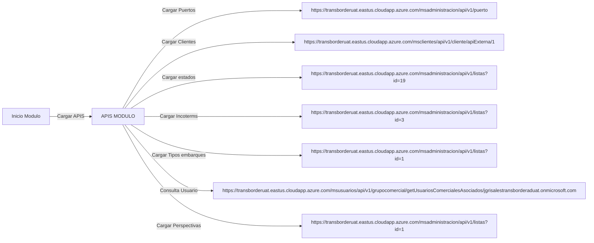
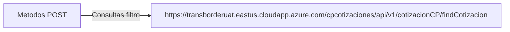

# Cotizador Docs

## Cotizaciones

### Consultar cotizaciones

### Ubicación Componente
[Componente consulta cotizacion](./Images/Consulta-cotizacion.png)

---

<h2>Al cargar la pantalla de consulta coticiones creadas se cargan las siguientes APIS:</h2>

 

<h2>Lista de puertos hasta el id 1307</h2>

 

### Metodo GET
- `https://transborderuat.eastus.cloudapp.azure.com/msadministracion/api/v1/puerto`

**Response**:
~~~
[
    {
        "id": 302,
        "nombre": "DURRËS",
        "pais": {
            "id": 240,
            "nombre": "ALBANIA",
            "codigo": "AL",
            "requiereCodigoZip": false
        },
        "ciudad": {
            "id": 58841,
            "nombre": "DURRËS",
            "pais": {
                "id": 240,
                "nombre": "ALBANIA",
                "codigo": "AL",
                "requiereCodigoZip": false
            },
            "codigo": "DRZ"
        }
    },
    {
        "id": 303,
        "nombre": "ALGER (ALGIERS)",
        "pais": {
            "id": 241,
            "nombre": "ALGERIA",
            "codigo": "DZ",
            "requiereCodigoZip": false
        },
        "ciudad": {
            "id": 58874,
            "nombre": "ALGER (ALGIERS)",
            "pais": {
                "id": 241,
                "nombre": "ALGERIA",
                "codigo": "DZ",
                "requiereCodigoZip": false
            },
            "codigo": "ALG"
        }
    }
]
~~~

---

<h2>Se obtiene un objeto json con datos de los clientes: </h2>

 

### Metodo GET 
- `https://transborderuat.eastus.cloudapp.azure.com/msclientes/api/v1/cliente/apiExterna/{id} `  
    > ***Note***: El parametro del url es un id (numero).

**Response**:

~~~
[
    {
        "id": null,
        "idLotus": "84816D82896D8B2605257EE4006DB0E5",
        "numeroIdentificacion": "",
        "digitoVerificacion": "",
        "razonSocial": "",
        "direccion": "",
        "telefono": "",
        "tipoIdentificacion": "NIT",
        "vinculado": "Si",
        "tierLotus": "",
        "tier": null
    },
    {
        "id": null,
        "idLotus": "26DF25A8401C547F0525842400785193",
        "numeroIdentificacion": "900743775",
        "digitoVerificacion": "2",
        "razonSocial": "\tPUBLILEDS COLOMBIA S.A.S.",
        "direccion": " TRANSVERSAL 3 B 23 200 TORRE 2\r\nPUERTO COLOMBIA\r\nATLANTICO",
        "telefono": "3212107906",
        "tipoIdentificacion": "NIT",
        "vinculado": "Si",
        "tierLotus": "3",
        "tier": null
    },
    {
        "id": null,
        "idLotus": "180A2C6BFCB5E166052589C2006E1360",
        "numeroIdentificacion": "901191324",
        "digitoVerificacion": "8",
        "razonSocial": "\r\nNEMOOTECH SAS\r\n",
        "direccion": "Carrera  48 # 10 - 45 Medellin",
        "telefono": "3244233311 ",
        "tipoIdentificacion": "NIT",
        "vinculado": "Si",
        "tierLotus": "3",
        "tier": null
    }
]
~~~

---

 <h2>Se obtiene un objeto json con datos de los estados</h2>

 

### Metodo GET 

- `https://transborderuat.eastus.cloudapp.azure.com/msadministracion/api/v1/listas?id={id}` 
  > ***Note***: El parametro del url es un id (numero).
  
  **Response**:

  ~~~
    [
        {
            "idLista": 19,
            "identificador": "EN_CREACION",
            "valor": "En creación",
            "atributos": null
        },
        {
            "idLista": 19,
            "identificador": "EN_ESPERA_SPOT",
            "valor": "En espera spot",
            "atributos": null
        },
        {
            "idLista": 19,
            "identificador": "CREADA",
            "valor": "Creada",
            "atributos": null
        },
        {
            "idLista": 19,
            "identificador": "PENDIENTE_ACEPTACION",
            "valor": "Pendiente de Aceptación",
            "atributos": null
        },
        {
            "idLista": 19,
            "identificador": "ACEPTADA",
            "valor": "Aceptada",
            "atributos": null
        },
        {
            "idLista": 19,
            "identificador": "PREP_INST_EMBARQ_ENV",
            "valor": "Preparación de instrucción de embarque enviada",
            "atributos": null
        },
        {
            "idLista": 19,
            "identificador": "VENCIDA",
            "valor": "Vencida",
            "atributos": null
        },
        {
            "idLista": 19,
            "identificador": "ANULADA",
            "valor": "Anulada",
            "atributos": null
        }
    ]
  ~~~

---

<h2>Se obtiene un objeto json con los IncoTerms: </h2>

 

### Metodo GET 

- `https://transborderuat.eastus.cloudapp.azure.com/msadministracion/api/v1/listas?id={id}`
  > ***Note***: El parametro del url es un id (numero).

**Response**:

~~~
[
      {
          "idLista": 3,
          "identificador": "EXW",
          "valor": "Exworks",
          "atributos": null
      },
      {
          "idLista": 3,
          "identificador": "FCA",
          "valor": "Free Carrier",
          "atributos": null
      },
      {
          "idLista": 3,
          "identificador": "FAS",
          "valor": "Free Alongside Ship",
          "atributos": null
      },
      {
          "idLista": 3,
          "identificador": "FOB",
          "valor": "Free On Board",
          "atributos": null
      },
      {
          "idLista": 3,
          "identificador": "CFR",
          "valor": "Cost & Freight",
          "atributos": null
      },
      {
          "idLista": 3,
          "identificador": "CIF",
          "valor": "Cost, Insurance & Freight",
          "atributos": null
      },
      {
          "idLista": 3,
          "identificador": "CPT",
          "valor": "Cost Paid To",
          "atributos": null
      },
      {
          "idLista": 3,
          "identificador": "CIP",
          "valor": "Carrier & Insurance Paid to",
          "atributos": null
      },
      {
          "idLista": 3,
          "identificador": "DPU",
          "valor": "Delivered at Place Unloaded",
          "atributos": null
      },
      {
          "idLista": 3,
          "identificador": "DAP",
          "valor": "Delivered At Place",
          "atributos": null
      },
      {
          "idLista": 3,
          "identificador": "DDP",
          "valor": "Delivered Duty Paid",
          "atributos": null
      }
  ]
~~~

 
---

<h2>Se obtiene un objeto json con los Tipos de embarque: </h2>

 

### Metodo GET 

- `https://transborderuat.eastus.cloudapp.azure.com/msadministracion/api/v1/listas?id={id}` 
  > ***Note***: El parametro del url es un id (numero).

**Response**:

~~~
  [
      {
          "idLista": 1,
          "identificador": "FCL",
          "valor": "Full Container Load",
          "atributos": null
      },
      {
          "idLista": 1,
          "identificador": "LCL",
          "valor": "Less Container Load",
          "atributos": null
      }
  ]
~~~

---

### Se hace una peticion a esta URL tambien
### Metodo GET 

- `https://transborderuat.eastus.cloudapp.azure.com/msusuarios/api/v1/grupocomercial/getUsuariosComercialesAsociados/jgrisales@transborderaduat.onmicrosoft.com`

---

<h2>Se obtiene un objeto json con las Perspectivas: </h2>

 

### Metodo GET 

- `https://transborderuat.eastus.cloudapp.azure.com/msadministracion/api/v1/listas?id={id}`
    > ***Note***: El parametro del url es un id (numero).
  
**Response**:

~~~
[
    {
        "idLista": 4,
        "identificador": "COMPRADOR",
        "valor": "Comprador",
        "atributos": null
    },
    {
        "idLista": 4,
        "identificador": "VENDEDOR",
        "valor": "Vendedor",
        "atributos": null
    }
]
~~~

---

# Consultas en el Filtro
---

---

## Metodo POST

## Las peticiones que se hacen en los filtros, siempre apuntan a este end point `https://transborderuat.eastus.cloudapp.azure.com/cpcotizaciones/api/v1/cotizacionCP/findCotizacion`

<h2>Consultar por Numero Cotizacion</h2>

 

**Request**:

~~~
{
	"numeroCotizacion": "1-050523-000039",
	"pagina": 1
}
~~~

**Response**:

~~~
[
	{
		"idCotizacion": 43,
		"numeroCotizacion": "1-050523-000039",
		"nombreEmpresa": "JADASH S A S",
		"fechaCreacion": "2023-05-05T16:29:00.000+00:00",
		"estado": "PREP_INST_EMBARQ_ENV",
		"spotPorConfirmar": "No",
		"tipoOperacion": null,
		"puertoOrigen": "HAMBURG",
		"puertoDestino": "BARRANQUILLA",
		"incoterm": "EXW",
		"tipoEmbarque": "FCL",
		"numeroInstruccionEmbarque": "1 - 152084",
		"count": 1,
		"numDocCliente": "900875640",
		"idCotizacionEnCreacion": null,
		"origenVersion": null,
		"origenClonacion": null,
		"respuestaProductoEnEsperaSpot": false,
		"versionada": false,
		"reporteGastosPorConfirmarVencidos": false,
		"creadaConEsperaSpot": false,
		"formaGeneracion": "DESGLOSADA",
		"idiomaPdf": "ESPAÑOL",
		"respuestaProductoSpotPorConfirmar": false,
		"ciudadOrigen": "HAMBURG, GERMANY",
		"ciudadDestino": "BARRANQUILLA, COLOMBIA",
		"perspectiva": "COMPRADOR",
		"tarifasActualizadas": true,
		"vencidaInstruccionada": false
	}
]
~~~

---

<h2>Consultar por Cliente</h2>

 

**Request**:
~~~
{
    "digitoVerificacionCliente": "4",
    "numeroIdentificacionCliente": "830080641",
    "pagina": 1,
    "tipoIdentificacionCliente": "NIT"
}
~~~

**Response**:
~~~
[
    {
        "idCotizacion": 44,
        "numeroCotizacion": "1-050523-000040",
        "nombreEmpresa": "PARTEQUIPOS S.A.S",
        "fechaCreacion": "2023-05-05T16:42:00.000+00:00",
        "estado": "PREP_INST_EMBARQ_ENV",
        "spotPorConfirmar": "No",
        "tipoOperacion": null,
        "puertoOrigen": "HAMBURG",
        "puertoDestino": "BARRANQUILLA",
        "incoterm": "FOB",
        "tipoEmbarque": "LCL",
        "numeroInstruccionEmbarque": "1 - 152085",
        "count": 2,
        "numDocCliente": "830080641",
        "idCotizacionEnCreacion": null,
        "origenVersion": null,
        "origenClonacion": 42,
        "respuestaProductoEnEsperaSpot": false,
        "versionada": false,
        "reporteGastosPorConfirmarVencidos": false,
        "creadaConEsperaSpot": false,
        "formaGeneracion": "SEMIDESGLOSADA",
        "idiomaPdf": "ESPAÑOL",
        "respuestaProductoSpotPorConfirmar": false,
        "ciudadOrigen": "HAMBURG, GERMANY",
        "ciudadDestino": "BARRANQUILLA, COLOMBIA",
        "perspectiva": "COMPRADOR",
        "tarifasActualizadas": null,
        "vencidaInstruccionada": false
    },
    {
        "idCotizacion": 42,
        "numeroCotizacion": "1-050523-000038",
        "nombreEmpresa": "PARTEQUIPOS S.A.S",
        "fechaCreacion": "2023-05-05T16:21:00.000+00:00",
        "estado": "PREP_INST_EMBARQ_ENV",
        "spotPorConfirmar": "No",
        "tipoOperacion": null,
        "puertoOrigen": "HAMBURG",
        "puertoDestino": "BARRANQUILLA",
        "incoterm": "EXW",
        "tipoEmbarque": "LCL",
        "numeroInstruccionEmbarque": "1 - 152083",
        "count": 2,
        "numDocCliente": "830080641",
        "idCotizacionEnCreacion": null,
        "origenVersion": null,
        "origenClonacion": null,
        "respuestaProductoEnEsperaSpot": false,
        "versionada": false,
        "reporteGastosPorConfirmarVencidos": false,
        "creadaConEsperaSpot": false,
        "formaGeneracion": "DESGLOSADA",
        "idiomaPdf": "ESPAÑOL",
        "respuestaProductoSpotPorConfirmar": false,
        "ciudadOrigen": "HAMBURG, GERMANY",
        "ciudadDestino": "BARRANQUILLA, COLOMBIA",
        "perspectiva": "COMPRADOR",
        "tarifasActualizadas": null,
        "vencidaInstruccionada": false
    }
]
~~~

---

<h2>Consultar por Fecha</h2>

 

**Request**:

~~~
{
	"fechaFin": "2023-11-24T05:00:00.000Z",
	"fechaInicio": "2022-11-24T05:00:00.000Z",
	"pagina": 1
}
~~~

**Response**

~~~
{
	"1": {
		"idCotizacion": 43,
		"numeroCotizacion": "1-050523-000039",
		"nombreEmpresa": "JADASH S A S",
		"fechaCreacion": "2023-05-05T16:29:00.000+00:00",
		"estado": "PREP_INST_EMBARQ_ENV",
		"spotPorConfirmar": "No",
		"tipoOperacion": null,
		"puertoOrigen": "HAMBURG",
		"puertoDestino": "BARRANQUILLA",
		"incoterm": "EXW",
		"tipoEmbarque": "FCL",
		"numeroInstruccionEmbarque": "1 - 152084",
		"count": 4,
		"numDocCliente": "900875640",
		"idCotizacionEnCreacion": null,
		"origenVersion": null,
		"origenClonacion": null,
		"respuestaProductoEnEsperaSpot": false,
		"versionada": false,
		"reporteGastosPorConfirmarVencidos": false,
		"creadaConEsperaSpot": false,
		"formaGeneracion": "DESGLOSADA",
		"idiomaPdf": "ESPAÑOL",
		"respuestaProductoSpotPorConfirmar": false,
		"ciudadOrigen": "HAMBURG, GERMANY",
		"ciudadDestino": "BARRANQUILLA, COLOMBIA",
		"perspectiva": "COMPRADOR",
		"tarifasActualizadas": true,
		"vencidaInstruccionada": false
	}
}
~~~

---

<h2>Consultar por Estado</h2>

 

**Request**:

~~~
{
	"estado": "PREP_INST_EMBARQ_ENV",
	"pagina": 1
}
~~~

**Response**:

~~~
[
	{
		"idCotizacion": 44,
		"numeroCotizacion": "1-050523-000040",
		"nombreEmpresa": "PARTEQUIPOS S.A.S",
		"fechaCreacion": "2023-05-05T16:42:00.000+00:00",
		"estado": "PREP_INST_EMBARQ_ENV",
		"spotPorConfirmar": "No",
		"tipoOperacion": null,
		"puertoOrigen": "HAMBURG",
		"puertoDestino": "BARRANQUILLA",
		"incoterm": "FOB",
		"tipoEmbarque": "LCL",
		"numeroInstruccionEmbarque": "1 - 152085",
		"count": 3,
		"numDocCliente": "830080641",
		"idCotizacionEnCreacion": null,
		"origenVersion": null,
		"origenClonacion": 42,
		"respuestaProductoEnEsperaSpot": false,
		"versionada": false,
		"reporteGastosPorConfirmarVencidos": false,
		"creadaConEsperaSpot": false,
		"formaGeneracion": "SEMIDESGLOSADA",
		"idiomaPdf": "ESPAÑOL",
		"respuestaProductoSpotPorConfirmar": false,
		"ciudadOrigen": "HAMBURG, GERMANY",
		"ciudadDestino": "BARRANQUILLA, COLOMBIA",
		"perspectiva": "COMPRADOR",
		"tarifasActualizadas": null,
		"vencidaInstruccionada": false
	},
	{
		"idCotizacion": 43,
		"numeroCotizacion": "1-050523-000039",
		"nombreEmpresa": "JADASH S A S",
		"fechaCreacion": "2023-05-05T16:29:00.000+00:00",
		"estado": "PREP_INST_EMBARQ_ENV",
		"spotPorConfirmar": "No",
		"tipoOperacion": null,
		"puertoOrigen": "HAMBURG",
		"puertoDestino": "BARRANQUILLA",
		"incoterm": "EXW",
		"tipoEmbarque": "FCL",
		"numeroInstruccionEmbarque": "1 - 152084",
		"count": 3,
		"numDocCliente": "900875640",
		"idCotizacionEnCreacion": null,
		"origenVersion": null,
		"origenClonacion": null,
		"respuestaProductoEnEsperaSpot": false,
		"versionada": false,
		"reporteGastosPorConfirmarVencidos": false,
		"creadaConEsperaSpot": false,
		"formaGeneracion": "DESGLOSADA",
		"idiomaPdf": "ESPAÑOL",
		"respuestaProductoSpotPorConfirmar": false,
		"ciudadOrigen": "HAMBURG, GERMANY",
		"ciudadDestino": "BARRANQUILLA, COLOMBIA",
		"perspectiva": "COMPRADOR",
		"tarifasActualizadas": true,
		"vencidaInstruccionada": false
	},
	{
		"idCotizacion": 42,
		"numeroCotizacion": "1-050523-000038",
		"nombreEmpresa": "PARTEQUIPOS S.A.S",
		"fechaCreacion": "2023-05-05T16:21:00.000+00:00",
		"estado": "PREP_INST_EMBARQ_ENV",
		"spotPorConfirmar": "No",
		"tipoOperacion": null,
		"puertoOrigen": "HAMBURG",
		"puertoDestino": "BARRANQUILLA",
		"incoterm": "EXW",
		"tipoEmbarque": "LCL",
		"numeroInstruccionEmbarque": "1 - 152083",
		"count": 3,
		"numDocCliente": "830080641",
		"idCotizacionEnCreacion": null,
		"origenVersion": null,
		"origenClonacion": null,
		"respuestaProductoEnEsperaSpot": false,
		"versionada": false,
		"reporteGastosPorConfirmarVencidos": false,
		"creadaConEsperaSpot": false,
		"formaGeneracion": "DESGLOSADA",
		"idiomaPdf": "ESPAÑOL",
		"respuestaProductoSpotPorConfirmar": false,
		"ciudadOrigen": "HAMBURG, GERMANY",
		"ciudadDestino": "BARRANQUILLA, COLOMBIA",
		"perspectiva": "COMPRADOR",
		"tarifasActualizadas": null,
		"vencidaInstruccionada": false
	}
]
~~~

---

<h2>Consultar por Ciudad, Pais Origen</h2>

 

**Response**:

~~~
[
	{
        "idCiudadOrigen": 101946,
        "pagina": 1
    }
]
~~~

**Response**:

~~~
    [
        {
            "idCotizacion": 44,
            "numeroCotizacion": "1-050523-000040",
            "nombreEmpresa": "PARTEQUIPOS S.A.S",
            "fechaCreacion": "2023-05-05T16:42:00.000+00:00",
            "estado": "PREP_INST_EMBARQ_ENV",
            "spotPorConfirmar": "No",
            "tipoOperacion": null,
            "puertoOrigen": "HAMBURG",
            "puertoDestino": "BARRANQUILLA",
            "incoterm": "FOB",
            "tipoEmbarque": "LCL",
            "numeroInstruccionEmbarque": "1 - 152085",
            "count": 3,
            "numDocCliente": "830080641",
            "idCotizacionEnCreacion": null,
            "origenVersion": null,
            "origenClonacion": 42,
            "respuestaProductoEnEsperaSpot": false,
            "versionada": false,
            "reporteGastosPorConfirmarVencidos": false,
            "creadaConEsperaSpot": false,
            "formaGeneracion": "SEMIDESGLOSADA",
            "idiomaPdf": "ESPAÑOL",
            "respuestaProductoSpotPorConfirmar": false,
            "ciudadOrigen": "HAMBURG, GERMANY",
            "ciudadDestino": "BARRANQUILLA, COLOMBIA",
            "perspectiva": "COMPRADOR",
            "tarifasActualizadas": null,
            "vencidaInstruccionada": false
        },
        {
            "idCotizacion": 43,
            "numeroCotizacion": "1-050523-000039",
            "nombreEmpresa": "JADASH S A S",
            "fechaCreacion": "2023-05-05T16:29:00.000+00:00",
            "estado": "PREP_INST_EMBARQ_ENV",
            "spotPorConfirmar": "No",
            "tipoOperacion": null,
            "puertoOrigen": "HAMBURG",
            "puertoDestino": "BARRANQUILLA",
            "incoterm": "EXW",
            "tipoEmbarque": "FCL",
            "numeroInstruccionEmbarque": "1 - 152084",
            "count": 3,
            "numDocCliente": "900875640",
            "idCotizacionEnCreacion": null,
            "origenVersion": null,
            "origenClonacion": null,
            "respuestaProductoEnEsperaSpot": false,
            "versionada": false,
            "reporteGastosPorConfirmarVencidos": false,
            "creadaConEsperaSpot": false,
            "formaGeneracion": "DESGLOSADA",
            "idiomaPdf": "ESPAÑOL",
            "respuestaProductoSpotPorConfirmar": false,
            "ciudadOrigen": "HAMBURG, GERMANY",
            "ciudadDestino": "BARRANQUILLA, COLOMBIA",
            "perspectiva": "COMPRADOR",
            "tarifasActualizadas": true,
            "vencidaInstruccionada": false
        },
        {
            "idCotizacion": 42,
            "numeroCotizacion": "1-050523-000038",
            "nombreEmpresa": "PARTEQUIPOS S.A.S",
            "fechaCreacion": "2023-05-05T16:21:00.000+00:00",
            "estado": "PREP_INST_EMBARQ_ENV",
            "spotPorConfirmar": "No",
            "tipoOperacion": null,
            "puertoOrigen": "HAMBURG",
            "puertoDestino": "BARRANQUILLA",
            "incoterm": "EXW",
            "tipoEmbarque": "LCL",
            "numeroInstruccionEmbarque": "1 - 152083",
            "count": 3,
            "numDocCliente": "830080641",
            "idCotizacionEnCreacion": null,
            "origenVersion": null,
            "origenClonacion": null,
            "respuestaProductoEnEsperaSpot": false,
            "versionada": false,
            "reporteGastosPorConfirmarVencidos": false,
            "creadaConEsperaSpot": false,
            "formaGeneracion": "DESGLOSADA",
            "idiomaPdf": "ESPAÑOL",
            "respuestaProductoSpotPorConfirmar": false,
            "ciudadOrigen": "HAMBURG, GERMANY",
            "ciudadDestino": "BARRANQUILLA, COLOMBIA",
            "perspectiva": "COMPRADOR",
            "tarifasActualizadas": null,
            "vencidaInstruccionada": false
        }
    ]
~~~

---

<h2>Consultar por Puerto</h2>

 

**Request**:

~~~
{
	"idPuertoOrigen": 619,
	"pagina": 1
}
~~~

**Response**:

~~~
[
	{
		"idCotizacion": 44,
		"numeroCotizacion": "1-050523-000040",
		"nombreEmpresa": "PARTEQUIPOS S.A.S",
		"fechaCreacion": "2023-05-05T16:42:00.000+00:00",
		"estado": "PREP_INST_EMBARQ_ENV",
		"spotPorConfirmar": "No",
		"tipoOperacion": null,
		"puertoOrigen": "HAMBURG",
		"puertoDestino": "BARRANQUILLA",
		"incoterm": "FOB",
		"tipoEmbarque": "LCL",
		"numeroInstruccionEmbarque": "1 - 152085",
		"count": 3,
		"numDocCliente": "830080641",
		"idCotizacionEnCreacion": null,
		"origenVersion": null,
		"origenClonacion": 42,
		"respuestaProductoEnEsperaSpot": false,
		"versionada": false,
		"reporteGastosPorConfirmarVencidos": false,
		"creadaConEsperaSpot": false,
		"formaGeneracion": "SEMIDESGLOSADA",
		"idiomaPdf": "ESPAÑOL",
		"respuestaProductoSpotPorConfirmar": false,
		"ciudadOrigen": "HAMBURG, GERMANY",
		"ciudadDestino": "BARRANQUILLA, COLOMBIA",
		"perspectiva": "COMPRADOR",
		"tarifasActualizadas": null,
		"vencidaInstruccionada": false
	},
	{
		"idCotizacion": 43,
		"numeroCotizacion": "1-050523-000039",
		"nombreEmpresa": "JADASH S A S",
		"fechaCreacion": "2023-05-05T16:29:00.000+00:00",
		"estado": "PREP_INST_EMBARQ_ENV",
		"spotPorConfirmar": "No",
		"tipoOperacion": null,
		"puertoOrigen": "HAMBURG",
		"puertoDestino": "BARRANQUILLA",
		"incoterm": "EXW",
		"tipoEmbarque": "FCL",
		"numeroInstruccionEmbarque": "1 - 152084",
		"count": 3,
		"numDocCliente": "900875640",
		"idCotizacionEnCreacion": null,
		"origenVersion": null,
		"origenClonacion": null,
		"respuestaProductoEnEsperaSpot": false,
		"versionada": false,
		"reporteGastosPorConfirmarVencidos": false,
		"creadaConEsperaSpot": false,
		"formaGeneracion": "DESGLOSADA",
		"idiomaPdf": "ESPAÑOL",
		"respuestaProductoSpotPorConfirmar": false,
		"ciudadOrigen": "HAMBURG, GERMANY",
		"ciudadDestino": "BARRANQUILLA, COLOMBIA",
		"perspectiva": "COMPRADOR",
		"tarifasActualizadas": true,
		"vencidaInstruccionada": false
	},
	{
		"idCotizacion": 42,
		"numeroCotizacion": "1-050523-000038",
		"nombreEmpresa": "PARTEQUIPOS S.A.S",
		"fechaCreacion": "2023-05-05T16:21:00.000+00:00",
		"estado": "PREP_INST_EMBARQ_ENV",
		"spotPorConfirmar": "No",
		"tipoOperacion": null,
		"puertoOrigen": "HAMBURG",
		"puertoDestino": "BARRANQUILLA",
		"incoterm": "EXW",
		"tipoEmbarque": "LCL",
		"numeroInstruccionEmbarque": "1 - 152083",
		"count": 3,
		"numDocCliente": "830080641",
		"idCotizacionEnCreacion": null,
		"origenVersion": null,
		"origenClonacion": null,
		"respuestaProductoEnEsperaSpot": false,
		"versionada": false,
		"reporteGastosPorConfirmarVencidos": false,
		"creadaConEsperaSpot": false,
		"formaGeneracion": "DESGLOSADA",
		"idiomaPdf": "ESPAÑOL",
		"respuestaProductoSpotPorConfirmar": false,
		"ciudadOrigen": "HAMBURG, GERMANY",
		"ciudadDestino": "BARRANQUILLA, COLOMBIA",
		"perspectiva": "COMPRADOR",
		"tarifasActualizadas": null,
		"vencidaInstruccionada": false
	}
]
~~~

---

<h2>Consultar por SPOT</h2>

 

***Rquest***:

~~~
{
	"pagina": 1,
	"spotPorConfirmar": false
}
~~~

**Response**:

~~~
[
	{
		"idCotizacion": 44,
		"numeroCotizacion": "1-050523-000040",
		"nombreEmpresa": "PARTEQUIPOS S.A.S",
		"fechaCreacion": "2023-05-05T16:42:00.000+00:00",
		"estado": "PREP_INST_EMBARQ_ENV",
		"spotPorConfirmar": "No",
		"tipoOperacion": null,
		"puertoOrigen": "HAMBURG",
		"puertoDestino": "BARRANQUILLA",
		"incoterm": "FOB",
		"tipoEmbarque": "LCL",
		"numeroInstruccionEmbarque": "1 - 152085",
		"count": 4,
		"numDocCliente": "830080641",
		"idCotizacionEnCreacion": null,
		"origenVersion": null,
		"origenClonacion": 42,
		"respuestaProductoEnEsperaSpot": false,
		"versionada": false,
		"reporteGastosPorConfirmarVencidos": false,
		"creadaConEsperaSpot": false,
		"formaGeneracion": "SEMIDESGLOSADA",
		"idiomaPdf": "ESPAÑOL",
		"respuestaProductoSpotPorConfirmar": false,
		"ciudadOrigen": "HAMBURG, GERMANY",
		"ciudadDestino": "BARRANQUILLA, COLOMBIA",
		"perspectiva": "COMPRADOR",
		"tarifasActualizadas": null,
		"vencidaInstruccionada": false
	},
	{
		"idCotizacion": 43,
		"numeroCotizacion": "1-050523-000039",
		"nombreEmpresa": "JADASH S A S",
		"fechaCreacion": "2023-05-05T16:29:00.000+00:00",
		"estado": "PREP_INST_EMBARQ_ENV",
		"spotPorConfirmar": "No",
		"tipoOperacion": null,
		"puertoOrigen": "HAMBURG",
		"puertoDestino": "BARRANQUILLA",
		"incoterm": "EXW",
		"tipoEmbarque": "FCL",
		"numeroInstruccionEmbarque": "1 - 152084",
		"count": 4,
		"numDocCliente": "900875640",
		"idCotizacionEnCreacion": null,
		"origenVersion": null,
		"origenClonacion": null,
		"respuestaProductoEnEsperaSpot": false,
		"versionada": false,
		"reporteGastosPorConfirmarVencidos": false,
		"creadaConEsperaSpot": false,
		"formaGeneracion": "DESGLOSADA",
		"idiomaPdf": "ESPAÑOL",
		"respuestaProductoSpotPorConfirmar": false,
		"ciudadOrigen": "HAMBURG, GERMANY",
		"ciudadDestino": "BARRANQUILLA, COLOMBIA",
		"perspectiva": "COMPRADOR",
		"tarifasActualizadas": true,
		"vencidaInstruccionada": false
	},
	{
		"idCotizacion": 42,
		"numeroCotizacion": "1-050523-000038",
		"nombreEmpresa": "PARTEQUIPOS S.A.S",
		"fechaCreacion": "2023-05-05T16:21:00.000+00:00",
		"estado": "PREP_INST_EMBARQ_ENV",
		"spotPorConfirmar": "No",
		"tipoOperacion": null,
		"puertoOrigen": "HAMBURG",
		"puertoDestino": "BARRANQUILLA",
		"incoterm": "EXW",
		"tipoEmbarque": "LCL",
		"numeroInstruccionEmbarque": "1 - 152083",
		"count": 4,
		"numDocCliente": "830080641",
		"idCotizacionEnCreacion": null,
		"origenVersion": null,
		"origenClonacion": null,
		"respuestaProductoEnEsperaSpot": false,
		"versionada": false,
		"reporteGastosPorConfirmarVencidos": false,
		"creadaConEsperaSpot": false,
		"formaGeneracion": "DESGLOSADA",
		"idiomaPdf": "ESPAÑOL",
		"respuestaProductoSpotPorConfirmar": false,
		"ciudadOrigen": "HAMBURG, GERMANY",
		"ciudadDestino": "BARRANQUILLA, COLOMBIA",
		"perspectiva": "COMPRADOR",
		"tarifasActualizadas": null,
		"vencidaInstruccionada": false
	},
	{
		"idCotizacion": null,
		"numeroCotizacion": null,
		"nombreEmpresa": null,
		"fechaCreacion": null,
		"estado": "EN_CREACION",
		"spotPorConfirmar": "No",
		"tipoOperacion": null,
		"puertoOrigen": "GENOVA",
		"puertoDestino": "CARTAGENA",
		"incoterm": "EXW",
		"tipoEmbarque": "FCL",
		"numeroInstruccionEmbarque": "No aplica",
		"count": 4,
		"numDocCliente": "900276962",
		"idCotizacionEnCreacion": 2,
		"origenVersion": null,
		"origenClonacion": null,
		"respuestaProductoEnEsperaSpot": false,
		"versionada": false,
		"reporteGastosPorConfirmarVencidos": false,
		"creadaConEsperaSpot": false,
		"formaGeneracion": null,
		"idiomaPdf": null,
		"respuestaProductoSpotPorConfirmar": false,
		"ciudadOrigen": "GENOVA, ITALY",
		"ciudadDestino": "CARTAGENA, COLOMBIA",
		"perspectiva": "COMPRADOR",
		"tarifasActualizadas": null,
		"vencidaInstruccionada": false
	}
]
~~~

---

<h2>Consultar por Perspectiva</h2>

 

**Request**:

~~~
{
	"pagina": 1,
	"perspectiva": "COMPRADOR"
}
~~~

**Response**:

~~~
[
	{
		"idCotizacion": 44,
		"numeroCotizacion": "1-050523-000040",
		"nombreEmpresa": "PARTEQUIPOS S.A.S",
		"fechaCreacion": "2023-05-05T16:42:00.000+00:00",
		"estado": "PREP_INST_EMBARQ_ENV",
		"spotPorConfirmar": "No",
		"tipoOperacion": null,
		"puertoOrigen": "HAMBURG",
		"puertoDestino": "BARRANQUILLA",
		"incoterm": "FOB",
		"tipoEmbarque": "LCL",
		"numeroInstruccionEmbarque": "1 - 152085",
		"count": 5,
		"numDocCliente": "830080641",
		"idCotizacionEnCreacion": null,
		"origenVersion": null,
		"origenClonacion": 42,
		"respuestaProductoEnEsperaSpot": false,
		"versionada": false,
		"reporteGastosPorConfirmarVencidos": false,
		"creadaConEsperaSpot": false,
		"formaGeneracion": "SEMIDESGLOSADA",
		"idiomaPdf": "ESPAÑOL",
		"respuestaProductoSpotPorConfirmar": false,
		"ciudadOrigen": "HAMBURG, GERMANY",
		"ciudadDestino": "BARRANQUILLA, COLOMBIA",
		"perspectiva": "COMPRADOR",
		"tarifasActualizadas": null,
		"vencidaInstruccionada": false
	},
	{
		"idCotizacion": 43,
		"numeroCotizacion": "1-050523-000039",
		"nombreEmpresa": "JADASH S A S",
		"fechaCreacion": "2023-05-05T16:29:00.000+00:00",
		"estado": "PREP_INST_EMBARQ_ENV",
		"spotPorConfirmar": "No",
		"tipoOperacion": null,
		"puertoOrigen": "HAMBURG",
		"puertoDestino": "BARRANQUILLA",
		"incoterm": "EXW",
		"tipoEmbarque": "FCL",
		"numeroInstruccionEmbarque": "1 - 152084",
		"count": 5,
		"numDocCliente": "900875640",
		"idCotizacionEnCreacion": null,
		"origenVersion": null,
		"origenClonacion": null,
		"respuestaProductoEnEsperaSpot": false,
		"versionada": false,
		"reporteGastosPorConfirmarVencidos": false,
		"creadaConEsperaSpot": false,
		"formaGeneracion": "DESGLOSADA",
		"idiomaPdf": "ESPAÑOL",
		"respuestaProductoSpotPorConfirmar": false,
		"ciudadOrigen": "HAMBURG, GERMANY",
		"ciudadDestino": "BARRANQUILLA, COLOMBIA",
		"perspectiva": "COMPRADOR",
		"tarifasActualizadas": true,
		"vencidaInstruccionada": false
	},
	{
		"idCotizacion": 42,
		"numeroCotizacion": "1-050523-000038",
		"nombreEmpresa": "PARTEQUIPOS S.A.S",
		"fechaCreacion": "2023-05-05T16:21:00.000+00:00",
		"estado": "PREP_INST_EMBARQ_ENV",
		"spotPorConfirmar": "No",
		"tipoOperacion": null,
		"puertoOrigen": "HAMBURG",
		"puertoDestino": "BARRANQUILLA",
		"incoterm": "EXW",
		"tipoEmbarque": "LCL",
		"numeroInstruccionEmbarque": "1 - 152083",
		"count": 5,
		"numDocCliente": "830080641",
		"idCotizacionEnCreacion": null,
		"origenVersion": null,
		"origenClonacion": null,
		"respuestaProductoEnEsperaSpot": false,
		"versionada": false,
		"reporteGastosPorConfirmarVencidos": false,
		"creadaConEsperaSpot": false,
		"formaGeneracion": "DESGLOSADA",
		"idiomaPdf": "ESPAÑOL",
		"respuestaProductoSpotPorConfirmar": false,
		"ciudadOrigen": "HAMBURG, GERMANY",
		"ciudadDestino": "BARRANQUILLA, COLOMBIA",
		"perspectiva": "COMPRADOR",
		"tarifasActualizadas": null,
		"vencidaInstruccionada": false
	},
	{
		"idCotizacion": 41,
		"numeroCotizacion": "1-050523-000037",
		"nombreEmpresa": "TU CASSA SAS",
		"fechaCreacion": "2023-05-05T16:16:00.000+00:00",
		"estado": "EN_ESPERA_SPOT",
		"spotPorConfirmar": "Sí",
		"tipoOperacion": null,
		"puertoOrigen": "MUNDRA",
		"puertoDestino": "BUENAVENTURA",
		"incoterm": "EXW",
		"tipoEmbarque": "FCL",
		"numeroInstruccionEmbarque": null,
		"count": 5,
		"numDocCliente": "900428423",
		"idCotizacionEnCreacion": null,
		"origenVersion": null,
		"origenClonacion": null,
		"respuestaProductoEnEsperaSpot": true,
		"versionada": false,
		"reporteGastosPorConfirmarVencidos": false,
		"creadaConEsperaSpot": true,
		"formaGeneracion": null,
		"idiomaPdf": null,
		"respuestaProductoSpotPorConfirmar": false,
		"ciudadOrigen": "MUNDRA, INDIA",
		"ciudadDestino": "BUENAVENTURA, COLOMBIA",
		"perspectiva": "COMPRADOR",
		"tarifasActualizadas": null,
		"vencidaInstruccionada": false
	},
	{
		"idCotizacion": null,
		"numeroCotizacion": null,
		"nombreEmpresa": null,
		"fechaCreacion": null,
		"estado": "EN_CREACION",
		"spotPorConfirmar": "No",
		"tipoOperacion": null,
		"puertoOrigen": "GENOVA",
		"puertoDestino": "CARTAGENA",
		"incoterm": "EXW",
		"tipoEmbarque": "FCL",
		"numeroInstruccionEmbarque": "No aplica",
		"count": 5,
		"numDocCliente": "900276962",
		"idCotizacionEnCreacion": 2,
		"origenVersion": null,
		"origenClonacion": null,
		"respuestaProductoEnEsperaSpot": false,
		"versionada": false,
		"reporteGastosPorConfirmarVencidos": false,
		"creadaConEsperaSpot": false,
		"formaGeneracion": null,
		"idiomaPdf": null,
		"respuestaProductoSpotPorConfirmar": false,
		"ciudadOrigen": "GENOVA, ITALY",
		"ciudadDestino": "CARTAGENA, COLOMBIA",
		"perspectiva": "COMPRADOR",
		"tarifasActualizadas": null,
		"vencidaInstruccionada": false
	}
]
~~~

---

<h2>Consultar por Incoterm</h2>

  

**Request**:

~~~
{
	"incoterm": "FOB",
	"pagina": 1
}
~~~

**Response**:

~~~
[
	{
		"idCotizacion": 44,
		"numeroCotizacion": "1-050523-000040",
		"nombreEmpresa": "PARTEQUIPOS S.A.S",
		"fechaCreacion": "2023-05-05T16:42:00.000+00:00",
		"estado": "PREP_INST_EMBARQ_ENV",
		"spotPorConfirmar": "No",
		"tipoOperacion": null,
		"puertoOrigen": "HAMBURG",
		"puertoDestino": "BARRANQUILLA",
		"incoterm": "FOB",
		"tipoEmbarque": "LCL",
		"numeroInstruccionEmbarque": "1 - 152085",
		"count": 1,
		"numDocCliente": "830080641",
		"idCotizacionEnCreacion": null,
		"origenVersion": null,
		"origenClonacion": 42,
		"respuestaProductoEnEsperaSpot": false,
		"versionada": false,
		"reporteGastosPorConfirmarVencidos": false,
		"creadaConEsperaSpot": false,
		"formaGeneracion": "SEMIDESGLOSADA",
		"idiomaPdf": "ESPAÑOL",
		"respuestaProductoSpotPorConfirmar": false,
		"ciudadOrigen": "HAMBURG, GERMANY",
		"ciudadDestino": "BARRANQUILLA, COLOMBIA",
		"perspectiva": "COMPRADOR",
		"tarifasActualizadas": null,
		"vencidaInstruccionada": false
	}
]
~~~

---

<h2>Consultar por Tipo Embarque</h2>

 

**Request**:

~~~
{
	"pagina": 1,
	"tipoEmbarque": "FCL"
}
~~~

**Response**:

~~~
[
	{
		"idCotizacion": 43,
		"numeroCotizacion": "1-050523-000039",
		"nombreEmpresa": "JADASH S A S",
		"fechaCreacion": "2023-05-05T16:29:00.000+00:00",
		"estado": "PREP_INST_EMBARQ_ENV",
		"spotPorConfirmar": "No",
		"tipoOperacion": null,
		"puertoOrigen": "HAMBURG",
		"puertoDestino": "BARRANQUILLA",
		"incoterm": "EXW",
		"tipoEmbarque": "FCL",
		"numeroInstruccionEmbarque": "1 - 152084",
		"count": 3,
		"numDocCliente": "900875640",
		"idCotizacionEnCreacion": null,
		"origenVersion": null,
		"origenClonacion": null,
		"respuestaProductoEnEsperaSpot": false,
		"versionada": false,
		"reporteGastosPorConfirmarVencidos": false,
		"creadaConEsperaSpot": false,
		"formaGeneracion": "DESGLOSADA",
		"idiomaPdf": "ESPAÑOL",
		"respuestaProductoSpotPorConfirmar": false,
		"ciudadOrigen": "HAMBURG, GERMANY",
		"ciudadDestino": "BARRANQUILLA, COLOMBIA",
		"perspectiva": "COMPRADOR",
		"tarifasActualizadas": true,
		"vencidaInstruccionada": false
	},
	{
		"idCotizacion": 41,
		"numeroCotizacion": "1-050523-000037",
		"nombreEmpresa": "TU CASSA SAS",
		"fechaCreacion": "2023-05-05T16:16:00.000+00:00",
		"estado": "EN_ESPERA_SPOT",
		"spotPorConfirmar": "Sí",
		"tipoOperacion": null,
		"puertoOrigen": "MUNDRA",
		"puertoDestino": "BUENAVENTURA",
		"incoterm": "EXW",
		"tipoEmbarque": "FCL",
		"numeroInstruccionEmbarque": null,
		"count": 3,
		"numDocCliente": "900428423",
		"idCotizacionEnCreacion": null,
		"origenVersion": null,
		"origenClonacion": null,
		"respuestaProductoEnEsperaSpot": true,
		"versionada": false,
		"reporteGastosPorConfirmarVencidos": false,
		"creadaConEsperaSpot": true,
		"formaGeneracion": null,
		"idiomaPdf": null,
		"respuestaProductoSpotPorConfirmar": false,
		"ciudadOrigen": "MUNDRA, INDIA",
		"ciudadDestino": "BUENAVENTURA, COLOMBIA",
		"perspectiva": "COMPRADOR",
		"tarifasActualizadas": null,
		"vencidaInstruccionada": false
	},
	{
		"idCotizacion": null,
		"numeroCotizacion": null,
		"nombreEmpresa": null,
		"fechaCreacion": null,
		"estado": "EN_CREACION",
		"spotPorConfirmar": "No",
		"tipoOperacion": null,
		"puertoOrigen": "GENOVA",
		"puertoDestino": "CARTAGENA",
		"incoterm": "EXW",
		"tipoEmbarque": "FCL",
		"numeroInstruccionEmbarque": "No aplica",
		"count": 3,
		"numDocCliente": "900276962",
		"idCotizacionEnCreacion": 2,
		"origenVersion": null,
		"origenClonacion": null,
		"respuestaProductoEnEsperaSpot": false,
		"versionada": false,
		"reporteGastosPorConfirmarVencidos": false,
		"creadaConEsperaSpot": false,
		"formaGeneracion": null,
		"idiomaPdf": null,
		"respuestaProductoSpotPorConfirmar": false,
		"ciudadOrigen": "GENOVA, ITALY",
		"ciudadDestino": "CARTAGENA, COLOMBIA",
		"perspectiva": "COMPRADOR",
		"tarifasActualizadas": null,
		"vencidaInstruccionada": false
	}
]
~~~

---

<h2>Consultar por No.Instruccion embarque</h2>

 

**Request**:

~~~
{
	"numeroInstruccionEmbarque": "1-152084",
	"pagina": 1
}
~~~

**Response**:

~~~
[
	{
		"idCotizacion": 43,
		"numeroCotizacion": "1-050523-000039",
		"nombreEmpresa": "JADASH S A S",
		"fechaCreacion": "2023-05-05T16:29:00.000+00:00",
		"estado": "PREP_INST_EMBARQ_ENV",
		"spotPorConfirmar": "No",
		"tipoOperacion": null,
		"puertoOrigen": "HAMBURG",
		"puertoDestino": "BARRANQUILLA",
		"incoterm": "EXW",
		"tipoEmbarque": "FCL",
		"numeroInstruccionEmbarque": "1 - 152084",
		"count": 1,
		"numDocCliente": "900875640",
		"idCotizacionEnCreacion": null,
		"origenVersion": null,
		"origenClonacion": null,
		"respuestaProductoEnEsperaSpot": false,
		"versionada": false,
		"reporteGastosPorConfirmarVencidos": false,
		"creadaConEsperaSpot": false,
		"formaGeneracion": "DESGLOSADA",
		"idiomaPdf": "ESPAÑOL",
		"respuestaProductoSpotPorConfirmar": false,
		"ciudadOrigen": "HAMBURG, GERMANY",
		"ciudadDestino": "BARRANQUILLA, COLOMBIA",
		"perspectiva": "COMPRADOR",
		"tarifasActualizadas": true,
		"vencidaInstruccionada": false
	}
]
~~~

---

### Consultar Puertos

 - `https://transborderuat.eastus.cloudapp.azure.com/msadministracion/api/v1/ciudad/findCiudadPaisPorNombre?cadena=+HAMBURG%2C+GERMANY (GET)`

**Response**:

~~~
[
	{
		"id": 101947,
		"requiereCodigoZip": false,
		"tienePuerto": false,
		"nc": "HAMBURG-MITTE",
		"np": "GERMANY",
		"cc": "HTJ",
		"cp": "DE"
	}
]
~~~

---

# Crear Cotizacion

<h2>Crear cotización</h2>

 

<h2>Ciudad Origen</h2>

 

### Metodo GET

- `https://transborderuat.eastus.cloudapp.azure.com/msadministracion/api/v1/puerto/byIdCiudad?idCiudad={idCiudad}}`
  > ***Note***: parametro idCiudad origen (numero)

**Response**

~~~
[
	{
		"id": 619,
		"nombre": "HAMBURG",
		"ciudad": {
			"id": 101946,
			"nombre": "HAMBURG",
			"pais": {
				"id": 320,
				"nombre": "GERMANY",
				"codigo": "DE",
				"requiereCodigoZip": false,
				"montoMaximoMercanciaGeneral": null,
				"montoMaximoMercanciaVulnerable": null,
				"aplicaProtocolo": false,
				"mercanciasVulnerables": "{\"nombre\":\"Mercancías vulnerables\",\r\n\t\"productos\":[{\r\n\t\t\"nombre\":\"Aceros\",\r\n\t\t\"productos\":[]\r\n\t},{\r\n\t\t\"nombre\":\"Zinc\",\r\n\t\t\"productos\":[]\r\n\t},{\r\n\t\t\"nombre\":\"Cobre en laminas o rollos de alambre\",\r\n\t\t\"productos\":[]\r\n\t},{\r\n\t\t\"nombre\":\"Alimentos enlatados\",\r\n\t\t\"productos\":[]\r\n\t},{\r\n\t\t\"nombre\":\"Leche en polvo\",\r\n\t\t\"productos\":[]\r\n\t},{\r\n\t\t\"nombre\":\"Arroz\",\r\n\t\t\"productos\":[]\r\n\t},{\r\n\t\t\"nombre\":\"Azúcar de cualquier tipo excluida el azúcar crudo\",\r\n\t\t\"productos\":[]\r\n\t},{\r\n\t\t\"nombre\":\"Calzado\",\r\n\t\t\"productos\":[]\r\n\t},{\r\n\t\t\"nombre\":\"Cueros\",\r\n\t\t\"productos\":[]\r\n\t},{\r\n\t\t\"nombre\":\"Productos de cuero terminados\",\r\n\t\t\"productos\":[]\r\n\t},{\r\n\t\t\"nombre\":\"Café de exportación\",\r\n\t\t\"productos\":[]\r\n\t},{\r\n\t\t\"nombre\":\"Café pergamino\",\r\n\t\t\"productos\":[]\r\n\t},{\r\n\t\t\"nombre\":\"Cigarrillos\",\r\n\t\t\"productos\":[]\r\n\t},{\r\n\t\t\"nombre\":\"Tabaco\",\r\n\t\t\"productos\":[]\r\n\t},{\r\n\t\t\"nombre\":\"Harina de pescado\",\r\n\t\t\"productos\":[]\r\n\t},{\r\n\t\t\"nombre\":\"Juegos de video\",\r\n\t\t\"productos\":[]\r\n\t},{\r\n\t\t\"nombre\":\"Software de videos\",\r\n\t\t\"productos\":[]\r\n\t},{\r\n\t\t\"nombre\":\"Juguetes para niños(as)\",\r\n\t\t\"productos\":[]\r\n\t},{\r\n\t\t\"nombre\":\"Perfumes\",\r\n\t\t\"productos\":[]\r\n\t},{\r\n\t\t\"nombre\":\"Colonias y productos similares (incluyendo productos de aseo personal)\",\r\n\t\t\"productos\":[]\r\n\t},{\r\n\t\t\"nombre\":\"Licores\",\r\n\t\t\"productos\":[]\r\n\t},{\r\n\t\t\"nombre\":\"Cervezas\",\r\n\t\t\"productos\":[]\r\n\t},{\r\n\t\t\"nombre\":\"Vinos\",\r\n\t\t\"productos\":[]\r\n\t},{\r\n\t\t\"nombre\":\"Libros e impresos\",\r\n\t\t\"productos\":[]\r\n\t},{\r\n\t\t\"nombre\":\"Textos escolares\",\r\n\t\t\"productos\":[]\r\n\t},{\r\n\t\t\"nombre\":\"Revistas\",\r\n\t\t\"productos\":[]\r\n\t},{\r\n\t\t\"nombre\":\"Llantas\",\r\n\t\t\"productos\":[]\r\n\t},{\r\n\t\t\"nombre\":\"Rines\",\r\n\t\t\"productos\":[]\r\n\t},{\r\n\t\t\"nombre\":\"Neumáticos\",\r\n\t\t\"productos\":[]\r\n\t},{\r\n\t\t\"nombre\":\"Máquinas para casinos\",\r\n\t\t\"productos\":[]\r\n\t},{\r\n\t\t\"nombre\":\"Juegos de azar\",\r\n\t\t\"productos\":[]\r\n\t},{\r\n\t\t\"nombre\":\"Teléfonos celulares o equivalentes\",\r\n\t\t\"productos\":[]\r\n\t},{\r\n\t\t\"nombre\":\"Papel y/o productos elaborados con pulpa de papel:\",\r\n\t\t\"productos\":[{\r\n\t\t\t\t\"nombre\":\"Papel higiénico\",\r\n\t\t\t\t\"productos\":[]\r\n\t\t\t},{\r\n\t\t\t\t\"nombre\":\"Servilletas\",\r\n\t\t\t\t\"productos\":[]\r\n\t\t\t},{\r\n\t\t\t\t\"nombre\":\"Toallas para cocina\",\r\n\t\t\t\t\"productos\":[]\r\n\t\t\t},{\r\n\t\t\t\t\"nombre\":\"Toallas sanitarias\",\r\n\t\t\t\t\"productos\":[]\r\n\t\t\t},{\r\n\t\t\t\t\"nombre\":\"Pañales desechables\",\r\n\t\t\t\t\"productos\":[]\r\n\t\t\t}]\r\n\t},{\r\n\t\t\"nombre\":\"Pinturas\",\r\n\t\t\"productos\":[]\r\n\t},{\r\n\t\t\"nombre\":\"Materias primas\",\r\n\t\t\"productos\":[]\r\n\t},{\r\n\t\t\"nombre\":\"Disolventes\",\r\n\t\t\"productos\":[]\r\n\t},{\r\n\t\t\"nombre\":\"Polipropileno\",\r\n\t\t\"productos\":[]\r\n\t},{\r\n\t\t\"nombre\":\"Polietileno\",\r\n\t\t\"productos\":[]\r\n\t},{\r\n\t\t\"nombre\":\"Látex en bruto o a granel\",\r\n\t\t\"productos\":[]\r\n\t},{\r\n\t\t\"nombre\":\"Productos biomédicos\",\r\n\t\t\"productos\":[]\r\n\t},{\r\n\t\t\"nombre\":\"Productos farmacéuticos\",\r\n\t\t\"productos\":[]\r\n\t},{\r\n\t\t\"nombre\":\"Productos veterinarios diferentes a la comida para animales\",\r\n\t\t\"productos\":[]\r\n\t},{\r\n\t\t\"nombre\":\"Productos químicos:\",\r\n\t\t\"productos\":[{\r\n\t\t\t\t\"nombre\":\"Agroquímicos\",\r\n\t\t\t\t\"productos\":[]\r\n\t\t\t},{\r\n\t\t\t\t\"nombre\":\"Fungicidas \",\r\n\t\t\t\t\"productos\":[]\r\n\t\t\t},{\r\n\t\t\t\t\"nombre\":\"Insecticidas\",\r\n\t\t\t\t\"productos\":[]\r\n\t\t\t},{\r\n\t\t\t\t\"nombre\":\"Abonos\",\r\n\t\t\t\t\"productos\":[]\r\n\t\t\t},{\r\n\t\t\t\t\"nombre\":\"Fertilizantes\",\r\n\t\t\t\t\"productos\":[]\r\n\t\t\t}]\r\n\t},{\r\n\t\t\"nombre\":\"Repuestos automotores\",\r\n\t\t\"productos\":[]\r\n\t},{\r\n\t\t\"nombre\":\"Material CKD, cuando vienen armados (no incluye partes para repuestos desarmados)\",\r\n\t\t\"productos\":[]\r\n\t},{\r\n\t\t\"nombre\":\"Textiles\",\r\n\t\t\"productos\":[]\r\n\t},{\r\n\t\t\"nombre\":\"Telas\",\r\n\t\t\"productos\":[]\r\n\t},{\r\n\t\t\"nombre\":\"Confecciones\",\r\n\t\t\"productos\":[]\r\n\t},{\r\n\t\t\"nombre\":\"Accesorios\",\r\n\t\t\"productos\":[]\r\n\t},{\r\n\t\t\"nombre\":\"Vehículos automotores transportados en camiones especiales o niñeras\",\r\n\t\t\"productos\":[]\r\n\t},{\r\n\t\t\"nombre\":\"Vehículos automotores movilizados por sus propios medios:\",\r\n\t\t\"productos\":[{\r\n\t\t\t\t\"nombre\":\"Aviones y/o helicópteros completos o en partes\",\r\n\t\t\t\t\"productos\":[]\r\n\t\t\t},{\r\n\t\t\t\t\"nombre\":\"Los vehículos en camiones especiales y/o niñeras serán considerados RIESGO MEDIANO hasta USD 250.000 por vehículo\",\r\n\t\t\t\t\"productos\":[]\r\n\t\t\t},{\r\n\t\t\t\t\"nombre\":\"Valores asegurados mayores serán considerados ALTO RIESGO\",\r\n\t\t\t\t\"productos\":[]\r\n\t\t\t},{\r\n\t\t\t\t\"nombre\":\"Abonos\",\r\n\t\t\t\t\"productos\":[]\r\n\t\t\t},{\r\n\t\t\t\t\"nombre\":\"Fertilizantes\",\r\n\t\t\t\t\"productos\":[]\r\n\t\t\t}]\r\n\t}\r\n\r\n\t]\r\n}"
			},
			"codigo": "HAM"
		},
		"codigo": "HAM"
	}
]
~~~

---

<h2>Ciudad Destino</h2>

 

### Metodo GET

- `https://transborderuat.eastus.cloudapp.azure.com/msadministracion/api/v1/puerto/byIdCiudad?idCiudad={idCiudad}`
  > ***Note***: parametro idCiudad destino (numero)

**Response**:

~~~
[
	{
		"id": 535,
		"nombre": "CARTAGENA",
		"ciudad": {
			"id": 77852,
			"nombre": "CARTAGENA",
			"pais": {
				"id": 285,
				"nombre": "COLOMBIA",
				"codigo": "CO",
				"requiereCodigoZip": false,
				"montoMaximoMercanciaGeneral": null,
				"montoMaximoMercanciaVulnerable": null,
				"aplicaProtocolo": false,
				"mercanciasVulnerables": "{\"nombre\":\"Mercancías vulnerables\",\r\n\t\"productos\":[{\r\n\t\t\"nombre\":\"Aceros\",\r\n\t\t\"productos\":[]\r\n\t},{\r\n\t\t\"nombre\":\"Zinc\",\r\n\t\t\"productos\":[]\r\n\t},{\r\n\t\t\"nombre\":\"Cobre en laminas o rollos de alambre\",\r\n\t\t\"productos\":[]\r\n\t},{\r\n\t\t\"nombre\":\"Alimentos enlatados\",\r\n\t\t\"productos\":[]\r\n\t},{\r\n\t\t\"nombre\":\"Leche en polvo\",\r\n\t\t\"productos\":[]\r\n\t},{\r\n\t\t\"nombre\":\"Arroz\",\r\n\t\t\"productos\":[]\r\n\t},{\r\n\t\t\"nombre\":\"Azúcar de cualquier tipo excluida el azúcar crudo\",\r\n\t\t\"productos\":[]\r\n\t},{\r\n\t\t\"nombre\":\"Calzado\",\r\n\t\t\"productos\":[]\r\n\t},{\r\n\t\t\"nombre\":\"Cueros\",\r\n\t\t\"productos\":[]\r\n\t},{\r\n\t\t\"nombre\":\"Productos de cuero terminados\",\r\n\t\t\"productos\":[]\r\n\t},{\r\n\t\t\"nombre\":\"Café de exportación\",\r\n\t\t\"productos\":[]\r\n\t},{\r\n\t\t\"nombre\":\"Café pergamino\",\r\n\t\t\"productos\":[]\r\n\t},{\r\n\t\t\"nombre\":\"Cigarrillos\",\r\n\t\t\"productos\":[]\r\n\t},{\r\n\t\t\"nombre\":\"Tabaco\",\r\n\t\t\"productos\":[]\r\n\t},{\r\n\t\t\"nombre\":\"Harina de pescado\",\r\n\t\t\"productos\":[]\r\n\t},{\r\n\t\t\"nombre\":\"Juegos de video\",\r\n\t\t\"productos\":[]\r\n\t},{\r\n\t\t\"nombre\":\"Software de videos\",\r\n\t\t\"productos\":[]\r\n\t},{\r\n\t\t\"nombre\":\"Juguetes para niños(as)\",\r\n\t\t\"productos\":[]\r\n\t},{\r\n\t\t\"nombre\":\"Perfumes\",\r\n\t\t\"productos\":[]\r\n\t},{\r\n\t\t\"nombre\":\"Colonias y productos similares (incluyendo productos de aseo personal)\",\r\n\t\t\"productos\":[]\r\n\t},{\r\n\t\t\"nombre\":\"Licores\",\r\n\t\t\"productos\":[]\r\n\t},{\r\n\t\t\"nombre\":\"Cervezas\",\r\n\t\t\"productos\":[]\r\n\t},{\r\n\t\t\"nombre\":\"Vinos\",\r\n\t\t\"productos\":[]\r\n\t},{\r\n\t\t\"nombre\":\"Libros e impresos\",\r\n\t\t\"productos\":[]\r\n\t},{\r\n\t\t\"nombre\":\"Textos escolares\",\r\n\t\t\"productos\":[]\r\n\t},{\r\n\t\t\"nombre\":\"Revistas\",\r\n\t\t\"productos\":[]\r\n\t},{\r\n\t\t\"nombre\":\"Llantas\",\r\n\t\t\"productos\":[]\r\n\t},{\r\n\t\t\"nombre\":\"Rines\",\r\n\t\t\"productos\":[]\r\n\t},{\r\n\t\t\"nombre\":\"Neumáticos\",\r\n\t\t\"productos\":[]\r\n\t},{\r\n\t\t\"nombre\":\"Máquinas para casinos\",\r\n\t\t\"productos\":[]\r\n\t},{\r\n\t\t\"nombre\":\"Juegos de azar\",\r\n\t\t\"productos\":[]\r\n\t},{\r\n\t\t\"nombre\":\"Teléfonos celulares o equivalentes\",\r\n\t\t\"productos\":[]\r\n\t},{\r\n\t\t\"nombre\":\"Papel y/o productos elaborados con pulpa de papel:\",\r\n\t\t\"productos\":[{\r\n\t\t\t\t\"nombre\":\"Papel higiénico\",\r\n\t\t\t\t\"productos\":[]\r\n\t\t\t},{\r\n\t\t\t\t\"nombre\":\"Servilletas\",\r\n\t\t\t\t\"productos\":[]\r\n\t\t\t},{\r\n\t\t\t\t\"nombre\":\"Toallas para cocina\",\r\n\t\t\t\t\"productos\":[]\r\n\t\t\t},{\r\n\t\t\t\t\"nombre\":\"Toallas sanitarias\",\r\n\t\t\t\t\"productos\":[]\r\n\t\t\t},{\r\n\t\t\t\t\"nombre\":\"Pañales desechables\",\r\n\t\t\t\t\"productos\":[]\r\n\t\t\t}]\r\n\t},{\r\n\t\t\"nombre\":\"Pinturas\",\r\n\t\t\"productos\":[]\r\n\t},{\r\n\t\t\"nombre\":\"Materias primas\",\r\n\t\t\"productos\":[]\r\n\t},{\r\n\t\t\"nombre\":\"Disolventes\",\r\n\t\t\"productos\":[]\r\n\t},{\r\n\t\t\"nombre\":\"Polipropileno\",\r\n\t\t\"productos\":[]\r\n\t},{\r\n\t\t\"nombre\":\"Polietileno\",\r\n\t\t\"productos\":[]\r\n\t},{\r\n\t\t\"nombre\":\"Látex en bruto o a granel\",\r\n\t\t\"productos\":[]\r\n\t},{\r\n\t\t\"nombre\":\"Productos biomédicos\",\r\n\t\t\"productos\":[]\r\n\t},{\r\n\t\t\"nombre\":\"Productos farmacéuticos\",\r\n\t\t\"productos\":[]\r\n\t},{\r\n\t\t\"nombre\":\"Productos veterinarios diferentes a la comida para animales\",\r\n\t\t\"productos\":[]\r\n\t},{\r\n\t\t\"nombre\":\"Productos químicos:\",\r\n\t\t\"productos\":[{\r\n\t\t\t\t\"nombre\":\"Agroquímicos\",\r\n\t\t\t\t\"productos\":[]\r\n\t\t\t},{\r\n\t\t\t\t\"nombre\":\"Fungicidas \",\r\n\t\t\t\t\"productos\":[]\r\n\t\t\t},{\r\n\t\t\t\t\"nombre\":\"Insecticidas\",\r\n\t\t\t\t\"productos\":[]\r\n\t\t\t},{\r\n\t\t\t\t\"nombre\":\"Abonos\",\r\n\t\t\t\t\"productos\":[]\r\n\t\t\t},{\r\n\t\t\t\t\"nombre\":\"Fertilizantes\",\r\n\t\t\t\t\"productos\":[]\r\n\t\t\t}]\r\n\t},{\r\n\t\t\"nombre\":\"Repuestos automotores\",\r\n\t\t\"productos\":[]\r\n\t},{\r\n\t\t\"nombre\":\"Material CKD, cuando vienen armados (no incluye partes para repuestos desarmados)\",\r\n\t\t\"productos\":[]\r\n\t},{\r\n\t\t\"nombre\":\"Textiles\",\r\n\t\t\"productos\":[]\r\n\t},{\r\n\t\t\"nombre\":\"Telas\",\r\n\t\t\"productos\":[]\r\n\t},{\r\n\t\t\"nombre\":\"Confecciones\",\r\n\t\t\"productos\":[]\r\n\t},{\r\n\t\t\"nombre\":\"Accesorios\",\r\n\t\t\"productos\":[]\r\n\t},{\r\n\t\t\"nombre\":\"Vehículos automotores transportados en camiones especiales o niñeras\",\r\n\t\t\"productos\":[]\r\n\t},{\r\n\t\t\"nombre\":\"Vehículos automotores movilizados por sus propios medios:\",\r\n\t\t\"productos\":[{\r\n\t\t\t\t\"nombre\":\"Aviones y/o helicópteros completos o en partes\",\r\n\t\t\t\t\"productos\":[]\r\n\t\t\t},{\r\n\t\t\t\t\"nombre\":\"Los vehículos en camiones especiales y/o niñeras serán considerados RIESGO MEDIANO hasta USD 250.000 por vehículo\",\r\n\t\t\t\t\"productos\":[]\r\n\t\t\t},{\r\n\t\t\t\t\"nombre\":\"Valores asegurados mayores serán considerados ALTO RIESGO\",\r\n\t\t\t\t\"productos\":[]\r\n\t\t\t},{\r\n\t\t\t\t\"nombre\":\"Abonos\",\r\n\t\t\t\t\"productos\":[]\r\n\t\t\t},{\r\n\t\t\t\t\"nombre\":\"Fertilizantes\",\r\n\t\t\t\t\"productos\":[]\r\n\t\t\t}]\r\n\t}\r\n\r\n\t]\r\n}"
			},
			"codigo": "CTG"
		},
		"codigo": "CTG"
	}
]
~~~

---

<h2>Cotizacion en Creación</h2>

 

### Metodo POST
- `https://transborderuat.eastus.cloudapp.azure.com/mscotizaciones/api/v1/CotizacionEnCreacion/save`

**Response**:

~~~
{
	"adicionalOtrosDest": [],
	"adicionalOtrosOri": [],
	"ciudad": "",
	"contactos": [],
	"cotizacion": {
		"ciudadDestino": {
			"aplicaDevolucion": false,
			"codigo": "",
			"dropOff": false,
			"id": 77852,
			"nombre": "",
			"pais": {}
		},
		"ciudadOrigen": {
			"aplicaDevolucion": false,
			"codigo": "",
			"dropOff": false,
			"id": 101946,
			"nombre": "",
			"pais": {}
		},
		"fechaEstimadaEmbarque": "2023-12-22T05:00:00.000Z",
		"idsPuertosDestino": [
			535
		],
		"idsPuertosOrigen": [
			619
		],
		"perspectiva": "COMPRADOR"
	},
	"cotizacionFcl": {},
	"cotizacionLcl": {},
	"dimensionesPiezaLCL": [],
	"pais": "",
	"spotNavieraGastos": false,
	"sucursal": {},
	"urlPantalla": "seleccionPuerto"
}
~~~

---

<h2>Puerto Origen</h2>

 

### Metodo GET

- `https://transborderuat.eastus.cloudapp.azure.com/msadministracion/api/v1/puerto/{idPuerto}`
  > ***Note***: parametro idPuerto Origen (numero)

**Response**:

~~~
{
	"id": 619,
	"nombre": "HAMBURG",
	"ciudad": {
		"id": 101946,
		"nombre": "HAMBURG",
		"pais": {
			"id": 320,
			"nombre": "GERMANY",
			"codigo": "DE",
			"requiereCodigoZip": false,
			"montoMaximoMercanciaGeneral": null,
			"montoMaximoMercanciaVulnerable": null,
			"aplicaProtocolo": false,
			"mercanciasVulnerables": "{\"nombre\":\"Mercancías vulnerables\",\r\n\t\"productos\":[{\r\n\t\t\"nombre\":\"Aceros\",\r\n\t\t\"productos\":[]\r\n\t},{\r\n\t\t\"nombre\":\"Zinc\",\r\n\t\t\"productos\":[]\r\n\t},{\r\n\t\t\"nombre\":\"Cobre en laminas o rollos de alambre\",\r\n\t\t\"productos\":[]\r\n\t},{\r\n\t\t\"nombre\":\"Alimentos enlatados\",\r\n\t\t\"productos\":[]\r\n\t},{\r\n\t\t\"nombre\":\"Leche en polvo\",\r\n\t\t\"productos\":[]\r\n\t},{\r\n\t\t\"nombre\":\"Arroz\",\r\n\t\t\"productos\":[]\r\n\t},{\r\n\t\t\"nombre\":\"Azúcar de cualquier tipo excluida el azúcar crudo\",\r\n\t\t\"productos\":[]\r\n\t},{\r\n\t\t\"nombre\":\"Calzado\",\r\n\t\t\"productos\":[]\r\n\t},{\r\n\t\t\"nombre\":\"Cueros\",\r\n\t\t\"productos\":[]\r\n\t},{\r\n\t\t\"nombre\":\"Productos de cuero terminados\",\r\n\t\t\"productos\":[]\r\n\t},{\r\n\t\t\"nombre\":\"Café de exportación\",\r\n\t\t\"productos\":[]\r\n\t},{\r\n\t\t\"nombre\":\"Café pergamino\",\r\n\t\t\"productos\":[]\r\n\t},{\r\n\t\t\"nombre\":\"Cigarrillos\",\r\n\t\t\"productos\":[]\r\n\t},{\r\n\t\t\"nombre\":\"Tabaco\",\r\n\t\t\"productos\":[]\r\n\t},{\r\n\t\t\"nombre\":\"Harina de pescado\",\r\n\t\t\"productos\":[]\r\n\t},{\r\n\t\t\"nombre\":\"Juegos de video\",\r\n\t\t\"productos\":[]\r\n\t},{\r\n\t\t\"nombre\":\"Software de videos\",\r\n\t\t\"productos\":[]\r\n\t},{\r\n\t\t\"nombre\":\"Juguetes para niños(as)\",\r\n\t\t\"productos\":[]\r\n\t},{\r\n\t\t\"nombre\":\"Perfumes\",\r\n\t\t\"productos\":[]\r\n\t},{\r\n\t\t\"nombre\":\"Colonias y productos similares (incluyendo productos de aseo personal)\",\r\n\t\t\"productos\":[]\r\n\t},{\r\n\t\t\"nombre\":\"Licores\",\r\n\t\t\"productos\":[]\r\n\t},{\r\n\t\t\"nombre\":\"Cervezas\",\r\n\t\t\"productos\":[]\r\n\t},{\r\n\t\t\"nombre\":\"Vinos\",\r\n\t\t\"productos\":[]\r\n\t},{\r\n\t\t\"nombre\":\"Libros e impresos\",\r\n\t\t\"productos\":[]\r\n\t},{\r\n\t\t\"nombre\":\"Textos escolares\",\r\n\t\t\"productos\":[]\r\n\t},{\r\n\t\t\"nombre\":\"Revistas\",\r\n\t\t\"productos\":[]\r\n\t},{\r\n\t\t\"nombre\":\"Llantas\",\r\n\t\t\"productos\":[]\r\n\t},{\r\n\t\t\"nombre\":\"Rines\",\r\n\t\t\"productos\":[]\r\n\t},{\r\n\t\t\"nombre\":\"Neumáticos\",\r\n\t\t\"productos\":[]\r\n\t},{\r\n\t\t\"nombre\":\"Máquinas para casinos\",\r\n\t\t\"productos\":[]\r\n\t},{\r\n\t\t\"nombre\":\"Juegos de azar\",\r\n\t\t\"productos\":[]\r\n\t},{\r\n\t\t\"nombre\":\"Teléfonos celulares o equivalentes\",\r\n\t\t\"productos\":[]\r\n\t},{\r\n\t\t\"nombre\":\"Papel y/o productos elaborados con pulpa de papel:\",\r\n\t\t\"productos\":[{\r\n\t\t\t\t\"nombre\":\"Papel higiénico\",\r\n\t\t\t\t\"productos\":[]\r\n\t\t\t},{\r\n\t\t\t\t\"nombre\":\"Servilletas\",\r\n\t\t\t\t\"productos\":[]\r\n\t\t\t},{\r\n\t\t\t\t\"nombre\":\"Toallas para cocina\",\r\n\t\t\t\t\"productos\":[]\r\n\t\t\t},{\r\n\t\t\t\t\"nombre\":\"Toallas sanitarias\",\r\n\t\t\t\t\"productos\":[]\r\n\t\t\t},{\r\n\t\t\t\t\"nombre\":\"Pañales desechables\",\r\n\t\t\t\t\"productos\":[]\r\n\t\t\t}]\r\n\t},{\r\n\t\t\"nombre\":\"Pinturas\",\r\n\t\t\"productos\":[]\r\n\t},{\r\n\t\t\"nombre\":\"Materias primas\",\r\n\t\t\"productos\":[]\r\n\t},{\r\n\t\t\"nombre\":\"Disolventes\",\r\n\t\t\"productos\":[]\r\n\t},{\r\n\t\t\"nombre\":\"Polipropileno\",\r\n\t\t\"productos\":[]\r\n\t},{\r\n\t\t\"nombre\":\"Polietileno\",\r\n\t\t\"productos\":[]\r\n\t},{\r\n\t\t\"nombre\":\"Látex en bruto o a granel\",\r\n\t\t\"productos\":[]\r\n\t},{\r\n\t\t\"nombre\":\"Productos biomédicos\",\r\n\t\t\"productos\":[]\r\n\t},{\r\n\t\t\"nombre\":\"Productos farmacéuticos\",\r\n\t\t\"productos\":[]\r\n\t},{\r\n\t\t\"nombre\":\"Productos veterinarios diferentes a la comida para animales\",\r\n\t\t\"productos\":[]\r\n\t},{\r\n\t\t\"nombre\":\"Productos químicos:\",\r\n\t\t\"productos\":[{\r\n\t\t\t\t\"nombre\":\"Agroquímicos\",\r\n\t\t\t\t\"productos\":[]\r\n\t\t\t},{\r\n\t\t\t\t\"nombre\":\"Fungicidas \",\r\n\t\t\t\t\"productos\":[]\r\n\t\t\t},{\r\n\t\t\t\t\"nombre\":\"Insecticidas\",\r\n\t\t\t\t\"productos\":[]\r\n\t\t\t},{\r\n\t\t\t\t\"nombre\":\"Abonos\",\r\n\t\t\t\t\"productos\":[]\r\n\t\t\t},{\r\n\t\t\t\t\"nombre\":\"Fertilizantes\",\r\n\t\t\t\t\"productos\":[]\r\n\t\t\t}]\r\n\t},{\r\n\t\t\"nombre\":\"Repuestos automotores\",\r\n\t\t\"productos\":[]\r\n\t},{\r\n\t\t\"nombre\":\"Material CKD, cuando vienen armados (no incluye partes para repuestos desarmados)\",\r\n\t\t\"productos\":[]\r\n\t},{\r\n\t\t\"nombre\":\"Textiles\",\r\n\t\t\"productos\":[]\r\n\t},{\r\n\t\t\"nombre\":\"Telas\",\r\n\t\t\"productos\":[]\r\n\t},{\r\n\t\t\"nombre\":\"Confecciones\",\r\n\t\t\"productos\":[]\r\n\t},{\r\n\t\t\"nombre\":\"Accesorios\",\r\n\t\t\"productos\":[]\r\n\t},{\r\n\t\t\"nombre\":\"Vehículos automotores transportados en camiones especiales o niñeras\",\r\n\t\t\"productos\":[]\r\n\t},{\r\n\t\t\"nombre\":\"Vehículos automotores movilizados por sus propios medios:\",\r\n\t\t\"productos\":[{\r\n\t\t\t\t\"nombre\":\"Aviones y/o helicópteros completos o en partes\",\r\n\t\t\t\t\"productos\":[]\r\n\t\t\t},{\r\n\t\t\t\t\"nombre\":\"Los vehículos en camiones especiales y/o niñeras serán considerados RIESGO MEDIANO hasta USD 250.000 por vehículo\",\r\n\t\t\t\t\"productos\":[]\r\n\t\t\t},{\r\n\t\t\t\t\"nombre\":\"Valores asegurados mayores serán considerados ALTO RIESGO\",\r\n\t\t\t\t\"productos\":[]\r\n\t\t\t},{\r\n\t\t\t\t\"nombre\":\"Abonos\",\r\n\t\t\t\t\"productos\":[]\r\n\t\t\t},{\r\n\t\t\t\t\"nombre\":\"Fertilizantes\",\r\n\t\t\t\t\"productos\":[]\r\n\t\t\t}]\r\n\t}\r\n\r\n\t]\r\n}"
		},
		"codigo": "HAM"
	},
	"codigo": "HAM"
}
~~~

---

<h2>Puerto Destino</h2>

 

### Metodo GET

- `https://transborderuat.eastus.cloudapp.azure.com/msadministracion/api/v1/puerto/{idPuerto}`
  > ***Note***: parametro idPuerto Destino (numero)

**Response**:

~~~
{
	"id": 535,
	"nombre": "CARTAGENA",
	"ciudad": {
		"id": 77852,
		"nombre": "CARTAGENA",
		"pais": {
			"id": 285,
			"nombre": "COLOMBIA",
			"codigo": "CO",
			"requiereCodigoZip": false,
			"montoMaximoMercanciaGeneral": null,
			"montoMaximoMercanciaVulnerable": null,
			"aplicaProtocolo": false,
			"mercanciasVulnerables": "{\"nombre\":\"Mercancías vulnerables\",\r\n\t\"productos\":[{\r\n\t\t\"nombre\":\"Aceros\",\r\n\t\t\"productos\":[]\r\n\t},{\r\n\t\t\"nombre\":\"Zinc\",\r\n\t\t\"productos\":[]\r\n\t},{\r\n\t\t\"nombre\":\"Cobre en laminas o rollos de alambre\",\r\n\t\t\"productos\":[]\r\n\t},{\r\n\t\t\"nombre\":\"Alimentos enlatados\",\r\n\t\t\"productos\":[]\r\n\t},{\r\n\t\t\"nombre\":\"Leche en polvo\",\r\n\t\t\"productos\":[]\r\n\t},{\r\n\t\t\"nombre\":\"Arroz\",\r\n\t\t\"productos\":[]\r\n\t},{\r\n\t\t\"nombre\":\"Azúcar de cualquier tipo excluida el azúcar crudo\",\r\n\t\t\"productos\":[]\r\n\t},{\r\n\t\t\"nombre\":\"Calzado\",\r\n\t\t\"productos\":[]\r\n\t},{\r\n\t\t\"nombre\":\"Cueros\",\r\n\t\t\"productos\":[]\r\n\t},{\r\n\t\t\"nombre\":\"Productos de cuero terminados\",\r\n\t\t\"productos\":[]\r\n\t},{\r\n\t\t\"nombre\":\"Café de exportación\",\r\n\t\t\"productos\":[]\r\n\t},{\r\n\t\t\"nombre\":\"Café pergamino\",\r\n\t\t\"productos\":[]\r\n\t},{\r\n\t\t\"nombre\":\"Cigarrillos\",\r\n\t\t\"productos\":[]\r\n\t},{\r\n\t\t\"nombre\":\"Tabaco\",\r\n\t\t\"productos\":[]\r\n\t},{\r\n\t\t\"nombre\":\"Harina de pescado\",\r\n\t\t\"productos\":[]\r\n\t},{\r\n\t\t\"nombre\":\"Juegos de video\",\r\n\t\t\"productos\":[]\r\n\t},{\r\n\t\t\"nombre\":\"Software de videos\",\r\n\t\t\"productos\":[]\r\n\t},{\r\n\t\t\"nombre\":\"Juguetes para niños(as)\",\r\n\t\t\"productos\":[]\r\n\t},{\r\n\t\t\"nombre\":\"Perfumes\",\r\n\t\t\"productos\":[]\r\n\t},{\r\n\t\t\"nombre\":\"Colonias y productos similares (incluyendo productos de aseo personal)\",\r\n\t\t\"productos\":[]\r\n\t},{\r\n\t\t\"nombre\":\"Licores\",\r\n\t\t\"productos\":[]\r\n\t},{\r\n\t\t\"nombre\":\"Cervezas\",\r\n\t\t\"productos\":[]\r\n\t},{\r\n\t\t\"nombre\":\"Vinos\",\r\n\t\t\"productos\":[]\r\n\t},{\r\n\t\t\"nombre\":\"Libros e impresos\",\r\n\t\t\"productos\":[]\r\n\t},{\r\n\t\t\"nombre\":\"Textos escolares\",\r\n\t\t\"productos\":[]\r\n\t},{\r\n\t\t\"nombre\":\"Revistas\",\r\n\t\t\"productos\":[]\r\n\t},{\r\n\t\t\"nombre\":\"Llantas\",\r\n\t\t\"productos\":[]\r\n\t},{\r\n\t\t\"nombre\":\"Rines\",\r\n\t\t\"productos\":[]\r\n\t},{\r\n\t\t\"nombre\":\"Neumáticos\",\r\n\t\t\"productos\":[]\r\n\t},{\r\n\t\t\"nombre\":\"Máquinas para casinos\",\r\n\t\t\"productos\":[]\r\n\t},{\r\n\t\t\"nombre\":\"Juegos de azar\",\r\n\t\t\"productos\":[]\r\n\t},{\r\n\t\t\"nombre\":\"Teléfonos celulares o equivalentes\",\r\n\t\t\"productos\":[]\r\n\t},{\r\n\t\t\"nombre\":\"Papel y/o productos elaborados con pulpa de papel:\",\r\n\t\t\"productos\":[{\r\n\t\t\t\t\"nombre\":\"Papel higiénico\",\r\n\t\t\t\t\"productos\":[]\r\n\t\t\t},{\r\n\t\t\t\t\"nombre\":\"Servilletas\",\r\n\t\t\t\t\"productos\":[]\r\n\t\t\t},{\r\n\t\t\t\t\"nombre\":\"Toallas para cocina\",\r\n\t\t\t\t\"productos\":[]\r\n\t\t\t},{\r\n\t\t\t\t\"nombre\":\"Toallas sanitarias\",\r\n\t\t\t\t\"productos\":[]\r\n\t\t\t},{\r\n\t\t\t\t\"nombre\":\"Pañales desechables\",\r\n\t\t\t\t\"productos\":[]\r\n\t\t\t}]\r\n\t},{\r\n\t\t\"nombre\":\"Pinturas\",\r\n\t\t\"productos\":[]\r\n\t},{\r\n\t\t\"nombre\":\"Materias primas\",\r\n\t\t\"productos\":[]\r\n\t},{\r\n\t\t\"nombre\":\"Disolventes\",\r\n\t\t\"productos\":[]\r\n\t},{\r\n\t\t\"nombre\":\"Polipropileno\",\r\n\t\t\"productos\":[]\r\n\t},{\r\n\t\t\"nombre\":\"Polietileno\",\r\n\t\t\"productos\":[]\r\n\t},{\r\n\t\t\"nombre\":\"Látex en bruto o a granel\",\r\n\t\t\"productos\":[]\r\n\t},{\r\n\t\t\"nombre\":\"Productos biomédicos\",\r\n\t\t\"productos\":[]\r\n\t},{\r\n\t\t\"nombre\":\"Productos farmacéuticos\",\r\n\t\t\"productos\":[]\r\n\t},{\r\n\t\t\"nombre\":\"Productos veterinarios diferentes a la comida para animales\",\r\n\t\t\"productos\":[]\r\n\t},{\r\n\t\t\"nombre\":\"Productos químicos:\",\r\n\t\t\"productos\":[{\r\n\t\t\t\t\"nombre\":\"Agroquímicos\",\r\n\t\t\t\t\"productos\":[]\r\n\t\t\t},{\r\n\t\t\t\t\"nombre\":\"Fungicidas \",\r\n\t\t\t\t\"productos\":[]\r\n\t\t\t},{\r\n\t\t\t\t\"nombre\":\"Insecticidas\",\r\n\t\t\t\t\"productos\":[]\r\n\t\t\t},{\r\n\t\t\t\t\"nombre\":\"Abonos\",\r\n\t\t\t\t\"productos\":[]\r\n\t\t\t},{\r\n\t\t\t\t\"nombre\":\"Fertilizantes\",\r\n\t\t\t\t\"productos\":[]\r\n\t\t\t}]\r\n\t},{\r\n\t\t\"nombre\":\"Repuestos automotores\",\r\n\t\t\"productos\":[]\r\n\t},{\r\n\t\t\"nombre\":\"Material CKD, cuando vienen armados (no incluye partes para repuestos desarmados)\",\r\n\t\t\"productos\":[]\r\n\t},{\r\n\t\t\"nombre\":\"Textiles\",\r\n\t\t\"productos\":[]\r\n\t},{\r\n\t\t\"nombre\":\"Telas\",\r\n\t\t\"productos\":[]\r\n\t},{\r\n\t\t\"nombre\":\"Confecciones\",\r\n\t\t\"productos\":[]\r\n\t},{\r\n\t\t\"nombre\":\"Accesorios\",\r\n\t\t\"productos\":[]\r\n\t},{\r\n\t\t\"nombre\":\"Vehículos automotores transportados en camiones especiales o niñeras\",\r\n\t\t\"productos\":[]\r\n\t},{\r\n\t\t\"nombre\":\"Vehículos automotores movilizados por sus propios medios:\",\r\n\t\t\"productos\":[{\r\n\t\t\t\t\"nombre\":\"Aviones y/o helicópteros completos o en partes\",\r\n\t\t\t\t\"productos\":[]\r\n\t\t\t},{\r\n\t\t\t\t\"nombre\":\"Los vehículos en camiones especiales y/o niñeras serán considerados RIESGO MEDIANO hasta USD 250.000 por vehículo\",\r\n\t\t\t\t\"productos\":[]\r\n\t\t\t},{\r\n\t\t\t\t\"nombre\":\"Valores asegurados mayores serán considerados ALTO RIESGO\",\r\n\t\t\t\t\"productos\":[]\r\n\t\t\t},{\r\n\t\t\t\t\"nombre\":\"Abonos\",\r\n\t\t\t\t\"productos\":[]\r\n\t\t\t},{\r\n\t\t\t\t\"nombre\":\"Fertilizantes\",\r\n\t\t\t\t\"productos\":[]\r\n\t\t\t}]\r\n\t}\r\n\r\n\t]\r\n}"
		},
		"codigo": "CTG"
	},
	"codigo": "CTG"
}
~~~

