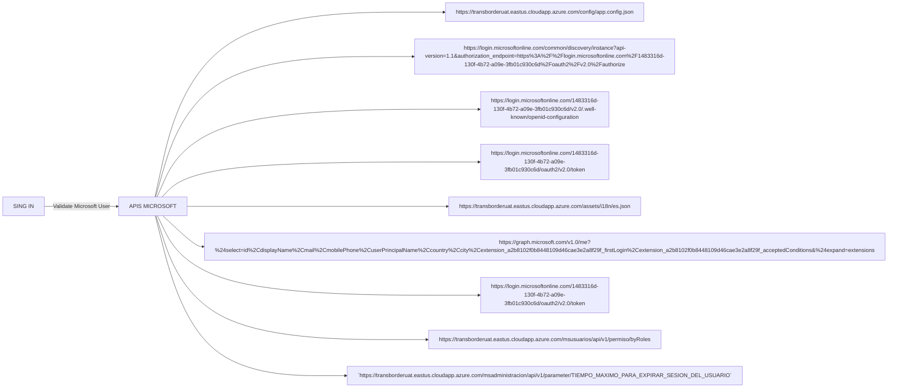

# Cotizador Docs

## Diagrama inicio de sesion:

---

### Sing In

-  `Carga el inicio de sesion para ingresar con el usuario registrado previamente` [Singin in with user Faber Grisales.](%3CmxGraphModel%3E%3Croot%3E%3CmxCell%20id%3D%220%22%2F%3E%3CmxCell%20id%3D%221%22%20parent%3D%220%22%2F%3E%3CmxCell%20id%3D%222%22%20value%3D%22https%3A%2F%2Flogin.microsoftonline.com%2F1483316d-130f-4b72-a09e-3fb01c930c6d%2Foauth2%2Fv2.0%2Fauthorize%3Fclient_id%3Da2b8102f-0b84-4810-9d46-cae3e2a8f29f%26amp%3Bamp%3Bscope%3Duser.read%2520openid%2520profile%2520offline_access%26amp%3Bamp%3Bredirect_uri%3Dhttps%253A%252F%252Ftransborderuat.eastus.cloudapp.azure.com%252F%26amp%3Bamp%3Bclient-request-id%3D6c3ab0a8-24a7-4c91-9758-b5db21e81212%26amp%3Bamp%3Bresponse_mode%3Dfragment%26amp%3Bamp%3Bresponse_type%3Dcode%26amp%3Bamp%3Bx-client-SKU%3Dmsal.js.browser%26amp%3Bamp%3Bx-client-VER%3D2.38.3%26amp%3Bamp%3Bclient_info%3D1%26amp%3Bamp%3Bcode_challenge%3Dq37GBTsvBNMzWMIBvBncEL-XoElDGj2910adtUSk1kk%26amp%3Bamp%3Bcode_challenge_method%3DS256%26amp%3Bamp%3Bnonce%3D575cd5c1-ea93-4cd0-b297-280ad4fd0ee0%26amp%3Bamp%3Bstate%3DeyJpZCI6ImFhMDYyN2VkLWRhOTAtNGQxZS1hMDVmLWJhZDRlYTFkZTNlYyIsIm1ldGEiOnsiaW50ZXJhY3Rpb25UeXBlIjoicmVkaXJlY3QifX0%253D%22%20style%3D%22text%3Bhtml%3D1%3BstrokeColor%3Dnone%3BfillColor%3Dnone%3Balign%3Dcenter%3BverticalAlign%3Dmiddle%3BwhiteSpace%3Dwrap%3Brounded%3D0%3B%22%20vertex%3D%221%22%20parent%3D%221%22%3E%3CmxGeometry%20x%3D%22440%22%20y%3D%22210%22%20width%3D%22160%22%20height%3D%2260%22%20as%3D%22geometry%22%2F%3E%3C%2FmxCell%3E%3C%2Froot%3E%3C%2FmxGraphModel%3E)
-  `API GET CREDENTIAL` [API](https://login.microsoftonline.com/common/GetCredentialType?mkt=es-ES)
-  
Solicitud post que envia la siguiente data:

~~~
{
    "checkPhones": false,
    "country": "CO",
    "federationFlags": 0,
    "flowToken": "AQABAAEAAAAmoFfGtYxvRrNriQdPKIZ-ehyWAZgh8VgEnaNCxIr35dj-PUvw_6beF8e8hIuZmPpOFmdlYAxos4Dmgxwn6WAt6qfYb3DQ9872KcsT3HBIDan0tDaSEXP8ryDT9Fk8srxhgEidA10Gr_HD4I8-3dHauUqMaKGhqRxM5O5Q3sIQOTBMX-WeRZD07jdlTlrylCIpyVz3GOK3h4djXvvRE19YxP63WSLp2wYmq5p9mV-Sv5o5c1LlpAWeU_Zg51LRj0_ANbgxMAyvHn2PTXED5Q613GzzSf3odV9lp9CFaXJ-wI26J2aas55yKYSZmtRCOseoSl3aDsUR4I1WbW13ef14it8LTvajzoZUN9KOvKGcCv6civGTcyRQ0ydB3BORjvYmEuedkRbupIwbheAb4ntCP26IGsx_Vv7xURlBDQ-XJ5mK10MjlRfA5U7MrNoJPVBnIUGEOd6Lh0NgYW8rvEjU7QssBfK_bTl0UqiPOzKSujrXgnKv6HqMWx_1Lcd-2EFeEZfu7RzGNNoJs_jFA4RayjZ28vYbxSKPDgb97Cn2zyYzzeEGDzr-0DUNpw2DnbGEaLpLCtK2OTB_KmvRY9AXN6YDE9iJzf3Lgr6w-2i6qFRURXno9adDdxoUCeqmq3XJWm0T0VYjA7QZhGK4KzHhIAA",
    "forceotclogin": false,
    "isAccessPassSupported": true,
    "isCookieBannerShown": false,
    "isExternalFederationDisallowed": false,
    "isFidoSupported": true,
    "isOtherIdpSupported": false,
    "isRemoteConnectSupported": false,
    "isRemoteNGCSupported": true,
    "isSignup": false,
    "originalRequest": "rQQIARAAlZHPa9NgHMabZqu1oCsKsmMPZYozaX43KezQrWtNt7VzXdc0F3nz5k2bLGmyJF233vS0g4eJF5F58aJUkKEg04N4EISedpSBNwUdCOJp4MWOsT_A5_DhOX2_D8-TiDEkK5LsTZwhqVwaMJpIU4xBUJrIEdzIE5LOCQQEiEUMEA1GMvwrieTe2r2fB6928k9TsPD53XB6gNHtMPSCXCYT-qATaK6vI78LQhKBIOwGJLTdrg48jwT9ro9I6DqZAww7xLAfGDaIpoEoUEDSRYIzeEBwDC0RAEJ99FfMijQvZXVBOIpOVPPdsM2cwvXNPvoTjRs-aDmoEz7BPbRd9tQ5WZCtFq9akGs2yubiqtqurNbDSmF9q1mj-EpD5hcba-2mU7QqTJ1WC7BfmZMD2aFtvTRvVjuBCRo8pSrldpNd8TSGryNl1pYt14TO2jpQynaTvWMaCjUzwNPUmVjilGeA5-5cr_E0zYksSws6QbOUQXBaliEAJSGCNTSKhhJLQUEf4te7AfJJHwE95XqoY-opz3cN00Yp1zBss4PujipBQfAFxw7HsOOxa_FocmoST0VuTFF4Lh5PJCOTkVTkZAx7Nj6aCLfefKo_3Fu8_-ho99vz75HheMZQEbUEN2xLy2735J4FN1dqGUOQ4FKj1tKLxnqLLuvTmY2eWp-hc_RuDNuNXR3GJpwA2KQVkJrv9kYZf8ewnQuR9xf_f_LHCWyQmBb1hW2lu-oyG3qxulX3-z5nUYWGsgBrqhvMdrh5GSCmpJiBu5_APl6KnFx--fXthxcP_v66fTxxq03Jsy12U6Bl3qyzjr1cVQE3ulAyilkp31HyGixVheWe027N7Ccj_wA1",
    "username": "jgrisales@transborderaduat.onmicrosoft.com"
}
~~~

El response es el siguiente:

~~~
{
    "Username": "jgrisales@transborderaduat.onmicrosoft.com",
    "Display": "jgrisales@transborderaduat.onmicrosoft.com",
    "IfExistsResult": 0,
    "IsUnmanaged": false,
    "ThrottleStatus": 0,
    "Credentials": {
        "PrefCredential": 1,
        "HasPassword": true,
        "RemoteNgcParams": null,
        "FidoParams": null,
        "SasParams": null,
        "CertAuthParams": null,
        "GoogleParams": null,
        "FacebookParams": null,
        "OtcNotAutoSent": false
    },
    "EstsProperties": {
    "UserTenantBranding": [
            {
                "Locale": 0,
                "BannerLogo": "https://aadcdn.msftauthimages.net/dbd5a2dd-oibn8aahvqzuk9axjezt8gipakuxvaklx7dra8ibacg/logintenantbranding/0/bannerlogo?ts=638100893668399336",
                "Illustration": "https://aadcdn.msftauthimages.net/dbd5a2dd-oibn8aahvqzuk9axjezt8gipakuxvaklx7dra8ibacg/logintenantbranding/0/illustration?ts=637690390735308014",
                "BoilerPlateText": "
<strong>Transborder UAT</strong>
\n",
                "KeepMeSignedInDisabled": true,
                "UseTransparentLightBox": false
            }
        ],
        "DomainType": 3
    },
    "FlowToken": "AQABAAEAAAAmoFfGtYxvRrNriQdPKIZ-7T6GoCJAh6k1skiQv1N2DoiBL58USTKikGgjurJ-foQldh5Os6jGXlfSPjWCxNUrKHN6kmy83Cqd2enpi9FanuGLrvDgEmpEveYVe79i9hWiGRS9-j5_vECe66yQdpMVFZYXoKDlzW6gnQorhNnfLgZes25pZQd4YUR361h7TLmE8DCuwYwWiqcIR0oeO4l17wgSilsR01NNbiyJHEN2uEVSGtknHbxDM0QCkMssUU9n2memjF9aCEn4trBGBlVNrm61N_Asl9uzPrJtPXSssjoBOHhsWeS06B4yF7deKylXqaHguvJ9gXH9uFKw-zc3xKEh0UhKDsScN9_S_IXiVDdrum9bnP10CfOyP_CCe9ee-sCNmXjjLby4OiXn15KYYJ_fyrDUdBCjwAs1kbG18CMingp74kmzIaCzmauZvcY0D4FWl7w-0W1j77hiHXS6IknWpKzkA5eGjIgYy14SYl7oNo7uWIFNjb-y1EHu6s0g4F2y6RrhKBgjzqKc_ZgKw3ZpJitdX9flWjhMhlwq23elA1N3yLwBZ1E8LJGgzSmNu7PdBrnF6gjWjigBEGIcr5P93i4vB1NVgsMi7YaEdwNKAtSoVWaMcQURRw_4894K6slpOlGCTWbABeSqNuLgIAA",
    "IsSignupDisallowed": true,
    "apiCanary": "PAQABAAEAAAAmoFfGtYxvRrNriQdPKIZ-RoTp1507GE4VzOH0rQqDKreMB5hZFMLf15wlcW7twnO1rw_kvRgziVSTE6NdrdGVeyMWslJgFMbc_UohQY5zMBwtvY69CZVBXtl3PSEKV-JPp04YXDNbGgLWNsmOmyXAu_uN5QGBSBBIuu9A0R94ge4PqWMq8AIZtbth0EPw6DXelUr3cHPkwxNMIhBGB26Sa0GVkUKZVNnK7AH1aD5wZSAA"
}
~~~

- Despues de esto, al iniciar sesión e ingresar el usuario correctamente, se carga se llaman a los siguientes endpoints:

`https://transborderuat.eastus.cloudapp.azure.com/config/app.config.json (GET) `

***Response***:

~~~
{
    "production": false,
    "clientId": "a2b8102f-0b84-4810-9d46-cae3e2a8f29f",
    "authority": "https://login.microsoftonline.com/1483316d-130f-4b72-a09e-3fb01c930c6d/",
    "redirectUrl": "https://transborderuat.eastus.cloudapp.azure.com/",
    "APIEndpoint": "https://transborderuat.eastus.cloudapp.azure.com/",
    "protectedResourceMap": "https://transborderADUAT.onmicrosoft.com/c436622e-2e79-4eb8-ace8-e953ebf50989/apiscope",
    "APIAdministracionMSEndpoint": "https://transborderuat.eastus.cloudapp.azure.com/msadministracion/api/v1/",
    "APIClientesMSEndpoint": "https://transborderuat.eastus.cloudapp.azure.com/msclientes/api/v1/",
    "APICotizacionesMSEndpoint": "https://transborderuat.eastus.cloudapp.azure.com/mscotizaciones/api/v1/",
    "APICotizacionesCPEndpoint": "https://transborderuat.eastus.cloudapp.azure.com/cpcotizaciones/api/v1/",
    "APITarifasMSEndpoint": "https://transborderuat.eastus.cloudapp.azure.com/mstarifas/api/v1/",
    "APITarifasCPEndpoint": "https://transborderuat.eastus.cloudapp.azure.com/cptarifas/api/v1/",
    "APIUsuariosMSEndpoint": "https://transborderuat.eastus.cloudapp.azure.com/msusuarios/api/v1/",
    "APIUsuariosCPEndpoint": "https://transborderuat.eastus.cloudapp.azure.com/cpusuarios/api/v1/",
    "APIArchivosMSEndpoint": "https://transborderuat.eastus.cloudapp.azure.com/msarchivos/api/v1/",
    "APIGraph": "https://graph.microsoft.com/v1.0/me",
    "firstLogin": "extension_a2b8102f0b8448109d46cae3e2a8f29f_firstLogin",
    "acceptedConditions": "extension_a2b8102f0b8448109d46cae3e2a8f29f_acceptedConditions"
}
~~~

`https://login.microsoftonline.com/common/discovery/instance?api-version=1.1&authorization_endpoint=https%3A%2F%2Flogin.microsoftonline.com%2F1483316d-130f-4b72-a09e-3fb01c930c6d%2Foauth2%2Fv2.0%2Fauthorize (GET)`

***Response***:

~~~
{
    "tenant_discovery_endpoint": "https://login.microsoftonline.com/1483316d-130f-4b72-a09e-3fb01c930c6d/v2.0/.well-known/openid-configuration",
    "api-version": "1.1",
    "metadata": [
        {
            "preferred_network": "login.microsoftonline.com",
            "preferred_cache": "login.windows.net",
            "aliases": [
                "login.microsoftonline.com",
                "login.windows.net",
                "login.microsoft.com",
                "sts.windows.net"
            ]
        },
        {
            "preferred_network": "login.partner.microsoftonline.cn",
            "preferred_cache": "login.partner.microsoftonline.cn",
            "aliases": [
                "login.partner.microsoftonline.cn",
                "login.chinacloudapi.cn"
            ]
        },
        {
            "preferred_network": "login.microsoftonline.de",
            "preferred_cache": "login.microsoftonline.de",
            "aliases": [
                "login.microsoftonline.de"
            ]
        },
        {
            "preferred_network": "login.microsoftonline.us",
            "preferred_cache": "login.microsoftonline.us",
            "aliases": [
                "login.microsoftonline.us",
                "login.usgovcloudapi.net"
            ]
        },
        {
            "preferred_network": "login-us.microsoftonline.com",
            "preferred_cache": "login-us.microsoftonline.com",
            "aliases": [
                "login-us.microsoftonline.com"
            ]
        }
    ]
}
~~~

`https://login.microsoftonline.com/1483316d-130f-4b72-a09e-3fb01c930c6d/v2.0/.well-known/openid-configuration (GET) `

***Response***:

~~~
{

    "token_endpoint": "https://login.microsoftonline.com/1483316d-130f-4b72-a09e-3fb01c930c6d/oauth2/v2.0/token",
    "token_endpoint_auth_methods_supported": [
        "client_secret_post",
        "private_key_jwt",
        "client_secret_basic"
    ],
    "jwks_uri": "https://login.microsoftonline.com/1483316d-130f-4b72-a09e-3fb01c930c6d/discovery/v2.0/keys",
    "response_modes_supported": [
        "query",
        "fragment",
        "form_post"
    ],
    "subject_types_supported": [
        "pairwise"
    ],
    "id_token_signing_alg_values_supported": [
        "RS256"
    ],
    "response_types_supported": [
        "code",
        "id_token",
        "code id_token",
        "id_token token"
    ],
    "scopes_supported": [
        "openid",
        "profile",
        "email",
        "offline_access"
    ],
    "issuer": "https://login.microsoftonline.com/1483316d-130f-4b72-a09e-3fb01c930c6d/v2.0",
    "request_uri_parameter_supported": false,
    "userinfo_endpoint": "https://graph.microsoft.com/oidc/userinfo",
    "authorization_endpoint": "https://login.microsoftonline.com/1483316d-130f-4b72-a09e-3fb01c930c6d/oauth2/v2.0/authorize",
    "device_authorization_endpoint": "https://login.microsoftonline.com/1483316d-130f-4b72-a09e-3fb01c930c6d/oauth2/v2.0/devicecode",
    "http_logout_supported": true,
    "frontchannel_logout_supported": true,
    "end_session_endpoint": "https://login.microsoftonline.com/1483316d-130f-4b72-a09e-3fb01c930c6d/oauth2/v2.0/logout",
    "claims_supported": [
        "sub",
        "iss",
        "cloud_instance_name",
        "cloud_instance_host_name",
        "cloud_graph_host_name",
        "msgraph_host",
        "aud",
        "exp",
        "iat",
        "auth_time",
        "acr",
        "nonce",
        "preferred_username",
        "name",
        "tid",
        "ver",
        "at_hash",
        "c_hash",
        "email"
    ],
    "kerberos_endpoint": "https://login.microsoftonline.com/1483316d-130f-4b72-a09e-3fb01c930c6d/kerberos",
    "tenant_region_scope": "NA",
    "cloud_instance_name": "microsoftonline.com",
    "cloud_graph_host_name": "graph.windows.net",
    "msgraph_host": "graph.microsoft.com",
    "rbac_url": "https://pas.windows.net"
}
~~~

`https://login.microsoftonline.com/1483316d-130f-4b72-a09e-3fb01c930c6d/oauth2/v2.0/token (POST)`

***Request***:

~~~
{
    "client_id": "a2b8102f-0b84-4810-9d46-cae3e2a8f29f",
    "redirect_uri": "https://transborderuat.eastus.cloudapp.azure.com/",
    "scope": "user.read openid profile offline_access",
    "code": "0.ARUAbTGDFA8Tckugnj-wHJMMbS8QuKKECxBInUbK4-Ko8p8VAFI.AgABAAIAAAAmoFfGtYxvRrNriQdPKIZ-AgDs_wUA9P_3BKvMU5Uct8twZCw0YTWmpiLbOu3ylA5gBeyjU61ZzPabOOjZ-xHBWsUGua6tzFQSNe7bdMaXQPWUsOtz57sSX0WtwNryE298mjnvgJgernp3tY-R7pOE3hIIGzxJq8dJm8sze8U_B5Olsp-nvNCinvzlLBDsVEdyySvq2a4_1YywZVVgpzIpB7B9kYmCAe4RaLYTwBM20FLZldr0h6-z6FxI5PxnZAqyYfNKY4YJdoRmNGmt3ozMkuUo71WvmOl2q9fTDon_m5KgU5R-6xA4GJ53oqYCRWE9y9-D9Md5-Z_mcFRon30wUixmh_gGVzOkOMmCzhwLxIQYhBu4t2ZChIlR8bMM4M_-SQp588i1ksfVwv7GWtnlPAwPPjcwMghKs0fSPIUWb5zJebl4HlO5s0jlYieCv_26pUg2rQ_DMsA9RmN0L36EVSaoJVjlSmWFwwJiUf-IBIy09yo6rxgl2RvVdFzDY7D-wiJvmzDxVX5ah4jC39hOS6PUniILM6tDuWZkFjw6bY60ockqGXZVAtOx4s-fnmOdTw-yOGBNe4vjsArqvOhHY94kMK3Sd4Qir8-7kn31gBVxDiq5talWd_irbHWETHOL6CTmf6al1IXadHP0qtBcrX89gFx4eWp1whiMNsqtH3X-8vOVc_Kqt9bVIgRpWx0ceWo9delU1xace_DWKH-iPG1HtXLpzTxVd96w-pPw7WAPF6owlmICKwZBk1M-KOGWYPpf2VPk8LdkTlhCJ7cda-IB5aworf8zmjDyCtifJpuCBRB0W7axa1IV0uGBplOBAmcw4IErENcaN6tx_aI3fH9fs4Ri5oZivNsvOEO3I-35kikkiGM",
    "x-client-SKU": "msal.js.browser",
    "x-client-VER": "2.38.3",
    "x-ms-lib-capability": "retry-after, h429",
    "x-client-current-telemetry": "5|865,0,,,|@azure/msal-angular,2.5.12",
    "x-client-last-telemetry": "5|0|||0,0",
    "code_verifier": "w6At9wCeqtUbWJuGOD6yX3JJi_b5NZaOEvU0Hby9e0U",
    "grant_type": "authorization_code",
    "client_info": "1",
    "client-request-id": "e981569c-aeb8-4188-9d20-6344c7b9ca2b",
    "X-AnchorMailbox": "Oid:ec6b2164-1850-4d0a-929a-322fc06e5b3c@1483316d-130f-4b72-a09e-3fb01c930c6d"
}
~~~

***Response***:

~~~
{
    "token_type": "Bearer",
    "scope": "Directory.AccessAsUser.All openid profile User.Read email",
    "expires_in": 5058,
    "ext_expires_in": 5058,
    "access_token":"eyJ0eXAiOiJKV1QiLCJub25jZSI6IjdzX0hoYk45d1V2NFZQeHFkTkczNU0zZGpBZ0daSUZsOHZ0NEh6V2ZOVm8iLCJhbGciOiJSUzI1NiIsIng1dCI6IlQxU3QtZExUdnlXUmd4Ql82NzZ1OGtyWFMtSSIsImtpZCI6IlQxU3QtZExUdnlXUmd4Ql82NzZ1OGtyWFMtSSJ9.eyJhdWQiOiIwMDAwMDAwMy0wMDAwLTAwMDAtYzAwMC0wMDAwMDAwMDAwMDAiLCJpc3MiOiJodHRwczovL3N0cy53aW5kb3dzLm5ldC8xNDgzMzE2ZC0xMzBmLTRiNzItYTA5ZS0zZmIwMWM5MzBjNmQvIiwiaWF0IjoxNzAwNzcxMzY1LCJuYmYiOjE3MDA3NzEzNjUsImV4cCI6MTcwMDc3NjcyNCwiYWNjdCI6MCwiYWNyIjoiMSIsImFpbyI6IkFUUUF5LzhWQUFBQTRZVDk3WVVhUmQzMmJyUnhlbXFmWnQzYmNCYmY0T3F0eHBHS0lhSG5UNVVRRWkwNi95dmhLSG9QMDE1MTZEWjEiLCJhbXIiOlsicHdkIl0sImFwcF9kaXNwbGF5bmFtZSI6ImNvdGl6YWRvci11YXQiLCJhcHBpZCI6ImEyYjgxMDJmLTBiODQtNDgxMC05ZDQ2LWNhZTNlMmE4ZjI5ZiIsImFwcGlkYWNyIjoiMCIsImZhbWlseV9uYW1lIjoiR3Jpc2FsZXMiLCJnaXZlbl9uYW1lIjoiRmFiZXIiLCJpZHR5cCI6InVzZXIiLCJpcGFkZHIiOiIyMDAuMTQuMjM0LjkwIiwibmFtZSI6IkZhYmVyIEdyaXNhbGVzIiwib2lkIjoiZWM2YjIxNjQtMTg1MC00ZDBhLTkyOWEtMzIyZmMwNmU1YjNjIiwicGxhdGYiOiIzIiwicHVpZCI6IjEwMDMyMDAzMTVEMzc5NDEiLCJyaCI6IjAuQVJVQWJUR0RGQThUY2t1Z25qLXdISk1NYlFNQUFBQUFBQUFBd0FBQUFBQUFBQUFWQUZJLiIsInNjcCI6IkRpcmVjdG9yeS5BY2Nlc3NBc1VzZXIuQWxsIG9wZW5pZCBwcm9maWxlIFVzZXIuUmVhZCBlbWFpbCIsInN1YiI6IjlNV2Rmakh3NndhcjZQUTZSXzBDNmFreWRzQkVWSnhvSGF3YVpDTWRzRWciLCJ0ZW5hbnRfcmVnaW9uX3Njb3BlIjoiTkEiLCJ0aWQiOiIxNDgzMzE2ZC0xMzBmLTRiNzItYTA5ZS0zZmIwMWM5MzBjNmQiLCJ1bmlxdWVfbmFtZSI6ImpncmlzYWxlc0B0cmFuc2JvcmRlcmFkdWF0Lm9ubWljcm9zb2Z0LmNvbSIsInVwbiI6ImpncmlzYWxlc0B0cmFuc2JvcmRlcmFkdWF0Lm9ubWljcm9zb2Z0LmNvbSIsInV0aSI6Ik42NE1QWkxJQmt5RnR6OFY5Tk1QQVEiLCJ2ZXIiOiIxLjAiLCJ3aWRzIjpbImI3OWZiZjRkLTNlZjktNDY4OS04MTQzLTc2YjE5NGU4NTUwOSJdLCJ4bXNfc3QiOnsic3ViIjoiT0l4aGZrTTh3dnNGZmRNZElMZkJNanNndnFiVTZMWElRLVNmQk1GREphWSJ9LCJ4bXNfdGNkdCI6MTYzMDY3NTA5OH0.Q7kOo5tWMdRrNRd0FMzUO0AaXPFcsm9OermzjGu75ZFOh3iKxYKQHCQydqgUD4dvK0crAwiRmRnLAjjIAw1rwCM05XUml_hjQ86RW3vcX44K-tcYf1P_h2FztlGOdUj3XlkhoFpST2j8Olfo2OGBh0HsCa9hd1zpaCq22fX4IBm7YHVvvo911Z3Od8x4tiiuThy2wUL9KeC_FN1yEbC0IwZxg4GOVAZJWzf04t60IAnCGvxqJi7x1s5xew2E480Ixby5HvXCnvmKZFJHFcWKNshATIpU9aQxtIIyzXrUCj2u96aXNNrQFnyEpL0_1UAcZAJ80-LoD2ftcTkGbEEl5w",
    "refresh_token": "0.ARUAbTGDFA8Tckugnj-wHJMMbS8QuKKECxBInUbK4-Ko8p8VAFI.AgABAAEAAAAmoFfGtYxvRrNriQdPKIZ-AgDs_wUA9P_l-VQckRRmn2W5jLFsyTqmaxw7m64TSfBJEsXYIozzx5jpFWNU3pGwOoJRu-fmkIP4Fqe96dGLh6drin9RlLFP5HqN2LJ7mXTpLH8-7b2vPFpFQFpvCA4tb6KZ9yMGT6lV4Bz3Lo-Ex1kPlNiVkgdiNYZnBXtSMR5v_u6-IVkUwO-QWje7hOVrULWAOFS2b4Bskxt8JI_puESDbngoud2oTMPS3dFBiylvvfwnjls8ILYPkeZyxW3edCcfMw-y69Y8XXhMPiyVDEq65LwkREWJG25ayPT2yIOBq9KqFovEQbjpyNwwAAIzb__Ep7OfpTirDkjHwYQ6rb8LAeavL8vuezYMQsF6Iq21bt6zisiGqw_fNoCCnEl7w_hj08U2_ZR8LGJfAT3WkdeMKCRUB3xv1cAjP-NATv1xGFFXkljMRZL3pmjCmvpgotm1EqX3M1K-h3Krz1CxDwN-UQtN7u-58v273kLDKS9xg16Tqq9h8N9746tNcj1QGQYYVSTomAlm4VM7uTdWZI4baBuH9zeqStGH1182DXwN0_daW-GPbjNBYkyu9ShNCqovE7KPQFWA_uXUyf53O1oGMSkkMzTIkwf0kOwLQr-AENATax42p13qVG6AoHn6qJt6QZABVUuNTAlHjEGQtbyNvk4xUufxIGW3kpWKAFl2QpDALlzSG_53kAQNSVB6kzynDvVvhcGdH2sFPrSMGCDAM4Bbzh62RJgWey-INE2wE7Fdp3K5pV7bZKadeZdUzjrqDoMI2nq-Tz-GkmK2CBwNJwq_izcVx8Du6Ym_8WDfXp0tKrIkEL1RTeuX",
    "id_token": "eyJ0eXAiOiJKV1QiLCJhbGciOiJSUzI1NiIsImtpZCI6IlQxU3QtZExUdnlXUmd4Ql82NzZ1OGtyWFMtSSJ9.eyJhdWQiOiJhMmI4MTAyZi0wYjg0LTQ4MTAtOWQ0Ni1jYWUzZTJhOGYyOWYiLCJpc3MiOiJodHRwczovL2xvZ2luLm1pY3Jvc29mdG9ubGluZS5jb20vMTQ4MzMxNmQtMTMwZi00YjcyLWEwOWUtM2ZiMDFjOTMwYzZkL3YyLjAiLCJpYXQiOjE3MDA3NzEzNjUsIm5iZiI6MTcwMDc3MTM2NSwiZXhwIjoxNzAwNzc1MjY1LCJsb2dpbl9oaW50IjoiTy5DaVJsWXpaaU1qRTJOQzB4T0RVd0xUUmtNR0V0T1RJNVlTMHpNakptWXpBMlpUVmlNMk1TSkRFME9ETXpNVFprTFRFek1HWXROR0kzTWkxaE1EbGxMVE5tWWpBeFl6a3pNR00yWkJvcWFtZHlhWE5oYkdWelFIUnlZVzV6WW05eVpHVnlZV1IxWVhRdWIyNXRhV055YjNOdlpuUXVZMjl0SUlBQiIsIm5hbWUiOiJGYWJlciBHcmlzYWxlcyIsIm5vbmNlIjoiYTg2MGE5ZDgtNGY1YS00MjE5LWFjY2QtY2E4NzgxNTk3ZDY2Iiwib2lkIjoiZWM2YjIxNjQtMTg1MC00ZDBhLTkyOWEtMzIyZmMwNmU1YjNjIiwicHJlZmVycmVkX3VzZXJuYW1lIjoiamdyaXNhbGVzQHRyYW5zYm9yZGVyYWR1YXQub25taWNyb3NvZnQuY29tIiwicmgiOiIwLkFSVUFiVEdERkE4VGNrdWduai13SEpNTWJTOFF1S0tFQ3hCSW5VYks0LUtvOHA4VkFGSS4iLCJzdWIiOiJPSXhoZmtNOHd2c0ZmZE1kSUxmQk1qc2d2cWJVNkxYSVEtU2ZCTUZESmFZIiwidGlkIjoiMTQ4MzMxNmQtMTMwZi00YjcyLWEwOWUtM2ZiMDFjOTMwYzZkIiwidXRpIjoiTjY0TVBaTElCa3lGdHo4VjlOTVBBUSIsInZlciI6IjIuMCJ9.lXSZAcdM9Rc8juQtGvfodsQKmvXFBRY1jFsOHBGgdpQ3muwo_TfpSDojS8gcHTahzdwFbURhT2dtRPzGX3tuAjVBzyzFhvG1yQTCveL2FlthhECLZzCeOq19HHbUvRKHiA8Cm36K2ZLQU6TAYXvrBVykhvWHDOiANmbsvhpNPcvR8WWky1X2UVGJRpbsjHB8xD7odHUO26ltgv07os3gbyOdoLX044T7vBYCbVc_964lHYiSwMaqVOFPuea0-aZ7dNrxiS92W93gWsZtFa7SbIaIlZ-zOV845Ukc5Y_aFDmeltTBx9wUEJyDTWpcMssjExTX_iXF7vMZzqBWyuqFNA",
    "client_info": "eyJ1aWQiOiJlYzZiMjE2NC0xODUwLTRkMGEtOTI5YS0zMjJmYzA2ZTViM2MiLCJ1dGlkIjoiMTQ4MzMxNmQtMTMwZi00YjcyLWEwOWUtM2ZiMDFjOTMwYzZkIn0"
}
~~~

`https://transborderuat.eastus.cloudapp.azure.com/assets/i18n/es.json (GET)` Obtiene el idioma el cual se usara en el sistema.

`https://graph.microsoft.com/v1.0/me?%24select=id%2CdisplayName%2Cmail%2CmobilePhone%2CuserPrincipalName%2Ccountry%2Ccity%2Cextension_a2b8102f0b8448109d46cae3e2a8f29f_firstLogin%2Cextension_a2b8102f0b8448109d46cae3e2a8f29f_acceptedConditions&%24expand=extensions (GET) `

***Response***:

~~~
{

    "@odata.context": "https://graph.microsoft.com/v1.0/$metadata#users(id,displayName,mail,mobilePhone,userPrincipalName,country,city,extension_a2b8102f0b8448109d46cae3e2a8f29f_firstLogin,extension_a2b8102f0b8448109d46cae3e2a8f29f_acceptedConditions,extensions())/$entity",
    "id": "ec6b2164-1850-4d0a-929a-322fc06e5b3c",
    "displayName": "Faber Grisales",
    "mail": "jgrisales@transborder.com.co",
    "mobilePhone": "3111111111",
    "userPrincipalName": "jgrisales@transborderaduat.onmicrosoft.com",
    "country": "COLOMBIA",
    "city": "BOGOTÁ",
    "extension_a2b8102f0b8448109d46cae3e2a8f29f_acceptedConditions": true,
    "extension_a2b8102f0b8448109d46cae3e2a8f29f_firstLogin": false,
    "extensions@odata.context": "https://graph.microsoft.com/v1.0/$metadata#users('ec6b2164-1850-4d0a-929a-322fc06e5b3c')/extensions",
    "extensions": [
        {
            "@odata.type": "#microsoft.graph.openTypeExtension",
            "extensionName": "co.com.transborder.roamingSettings",
            "rolesCotizador": [
                "Administrador del sistema",
                "Comercial",
                "Gestor de Mercadeo",
                "Parametrizador",
                "Gestor de Producto",
                "Gerente de Ventas - Pricing",
                "tester"
            ],
            "id": "co.com.transborder.roamingSettings"
        }
    ]
}
~~~

`https://login.microsoftonline.com/1483316d-130f-4b72-a09e-3fb01c930c6d/oauth2/v2.0/token (POST)`

***Request***:

~~~
{
	"client_id": "a2b8102f-0b84-4810-9d46-cae3e2a8f29f",
	"scope": "https://transborderADUAT.onmicrosoft.com/c436622e-2e79-4eb8-ace8-e953ebf50989/apiscope openid profile offline_access",
	"grant_type": "refresh_token",
	"client_info": "1",
	"x-client-SKU": "msal.js.browser",
	"x-client-VER": "2.38.3",
	"x-ms-lib-capability": "retry-after, h429",
	"x-client-current-telemetry": "5|61,0,,,|@azure/msal-angular,2.5.12",
	"x-client-last-telemetry": "5|1|||0,0",
	"client-request-id": "fb5605e0-c70a-4b6c-ae9b-8c2cc20ce674",
	"refresh_token": "0.ARUAbTGDFA8Tckugnj-wHJMMbS8QuKKECxBInUbK4-Ko8p8VAFI.AgABAAEAAAAmoFfGtYxvRrNriQdPKIZ-AgDs_wUA9P_l-VQckRRmn2W5jLFsyTqmaxw7m64TSfBJEsXYIozzx5jpFWNU3pGwOoJRu-fmkIP4Fqe96dGLh6drin9RlLFP5HqN2LJ7mXTpLH8-7b2vPFpFQFpvCA4tb6KZ9yMGT6lV4Bz3Lo-Ex1kPlNiVkgdiNYZnBXtSMR5v_u6-IVkUwO-QWje7hOVrULWAOFS2b4Bskxt8JI_puESDbngoud2oTMPS3dFBiylvvfwnjls8ILYPkeZyxW3edCcfMw-y69Y8XXhMPiyVDEq65LwkREWJG25ayPT2yIOBq9KqFovEQbjpyNwwAAIzb__Ep7OfpTirDkjHwYQ6rb8LAeavL8vuezYMQsF6Iq21bt6zisiGqw_fNoCCnEl7w_hj08U2_ZR8LGJfAT3WkdeMKCRUB3xv1cAjP-NATv1xGFFXkljMRZL3pmjCmvpgotm1EqX3M1K-h3Krz1CxDwN-UQtN7u-58v273kLDKS9xg16Tqq9h8N9746tNcj1QGQYYVSTomAlm4VM7uTdWZI4baBuH9zeqStGH1182DXwN0_daW-GPbjNBYkyu9ShNCqovE7KPQFWA_uXUyf53O1oGMSkkMzTIkwf0kOwLQr-AENATax42p13qVG6AoHn6qJt6QZABVUuNTAlHjEGQtbyNvk4xUufxIGW3kpWKAFl2QpDALlzSG_53kAQNSVB6kzynDvVvhcGdH2sFPrSMGCDAM4Bbzh62RJgWey-INE2wE7Fdp3K5pV7bZKadeZdUzjrqDoMI2nq-Tz-GkmK2CBwNJwq_izcVx8Du6Ym_8WDfXp0tKrIkEL1RTeuX",
	"X-AnchorMailbox": "Oid:ec6b2164-1850-4d0a-929a-322fc06e5b3c@1483316d-130f-4b72-a09e-3fb01c930c6d"
}
~~~

***Response***:

~~~
{
	"token_type": "Bearer",
	"scope": "https://transborderADUAT.onmicrosoft.com/c436622e-2e79-4eb8-ace8-e953ebf50989/apiscope",
	"expires_in": 3849,
	"ext_expires_in": 3849,
	"access_token": "eyJ0eXAiOiJKV1QiLCJhbGciOiJSUzI1NiIsIng1dCI6IlQxU3QtZExUdnlXUmd4Ql82NzZ1OGtyWFMtSSIsImtpZCI6IlQxU3QtZExUdnlXUmd4Ql82NzZ1OGtyWFMtSSJ9.eyJhdWQiOiJodHRwczovL3RyYW5zYm9yZGVyQURVQVQub25taWNyb3NvZnQuY29tL2M0MzY2MjJlLTJlNzktNGViOC1hY2U4LWU5NTNlYmY1MDk4OSIsImlzcyI6Imh0dHBzOi8vc3RzLndpbmRvd3MubmV0LzE0ODMzMTZkLTEzMGYtNGI3Mi1hMDllLTNmYjAxYzkzMGM2ZC8iLCJpYXQiOjE3MDA3NzEzNjYsIm5iZiI6MTcwMDc3MTM2NiwiZXhwIjoxNzAwNzc1NTE2LCJhY3IiOiIxIiwiYWlvIjoiQVRRQXkvOFZBQUFBZllES2ZpUDgrTTRJWUtYVmpheHVkYTUwRlY0NTJGWlFNWTRaNVBESjBRRDFEcXNYNjdLTmcvSERtQTl6OEtPZyIsImFtciI6WyJwd2QiXSwiYXBwaWQiOiJhMmI4MTAyZi0wYjg0LTQ4MTAtOWQ0Ni1jYWUzZTJhOGYyOWYiLCJhcHBpZGFjciI6IjAiLCJmYW1pbHlfbmFtZSI6IkdyaXNhbGVzIiwiZ2l2ZW5fbmFtZSI6IkZhYmVyIiwiaXBhZGRyIjoiMjAwLjE0LjIzNC45MCIsIm5hbWUiOiJGYWJlciBHcmlzYWxlcyIsIm9pZCI6ImVjNmIyMTY0LTE4NTAtNGQwYS05MjlhLTMyMmZjMDZlNWIzYyIsInJoIjoiMC5BUlVBYlRHREZBOFRja3Vnbmotd0hKTU1iUzVpTnNSNUxyaE9yT2pwVS12MUNZa1ZBRkkuIiwic2NwIjoiYXBpc2NvcGUiLCJzdWIiOiJGbHlQTk5rM3NEY3A4SndpbXZ0THA0UDhWdXFFbDh5LTRBYWJnTWtZVmhRIiwidGlkIjoiMTQ4MzMxNmQtMTMwZi00YjcyLWEwOWUtM2ZiMDFjOTMwYzZkIiwidW5pcXVlX25hbWUiOiJqZ3Jpc2FsZXNAdHJhbnNib3JkZXJhZHVhdC5vbm1pY3Jvc29mdC5jb20iLCJ1cG4iOiJqZ3Jpc2FsZXNAdHJhbnNib3JkZXJhZHVhdC5vbm1pY3Jvc29mdC5jb20iLCJ1dGkiOiJJV0wxZ0hmdUVVaWxpYXcxTTZfckFBIiwidmVyIjoiMS4wIn0.ILN5vKtPoFkO8LI05rgCjNnlDMDHY_lRbrA4-6rw9XWbmbs1MvKZUQcxPi4TwkP84M0DZSFj9CjJPcCnWrU8xNbij-DIhd2bviVuwouixU-X4mNWy_KTm-eQBZjsbe7B-i-b5OSM1sp_IlNkmU65jD-4W3fHTkQFn5U7w_XqsG9DKxCRDZje5mG8oBTaMorifWFQK_jtHkJ9b5lR8btXsfVzIlBrvCZKtz_S3d5xnIcaRnNKD7DROjxpuqw99fbfYWLj3iGUWHZbd2HZU1WTMEAEEGhTIJV_cj_IeBCyCoGZ4lgWjr_ks5JvV7hB6zjJyyp8uJe3XFw_SWmCwXLf1g",
	"refresh_token": "0.ARUAbTGDFA8Tckugnj-wHJMMbS8QuKKECxBInUbK4-Ko8p8VAFI.AgABAAEAAAAmoFfGtYxvRrNriQdPKIZ-AgDs_wUA9P9nYcs54F15QBCfHQPjzi82D94xRBLjy_fyR-y75430yzygqki9FSJI6cCaceR3HSsvMFbyjdjk7OOEZV3zgKzP8eucG9HIGoydxQ6DUD2Cah45Z5ut_D_jQMwJvPJ-MHjE4F7djvGWLqtunwhS63YOqSxDkaWCkL34npFbTctSPUJ136I99yO02MFubhyUoh2u-uydYbF4M66t1gQZmoih2ShvdzCItcGyQPruvx_BVPNqyyyKcWKGa-N078LpoPswtsCwcKNXNS79R52C4pZccn3I2l-1GrN7_Zri77PuLkaYJ9d10VBkID21-lXAiS02JRijUXhx_Na3p2hjWU2wIsQckF85uM6PQUEYqUX7F3oABX-d5Sjbb_7SRG1wZVTlARllZpCyxVwid4ag9hgtp8IQkeuZdqeGu27EGSqvT_UFtU6X3bv5vet_0OwbOwRxyeOqQyODYiKtdo8GVcGEp5h3rGp10xjLq5PJ0FgJJh-8Wm68ru548AGRNmxK-et8sVzOdlnS6qpFzPuhyQz1KBPUYbotgJyB_ZcHt8FRMOirl7Qdyd7yNYIDrqON1hvhH5ULDKm3vtf4-d6ZACSf4niSw12pjN8HDT4BOrLGPNsi61hB9Ke5YGJWhfbWcx4lnXDWMlKp8I9STFD-CVQKfwmR6A8o-c-Ukxy81Sn7uvJnX9Q99oPy0OuUa70WZ8fO1Q9m21sSUDhyNmxeKpXLTZ62l7yxB7NexC5HqHL819Stt60WpetqI6Vql6e9caW22oSFp_teM95mlIgMyL3gADSOkVy4IIWN1HFqE4es4Nv7YCybCqgVHiXugyrp5zYtGBEakMIK5x_dWjL6NWUtKnj2Wb1E_SIG82KDxdsN4vJG8IyUo51wWfjmmQ",
	"id_token": "eyJ0eXAiOiJKV1QiLCJhbGciOiJSUzI1NiIsImtpZCI6IlQxU3QtZExUdnlXUmd4Ql82NzZ1OGtyWFMtSSJ9.eyJhdWQiOiJhMmI4MTAyZi0wYjg0LTQ4MTAtOWQ0Ni1jYWUzZTJhOGYyOWYiLCJpc3MiOiJodHRwczovL2xvZ2luLm1pY3Jvc29mdG9ubGluZS5jb20vMTQ4MzMxNmQtMTMwZi00YjcyLWEwOWUtM2ZiMDFjOTMwYzZkL3YyLjAiLCJpYXQiOjE3MDA3NzEzNjYsIm5iZiI6MTcwMDc3MTM2NiwiZXhwIjoxNzAwNzc1MjY2LCJsb2dpbl9oaW50IjoiTy5DaVJsWXpaaU1qRTJOQzB4T0RVd0xUUmtNR0V0T1RJNVlTMHpNakptWXpBMlpUVmlNMk1TSkRFME9ETXpNVFprTFRFek1HWXROR0kzTWkxaE1EbGxMVE5tWWpBeFl6a3pNR00yWkJvcWFtZHlhWE5oYkdWelFIUnlZVzV6WW05eVpHVnlZV1IxWVhRdWIyNXRhV055YjNOdlpuUXVZMjl0SUlBQiIsIm5hbWUiOiJGYWJlciBHcmlzYWxlcyIsIm5vbmNlIjoiYTg2MGE5ZDgtNGY1YS00MjE5LWFjY2QtY2E4NzgxNTk3ZDY2Iiwib2lkIjoiZWM2YjIxNjQtMTg1MC00ZDBhLTkyOWEtMzIyZmMwNmU1YjNjIiwicHJlZmVycmVkX3VzZXJuYW1lIjoiamdyaXNhbGVzQHRyYW5zYm9yZGVyYWR1YXQub25taWNyb3NvZnQuY29tIiwicmgiOiIwLkFSVUFiVEdERkE4VGNrdWduai13SEpNTWJTOFF1S0tFQ3hCSW5VYks0LUtvOHA4VkFGSS4iLCJzdWIiOiJPSXhoZmtNOHd2c0ZmZE1kSUxmQk1qc2d2cWJVNkxYSVEtU2ZCTUZESmFZIiwidGlkIjoiMTQ4MzMxNmQtMTMwZi00YjcyLWEwOWUtM2ZiMDFjOTMwYzZkIiwidXRpIjoiSVdMMWdIZnVFVWlsaWF3MU02X3JBQSIsInZlciI6IjIuMCJ9.NKRZF3EwYgIcqRKBTKKUBpoGOoBt3XQsroV7Nqbp23a40z_f8Sw6njGD0AiBnEDSrpAe5qG7rijJbuG5lInBXzeFoJjlxiSNZPNlO3itwRIOy1BK2KULBw8rB-aQXMNrv8yD6KW6YREa8dktnG4fxrmi2hH0DLfgvKgTqCjN1Y_1cHhseKl1Mz4skhJmXQOHA8eSVdohmlAB4NmdCX3Uz1BAhO50XX4GX8WBSyKwuIrUukngfSn2nYycXOpLe1lDrFm1J2KkWZKh18pYY9VQZsxDgCPBcdweDCvzMlYHheTRRFN3JNUHelk2KpwLvPNkEhSuZzOs8s-FOM-BohW4tw",
	"client_info": "eyJ1aWQiOiJlYzZiMjE2NC0xODUwLTRkMGEtOTI5YS0zMjJmYzA2ZTViM2MiLCJ1dGlkIjoiMTQ4MzMxNmQtMTMwZi00YjcyLWEwOWUtM2ZiMDFjOTMwYzZkIn0"
}
~~~

`https://transborderuat.eastus.cloudapp.azure.com/msusuarios/api/v1/permiso/byRoles (POST)`

***Request***:

~~~
[
	"Administrador del sistema",
	"Comercial",
	"Gestor de Mercadeo",
	"Parametrizador",
	"Gestor de Producto",
	"Gerente de Ventas - Pricing",
	"tester"
]
~~~

***Response***:

~~~
[
	"Aceptar cotización",
	"Administrar sistema",
	"Cargar tarifarios",
	"Clonar cotización",
	"Clonar instrucción de embarque",
	"Consultar cotizaciones",
	"Consultar intervenciones pricing",
	"Consultar roles",
	"Consultar tarifarios",
	"Consultar usuarios",
	"Crear cotización",
	"Crear y Editar rol",
	"Crear y Editar usuario",
	"Generar reporte SPOT",
	"Intervenir tarifas por Pricing",
	"Intervenir tarifas por Tier",
	"Modificar instrucción de embarque",
	"Parametrizar etapas logísticas por incoterm",
	"Parametrizar otros conceptos país",
	"Parametrizar tarifas específicas",
	"Preparar instrucción de embarque",
	"Registrar tarifas seguro",
	"Versionar cotización"
]
~~~

`https://transborderuat.eastus.cloudapp.azure.com/msadministracion/api/v1/parameter/TIEMPO_MAXIMO_PARA_EXPIRAR_SESION_DEL_USUARIO (GET)`

***Response***:

~~~
{
	"id": 49,
	"name": "TIEMPO_MAXIMO_PARA_EXPIRAR_SESION_DEL_USUARIO",
	"value": "20",
	"dataType": "INTEGER",
	"category": "US_USUARIO",
	"usuarioModificacion": "srestrepo@transborderaduat.onmicrosoft.com",
	"fechaModificacion": "2023-09-27T20:19:22.833+00:00"
}
~~~

