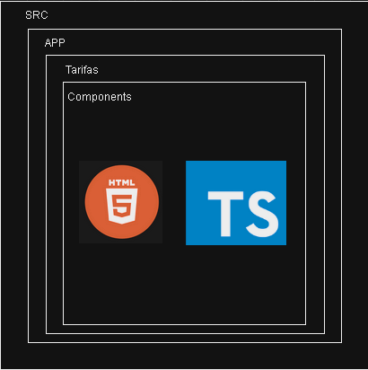

# Cotizador Docs

## Tarifas

### Ubicación Componentes Tarifas

Gestionar Tarifas

 

<h2>Cargar Tarifas</h2>

 

### Metodo POST

- `https://transborderuat.eastus.cloudapp.azure.com/cptarifas/api/v1/tarifasCP/createTarifaSeguro`

**Request**:
~~~
{
	"id": 0,
	"minimaNeta": 99999999,
	"minimaVenta": 99999999,
	"tasaNeta": 99.9,
	"tasaVenta": 99.9,
	"usuarioCreacion": "Faber Grisales",
	"vigenciaDesde": "2023-11-28T05:00:00.000Z",
	"vigenciaHasta": "2023-11-29T05:00:00.000Z"
}
~~~
**Response**:
~~~
{
	"id": 7,
	"tasaNeta": 99.9,
	"tasaVenta": 99.9,
	"minimaNeta": 99999999,
	"minimaVenta": 99999999,
	"vigenciaDesde": "2023-11-28T05:00:00.000+00:00",
	"vigenciaHasta": "2023-11-29T05:00:00.000+00:00",
	"fechaCreacion": "2023-11-27T17:19:03.407+00:00",
	"usuarioCreacion": "jgrisales@transborderaduat.onmicrosoft.com"
}
~~~

---

<h2>Rechazo de carga perecedera</h2>

 

### Metodo POST

- `https://transborderuat.eastus.cloudapp.azure.com/cpcotizaciones/api/v1/cotizacionCP/rechazarRequerimientoSpotCargaPerecedera`

**Request**:

~~~
{
	"causalRechazo": "Teniendo en cuenta las condiciones particulares de la solicitud, no es posible cotizar el servicio",
	"numeroCotizacion": "1-271123-000368"
}
~~~

**Response**:

~~~
"OK"
~~~

---

<h2>Consultar Tarifarios</h2>

 

### Metodo POST

- `https://transborderuat.eastus.cloudapp.azure.com/mstarifas/api/v1/tarifa/consultarTarifariosPorProducto`

**Request**:

~~~
{
	"fechaFin": "2023-11-27T05:00:00.000Z",
	"fechaInicio": "2020-11-27T05:00:00.000Z",
	"tipoTarifario": "FLETES_INTERNACIONALES_FCL",
	"usuarioResponsable": "Prueba producto 11 pruebas integrales"
}
~~~

**Response**:

~~~
[
	{
		"id": 325,
		"tipoTarifario": "4. Fletes Internacionales FCL",
		"usuarioResponsable": "Prueba producto 11 pruebas integrales",
		"fechaInicio": null,
		"fechaFin": null,
		"fechaCargue": "2023-05-16T22:08:10.070+00:00",
		"nombreArchivo": "Fletes Internacionales FCL_16052023_1707.xlsx"
	},
	{
		"id": 323,
		"tipoTarifario": "4. Fletes Internacionales FCL",
		"usuarioResponsable": "Prueba producto 11 pruebas integrales",
		"fechaInicio": null,
		"fechaFin": null,
		"fechaCargue": "2023-05-16T22:06:34.647+00:00",
		"nombreArchivo": "Fletes Internacionales FCL_16052023_1706.xlsx"
	},
	{
		"id": 320,
		"tipoTarifario": "4. Fletes Internacionales FCL",
		"usuarioResponsable": "Prueba producto 11 pruebas integrales",
		"fechaInicio": null,
		"fechaFin": null,
		"fechaCargue": "2023-05-16T21:53:00.817+00:00",
		"nombreArchivo": "Fletes Internacionales FCL_16052023_1652.xlsx"
	},
	{
		"id": 212,
		"tipoTarifario": "4. Fletes Internacionales FCL",
		"usuarioResponsable": "Prueba producto 11 pruebas integrales",
		"fechaInicio": null,
		"fechaFin": null,
		"fechaCargue": "2023-05-10T17:57:33.260+00:00",
		"nombreArchivo": "Fletes Internacionales FCL_10052023_1257.xlsx"
	},
	{
		"id": 118,
		"tipoTarifario": "4. Fletes Internacionales FCL",
		"usuarioResponsable": "Prueba producto 11 pruebas integrales",
		"fechaInicio": null,
		"fechaFin": null,
		"fechaCargue": "2023-05-05T16:51:14.457+00:00",
		"nombreArchivo": "Fletes Internacionales FCL_05052023_1150.xlsx"
	}
]
~~~

---

<h2>Descargar PDF</h2>

 

### Metodo POST

- `https://transborderuat.eastus.cloudapp.azure.com/msarchivos/api/v1/azureBlob/downloadTarifariosPorProductos`

**Request**:
~~~
{
	"nombreArchivo": "Fletes Internacionales FCL_16052023_1707.xlsx",
	"tipoStorage": "CARGUE"
}
~~~

**Response**:
~~~
{
	"file": "UEsDBBQABgAIAAAAIQBl35LcbAEAAMQEAAATAAgCW0NvbnRlbnRfVHlwZXNdLnhtbCCiBAIooAACAAAAAAAAAAAAAAAAAAAAAAAAAAAAAAAAAAAAAAAAAAAAAAAAAAAAAAAAAAAAAAAAAAAAAAAAAAAAAAAAAAAAAAAAAAAAAAAAAAAAAAAAAAAAAAAAAAAAAAAAAAAAAAAAAAAAAAAAAAAAAAAAAAAAAAAAAAAAAAAAAAAAAAAAAAAAAAAAAAAAAAAAAAAAAAAAAAAAAAAAAAAAAAAAAAAAAAAAAAAAAAAAAAAAAAAAAAAAAAAAAAAAAAAAAAAAAAAAAAAAAAAAAAAAAAAAAAAAAAAAAAAAAAAAAAAAAAAAAAAAAAAAAAAAAAAAAAAAAAAAAAAAAAAAAAAAAAAAAAAAAAAAAAAAAAAAAAAAAAAAAAAAAAAAAAAAAAAAAAAAAAAAAAAAAAAAAAAAAAAAAAAAAAAAAAAAAAAAAAAAAAAAAAAAAAAAAAAAAAAAAAAAAAAAAAAAAAAAAAAAAAAAAAAAAAAAAAAAAAAAAAAAAAAAAAAAAAAAAAAAAAAAAAAAAAAAAAAAAAAAAAAAAAAAAAAAAAAAAAAAAAAAAAAAAAAAAAAAAAAAAAAAAAAAAAAAAAAAAAAAAAAAAAAAAAAAAAAAAAAAAAAAAAAAAAAAAAAAAAAAAAAAAAAAAAAAAAAAAAAAAAAAAAAAAAAAAAAAAAAAAAAAAAAAAAAAAAAAAAAAAACslMtuwjAQRfeV+g+Rt1Vi6KKqKgKLPpYtUukHuPGEWMQPeQyEv+/YPFShFFTBJlZszz13RjMeTTrdZivwqKwp2bAYsAxMZaUy85J9zd7yR5ZhEEaK1hoo2QaQTca3N6PZxgFmFG2wZE0I7olzrBrQAgvrwNBJbb0WgX79nDtRLcQc+P1g8MArawKYkIeowcajF6jFsg3Za0fbWyceWmTZ8/ZiZJVMONeqSgRyyldGHlHyHaGgyHQHG+Xwjmww3ktY6/oIoHR02OXxpD8mqv1tasf6oHJ6JSGbCh/ehSbrvGv52vrFt7WL4rRIT2a2rlUF0lZLTVUr0HkQEhuAoNsirYUWyuxzPcFPl5GnZXhlIzG/JHzGR6AeAZ6+l1tIMmeAGDYt4LXLnkTPkRvhQX4GT9N0dQO/tU/5oL6ZeuuQps7D/6uwH6sYnTsSAh8UHAarr9kORJrYi8sO8U2QIHvYPL1B4x8AAAD//wMAUEsDBBQABgAIAAAAIQDk+SVTBgEAANwCAAALAAgCX3JlbHMvLnJlbHMgogQCKKAAAgAAAAAAAAAAAAAAAAAAAAAAAAAAAAAAAAAAAAAAAAAAAAAAAAAAAAAAAAAAAAAAAAAAAAAAAAAAAAAAAAAAAAAAAAAAAAAAAAAAAAAAAAAAAAAAAAAAAAAAAAAAAAAAAAAAAAAAAAAAAAAAAAAAAAAAAAAAAAAAAAAAAAAAAAAAAAAAAAAAAAAAAAAAAAAAAAAAAAAAAAAAAAAAAAAAAAAAAAAAAAAAAAAAAAAAAAAAAAAAAAAAAAAAAAAAAAAAAAAAAAAAAAAAAAAAAAAAAAAAAAAAAAAAAAAAAAAAAAAAAAAAAAAAAAAAAAAAAAAAAAAAAAAAAAAAAAAAAAAAAAAAAAAAAAAAAAAAAAAAAAAAAAAAAAAAAAAAAAAAAAAAAAAAAAAAAAAAAAAAAAAAAAAAAAAAAAAAAAAAAAAAAAAAAAAAAAAAAAAAAAAAAAAAAAAAAAAAAAAAAAAAAAAAAAAAAAAAAAAAAAAAAAAAAAAAAAAAAAAAAAAAAAAAAAAAAAAAAAAAAAAAAAAAAAAAAAAAAAAAAAAAAAAAAAAAAAAAAAAAAAAAAAAAAAAAAAAAAAAAAAAAAAAAAAAAAAAAAAAAAAAAAAAAAAAAAAAAAAAAAAAAAAAAAAAAAAAAAAAAAAAAAAAAAAAAAAAAAAAAAAAAAAAAAAAAAAAAAAAAAAAArNLdasMgFAfw+8HeQc59Y9qNMUaT3oxB78bIHuBUTxJJ9IjaNX37yWAfga4M1kv1+Penx/VmsqN4oxANuwqWRQmCnGJtXFfBa/O0uAcREzqNIzuq4EgRNvX11fqFRkx5U+yNjyKnuFhBn5J/kDKqnizGgj25vNJysJjyMHTSoxqwI7kqyzsZfmZAPcsUW11B2OobEM3R55P/ky0tJdSYUCoOtPAhy0Iy+S6iwdBRqkCzes7T8aOiyGqQp0Gry4JSv7c7h2Y8QflaKw62/c2z/LuH29YoemS1t+TSiR7IecU3aRrlgcOwYx7Ovc3tJS00JXKa9Pl2ofefIjn7k/U7AAAA//8DAFBLAwQUAAYACAAAACEA16CP+qoDAAAbCQAADwAAAHhsL3dvcmtib29rLnhtbKxVbW+jOBD+ftL9B8R3is1bEtR0FQLcRWpXVTbb7kmRKhdMsAI4Z5smVbX//cYkpO3mtMp1LwoGe4aHZ2aesS8/7erKeKJCMt6MTXyBTIM2Gc9ZsxqbXxepNTQNqUiTk4o3dGw+U2l+uvr9t8stF+tHztcGADRybJZKbULblllJayIv+IY2YCm4qImCqVjZciMoyWVJqaor20EosGvCGnOPEIpzMHhRsIzGPGtr2qg9iKAVUUBflmwje7Q6OweuJmLdbqyM1xuAeGQVU88dqGnUWThbNVyQxwrC3mHf2An4B3BhBIPTfwlMJ5+qWSa45IW6AGh7T/okfoxsjN+lYHeag/OQPFvQJ6ZreGQlgg+yCo5YwSsYRr+MhkFanVZCSN4H0fwjN8e8uixYRe/20jXIZvOZ1LpSlWlURKokZ4rmY3MAU76l7xZEu4laVoHVCVxnYNpXRznfCiOnBWkrtQAh9/DQGUEwcnztCcKYVIqKhig65Y0CHR7i+lXNddjTkoPCjTn9u2WCQmOBviBWGEkWkkd5S1RptKIam9Nw+VVC+EsiGRWCLGMq14pvlgsiWAEXl8aTt0yn129XVrShguRg0wbvwkgrqqg0ZhAJxJSBhkgFc7Aaf/S+yzdiJ6ed9R/kTjKdQxuSuA90//xjQiFeEfaSvlXCgOdZfA1l/UKeoMggpfywB8ygith9aDIR4oeXiRd7fjQIrACjyPIiN7GGKBlacTKInCnyRlPkfodgRBBmnLSqPOhHQ49ND8RyYrohu96CUdiy/JXGCzr8LH3/Yeht33XAeqe8Y3QrX5Wmp8bunjU5345NCzsQ1PP76bYz3rNclSBVNHDBZb/2J2WrEhhjjAPdV8LRzMbmS4IwClDqWXjiO5Y3SiJrhKLUSpPEd5LIcbHrdIzsN5S6PRmodXej6froIAuQARwAes/uEm0aItTfEbMcd4XsX81IlUHv6FvnOMLIGWkPulPXUnV3kC0DithDkwEaeRZKXN/yhiPHGnquY0292En8QRInka9rpM+V8P/YXbvuCfsDS7MsiVALQbI1HHNzWkREgqj2AQHft2QjfxghFyh6KU4tD4+QFUWBZ/lx6voDHE8TP30lq8MvPri3De3ubUpUC32vW76bh3pMD6vHxWK/cKjVu/4L57HO++Htnzl+gegreqZzenem4/TzzeLmTN/rZPFwn57rPLmJ4sn5/pP5fPLXIvnWf8L+14TaXcH12MnU7mVy9Q8AAAD//wMAUEsDBBQABgAIAAAAIQCBPpSX8wAAALoCAAAaAAgBeGwvX3JlbHMvd29ya2Jvb2sueG1sLnJlbHMgogQBKKAAAQAAAAAAAAAAAAAAAAAAAAAAAAAAAAAAAAAAAAAAAAAAAAAAAAAAAAAAAAAAAAAAAAAAAAAAAAAAAAAAAAAAAAAAAAAAAAAAAAAAAAAAAAAAAAAAAAAAAAAAAAAAAAAAAAAAAAAAAAAAAAAAAAAAAAAAAAAAAAAAAAAAAAAAAAAAAAAAAAAAAAAAAAAAAAAAAAAAAAAAAAAAAAAAAAAAAAAAAAAAAAAAAAAAAAAAAAAAAAAAAAAAAAAAAAAAAAAAAAAAAAAAAAAAAAAAAAAAAAAAAAAAAAAAAAAAAAAAAAAAAAAAAAAAAAAAAAAAAAAAAAAAAAAAAAAAAAAAAAAAAACsUk1LxDAQvQv+hzB3m3YVEdl0LyLsVesPCMm0KdsmITN+9N8bKrpdWNZLLwNvhnnvzcd29zUO4gMT9cErqIoSBHoTbO87BW/N880DCGLtrR6CRwUTEuzq66vtCw6acxO5PpLILJ4UOOb4KCUZh6OmIkT0udKGNGrOMHUyanPQHcpNWd7LtOSA+oRT7K2CtLe3IJopZuX/uUPb9gafgnkf0fMZCUk8DXkA0ejUISv4wUX2CPK8/GZNec5rwaP6DOUcq0seqjU9fIZ0IIfIRx9/KZJz5aKZu1Xv4XRC+8opv9vyLMv072bkycfV3wAAAP//AwBQSwMEFAAGAAgAAAAhAOmd6idzMAAA3VoBABgAAAB4bC93b3Jrc2hlZXRzL3NoZWV0MS54bWyck9tq4zAQhu8X+g5G947iQ0Js4hTXrtnCXix76rUij2MRyXIl5cSy775jh6SF3ISCDeOx5vtnpF/Lx6OS3h6MFbrLSDCZEg86rmvRbTLy+1flL4hnHetqJnUHGTmBJY+rhy/LgzZb2wI4DwmdzUjrXJ9SankLitmJ7qHDP402ijn8NBtqewOsHouUpOF0OqeKiY6cCam5h6GbRnAoNd8p6NwZYkAyh/3bVvT2QlP8HpxiZrvrfa5Vj4i1kMKdRijxFE9fNp02bC1x7mMQM+4dDT4hvtFFZszfKCnBjba6cRMk03PPt+MnNKGMX0m389+FCWJqYC+GA3xHhZ9rKZhdWeE7LPokbH6FDdtl0p2oM/L3aR4tFs956RfTfOHHYV75T3EU+NU8Sp6TssrLIvhHVsta4AkPU3kGmozkQVpWYZwQulqOFvoj4GA/xJ5j658ggTtAmYB4TvffoHEFSJmR4hUzg2fXWm+H0hdcNEUZO5YMMow7sYfzcpRC37+NyhijdBwNyvQq/TG+tFGNZv9uvDWzUGj5KmrXYi94qWpo2E66H/rwFcSmdZid4aYMrkrrUwmWo52xo0k4Q53/AAAA//8AAAD//5xd23IjN5L9lQl/wFpVvEia8DiCF3VLTS1FyiSbnDeHxxHzNLMxdszs/v0CVQCNc04m1OBLhzpPJS5ZlScLQGbxh9/+/uuvv69//v3nH3/41z//86d//eW77rs//fY/P//jt/DXn7vu7rs//W83/fmXP//t/9a//vbLr//4/S/f3f1XP/vuxx9+iVcvwuVB9Fv4/79/vPvh+3//+MP3vyRsWWIdYqsS6xFbl9gEsacSmyL2qcRmiH0usTlizyV2j9hLiT0g9qXEHhHbwNzJMK8AkmX+G0AyzRZAss0bgGScHYBknT2AZJ53AMk+PwFIBjoASBY6lmBPFjoBSBb6CiBZ6AwgWegCIFnorwCShRbwoPdkogU86j3ZaIEPOxlpAY97T1ZawAM/ITMt4JGfkJ0W8NBPyFALeOwnZKkFPPgTMtUCHv0J2woe/gnbCp7+CdsKHv8J2wqe/wnbChxgyrYCD5iyrcAFpmwr8IEp2wqcYMq2Ai+Ysq3ADaZsK/CDKdsKHGHKtgJPmLKtwBVmbCvwhRnZagm+MCNbLcEXZmSrJfjCjGy1BF+Yka2W4AszstUS6Z9stQRfmJGtluALM7LVEnxhzlEOfGHOtgJfmLOtwBfmbCvwhTnbCnxhzrYCX5izrcAX5mwr8IU52wp8Yc62Al+4Z1uBL9yzrcAX7tlW4Av3bCvwhXu2FfjCPdsKfOGebQW+cE+2WoEv3JOtVuAL92SrFfjCA9lqBb7wwO9P4AsPZKsV+MID2WoFvvBAtlqBLzyQrVb4QkS2WoEvPLCtwBce2FbgCw9sK/CFR7YV+MIj2wp84ZFtBb7wyLYCX3hkW4EvPLKtwBce2VbgC49sK/CFR7YV+MIj2wp8obtjY4EzdHdsLfCG7o7NBe7Q3ZG91uAP3R0ZbI1rgjuy2Bo8orsjk63BJbo7stk6+kRctxRLku6OTLeOriEX/WHB78My6LoW6tvWQuHy61ooLJ1oNYQoWx1RXhEhymsiRHlVhCivixDllRGivDZClFdHVd1NVfcVUXq+/xtQXjpsESU7vyFKdt5VdfdV3XdE6R79hCjdowOidI9OiNI9+oq2ovmeEaX5XrBlur9/7YdVfT9jBlksMsKhdPGckHvRecmI6IQ7FncPelEJN8sGwn0agEdRCfcoIpM7QYIlHJ1gBVtn+cnTWX52dfJsZGzLNB0d22o9tsZE/WSLw9Ni7LasjrY4PD3x6ge5i6vw5AzIPd+RVbIVvwiv6HnhqBQemIIAeSm7Tk8NE+N6OY6j41gRrFI0x2vfdbDOSORxEtPZHS+P1uHuwQXFuxuw/KSN5cPlFZZHlFkeUWZ5RJnlEWWWR5RZHlFmeUSZ5RFllq/qbqq6r4gyywMqLI8oszyizPJV3X1V9x1QXoP+BCjvxxywZWZ5RJnl0VbM8ogyy2PLzPKTgQU6g+Uzoizv6ry4OrsRCSzPmw3B4gMzy5vq4uzqXDyd5SdPZ/nZ1dm6Om+ezmo9IsLZtjjce5OzbfFpFM8Mzk6IwdkJYVIOlipJWTgbYXLC9SLdT5rmepntQlv3T6G54e3aJWW6wCPlaRsph8srpIwokzKiTMqIMikjyqSMKJMyokzKiDIpI8qkXNXdVHVfEWVSBlRIGVDecH5DlCy5q+ruq7rvOCp+9UaUX70RZVJGlEkZbcWkjCiTMrbMpDx1STkjSsoJMV69M6Kv3iNivHp7QLhP0bU749X7qsIEf3Z1Lp7O8pOns/zs6mxdnfDspZWE7LKNiNC4LT7Y4qMtPo1ii8YTYtB4QoTG8XkRGkdYaDxZRmg8yeXVG/2N1Z4CXGd5usBj+Vkby4fLKyyPKLM8oszyiDLLI8osjyizPKLM8ogyyyPKLF/V3VR1XxFllgdUWB5QYXlEmeWruvuq7juidBd+QpTuwgFnxCyPKLM82opZHlFmeWyZWT6mUQQu7To+UVxkhHfJF+uEUEeLJ0f+nFvq+eTxJWvIC/kuIRMZV7hDw4inggQLDwiP6+jIz7kPGdcl98HI8pM3ruVnb1zLL3b/y+Af1niXW29cyzdvXKt0TySGjAosTpZicTIUi09jIxONFF9HZHrHp7erZFs+XV0Fy1aXAghLDBn74033ZTYLrwRCa/UYQRd4MWLeFiPC5ZUYgSjHCEQ5RiDKMQJRjhGIcoxAlGMEohwjEOUYUdXdVHVfEeUYAajECEAlRiDKMaKqu6/qvgMq2zOoS3f/gDPiGIEoxwi0FccIRDlGYMscI+buSiAjuhJwdV5cnV1CHnR7JiH6xn92dS6ezvKTp7P87OpsXZ03T2e1HhHhZFsc7r25PWOLT6N4pkerXxMy0S31hPAJcrBUlZMRFk5O85f3+lHe04O4fgrN1UmZLvBI+b6NlMPlFVJGlEkZUSZlRJmUEWVSRpRJGVEmZUSZlBFlUq7qbqq6r4gyKQMqpAwo5+W9IUoz2lV191Xdd0CFlFGXSRlnxKSMKJMy2opJGVEmZWyZSfneJeWMKCm7Oi+uTrC6vW2xCBb39sxdnYuns/zk6Sw/uzpbVyc8SfbYVusREVK2xQdbfLTFp1FsbbYkxNhsGRFOcVsFS1VJGWEh5XQ/hZSzXfhNOTRXJ2W6wCPlhzZSDpdXSBlRJmVEmZQRZVJGlEkZUSZlRJmUEWVSRpRJuaq7qeq+IsqkDKiQMqBCyogyKVd191Xdd0R5NwVR3k3BGTEpI8qkjLZiUkaUSRlbZlJ+cHdTMqK7KQmR3RRH/pxb0t2UrKG7KQkxdlMSYuymOP0fHfk596G7KbkP3U3xxrX87I1r+cXufxn8w95N8ca1fPPGtVqPiAQJW3ywxclQspsyXm3tpoyItZsyIrqbgk+j7MgjLEFibFV2U7JZOEaE1uoxgi7wYsRjW4wIl1diBKIcIxDlGIEoxwhEOUYgyjECUY4RgHKByQuidNO+VHU3Vd1XHBXHCEAlRmDLZMk3RHk3paq7r+q+Ayov7qjLL+44I44RiHKMQFtxjECUYwS2zDHi0Tu9XGREX9xdnfC0jGehorMbkYkm1QSLR53JXBMUXZ2Lp7P85OksP7s6W1cnPEn22FbrERFOtsUHW3y0xadR/CD7S6uvI/LY6W7KiHDVyypYqvrijrBwcrqf8uI+ynU3JTRXJ2W6wCPlWGbbVHQbrq/QcmyugJmXCWZiJpiZmWCmZoKZmwlmckZY2Jlgpue69qau/UpDY4ZGWCiaGmeOJphJuq69r2u/E8zv8gTzyzxNjJmaYKZqshpzNcFM1tQ4s3WAnePGxRXSd/oMyUu9BzxfG9PX+gwpk+8yNNdj0gzd6zmpN4ijB5yv/ejL/bUffbt3RxdKIZNZZXTLL84gltF57Dd8d3TLN3d0obZtbE4CiiM/OPJsNHnPT9dP5xI6vmboUc9NE8SFmKtLAKpxhXAJLKlhedvPFuL8m6fYYD208BVubIn1Ti0fdIDyKali6hCW2IKwxBaEJbYgLLEFYYktCEtsAVhjC8ISW6raGzQLV6a/ktUktkDjGluwb4ktCEtsqWrvaeSk/Y5wz7mVBHNyJcESW3DeEluqz9qZjCqxBRuX2NKNhKYHnovQ8MB1D7oWSJCRxf5yhTTL8g8tXNYv3lxklxHNio+3bNhg17TNaBPnXODiaoXKeU8rxAqvr+XW17pOS0YYmH9sUJnflh+c64+O/JTkc+36a4amup5IEH8YIDA/PkWyy0O4Mn96lmRNkXrUqidsUcueIv5BaKAr3NAQC6RaQgMWE9KUll21EnFFsIQG1JbQgLCEBoQlNCAsoQFg/nLIC46cPx3yhWAyy6au/UpmkdCANXXU+Ba1JdGGYAkNWGFHt2Rf134nWJYd2LgsO3BiEhoQltBQfdbO9WftgjB/r+evAR74v+MXwfAVoAT18mma9RUijn/ygOdrPxIx4iM3vm7Lp1l2GTLOEzJkHCh4gzh6QLThMISJsezIFZvGsiNr8conhJKsJVB0IXN1EZ3HWXZ4owvLDm90IfjYNbL5FnFQOjjXZ6PpsmNsf/LAhll9TU1Nre8xjFq8wRqCDzqBBh/ENfiMDeuyw6m4jXb4KLbQFW5siXVeLbEFSxgltlTrH1ddtQByTbDEFtSW2IKwxBaEJbYArLEFYVpPfcGRs/aGYNJ+pXlLbMHaP4ktAMvRNDbOH/LaEUxm2de132liFJl+Iphu6AFh9sUTwRJbqs/auf6sXahxWXakgsqZsOoiaA5cp0cDzxlSrRdfK96CcTHA38tZRPOPSwiB4vwcrTg3WyssITytwPuu1tbXenO1AovbVbNPjjw+DnHYzNZHRx6fj3j97JG/TxNYfITmnXyuKduNv7QWWPyDClzClcXHPpXFndrcaIePWPwbq3C7WMfVwuJY8ygsXi2YXMXeinMLWSEgLCyOsLA4wsLiCAuLA6wsjrCweFV7g/Pm9cUrmUVYHEv/hMWxlI8m9oaNK4tXtfd17XeCZYWAjcsKAScmKwSEhcWrz9q5/qxdENYVQqqbtFYICbJWCBmSFYIDPIdhjCsRY4WQdYwVQoKsFUIu+DQOJpxBHPMg+Dwl2tBdIeR+jBWCN7oQKbzRhYMJe3ThYMIBtu7owgrBG12ILSOk21O2/OBcn42mK4SxHXOFMELmCmGE+FubIbagE+gKAXGNLWPDGluyhTgPKXb4we4TXeGuEGL9V0tswUpLiS3VMs1VV63TXBMssQW1JbYgLLEFYYktAPP3Y19waPwB2S8E09A2de1XmrfEFiwJlNgCsO4+ISy7T1XtPQ6NP1D8TrDEFmxcYgtOTGILwhJbqs/auf6sXRDW2OLW2C6C5kC4U+PQ26mzfco6zN7P18aMQ+/UmHXonSDr0DtB1qG3M7qjN7pow3ExZOw+5X6M2OKNLsQWb3QhttijC7HFAbbu6EJs8UYXYssIaWyx5Qfn+mw0jS1jO+ahd4KsQ+8R4u8Lh9iCTqCxBXGNLWPDGluShfTQOzT4QWyhK9zYEsvYWmILVmhKbKmWd666an3nmmCJLagtsQVhiS0IS2wBWGMLwtT4Fxw5a28IJu1XmrfEFixtlNgCsO4+IcyVEdg3a+8JJu13giW2YN8SW3BiElsQlthSfdbO9WftgrDGllQvOuWD/HCykSH+2HD4gYIEaUKVAzxfG5PfBnjJUKiepWXQLkNzOXeJN2wIB/cCHbzRHT0g2nCMLbKqivYb+2Eo7HBlLflO+2d3dCG22CYKscUBtu7oQmzxRhdiywhpbLHl2Wq6J2Zff0rtT+/li+BfEzS740/jr7KljYQqdAKNLYhrbBmHqbElP8W0biESNk7VQ4cfxB66wo09sVqvJfZgIarEnmoV66qrlrGuCZbYg9oSexCW2IOwxB6A+bctXnBo/PXWLwRT45u69ivNW2IPVnBK7EGYtvPesPGeaHFHMGnv69rvBEvCFQ5NEq4QltiDsMSe6rN2rj9rFxq5nHyk8lfjQ6NBczhXmBkJVwkyvmqXtaSud7HNkH5S2kXibRsGYXzZLkHWV6V9rWiP2KBqhVji9RXWKa7WdVbGp6VdrRAZnKJrR35w5EdHfkpy6wPTGTIqrxM0o6ckrDrwEdXIgLhGBq/6OvVoJFxBi0ZoCPgHoYGucENDLNJrCQ1YDiuhoVpLu+qqxbRrgiU0oLaEBoQlNCAsoQFgDQ0I0zPyBUfO2huCSfuV5i2hAes2JTQgLKEBYQkNVe09Do0DyzvCUo+HsHx9mhqX0IBDk9BQfdbO9WftQn1LaEhVr1ZoyJARGlytl9Df8BqvAWWXIOs71BkyPkTta8W5jeflHGwCzSdIvnkdaN7V2vpab65WoHmnbNqRHxz50ZGfktz6vkaGLJofR2UsAPBxU5pHXGk+3WHyz/ADM9mwcnIRWvyAxukKl8ZjWV8LjWPFqtB4tdx11VXrXdcEC42jttA4wkLjCAuNA6w0jrDQeFV7gxPj9cErzVtoHEs9hcYRFhpHWGi8qr3HoSmN47wltwlhyW3CvoXGERYarz5r5/qzdqGJCY2n+ln5+lnYXUpQ+J0O2vV5zpBqvfhauwT1vZwPRPMPhKyJq3F+YwKTcargaQUa97QCjbtaW1/rzdUKNO5UWjvygyM/OvJTks+sDNVUVG1lqI4Q/xJkeFvHx01pHHGlca/kOt96ajH8xldo8QMapys8Gu8bq67j9bXf96pXXZM2JzcRzDROMNM4wUzjBDONIyw0TjDTeF17U9d+paExjSOsv/UFNpcDaNTmI+QdwVz+UNd+p4kxjRPMNE4TYxonmGmcrMZV1wRzZRw1zjQe4EiSj/LGvUhIJ58cDr/75Sm9+ErxBjgJRPsMTYWpz77WxdUKP+Xl9RV+yyuXmcuB8tbXenO1ws95OdXNjvzgyI+O/JTkk7mWGWRIv6aR7aYJqkGnWt1MuJB4toS8i2dASDy2WCdxvsIl8Vjr1vAu3mNNKb+LE8zlzQQLiWPjQuIIC4kjLCSOsJA4wEriCAuJV7U3OG95FyezCIljDSW/i6O2kjhoK4kjLCRe1X6nvvmkl2A+6UVY6gwIFhLHGyokjrCQOBpVSDzXnepvC4RhDax7p1lEGZKTXg94vjamWUQZ0u2UXYaMDNUMGTVs3iCOHnC+9qPv+9d+NIvIHV0IFcl2MrrlF2cQy+g8g73JqMutO7rwU5G5H2H4dYLkpNeRHxx5Nhq3c0rXT4xPZ2TIyCJKkH4lLwD14IK4BpfREnLSe7UQ7/PEDj+ILXSFG1tirVtLbMGiVIkt1ZrVVY+wxBaEJbYgLLEFYYktCEtsAVhjC8ISW6raG5y3xhYcmsQWLIGU2AKwZBFh31L9QDCZZV/XfkdYtutJm7+fh7DGFpy3xJbqs3auP2sX6ltiSyoftX4YOEO6XR8aHffkjZ8GdrV2Scvars+QsV3va8W5edv1rlbgfVdr62u9uVphieBUIjvygyM/OvJTklvb9Rmyfvd3HNWcyCf88C8+brLPQ7iyeLrDukTIhhUaDz1+QON0hUvjjaXIfb0UmWBZItRLkUlbaLxeikzaQuP1UmTUVhrHUmShcYQ5IYca51NXGrnQeL0UGbWVxrFSmfre1bX3BJP2O01M9nnQLLLPgxOTfR6EhcbrpchkVFkiYONC47l+1NjoSVD4VWDerg99jqsHLUnLkGrFWzCSv27XZ0g2MxZnX+viaoWdHq+vQOMJkr7Cy7ir9eZqBRp3SpEd+cGRHx35KcmnnbHTM3Y9nXI8DT/fPkL8GbJA4/hEKI0jrjTulBwvs4l0pyeS71++G1/i7V9ppytcGo91ZS1v41gAKm/j1frQVY+wvI0jLDSOsLyNIyw0jrC8jQOsNI6w0HhVe4Pz1rdxHJrQOJYbyts4wErjCAuNV7X3OHJ+l38nWHZ6sHHZ6cGJCY0jLDSOVpOdHoSFxrFxofFUqnln7PRkyNjpsctmF0/BTtZuRdjhz40ZOz0JsnZ6EmTt9OQaU61F9gZx9IBzBoyvFWVIjhJCqPBGF0KFN7qw02ObKOz0OMDWHV3Y6cn9GDs9I6Q7Pbb8kJri67PRdKdnbMfc6UmQtdMzQlMOHhf0sF6DCz7HGlzGhnWnJ1tIlgihwQ9iC13hxpZYV9YSW7AAVGJLtT501SMssQVhiS0IS2xBWGILwhJbAOZ7/IIj55OkLwTTE7Cpa7+SWSS2YLmhxBaEOaMHG5ecfYI5Z7+u/U4w5+wTzDn7BEtswYlJbKk+a+f6s3ahviW2jKWavbXTkyFjpydBRs5+6G/YfTFy9jOkOfsussuIkbOfICtn39eK9vBy9l2tECtcra2v9eZqhWWFUynsyA+O/OjIT0lu5exnyNodGkelOftBp77Hj7gyf6oI1t0hp1Q4GqjoUXP2I/5BaKAr3NAQy75aQgPWb0poqJZ3rnqEJTQgLKEBYQkNCEtoQFhCA8AaGhCme/wFJ8baG4JJ+5XMIqEBqwUlNCAsoQFhsvkO++YfAdkTTNrvCOshAPQtOfvUuIQGHLmEhuqzdq4/axfqW0JDqrS0QkOGjNDgar2E/ryc/QSZhwCjVm8dAiRIsu8XcW7uIYCnFWje1dq6Iwwv+J5WoHmnaNeRHxz50ZGfktw8BBi7nlk0P0LGIQA+bvqCj7jSfLrDSvPZRPKGH1r8gMbpCpfGY4lWC41jKaTQeLVSctUjLDSOsNA4wkLjCAuNIyw0DrDSOMJC41XtDc6b1wevZBahcSztExpHWGgcYaHxqvYehyY5+zQxOQRAs8ghAPYtNI6w0Hj1WTvXn7ULTUxoPJVLGjn7QXMgZCNnP0NGzr6vtUuQlbOfISNn39eKc7Mz/cPOToKkPiDQuKu19bXeXK1A406FrSM/OPKjIz8luZWzn6C5kbOftfiAkp8IpXF8HJXGvQrbfOv1ECC0+AGN0xUujccSrRYax7JFofFqVeOqR1hoHGGhcYSFxhEWGkdYaBxgpXGEhcar2huct9I4Dk1oHEv3hMYB1nRPhMmoOxwaa+8JJu13mpjQOJpFaBwnJjSOsNB49Vk715+1C8LyYZ8Aezn7uVDSOMr1lF5Sc0aif7wBbs5+/vFaI2ff1YozG8OMkYjpaQUSd7W27gjDu7inFUjcqZ915AdHfnTkpyQ3c/bHridWzv4IGTn7+LApiSOuJO7Vz2YTKYmHFj8gcbrCJfFYoNVC4li0KCRerWlc9QgLiSMsJI6wkDjCQuIIC4ljqSeZ/AVHrrvtVe1NXfuVzCIkjoV7QuIAK4kjLCRe1d7j0OTLnwTLSS42Lie5ODEhcYSFxKvP2rn+rF0QVhLPxZDGSW6GjJPcBNGDHU5yHeA5A3fGSW7SsU5yc3Wv/txlbtDK2XcGcfRGF23oBJhoPzdUeKMLoSJr6e/OOIMIJ7n2sEOakDe6EFy80YXgMkJ6kmvLD8712Wh6kju2Y57kJsg6yR0hI2cfnUCDC+IaXMaG9SQ3W0j2eUKDH8QWusKLLZPGot54faWol2BeSxHMsYVgji0Ec2whmGMLwRxbEJYFAsG8QKhrb+rarzQ0ji0IS1EvwhJbCObYUtfe17XfEZbtetLmnH2aGMcWgjm2kNU4S4hgzhKixnmfJ8BO9v3iCul2va/14mvtMmScyibI2Mk/+1oXV2v5ydVafva1tr7Wm6u1WidIWNyRHxz50ZGfknwWzqyRIFdfMyQfNFpluymLB53qqSzhwuKpT2HxbCF6QNdPscE6i/MVLovHCq2GFcIEayV5hUCwsHi10nJN2sLiqC0sjrCwOMLC4gAriyMsLF7V3uDEZJuH5i0sjoV7vEJAbcn1JJhzPeva+7r2O8LK4jByOXRFbam8IlhYHG+osHj1WbtQ48LiqSzUOHQNms7x6fMV0sorX2uXIOvQNUPGoauvFefmHbq6WoHFXa2tr/XmagUWd36A2JEfHPnRkZ+S3Dp0zZBx6Jog+YQyPxHyLh4US5ZXFvd+gPhqIn4Zjy1+QOPfWEA7iRVaLTSOVYtC49WixlXsrfLzYQQLjaO20DjCQuMIC41jCSxv9ODQZKOHYE6rrGu/0ryFxusFtKitNI71tULj1fLbPTXOlVc0Md6tJ5h36xFWGq8X0JLVhMarz9qF+hYaz9WQWnkVNAcaNyqvMnSnlVe+1i5D+tOR0fxDX0blla8V52ZrhZfxXMcrW/mffa2tr/XmagUadwpoHfnBkR8d+SnJrcqrDBmVVwnSyqsA1F/GEVca9wpos4lkvz72+AGN0xXu23is0GqhcaxaFBqvFjWuJgjLngrCQuMIC40jLDSOsNA4wPo2jrC8jVe1NzhvfRvHoQmNY+WevI0DrDSOsNB4VXuPI5fKK4J5v55g3q9HWGkc5y1v49Vn7Vx/1i7Ut9B4robU/fqgOZCk8Y2dDMl+vQc8XxvT/foMGfv1GTIqrzJk7Nd7gzh6QLSht19/7UePdt3RhTf+1KDxjR1nEMvoPMMgyKjLrTu65Zs7uhBcnLJeR35w5Nlosl+frrf26zNk7NcnSCuvAlAPLohrcBmnqzs9+U7IEiE0+EFsoSvc2BIrtFpiC9ZKSmypVlquJtVKyzXBEltQW2ILwhJbEJbYAjAna7zg0PhDrF8IJrNs6tqvNG+JLVi4J7EFYI0tCEtsqWrvcWgaW3BodMd+Qu2eK68Ilv16bFxiS/VZO9eftQv1LbFlLHq0Kq+C5rCPYvxaSoaMyqsrJKuHbYa08spFdhmx9vhT7ajm3UebDENXrWiPCFm/luJqhVjhal1nZfxaiqsVmN+puXXkB0d+dOSnJLcqrzJk7Q6No+KdzBU/Rbo7hI+wMn+qrSWfXi/TYPhH2tbEkVp5FRQ/Cg10hRsaYoVWS2jASkgJDdVCydUEYVl2ICyhAWEJDQhLaEBYQgPAGhoQpq2KLzgx1t4QTNqvZBYJDVjZJ6EBYU7Zx8alKJdgLsqta78TLKEBhyahAWEJDQhLaKg+a+f6s3ahkUto8Ityg6YbGvyi3KxlFOVmyAgNqT1BdlnHCg1eoewi2sQNDX5RrqsVQoNflOtrvblaITQ4RbmO/ODIj478lORmaBi7frBCQyrKpQc4hAZ8RDU0IK6hwSvKTePUH9LCHo3QEHr8YNVAV7ihIVZ9tYQGrISU0FAtlFxNEJbQgLCEBoQlNCAsoQFhCQ0Aa2hAWEJDVXuD8+Y1xyuZRUIDVgNKaABYs3wQliyfqvYehyYZpAjzb+H+RLCEBpyYhAaEJTRUn7Vz/Vm70NAkNKQKy7mw8iJojtv2RpZPgh6M8+EMGauGa6EsfSLuLXUVTo75F37zIKzQ4FbrRpsMQ7dWDW617idXK4QGV2vraxXT4v2cddJi+ZMjPzjyoyM/JflM7mvIDEqFvA98h0JmUK7xpWwifoo0NOAjrKHBK+TN1iOXCasG9FdebkRDfRQa6Ao3NMRKspbQgNWVEhqqxZerCcISGhCW0ICwhAaEJTQgLKEB4BkN7QVHPqOhfSGYtDd17Vcyi4QGrDCU0ICwrBoQpqHtsG/5XgPBpP1OEyOj/oSwpg7h0CQ0ICyhofqsnevP2oUmJqEhVb3qrswiaA6v3nqw/HyFjNDgasVbMC5DRGufIY1QcX6OVpzbAIlWOHP2tALNu1pbX+vN1QorAKfQ15EfHPnRkZ+SPOzecST5mqHeoPlxVHN62sIKAB83pXnElea9Qt9sIs0ADS1+8IZPV7g0HmvJWmgcqyuFxqvFl6sJwkLjCAuNIyw0jrDQOMJC4wArjSMsNF7V3uC8OQi8klmExrHGUGgcYaFxhIXGq9p7HJp8r4Fg2fzBxuUNH2GhcYSFxqvP2rn+rF1o5ELj6edNrTf8DBlv+Amy3vAzZLzhJ8jY/PGQXRi+s40Tb5m9wx82f1ytaA/3XMDTCtTvam3dvsKJsKcVqH+E9A3flh+c64+O/JTkD9Yb/tjFg/WGP0Iz8sxA/fiIKvUjrtQ/Nizb/8s0Ttn8eYo9fkD9dIVL/bHUq4X6sSZTqL9asrmaICzUj7BQP8JC/QgL9SMs1A+wUj/CQv1V7Q3OW6kfhybUjxWAQv0A6+YOwrK5U9Xe48h1cwfnLelGCEu6EU5MqB9hoX60mmSNIiwlXNi4UH+qntRtkEUwybhDYlC/q/Xia+0SZBw/R/Pb7+KBxhOk5QkXVyu8wXtagca9vkJij6v15moFGncKcR35wZEfHfkpyef6KYevCbrvjDf4VIirb/D4RCiNI6407hTi5juv+zChwQ9YnK7wWHzaWIgbr68U4hLMJVwEM4sTzCxOMLM4wcziBDOLIywsTjCzeF17U9d+paExiyMshbgIC4sTzCxe197Xtd9paPwCTzC/wBPMLE4wszhZjVmcYGZxapxZPMADVeur+OIKKYsnyCjGerlC+gL/hxZv0bvILiPK4fGWeczva11creUnV2v52dfa+lpvrtZqnSB5gXfkB0d+dOSnJLf2bjJk7N0kaMbMHq1WTekkXJg/Nawv8BlgiowGqn5SOeL10MBXuKGhsbp3Wq/uJVhCQ726l7QlNNSre0lbQkO9uhe1NTSAtmzR17U3BNPEXmnkEhrq1b2oLTmfBHPOZ117X9d+R1hObwmW0IATk9CAsISGenUvGVVCAzYuoSGVuhrVvaFhL7EnQ0bO5xUyQkNqUPd2spKe3mbEOL1NkPW1fV/r4mqF0JDGp9mbn32tra/15mqF0OBUBDvygyM/OvJTkluJPRkyEnsSZIQGfIpkURAUqxXBqWEjNOQfHaZ0/2igemj4sGI4tlAGDzc0xJK0hr2fKdZh8t4PwRIa6hXDpC2hoV4xTNoSGuoVw6itoQG0NTQgzKe31LiEBhyahAYsVeS9H2xcQwOWBEtoQJj4d0+Nc8UwTYxPb0mbHocDwlJqRrCEBrSarBqqz9qFGpfQkH4m1Ti9DZre6e0V0tNbX2uXIWsFkPoyTm99rTg37/TW1QorAFdr62u9uVqB5p2KYUceH4c4bF4xHB35KcnNFcDY1L21AhghPb2lJ0Jp/oOK4TQcg+aTYeX0Nvb4wRv+N1YMT2P1VwuNY5mm0Hi1inMVe6t8+IFgoXHUls0fhIXGEZbNH4CVxhGWzZ+q9gYnJlv4NG+hcSwKFBoHWGkcYaHxqvYehyZVXQTzFj7BvIWPsNI4zltovPqsnevP2oX6FhrPZapaMRw0h32hXr/weYVoF+fJA56vgFYMZ0g+MrbYZWimX/jM0Fx/q9EbxNEDog2HqeonKaL9Bkh/oPeTO7oQKrKWfuHTGcQyOs9obzTqcuuObvnmji4EF6di2JEfHHk2GgedU7p+qhHka4bCF4co0TNbWr8NF3Tq20uI6/aSUzGcLcQJoPFR/Si20BXuEiGWj317bFk/TXO92fc//vDLn/71l+/Wn0rR9//6539+/CH8E6FpLEBoajxXLBSNFyJsPKawNjWec16LxgsRNh4Tq5oaz5lYReOFCBuPR/dNjeez/qLxQoSNxxOl1Pjd45+7Lmw0/m83/fmXP//t/9a//vbLr/8Iwf3uv4Yfphvv39M0H0IVzRciaH5WHER9Y/ODSvzR6j+aL0XYfLGZ+a3N58Vw0XwhwuaLBfG3Np9f0ormCxE2H52uzfaz7KdF84UImy989VtHr946K0TYfOGt39q8+uvM89dZ4a/f2rx67NBKephw9IXHfmvz6rMzz2dnhc9+a/PqtUMr5ujbvXamXluKwDjzdq8dVNBrSxE23+61c/XaUoTNt3vtXL22FGHz7V47V68tRdh8u9fO1WtLETbf7rVz9dpShM23e+1cvbYUYfPtXjtXry1F2Hy7187Va0sRNt/utXP12lIEzd+3e+2ggl5birD5dq+9V68tRdh8u9feq9eWImy+3Wvv1WtLETbf7rX36rWlCJtv99p79dpShM23e+29em0pwubbvfZevbYUYfPtXnuvXluKsPl2r71Xry1F0PxDu9cOKui1pQibb/faB/XaUoTNt3vtg3ptKcLm2732Qb22FGHz7V77oF5birD5dq99UK8tRdh8u9c+qNeWImy+3Wsf1GtLETbf7rUP6rWlCJtv99oH9dpSBM0/tnvtoIJeW4qw+XavfVSvLUXYfLvXPqrXliJsvt1rH9VrSxE23+61j+q1pQibb/faR/XaUoTNt3vto3ptKcLm2732Ub22FGHz7V77qF5birD5dq99VK8tRdB8+FBn847LqIN+CzLqod1zuzt1XZBRD+3O292p94KMemj33+5OHRhk1EO7C3d36sMgox7avTj84GbaJv9jcw1k1EO7I3d36skgox7afbm7U2cGGfXQ7s7dnfozyKiHdo/u7tSlQYY9xB3rxl3UYZd7OGwv7vTQjrXZ1nU3+PSgQ6xRymgON/h0Z/h0KaMebvDpzvDpUkY93ODTneHTpYx6uMGnO8OnSxn1cINPd4ZPlzLq4Qaf7gyfLmXUww0+3Rk+Xcqohxt8ujN8upRhD/0NPj3okMeVMurhBp/ujThdyqiHG3y6N3y6lFEPN/h0b/h0KaMebvDp3vDpUkY93ODT4TByPM4u2LuUUQ83+HRv+HQpox5u8One8OlSRj3c4NPxR8s5xpUy6uEGn46/qCs9FDLsYfj5ubbTzu76k3XFnS5l1MMNPn39vaWyB+88uBt+1qN1DoZPX38eJPRKc7jBp+MX6Pk+lDLq4Qafvn5XuLSSdzDcxU9Rtr6RDTrE3qWM5nCDT1+/clbOofBz6uEGn46f/JH7UMiohxt8+vqdh3IOhZ9TDzf4dChO1jm4Pj0UnTX6w7VQrZhDKcM5DLULrT0YcfpaAyEeNyTetvZg+PQ1gVd7uMGnrylbpZUKPycr3eDTRmZW56ZmdWVu1jcmNIw65NNDO+Yqa3qDTw863IPr09MbfHrQ4R5cn57e4NODDvfg+vSQfNX6tBo+XSZx4bN0Q8pW+L00ZQ03aaub3RCnBx2yUimjOdzw7j0zfLqUUQ83+LSRvNWVMurhBp8uk7VStmXnJnB1Q+5V47NU5mtde/ByuLobkrhGHb7Trk8PGVitczDitJvJ1d2QyjXq8Bxcnx7ysFrnYPi0m8/V3ZDQNerQHNyUrm7Ixmqcg5HUNbZjxochIau1B8On3cSubsjJau3BePd2c7u6IS2rtQdjPe2md3VDZlZrD8Z62s3w6obkrNYejPW0m+TVDflZrT0YPu3meXVDilZrD8Z62k316oYsrdYeDJ92s726G9K9Rh3yaTfhqxtytRrnYKR8je2YPj2ka7X2YPi0m/bVDRlbrT0YPu1mfnVD0lZrD4ZPu8lf4ZtV7etpI/1rbMe+Dze8exsZYJ2bAtYN2VutVjJ82s0C64YErtYeDJ92E8G6IYertQfDp91csO6GZLBRh3zaTQfrhkyuxjkYCWFjO+azNCRztfZg+LSbFNYN+VytPRg+7eaFdUNKV2sPhk+7qWHdkNXV2oMRp93ssG5I7GrtwYjTboJYN+R2tfZg+LSbI9YN6V2tPRg+7aaJdUOGV2sPhk+7mWLdDaliow75tJss1g15Xo1zMNLFxnZMnx5SvVp7MHzaTRnrhmyv1h4Mn3azxroh4au1B8On3cSxbsj5au3B8Gk3d6wb0r5aezB82k0f64bMr9YeDJ92M8i6IfmrtQfDp90ksm7I/2rtwfBpN48sfAmw+Y1s1EGfBhns/vRDTljbHEYd7sE7y+qHnLDWHtSnx3Ys1uiHnLDWHtSnx3bsHtr3yHojjwxkdB/a3717I48MZNRD+7t3b+SRgYx6aN/37o08MpBRD+373r2RRwYy6qH9LKs38shAhj3ckEfWlzljaTcUZNRD+753b+SRgYx6aN/37o08MpBRD+373r2RRwYy6uEGnzbyyHo3j6wf8r8aecnIIxvbMXlpyP9q7UHjdO/mkfVD/ldrDxqnx3bsOdzg00YeWe/mkfVD/lfrHDROj+2Yc7ghj6w38shAhk/rkP/VOAcjj6x388j6If+rtQcjTrt5ZP2Q/9XagxGn3Tyyfsj/au1B373Hduw7fUOcNvLIejePrB/yv1rnYPi0m0fWD/lfrT0YPu3mkfVD/ldrD/ruPbZj34cb4rSRR9aXMvS4G/LIeiOPDGTUww1x2sgj60sZ9XBDnC5zxvK7hptH1g/5X4132sgjG9sx7/SQE9bag+HTZW4ZWekGnzbyyHo3j6wfcsJa52D4dJlbRnO44d3byCPrSxn1cEOcNvLI+lJGPdzg00YeWV/KsIcb8sh6I48MZNTDDT5d5oxlj3PzyPob8shGHVqxu3lk/ZAT1vi0GnlkYzumTw/5X609GD7t5pH1N+SRjTpsJS/npL8hj2zU4R68nJP+hjyyUYd78PLI+hvyyEYd7sHLOelvyCMbdbgHyQ39/re///rr7+uff//5x/8HAAD//wAAAP//silITE/1TSxKz8wrVshJTSuxVTLQM1dSKMpMz4CxS/ILwKKmSgpJ+SUl+bkwXkZqYkpqEYhnrKSQlp9fAuPo29nol+cXZRdnpKaW2AEAAAD//wMAUEsDBBQABgAIAAAAIQCDTWzIVgcAAMggAAATAAAAeGwvdGhlbWUvdGhlbWUxLnhtbOxZW48bNRR+R+I/WPOe5jaTy6opyrVLu9tW3bSIR2/iZNz1jCPb2W2EKqHyxAsSEiBekHjjASGQQALxwo+p1IrLj+DYM8nYG4de2CJAu5FWGec7x8fnHH8+c3z1rYcJQ6dESMrTTlC9UgkQSSd8StN5J7g3HpVaAZIKp1PMeEo6wYrI4K1rb75xFe+pmCQEgXwq93AniJVa7JXLcgLDWF7hC5LCbzMuEqzgUczLU4HPQG/CyrVKpVFOME0DlOIE1I5BBk0Juj2b0QkJrq3VDxnMkSqpByZMHGnlJJexsNOTqkbIlewzgU4x6wQw05SfjclDFSCGpYIfOkHF/AXla1fLeC8XYmqHrCU3Mn+5XC4wPamZOcX8eDNpGEZho7vRbwBMbeOGzWFj2NjoMwA8mcBKM1tcnc1aP8yxFij76tE9aA7qVQdv6a9v2dyN9MfBG1CmP9zCj0Z98KKDN6AMH23ho167N3D1G1CGb2zhm5XuIGw6+g0oZjQ92UJXoka9v17tBjLjbN8Lb0fhqFnLlRcoyIZNdukpZjxVu3ItwQ+4GAFAAxlWNEVqtSAzPIE87mNGjwVFB3QeQ+ItcMolDFdqlVGlDv/1JzTfTETxHsGWtLYLLJFbQ9oeJCeCLlQnuAFaAwvy9Kefnjz+4cnjH5988MGTx9/mcxtVjtw+Tue23O9fffzHF++j377/8vdPPs2mPo+XNv7ZNx8++/mXv1IPKy5c8fSz75798N3Tzz/69etPPNq7Ah/b8DFNiES3yBm6yxNYoMd+cixeTmIcY+pI4Bh0e1QPVewAb60w8+F6xHXhfQEs4wNeXz5wbD2KxVJRz8w348QBHnLOelx4HXBTz2V5eLxM5/7JxdLG3cX41Dd3H6dOgIfLBdAr9ansx8Qx8w7DqcJzkhKF9G/8hBDP6t6l1PHrIZ0ILvlMoXcp6mHqdcmYHjuJVAjt0wTisvIZCKF2fHN4H/U48616QE5dJGwLzDzGjwlz3HgdLxVOfCrHOGG2ww+win1GHq3ExMYNpYJIzwnjaDglUvpkbgtYrxX0m8Aw/rAfslXiIoWiJz6dB5hzGzngJ/0YJwuvzTSNbezb8gRSFKM7XPngh9zdIfoZ4oDTneG+T4kT7ucTwT0gV9ukIkH0L0vhieV1wt39uGIzTHws0xWJw65dQb3Z0VvOndQ+IIThMzwlBN1722NBjy8cnxdG34iBVfaJL7FuYDdX9XNKJEGmrtmmyAMqnZQ9InO+w57D1TniWeE0wWKX5lsQdSd14ZTzUultNjmxgbcoFICQL16n3Jagw0ru4S6td2LsnF36WfrzdSWc+L3IHoN9+eBl9yXIkJeWAWJ/Yd+MMXMmKBJmjKHA8NEtiDjhL0T0uWrEll65mbtpizBAYeTUOwlNn1v8nCt7on+m7PEXMBdQ8PgV/51SZxel7J8rcHbh/oNlzQAv0zsETpJtzrqsai6rmuB/X9Xs2suXtcxlLXNZy/jevl5LLVOUL1DZFF0e0/NJdrZ8ZpSxI7Vi5ECaro+EN5rpCAZNO8r0JDctwEUMX/MGk4ObC2xkkODqHarioxgvoDVUNc3OucxVzyVacAkdIzNsmqnknG7Td1omh3yadTqrVd3VzFwosSrGK9FmHLpUKkM3mkX3bqPe9EPnpsu6NkDLvowR1mSuEXWPEc31IEThr4wwK7sQK9oeK1pa/TpU6yhuXAGmbaICr9wIXtQ7QRRmHWRoxkF5PtVxyprJ6+jq4FxopHc5k9kZACX2OgOKSLe1rTuXp1eXpdoLRNoxwko31wgrDWN4Ec6z0265X2Ss20VIHfO0K9a7oTCj2XodsdYkco4bWGozBUvRWSdo1CO4V5ngRSeYQccYviYLyB2p37owm8PFy0SJbMO/CrMshFQDLOPM4YZ0MjZIqCICMZp0Ar38TTaw1HCIsa1aA0L41xrXBlr5txkHQXeDTGYzMlF22K0R7ensERg+4wrvr0b81cFaki8h3Efx9Awds6W4iyHFomZVO3BKJVwcVDNvTinchG2IrMi/cwdTTrv2VZTJoWwcs0WM8xPFJvMMbkh0Y4552vjAesrXDA7dduHxXB+wf/vUff5RrT1nkWZxZjqsok9NP5m+vkPesqo4RB2rMuo279Sy4Lr2musgUb2nxHNO3Rc4ECzTiskc07TF2zSsOTsfdU27wILA8kRjh982Z4TXE6968oPc+azVB8S6rjSJby7N7VttfvwAyGMA94dLpqQJJdxZCwxFX3YDmdEGbJGHKq8R4RtaCtoJ3qtE3bBfi/qlSisalsJ6WCm1om691I2ienUYVSuDXu0RHCwqTqpRdmE/gisMtsqv7c341tV9sr6luTLhSZmbK/myMdxc3VdrztV9dg2PxvpmPkAUSOe9Rm3Urrd7jVK73h2VwkGvVWr3G73SoNFvDkaDftRqjx4F6NSAw269HzaGrVKj2u+XwkZFm99ql5phrdYNm93WMOw+yssYWHlGH7kvwL3Grmt/AgAA//8DAFBLAwQUAAYACAAAACEAPlVmEOUCAAD3BgAADQAAAHhsL3N0eWxlcy54bWykVW1vmzAQ/j5p/8Hyd2qgIUsyoFuSIlXqqkntpH11wCRW/YKM05FN++87AyFEndaty4fkfL577rkXX+KrRgr0xEzNtUpwcOFjxFSuC662Cf7ykHkzjGpLVUGFVizBB1bjq/Ttm7i2B8Hud4xZBBCqTvDO2mpBSJ3vmKT1ha6YgptSG0ktHM2W1JVhtKidkxQk9P0pkZQr3CEsZP43IJKax33l5VpW1PINF9weWiyMZL642Spt6EYA1SaY0Bw1wdSEqDHHIK32WRzJc6NrXdoLwCW6LHnOntOdkzmh+QkJkF+HFETED89yb8wrkSbEsCfu2ofTWO1lJm2Ncr1XFto5qFB3c1OAcjrBqOvKShdQp6IgUpIDfN5/wCSNSY+SxqVWYzCoJVR08aj0N5W5qy6Cs0rj+jt6ogI0gcPItdAGWZgECNBqFJWss1hRwTeGO7OSSi4OnTp0inZ4ejvJoZUtoS4CaemAExdiSDGEFJ0ijWEaLDMqgwPq5YdDBeEVDG4H09q9YL019BCE0ciBtAHTeKNNAQ9lXNxOlcaClRbYG77duV+rK/jeaGthmNK44HSrFRWutkePXqihVEyIe/eYvpZn2E05aho8S5e9658TIZFe7PC6g8Mfo3XYI1hXrH+HRU054J9595P0Eq3BH9GqEoe7vdwwk7VroZ+NljXwHBXjrBRDUshNUYLvnLOAd9gTQ5s9F5ar35QBMIvmVFjf9dW6/dCWfIgCRS1YSffCPgyXCT7Jn1jB9zIcrD7zJ21biASf5FvX/2DqYrDG3tbwLOAX7Q1P8I/r5bv5+joLvZm/nHmTSxZ582i59qLJarleZ3M/9Fc/R1vqP3ZUu1Sh1cFkUQvYZKZPtk/x/qRL8OjQ0W8nH2iPuc/Dqf8xCnwvu/QDbzKlM282vYy8LArC9XSyvI6yaMQ9euUu80kQdFvRkY8WlksmuDr26tihsRaaBMc/JEGOnSCnf6z0FwAAAP//AwBQSwMEFAAGAAgAAAAhAGz75cbrBAAALhUAABQAAAB4bC9zaGFyZWRTdHJpbmdzLnhtbJRY0W7bNhR9H7B/IPyyFFhi2U2zYHBS0BRts7FIVaKcrW+Eo8XCHDmV5Kzb1+9alhNH1GXal8DhPefw8vJQ4tXo47eHNXlKizLb5Fe9wZnXI2m+3Nxl+f1VL9GT08seKSuT35n1Jk+vev+mZe/j9c8/jcqyIsDNy6veqqoef+/3y+UqfTDl2eYxzSHy16Z4MBX8W9z3y8ciNXflKk2rh3V/6HkX/QeT5T2y3GzzCuYdDt73yDbPvm5T1gx9+K13PSqz61F1LRWJ+OeERyIQXGpF4lDpUb+6HvV3gD2ITiHEiYoE/GgHmfLFVBEnpgn6PNZCKrcCAgqpiN0ZuBAi8anvpjMXJoQKQXGcFXBi6uTc63dC9sm5BZoVYAXcL+GNHJwgSReCR5T0iVwoxpB9fAOlRaiIppGY0LYA5MYiETKhJIKQScAjRZiSOqKwIZM519zOo4kyHkXUVyRUEZLrs5ADGijJfSvXemYy9HxGJNeWp4/CCzg8Fn1MJzj5OdhJFXEY49yXaCdZ6Ug52EfhTrpWms73VcdTsECdUrCRjEomKAn5XEwhLYpLouBOaRqCNehcBLsnmmO1Xbjuqi14dMvFdKbxFFUL0ym0t8W52zV1GHUNSt65BqfWvkC5L1GHa1D23jX43MeGQEUs0He7BpXscg2eZcsNqGoX7i3X4KV7cQ2e2cE1M9ez5tyDsMM1CHnvGoza+ALhvkSdrkHYB9dgc782BCJigX7ANYhkt2uwLC03IKpduLddg5Xu2DVYZgfXSBU5XlHn3i7u8A1G3xsHJTfewNhHYad3MP7BPOj8r42BydioH/APJtptIDRTyxmYbifwbQ+hJTw2EZrdwUUR5xPuNlIDcXjJIbK3k0uisYxD4zXC6SuHysFarlxe+8Yh1gnszOwYSedzImTnqe2AdcsJHuwu2hGVsei4n0acJXx3/WrfjBf2kC9oTOZiHHGsBTtGYB0GTWK4O1KmE7iafaH1Lb92Vwxr1TyS9RCd87idkhrHPFrUYcjg+ziLXa+6u11COr7VIjxHZzS2L+eD08GF92H4/tTzvMHwvdUOxyAbz0QYCjk95K6haYHl1fWGfkOTcKHJXPvkVFgtM71sS9a0sYp8OGIxtQpAB8NhmyIkFN0etEcCSskpCavNGVuleW4ycpJ+I4G5K0z5rg0HsN0qzVUwtudiHY38mH5u5hqbojD51222Xpu2IqCsLWac1oa/VdEN4X+E4LUYpKD3akNvrOpN6A3aA9LjzWqjkthvD8U8oLCR7WFfwIGxj5G6jQmIQFfgwbeXX4iYEEYj+BzSdAtJSAYXsIyhF+hfa+R5g0xC6CUuA+tbCxtc2GsZJ/JQ1m2am6c0r7aFXdbEclrAfQFHCx4Cu/I+e5apIKTyT9AMYquNFwPPzoDp6cFEpqjMPWRhgfTUNh9TNwfeZrnKclvZ2johZ1+ihjQz/2X2QiFu6QSUsGnQHqYDyyxCMpY08jeb9d+mMvWBYGa93FaVsY4EwO11Bc87EmxzOEltBMRtkoQWd38S5co8GRKvUvh78sn8Y1amWJs1kemq2FoZAM8WC+miEQuzR1B7IieLbFltinck3BRVmwBwW0MnutHQ2ypbbgp7gwDS5t2ClWZUwBtB2s/q0HpccrhnTOEVKUkAX30khxl5cOS6PnzvvP4fAAD//wMAUEsDBBQABgAIAAAAIQChbmVa5hYAALiYAAAWAAAAZG9jUHJvcHMvdGh1bWJuYWlsLndtZuSdUWxjZX7Frz0ej+3xeDwekw1su0q3W5zdalbAdrdbOdCdhSmNRMchM1sp6fahdYYqaVGltisHHtq3vjjQviIhHAYhVoBAwhkgpkggQM4gQCAor33jqaqo+rZFmp7f/8aOM07uf+GbRowmozM5ubn3dz/ffPY5uXauU1E+ig79/L4oOh79IuIjIx1K5aLD+nw0zRJcMf1u9PPUIblv2Rq11JUre331G1rjf9Pl6Iix/s22T6XT3z730N//w4UHo8/OpKLojf/8x+iLf2KFf//zs/o6in73efZ6Sp595Yd7TaWvXLli+0un0vb5+1qHdTOpY1FOn39l69rObPmpVMr2/YWWs2289qntrXdGzX5i+s4eGfNE5nL0Z2KkrrqV13599sYoH3vsseEoD23ffpaN3jq+jo9QxtaopqvRLeZOpi/LDda1gzmkHY6K8j/J/1b0eXyAoku6XWw52PfoccvuedyORPFPOf5/9xGK98qRiY91PMLckPPpp58Ox5LfHn8uKmnZdw6x1UmpaiNKmT85XCcmHbGvP0/lh8SPP/44gQiF25c24X3iRx99lEBMiwDtkAnvEz/44IME4iERoGVMeJ/43nvvJRAzRqhqNiBoPvHdd99NIEKBljXhfeLW1lYCMSsCtCMmvE985513EohHRICWM+F94ltvvZVAzIkALW/C+8Q33ngjgZgXAVrBhPeJr7/+egKxIAK0oya8T3zttdcSiEdFgFY04X3i5uZmArEoArRjJrxPfOWVVxKIx0SAVjLhfeLGxkYCsSQCtOMmvE986aWXEojHRYBWNuF94osvvphALIsA7YQJ7xOff/75BOIJEaBVTHif+OyzzyYQKyJAO2nC+8RnnnkmgXhSBGjxv/irQa7slwpPP/10AjEeXTW6ScybtkfqEZ966qkEIhRoEya8f6uffPLJBOKECNC+YcL7xCeeeCKB+A0RoE2a8D7x8ccfTyBOigDtZhN+f2J8fA8POxRf073i5dntnE/qFl+2S9S0h2klPsLXgrtEzWhpEdOiQfVmjdclaiJNK/ER3id6XaJmtIyIGdGgemP0ugSEaSU+wvtEr0vUjJYVMStaTKXr54azgDGPtjyvS9REmlbiI7w/Rq9L1IyWEzEnGlTvOHpdoibStBIf4X2i1yVqRiuIWBANqjdGr0vURJpW4iO8T/S6RM1oRRGLokH1xuh1iZpI00p8hPeJXpeoGa0kYkk0qN4YvS5RE2laiY/wPtHrEjWjlUUsiwbVG6PXJWoiTSvxEd4nel2iZrSKiBXRoHpj9LpETaRppQrC+0SvS9SMVhWxKhrU0C5RE2laiY/wPtHrEjWjTYg4IRpUb4xel6iJNK3ER3if6HWJmtEmRZwUDao3Rq9L1ESaVpdA+P2JB98l6sqjGSU+wteDu0TdaGkR06JBDe0SdZFmlPgI7xO9LlE3WkbEjGhQQ7sEhBklPsL7RK9L1I2WFTErWkwN6xJ1kWaU+Ajvj9HrEnWj5UTMiQY1tEvURZpR4iO8T/S6RN1oBRELokEN7RJ1kWaU+AjvE70uUTdaUcSiaFBDu0RdpBklPsL7RK9L1I1WErEkGtTQLlEXaUaJj/A+0esSdaOVRSyLBjW0S9RFmlHiI7xP9LpE3WgVESuiQQ3tEnWRZpT4CO8TvS5RN1pVxKpoUEO7RF2kGSU+wvtEr0vUjTYh4oRoUEO7RF2kGSU+wvtEr0vUjTYp4qRoUEO7RF2kGfUIhN+fePBdoqH+MKfER/hGcJdoGC0tYlo0qKFdoiHSnBIf4X2i1yUaRsuImBENamiXgDCnxEd4n+h1iYbRsiJmRYupYV2iIdKcEh/h/TF6XaJhtJyIOdGghnaJhkhzSnyE94lel2gYrSBiQTSooV2iIdKcEh/hfaLXJRpGK4pYFA1qaJdoiDSnxEd4n+h1iYbRSiKWRIMa2iUaIs0p8RHeJ3pdomG0sohl0aCGdomGSHNKfIT3iV6XaBitImJFNKihXaIh0pwSH+F9otclGkarilgVDWpol2iINKfER3if6HWJhtEmRJwQDWpol2iINKfER3if6HWJhtEmRZwUDWpol2iINKcegfD7Ew++SzTVH5aU+AjfDO4STaOlRUyLBjW0SzRFWlLiI7xP9LpE02gZETOiQQ3tEhCWlPgI7xO9LtE0WlbErGgxNaxLNEVaUuIjvD9Gr0s0jZYTMSca1NAu0RRpSYmP8D7R6xJNoxVELIgGNbRLNEVaUuIjvE/0ukTTaEURi6JBDe0STZGWlPgI7xO9LtE0WknEkmhQQ7tEU6QlJT7C+0SvSzSNVhaxLBrU0C7RFGlJiY/wPtHrEk2jVUSsiAY1tEs0RVpS4iO8T/S6RNNoVRGrokEN7RJNkZaU+AjvE70u0TTahIgTokEN7RJNkZaU+AjvE70u0TTapIiTokEN7RJNkZbUIxB+f+LBd4mW+sOqEh/hW8FdomW0tIhp0aCGdomWSKtKfIT3iV6XaBktI2JGNKihXQLCqhIf4X2i1yVaRsuKmBUtpoZ1iZZIq0p8hPfH6HWJltFyIuZEgxraJVoirSrxEd4nel2iZbSCiAXRoIZ2iZZIq0p8hPeJXpdoGa0oYlE0qKFdoiXSqhIf4X2i1yVaRiuJWBINamiXaIm0qsRHeJ/odYmW0coilkWDGtolWiKtKvER3id6XaJltIqIFdGghnaJlkirSnyE94lel2gZrSpiVTSooV2iJdKqEh/hfaLXJVpGmxBxQjSooV2iJdKqEh/hfaLXJVpGmxRxUjSooV2iJdKqegTC7088+C7RVn9YU+IjfDu4S7SNlhYxLRrU0C7RFmlNiY/wPtHrEm2jZUTMiAY1tEtAWFPiI7xP9LpE22hZEbOixdSwLtEWaU2Jj/D+GL0u0TZaTsScaFBDu0RbpDUlPsL7RK9LtI1WELEgGtTQLtEWaU2Jj/A+0esSbaMVRSyKBjW0S7RFWlPiI7xP9LpE22glEUuiQQ3tEm2R1pT4CO8TvS7RNlpZxLJoUEO7RFukNSU+wvtEr0u0jVYRsSIa1NAu0RZpTYmP8D7R6xJto1VFrIoGNbRLtEVaU+IjvE/0ukTbaBMiTogGNbRLtEVaU+IjvE/0ukTbaJMiTooGNbRLtEVaU49A+P2JB98lOuoP60p8hO8Ed4mO0dIipkWDGtolOiKtK/ER3id6XaJjtIyIGdGghnYJCOtKfIT3iV6X6BgtK2JWtJga1iU6Iq0r8RHeH6PXJTpGy4mYEw1qaJfoiLSuxEd4n+h1iY7RCiIWRIMa2iU6Iq0r8RHeJ3pdomO0oohF0aCGdomOSOtKfIT3iV6X6BitJGJJNKihXaIj0roSH+F9otclOkYri1gWDWpol+iItK7ER3if6HWJjtEqIlZEgxraJToirSvxEd4nel2iY7SqiFXRoIZ2iY5I60p8hPeJXpfoGG1CxAnRoIZ2iY5I60p8hPeJXpfoGG1SxEnRoIZ2iY5I6+oRCL8/8eC7RFf9YUOJj/Dd4C7RNVpaxLRoUEO7RFekDSU+wvtEr0t0jZYRMSMa1NAuAWFDiY/wPtHrEl2jZUXMihZTw7pEV6QNJT7C+2P0ukTXaDkRc6JBDe0SXZE2lPgI7xO9LtE1WkHEgmhQQ7tEV6QNJT7C+0SvS3SNVhSxKBrU0C7RFWlDiY/wPtHrEl2jlUQsiQY1tEt0RdpQ4iO8T/S6RNdoZRHLokEN7RJdkTaU+AjvE70u0TVaRcSKaFBDu0RXpA0lPsL7RK9LdI1WFbEqGtTQLtEVaUOJj/A+0esSXaNNiDghGtTQLtEVaUOJj/A+0esSXaNNijgpGtTQLtEVaUM9AuH3Jx58l+irP2wp8RG+H9wl+kZLi5gWDWpol+iLtKXER3if6HWJvtEyImZEgxraJSBsKfER3id6XaJvtKyIWdFialiX6Iu0pcRHeH+MXpfoGy0nYk40qKFdoi/SlhIf4X2i1yX6RiuIWBANamiX6Iu0pcRHeJ/odYm+0YoiFkWDGtol+iJtKfER3id6XaJvtJKIJdGghnaJvkhbSnyE94lel+gbrSxiWTSooV2iL9KWEh/hfaLXJfpGq4hYEQ1qaJfoi7SlxEd4n+h1ib7RqiJWRYMa2iX6Im0p8RHeJ3pdom+0CREnRIMa2iX6Im0p8RHeJ3pdom+0SREnRYMa2iX6Im2pRyD8/kSvS8RXNP0fLiWqj38dXGJz6tyFv/rbC1M/m42Xj/8fc/NKpN1XNP3ss8/s1qV1lVFdezW6ozChx0awtysZ4iXf215yx3DJXdtLfjBcMr+95PeGSx7YXvLD4ZKHt5f8aLjk0e0lvz9ccnF7yY+HS17eXvIHWhLfisFVVEevT8rtGr8+66nU+BVKq7qi6uAoX31F0lR0OsUVSePvf5Urg41eE7QwnDeDq4zerFHerKN7iwk/uC1XX3+qoFsbX5H1ww8/HK61FzElSlpEhI+vFTt+Rasd4vvvv59ITItySDSEj691m0QcbUV7jfGQKBk7rlCh732P2hljv0+vjdfai5gR5bBddZafFnSP+PbbbycSD4uSFRHh4+vFJd3qN998M5GYFeWIXd8WKnRvjKPXyNrrVh8RJWdX2OWqudA9Yq/XSxxjTpS8iAg/mIf7z8dXX301kZgXpSAawu9cazceazzmz1M7P+tLly4lEguiHBUN4XeOzH7E0cax13E8KkpRNIQ/6h7HF154IXGMRVGOiYbwRZf43HPPJRKPiVISDeGPucRf/vKXicSSKMdFQ/iSSxy9luVex/G4KGXREP64S7x48WLiGMuinBAN4csusdPhmfn9HylOiFIRDeFPuMTRq0XtdasropwUDeErLnH0qtp7EU+KQu4g/Ml9iV4/GNwj9r9O9uARY5AvyYm1rGO7rExZMeFDEwvasjJlxYQPTSxoy8qUFRM+NLGgLetnsGLChyYWtGVlyooJH5pY0JaVKSsmfGhiQVtWpqyY8KGJBW1ZmbJiwocmFrRlZcqKCR+aWNCWlSkrJnxoYkFbVqasmPChiQVtWZmyYsKHJha0ZWXKigkfmljQlpUpKyZ8aGJBW1amrJjwoYkFbVmZsmLChyYWtGVlyooJH5pY0JaVKSsmfGhiQVtWpqyY8KGJBW1ZabViwn99EourwW8qU3omfGhiQdtUpvRM+NDEgrapTOmZ8KGJBW1TmdIz4UMTC9qmMqVnwocmFrRNZUrPhA9NLGibypSeCR+aWNA2lSk9Ez40saBtKlN6JnxoYkHbVKb0TPjQxIK2qUzpmfChiQVtU5nSM+FDEwvapjKlZ8KHJha0TWVKz4QPTSxom8qUngkfmljQNpUpPRM+NLGgbSpTeiZ8aGJB21Sm9Ez40MSCtqlM6ZnwoYkFbVNp1TPhvz6Jldfp1rzOvxZM+NDEgpbXu0wVTPjQxIKW1ztuFUz40MSClteZ2IIJH5pY0PKpwyIifGhiQcunsqIhfGhiQcunjoiG8KGJBS2fyomG8KGJBS2v97kqmPChiQUtrzN+BRM+NLGg5VNHRUT40MSClk8VRUP40MSCltc7wxVM+NDEgpZPlURE+NDEgpZPHRcN4UMTC1o+VRYN4UMTC1o+dUI0hA9NLGj5VEU0hA9NLGj5lN4Dy4QPTSxoeT0bVTDhvz6JtaCEWlCmLJrwoYkFbUGZsmjChyYWtAVlyqIJH5pY0BaUKYsmfGhiQVtQpiya8KGJBW1BmbJowocmFrQFZcqiCR+aWNAWlCmLJnxoYkFbUKYsmvChiQVtQZmyaMKHJha0BWXKogkfmljQFpQpiyZ8aGJBW1CmLJrwoYkFbUGZsmjChyYWtAVlyqIJH5pY0BaUKYsmfGhiQVtQpiya8KGJBW1BmbJowocmFrQFZcqiCR+aWNAWlFaLJnxoYv06r1dJRX9or1c5rfMq8etVUtG/2JKfDl9Dkor+w5bcPbLO95UwUXTP8NxJNHzFBa+J2XlGMX7FDMvGX2Ny9etHeO6Od+vdb/lez86xLKuxxM/YZfXVrdlbdT4wzr/M9mMja7Dmke2E4PMv9PXpo38UPaDzFsfkI/us36j0Pjb4WPF29u09/+N9ieP3lNp/nf2+8237mEpvf46u8ddXBrydo6JjZUcoVeatlkefDT01cqRGj+Je7y4cP07yrs2jZGgZPYbyc741q9Mi9nP8zqGMXgN2WDqhc1gnzFdsjXT5Fn1OKWEHH4OXY/F1TBvdw06jYX7sxR3cnr1vb3pktANWnJzMktFteC/kW7PHtez82bm5rL3eaa8ZNBgjn3lHxJ1jm9I9ZZTBfNt518Sdd08cpOKgE8S3e/93tuZ+tPO+zTdF34ziV7T999gr2u7+i79Z/su/4/nmvT/iYzXIp6v3O/juzn12534c739az16w/51XxLENr4PjHRt5Hdxv6vtRdLYxNX/m/p+dmZ/9k9kzZ883ps7NNc7rPlbQPZZ3l9bvnvqfvsFY+BodsmX4eCS/7vi4rYPx9bT/v7btGdU3t0f1oN2zT9+rsZyZaszPymgEjIG98S6WBRtNvOSr772Quil6bbj339ne++s6fxZFdzfumb23MbVrEDr7YI+lOm+gMfx/jGhRIzpq85Djwbzhp3RM+a/Hwfh43HPm3PnZs43de+dI8I9HxkHn+vI/D96JnfnyVY/ojObbd7e3Z/zfsvF/T7PsuNztp27/0W0/vOMHp2677bbb7+B1lYe3Rx2PffdXX30MPY1hZ07dvz2GB/VqTx3Dc7Onp8798ezc3OzZe6dmNb/mz54+P9s4e/q+qfPzp89q4s+fn5r70/NT952/Z+rULPOOo5q32c4jQc5mHvOA34zi+RjPi8HRz+sxKb5vME+43zBbmbWkN59553e25/eWa/PT4mgXtm/p60pW3dIfxyPnLzO+/EyYUcP57shMHPwkj6k3RpEdqZ825u85Mz917vQ5u42jtzV+tOAYhIwhdDbOaTbeOTYb7zrQ2Tins/F3js3Gu6IbZTbeFV2L2Tin2Xjn2Gy8S4+L189sXNJsvH9sNs4f6Gxc0my8f2w2zt8ws3H+mszGJc3G+8dm4/x1NRtXNRsvjM3GBw50Nq5qNl4Ym40P3DCz8YFrMhtXNRsvjM1G/b58HT02rmk2PjQ2Gx8+0Nm4ptn40NhsfPiGmY0PX5PZuKbZ+NDYbHz4upqN65qNj4zNxkcPdDauazY+MjYbH71hZuOj12Q2rms2PjI2Gx+9rmbjhmbjk2Oz8eKBzsYNzcYnx2bjxRtmNl68JrNxQ7PxybHZePG6mo1bmo2Xxmbjywc6G7c0Gy+NzcaXb5jZ+PI1mY1bmo2Xxmbjy9fVbOQM0eBs8hc66fXJJ5/oy/jM4bHts94si8+Q4/je5zq/ypn/X3GaTB+D5Xv/JTWvhOAc2uGxZ7xS0U9G/pJ68FfY0/r7NvZ3Mj2tI5y0LWvG3x9sOzPclvNvSduy5u5t54bbcrYkaVvW3L3t0nBbfrdN2pY1d2+7OtyW30SStmXN3duuDbelNyZty5q7t10fbkvKJ23Lmru33Rhuy2Ny0rasuXvbreG23IOStmXN3dvyt4/x3Lg8/N74vLqk50V3/kJ/56/7+bs65tVlPQbvt99428H3d7blLxzibXvOtoPv72zLq0LjbXnF6d73hXi/g+/vbMurfuJt9z9W8baD7+/3LFu85+LIfTl+Vot77+5n2+I1k895Dx4V8und248+msSPDjGtNPIc2s7zbXzv6kcTttr9U2dJfBSixOsyxI9l+217ecgdnzGX7Zn/wX7jI8jzk7+tbU4f/efov+wZe8YxeMTk2XMeOmNN2k1lz3t98Kx9FP0fAAAA//8DAFBLAwQUAAYACAAAACEAn+tUq0IBAABrAgAAEQAIAWRvY1Byb3BzL2NvcmUueG1sIKIEASigAAEAAAAAAAAAAAAAAAAAAAAAAAAAAAAAAAAAAAAAAAAAAAAAAAAAAAAAAAAAAAAAAAAAAAAAAAAAAAAAAAAAAAAAAAAAAAAAAAAAAAAAAAAAAAAAAAAAAAAAAAAAAAAAAAAAAAAAAAAAAAAAAAAAAAAAAAAAAAAAAAAAAAAAAAAAAAAAAAAAAAAAAAAAAAAAAAAAAAAAAAAAAAAAAAAAAAAAAAAAAAAAAAAAAAAAAAAAAAAAAAAAAAAAAAAAAAAAAAAAAAAAAAAAAAAAAAAAAAAAAAAAAAAAAAAAAAAAAAAAAAAAAAAAAAAAAAAAAAAAAAAAAAAAAAAAAAAAAAAAAAAAlJLLTsMwFET3SPxD5H1iJxEFRUkqHuqKSkgtArGz7NvWIn7INqT9e5ykDYGyYWnP3OOZK5fzvWyiT7BOaFWhNCEoAsU0F2pboef1Ir5BkfNUcdpoBRU6gEPz+vKiZKZg2sKT1QasF+CiQFKuYKZCO+9NgbFjO5DUJcGhgrjRVlIfjnaLDWXvdAs4I2SGJXjKqae4A8ZmJKIjkrMRaT5s0wM4w9CABOUdTpMUf3s9WOn+HOiViVMKfzCh0zHulM3ZII7uvROjsW3bpM37GCF/il+Xj6u+aixUtysGqC45K5gF6rWtbxW3YT8rAdbSEk+UbosNdX4ZFr4RwO8Ov83nhkDuiwx44FGIVgxFTspLfv+wXqA6I1kek6s4na2zrCDXRXbz1r3/Y76LOlzIY4r/EHMyIZ4AdYnPvkf9BQAA//8DAFBLAwQUAAYACAAAACEA1Lfg75YBAAAcAwAAEAAIAWRvY1Byb3BzL2FwcC54bWwgogQBKKAAAQAAAAAAAAAAAAAAAAAAAAAAAAAAAAAAAAAAAAAAAAAAAAAAAAAAAAAAAAAAAAAAAAAAAAAAAAAAAAAAAAAAAAAAAAAAAAAAAAAAAAAAAAAAAAAAAAAAAAAAAAAAAAAAAAAAAAAAAAAAAAAAAAAAAAAAAAAAAAAAAAAAAAAAAAAAAAAAAAAAAAAAAAAAAAAAAAAAAAAAAAAAAAAAAAAAAAAAAAAAAAAAAAAAAAAAAAAAAAAAAAAAAAAAAAAAAAAAAAAAAAAAAAAAAAAAAAAAAAAAAAAAAAAAAAAAAAAAAAAAAAAAAAAAAAAAAAAAAAAAAAAAAAAAAAAAAAAAAAAAAACcksFu2zAMhu8D+g6C7o2criiGQFZRpAty6LAASXtXZTrRJkuCxBjJ3mbPshcbbaOp0/bUG8mf+vWJorw9NI61kLINvuTTScEZeBMq67clf9wsLr9xllH7SrvgoeRHyPxWXXyRqxQiJLSQGVn4XPIdYpwJkc0OGp0nJHtS6pAajZSmrQh1bQ3cB7NvwKO4KoobAQcEX0F1GU+GfHCctfhZ0yqYji8/bY6RgJW8i9FZo5FeqX5Yk0IONbLvBwNOirEoiW4NZp8sHlUhxTiVa6MdzMlY1dplkOK1IJegu6GttE1ZyRZnLRgMiWX7h8Z2xdmzztDhlLzVyWqPhNW1DUkfu5gxqWX4pTOrgJl/f53ZuyAF9Q1aH46PjGN7raZ9AwXnjZ3BwEPCOenGooP8s17phB+AT8fgPcOAPeAsHCAtwGL+8I6xfz3d9sZ/Hpqo/ZGEU/Rg/e/8GDfhXiO8TPa8KNc7naCizzhN/lSQSxpqcp3JfKf9FqqXnvdCtwdPw7Kr6c2k+FrQF49qUryutfoPAAD//wMAUEsBAi0AFAAGAAgAAAAhAGXfktxsAQAAxAQAABMAAAAAAAAAAAAAAAAAAAAAAFtDb250ZW50X1R5cGVzXS54bWxQSwECLQAUAAYACAAAACEA5PklUwYBAADcAgAACwAAAAAAAAAAAAAAAAClAwAAX3JlbHMvLnJlbHNQSwECLQAUAAYACAAAACEA16CP+qoDAAAbCQAADwAAAAAAAAAAAAAAAADcBgAAeGwvd29ya2Jvb2sueG1sUEsBAi0AFAAGAAgAAAAhAIE+lJfzAAAAugIAABoAAAAAAAAAAAAAAAAAswoAAHhsL19yZWxzL3dvcmtib29rLnhtbC5yZWxzUEsBAi0AFAAGAAgAAAAhAOmd6idzMAAA3VoBABgAAAAAAAAAAAAAAAAA5gwAAHhsL3dvcmtzaGVldHMvc2hlZXQxLnhtbFBLAQItABQABgAIAAAAIQCDTWzIVgcAAMggAAATAAAAAAAAAAAAAAAAAI89AAB4bC90aGVtZS90aGVtZTEueG1sUEsBAi0AFAAGAAgAAAAhAD5VZhDlAgAA9wYAAA0AAAAAAAAAAAAAAAAAFkUAAHhsL3N0eWxlcy54bWxQSwECLQAUAAYACAAAACEAbPvlxusEAAAuFQAAFAAAAAAAAAAAAAAAAAAmSAAAeGwvc2hhcmVkU3RyaW5ncy54bWxQSwECLQAUAAYACAAAACEAoW5lWuYWAAC4mAAAFgAAAAAAAAAAAAAAAABDTQAAZG9jUHJvcHMvdGh1bWJuYWlsLndtZlBLAQItABQABgAIAAAAIQCf61SrQgEAAGsCAAARAAAAAAAAAAAAAAAAAF1kAABkb2NQcm9wcy9jb3JlLnhtbFBLAQItABQABgAIAAAAIQDUt+DvlgEAABwDAAAQAAAAAAAAAAAAAAAAANZmAABkb2NQcm9wcy9hcHAueG1sUEsFBgAAAAALAAsAxAIAAKJpAAAAAA=="
}
~~~

---

<h2>Parametrizar tarifas específicas </h2>

 

### Metodo GET

- `https://transborderuat.eastus.cloudapp.azure.com/mstarifas/api/v1/tarifa/getAllTarifasEspecificas`

**Response**:
~~~
[
	{
		"id": 23,
		"nombre": "Autoparts",
		"estado": "ACTIVO"
	},
	{
		"id": 8,
		"nombre": "Azúcar",
		"estado": "ACTIVO"
	},
	{
		"id": 22,
		"nombre": "Básicos",
		"estado": "ACTIVO"
	},
	{
		"id": 2,
		"nombre": "BASKET",
		"estado": "ACTIVO"
	},
	{
		"id": 7,
		"nombre": "Bikes",
		"estado": "ACTIVO"
	},
	{
		"id": 9,
		"nombre": "Café",
		"estado": "ACTIVO"
	},
	{
		"id": 15,
		"nombre": "Caña de azúcar",
		"estado": "ACTIVO"
	},
	{
		"id": 13,
		"nombre": "Cartón",
		"estado": "ACTIVO"
	},
	{
		"id": 16,
		"nombre": "Cereales",
		"estado": "ACTIVO"
	},
	{
		"id": 11,
		"nombre": "Chatarra",
		"estado": "ACTIVO"
	},
	{
		"id": 12,
		"nombre": "Cuero, Wet Blue",
		"estado": "ACTIVO"
	},
	{
		"id": 20,
		"nombre": "Energéticos",
		"estado": "ACTIVO"
	},
	{
		"id": 17,
		"nombre": "Granos en general",
		"estado": "ACTIVO"
	},
	{
		"id": 25,
		"nombre": "Licitación 1",
		"estado": "ACTIVO"
	},
	{
		"id": 28,
		"nombre": "Licitación 19",
		"estado": "ACTIVO"
	},
	{
		"id": 26,
		"nombre": "Licitación 2",
		"estado": "ACTIVO"
	},
	{
		"id": 27,
		"nombre": "Licitación 3",
		"estado": "ACTIVO"
	},
	{
		"id": 10,
		"nombre": "Madera",
		"estado": "ACTIVO"
	},
	{
		"id": 21,
		"nombre": "Metales preciosos",
		"estado": "ACTIVO"
	},
	{
		"id": 14,
		"nombre": "Papel",
		"estado": "ACTIVO"
	},
	{
		"id": 24,
		"nombre": "Quick Rate Spot",
		"estado": "ACTIVO"
	},
	{
		"id": 1,
		"nombre": "TILES",
		"estado": "ACTIVO"
	}
]
~~~

---

<h2>Parametrizar tarifas específicas (Activar / Desactivar)</h2>

 

### Metodo POST

- `https://transborderuat.eastus.cloudapp.azure.com/mstarifas/api/v1/tarifa/actualizarTarifaEspecifica`

**Request**:
~~~
{
	"estado": "INACTIVO",
	"id": 23,
	"nombre": "Autoparts"
}
~~~
**Response**:
~~~
"OK"
~~~

---

<h2>Parametriza otros conceptos </h2>

 

### Metodo POST

- `https://transborderuat.eastus.cloudapp.azure.com/msadministracion/api/v1/parametrizacionConceptosPais/guardarParametrizacion`

**Request**:

~~~
{
	"idPais": 285,
	"listaConceptos": [
		{
			"activo": true,
			"concepto": "ACOMPAÑAMIENTO VEHICULAR",
			"id": 75,
			"idPais": null,
			"origenDestino": "ORIGEN"
		},
		{
			"activo": true,
			"concepto": "ALMACENAJE/BODEGAJES",
			"id": 76,
			"idPais": null,
			"origenDestino": "ORIGEN"
		},
		{
			"activo": true,
			"concepto": "ALQUILER DE ESTIBAS",
			"id": 77,
			"idPais": null,
			"origenDestino": "ORIGEN"
		},
		{
			"activo": true,
			"concepto": "ALQUILER DEL GEN SET",
			"id": 78,
			"idPais": null,
			"origenDestino": "ORIGEN"
		},
		{
			"activo": true,
			"concepto": "AUXILIARES DE CARGUE",
			"id": 79,
			"idPais": null,
			"origenDestino": "ORIGEN"
		},
		{
			"activo": true,
			"concepto": "BL AMEND/CORRECCION DE BL",
			"id": 80,
			"idPais": null,
			"origenDestino": "ORIGEN"
		},
		{
			"activo": true,
			"concepto": "BOOKING FEE/RECARGO POR RESERVA ORIGEN",
			"id": 81,
			"idPais": null,
			"origenDestino": "ORIGEN"
		},
		{
			"activo": true,
			"concepto": "CARGUE",
			"id": 82,
			"idPais": null,
			"origenDestino": "ORIGEN"
		},
		{
			"activo": true,
			"concepto": "CORRECION HAWB ORIGEN",
			"id": 83,
			"idPais": null,
			"origenDestino": "ORIGEN"
		},
		{
			"activo": true,
			"concepto": "CORRECION MAWB ORIGEN",
			"id": 84,
			"idPais": null,
			"origenDestino": "ORIGEN"
		},
		{
			"activo": true,
			"concepto": "CORRECION MBL ORIGEN",
			"id": 85,
			"idPais": null,
			"origenDestino": "ORIGEN"
		},
		{
			"activo": true,
			"concepto": "COURRIER ORIGEN",
			"id": 86,
			"idPais": null,
			"origenDestino": "ORIGEN"
		},
		{
			"activo": true,
			"concepto": "DEMURRAGE/DEMORAS DE CONTENEDOR",
			"id": 87,
			"idPais": null,
			"origenDestino": "ORIGEN"
		},
		{
			"activo": true,
			"concepto": "DESCARGUE",
			"id": 88,
			"idPais": null,
			"origenDestino": "ORIGEN"
		},
		{
			"activo": true,
			"concepto": "DEVOLUCION DE CONTENEDOR",
			"id": 89,
			"idPais": null,
			"origenDestino": "ORIGEN"
		},
		{
			"activo": true,
			"concepto": "ELABORACION CERTIFICADO ORIGEN",
			"id": 90,
			"idPais": null,
			"origenDestino": "ORIGEN"
		},
		{
			"activo": true,
			"concepto": "EMISION CERTIFICADO EUR 1 ORIGEN",
			"id": 91,
			"idPais": null,
			"origenDestino": "ORIGEN"
		},
		{
			"activo": true,
			"concepto": "FLEJAR Y ETIQUETAR ORIGEN",
			"id": 92,
			"idPais": null,
			"origenDestino": "ORIGEN"
		},
		{
			"activo": true,
			"concepto": "FORKLIFTF/SERVICIO DE MONTACARGA ORIGEN",
			"id": 93,
			"idPais": null,
			"origenDestino": "ORIGEN"
		},
		{
			"activo": true,
			"concepto": "FUMIGACION",
			"id": 94,
			"idPais": null,
			"origenDestino": "ORIGEN"
		},
		{
			"activo": true,
			"concepto": "GUIA HIJA/CORTE DE GUIA",
			"id": 95,
			"idPais": null,
			"origenDestino": "ORIGEN"
		},
		{
			"activo": true,
			"concepto": "HANDLING FEE AGENT/ COORDINACION DE EMBARQUE ORIGEN",
			"id": 96,
			"idPais": null,
			"origenDestino": "ORIGEN"
		},
		{
			"activo": true,
			"concepto": "INSPECCION ADUANERA",
			"id": 97,
			"idPais": null,
			"origenDestino": "ORIGEN"
		},
		{
			"activo": true,
			"concepto": "PACKING/EMPAQUE ORIGEN",
			"id": 98,
			"idPais": null,
			"origenDestino": "ORIGEN"
		},
		{
			"activo": true,
			"concepto": "PESAJE",
			"id": 99,
			"idPais": null,
			"origenDestino": "ORIGEN"
		},
		{
			"activo": true,
			"concepto": "RAYOS X EN ORIGEN",
			"id": 100,
			"idPais": null,
			"origenDestino": "ORIGEN"
		},
		{
			"activo": true,
			"concepto": "REGISTRO FOTOGRAFICO ORIGEN",
			"id": 101,
			"idPais": null,
			"origenDestino": "ORIGEN"
		},
		{
			"activo": true,
			"concepto": "RE-WRAPPING/REEMPAQUE ORIGEN",
			"id": 102,
			"idPais": null,
			"origenDestino": "ORIGEN"
		},
		{
			"activo": true,
			"concepto": "SELLOS DE SEGURIDAD",
			"id": 103,
			"idPais": null,
			"origenDestino": "ORIGEN"
		},
		{
			"activo": true,
			"concepto": "STAND BY",
			"id": 104,
			"idPais": null,
			"origenDestino": "ORIGEN"
		},
		{
			"activo": true,
			"concepto": "MANTA TÉRMICA",
			"id": 105,
			"idPais": null,
			"origenDestino": "ORIGEN"
		},
		{
			"activo": true,
			"concepto": "SERVICIO OTM",
			"id": 106,
			"idPais": null,
			"origenDestino": "ORIGEN"
		},
		{
			"activo": true,
			"concepto": "ACOMPAÑAMIENTO VEHICULAR",
			"id": 107,
			"idPais": null,
			"origenDestino": "DESTINO"
		},
		{
			"activo": true,
			"concepto": "ALMACENAJE/BODEGAJES",
			"id": 108,
			"idPais": null,
			"origenDestino": "DESTINO"
		},
		{
			"activo": true,
			"concepto": "ALQUILER DE ESTIBAS",
			"id": 109,
			"idPais": null,
			"origenDestino": "DESTINO"
		},
		{
			"activo": true,
			"concepto": "ALQUILER DEL GEN SET",
			"id": 110,
			"idPais": null,
			"origenDestino": "DESTINO"
		},
		{
			"activo": true,
			"concepto": "AUXILIARES DE CARGUE",
			"id": 111,
			"idPais": null,
			"origenDestino": "DESTINO"
		},
		{
			"activo": true,
			"concepto": "BL AMEND/CORRECCION DE BL",
			"id": 112,
			"idPais": null,
			"origenDestino": "DESTINO"
		},
		{
			"activo": true,
			"concepto": "CABOTAJE DESTINO",
			"id": 113,
			"idPais": null,
			"origenDestino": "DESTINO"
		},
		{
			"activo": true,
			"concepto": "CARGUE",
			"id": 114,
			"idPais": null,
			"origenDestino": "DESTINO"
		},
		{
			"activo": true,
			"concepto": "CERTIFICACION DE FLETES DESTINO",
			"id": 115,
			"idPais": null,
			"origenDestino": "DESTINO"
		},
		{
			"activo": true,
			"concepto": "CERTIFICADO FITOSANITARIO DESTINO",
			"id": 116,
			"idPais": null,
			"origenDestino": "DESTINO"
		},
		{
			"activo": true,
			"concepto": "COORDINACION INSPECCION INVIMA",
			"id": 117,
			"idPais": null,
			"origenDestino": "DESTINO"
		},
		{
			"activo": true,
			"concepto": "CORRECION HAWB DESTINO",
			"id": 118,
			"idPais": null,
			"origenDestino": "DESTINO"
		},
		{
			"activo": true,
			"concepto": "CORRECION MAWB DESTINO",
			"id": 119,
			"idPais": null,
			"origenDestino": "DESTINO"
		},
		{
			"activo": true,
			"concepto": "CORRECION MBL DESTINO",
			"id": 120,
			"idPais": null,
			"origenDestino": "DESTINO"
		},
		{
			"activo": true,
			"concepto": "COVID-19 SEG.SANITARIA DESTINO",
			"id": 121,
			"idPais": null,
			"origenDestino": "DESTINO"
		},
		{
			"activo": true,
			"concepto": "DEMURRAGE/DEMORAS DE CONTENEDOR",
			"id": 122,
			"idPais": null,
			"origenDestino": "DESTINO"
		},
		{
			"activo": true,
			"concepto": "DESCARGUE",
			"id": 123,
			"idPais": null,
			"origenDestino": "DESTINO"
		},
		{
			"activo": true,
			"concepto": "DEVOLUCION DE CONTENEDOR",
			"id": 124,
			"idPais": null,
			"origenDestino": "DESTINO"
		},
		{
			"activo": true,
			"concepto": "DROP OFF",
			"id": 125,
			"idPais": null,
			"origenDestino": "DESTINO"
		},
		{
			"activo": true,
			"concepto": "FLEJAR Y ETIQUETAR DESTINO",
			"id": 126,
			"idPais": null,
			"origenDestino": "DESTINO"
		},
		{
			"activo": true,
			"concepto": "FORKLIFTF/SERVICIO DE MONTACARGA DESTINO",
			"id": 127,
			"idPais": null,
			"origenDestino": "DESTINO"
		},
		{
			"activo": true,
			"concepto": "HANDLING FEE/ COORDINACION DE EMBARQUE DESTINO",
			"id": 128,
			"idPais": null,
			"origenDestino": "DESTINO"
		},
		{
			"activo": true,
			"concepto": "INSPECCION ADUANERA",
			"id": 129,
			"idPais": null,
			"origenDestino": "DESTINO"
		},
		{
			"activo": true,
			"concepto": "PESAJE",
			"id": 130,
			"idPais": null,
			"origenDestino": "DESTINO"
		},
		{
			"activo": true,
			"concepto": "RE-WRAPPING/REEMPAQUE",
			"id": 131,
			"idPais": null,
			"origenDestino": "DESTINO"
		},
		{
			"activo": true,
			"concepto": "SELLOS DE SEGURIDAD (ACOMPAÑAMIENTO A LA CARGA-OTM)",
			"id": 132,
			"idPais": null,
			"origenDestino": "DESTINO"
		},
		{
			"activo": true,
			"concepto": "SERVICIO DE BASCULA",
			"id": 133,
			"idPais": null,
			"origenDestino": "DESTINO"
		},
		{
			"activo": true,
			"concepto": "STAND BY",
			"id": 134,
			"idPais": null,
			"origenDestino": "DESTINO"
		},
		{
			"activo": true,
			"concepto": "SERVICIO OTM",
			"id": 135,
			"idPais": null,
			"origenDestino": "DESTINO"
		},
		{
			"activo": true,
			"concepto": "PRUEBA DESTINO",
			"id": 136,
			"idPais": null,
			"origenDestino": "DESTINO"
		},
		{
			"activo": true,
			"concepto": "PRUEBA ORIGEN",
			"id": 137,
			"idPais": null,
			"origenDestino": "ORIGEN"
		},
		{
			"activo": true,
			"concepto": "Prueba",
			"origenDestino": "ORIGEN"
		}
	]
}
~~~

**Response**:

~~~
[
	{
		"id": 138,
		"concepto": "ACOMPAÑAMIENTO VEHICULAR",
		"idPais": {
			"id": 285,
			"nombre": null,
			"codigo": null,
			"requiereCodigoZip": null,
			"montoMaximoMercanciaGeneral": null,
			"montoMaximoMercanciaVulnerable": null,
			"aplicaProtocolo": null,
			"mercanciasVulnerables": null
		},
		"origenDestino": "ORIGEN",
		"activo": true
	},
	{
		"id": 139,
		"concepto": "ALMACENAJE/BODEGAJES",
		"idPais": {
			"id": 285,
			"nombre": null,
			"codigo": null,
			"requiereCodigoZip": null,
			"montoMaximoMercanciaGeneral": null,
			"montoMaximoMercanciaVulnerable": null,
			"aplicaProtocolo": null,
			"mercanciasVulnerables": null
		},
		"origenDestino": "ORIGEN",
		"activo": true
	},
	{
		"id": 140,
		"concepto": "ALQUILER DE ESTIBAS",
		"idPais": {
			"id": 285,
			"nombre": null,
			"codigo": null,
			"requiereCodigoZip": null,
			"montoMaximoMercanciaGeneral": null,
			"montoMaximoMercanciaVulnerable": null,
			"aplicaProtocolo": null,
			"mercanciasVulnerables": null
		},
		"origenDestino": "ORIGEN",
		"activo": true
	},
	{
		"id": 141,
		"concepto": "ALQUILER DEL GEN SET",
		"idPais": {
			"id": 285,
			"nombre": null,
			"codigo": null,
			"requiereCodigoZip": null,
			"montoMaximoMercanciaGeneral": null,
			"montoMaximoMercanciaVulnerable": null,
			"aplicaProtocolo": null,
			"mercanciasVulnerables": null
		},
		"origenDestino": "ORIGEN",
		"activo": true
	},
	{
		"id": 142,
		"concepto": "AUXILIARES DE CARGUE",
		"idPais": {
			"id": 285,
			"nombre": null,
			"codigo": null,
			"requiereCodigoZip": null,
			"montoMaximoMercanciaGeneral": null,
			"montoMaximoMercanciaVulnerable": null,
			"aplicaProtocolo": null,
			"mercanciasVulnerables": null
		},
		"origenDestino": "ORIGEN",
		"activo": true
	},
	{
		"id": 143,
		"concepto": "BL AMEND/CORRECCION DE BL",
		"idPais": {
			"id": 285,
			"nombre": null,
			"codigo": null,
			"requiereCodigoZip": null,
			"montoMaximoMercanciaGeneral": null,
			"montoMaximoMercanciaVulnerable": null,
			"aplicaProtocolo": null,
			"mercanciasVulnerables": null
		},
		"origenDestino": "ORIGEN",
		"activo": true
	},
	{
		"id": 144,
		"concepto": "BOOKING FEE/RECARGO POR RESERVA ORIGEN",
		"idPais": {
			"id": 285,
			"nombre": null,
			"codigo": null,
			"requiereCodigoZip": null,
			"montoMaximoMercanciaGeneral": null,
			"montoMaximoMercanciaVulnerable": null,
			"aplicaProtocolo": null,
			"mercanciasVulnerables": null
		},
		"origenDestino": "ORIGEN",
		"activo": true
	},
	{
		"id": 145,
		"concepto": "CARGUE",
		"idPais": {
			"id": 285,
			"nombre": null,
			"codigo": null,
			"requiereCodigoZip": null,
			"montoMaximoMercanciaGeneral": null,
			"montoMaximoMercanciaVulnerable": null,
			"aplicaProtocolo": null,
			"mercanciasVulnerables": null
		},
		"origenDestino": "ORIGEN",
		"activo": true
	},
	{
		"id": 146,
		"concepto": "CORRECION HAWB ORIGEN",
		"idPais": {
			"id": 285,
			"nombre": null,
			"codigo": null,
			"requiereCodigoZip": null,
			"montoMaximoMercanciaGeneral": null,
			"montoMaximoMercanciaVulnerable": null,
			"aplicaProtocolo": null,
			"mercanciasVulnerables": null
		},
		"origenDestino": "ORIGEN",
		"activo": true
	},
	{
		"id": 147,
		"concepto": "CORRECION MAWB ORIGEN",
		"idPais": {
			"id": 285,
			"nombre": null,
			"codigo": null,
			"requiereCodigoZip": null,
			"montoMaximoMercanciaGeneral": null,
			"montoMaximoMercanciaVulnerable": null,
			"aplicaProtocolo": null,
			"mercanciasVulnerables": null
		},
		"origenDestino": "ORIGEN",
		"activo": true
	},
	{
		"id": 148,
		"concepto": "CORRECION MBL ORIGEN",
		"idPais": {
			"id": 285,
			"nombre": null,
			"codigo": null,
			"requiereCodigoZip": null,
			"montoMaximoMercanciaGeneral": null,
			"montoMaximoMercanciaVulnerable": null,
			"aplicaProtocolo": null,
			"mercanciasVulnerables": null
		},
		"origenDestino": "ORIGEN",
		"activo": true
	},
	{
		"id": 149,
		"concepto": "COURRIER ORIGEN",
		"idPais": {
			"id": 285,
			"nombre": null,
			"codigo": null,
			"requiereCodigoZip": null,
			"montoMaximoMercanciaGeneral": null,
			"montoMaximoMercanciaVulnerable": null,
			"aplicaProtocolo": null,
			"mercanciasVulnerables": null
		},
		"origenDestino": "ORIGEN",
		"activo": true
	},
	{
		"id": 150,
		"concepto": "DEMURRAGE/DEMORAS DE CONTENEDOR",
		"idPais": {
			"id": 285,
			"nombre": null,
			"codigo": null,
			"requiereCodigoZip": null,
			"montoMaximoMercanciaGeneral": null,
			"montoMaximoMercanciaVulnerable": null,
			"aplicaProtocolo": null,
			"mercanciasVulnerables": null
		},
		"origenDestino": "ORIGEN",
		"activo": true
	},
	{
		"id": 151,
		"concepto": "DESCARGUE",
		"idPais": {
			"id": 285,
			"nombre": null,
			"codigo": null,
			"requiereCodigoZip": null,
			"montoMaximoMercanciaGeneral": null,
			"montoMaximoMercanciaVulnerable": null,
			"aplicaProtocolo": null,
			"mercanciasVulnerables": null
		},
		"origenDestino": "ORIGEN",
		"activo": true
	},
	{
		"id": 152,
		"concepto": "DEVOLUCION DE CONTENEDOR",
		"idPais": {
			"id": 285,
			"nombre": null,
			"codigo": null,
			"requiereCodigoZip": null,
			"montoMaximoMercanciaGeneral": null,
			"montoMaximoMercanciaVulnerable": null,
			"aplicaProtocolo": null,
			"mercanciasVulnerables": null
		},
		"origenDestino": "ORIGEN",
		"activo": true
	},
	{
		"id": 153,
		"concepto": "ELABORACION CERTIFICADO ORIGEN",
		"idPais": {
			"id": 285,
			"nombre": null,
			"codigo": null,
			"requiereCodigoZip": null,
			"montoMaximoMercanciaGeneral": null,
			"montoMaximoMercanciaVulnerable": null,
			"aplicaProtocolo": null,
			"mercanciasVulnerables": null
		},
		"origenDestino": "ORIGEN",
		"activo": true
	},
	{
		"id": 154,
		"concepto": "EMISION CERTIFICADO EUR 1 ORIGEN",
		"idPais": {
			"id": 285,
			"nombre": null,
			"codigo": null,
			"requiereCodigoZip": null,
			"montoMaximoMercanciaGeneral": null,
			"montoMaximoMercanciaVulnerable": null,
			"aplicaProtocolo": null,
			"mercanciasVulnerables": null
		},
		"origenDestino": "ORIGEN",
		"activo": true
	},
	{
		"id": 155,
		"concepto": "FLEJAR Y ETIQUETAR ORIGEN",
		"idPais": {
			"id": 285,
			"nombre": null,
			"codigo": null,
			"requiereCodigoZip": null,
			"montoMaximoMercanciaGeneral": null,
			"montoMaximoMercanciaVulnerable": null,
			"aplicaProtocolo": null,
			"mercanciasVulnerables": null
		},
		"origenDestino": "ORIGEN",
		"activo": true
	},
	{
		"id": 156,
		"concepto": "FORKLIFTF/SERVICIO DE MONTACARGA ORIGEN",
		"idPais": {
			"id": 285,
			"nombre": null,
			"codigo": null,
			"requiereCodigoZip": null,
			"montoMaximoMercanciaGeneral": null,
			"montoMaximoMercanciaVulnerable": null,
			"aplicaProtocolo": null,
			"mercanciasVulnerables": null
		},
		"origenDestino": "ORIGEN",
		"activo": true
	},
	{
		"id": 157,
		"concepto": "FUMIGACION",
		"idPais": {
			"id": 285,
			"nombre": null,
			"codigo": null,
			"requiereCodigoZip": null,
			"montoMaximoMercanciaGeneral": null,
			"montoMaximoMercanciaVulnerable": null,
			"aplicaProtocolo": null,
			"mercanciasVulnerables": null
		},
		"origenDestino": "ORIGEN",
		"activo": true
	},
	{
		"id": 158,
		"concepto": "GUIA HIJA/CORTE DE GUIA",
		"idPais": {
			"id": 285,
			"nombre": null,
			"codigo": null,
			"requiereCodigoZip": null,
			"montoMaximoMercanciaGeneral": null,
			"montoMaximoMercanciaVulnerable": null,
			"aplicaProtocolo": null,
			"mercanciasVulnerables": null
		},
		"origenDestino": "ORIGEN",
		"activo": true
	},
	{
		"id": 159,
		"concepto": "HANDLING FEE AGENT/ COORDINACION DE EMBARQUE ORIGEN",
		"idPais": {
			"id": 285,
			"nombre": null,
			"codigo": null,
			"requiereCodigoZip": null,
			"montoMaximoMercanciaGeneral": null,
			"montoMaximoMercanciaVulnerable": null,
			"aplicaProtocolo": null,
			"mercanciasVulnerables": null
		},
		"origenDestino": "ORIGEN",
		"activo": true
	},
	{
		"id": 160,
		"concepto": "INSPECCION ADUANERA",
		"idPais": {
			"id": 285,
			"nombre": null,
			"codigo": null,
			"requiereCodigoZip": null,
			"montoMaximoMercanciaGeneral": null,
			"montoMaximoMercanciaVulnerable": null,
			"aplicaProtocolo": null,
			"mercanciasVulnerables": null
		},
		"origenDestino": "ORIGEN",
		"activo": true
	},
	{
		"id": 161,
		"concepto": "PACKING/EMPAQUE ORIGEN",
		"idPais": {
			"id": 285,
			"nombre": null,
			"codigo": null,
			"requiereCodigoZip": null,
			"montoMaximoMercanciaGeneral": null,
			"montoMaximoMercanciaVulnerable": null,
			"aplicaProtocolo": null,
			"mercanciasVulnerables": null
		},
		"origenDestino": "ORIGEN",
		"activo": true
	},
	{
		"id": 162,
		"concepto": "PESAJE",
		"idPais": {
			"id": 285,
			"nombre": null,
			"codigo": null,
			"requiereCodigoZip": null,
			"montoMaximoMercanciaGeneral": null,
			"montoMaximoMercanciaVulnerable": null,
			"aplicaProtocolo": null,
			"mercanciasVulnerables": null
		},
		"origenDestino": "ORIGEN",
		"activo": true
	},
	{
		"id": 163,
		"concepto": "RAYOS X EN ORIGEN",
		"idPais": {
			"id": 285,
			"nombre": null,
			"codigo": null,
			"requiereCodigoZip": null,
			"montoMaximoMercanciaGeneral": null,
			"montoMaximoMercanciaVulnerable": null,
			"aplicaProtocolo": null,
			"mercanciasVulnerables": null
		},
		"origenDestino": "ORIGEN",
		"activo": true
	},
	{
		"id": 164,
		"concepto": "REGISTRO FOTOGRAFICO ORIGEN",
		"idPais": {
			"id": 285,
			"nombre": null,
			"codigo": null,
			"requiereCodigoZip": null,
			"montoMaximoMercanciaGeneral": null,
			"montoMaximoMercanciaVulnerable": null,
			"aplicaProtocolo": null,
			"mercanciasVulnerables": null
		},
		"origenDestino": "ORIGEN",
		"activo": true
	},
	{
		"id": 165,
		"concepto": "RE-WRAPPING/REEMPAQUE ORIGEN",
		"idPais": {
			"id": 285,
			"nombre": null,
			"codigo": null,
			"requiereCodigoZip": null,
			"montoMaximoMercanciaGeneral": null,
			"montoMaximoMercanciaVulnerable": null,
			"aplicaProtocolo": null,
			"mercanciasVulnerables": null
		},
		"origenDestino": "ORIGEN",
		"activo": true
	},
	{
		"id": 166,
		"concepto": "SELLOS DE SEGURIDAD",
		"idPais": {
			"id": 285,
			"nombre": null,
			"codigo": null,
			"requiereCodigoZip": null,
			"montoMaximoMercanciaGeneral": null,
			"montoMaximoMercanciaVulnerable": null,
			"aplicaProtocolo": null,
			"mercanciasVulnerables": null
		},
		"origenDestino": "ORIGEN",
		"activo": true
	},
	{
		"id": 167,
		"concepto": "STAND BY",
		"idPais": {
			"id": 285,
			"nombre": null,
			"codigo": null,
			"requiereCodigoZip": null,
			"montoMaximoMercanciaGeneral": null,
			"montoMaximoMercanciaVulnerable": null,
			"aplicaProtocolo": null,
			"mercanciasVulnerables": null
		},
		"origenDestino": "ORIGEN",
		"activo": true
	},
	{
		"id": 168,
		"concepto": "MANTA TÉRMICA",
		"idPais": {
			"id": 285,
			"nombre": null,
			"codigo": null,
			"requiereCodigoZip": null,
			"montoMaximoMercanciaGeneral": null,
			"montoMaximoMercanciaVulnerable": null,
			"aplicaProtocolo": null,
			"mercanciasVulnerables": null
		},
		"origenDestino": "ORIGEN",
		"activo": true
	},
	{
		"id": 169,
		"concepto": "SERVICIO OTM",
		"idPais": {
			"id": 285,
			"nombre": null,
			"codigo": null,
			"requiereCodigoZip": null,
			"montoMaximoMercanciaGeneral": null,
			"montoMaximoMercanciaVulnerable": null,
			"aplicaProtocolo": null,
			"mercanciasVulnerables": null
		},
		"origenDestino": "ORIGEN",
		"activo": true
	},
	{
		"id": 170,
		"concepto": "ACOMPAÑAMIENTO VEHICULAR",
		"idPais": {
			"id": 285,
			"nombre": null,
			"codigo": null,
			"requiereCodigoZip": null,
			"montoMaximoMercanciaGeneral": null,
			"montoMaximoMercanciaVulnerable": null,
			"aplicaProtocolo": null,
			"mercanciasVulnerables": null
		},
		"origenDestino": "DESTINO",
		"activo": true
	},
	{
		"id": 171,
		"concepto": "ALMACENAJE/BODEGAJES",
		"idPais": {
			"id": 285,
			"nombre": null,
			"codigo": null,
			"requiereCodigoZip": null,
			"montoMaximoMercanciaGeneral": null,
			"montoMaximoMercanciaVulnerable": null,
			"aplicaProtocolo": null,
			"mercanciasVulnerables": null
		},
		"origenDestino": "DESTINO",
		"activo": true
	},
	{
		"id": 172,
		"concepto": "ALQUILER DE ESTIBAS",
		"idPais": {
			"id": 285,
			"nombre": null,
			"codigo": null,
			"requiereCodigoZip": null,
			"montoMaximoMercanciaGeneral": null,
			"montoMaximoMercanciaVulnerable": null,
			"aplicaProtocolo": null,
			"mercanciasVulnerables": null
		},
		"origenDestino": "DESTINO",
		"activo": true
	},
	{
		"id": 173,
		"concepto": "ALQUILER DEL GEN SET",
		"idPais": {
			"id": 285,
			"nombre": null,
			"codigo": null,
			"requiereCodigoZip": null,
			"montoMaximoMercanciaGeneral": null,
			"montoMaximoMercanciaVulnerable": null,
			"aplicaProtocolo": null,
			"mercanciasVulnerables": null
		},
		"origenDestino": "DESTINO",
		"activo": true
	},
	{
		"id": 174,
		"concepto": "AUXILIARES DE CARGUE",
		"idPais": {
			"id": 285,
			"nombre": null,
			"codigo": null,
			"requiereCodigoZip": null,
			"montoMaximoMercanciaGeneral": null,
			"montoMaximoMercanciaVulnerable": null,
			"aplicaProtocolo": null,
			"mercanciasVulnerables": null
		},
		"origenDestino": "DESTINO",
		"activo": true
	},
	{
		"id": 175,
		"concepto": "BL AMEND/CORRECCION DE BL",
		"idPais": {
			"id": 285,
			"nombre": null,
			"codigo": null,
			"requiereCodigoZip": null,
			"montoMaximoMercanciaGeneral": null,
			"montoMaximoMercanciaVulnerable": null,
			"aplicaProtocolo": null,
			"mercanciasVulnerables": null
		},
		"origenDestino": "DESTINO",
		"activo": true
	},
	{
		"id": 176,
		"concepto": "CABOTAJE DESTINO",
		"idPais": {
			"id": 285,
			"nombre": null,
			"codigo": null,
			"requiereCodigoZip": null,
			"montoMaximoMercanciaGeneral": null,
			"montoMaximoMercanciaVulnerable": null,
			"aplicaProtocolo": null,
			"mercanciasVulnerables": null
		},
		"origenDestino": "DESTINO",
		"activo": true
	},
	{
		"id": 177,
		"concepto": "CARGUE",
		"idPais": {
			"id": 285,
			"nombre": null,
			"codigo": null,
			"requiereCodigoZip": null,
			"montoMaximoMercanciaGeneral": null,
			"montoMaximoMercanciaVulnerable": null,
			"aplicaProtocolo": null,
			"mercanciasVulnerables": null
		},
		"origenDestino": "DESTINO",
		"activo": true
	},
	{
		"id": 178,
		"concepto": "CERTIFICACION DE FLETES DESTINO",
		"idPais": {
			"id": 285,
			"nombre": null,
			"codigo": null,
			"requiereCodigoZip": null,
			"montoMaximoMercanciaGeneral": null,
			"montoMaximoMercanciaVulnerable": null,
			"aplicaProtocolo": null,
			"mercanciasVulnerables": null
		},
		"origenDestino": "DESTINO",
		"activo": true
	},
	{
		"id": 179,
		"concepto": "CERTIFICADO FITOSANITARIO DESTINO",
		"idPais": {
			"id": 285,
			"nombre": null,
			"codigo": null,
			"requiereCodigoZip": null,
			"montoMaximoMercanciaGeneral": null,
			"montoMaximoMercanciaVulnerable": null,
			"aplicaProtocolo": null,
			"mercanciasVulnerables": null
		},
		"origenDestino": "DESTINO",
		"activo": true
	},
	{
		"id": 180,
		"concepto": "COORDINACION INSPECCION INVIMA",
		"idPais": {
			"id": 285,
			"nombre": null,
			"codigo": null,
			"requiereCodigoZip": null,
			"montoMaximoMercanciaGeneral": null,
			"montoMaximoMercanciaVulnerable": null,
			"aplicaProtocolo": null,
			"mercanciasVulnerables": null
		},
		"origenDestino": "DESTINO",
		"activo": true
	},
	{
		"id": 181,
		"concepto": "CORRECION HAWB DESTINO",
		"idPais": {
			"id": 285,
			"nombre": null,
			"codigo": null,
			"requiereCodigoZip": null,
			"montoMaximoMercanciaGeneral": null,
			"montoMaximoMercanciaVulnerable": null,
			"aplicaProtocolo": null,
			"mercanciasVulnerables": null
		},
		"origenDestino": "DESTINO",
		"activo": true
	},
	{
		"id": 182,
		"concepto": "CORRECION MAWB DESTINO",
		"idPais": {
			"id": 285,
			"nombre": null,
			"codigo": null,
			"requiereCodigoZip": null,
			"montoMaximoMercanciaGeneral": null,
			"montoMaximoMercanciaVulnerable": null,
			"aplicaProtocolo": null,
			"mercanciasVulnerables": null
		},
		"origenDestino": "DESTINO",
		"activo": true
	},
	{
		"id": 183,
		"concepto": "CORRECION MBL DESTINO",
		"idPais": {
			"id": 285,
			"nombre": null,
			"codigo": null,
			"requiereCodigoZip": null,
			"montoMaximoMercanciaGeneral": null,
			"montoMaximoMercanciaVulnerable": null,
			"aplicaProtocolo": null,
			"mercanciasVulnerables": null
		},
		"origenDestino": "DESTINO",
		"activo": true
	},
	{
		"id": 184,
		"concepto": "COVID-19 SEG.SANITARIA DESTINO",
		"idPais": {
			"id": 285,
			"nombre": null,
			"codigo": null,
			"requiereCodigoZip": null,
			"montoMaximoMercanciaGeneral": null,
			"montoMaximoMercanciaVulnerable": null,
			"aplicaProtocolo": null,
			"mercanciasVulnerables": null
		},
		"origenDestino": "DESTINO",
		"activo": true
	},
	{
		"id": 185,
		"concepto": "DEMURRAGE/DEMORAS DE CONTENEDOR",
		"idPais": {
			"id": 285,
			"nombre": null,
			"codigo": null,
			"requiereCodigoZip": null,
			"montoMaximoMercanciaGeneral": null,
			"montoMaximoMercanciaVulnerable": null,
			"aplicaProtocolo": null,
			"mercanciasVulnerables": null
		},
		"origenDestino": "DESTINO",
		"activo": true
	},
	{
		"id": 186,
		"concepto": "DESCARGUE",
		"idPais": {
			"id": 285,
			"nombre": null,
			"codigo": null,
			"requiereCodigoZip": null,
			"montoMaximoMercanciaGeneral": null,
			"montoMaximoMercanciaVulnerable": null,
			"aplicaProtocolo": null,
			"mercanciasVulnerables": null
		},
		"origenDestino": "DESTINO",
		"activo": true
	},
	{
		"id": 187,
		"concepto": "DEVOLUCION DE CONTENEDOR",
		"idPais": {
			"id": 285,
			"nombre": null,
			"codigo": null,
			"requiereCodigoZip": null,
			"montoMaximoMercanciaGeneral": null,
			"montoMaximoMercanciaVulnerable": null,
			"aplicaProtocolo": null,
			"mercanciasVulnerables": null
		},
		"origenDestino": "DESTINO",
		"activo": true
	},
	{
		"id": 188,
		"concepto": "DROP OFF",
		"idPais": {
			"id": 285,
			"nombre": null,
			"codigo": null,
			"requiereCodigoZip": null,
			"montoMaximoMercanciaGeneral": null,
			"montoMaximoMercanciaVulnerable": null,
			"aplicaProtocolo": null,
			"mercanciasVulnerables": null
		},
		"origenDestino": "DESTINO",
		"activo": true
	},
	{
		"id": 189,
		"concepto": "FLEJAR Y ETIQUETAR DESTINO",
		"idPais": {
			"id": 285,
			"nombre": null,
			"codigo": null,
			"requiereCodigoZip": null,
			"montoMaximoMercanciaGeneral": null,
			"montoMaximoMercanciaVulnerable": null,
			"aplicaProtocolo": null,
			"mercanciasVulnerables": null
		},
		"origenDestino": "DESTINO",
		"activo": true
	},
	{
		"id": 190,
		"concepto": "FORKLIFTF/SERVICIO DE MONTACARGA DESTINO",
		"idPais": {
			"id": 285,
			"nombre": null,
			"codigo": null,
			"requiereCodigoZip": null,
			"montoMaximoMercanciaGeneral": null,
			"montoMaximoMercanciaVulnerable": null,
			"aplicaProtocolo": null,
			"mercanciasVulnerables": null
		},
		"origenDestino": "DESTINO",
		"activo": true
	},
	{
		"id": 191,
		"concepto": "HANDLING FEE/ COORDINACION DE EMBARQUE DESTINO",
		"idPais": {
			"id": 285,
			"nombre": null,
			"codigo": null,
			"requiereCodigoZip": null,
			"montoMaximoMercanciaGeneral": null,
			"montoMaximoMercanciaVulnerable": null,
			"aplicaProtocolo": null,
			"mercanciasVulnerables": null
		},
		"origenDestino": "DESTINO",
		"activo": true
	},
	{
		"id": 192,
		"concepto": "INSPECCION ADUANERA",
		"idPais": {
			"id": 285,
			"nombre": null,
			"codigo": null,
			"requiereCodigoZip": null,
			"montoMaximoMercanciaGeneral": null,
			"montoMaximoMercanciaVulnerable": null,
			"aplicaProtocolo": null,
			"mercanciasVulnerables": null
		},
		"origenDestino": "DESTINO",
		"activo": true
	},
	{
		"id": 193,
		"concepto": "PESAJE",
		"idPais": {
			"id": 285,
			"nombre": null,
			"codigo": null,
			"requiereCodigoZip": null,
			"montoMaximoMercanciaGeneral": null,
			"montoMaximoMercanciaVulnerable": null,
			"aplicaProtocolo": null,
			"mercanciasVulnerables": null
		},
		"origenDestino": "DESTINO",
		"activo": true
	},
	{
		"id": 194,
		"concepto": "RE-WRAPPING/REEMPAQUE",
		"idPais": {
			"id": 285,
			"nombre": null,
			"codigo": null,
			"requiereCodigoZip": null,
			"montoMaximoMercanciaGeneral": null,
			"montoMaximoMercanciaVulnerable": null,
			"aplicaProtocolo": null,
			"mercanciasVulnerables": null
		},
		"origenDestino": "DESTINO",
		"activo": true
	},
	{
		"id": 195,
		"concepto": "SELLOS DE SEGURIDAD (ACOMPAÑAMIENTO A LA CARGA-OTM)",
		"idPais": {
			"id": 285,
			"nombre": null,
			"codigo": null,
			"requiereCodigoZip": null,
			"montoMaximoMercanciaGeneral": null,
			"montoMaximoMercanciaVulnerable": null,
			"aplicaProtocolo": null,
			"mercanciasVulnerables": null
		},
		"origenDestino": "DESTINO",
		"activo": true
	},
	{
		"id": 196,
		"concepto": "SERVICIO DE BASCULA",
		"idPais": {
			"id": 285,
			"nombre": null,
			"codigo": null,
			"requiereCodigoZip": null,
			"montoMaximoMercanciaGeneral": null,
			"montoMaximoMercanciaVulnerable": null,
			"aplicaProtocolo": null,
			"mercanciasVulnerables": null
		},
		"origenDestino": "DESTINO",
		"activo": true
	},
	{
		"id": 197,
		"concepto": "STAND BY",
		"idPais": {
			"id": 285,
			"nombre": null,
			"codigo": null,
			"requiereCodigoZip": null,
			"montoMaximoMercanciaGeneral": null,
			"montoMaximoMercanciaVulnerable": null,
			"aplicaProtocolo": null,
			"mercanciasVulnerables": null
		},
		"origenDestino": "DESTINO",
		"activo": true
	},
	{
		"id": 198,
		"concepto": "SERVICIO OTM",
		"idPais": {
			"id": 285,
			"nombre": null,
			"codigo": null,
			"requiereCodigoZip": null,
			"montoMaximoMercanciaGeneral": null,
			"montoMaximoMercanciaVulnerable": null,
			"aplicaProtocolo": null,
			"mercanciasVulnerables": null
		},
		"origenDestino": "DESTINO",
		"activo": true
	},
	{
		"id": 199,
		"concepto": "PRUEBA DESTINO",
		"idPais": {
			"id": 285,
			"nombre": null,
			"codigo": null,
			"requiereCodigoZip": null,
			"montoMaximoMercanciaGeneral": null,
			"montoMaximoMercanciaVulnerable": null,
			"aplicaProtocolo": null,
			"mercanciasVulnerables": null
		},
		"origenDestino": "DESTINO",
		"activo": true
	},
	{
		"id": 200,
		"concepto": "PRUEBA ORIGEN",
		"idPais": {
			"id": 285,
			"nombre": null,
			"codigo": null,
			"requiereCodigoZip": null,
			"montoMaximoMercanciaGeneral": null,
			"montoMaximoMercanciaVulnerable": null,
			"aplicaProtocolo": null,
			"mercanciasVulnerables": null
		},
		"origenDestino": "ORIGEN",
		"activo": true
	},
	{
		"id": 201,
		"concepto": "Prueba",
		"idPais": {
			"id": 285,
			"nombre": null,
			"codigo": null,
			"requiereCodigoZip": null,
			"montoMaximoMercanciaGeneral": null,
			"montoMaximoMercanciaVulnerable": null,
			"aplicaProtocolo": null,
			"mercanciasVulnerables": null
		},
		"origenDestino": "ORIGEN",
		"activo": true
	}
]
~~~

---

<h2>Generar reporte SPOT </h2>

 

### Metodo POST

- `https://transborderuat.eastus.cloudapp.azure.com/mscotizaciones/api/v1/cotizacion/consultarGestionSPOT`

**Request**:

~~~
{
	"numeroCotizacion": "1-271123-000368"
}
~~~

**Response**:

~~~
[
	{
		"responsableProducto": "santiago Restrepo",
		"fechaSolicitud": "27/11/2023 12:28:28",
		"paisOrigen": "GERMANY",
		"ciudadOrigen": "HAMBURG",
		"paisDestino": "COLOMBIA",
		"ciudadDestino": "CARTAGENA",
		"perspectiva": "COMPRADOR",
		"tipoEmbarque": "FCL",
		"incoterm": "EXW",
		"fechaEstimadaEmbarque": "28/11/2023",
		"estadoSPOT": "Pendiente",
		"tipoSPOT": "SPOT En Espera",
		"causalSPOT": "Carga perecedera\nRecargos al Carrier en Destino\nRecargos al Carrier en Origen\nFlete Internacional",
		"numeroCotizacion": "1-271123-000368",
		"comercial": "FABER GRISALES",
		"nombreCliente": "KEIJO LULU",
		"linkStorageSPOT": "1-271123-000368-27112023.xlsx",
		"fechaCierreSPOT": "N/A"
	}
]
~~~

