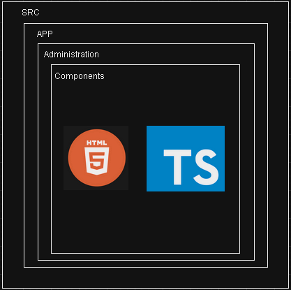

# Cotizador Docs

## Usuarios

### Ubicación Componentes Usuarios

---

 <h2>Creacion usuario Información

 

- `https://transborderuat.eastus.cloudapp.azure.com/cpusuarios/api/v1/usuariosCP/`

**Request**:
~~~
{
	"apellido": "Prueba",
	"cargo": "Tester",
	"celular": "3131313131",
	"ciudad": {
		"codigo": "BOG",
		"id": 77831,
		"nombre": "BOGOTÁ",
		"pais": {
			"codigo": "CO",
			"id": 285,
			"nombre": "COLOMBIA",
			"requiereCodigoZip": false
		}
	},
	"correoElectronico": "example1@transborderaduat.onmicrosoft.com",
	"empresa": "Transborder",
	"nombre": "Prueba",
	"nombreUsuario": "example1@transborderaduat.onmicrosoft.com",
	"numeroDeDocumento": "999999999",
	"pais": {
		"codigo": "CO",
		"id": 285,
		"nombre": "COLOMBIA",
		"requiereCodigoZip": false
	},
	"rol": [
		"tester"
	],
	"tipoDeDocumento": "CEDULA_CIUDADANIA",
	"tipoUsuario": "USUARIO_TRANSBORDER"
}
~~~

**Response**:

<strong>No retorna una respuesta</strong>

---

<h2>Consultar usuarios

 

- `https://transborderuat.eastus.cloudapp.azure.com/msusuarios/api/v1/usuario/find`

**Request**:

~~~
{
	"apellido": "Prueba",
	"nombre": "Prueba",
	"pais": {
		"codigo": "CO",
		"id": 285,
		"nombre": "COLOMBIA",
		"requiereCodigoZip": false
	}
}
~~~

**Response**:

~~~
[
	{
		"nombre": "Prueba Pricing",
		"nombreUpper": "PRUEBA PRICING PRUEBAS INTEGRALES",
		"apellido": "Pruebas integrales",
		"apellidoUpper": null,
		"tipoDeDocumento": "CEDULA_CIUDADANIA",
		"numeroDeDocumento": "1234143095",
		"estado": "ACTIVO",
		"pais": {
			"id": 0,
			"nombre": "COLOMBIA",
			"codigo": null,
			"requiereCodigoZip": null,
			"montoMaximoMercanciaGeneral": null,
			"montoMaximoMercanciaVulnerable": null,
			"aplicaProtocolo": null,
			"mercanciasVulnerables": null
		},
		"ciudad": {
			"id": 0,
			"nombre": "BOGOTA",
			"pais": null,
			"codigo": null
		},
		"email": "pruebapricing@gmail.com",
		"roles": [
			"Gerente de Ventas - Pricing",
			"Gestor de Mercadeo"
		],
		"cargo": "Comercial",
		"celular": "3989898989",
		"idUserAD": "22a49897-27d5-45f2-bc3a-aab42dec7454",
		"nombreUsuario": "pricing.pruebasint@transborderaduat.onmicrosoft.com",
		"primerAcceso": true,
		"aceptoCondiciones": false
	},
	{
		"nombre": "Prueba producto 11",
		"nombreUpper": "PRUEBA PRODUCTO 11 PRUEBAS INTEGRALES",
		"apellido": "pruebas integrales",
		"apellidoUpper": null,
		"tipoDeDocumento": "CEDULA_CIUDADANIA",
		"numeroDeDocumento": "1543080958",
		"estado": "ACTIVO",
		"pais": {
			"id": 0,
			"nombre": "COLOMBIA",
			"codigo": null,
			"requiereCodigoZip": null,
			"montoMaximoMercanciaGeneral": null,
			"montoMaximoMercanciaVulnerable": null,
			"aplicaProtocolo": null,
			"mercanciasVulnerables": null
		},
		"ciudad": {
			"id": 0,
			"nombre": "BOGOTÁ",
			"pais": null,
			"codigo": null
		},
		"email": "asierra@transborder.com.co",
		"roles": [
			"Gestor de Producto",
			"Comercial"
		],
		"cargo": "Producto",
		"celular": "3080968548",
		"idUserAD": "4fa98557-3292-40f6-8acd-c3d479ec8133",
		"nombreUsuario": "usuario.producto11@transborderaduat.onmicrosoft.com",
		"primerAcceso": false,
		"aceptoCondiciones": true
	},
	{
		"nombre": "Prueba",
		"nombreUpper": "PRUEBA PRUEBA",
		"apellido": "Prueba",
		"apellidoUpper": null,
		"tipoDeDocumento": "CEDULA_CIUDADANIA",
		"numeroDeDocumento": "999999999",
		"estado": "ACTIVO",
		"pais": {
			"id": 0,
			"nombre": "COLOMBIA",
			"codigo": null,
			"requiereCodigoZip": null,
			"montoMaximoMercanciaGeneral": null,
			"montoMaximoMercanciaVulnerable": null,
			"aplicaProtocolo": null,
			"mercanciasVulnerables": null
		},
		"ciudad": {
			"id": 0,
			"nombre": "BOGOTÁ",
			"pais": null,
			"codigo": null
		},
		"email": "example1@transborderaduat.onmicrosoft.com",
		"roles": [
			"tester"
		],
		"cargo": "Tester",
		"celular": "3131313131",
		"idUserAD": "44ff7e5e-6948-4fa9-8451-cee80af5c625",
		"nombreUsuario": "example1@transborderaduat.onmicrosoft.com",
		"primerAcceso": true,
		"aceptoCondiciones": false
	}
]
~~~

